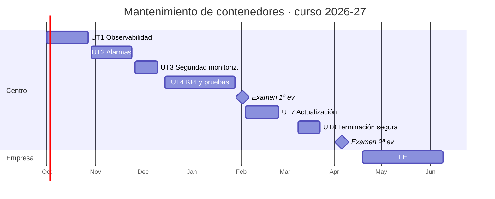

# Calendario de sesiones

Curso 2026-27 · Martes y jueves · 1 h 50 min por sesión · 41 sesiones (82 h) · Presentación el 1 de octubre de 2026 · Formación en empresa del 19 de abril al 9 de junio de 2027

Las fechas están calculadas sobre el calendario escolar de Castelló 2026-27. El curso empieza el jueves 1 de octubre de 2026, y esa primera sesión es la de presentación de la asignatura. El periodo de clase en el centro llega hasta el 16 de abril de 2027, justo antes de la formación en empresa: las 41 sesiones ocupan hasta el 6 de abril y los tres últimos días, el 8, el 13 y el 15, quedan de margen para recuperar entregas y repasar. No son lectivos el 8, 9 y 12 de octubre, el 8 de diciembre, del 22 de diciembre al 7 de enero, del 1 al 5 de marzo (Magdalena), el 19 de marzo y la semana de Pascua (del 25 de marzo al 2 de abril). Si un día cae festivo por sorpresa, todo se corre una sesión.

Cada sesión dura 110 minutos y casi todas tienen la misma forma: una explicación corta al principio (entre 10 y 30 minutos, indicada en la columna de teoría) y el resto de laboratorio. Las sesiones marcadas como práctica no tienen explicación nueva. Las sesiones en **negrita** son evaluables.

## Vista de calendario

Cada día de clase lleva el color de su unidad. Al pasar el ratón por encima se ve qué se explica y qué se practica en esa sesión y qué se entrega; con un clic se va a esa sesión en los apuntes. Los días marcados con estrella son sesiones evaluables. Con el teclado, el tabulador recorre las sesiones y muestra el mismo detalle.

## Listado de sesiones

### Primera evaluación

| Nº | Fecha | UT | Sesión | Tipo | Se explica | Se practica |
|---:|-------|----|--------|------|------------|-------------|
| 1 | 1 oct | UT1 | Presentación y el contenedor de referencia | Teoría y práctica | Presentación de la asignatura, evaluación y cómo se coordina con Despliegue (25 min). Los cuatro flujos que salen de un contenedor: métricas, logs, eventos (20 min). | Desplegar el servicio del curso con compose (en el puesto si aún no existe app01), y observar con docker stats, logs y events mientras se genera tráfico y se para la BD. |
| 2 | 6 oct | UT1 | Métricas de recursos | Teoría y práctica | cgroups v2 y cómo cAdvisor lee de ellos; etiquetas y cardinalidad (20 min). | Desplegar cAdvisor junto al servicio en el puesto, scrape desde la pila mínima de monitorización y gráfica de CPU y memoria por contenedor en Grafana. |
| 3 | 13 oct | UT1 | Instrumentar la aplicación | Teoría y práctica | Tipos de métrica (counter, gauge, histogram, summary) y cómo se instrumenta con la librería cliente (20 min). | Endpoint /metrics en la API con counter e histogram, postgres_exporter en la BD, comprobar ambos en Prometheus. |
| 4 | 15 oct | UT1 | Logs estructurados | Teoría y práctica | Drivers de logs de Docker, logs en JSON con request_id, cómo funciona Promtail y qué indexa Loki (20 min). | Configurar logs JSON, limitar json-file en daemon.json, desplegar Loki y Promtail, comprobar en Grafana Explore. |
| 5 | 20 oct | UT1 | Eventos | Teoría y práctica | Los eventos del demonio Docker y cómo se recogen (10 min). | Recoger eventos en Loki; provocar die, oom y unhealthy y localizarlos. |
| 6 | 22 oct | UT1 | Integridad y almacenamiento | Teoría y práctica | Qué significa verificar una integración: comunicación, recepción, integridad, relojes, retención (15 min). | Ejecutar la tabla de comprobaciones completa y cortar la red tres minutos para ver qué se recupera y qué se pierde. |
| **7** | **27 oct** | **UT1** | **Práctica evaluable UT1** | Práctica evaluable | Aclaración del enunciado (10 min). | Cerrar el informe: flujo de datos, configuración, pruebas y resultado del corte de red. |
| 8 | 29 oct | UT2 | Umbrales sobre contadores | Teoría y práctica | De la métrica a la alarma; alertar por síntomas; rate, increase y ventanas en PromQL (25 min). | Definir cinco umbrales desde la documentación del servicio y comprobar las consultas con tráfico real. |
| 9 | 3 nov | UT2 | Cadenas en logs y eventos | Teoría y práctica | LogQL: selectores, filtros, parsers y métricas sobre logs (20 min). | Consultas LogQL para los mensajes de error conocidos y reglas para oom y unhealthy; probar con logcli. |
| 10 | 5 nov | UT2 | Recording rules | Teoría y práctica | Agregar y correlar: por qué precalcular y cómo se nombran (15 min). | rules.yml con cuatro métricas grabadas y un panel que las use. |
| 11 | 10 nov | UT2 | Reglas de alerta | Teoría y práctica | for, etiquetas, anotaciones y estados de una alerta (15 min). | Convertir los umbrales en reglas con etiquetas y runbook; observar pending y firing. |
| 12 | 12 nov | UT2 | Alertmanager | Teoría y práctica | Árbol de rutas, agrupación, inhibición, silencios y receptores (25 min). | Agrupación, tres rutas, una inhibición y un silencio; correo con Mailpit y Telegram; dos alarmas del mismo grupo en una sola notificación. |
| 13 | 17 nov | UT2 | Integración con incidencias | Teoría y práctica | El webhook de Alertmanager y su JSON (10 min). | Receptor en Flask o n8n que crea y cierra issues en Gitea; probar activación y recuperación. |
| 14 | 19 nov | UT2 | Verificación completa | Práctica | Repaso del procedimiento de verificación (5 min). | Verificar cada alarma: provocarla, medir tiempos, canales, issue creada y cerrada; rellenar la tabla. |
| **15** | **24 nov** | **UT2** | **Práctica evaluable UT2** | Práctica evaluable | Aclaración del enunciado (10 min). | Cerrar el repositorio alerting, el informe de verificación y la tabla de categorización. |
| 16 | 26 nov | UT3 | Auditoría inicial | Teoría y práctica | Superficie de exposición de la monitorización; ss, nmap y tcpdump aplicados a exporters (20 min). | Inventario de puertos en app01, db01 y mon01, escaneo desde otras subredes, matriz de exposición con lo que no debería verse. |
| 17 | 1 dic | UT3 | Red y firewall | Teoría y práctica | Por qué un puerto publicado en Docker salta el firewall del host y cómo se corrige; red dedicada y nftables (15 min). | Mover exporters a la red monitoring o a la IP de gestión, reglas nftables por host y en OPNsense; repetir el escaneo. Trasladar app01 y mon01 a la VPC dev. |
| 18 | 3 dic | UT3 | TLS y autenticación | Teoría y práctica | web.config.file en exporters, bcrypt, mTLS entre Promtail y Loki (20 min). | Certificados de la CA del curso, TLS y basic auth en exporters, mTLS Promtail-Loki; Prometheus sigue en UP y curl sin certificado falla. |
| **19** | **10 dic** | **UT3** | **Práctica evaluable UT3** | Práctica evaluable | Aclaración del enunciado (10 min). | Cerrar la matriz de puertos antes y después, reglas, configuración TLS, evidencias y el documento de política. |
| 20 | 15 dic | UT4 | Fichas de métricas | Teoría y práctica | Señales doradas, USE y RED; la ficha de métrica y las tres categorías (25 min). | Documentar al menos quince métricas del contenedor de referencia y clasificarlas. |
| 21 | 17 dic | UT4 | Indicadores | Teoría y práctica | SLI, SLO y presupuesto de error; los nueve indicadores y sus trampas (25 min). | Implementar los nueve indicadores como recording rules y panel de KPI con umbrales justificados. |
| 22 | 12 ene | UT4 | Catálogo de alarmas | Teoría y práctica | Qué hace un buen runbook (15 min). | Ficha completa para al menos diez alarmas y enlace desde la anotación runbook. |
| 23 | 14 ene | UT4 | Pruebas funcionales | Teoría y práctica | Tipos de prueba y qué comprueba cada una; pytest y newman (20 min). | Suite con diez casos sobre la API e informe JUnit. |
| 24 | 19 ene | UT4 | Calidad de servicio y rendimiento | Teoría y práctica | k6: options, stages, thresholds, checks; leer resultados junto a Grafana (20 min). | Script k6 con umbrales de los SLO; rampas de 10, 50 y 100 usuarios contra pre; capturas del panel. |
| 25 | 21 ene | UT4 | Estrés y seguridad | Teoría y práctica | Estrés frente a carga; ZAP baseline y trivy image (15 min). | Rampa hasta el fallo y tiempo de recuperación; ZAP y trivy sobre la imagen; lista de hallazgos. |
| 26 | 26 ene | UT4 | Documentación de pruebas y seguimiento | Teoría y práctica | La ficha de caso de prueba, el informe de versión y el ciclo de revisión diario, semanal y mensual (20 min). | Fichas de las diez pruebas con evidencias archivadas, informe de la versión, y una revisión semanal ejecutada con la plantilla y un umbral ajustado por merge request. |
| **27** | **28 ene** | **UT4** | **Práctica evaluable UT4** | Práctica evaluable | Aclaración del enunciado (10 min). | Cerrar el dossier de operación: fichas, indicadores, catálogo, informe de pruebas y registro de revisión. |
| **28** | **2 feb** | **EX1** | **Examen 1ª evaluación** | Examen | Sin explicación nueva | Prueba teórico-práctica de UT1 a UT4 en el laboratorio. |

### Segunda evaluación

| Nº | Fecha | UT | Sesión | Tipo | Se explica | Se practica |
|---:|-------|----|--------|------|------------|-------------|
| 29 | 4 feb | UT7 | Inventario de versiones y seguimiento automático | Teoría y práctica | Etiquetas frente a digests, versionado semántico, variantes de imagen; Renovate y por qué no Watchtower (25 min). | Inventario con versión y digest, fijar versiones en compose y Dockerfile; Renovate sobre el repositorio y política de actualización. |
| 30 | 9 feb | UT7 | Escaneo | Teoría y práctica | CVE, CVSS, EPSS y KEV; SBOM; qué hace cada escáner (20 min). | SBOM con Syft; Trivy y Grype sobre aplicación, BD y proxy; tabla de hallazgos. |
| 31 | 11 feb | UT7 | Investigar y decidir | Teoría y práctica | Cómo leer un informe de Trivy y las cuatro soluciones posibles (15 min). | Investigar cinco hallazgos en NVD y OSV, decidir y justificar; reconstruir con base slim y comparar. |
| 32 | 16 feb | UT7 | Actualización en pre | Teoría y práctica | El ciclo de actualización, migraciones y verificación de integridad con SQL (15 min). | Actualizar PostgreSQL y la aplicación en dev y pre con copia previa; recuentos y sumas de control antes y después; pruebas de la UT4. |
| 33 | 18 feb | UT7 | Fallo provocado | Práctica | Clasificación de fallos y plantilla de reporte (10 min). | Versión que falla al actualizar: analizar, clasificar, rollback o parche en 40 minutos y reporte a desarrollo. |
| 34 | 23 feb | UT7 | Trazabilidad | Teoría y práctica | Incidencias enlazadas, CHANGELOG y la etapa de escaneo en el pipeline (15 min). | Registrar las actualizaciones como incidencias con enlaces, actualizar el CHANGELOG y añadir la etapa Trivy que falla con CRITICAL. |
| **35** | **25 feb** | **UT7** | **Práctica evaluable UT7** | Práctica evaluable | Aclaración del enunciado (10 min). | Cerrar inventario y política, informe de vulnerabilidades, evidencia de actualización, reporte de fallo e incidencias. |
| 36 | 9 mar | UT8 | Plan de baja | Teoría y práctica | La baja como cambio: aprobación, ventana, qué se conserva; dónde deja rastro un servicio (25 min). | Inventariar todo lo que el servicio ha dejado en el entorno y redactar la lista de comprobación de baja con verificación por punto. |
| 37 | 11 mar | UT8 | Liberar la infraestructura | Práctica | Orden correcto de la baja (10 min). | Baja del entorno pre: compose, imágenes, redes, VM con tofu destroy, DNS, reglas, credenciales y proyecto archivado; verificar cada punto. |
| 38 | 16 mar | UT8 | Copias y logs | Teoría y práctica | Por qué borrar no borra: SSD, copy-on-write, versionado; borrado criptográfico (20 min). | Destruir la clave de restic, borrar versiones en S3, logs rotados y streams de Loki; intentar recuperar con photorec. |
| 39 | 18 mar | UT8 | Datos y monitorización | Teoría y práctica | DELETE, DROP y VACUUM FULL; anonimización; desconfigurar targets, reglas y dashboards (15 min). | Anonimizar y borrar con VACUUM FULL; retirar targets, reglas, rutas, dashboards y Promtail; comprobar que no quedan series ni alarmas. |
| **40** | **23 mar** | **UT8** | **Práctica evaluable UT8** | Práctica evaluable | Aclaración del enunciado (10 min). | Cerrar el acta de baja con la lista de comprobación completa y una evidencia por punto. |
| **41** | **6 abr** | **EX2** | **Examen 2ª evaluación** | Examen | Sin explicación nueva | Prueba teórico-práctica de UT7 y UT8. Cierre de entregas antes de la formación en empresa. |

## Formación en empresa (19 abr a 9 jun 2027)

| UT | Título | Horas | Evidencias |
|----|--------|------:|------------|
| UT5 | Explotación de logs, accesos y rendimiento | 14 | Ficha de evidencias A5.1 a A5.4 y procedimiento de revisión |
| UT6 | Copias de seguridad y restauración | 14 | Ficha de evidencias A6.1 a A6.3 y plan de copias y restauración |

