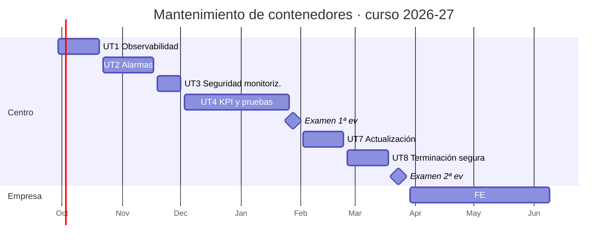

# Calendario de sesiones

Curso 2026-27 · Martes y jueves · 2 h por sesión · 42 sesiones (84 h) · Presentación el 25 de septiembre de 2026 · Formación en empresa del 29 de marzo al 9 de junio de 2027

Las fechas están calculadas sobre el calendario escolar de Castelló 2026-27. La presentación del curso es el viernes 25 de septiembre de 2026; las clases empiezan la semana del 28 de septiembre y la parte en el centro termina el 24 de marzo de 2027, justo antes de la formación en empresa. No son lectivos el 9 y 12 de octubre, el 8 de diciembre, del 22 de diciembre al 7 de enero, del 1 al 5 de marzo (Magdalena) y el 19 de marzo. Si un día cae festivo por sorpresa, todo se corre una sesión.

Las sesiones en **negrita** son evaluables.

## Vista de calendario

Cada día de clase lleva el color de su unidad. Pasa el ratón por encima para ver qué se hace en esa sesión y qué se entrega; haz clic para ir a la actividad correspondiente en los apuntes. Los días marcados con estrella son sesiones evaluables. Con el teclado, el tabulador recorre las sesiones y muestra el mismo detalle.

## Listado de sesiones

### Primera evaluación

| Nº | Fecha | UT | Sesión | Qué se hace |
|---:|-------|----|--------|-------------|
| 1 | 29 sep | UT1 | El contenedor de referencia | Despliegue del servicio del curso en app01. docker stats, logs y events con tráfico; qué pasa al parar la BD. |
| 2 | 1 oct | UT1 | Métricas de recursos | cAdvisor, scrape desde mon01, CPU y memoria por contenedor en Grafana. |
| 3 | 6 oct | UT1 | Instrumentar la aplicación | Endpoint /metrics con counter e histogram; postgres_exporter. |
| 4 | 8 oct | UT1 | Logs estructurados | Logs JSON con request_id, límites de json-file, Promtail hacia Loki. |
| 5 | 13 oct | UT1 | Eventos | Eventos Docker en Loki; provocar die, oom y unhealthy. |
| 6 | 15 oct | UT1 | Integridad y almacenamiento | Tabla de comprobaciones completa; corte de red de 3 minutos. |
| **7** | **20 oct** | **UT1** | **Práctica evaluable UT1** | Informe del contenedor integrado en mon01 con pruebas y evidencias. |
| 8 | 22 oct | UT2 | Umbrales sobre contadores | Cinco umbrales desde la documentación del servicio, consultas PromQL. |
| 9 | 27 oct | UT2 | Cadenas en logs y eventos | Mensajes de error y su LogQL; reglas para oom y unhealthy. |
| 10 | 29 oct | UT2 | Recording rules | rules.yml con métricas grabadas de tasa, errores, latencia y memoria. |
| 11 | 3 nov | UT2 | Reglas de alerta | Reglas con for, etiquetas y runbook; ciclo pending → firing. |
| 12 | 5 nov | UT2 | Alertmanager | Agrupación, rutas, inhibición, silencio; correo y Telegram. |
| 13 | 10 nov | UT2 | Integración con incidencias | Webhook que crea y cierra issues en GitLab. |
| 14 | 12 nov | UT2 | Verificación completa | Procedimiento de verificación de cada alarma con tiempos y canales. |
| **15** | **17 nov** | **UT2** | **Práctica evaluable UT2** | Repositorio alerting, informe de verificación y tabla de categorización. |
| 16 | 19 nov | UT3 | Auditoría inicial | Puertos que escuchan en app01, db01 y mon01; escaneo desde otras subredes. |
| 17 | 24 nov | UT3 | Red y firewall | Exporters en red dedicada; reglas nftables y del firewall de la VPC. |
| 18 | 26 nov | UT3 | TLS y autenticación | Certificados de la CA del curso; TLS y basic auth; mTLS Promtail-Loki. |
| **19** | **1 dic** | **UT3** | **Práctica evaluable UT3** | Matriz de puertos, reglas, TLS, evidencias y política. |
| 20 | 3 dic | UT4 | Fichas de métricas | Quince métricas documentadas y clasificadas. |
| 21 | 10 dic | UT4 | Indicadores | Nueve indicadores como recording rules y panel de KPI con umbrales. |
| 22 | 15 dic | UT4 | Catálogo de alarmas | Diez fichas de alarma con runbook enlazado. |
| 23 | 17 dic | UT4 | Pruebas funcionales | Suite newman o pytest con diez casos e informe JUnit. |
| 24 | 12 ene | UT4 | Calidad de servicio y rendimiento | k6 con umbrales de los SLO; rampas de 10, 50 y 100 usuarios. |
| 25 | 14 ene | UT4 | Estrés y seguridad | Rampa hasta el fallo; ZAP baseline y trivy image. |
| 26 | 19 ene | UT4 | Documentación de pruebas | Fichas de caso de prueba con evidencias; informe de la versión. |
| 27 | 21 ene | UT4 | Seguimiento | Ciclo de revisión y una revisión semanal ejecutada. |
| **28** | **26 ene** | **UT4** | **Práctica evaluable UT4** | Dossier de operación del servicio. |
| **29** | **28 ene** | **EX1** | **Examen 1ª evaluación** | Prueba teórico-práctica de UT1 a UT4 en el laboratorio. |

### Segunda evaluación

| Nº | Fecha | UT | Sesión | Qué se hace |
|---:|-------|----|--------|-------------|
| 30 | 2 feb | UT7 | Inventario de versiones y seguimiento automático | Imágenes y dependencias con versión y digest; fijar versiones. Renovate o Dependabot; política de actualización. |
| 31 | 4 feb | UT7 | Escaneo | SBOM con Syft; Trivy y Grype sobre aplicación, BD y proxy. |
| 32 | 9 feb | UT7 | Investigar y decidir | Cinco hallazgos investigados y decididos; imagen con base slim. |
| 33 | 11 feb | UT7 | Actualización en pre | PostgreSQL y aplicación actualizados con copia previa e integridad verificada. |
| 34 | 16 feb | UT7 | Fallo provocado | Versión que falla: análisis, rollback o parche en 40 minutos, reporte. |
| 35 | 18 feb | UT7 | Trazabilidad | Incidencias con enlaces, CHANGELOG, etapa Trivy en el pipeline. |
| **36** | **23 feb** | **UT7** | **Práctica evaluable UT7** | Inventario, política, informe de vulnerabilidades, actualización, reporte, incidencias. |
| 37 | 25 feb | UT8 | Plan de baja | Inventario de rastros del servicio y lista de comprobación de baja. |
| 38 | 9 mar | UT8 | Liberar la infraestructura | Baja del entorno pre con verificación de cada punto. |
| 39 | 11 mar | UT8 | Copias y logs | Destruir la clave de restic, borrar versiones en S3, logs y streams de Loki; photorec. |
| 40 | 16 mar | UT8 | Datos y monitorización | Anonimizar y borrar con VACUUM FULL; desconfigurar la monitorización. |
| **41** | **18 mar** | **UT8** | **Práctica evaluable UT8** | Acta de baja del entorno pre. |
| **42** | **23 mar** | **EX2** | **Examen 2ª evaluación** | Prueba teórico-práctica de UT7 y UT8. Cierre de entregas antes de la FE. |

## Formación en empresa (29 mar a 9 jun 2027)

| UT | Título | Horas | Evidencias |
|----|--------|------:|------------|
| UT5 | Explotación de logs, accesos y rendimiento | 14 | Ficha de evidencias A5.1 a A5.4 y procedimiento de revisión |
| UT6 | Copias de seguridad y restauración | 14 | Ficha de evidencias A6.1 a A6.3 y plan de copias y restauración |

