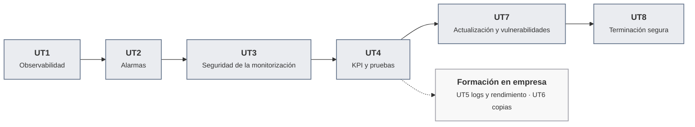

# Mantenimiento del sistema de contenedores

Apuntes de la asignatura · Curso de especialización · 110 h (82 en el centro, 28 en empresa) · Curso 2026-27

Aquí están los apuntes de toda la asignatura, unidad por unidad, con las actividades de cada sesión y las prácticas evaluables. Es el mismo material que se trabaja en clase, ampliado con lo que no cabe en dos horas y con enlaces a la documentación oficial.

## De qué va la asignatura

En [Despliegue de plataformas de contenedores](https://victor-educ.github.io/apuntes-5166/) se monta la plataforma: hipervisor, red, cortafuegos, código de infraestructura, pipeline y monitorización básica. Esta asignatura empieza donde acaba aquella: el servicio ya está en producción y hay que mantenerlo vivo, seguro y bajo control durante meses. Vigilarlo, saber cuándo algo va mal antes de que lo digan los usuarios, probarlo, actualizarlo sin romper nada, tener copias que de verdad se puedan restaurar y, cuando llegue el momento, retirarlo sin dejar rastro.

Las dos asignaturas se cursan a la vez (esta los martes y jueves, la de despliegue los miércoles y viernes) y comparten laboratorio: la VPC dev de Proxmox, el servicio del curso en app01 y la pila de monitorización en mon01. Lo que aquí se llama "contenedor de referencia" es ese servicio.

Estos son los conceptos que vertebran el curso:

- **Observabilidad.** Los cuatro flujos que salen de un contenedor (métricas de recursos, métricas de aplicación, logs y eventos), cómo se sacan fuera con cAdvisor, exporters, Promtail y Loki, y cómo se comprueba que llegan íntegros.
- **Alarmas.** De la métrica al umbral, del umbral a la regla, de la regla a Alertmanager y de ahí a una incidencia con dueño. Recording rules, agrupación, inhibición, silencios y verificación de cada alarma.
- **Seguridad de la monitorización.** Cada exporter es un puerto más. Auditar qué escucha, cerrar lo que sobra, cifrar y autenticar el tráfico de métricas y logs.
- **Indicadores y pruebas.** Fichas de métricas, SLI y SLO, catálogo de alarmas con runbooks, y pruebas funcionales, de carga, de estrés y de seguridad con k6, newman y ZAP.
- **Explotación del sistema en la empresa.** Revisión sistemática de logs, detección de fuerza bruta con fail2ban, análisis de reinicios y crashdumps, línea base de rendimiento.
- **Copias de seguridad en la empresa.** Qué se copia, con qué frecuencia, a dónde, con qué retención y, sobre todo, la restauración de prueba que demuestra que la copia sirve.
- **Actualización y vulnerabilidades.** Versiones y digests, Renovate, SBOM con Syft, escaneo con Trivy y Grype, decisiones justificadas por CVE y actualizaciones trazables de pre a producción.
- **Terminación segura.** Dar de baja un servicio liberando infraestructura, destruyendo copias y logs de forma irrecuperable, borrando datos sensibles y desconfigurando la monitorización.

Primero se mira, luego se avisa, luego se protege lo que mira, y solo entonces se mide, se actualiza y se retira.

## Qué hay en esta web

-   :material-book-open-page-variant: **[Unidades](ut/ut1-observabilidad.md)**

    ---

    Los apuntes de las ocho unidades. Cada una empieza con una introducción (qué hay que saber hacer al terminar, los conceptos y herramientas que aparecen, el plan de sesiones) y sigue con las sesiones en orden: en cada una, la teoría que se explica ese día y, a continuación, su hoja de práctica. La práctica evaluable cierra la unidad con su rúbrica.

-   :material-calendar-month: **[Calendario de sesiones](calendario.md)**

    ---

    Las 41 sesiones del curso con fecha, unidad y lo que se hace en cada una. La vista de calendario muestra el detalle al pasar el ratón y lleva a la actividad con un clic.

-   :material-school: **[Presentación y evaluación](modulo.md)**

    ---

    Resultados de aprendizaje y criterios de evaluación con la unidad donde se trabaja cada uno, cómo se calcula la nota, las herramientas y la metodología.

-   :material-flask: **[Laboratorio](laboratorio.md)**

    ---

    El entorno compartido con la asignatura de despliegue, qué se añade en esta (Loki, Promtail, restic, MinIO, herramientas de escaneo), convenciones y cómo recuperarlo.

-   :material-console: **[Chuleta de comandos](chuleta.md)**

    ---

    Docker, PromQL y LogQL, Alertmanager, nftables, k6 y newman, fail2ban, restic, Trivy y Syft, y el borrado seguro.

-   :material-book-alphabet: **[Glosario](glosario.md)**

    ---

    Los términos de la asignatura en una o dos frases, con la unidad donde se explican a fondo.

-   :material-book-plus: **[Para ampliar](ampliacion.md)**

    ---

    Los apartados de cada unidad que van más allá de lo que se hace en clase y los enlaces para seguir por cuenta propia, ordenados por unidad.

-   :material-link-variant: **[Bibliografía y enlaces](recursos.md)**

    ---

    Documentación oficial de cada herramienta, libros, sitios donde practicar y créditos de las imágenes.

-   :material-package-variant-closed: **[Despliegue de plataformas de contenedores](https://victor-educ.github.io/apuntes-5166/)**

    ---

    La asignatura hermana. Ahí está cómo se construyó el laboratorio sobre el que se trabaja aquí: Proxmox, la VPC, el cortafuegos, OpenTofu, Jenkins y Prometheus.

## Unidades

| UT | Título | Horas | Dónde | RA · CE |
|----|--------|------:|-------|---------|
| [UT1](ut/ut1-observabilidad.md) | Observabilidad de contenedores: métricas, logs y eventos | 14 | Centro | RA1 a |
| [UT2](ut/ut2-alarmas.md) | Umbrales, agregación y gestión de alarmas | 16 | Centro | RA1 b–e |
| [UT3](ut/ut3-seguridad-monitorizacion.md) | Seguridad de las comunicaciones de monitorización | 8 | Centro | RA1 f, g |
| [UT4](ut/ut4-kpi-pruebas.md) | Indicadores, KPI y pruebas del servicio | 16 | Centro | RA2 a–f |
| [UT5](ut/ut5-logs-accesos-rendimiento.md) | Explotación de logs, accesos y rendimiento | 14 | Empresa | RA3 a–d |
| [UT6](ut/ut6-copias-seguridad.md) | Copias de seguridad y restauración | 14 | Empresa | RA4 a, b, c |
| [UT7](ut/ut7-actualizacion-vulnerabilidades.md) | Actualización y gestión de vulnerabilidades | 14 | Centro | RA4 d–i |
| [UT8](ut/ut8-terminacion-segura.md) | Terminación segura del contenedor | 10 | Centro | RA5 a–d |

Las unidades del centro van seguidas de octubre a marzo: la UT8 cierra el 23 de marzo. Los exámenes de evaluación van después de la UT4 (primera evaluación, 2 de febrero de 2027) y después de la UT8 (segunda evaluación, 6 de abril de 2027); las dos sesiones de examen son las 4 h que faltan para las 110 del módulo. Los tres últimos días de clase, el 8, el 13 y el 15 de abril, quedan de margen para recuperar entregas y repasar antes de la formación en empresa.

## Cómo usar estos apuntes

- Conviene leer la sesión antes de clase. Cada unidad está ordenada por sesiones, con la teoría de ese día seguida de su hoja de práctica. En clase la explicación es corta y el laboratorio largo.
- Los comandos están pensados para copiarlos en el laboratorio. Si algo no funciona igual en la versión instalada, el primer sitio donde mirar es la sección "Errores frecuentes" de la unidad.
- Las hojas de práctica numeradas (A1.1, A1.2...) se hacen en la sesión que se indica. Lo que va más allá de lo que se hace en clase está apartado en [Para ampliar](ampliacion.md), para no cargar las unidades. La práctica evaluable cierra la unidad y se entrega por Aules.
- Conviene documentar sobre la marcha: una captura con fecha, la salida de un comando, el fichero de configuración. Al final de la unidad eso es la práctica.

## Antes de empezar

Se da por hecho lo mismo que en la asignatura de despliegue: terminal de Linux, redes básicas, Docker y Git. No hace falta tener el laboratorio montado para empezar, porque no existe todavía: la asignatura arranca el 1 de octubre con Docker en el puesto del alumno, con el servicio del curso (nginx, API y PostgreSQL en un solo compose) y una pila mínima de monitorización en localhost. El laboratorio va llegando por fases desde la asignatura de despliegue: app01 y mon01 el 14 de octubre, la VPC dev en noviembre y el cortafuegos en diciembre, y cada unidad indica sobre qué se trabaja ese día. La página de [laboratorio](laboratorio.md) detalla qué hay disponible en cada momento.

## Sobre estos apuntes

Este material lo ha escrito Víctor Sellés para la asignatura con el apoyo de Claude; la nota completa sobre cómo se ha elaborado está en la [página de presentación](modulo.md). Los errores se pueden comunicar en clase o abrir como issue en el [repositorio](https://github.com/victor-educ/apuntes-5169). El texto se publica con licencia [CC BY-SA 4.0](https://creativecommons.org/licenses/by-sa/4.0/deed.es); las imágenes de terceros llevan su atribución al pie. La versión publicada aparece en el pie de cada página.
