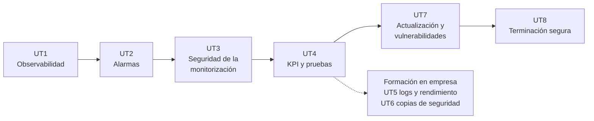

# Mantenimiento del sistema de contenedores

Apuntes de la asignatura · Curso de especialización · 112 h (84 en el centro, 28 en empresa) · Curso 2026-27

Aquí están los apuntes de toda la asignatura, unidad por unidad, con las actividades de cada sesión y las prácticas evaluables. Es el mismo material que se trabaja en clase, ampliado con lo que no cabe en dos horas y con enlaces a la documentación oficial.

## De qué va la asignatura

En [Despliegue de plataformas de contenedores](https://victor-educ.github.io/apuntes-5166/) montáis la plataforma: hipervisor, red, cortafuegos, código de infraestructura, pipeline y monitorización básica. Esta asignatura empieza donde acaba aquella: el servicio ya está en producción y hay que mantenerlo vivo, seguro y bajo control durante meses. Vigilarlo, saber cuándo algo va mal antes de que lo digan los usuarios, probarlo, actualizarlo sin romper nada, tener copias que de verdad se puedan restaurar y, cuando llegue el momento, retirarlo sin dejar rastro.

Las dos asignaturas se cursan a la vez (esta los martes y jueves, la de despliegue los miércoles y viernes) y comparten laboratorio: la VPC dev de Proxmox, el servicio del curso en app01 y la pila de monitorización en mon01. Lo que aquí llamamos "contenedor de referencia" es ese servicio.

Estos son los conceptos que vertebran el curso:

- **Observabilidad.** Los tres flujos que sale de un contenedor (métricas, logs y eventos), cómo se sacan fuera con cAdvisor, exporters, Promtail y Loki, y cómo se comprueba que llegan íntegros.
- **Alarmas.** De la métrica al umbral, del umbral a la regla, de la regla a Alertmanager y de ahí a una incidencia con dueño. Recording rules, agrupación, inhibición, silencios y verificación de cada alarma.
- **Seguridad de la monitorización.** Cada exporter es un puerto más. Auditar qué escucha, cerrar lo que sobra, cifrar y autenticar el tráfico de métricas y logs.
- **Indicadores y pruebas.** Fichas de métricas, SLI y SLO, catálogo de alarmas con runbooks, y pruebas funcionales, de carga, de estrés y de seguridad con k6, newman y ZAP.
- **Explotación del sistema en la empresa.** Revisión sistemática de logs, detección de fuerza bruta con fail2ban, análisis de reinicios y crashdumps, línea base de rendimiento.
- **Copias de seguridad en la empresa.** Qué se copia, con qué frecuencia, a dónde, con qué retención y, sobre todo, la restauración de prueba que demuestra que la copia sirve.
- **Actualización y vulnerabilidades.** Versiones y digests, Renovate, SBOM con Syft, escaneo con Trivy y Grype, decisiones justificadas por CVE y actualizaciones trazables de pre a producción.
- **Terminación segura.** Dar de baja un servicio liberando infraestructura, destruyendo copias y logs de forma irrecuperable, borrando datos sensibles y desconfigurando la monitorización.

## Qué hay en esta web

-   :material-book-open-page-variant: **[Unidades](ut/ut1-observabilidad.md)**

    ---

    Los apuntes de las ocho unidades. Cada una empieza con lo que tienes que saber hacer al terminar, desarrolla el contenido con ejemplos y comandos, y cierra con las actividades de cada sesión, la práctica evaluable y su rúbrica.

-   :material-calendar-month: **[Calendario de sesiones](calendario.md)**

    ---

    Las 41 sesiones del curso con fecha, unidad y lo que se hace en cada una. La vista de calendario muestra el detalle al pasar el ratón y lleva a la actividad con un clic.

-   :material-school: **[Presentación y evaluación](modulo.md)**

    ---

    Resultados de aprendizaje y criterios de evaluación con la unidad donde se trabaja cada uno, cómo se calcula la nota, las herramientas y la metodología.

-   :material-flask: **[Laboratorio](laboratorio.md)**

    ---

    El entorno compartido con la asignatura de despliegue, qué se añade en esta (Loki, Promtail, restic, MinIO, herramientas de escaneo), convenciones y cómo recuperarlo.

-   :material-console: **[Chuleta de comandos](chuleta.md)**

    ---

    Docker, PromQL y LogQL, Alertmanager, nftables, k6 y newman, fail2ban, restic, Trivy y Syft, y el borrado seguro.

-   :material-book-alphabet: **[Glosario](glosario.md)**

    ---

    Los términos de la asignatura en una o dos frases, con la unidad donde se explican a fondo.

-   :material-link-variant: **[Bibliografía y enlaces](recursos.md)**

    ---

    Documentación oficial de cada herramienta, libros, sitios donde practicar y créditos de las imágenes.

-   :material-package-variant-closed: **[Despliegue de plataformas de contenedores](https://victor-educ.github.io/apuntes-5166/)**

    ---

    La asignatura hermana. Ahí está cómo se construyó el laboratorio sobre el que trabajamos aquí: Proxmox, la VPC, el cortafuegos, OpenTofu, Jenkins y Prometheus.

## Unidades

| UT | Título | Horas | Dónde | RA · CE |
|----|--------|------:|-------|---------|
| [UT1](ut/ut1-observabilidad.md) | Observabilidad de contenedores: métricas, logs y eventos | 14 | Centro | RA1 a |
| [UT2](ut/ut2-alarmas.md) | Umbrales, agregación y gestión de alarmas | 16 | Centro | RA1 b–e |
| [UT3](ut/ut3-seguridad-monitorizacion.md) | Seguridad de las comunicaciones de monitorización | 8 | Centro | RA1 f, g |
| [UT4](ut/ut4-kpi-pruebas.md) | Indicadores, KPI y pruebas del servicio | 18 | Centro | RA2 a–f |
| [UT5](ut/ut5-logs-accesos-rendimiento.md) | Explotación de logs, accesos y rendimiento | 14 | Empresa | RA3 a–d |
| [UT6](ut/ut6-copias-seguridad.md) | Copias de seguridad y restauración | 14 | Empresa | RA4 a, b, c |
| [UT7](ut/ut7-actualizacion-vulnerabilidades.md) | Actualización y gestión de vulnerabilidades | 14 | Centro | RA4 d–i |
| [UT8](ut/ut8-terminacion-segura.md) | Terminación segura del contenedor | 10 | Centro | RA5 a–d |

Las unidades del centro van seguidas de octubre a marzo. Las tres sesiones de abril anteriores a la formación en empresa quedan para recuperación de entregas y repaso.

## Cómo usar estos apuntes

- Lee la unidad antes de la sesión. En clase la explicación es corta y el laboratorio largo.
- Los comandos están pensados para copiarlos en el laboratorio. Si algo no funciona igual en tu versión, mira primero la sección "Errores frecuentes" de la unidad.
- Las actividades numeradas (A1.1, A1.2...) se hacen en la sesión que se indica. La práctica evaluable cierra la unidad y se entrega por Aules.
- Documenta sobre la marcha: una captura con fecha, la salida de un comando, el fichero de configuración. Al final de la unidad eso es la práctica.

## Antes de empezar

Se da por hecho lo mismo que en la asignatura de despliegue: terminal de Linux, redes básicas, Docker y Git. Para seguir esta asignatura desde el primer día tienes que tener el laboratorio de aquella operativo hasta la UT7 (Prometheus y Grafana en mon01), porque la UT1 de aquí empieza conectando el servicio a esa pila. Si vas por detrás, la página de [laboratorio](laboratorio.md) dice qué es lo mínimo que necesitas.

## Sobre estos apuntes

Los he escrito yo, Víctor, para la asignatura, apoyándome en Claude (el asistente de IA de Anthropic) para redactar, ampliar y revisar el material a partir de mis propios apuntes y de la planificación del curso. Todo lo que hay aquí lo he revisado yo y lo voy corrigiendo durante el curso; si algo está mal, la responsabilidad es mía, no de la herramienta. Si encuentras un error, dímelo en clase o abre un issue en el [repositorio](https://github.com/victor-educ/apuntes-5169). El texto se publica con licencia [CC BY-SA 4.0](https://creativecommons.org/licenses/by-sa/4.0/deed.es); las imágenes de terceros llevan su atribución al pie. La versión publicada aparece en el pie de cada página.
