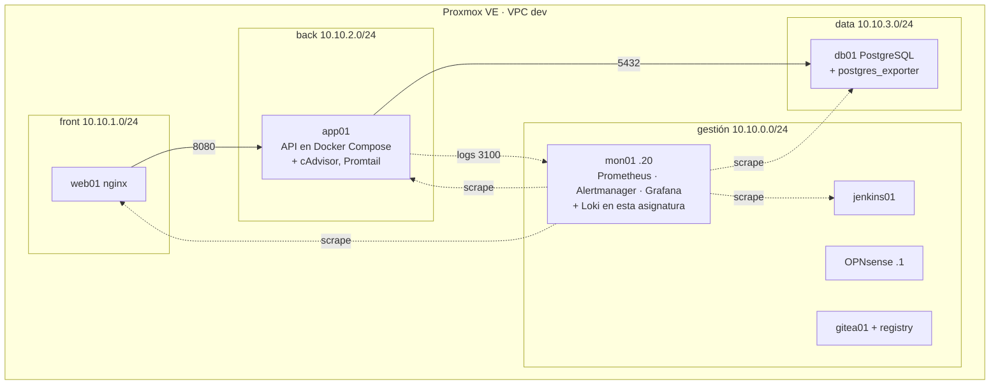

# El laboratorio

Esta asignatura no monta un laboratorio nuevo: trabaja sobre el que se construye en [Despliegue de plataformas de contenedores](https://victor-educ.github.io/apuntes-5166/laboratorio/). Aquí se describe lo que hace falta tener operativo, lo que se añade en cada unidad y las convenciones propias.

## Lo que tiene que existir antes de la UT1

Ese es el entorno completo, y no existe hasta diciembre. Las dos asignaturas van en paralelo y la de despliegue construye la VPC en noviembre y el cortafuegos en diciembre, mientras que esta empieza a vigilar contenedores el 1 de octubre. Por eso el curso arranca con un entorno provisional y se migra al definitivo cuando la otra asignatura lo tiene listo.

## Entorno provisional (octubre y noviembre)

Con lo que se hace en la primera semana de la asignatura de despliegue (Proxmox instalado y la plantilla cloud-init) basta para arrancar:

| VM | Red | Qué lleva | Quién la crea |
|----|-----|-----------|---------------|
| app01 | vmbr0, la red del aula, IP por DHCP | El servicio del curso en Docker Compose (nginx + API + PostgreSQL en un solo host) y, según avanza la UT1, cAdvisor, exporters y Promtail | Clonada de la plantilla 9000 en la sesión 3 de despliegue (14 de octubre); hasta entonces, el servicio se levanta en Docker en el propio puesto del alumno |
| mon01 | vmbr0, IP por DHCP | Prometheus, Alertmanager y Grafana con el compose que se da en la sesión 1 de esta asignatura; Loki se añade en la UT1 | Clonada igual que app01 |

Sin firewall y sin subredes: todo está en la red del aula. Es suficiente para las UT1 y UT2, que van de sacar datos del contenedor y convertirlos en alarmas. La seguridad de esas comunicaciones se trata en la UT3 precisamente cuando hay dónde aplicarla.

**Migración al entorno definitivo.** La UT3 de esta asignatura (24 de noviembre a 3 de diciembre) coincide con la UT3 de despliegue, en la que se instala OPNsense y se crean las zonas. En esa quincena app01 pasa a la subred back, se separan web01 y db01 según lo que pida la asignatura de despliegue, y mon01 pasa a la subred de gestión con la IP 10.10.0.20. Como las VM son clones de plantilla y la configuración está en compose y en Git, mover una VM de red es cambiar el bridge y la IP; los apuntes de la UT3 explican el orden para no perder los datos de Prometheus y Loki.

El entorno **pre** hace falta a partir de la UT7 (febrero) y es el que se da de baja en la UT8. Se crea con OpenTofu desde el código de la UT5 de despliegue, que termina en enero, así que llega a tiempo.

## Lo que se añade en cada unidad

| Unidad | Qué se instala o configura | Dónde |
|--------|---------------------------|-------|
| UT1 | cAdvisor, postgres_exporter, endpoint /metrics en la API, Promtail, Loki, límites del driver de logs | app01, db01, mon01 |
| UT2 | rules.yml, alerts.yml, Alertmanager con rutas y receptores, Mailpit, receptor webhook de incidencias | mon01 |
| UT3 | Red Docker monitoring, reglas nftables por host, certificados de la CA del curso, TLS y basic auth en exporters, mTLS Promtail-Loki | app01, db01, mon01, OPNsense |
| UT4 | k6, newman o pytest, OWASP ZAP (contenedor), panel de KPI, catálogo de alarmas | Puesto del alumno, mon01 |
| UT7 | Renovate o Dependabot, Syft, Trivy, Grype, etapa de escaneo en el pipeline | Puesto, gitea01, jenkins01 |
| UT8 | photorec/testdisk, herramientas de borrado | Puesto, hosts de pre |
| UT5 y UT6 (empresa) | fail2ban, restic, MinIO o el destino de copias de la empresa | Lo que indique el tutor |

## Recursos por puesto

La pila de monitorización con Loki y el servicio con exporters consumen algo más que en la asignatura de despliegue. Con la VM de Proxmox en 12 GB de RAM va justo; con 16 GB va bien. Las pruebas de carga de la UT4 se lanzan desde el puesto del alumno, no desde dentro de la VPC, para no falsear las métricas de los hosts.

| VM | RAM | Notas |
|----|----:|-------|
| mon01 | 3 GB | Loki con retención de 7 días ocupa 2 a 5 GB de disco por servicio del curso |
| app01 | 2 GB | Con cAdvisor y Promtail |
| db01 | 2 GB | Con postgres_exporter |
| web01 | 1 GB | |
| OPNsense | 1 GB | |

## Convenciones

Las mismas de la asignatura de despliegue (IDs, usuario `ops`, dominios `dev.lab` y `pre.lab`, `.1` router, `.10` a `.99` servidores fijos) más estas:

| Cosa | Convención |
|------|------------|
| Puertos de monitorización | 9100 node_exporter, 8080 cAdvisor, 9187 postgres_exporter, 9102 /metrics de la app, 9080 Promtail, 3100 Loki, 9090 Prometheus, 9093 Alertmanager, 3000 Grafana, 8025 Mailpit |
| Etiquetas de alerta | `severity` (critical, warning, info), `team` (ops, dev), `service` (app, db, web), `env` (dev, pre, pro), `origen` (prometheus, loki, cadvisor, docker-events) |
| Nombres de recording rules | `nivel:métrica:operación`, por ejemplo `app:errors:ratio5m` |
| Repositorio de alertas | `alerting` en Gitea: rules.yml, alerts.yml, alertmanager.yml, receptor webhook |
| Evidencias de pruebas | `tests/evidence/<versión>/` en el repositorio del servicio |
| Copias | Repositorio restic en MinIO (`s3:http://10.10.0.30:9000/backups`), contraseña en `/etc/restic/pass` con permisos 600 |
| Imágenes | Etiqueta con versión concreta; digest fijado en pre y pro |

## Repositorios que vais a crear o ampliar

1. `alerting` (UT2): reglas, Alertmanager y receptor webhook.
2. `servicio` (de la asignatura de despliegue, se amplía en UT1, UT4 y UT7): instrumentación, pruebas, evidencias, Renovate, etapa de escaneo.
3. `monitoring` (de la asignatura de despliegue, se amplía en UT1 y UT3): Loki, Promtail, TLS.
4. `operacion` (UT4): fichas de métricas, catálogo de alarmas y runbooks, registros de revisión.

Ninguno puede contener un secreto. El hook de gitleaks se instala antes del primer push.

## Cuando algo se rompe

El orden de recuperación es el mismo que en la asignatura de despliegue: snapshot de la VM, recrear desde plantilla o con OpenTofu, snapshot de la VM de Proxmox, reinstalar. Añade a la lista de cosas que guardar fuera del equipo: los ficheros de reglas y de Alertmanager (están en Git, pero comprueba que el último push es reciente), el JSON de los dashboards y la contraseña del repositorio restic. Sin esa contraseña las copias no sirven, y en la UT8 lo veréis desde el otro lado: destruirla es la forma de borrarlas.

Una regla concreta de esta asignatura: antes de cada actividad que provoque fallos a propósito (matar la BD, llenar la memoria, cortar la red), haz snapshot. El objetivo es observar el fallo, no pasar la sesión reinstalando.
