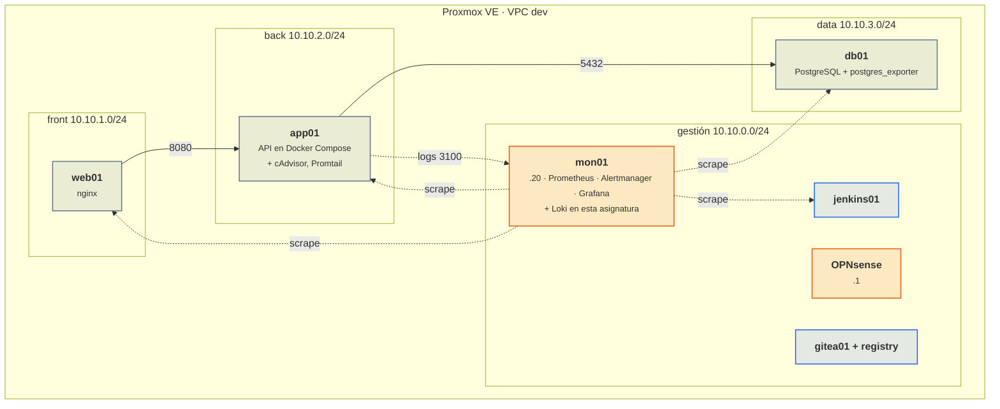

# El laboratorio

Esta asignatura no monta un laboratorio nuevo: trabaja sobre el que se construye en [Despliegue de plataformas de contenedores](https://victor-educ.github.io/apuntes-5166/laboratorio/). Aquí se describe lo que hace falta tener operativo, lo que se añade en cada unidad y las convenciones propias.

## Lo que tiene que existir antes de la UT1

Mantenimiento no construye este laboratorio: lo construye Despliegue. Aquí en naranja lo que vigila, que es lo que sí se monta en esta asignatura.

Ese es el entorno completo, y no existe hasta diciembre. Las dos asignaturas van en paralelo y la de despliegue construye la VPC en noviembre y el cortafuegos en diciembre, mientras que esta empieza a vigilar contenedores el 1 de octubre. Por eso el curso arranca con un entorno provisional y se migra al definitivo cuando la otra asignatura lo tiene listo.

## Entorno provisional (octubre y noviembre)

Con lo que se hace en la primera semana de la asignatura de despliegue (Proxmox instalado y la plantilla cloud-init) basta para arrancar. El entorno provisional tiene dos fases:

**Del 1 al 13 de octubre (sesiones 1, 2 y 3): no existe ninguna VM del laboratorio.** Todo corre con Docker en el puesto del alumno, en localhost: el servicio del curso entero (nginx, API y PostgreSQL en un solo compose) y, en otro compose, la pila mínima de monitorización (Prometheus, Alertmanager y Grafana). Los agentes de la UT1 van en un tercer compose junto al servicio. Si las tres pilas comparten una red de Docker, se llaman entre ellas por el nombre del servicio de compose y no hace falta ninguna IP.

**Desde el 14 de octubre: dos VM.** Son las de la tabla, clonadas de la plantilla cloud-init en la sesión 3 de la asignatura de despliegue, que es también la que deja Docker Engine instalado en ellas.

| VM | Red | Qué lleva | Quién la crea |
|----|-----|-----------|---------------|
| app01 | vmbr0, la red del aula, IP por DHCP | El servicio del curso en Docker Compose (nginx + API + PostgreSQL en un solo host) y, según avanza la UT1, cAdvisor, exporters y Promtail | Clonada de la plantilla 9000 en la sesión 3 de despliegue (14 de octubre), con Docker Engine ya instalado por esa asignatura; hasta el 13 de octubre no existe y el servicio se levanta con Docker en el puesto del alumno |
| mon01 | vmbr0, IP por DHCP | Prometheus, Alertmanager y Grafana con el compose que se da en la sesión 1 de esta asignatura; Loki se añade en la UT1 | Clonada igual que app01, y con Docker Engine igual que app01; hasta el 13 de octubre la pila mínima corre en el puesto |

Sin firewall y sin subredes: todo está en la red del aula. Es suficiente para las UT1 y UT2, que van de sacar datos del contenedor y convertirlos en alarmas. La seguridad de esas comunicaciones se trata en la UT3 precisamente cuando hay dónde aplicarla.

**web01 y db01 no existen hasta diciembre**, cuando la asignatura de despliegue separa las zonas. En octubre y en noviembre no hay que buscarlas ni inventarlas: la base de datos es el servicio `db` del compose del servicio y el proxy es el servicio `nginx` del mismo compose, los dos en el mismo host que la API. Las subredes 10.10.x.x llegan con la VPC (18 de noviembre) y el cortafuegos, con OPNsense (9 de diciembre).

**Migración al entorno definitivo.** La UT3 de esta asignatura (26 de noviembre a 10 de diciembre) coincide con la UT3 de despliegue, en la que se instala OPNsense y se crean las zonas. En esa quincena app01 pasa a la subred back, se separan web01 y db01 según lo que pida la asignatura de despliegue, y mon01 pasa a la subred de gestión con la IP 10.10.0.20. Como las VM son clones de plantilla y la configuración está en compose y en Git, mover una VM de red es cambiar el bridge y la IP; los apuntes de la UT3 explican el orden para no perder los datos de Prometheus y Loki.

El entorno **pre** hace falta desde la UT4, en la sesión 23 (14 de enero), se vuelve a usar en la UT7 y es el que se da de baja en la UT8. Lo crea la UT5 de despliegue: las tres VM de pre salen del `tofu apply` de su A5.3, el 18 de diciembre, así que llega a tiempo.

## Lo que se añade en cada unidad

| Unidad | Qué se instala o configura | Dónde |
|--------|---------------------------|-------|
| UT1 | cAdvisor, postgres_exporter, endpoint /metrics en la API, Promtail, Loki, límites del driver de logs | Puesto del alumno hasta el 13 de octubre; app01 y mon01 desde el 14 |
| UT2 | rules.yml, alerts.yml, Alertmanager con rutas y receptores, Mailpit, receptor webhook de incidencias | mon01 |
| UT3 | Red Docker monitoring, reglas nftables por host, certificados de la CA del curso, TLS y basic auth en exporters, mTLS Promtail-Loki | app01, db01, mon01, OPNsense |
| UT4 | k6, newman o pytest, OWASP ZAP (contenedor), panel de KPI, catálogo de alarmas | Puesto del alumno, mon01 |
| UT7 | Renovate o Dependabot, Syft, Trivy, Grype, etapa de escaneo en el pipeline | Puesto, gitea01, jenkins01 |
| UT8 | photorec/testdisk, herramientas de borrado | Puesto, hosts de pre |
| UT5 y UT6 (empresa) | fail2ban, restic, MinIO o el destino de copias de la empresa | Lo que indique el tutor |

## Recursos por puesto

La pila de monitorización con Loki y el servicio con exporters consumen algo más que en la asignatura de despliegue, así que la cuenta se hace con todo encendido. Las pruebas de carga de la UT4 se lanzan desde el puesto del alumno, no desde dentro de la VPC, para no falsear las métricas de los hosts.

**Presupuesto de memoria.** El peor momento del curso es febrero y marzo, con la UT6 de Despliegue encendida (Jenkins, su agente y el registry) a la vez que la pila de Mantenimiento (Prometheus, Alertmanager, Grafana y Loki) y el servicio completo. Sumando lo que está arrancado al mismo tiempo:

| VM encendida en el pico | RAM |
|-------------------------|----:|
| OPNsense | 1 GB |
| web01 | 1 GB |
| app01 | 2 GB |
| db01 | 2 GB |
| mon01 | 3 GB |
| jenkins01, el controlador | 2 GB |
| agent01, el agente de Jenkins | 2 GB |
| gitea01 con el registry | 1 GB |
| **Total de las VM** | **14 GB** |
| El propio Proxmox (ZFS o LVM, servicios y consola) | 2 GB |
| **La VM de Proxmox en el pico** | **16 GB** |

Esa es la cifra de referencia para las dos asignaturas: **16 GB para la VM de Proxmox en el peor momento**. Con menos se trabaja igual, apagando lo que no se esté usando. Por orden de lo que menos duele:

1. `jenkins01` y `agent01` (4 GB) fuera de las sesiones de integración continua.
2. `gitea01` (1 GB): solo hace falta al clonar y al empujar; se enciende un rato o se usa GitHub.
3. `web01` (1 GB): solo hace falta cuando se prueba el camino completo desde fuera.
4. `db01` (2 GB) en las sesiones que son solo de pipeline, sin desplegar.

Con 12 GB se llega bien apagando `gitea01`, `web01` y `db01` en las sesiones de integración continua (quedan 10 GB). Con 8 GB se sigue el curso hasta la UT5 de Despliegue y la UT2 de Mantenimiento, pero no caben Jenkins con su agente y la pila de monitorización a la vez. MinIO no entra en la cuenta si lo monta el profesor para toda el aula.

Loki con retención de 7 días ocupa de 2 a 5 GB de disco por servicio vigilado, y eso es disco, no memoria.

## Convenciones

La tabla única del laboratorio (VNets y subredes, IP de cada máquina, IDs de VM, dominios y puertos) está en la [página del laboratorio de Despliegue](https://victor-educ.github.io/apuntes-5166/laboratorio/#convenciones) y manda también aquí. Lo que sigue es solo lo propio de Mantenimiento.

| Cosa | Convención |
|------|------------|
| Puertos de monitorización | 9100 node_exporter, 8081 cAdvisor publicado en el host (dentro de la red de Docker sigue siendo `cadvisor:8080`, porque el 8080 del host lo ocupa la API), 9187 postgres_exporter, 9102 `/metrics` de la app, 9113 nginx-prometheus-exporter, 9080 Promtail, 3100 Loki, 9090 Prometheus, 9093 Alertmanager, 3000 Grafana por detrás de su nginx, 8025 Mailpit |
| Etiquetas de alerta | `severity` (critical, warning, info), `team` (ops, dev), `service` (app, db, web), `env` (dev, pre, pro), `origen` (prometheus, loki, cadvisor, docker-events) |
| Nombres de recording rules | `nivel:métrica:operación`, por ejemplo `app:errors:ratio5m` |
| Repositorio de alertas | `alerting` en Gitea: rules.yml, alerts.yml, alertmanager.yml, receptor webhook |
| Evidencias de pruebas | `tests/evidence/<versión>/` en el repositorio del servicio |
| Copias | Repositorio restic en MinIO (`s3:http://10.10.0.30:9000/backups`), contraseña en `/etc/restic/pass` con permisos 600. El bucket `backups` y la credencial `restic` nacen con el propio MinIO el 8 de enero, en la A5.4 de Despliegue; el `restic init` se hace una sola vez en todo el curso, en el paso 4 de la A7.4 |
| Imágenes | Etiqueta con versión concreta, digest fijado en pre y pro; se publican en `registry.lab:5000` |

Las direcciones que más se usan en esta asignatura, por si hace falta tenerlas a mano: `mon01` es la `10.10.0.20` en gestión, `web01` la `10.10.1.10` en front, `app01` la `10.10.2.10` en back y `db01` la `10.10.3.10` en data. Ni web01, ni app01, ni db01 tienen pata de gestión: Prometheus llega a sus exporters atravesando el cortafuegos, que es justo lo que se abre en la UT3.

## Repositorios que hay que crear o ampliar

1. `alerting` (UT2): reglas, Alertmanager y receptor webhook.
2. `servicio` (de la asignatura de despliegue, se amplía en UT1, UT4 y UT7): instrumentación, pruebas, evidencias, Renovate, etapa de escaneo.
3. `monitoring` (de la asignatura de despliegue, se amplía en UT1 y UT3): Loki, Promtail, TLS.
4. `operacion` (UT4): fichas de métricas, catálogo de alarmas y runbooks, registros de revisión.

Ninguno puede contener un secreto. El hook de gitleaks se instala antes del primer push.

## Cuando algo se rompe

El orden de recuperación es el mismo que en la asignatura de despliegue: snapshot de la VM, recrear desde plantilla o con OpenTofu, snapshot de la VM de Proxmox, reinstalar. A la lista de cosas que guardar fuera del equipo se añaden los ficheros de reglas y de Alertmanager (están en Git, pero conviene comprobar que el último push es reciente), el JSON de los dashboards y la contraseña del repositorio restic. Sin esa contraseña las copias no sirven, y en la UT8 esto reaparece desde el otro lado: destruirla es la forma de borrarlas.

Una regla concreta de esta asignatura: antes de cada actividad que provoque fallos a propósito (matar la BD, llenar la memoria, cortar la red), conviene hacer un snapshot. El objetivo es observar el fallo, no pasar la sesión reinstalando.
