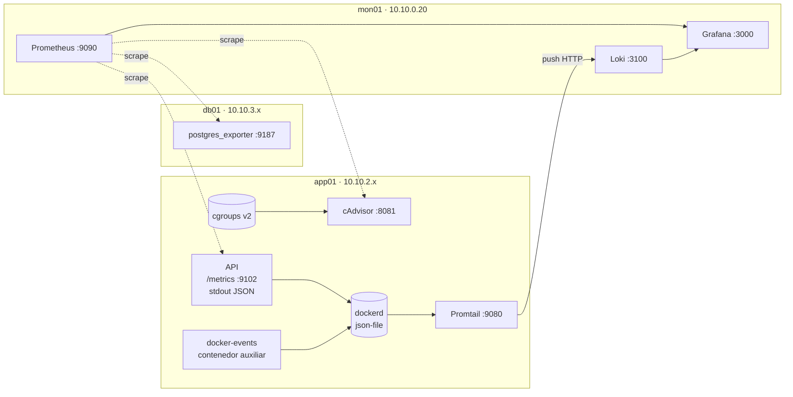
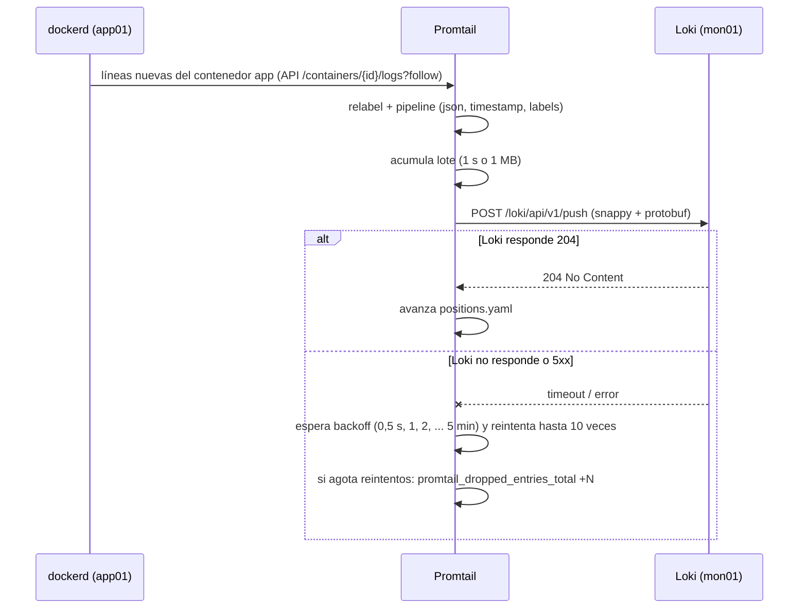
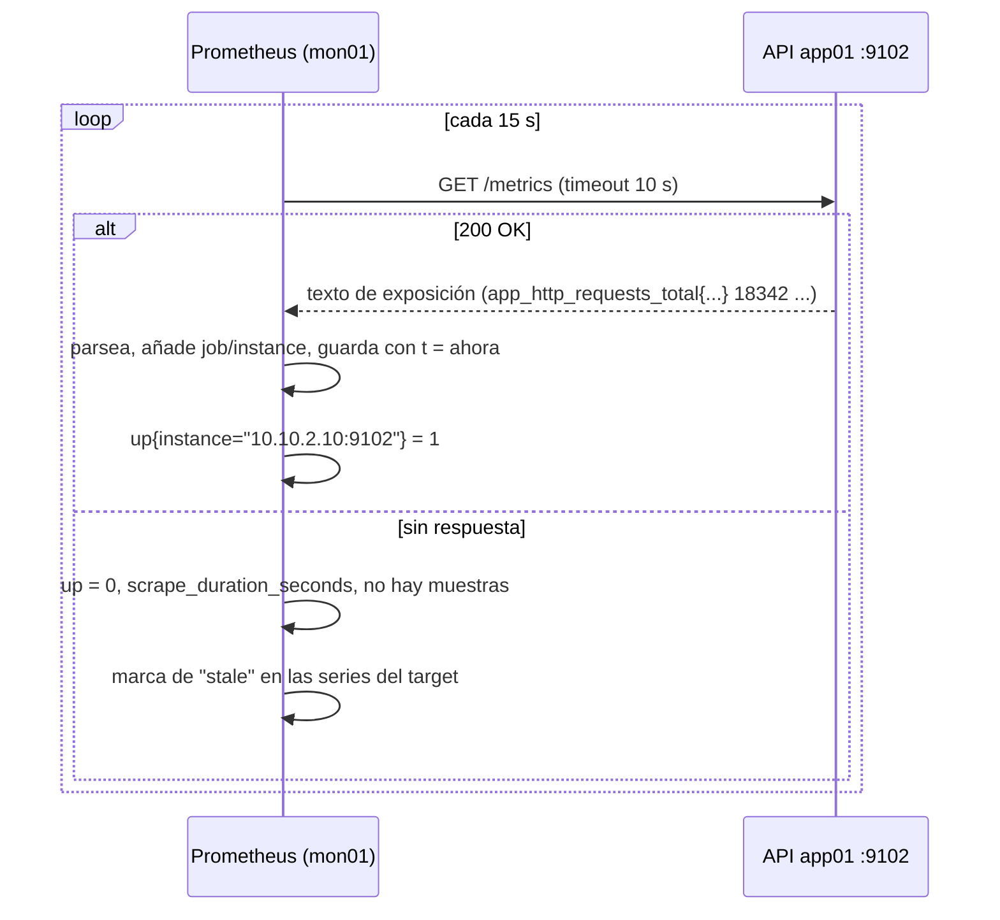

# UT1 · Observabilidad de contenedores: métricas, logs y eventos

<p class="ut-meta">Módulo 5169 · 14 h · Sesiones 1 a 7 · RA1 CE a</p>

Esta es la primera unidad del módulo y se apoya en lo que se construye en la asignatura de despliegue: el servicio del curso (proxy nginx en web01, API con Docker Compose en app01 y PostgreSQL en db01) y una VM mon01 (10.10.0.20) con una pila de Prometheus y Grafana (la base de datos de métricas y el visor de gráficas). La pila definitiva se monta en [5166 UT7](https://victor-educ.github.io/apuntes-5166/ut/ut7-monitorizacion/), que llega en abril, y la VPC dev con su firewall no existe hasta diciembre, así que en octubre trabajamos sobre un entorno provisional: en la sesión 1 levantamos una pila mínima con el compose que os doy en clase y la cambiáis por la definitiva cuando llegue. Aquí no desplegamos nada nuevo del servicio: lo que hacemos es sacar de él todo lo que cuenta sobre su estado (métricas de recursos, métricas de aplicación, logs y eventos), llevarlo a mon01 y demostrar con pruebas que llega entero, a tiempo y se guarda. Ese "demostrar" es la mitad de la unidad y el criterio de evaluación lo dice explícitamente: integrar y verificar comunicación, integridad y almacenamiento. Sin datos fiables, la UT2 (umbrales y alarmas) no tiene sobre qué trabajar.

Al servicio desplegado en app01 lo llamaremos durante todo el módulo el **contenedor de referencia**. Se mantiene vivo hasta la UT8, donde se da de baja de forma controlada.

## Qué tienes que saber hacer al terminar

- Explicar de dónde salen las métricas de recursos de un contenedor (cgroups v2) y leerlas a mano en `/sys/fs/cgroup` antes de fiarte de una gráfica.
- Desplegar cAdvisor en app01 con los montajes correctos y configurar su scrape en Prometheus, sabiendo qué etiquetas identifican cada servicio de compose.
- Instrumentar la API con un endpoint `/metrics` (counter e histogram con buenas prácticas de nombres y etiquetas) y añadir exporters a lo que no se puede instrumentar (PostgreSQL, nginx).
- Configurar el driver de logs de Docker con límites, hacer que la aplicación escriba logs JSON con `request_id`, y enviarlos a Loki con Promtail con las etiquetas `host`, `container` y `service`.
- Recoger los eventos del demonio Docker (die, oom, health_status) en Loki.
- Verificar la integración con comandos concretos: comunicación, recepción, integridad (conteos y relojes), almacenamiento y pérdidas, e interpretar lo que sale.
- Explicar y documentar qué ocurre con métricas y logs cuando se corta la red entre app01 y mon01.

## Antes de entrar en detalle

Un jueves a las tres de la tarde la API del curso empieza a devolver errores 500 y nadie se entera hasta el viernes. Entras en app01: el fichero de logs pesa 4 GB, la CPU va bien y no sabes si fue la base de datos, la memoria o un despliegue a medias. Esta unidad existe para que esa escena no se repita: todo lo que el contenedor cuenta de sí mismo (cuánto consume, cuántas peticiones atiende y cuánto tardan, qué escribe en sus logs y cuándo arranca o muere) llega a otra máquina, mon01, se guarda varios días y puedes demostrar con comandos que llega completo y a tiempo. En una frase: que el servicio se pueda vigilar desde fuera sin entrar en la máquina.

| Herramienta o concepto | Qué es, en una frase | Para qué la usamos en esta unidad |
|---|---|---|
| cgroups v2 | La contabilidad del kernel de Linux: ficheros en `/sys/fs/cgroup` con lo que gasta cada grupo de procesos | Leer a mano el consumo real de un contenedor |
| cAdvisor | Un contenedor de Google que lee esos ficheros de todos los contenedores y los publica como texto | Sacar las métricas de recursos de app01 sin escribir código |
| Prometheus y PromQL | Una base de datos de series numéricas que cada 15 s va a buscar los datos a cada máquina; PromQL es su lenguaje de consulta | Guardar las métricas en mon01 y consultarlas |
| prometheus_client y prom-client | Las librerías de Prometheus para Python y Node: unas líneas que cuentan peticiones y miden tiempos dentro de la API | Saber si la API funciona, no solo cuánto consume |
| Exporters (postgres_exporter, nginx-prometheus-exporter) | Programas auxiliares que preguntan a PostgreSQL o a nginx y traducen la respuesta al formato de Prometheus | Vigilar lo que no podemos modificar por dentro |
| Driver de logs json-file | El mecanismo con que Docker guarda en un fichero por contenedor lo que este escribe por pantalla | Limitar esos ficheros y dejarlos listos para un agente |
| Promtail | Un agente de Grafana Labs que lee los logs de los contenedores, les pone etiquetas y los envía por HTTP a Loki | Llevar los logs de app01 a mon01 |
| Loki, LogQL y logcli | La base de datos de logs de Grafana Labs, que indexa solo unas pocas etiquetas; LogQL es su lenguaje de consulta y logcli su cliente de terminal | Guardar y buscar los logs en mon01 |
| Grafana | La web que dibuja gráficas a partir de Prometheus y de Loki | Ver métricas y logs del mismo instante en la misma pantalla |
| docker events | Los avisos del demonio Docker: un contenedor ha arrancado, ha muerto, se ha quedado sin memoria | Recogerlos en Loki con un contenedor auxiliar |
| remote_write | Un Prometheus pequeño que envía sus muestras a otro central, con cola en disco por si la red se corta | Comparar en la sesión 6 qué se pierde con scrape y qué con remote_write |
| chrony y nftables | chrony mantiene en hora la VM por NTP; nftables es el cortafuegos del kernel de Linux | Sincronizar relojes y cortar la red a propósito para ver qué aguanta |

**Cómo está organizada la unidad.** Empezamos por "Qué expone un contenedor", el mapa de los cuatro flujos entre app01 y mon01; sin ese mapa el resto son piezas sueltas. Después van los flujos en orden de dificultad: métricas de recursos, porque ya existen y solo hay que leerlas; métricas de aplicación, porque hay que tocar código; logs, con su propio agente y base de datos; y eventos, que reutilizan el camino de los logs. Sigue scrape y remote_write, que explica cómo viajan las métricas y qué pasa cuando la red falla. Cierra la verificación, que necesita todas las piezas montadas.

!!! info "Lo que necesitas de la otra asignatura"
    Esta unidad se hace sobre un entorno provisional: la VPC y el firewall de [5166 UT2 y UT3](https://victor-educ.github.io/apuntes-5166/ut/ut2-vpc/) no existen hasta noviembre y diciembre, y la pila de monitorización de [5166 UT7](https://victor-educ.github.io/apuntes-5166/ut/ut7-monitorizacion/) no llega hasta abril. Lo que traes de 5166 son las dos VM creadas en la [sesión 3 de 5166 UT1 desde la plantilla cloud-init](https://victor-educ.github.io/apuntes-5166/ut/ut1-virtualizacion/), en el bridge del aula (vmbr0): `app01` con el servicio del curso en compose y `mon01` con Prometheus, Alertmanager y Grafana levantados con el compose que os doy en la sesión 1. Loki lo añadimos aquí.
    Las IP 10.10.x.x de los ejemplos son las de la VPC dev: en el entorno provisional usad las de vuestras VM en vmbr0, y las reglas de OPNsense no aplican todavía. Cuando 5166 termine la UT3 (4 dic), las VM pasan a la VPC dev detrás del firewall; se hace en la UT3 de este módulo.

## Plan de sesiones

Cada sesión de dos horas empieza con una explicación corta y sigue con laboratorio. La columna "Se explica" es lo que cuento yo al principio (con su duración aproximada); la columna "Se practica" es lo que hacéis vosotros con el material de práctica de esta unidad. Las sesiones marcadas solo como práctica no traen teoría nueva.

| Sesión | Fecha | Tipo | Se explica | Se practica |
|---:|-------|------|------------|-------------|
| [1](#a11-presentacion-y-el-contenedor-de-referencia-sesion-1) | 1 oct | Teoría y práctica | Presentación de la asignatura, evaluación y cómo se coordina con Despliegue (25 min). Los cuatro flujos que salen de un contenedor: métricas, logs, eventos (20 min). | Desplegar el servicio del curso con compose (en el puesto si aún no existe app01), y observar con docker stats, logs y events mientras se genera tráfico y se para la BD. |
| [2](#a12-metricas-de-recursos-sesion-2) | 6 oct | Teoría y práctica | cgroups v2 y cómo cAdvisor lee de ellos; etiquetas y cardinalidad (20 min). | Desplegar cAdvisor junto al servicio, scrape desde mon01, gráfica de CPU y memoria por contenedor en Grafana. |
| [3](#a13-instrumentar-la-aplicacion-sesion-3) | 8 oct | Teoría y práctica | Tipos de métrica (counter, gauge, histogram, summary) y cómo se instrumenta con la librería cliente (20 min). | Endpoint /metrics en la API con counter e histogram, postgres_exporter en la BD, comprobar ambos en Prometheus. |
| [4](#a14-logs-estructurados-sesion-4) | 13 oct | Teoría y práctica | Drivers de logs de Docker, logs en JSON con request_id, cómo funciona Promtail y qué indexa Loki (25 min). | Configurar logs JSON, limitar json-file en daemon.json, desplegar Loki y Promtail, comprobar en Grafana Explore. |
| [5](#a15-eventos-sesion-5) | 15 oct | Teoría y práctica | Los eventos del demonio Docker y cómo se recogen (10 min). | Recoger eventos en Loki; provocar die, oom y unhealthy y localizarlos. |
| [6](#a16-integridad-y-almacenamiento-sesion-6) | 20 oct | Teoría y práctica | Qué significa verificar una integración: comunicación, recepción, integridad, relojes, retención (15 min). | Ejecutar la tabla de comprobaciones completa y cortar la red tres minutos para ver qué se recupera y qué se pierde. |
| [7](#practica-evaluable) | 22 oct | Práctica evaluable | Aclaración del enunciado (10 min). | Cerrar el informe: flujo de datos, configuración, pruebas y resultado del corte de red. |

## Qué expone un contenedor

*Se explica en la sesión 1 (unos 20 min). El resto del apartado es material de consulta para la práctica.*

Aquí no montamos nada todavía: primero el mapa completo. Vamos a ver qué cuatro cosas cuenta un contenedor de sí mismo, quién produce cada una, cómo se mira en la propia máquina y a qué sistema de mon01 llega.

Un contenedor en ejecución no es más que un proceso (o varios) con namespaces y cgroups (los dos mecanismos del kernel que lo aíslan del resto y le contabilizan el consumo). Todo lo que queremos saber de él sale por uno de estos cuatro caminos:

| Flujo | Quién lo produce | Cómo se lee en local | A dónde va |
|----|----|----|----|
| Métricas de recursos | El kernel, vía cgroups | `docker stats`, `/sys/fs/cgroup`, cAdvisor | Prometheus |
| Métricas de aplicación | La propia aplicación, en `/metrics` (formato de exposición de Prometheus) | `curl app01:9102/metrics` | Prometheus |
| Logs | stdout y stderr del proceso principal, capturados por el driver de logs de Docker | `docker logs -f app` | Loki (vía Promtail) |
| Eventos | El demonio Docker: start, die, oom, health_status... | `docker events` | Loki (vía un contenedor auxiliar y Promtail) |

Los dos primeros son series numéricas: se muestrean cada pocos segundos y se guardan comprimidas en una base de datos de series temporales. Los otros dos son texto con marca de tiempo: no se muestrean, se recogen línea a línea. Por eso hay dos sistemas de almacenamiento (Prometheus y Loki) y no uno. Grafana solo pinta lo que hay en ambos.



Fijaos en la dirección de las flechas: las métricas las **tira** Prometheus (pull), los logs los **empuja** Promtail (push). Esa diferencia lo condiciona todo cuando hay un corte de red y lo veremos al final de la unidad.

## Métricas de recursos: cgroups v2 y cAdvisor

*Se explica en la sesión 2 (unos 20 min). El resto del apartado es material de consulta para la práctica.*

Aquí sacamos el primer flujo, el más sencillo porque ya existe: el kernel lleva la cuenta de lo que consume cada contenedor y solo hay que leerla. Primero la leemos a mano para saber qué significa cada número, después la publicamos con cAdvisor para que Prometheus la recoja, y al final hacemos las consultas en PromQL (el lenguaje de consulta de Prometheus) que irán al panel de Grafana. Lo que más problemas da es qué etiqueta identifica a cada contenedor y cuántas series generamos.

### De dónde salen los números

Cuando Docker arranca un contenedor, le pide al kernel un cgroup (control group) y mete dentro su proceso principal. El cgroup es a la vez el sitio donde se aplican límites (`--memory`, `--cpus`) y el sitio donde el kernel contabiliza lo consumido. En Debian 13 con Docker Engine 28 el sistema usa **cgroups v2** con el driver systemd, así que cada contenedor aparece como una unidad `docker-<id>.scope` colgando de `system.slice`:

```bash
ID=$(docker inspect -f '{{.Id}}' servicio-app-1)
ls /sys/fs/cgroup/system.slice/docker-$ID.scope/
# cgroup.procs  cpu.max  cpu.stat  io.stat  memory.current  memory.max  memory.stat  pids.current ...

cat /sys/fs/cgroup/system.slice/docker-$ID.scope/memory.current   # bytes en uso ahora mismo
cat /sys/fs/cgroup/system.slice/docker-$ID.scope/memory.max       # "max" si no hay límite
cat /sys/fs/cgroup/system.slice/docker-$ID.scope/cpu.stat
# usage_usec 184392110
# user_usec 121003320
# system_usec 63388790
# nr_throttled 0
grep -E '^(anon|file|inactive_file|active_file) ' /sys/fs/cgroup/system.slice/docker-$ID.scope/memory.stat
```

Con cgroups v1 (lo que os encontraréis todavía en hosts viejos y en alguna documentación) la jerarquía estaba partida por controlador (`/sys/fs/cgroup/memory/docker/<id>/memory.usage_in_bytes`, `/sys/fs/cgroup/cpu/...`). En v2 hay un único árbol y los ficheros se llaman distinto. Cuando cAdvisor da un número raro, esto es la fuente de verdad.

`docker stats` lee exactamente estos ficheros cada segundo y los formatea. cAdvisor hace lo mismo pero para todos los contenedores a la vez, guarda un histórico corto en memoria y lo expone en `/metrics` en formato Prometheus. No hay magia: las métricas `container_*` son estos ficheros con etiquetas.

### Memory usage frente a working set

Es la confusión más habitual con la memoria de un contenedor. `memory.current` (lo que cAdvisor expone como `container_memory_usage_bytes`) incluye la caché de páginas: si el contenedor lee un fichero de 200 MB, el kernel se queda esas páginas en caché y cuentan como memoria del cgroup aunque el proceso no las necesite y el kernel pueda soltarlas al instante. Por eso `usage` sube y sube en un contenedor que escribe logs o lee de disco, y la gente cree que tiene una fuga.

El **working set** es `memory.current` menos `inactive_file` de `memory.stat`: la memoria que el kernel no podría reclamar sin dolor. cAdvisor lo expone como `container_memory_working_set_bytes` y es la métrica que usa el propio OOM killer (el mecanismo del kernel que mata procesos cuando se agota la memoria) para decidir si un contenedor ha superado `memory.max`. Conclusión práctica: para alarmas y para comparar contra el límite, working set; `usage_bytes` solo para entender de qué está hecha la memoria. Para "memoria que realmente ha pedido el proceso" también tenéis `container_memory_rss` (anon en v2).

```promql
# porcentaje del límite que usa cada servicio de compose
container_memory_working_set_bytes{container_label_com_docker_compose_service!=""}
  / container_spec_memory_limit_bytes * 100
```

Si un contenedor no tiene límite, `container_spec_memory_limit_bytes` vale un número enorme y la división da casi cero. Es una pista, no un bug: ponedle límite.

### cAdvisor en compose

cAdvisor necesita ver el árbol de cgroups del host, el socket de Docker (`/var/run/docker.sock`, el fichero por el que se habla con el demonio; lo necesita para saber qué cgroup es qué contenedor y leer sus etiquetas) y el directorio de Docker (para métricas de disco). Se despliega en el mismo compose que el servicio, o en un compose aparte de "agentes" en app01; yo prefiero lo segundo para que reiniciar el servicio no tumbe los agentes.

```yaml
# /opt/agentes/compose.yml en app01
services:
  cadvisor:
    image: gcr.io/cadvisor/cadvisor:v0.52.1
    container_name: cadvisor
    privileged: true
    devices:
      - /dev/kmsg
    volumes:
      - /:/rootfs:ro
      - /var/run:/var/run:ro
      - /sys:/sys:ro
      - /var/lib/docker/:/var/lib/docker:ro
      - /dev/disk/:/dev/disk:ro
    command:
      - --docker_only=true
      - --housekeeping_interval=10s
      - --store_container_labels=false
      - --whitelisted_container_labels=com.docker.compose.service,com.docker.compose.project
      - --disable_metrics=percpu,sched,tcp,udp,hugetlb,referenced_memory,cpu_topology,resctrl
    ports:
      - "8081:8080"
    restart: unless-stopped
```

Cosas a saber de este fichero. `privileged` y `/dev/kmsg` hacen falta para que lea eventos OOM del kernel; sin ellos funciona pero `container_oom_events_total` nunca sube. `--docker_only` quita del listado los cgroups de systemd que no son contenedores (servicios del host), que no aportan nada y multiplican las series. `--housekeeping_interval=10s` baja el consumo de CPU del propio cAdvisor (por defecto muestrea cada segundo, y cAdvisor comiéndose el 5 % de la CPU de app01 es un clásico). El puerto: cAdvisor escucha en 8080 dentro del contenedor, pero en app01 ese puerto ya lo ocupa la API que consume web01, así que lo publicamos en 8081.

### Etiquetas y cardinalidad

Cada serie de cAdvisor lleva `id` (la ruta del cgroup), `name` (nombre del contenedor, por ejemplo `servicio-app-1`) e `image`. Con `--store_container_labels` cAdvisor convierte todas las etiquetas Docker del contenedor en etiquetas `container_label_<clave>` con los puntos cambiados por guiones bajos. Compose pone bastantes etiquetas (proyecto, servicio, número de réplica, hash de la configuración, ruta del fichero...), y esa última, `com.docker.compose.config-hash`, cambia en cada `compose up` que modifique el servicio. Si la dejas pasar, cada redespliegue crea series nuevas en Prometheus y las viejas quedan huérfanas: eso es **cardinalidad**, y es el enemigo número uno de una base de datos de series. Por eso el compose de arriba desactiva todas y solo deja pasar `com.docker.compose.service` y `com.docker.compose.project`.

La etiqueta que os interesa para todo el módulo es `container_label_com_docker_compose_service`: es estable entre despliegues (siempre `app`, `db`, `nginx`) mientras que `name` cambia si escaláis o renombráis. En Prometheus, en el scrape de cAdvisor, la renombramos a algo manejable:

```yaml
# prometheus.yml en mon01 (fragmento)
scrape_configs:
  - job_name: cadvisor
    scrape_interval: 15s
    static_configs:
      - targets: ["10.10.2.10:8081"]
        labels: { host: app01 }
    metric_relabel_configs:
      - source_labels: [container_label_com_docker_compose_service]
        target_label: service
      - regex: container_label_com_docker_compose_project
        action: labeldrop
      - source_labels: [__name__]
        regex: container_(cpu_usage_seconds_total|memory_working_set_bytes|memory_usage_bytes|spec_memory_limit_bytes|network_(receive|transmit)_bytes_total|fs_(reads|writes)_bytes_total|oom_events_total|last_seen)
        action: keep
```

El último bloque `keep` es opcional pero recomendable en un laboratorio con 3 GB de RAM en mon01: cAdvisor expone más de 100 métricas por contenedor y solo vais a usar diez. `container_last_seen` sirve para saber qué contenedores existen (y para detectar en UT2 los que han desaparecido).

Las tres consultas que usaréis en Grafana en la sesión 2:

```promql
# CPU en núcleos por servicio (1 = un núcleo entero)
sum by (service) (rate(container_cpu_usage_seconds_total{service!=""}[2m]))
# memoria working set por servicio
sum by (service) (container_memory_working_set_bytes{service!=""})
# tráfico de red recibido, bytes/s
sum by (service) (rate(container_network_receive_bytes_total{service!=""}[2m]))
```

La ventana `[2m]` con scrape cada 15 s da 8 puntos por ventana; con `[30s]` tendrías dos puntos y las gráficas saldrían a saltos. Regla: la ventana de `rate()` al menos cuatro veces el intervalo de scrape.

## Métricas de aplicación

*Se explica en la sesión 3 (unos 20 min). El resto del apartado es material de consulta para la práctica.*

{ .logo-inline } Las métricas de recursos dicen cuánto consume el contenedor, no si el servicio funciona. Una API puede estar al 2 % de CPU devolviendo 500 a todo el mundo. Para eso la aplicación se **instrumenta**: incorpora la librería cliente de Prometheus de su lenguaje, registra unas cuantas métricas y las sirve en un endpoint `/metrics` en texto plano, y Prometheus lo lee cada 15 s.

### Tipos de métrica

- **Counter**: solo sube (peticiones totales, errores totales, bytes enviados). Nunca se consulta el valor crudo, que depende de cuándo arrancó el proceso, sino su velocidad con `rate()` o `increase()`. Si el proceso se reinicia, el contador vuelve a cero y `rate()` lo detecta y lo corrige.
- **Gauge**: sube y baja (conexiones activas, tamaño de una cola, temperatura, fecha del último backup en segundos epoch). Se consulta directo.
- **Histogram**: cuenta observaciones en cubos acumulativos (`le="0.1"`, `le="0.5"`...) y además suma y total. Permite calcular percentiles en el servidor con `histogram_quantile()` y, lo que importa, agregarlos entre instancias. Es lo que se usa para latencias.
- **Summary**: percentiles calculados en el cliente. Más preciso para una instancia, pero no se puede agregar entre varias réplicas. En la práctica, histogram casi siempre.

### Python con prometheus_client

Suponemos que la API es Flask, el microframework web de Python (si es FastAPI, el patrón es idéntico con un middleware). El endpoint `/metrics` lo sirve la propia aplicación en el mismo puerto 8080 o, mejor, en un puerto aparte (9102) con `start_http_server` para que no pase por el proxy y no cuente como tráfico de usuario:

```python
# metrics.py
import time
from flask import Flask, request, g
from prometheus_client import Counter, Histogram, Gauge, start_http_server

REQUESTS = Counter(
    "app_http_requests_total",
    "Peticiones HTTP atendidas",
    ["method", "route", "status"],
)
LATENCY = Histogram(
    "app_http_request_duration_seconds",
    "Duración de la petición en segundos",
    ["method", "route"],
    buckets=(0.005, 0.01, 0.025, 0.05, 0.1, 0.25, 0.5, 1, 2.5, 5),
)
INFLIGHT = Gauge("app_http_requests_in_flight", "Peticiones en curso")
DB_UP = Gauge("app_db_reachable", "1 si la última consulta a PostgreSQL funcionó")

def instrument(app: Flask) -> None:
    @app.before_request
    def _start():
        g.t0 = time.perf_counter()
        INFLIGHT.inc()

    @app.after_request
    def _end(resp):
        route = request.url_rule.rule if request.url_rule else "unmatched"
        LATENCY.labels(request.method, route).observe(time.perf_counter() - g.t0)
        REQUESTS.labels(request.method, route, str(resp.status_code)).inc()
        INFLIGHT.dec()
        return resp

    start_http_server(9102)   # sirve /metrics en 0.0.0.0:9102
```

Detalles que marcan la diferencia. La etiqueta `route` lleva la **plantilla** de la ruta (`/items/<int:id>`), nunca la URL real (`/items/48213`): con la URL real cada id distinto es una serie nueva y en una semana tienes 100 000 series. Lo mismo con `status`: el código, no el mensaje. Los buckets del histogram se eligen pensando en el servicio: para una API con objetivo de 250 ms la lista de arriba es razonable; para un batch que tarda minutos no vale. Y `INFLIGHT` como gauge os permitirá en UT2 detectar una API que se está atascando antes de que lo digan los errores.

Si la API corre con gunicorn (el servidor que ejecuta la aplicación Python en producción) y varios workers (procesos en paralelo), cada proceso tiene su propio registro y Prometheus vería valores que saltan de un worker a otro. La librería lo resuelve con el modo multiproceso: variable de entorno `PROMETHEUS_MULTIPROC_DIR` apuntando a un directorio vacío y `MultiProcessCollector`. Está en la [documentación de prometheus_client](https://prometheus.github.io/client_python/multiprocess/); en clase lo activaremos si la API va con más de un worker.

### Node con prom-client

Si la API es Node con Express, la librería es prom-client y el patrón es el mismo, con el servidor aparte en 9102. Fíjate en que aquí el endpoint `/metrics` se sirve a mano:

```javascript
// metrics.js
const client = require("prom-client");
const express = require("express");

client.collectDefaultMetrics({ prefix: "app_" });   // CPU, memoria, event loop, GC del proceso Node

const requests = new client.Counter({
  name: "app_http_requests_total",
  help: "Peticiones HTTP atendidas",
  labelNames: ["method", "route", "status"],
});
const latency = new client.Histogram({
  name: "app_http_request_duration_seconds",
  help: "Duración de la petición en segundos",
  labelNames: ["method", "route"],
  buckets: [0.005, 0.01, 0.025, 0.05, 0.1, 0.25, 0.5, 1, 2.5, 5],
});

function instrument(app) {
  app.use((req, res, next) => {
    const end = latency.startTimer();
    res.on("finish", () => {
      const route = req.route ? req.route.path : "unmatched";
      end({ method: req.method, route });
      requests.inc({ method: req.method, route, status: String(res.statusCode) });
    });
    next();
  });
}

const metricsApp = express();
metricsApp.get("/metrics", async (_req, res) => {
  res.set("Content-Type", client.register.contentType);
  res.end(await client.register.metrics());
});
metricsApp.listen(9102);

module.exports = { instrument };
```

`curl localhost:9102/metrics` devuelve las mismas series que en Python más las `app_nodejs_*` del proceso. `collectDefaultMetrics` es gratis y muy útil: `app_nodejs_eventloop_lag_seconds` es el primer síntoma de una API Node saturada, mucho antes que la CPU.

### Nombres y etiquetas: convenciones

Prometheus no impone nombres, pero si no seguís las convenciones las consultas se vuelven un infierno y los dashboards de la comunidad no os valen. Las reglas de [Metric and label naming](https://prometheus.io/docs/practices/naming/):

| Regla | Bien | Mal |
|----|----|----|
| Prefijo con el nombre de la aplicación o del subsistema | `app_http_requests_total` | `requests` |
| Unidad base en el nombre, sin prefijos SI | `_seconds`, `_bytes`, `_ratio` | `_ms`, `_kb`, `_percent` |
| Los counters terminan en `_total` | `app_errors_total` | `app_error_count` |
| Una métrica mide una cosa; las dimensiones van en etiquetas | `app_http_requests_total{status="500"}` | `app_http_500_total` |
| Etiquetas de cardinalidad acotada | `method`, `status`, `route` plantilla | `user_id`, `request_id`, URL completa |
| snake_case en minúsculas | `app_db_reachable` | `appDbReachable` |

Sobre cardinalidad, el cálculo que hay que hacer siempre: número de series = producto del número de valores de cada etiqueta. `method` (5) × `route` (20) × `status` (8) = 800 series para un counter. Asumible. Añade `client_ip` (miles) y estás en el millón.

### Exporters: lo que no puedes instrumentar

PostgreSQL, nginx, Redis o el propio host no van a incorporar una librería de Prometheus. Para ellos existe el patrón **exporter**: un proceso auxiliar que consulta al software por su interfaz nativa (SQL, `stub_status`, comandos) y traduce lo que obtiene al formato de Prometheus. Corre al lado del servicio, normalmente como sidecar (un contenedor auxiliar pegado al principal) en el mismo compose.

**postgres_exporter** (puerto 9187) consulta `pg_stat_database`, `pg_stat_activity`, `pg_stat_bgwriter`, `pg_locks` y compañía. Nunca le deis el usuario `postgres`: se crea un usuario de solo lectura con el rol `pg_monitor`, que existe desde PostgreSQL 10 precisamente para esto.

```sql
CREATE USER postgres_exporter WITH PASSWORD 'cámbiame';
GRANT pg_monitor TO postgres_exporter;
GRANT CONNECT ON DATABASE servicio TO postgres_exporter;
```

```yaml
# en el compose de db01
  postgres_exporter:
    image: quay.io/prometheuscommunity/postgres-exporter:latest
    environment:
      DATA_SOURCE_URI: "db:5432/servicio?sslmode=disable"
      DATA_SOURCE_USER: postgres_exporter
      DATA_SOURCE_PASS_FILE: /run/secrets/pgx_pass
    secrets: [pgx_pass]
    ports: ["9187:9187"]
    depends_on: [db]
```

Las métricas que os importan: `pg_up` (1 si consigue conectar; es la primera alarma de UT2), `pg_stat_database_numbackends` (conexiones abiertas, comparadlas con `max_connections`), `pg_stat_database_xact_commit` y `xact_rollback` (con `rate()`), `pg_stat_database_blks_hit` frente a `blks_read` (acierto de caché), `pg_locks_count`, `pg_database_size_bytes`. Si necesitáis algo propio (filas de una tabla de pedidos, edad del pedido más antiguo sin procesar), el exporter admite consultas personalizadas en un fichero YAML pasado con `--extend.query-path`. Ese mecanismo está marcado como obsoleto en las versiones actuales aunque sigue funcionando; si desaparece, la alternativa mantenida es [sql_exporter](https://github.com/burningalchemist/sql_exporter), que hace lo mismo para cualquier base de datos.

```yaml
# queries.yaml
pedidos_pendientes:
  query: "SELECT count(*) AS total, EXTRACT(EPOCH FROM now() - min(creado)) AS edad_max FROM pedidos WHERE estado = 'pendiente'"
  metrics:
    - total:    { usage: GAUGE, description: "Pedidos sin procesar" }
    - edad_max: { usage: GAUGE, description: "Segundos del pedido pendiente más antiguo" }
```

**nginx-prometheus-exporter** (puerto 9113) lee el módulo `stub_status` de nginx, que hay que activar en web01 y proteger para que solo lo vea la subred de gestión:

```nginx
# /etc/nginx/conf.d/status.conf en web01
server {
    listen 127.0.0.1:8081;
    location = /stub_status {
        stub_status;
        allow 127.0.0.1;
        deny all;
    }
}
```

```bash
docker run -d --name nginx-exporter --network host \
  nginx/nginx-prometheus-exporter:latest \
  --nginx.scrape-uri=http://127.0.0.1:8081/stub_status
```

Lo que da `stub_status` es poco: `nginx_connections_active`, `nginx_connections_waiting`, `nginx_http_requests_total` y `nginx_up`. No hay códigos de respuesta ni latencias por ruta; para eso, en nginx de código abierto, la vía es el log de acceso en JSON parseado en Loki (lo hacemos en la sección de logs) o el módulo VTS de terceros. nginx Plus sí expone todo eso por API; la versión libre no.

## Logs

*Se explica en la sesión 4 (unos 25 min). El resto del apartado es material de consulta para la práctica.*

El tercer flujo es texto, no números, y por eso tiene su propio camino: Docker lo recoge, Promtail lo etiqueta y lo envía, y Loki lo guarda. Hacemos cuatro cosas en orden: limitar el tamaño de los ficheros de log, conseguir que la API escriba una línea JSON por evento con un identificador de petición, configurar Promtail para que las lea y las envíe, y montar Loki en mon01 para guardarlas y consultarlas. Al terminar podrás seguir una petición desde nginx hasta la API por su identificador.

### El driver de logs de Docker y por qué limitarlo

Docker captura stdout y stderr del proceso principal del contenedor y se los entrega a un **driver de logs**. El driver por defecto es `json-file`: escribe cada línea como un objeto JSON (`{"log":"...","stream":"stdout","time":"2026-10-13T09:12:44.120Z"}`) en `/var/lib/docker/containers/<id>/<id>-json.log`. Sin configuración adicional ese fichero **no rota nunca**. Una API que escriba 200 líneas por segundo de 300 bytes genera 5 GB al día; en dos semanas app01 se queda sin disco, Docker no puede escribir y el contenedor se para o se cuelga. Es la causa más común de "se ha caído el servidor" en despliegues pequeños.

```json
// /etc/docker/daemon.json en app01, db01 y web01
{
  "log-driver": "json-file",
  "log-opts": { "max-size": "50m", "max-file": "5" }
}
```

Tras cambiarlo, `systemctl restart docker`, y ojo: **solo aplica a contenedores creados después**. Los existentes conservan su driver y sus opciones hasta que se recrean (`docker compose up -d --force-recreate`). Con esos valores el techo por contenedor son 250 MB. La rotación es por tamaño, no por tiempo: si un contenedor apenas escribe, sus logs de hace meses siguen ahí.

Otros drivers que vais a ver:

| Driver | Qué hace | Cuándo |
|----|----|----|
| `local` | Como json-file pero en formato binario propio, comprimido, con rotación por defecto (100 MB en 5 ficheros) | Cuando no necesitas que otro agente lea el fichero. Docker lo recomienda sobre json-file, pero Promtail y Fluent Bit leen json-file y no `local`, así que para nosotros no |
| `journald` | Envía las líneas al journal de systemd del host con metadatos del contenedor | Hosts donde ya centralizas el journal; consultas con `journalctl CONTAINER_NAME=app` |
| `loki` | Plugin de Docker que empuja directamente a Loki sin agente intermedio | Tentador, pero si Loki no responde el plugin bloquea el demonio o pierde líneas según configuración; y si el plugin falla, `docker` entero se resiente. Prefiero el agente |
| `none` | Descarta todo | Contenedores muy ruidosos cuya salida no importa |

Desde Docker 20.10 existe el **dual logging**: aunque uses `journald` o `loki`, Docker guarda una copia local para que `docker logs` siga funcionando. No cambia la recomendación: `json-file` con límites y un agente que lea los ficheros, añada contexto, reintente y no toque el demonio.

### Logs estructurados: JSON con request_id

`docker logs` funciona con cualquier cosa que la aplicación escriba, pero un log que dice `Error procesando pedido 4821 para cliente 77` solo lo entiende una persona. Para filtrar en Loki por nivel, contar errores por ruta o seguir una petición desde nginx hasta la base de datos, la aplicación tiene que escribir **una línea JSON por evento** con campos fijos: `ts` (fecha en formato RFC 3339, como `2026-10-13T09:12:44.120Z`, con zona horaria y milisegundos), `level`, `msg`, `logger`, y los que aporten contexto: `request_id`, `method`, `route`, `status`, `duration_ms`, `user` (id, nunca nombre ni email).

El `request_id` es lo que permite la **correlación**. Lo genera nginx en web01 con la variable `$request_id` (32 caracteres hexadecimales, uno por petición), lo pasa a la API en una cabecera, la API lo incluye en todas sus líneas de log y lo devuelve al cliente en la respuesta. Cuando un usuario dice "me ha dado error a las 10:14", buscas ese id y ves la petición completa en los dos hosts.

```nginx
# web01: en el server del proxy
proxy_set_header X-Request-ID $request_id;
add_header X-Request-ID $request_id always;

log_format json escape=json '{"ts":"$time_iso8601","level":"info","msg":"access",'
  '"request_id":"$request_id","method":"$request_method","uri":"$request_uri",'
  '"status":$status,"bytes":$body_bytes_sent,"duration_ms":$request_time,'
  '"upstream":"$upstream_addr","client":"$remote_addr"}';
access_log /var/log/nginx/access.json json;
```

En la API, con Python, un formateador JSON en la librería `logging` estándar y un filtro que inyecte el id que llega en la cabecera (si no llega, se genera uno):

```python
import json, logging, uuid, sys
from flask import request, g

class JsonFormatter(logging.Formatter):
    def format(self, record):
        d = {
            "ts": self.formatTime(record, "%Y-%m-%dT%H:%M:%S") + f".{int(record.msecs):03d}Z",
            "level": record.levelname.lower(),
            "logger": record.name,
            "msg": record.getMessage(),
            "request_id": getattr(g, "request_id", None) if request else None,
        }
        if record.exc_info:
            d["exc"] = self.formatException(record.exc_info)
        return json.dumps(d, ensure_ascii=False)

handler = logging.StreamHandler(sys.stdout)
handler.setFormatter(JsonFormatter())
logging.basicConfig(level=logging.INFO, handlers=[handler])

@app.before_request
def _rid():
    g.request_id = request.headers.get("X-Request-ID", uuid.uuid4().hex)

@app.after_request
def _rid_out(resp):
    resp.headers["X-Request-ID"] = g.request_id
    return resp
```

Tres normas para que esto funcione después en Loki: una línea por evento (nada de trazas multilínea sueltas; van dentro del campo `exc`), siempre a stdout (no a un fichero dentro del contenedor, que nadie va a leer y que llena el disco), y el mismo nombre de campo en todos los servicios (`request_id`, no `requestId` en uno y `rid` en otro).

### Promtail

{ .logo-inline } Promtail es el agente de Grafana Labs para enviar logs a Loki. Tiene una advertencia que hay que hacer en 2026: Grafana lo ha declarado **al final de su vida** (sin cambios desde febrero de 2025, fin de soporte en marzo de 2026) en favor de [Grafana Alloy](https://grafana.com/docs/alloy/latest/), que hace lo mismo y además métricas y trazas con una configuración en su propio lenguaje. Lo usamos igualmente porque su configuración es YAML corto, se entiende en una sesión y todos los conceptos (descubrimiento, relabel, pipeline, posiciones, reintentos) se trasladan uno a uno a Alloy; en empresa os encontraréis las dos cosas. Para pasar de uno a otro existe `alloy convert --source-format=promtail`.

Promtail hace cuatro cosas en orden: **descubre** de dónde leer, **etiqueta** cada origen con relabel (reglas que copian, renombran o descartan etiquetas), **procesa** cada línea con un pipeline y **envía** lotes a Loki por HTTP, guardando en un fichero de posiciones hasta dónde ha leído.

```yaml
# /opt/agentes/promtail.yml en app01
server:
  http_listen_port: 9080

positions:
  filename: /var/lib/promtail/positions.yaml

clients:
  - url: http://10.10.0.20:3100/loki/api/v1/push
    external_labels:
      host: app01
      env: dev
    batchwait: 1s
    batchsize: 1048576
    backoff_config:
      min_period: 500ms
      max_period: 5m
      max_retries: 10
    timeout: 10s

scrape_configs:
  - job_name: docker
    docker_sd_configs:
      - host: unix:///var/run/docker.sock
        refresh_interval: 5s
    relabel_configs:
      - source_labels: [__meta_docker_container_name]
        regex: '/(.*)'
        target_label: container
      - source_labels: [__meta_docker_container_label_com_docker_compose_service]
        target_label: service
      - source_labels: [__meta_docker_container_label_com_docker_compose_project]
        target_label: project
      - source_labels: [__meta_docker_container_log_stream]
        target_label: stream
    pipeline_stages:
      - match:
          selector: '{service="app"}'
          stages:
            - json:
                expressions:
                  level: level
                  ts: ts
                  request_id: request_id
            - timestamp:
                source: ts
                format: RFC3339Nano
            - labels:
                level:
            - structured_metadata:
                request_id:
      - match:
          selector: '{service="app"} !~ "^\\{"'
          stages:
            - static_labels:
                malformed: "true"
```

Por partes:

**docker_sd_configs**. En lugar de leer los ficheros `*-json.log` (que también se puede, con `static_configs` y `__path__: /var/lib/docker/containers/*/*.log`), Promtail pregunta al demonio por el socket qué contenedores hay y lee sus logs por la API de Docker. Ventaja: obtiene el nombre y las etiquetas del contenedor sin tener que parsear rutas, y sigue a contenedores nuevos a los 5 s de arrancar. Necesita acceso al socket, así que el contenedor de Promtail lo monta en solo lectura y corre como root o con el gid del grupo `docker`.

**relabel_configs**. Las meta-etiquetas `__meta_docker_*` desaparecen al final del relabel; solo sobrevive lo que copiéis a una etiqueta sin guiones bajos iniciales. Con estas cuatro reglas cada flujo queda como `{host="app01", env="dev", container="servicio-app-1", service="app", project="servicio", stream="stdout"}`. Las etiquetas en Loki son **índice**, y cada combinación distinta de valores es un stream con sus propios chunks (los bloques comprimidos en que Loki guarda el texto): tres o cuatro etiquetas de pocos valores está bien; meter `request_id` o la ruta como etiqueta destroza Loki igual que destroza Prometheus. Para campos de cardinalidad alta que queréis filtrar rápido, Loki 3 tiene **structured metadata** (lo que hace la etapa `structured_metadata`): se guarda junto a la línea, no en el índice, y se consulta con `| request_id="..."`.

**pipeline_stages**. Se ejecutan por línea, en orden. `json` extrae campos a variables internas; `timestamp` usa el `ts` de la aplicación como marca de tiempo de la entrada en vez de la hora en que Promtail la leyó (importa cuando hay retraso: si Promtail estuvo 3 minutos sin poder enviar, las líneas se guardan con su hora real, no con la de reenvío); `labels` promociona `level` a etiqueta (5 valores posibles, aceptable y muy útil para `{service="app", level="error"}`). El segundo `match` marca las líneas que no son JSON (una traza de arranque, un `print` olvidado) para encontrarlas y corregirlas. Con `format: RFC3339Nano` Go acepta también RFC 3339 sin nanosegundos; si vuestra API escribe otra cosa, el formato se expresa con la fecha de referencia de Go (`2006-01-02 15:04:05.000`).

**positions**. El fichero `positions.yaml` guarda, por origen, el último offset (o el último timestamp leído, con docker_sd) enviado con éxito. Si Promtail se reinicia, continúa desde ahí. Si el fichero está en `/tmp` dentro del contenedor y no en un volumen, cada reinicio de Promtail reenvía todo lo que Docker conserve del contenedor (hasta 250 MB con nuestros límites), y Loki no deduplica: los `count_over_time` de la verificación os saldrán multiplicados. Volumen persistente siempre.

**clients**. `batchwait` y `batchsize` deciden cuándo sale un lote: al segundo o al llegar a 1 MB, lo que ocurra antes. `backoff_config` es lo que os salva en un corte de red: si el push falla, reintenta esperando 0,5 s, luego 1, 2, 4, 8... hasta 5 minutos entre intentos, y hasta 10 intentos por lote. La suma de las esperas con esos valores son unos 8,5 minutos: un corte de 3 minutos no pierde nada; uno de 15 sí, y lo veréis en `promtail_dropped_entries_total`. Mientras reintenta, Promtail deja de leer el origen (no avanza posiciones), así que lo que no ha enviado sigue en el fichero de Docker; el límite real de lo que aguanta un corte lo ponen `max-size` y `max-file`.

```yaml
# en /opt/agentes/compose.yml
  promtail:
    image: grafana/promtail:3.5.3
    container_name: promtail
    command: -config.file=/etc/promtail/promtail.yml
    volumes:
      - ./promtail.yml:/etc/promtail/promtail.yml:ro
      - /var/run/docker.sock:/var/run/docker.sock:ro
      - promtail-positions:/var/lib/promtail
    ports:
      - "9080:9080"
    restart: unless-stopped
volumes:
  promtail-positions:
```

Promtail expone sus propias métricas en `:9080/metrics` y hay que hacerles scrape desde mon01: `promtail_sent_entries_total`, `promtail_dropped_entries_total`, `promtail_request_duration_seconds_count{status_code!="204"}` (pushes fallidos) y `promtail_targets_active_total`. Quien vigila al vigilante.



### Loki

Loki es "Prometheus para logs": mismo modelo de etiquetas, misma filosofía de indexar poco. Solo indexa las etiquetas del stream y el rango de tiempo; el texto se guarda comprimido en **chunks** y se busca por fuerza bruta dentro de los chunks que las etiquetas seleccionan. Por eso es barato y por eso las consultas sin etiquetas (`{host=~".+"} |= "error"` en 7 días) son lentas: hay que descomprimir todo.

Internamente tiene varios componentes (distributor recibe los push, ingester los acumula en memoria y los escribe como chunks, querier responde consultas, compactor aplica retención, y el índice TSDB, el mismo formato que usa Prometheus). En producción se reparten en varios procesos; para el laboratorio y para muchas empresas pequeñas se ejecuta todo en un binario (`-target=all`, el modo "monolítico") con almacenamiento en disco local. Fíjate en `limits_config` (cuánto acepta y cuánto guarda) y en `compactor` (quién borra lo viejo); el resto es fijo:

```yaml
# /opt/monitoring/loki/loki.yml en mon01
auth_enabled: false

server:
  http_listen_port: 3100

common:
  path_prefix: /loki
  storage:
    filesystem:
      chunks_directory: /loki/chunks
      rules_directory: /loki/rules
  replication_factor: 1
  ring:
    kvstore:
      store: inmemory

schema_config:
  configs:
    - from: 2026-10-01
      store: tsdb
      object_store: filesystem
      schema: v13
      index:
        prefix: index_
        period: 24h

limits_config:
  retention_period: 168h
  reject_old_samples: true
  reject_old_samples_max_age: 168h
  allow_structured_metadata: true
  ingestion_rate_mb: 8
  ingestion_burst_size_mb: 16
  max_global_streams_per_user: 5000

compactor:
  working_directory: /loki/compactor
  delete_request_store: filesystem
  retention_enabled: true
  compaction_interval: 10m
  retention_delete_delay: 2h
```

La retención de 7 días (`168h`) se aplica cada 10 minutos por el compactor, y con la demora de 2 h. Con el servicio del curso, Loki ocupa entre 2 y 5 GB de disco con esa retención; en UT5, en la empresa, veréis retenciones de 30 a 90 días por normativa y ahí el disco local ya no vale: se pasa a un object store (un almacén de ficheros por HTTP, como MinIO o S3) cambiando `object_store` y nada más. `reject_old_samples_max_age` es lo que rechaza líneas con reloj atrasado, luego lo cruzamos con chrony (el servicio que mantiene en hora la VM por NTP, el protocolo de hora en red).

**LogQL** (el lenguaje de consulta de Loki, primo de PromQL) para comprobar que las cosas llegan, que es lo que necesitáis en esta unidad (los dashboards y alertas sobre logs van en UT2):

```text
{host="app01"}                                     # todo lo que envía app01, ¿llegan las etiquetas?
{service="app"} | json | level="error"             # errores de la API parseando la línea
{service="app"} | request_id="3f9a..."             # una petición completa (structured metadata)
{service=~"app|nginx"} |= "3f9a1c..."              # la misma petición en los dos hosts
count_over_time({service="app"}[5m])               # líneas en 5 min, para comparar con el origen
sum by (level) (rate({service="app"} | json [1m])) # líneas/s por nivel
{service="app", malformed="true"}                  # lo que no era JSON
```

Desde línea de comandos, `logcli` (se instala en el puesto o en mon01 y habla con Loki por HTTP):

```bash
export LOKI_ADDR=http://10.10.0.20:3100
logcli labels                                  # qué etiquetas existen
logcli labels service                          # valores de una etiqueta
logcli query --since=5m '{service="app"}' --limit 20
logcli query --since=5m 'count_over_time({service="app"}[5m])'
logcli series '{host="app01"}'                 # streams que tiene Loki de app01: cardinalidad
```

En Grafana, añadís Loki como fuente de datos (`http://loki:3100` si está en el mismo compose que Grafana, o `http://10.10.0.20:3100`) y en Explore (la pantalla de consultas libres de Grafana) elegís la fuente y escribís las mismas consultas. Explore con la fuente Prometheus y la fuente Loki en pantalla partida, el mismo rango de tiempo, es la forma más rápida de correlacionar un pico de latencia con los errores de ese momento.

## Eventos del demonio Docker

*Se explica en la sesión 5 (unos 10 min). El resto del apartado es material de consulta para la práctica.*

El cuarto flujo es el más corto y el que dice por qué se ha caído un contenedor: si lo mató el kernel por memoria, si terminó con error o si alguien lo paró. Lo recogemos reutilizando el camino de los logs, con un contenedor auxiliar y sin escribir código.

El demonio emite un evento cada vez que cambia el estado de un contenedor, imagen, volumen o red. Para el mantenimiento los que importan son los de contenedor:

| Evento | Qué significa | Dato útil en `Actor.Attributes` |
|----|----|----|
| `die` | El proceso principal ha terminado | `exitCode` (0 normal, 137 SIGKILL, 143 SIGTERM, 1 error de la app) |
| `oom` | El kernel ha matado un proceso del contenedor por exceder `memory.max` | Siempre seguido de un `die` con 137 |
| `health_status: unhealthy` | El healthcheck ha fallado `retries` veces seguidas | Nombre del contenedor |
| `restart` | Docker lo ha reiniciado por la política `restart` | Cuántas veces, comparando con `start` |
| `kill`, `stop` | Alguien (o compose) lo ha parado | `signal` |

```bash
docker events --since 30m --filter type=container --format '{{json .}}'
docker events --filter event=die --filter event=oom --filter event=health_status
```

No hay una fuente de datos "eventos" en Promtail ni en Prometheus, pero no hace falta: la forma más simple de recogerlos es un contenedor auxiliar que ejecute `docker events` con salida JSON. Su stdout pasa por el driver de logs como cualquier otro y Promtail lo envía a Loki con `service="docker-events"`. Un contenedor, cero código:

```yaml
# en /opt/agentes/compose.yml
  docker-events:
    image: docker:28-cli
    container_name: docker-events
    command: docker events --filter type=container --format '{{json .}}'
    volumes:
      - /var/run/docker.sock:/var/run/docker.sock:ro
    restart: unless-stopped
```

Cada línea es un JSON con `status`, `Action`, `Actor.ID`, `Actor.Attributes.name`, `Actor.Attributes.exitCode`, `Actor.Attributes.com.docker.compose.service`, y `time`. Un `match` en el pipeline de Promtail para `{service="docker-events"}` con `json` extrae `Action` a etiqueta `action` y el nombre del contenedor afectado a structured metadata. En Loki: `{service="docker-events", action=~"die|oom"}`. La alternativa es un exporter que convierta eventos en métricas (hay varios en GitHub, ninguno oficial); tiene la ventaja de poder alertar con PromQL en lugar de LogQL, pero pierdes el detalle (el exitCode, quién lo paró). En UT2 alertaremos desde Loki con el ruler.

Dos avisos. El contenedor auxiliar solo captura eventos mientras está en marcha: si se reinicia el demonio, se pierden los de ese intervalo (poco importa: el `start` de todos los contenedores es lo primero que verás). Y `docker events` desde un contenedor con el socket montado tiene acceso total al demonio; el `:ro` del montaje no limita la API, solo el fichero. En UT3 se restringe con un proxy de socket.

## Enviar las métricas a un sistema remoto: scrape y remote_write

*No se explica en clase: es material de consulta para las prácticas y para ampliar.*

Hasta aquí hemos dado por hecho que las métricas llegan a mon01. Este apartado explica cómo viajan, porque hay dos formas con comportamientos distintos cuando la red falla: en la primera Prometheus va a buscarlas, en la segunda se las envían. Las dos aparecen en la prueba de corte de red de la sesión 6.

<figure markdown="span">
  { width="640" }
  <figcaption>Arquitectura de Prometheus: descubrimiento, scrape de targets, TSDB local, reglas hacia Alertmanager y consulta desde Grafana. Fuente: Proyecto Prometheus, Apache 2.0.</figcaption>
</figure>

El camino normal es el **scrape**: Prometheus en mon01 tiene una lista de targets y cada `scrape_interval` (15 s en nuestro caso) hace un GET a `/metrics` de cada uno, parsea el texto y guarda cada muestra con la hora del reloj de mon01. El target no sabe nada de Prometheus, solo responde a un GET. Esto tiene consecuencias que conviene tener claras:



Un scrape que falla no se recupera: no hay cola, el target no guarda nada, y en la gráfica queda un hueco. Los contadores lo toleran bien (el siguiente scrape trae el valor acumulado y `rate()` lo reparte), pero un pico de un gauge que ocurrió en esos segundos se pierde para siempre. `up` es la métrica más importante de Prometheus: vale 1 si el último scrape del target tuvo éxito y 0 si no, y es lo primero que se mira en `http://10.10.0.20:9090/targets`.

```yaml
# prometheus.yml en mon01, jobs de la UT1
scrape_configs:
  - job_name: app
    static_configs:
      - targets: ["10.10.2.10:9102"]
        labels: { host: app01, service: app }
  - job_name: postgres
    static_configs:
      - targets: ["10.10.3.10:9187"]
        labels: { host: db01, service: db }
  - job_name: nginx
    static_configs:
      - targets: ["10.10.1.10:9113"]
        labels: { host: web01, service: web }
  - job_name: promtail
    static_configs:
      - targets: ["10.10.2.10:9080"]
        labels: { host: app01 }
  - job_name: loki
    static_configs:
      - targets: ["loki:3100"]
```

Todos los targets están en subredes distintas de la de gestión, así que en OPNsense tienen que existir reglas que permitan desde 10.10.0.20 hacia esos puertos. En el entorno provisional del bridge del aula no hay firewall entre las VM y este paso todavía no toca. Si un target sale `context deadline exceeded` en lugar de `connection refused`, casi seguro es el firewall (los paquetes se descartan sin respuesta); `connection refused` es que el puerto no está escuchando en la máquina.

**remote_write** es la alternativa cuando el scrape no puede hacerse: el target está detrás de NAT (una red privada cuyas direcciones mon01 no puede alcanzar directamente), en una red que mon01 no alcanza, o queréis tolerancia a cortes. Se despliega un Prometheus pequeño junto al servicio (en app01, con retención de horas) que hace el scrape en local y **empuja** las muestras al central. Ese Prometheus local guarda un WAL (write-ahead log) en disco y una cola en memoria: si el central no responde, reintenta con backoff y, al volver, envía lo acumulado desde el WAL. Con dos horas de WAL aguanta cortes largos sin perder nada.

```yaml
# prometheus.yml del Prometheus local en app01
global:
  scrape_interval: 15s
  external_labels: { host: app01, env: dev }
scrape_configs:
  - job_name: app
    static_configs: [{ targets: ["app:9102"] }]
  - job_name: cadvisor
    static_configs: [{ targets: ["cadvisor:8080"] }]
remote_write:
  - url: http://10.10.0.20:9090/api/v1/write
    queue_config:
      capacity: 10000
      max_shards: 4
      max_samples_per_send: 2000
      batch_send_deadline: 5s
      min_backoff: 30ms
      max_backoff: 5s
```

El Prometheus central tiene que arrancar con `--web.enable-remote-write-receiver` para aceptar escrituras en `/api/v1/write`. En Prometheus 3 el protocolo de remote write tiene versión 2.0 (más compacto, con metadatos); por defecto se sigue usando la 1.0 y no hace falta tocar nada. Las métricas del emisor que dicen si va bien: `prometheus_remote_storage_samples_pending` (cola), `prometheus_remote_storage_samples_retried_total`, `prometheus_remote_storage_samples_failed_total` (perdidas de verdad) y `prometheus_remote_storage_highest_timestamp_in_seconds` frente a `prometheus_remote_storage_queue_highest_sent_timestamp_seconds` (retraso en segundos).

En el laboratorio la práctica se hace con scrape directo, que es lo que tiene cualquier empresa con una red plana; el remote_write lo montamos en la sesión 6 en paralelo para comparar el comportamiento ante el corte. Es el mismo mecanismo que usan los servicios gestionados (Grafana Cloud, Amazon Managed Prometheus, Thanos Receive).

## Verificar la integración

*Se explica en la sesión 6 (unos 15 min). El resto del apartado es material de consulta para la práctica.*

Integrar no es configurar y olvidarse. Cada punto de la cadena puede fallar en silencio: el firewall descarta, Promtail lee pero no envía, Loki recibe pero rechaza por reloj, Prometheus guarda pero la retención borra. Verificar es ejecutar un comando en cada punto y saber qué significa lo que sale. Esta tabla es la que hay que completar entera en la sesión 6 y la que sale en la práctica.

| Comprobación | Comando | Lo esperado | Si no cuadra |
|----|----|----|----|
| Comunicación app01 → mon01 (logs) | Desde app01: `nc -zv 10.10.0.20 3100` | `succeeded` | Firewall (regla back → gestión 3100) o Loki parado (`docker compose ps` en mon01) |
| Comunicación mon01 → app01 (métricas) | Desde mon01: `curl -s http://10.10.2.10:9102/metrics \| head -5` y lo mismo a `:8081` y `:9080` | Texto `# HELP ...` | `Connection refused`: no escucha o no está publicado; se queda colgado: firewall |
| Recepción de métricas | `http://10.10.0.20:9090/targets` o `curl -s localhost:9090/api/v1/targets \| jq '.data.activeTargets[] \| {job, health, lastError}'` | Todos `up` | `lastError` dice el motivo; `scrape_samples_scraped` en PromQL dice cuántas series trae cada target |
| Recepción de logs | `logcli query --since=2m '{host="app01"}' --limit 5` | Líneas recientes con `container` y `service` | Vacío: mirar `docker logs promtail` (errores 4xx de Loki) y `promtail_targets_active_total` |
| Integridad de logs | En app01: `docker logs --since 5m servicio-app-1 \| wc -l`; en Loki en el mismo momento: `count_over_time({container="servicio-app-1"}[5m])` | Iguales o diferencia de un puñado por el desfase de segundos entre los dos comandos | Loki muy por debajo: pérdidas (`promtail_dropped_entries_total`) o rechazos (`loki_discarded_samples_total` por motivo); Loki por encima: duplicados por posiciones perdidas |
| Integridad de métricas | En app01: `curl -s localhost:9102/metrics \| grep 'app_http_requests_total{method="GET",route="/health",status="200"}'`; en Prometheus, la misma serie | El valor de Prometheus es el del último scrape (hasta 15 s más viejo), nunca mayor | Mayor o muy distinto: estáis mirando otra instancia o etiquetas cambiadas por relabel |
| Marcas de tiempo | En cada host: `chronyc tracking \| grep 'System time'` | Desfase inferior a 100 ms | Ver la sección de chrony; Loki y las correlaciones en Grafana lo notan a partir de segundos |
| Almacenamiento Prometheus | `prometheus_tsdb_head_series`, `prometheus_tsdb_storage_blocks_bytes`, y consultar cualquier serie con `offset 24h` | Hay datos de hace 24 h; series estables (no crecen sin parar) | Series crecen: cardinalidad (etiqueta con demasiados valores); sin datos antiguos: retención demasiado corta o el volumen no persiste |
| Almacenamiento Loki | `logcli query --since=24h --limit 1 '{host="app01"}'` y `du -sh /var/lib/docker/volumes/monitoring_loki/_data` en mon01 | Hay líneas de ayer; el tamaño crece y se estabiliza al llegar a la retención | Sin líneas: el compactor ha borrado o el volumen no persiste |
| Pérdidas | `promtail_dropped_entries_total`, `loki_discarded_samples_total`, `prometheus_remote_storage_samples_failed_total`, y `count_over_time({service="app"}[1h])` antes y después de un corte | Todos a cero, o su crecimiento coincide con un corte documentado | Suben sin corte: revisar límites de ingestión de Loki (`ingestion_rate_mb`) y reloj |

Un detalle de la integridad de logs: `docker logs --since 5m` y la consulta de Loki no se ejecutan en el mismo instante ni miden exactamente la misma ventana. Para una prueba limpia, generad un número conocido de líneas (`for i in $(seq 1 500); do curl -s -o /dev/null http://10.10.1.10/health; done` desde el puesto) con la API en silencio, esperad diez segundos, y contad en las dos partes con una ventana holgada. Deben salir 500 y 500. Si la API escribe dos líneas por petición (una del middleware y otra del handler), 1000 y 1000.

### Relojes: chrony

Prometheus pone la hora a las muestras con el reloj de mon01, así que las métricas solo dependen de un reloj. Los logs no: la hora la pone la aplicación (o Docker, si la aplicación no la escribe) con el reloj del host de app01, y Loki la compara con el suyo. Los contenedores no tienen reloj propio, usan el del kernel del host, así que basta con sincronizar las VM. Con un desfase de 30 s la correlación en Grafana entre un pico de latencia y sus errores queda desplazada y confunde; con más de `reject_old_samples_max_age` Loki rechaza las líneas; y con la hora en el futuro más de 10 minutos también (`creation_grace_period`).

Debian 13 trae `systemd-timesyncd`, que vale para un portátil pero no da diagnóstico. Instalad chrony en las cuatro VM y en mon01 y apuntadlo al OPNsense (que a su vez sincroniza con Internet) o a `pool.ntp.org` si el firewall deja salir UDP 123 (en el entorno provisional, sin OPNsense, dejad solo la línea `pool`):

```bash
sudo apt install chrony
sudo tee /etc/chrony/sources.d/lab.sources <<EOT
server 10.10.0.1 iburst prefer
pool 2.debian.pool.ntp.org iburst
EOT
sudo systemctl restart chrony
chronyc sources -v      # ^* delante de la fuente elegida
chronyc tracking        # System time : 0.000213 seconds fast of NTP time
```

Las VM en Proxmox pierden tiempo al suspenderse o al migrarse; chrony por defecto solo corrige a saltos (`makestep`) en los tres primeros ajustes tras arrancar, y después ajusta la velocidad del reloj poco a poco (un desfase de 10 s tarda horas en corregirse). Para el laboratorio, donde apagáis y encendéis VM constantemente, añadid `makestep 1 -1` en `/etc/chrony/conf.d/lab.conf`: corrige de golpe siempre que el desfase pase de 1 s. En producción se tiene apagado por lo que hace a las bases de datos un salto de reloj hacia atrás.

### Qué pasa cuando se pierde la red

Es la prueba de la sesión 6 y de la práctica. En app01, con nftables (el cortafuegos del kernel de Linux, que se ve a fondo en 5166 UT3), cortamos todo el tráfico con mon01 durante tres minutos:

```bash
sudo nft add table inet corte
sudo nft add chain inet corte out '{ type filter hook output priority 0; }'
sudo nft add chain inet corte in '{ type filter hook input priority 0; }'
sudo nft add rule inet corte out ip daddr 10.10.0.20 drop
sudo nft add rule inet corte in ip saddr 10.10.0.20 drop
date; sleep 180; date
sudo nft delete table inet corte
```

Lo que tenéis que observar y documentar, con capturas:

- **Métricas por scrape**: a los 15 s, en Targets los tres de app01 pasan a DOWN con `context deadline exceeded`; `up{host="app01"}` vale 0. Al restaurar, vuelven a UP en el siguiente scrape. En Grafana queda un hueco de tres minutos en todas las gráficas de app01. **No se recupera**: esos datos no existen en ningún sitio. Los contadores de la API han seguido subiendo, así que `increase(app_http_requests_total[10m])` sobre un rango que incluye el corte da el total correcto, solo falta el detalle de esos minutos.
- **Métricas por remote_write** (si habéis montado el Prometheus local): `prometheus_remote_storage_samples_pending` sube durante el corte, `samples_retried_total` cuenta reintentos, `samples_failed_total` se queda a cero. Al restaurar, la cola se vacía en segundos y en el central aparecen las muestras con su hora original. **Se recupera** sin hueco.
- **Logs**: `docker logs promtail` muestra los reintentos (`error sending batch, will retry`, con el tiempo de espera creciente). `promtail_sent_entries_total` deja de crecer, `promtail_dropped_entries_total` sigue a cero. Al restaurar, en menos de un minuto (el siguiente reintento) llegan a Loki todas las líneas del corte con sus marcas de tiempo reales. Comprobadlo con `count_over_time` sobre la ventana del corte. **Se recupera** mientras el corte dure menos que la suma de reintentos y menos de lo que aguanten los ficheros de Docker.
- **Eventos**: igual que los logs, porque van por el mismo camino.

Repetid la prueba con un corte de 12 minutos, o bajando `max_retries` a 3, y ya veréis pérdidas: `promtail_dropped_entries_total` sube y el conteo en Loki queda por debajo del de `docker logs`. Ese es el número que hay que poner en el informe: cuánto aguanta vuestra configuración.

## Errores frecuentes en el laboratorio

**cAdvisor arranca pero no muestra contenedores, o todas las series llevan `name=""`.** Le falta el montaje de `/var/run` (no encuentra el socket para relacionar cgroups con contenedores) o `/sys`. Con cgroups v2 además necesita `privileged`. Revisad `docker logs cadvisor`: suele decir `Failed to start container manager` o `unable to get docker info`.

**Prometheus hace scrape del puerto 8080 de app01 y trae las métricas de la API en vez de cAdvisor, o un 404.** El puerto 8080 de app01 es la API; cAdvisor está en 8081. Confusión clásica con la tabla de puertos del laboratorio.

**Los valores de `app_http_requests_total` bajan y suben entre scrapes.** Gunicorn o uvicorn con varios workers y cada uno con su registro. Activar el modo multiproceso de prometheus_client o servir `/metrics` desde un único proceso.

**Promtail: `permission denied` al abrir `/var/run/docker.sock`.** El contenedor de Promtail corre con un usuario sin acceso al socket. Añadid `user: root` en el compose (aceptable en un agente de solo lectura) o `group_add` con el gid del grupo `docker` del host (`getent group docker`).

**Loki responde 400 `entry too far behind` o `timestamp too old`.** La primera: dentro de un mismo stream llegan líneas más antiguas que las ya aceptadas fuera de la ventana de desorden (2 h por defecto); suele ser un reenvío tras perder el fichero de posiciones. La segunda: la línea tiene más de `reject_old_samples_max_age`, normalmente por un reloj atrasado en app01 o por reenviar logs de hace días tras cambiar de configuración. `loki_discarded_samples_total` lleva la cuenta por motivo.

**Loki responde 429 `Ingestion rate limit exceeded` o `Maximum active stream limit exceeded`.** Estáis enviando más de `ingestion_rate_mb` (subirlo si el disco lo permite, o bajar el nivel de log de la API), o habéis metido en las etiquetas algo de cardinalidad alta (`request_id`, la ruta). `logcli series '{host="app01"}' | wc -l` dice cuántos streams tenéis; con el servicio del curso deberían ser unas decenas, no miles.

**Los conteos de Loki salen el doble que los de `docker logs`.** Promtail ha reenviado todo tras un reinicio porque el fichero de posiciones estaba en `/tmp` dentro del contenedor. Volumen persistente para `/var/lib/promtail`.

**He puesto `max-size` en daemon.json y el fichero json del contenedor sigue en 4 GB.** La opción solo se aplica a contenedores creados después del cambio. `docker compose up -d --force-recreate` y comprobad con `docker inspect -f '{{.HostConfig.LogConfig}}' servicio-app-1`.

**`docker logs` no muestra nada de la API.** La aplicación escribe a un fichero dentro del contenedor o el framework tiene el log por defecto a nivel WARNING. Todo a stdout y nivel INFO; en UT5 se afina.

**En Grafana, Explore con Loki dice "no logs found" pero `logcli` en mon01 sí devuelve.** Rango de tiempo del navegador (últimos 5 minutos con un desfase de reloj de tu portátil) o fuente de datos configurada con `localhost:3100` desde el contenedor de Grafana, donde `localhost` es el propio Grafana. Usad el nombre del servicio de compose (`http://loki:3100`).

**Targets en DOWN con `context deadline exceeded` justo después de tocar OPNsense.** Regla de firewall sin la dirección o el puerto correcto, o creada en la interfaz equivocada. Comprobad con `nc -zv` desde mon01 y mirad el live log del firewall filtrando por la IP de mon01.

**Las gráficas de CPU de cAdvisor muestran valores absurdos (4000 %).** Estáis usando `container_cpu_usage_seconds_total` sin `rate()`, o `rate()` con una ventana menor que el intervalo de scrape.

## Material de práctica

Cada hoja corresponde a una sesión y está pensada para seguirla de arriba abajo sin volver a los apartados teóricos: los comandos y ficheros que hacen falta están copiados aquí. Si algo falla, el apartado [Errores frecuentes en el laboratorio](#errores-frecuentes-en-el-laboratorio) tiene los diez fallos que más se repiten.

### A1.1 Presentación y el contenedor de referencia (sesión 1)

**Sesión 1 · 1 de octubre · Teoría y práctica · unos 75 min de práctica**

La primera media hora es la presentación de la asignatura (evaluación, laboratorio compartido con Despliegue y calendario); después va el mapa de los cuatro flujos y el resto es esta hoja.

**Objetivo.** Tener el servicio del curso corriendo con compose y haber visto en tres terminales, a la vez, cómo reaccionan las métricas, los logs y los eventos cuando se cae la base de datos.

**Antes de empezar.**

- La VM app01 creada desde la plantilla cloud-init de 5166 o, si todavía no existe, Docker Engine en tu puesto; el servicio se traslada a la VM en cuanto Despliegue la clone.
- El compose del servicio del curso (el tuyo de 5166 o el que doy en clase, en Aules).
- La pila mínima de mon01 (compose que doy en clase); en esta sesión no la usamos todavía, pero conviene levantarla para la próxima.
- Lo explicado antes: [Qué expone un contenedor](#que-expone-un-contenedor).

**Pasos.**

1. Despliega el servicio y comprueba que está sano:

    ```bash
    cd /opt/servicio && docker compose up -d
    docker compose ps            # app, db y nginx en running o healthy
    curl -s http://localhost/health
    ```

    Si trabajas en el puesto y no en app01, sustituye la IP de web01 por `localhost` en todo lo que sigue.

2. Abre tres terminales en app01 y deja cada una con uno de estos comandos en marcha:

    ```bash
    docker stats
    docker logs -f servicio-app-1
    docker events --format '{{json .}}'
    ```

    Si el contenedor de la API se llama de otra forma, `docker compose ps` te dice el nombre.

3. Desde tu puesto genera tráfico en un cuarto terminal:

    ```bash
    while true; do curl -s -o /dev/null -w '%{http_code}\n' http://10.10.1.10/health; sleep 0.2; done
    ```

    Apunta qué cambia en `docker stats` (CPU y red del contenedor `app`) y qué escribe la API por cada petición.

4. Para la base de datos y mira el reloj:

    ```bash
    date; docker compose stop db      # en db01, o en el mismo compose si lo tienes todo junto
    ```

    Anota, para cada terminal, qué aparece y cuántos segundos tarda en aparecer desde el `stop`: el código que devuelve el bucle de `curl`, las líneas de error de la API, el evento `die` de `db` (con su `exitCode`) y los cambios en `docker stats`. Después `docker compose start db` y repite la observación con la recuperación.

5. Localiza el cgroup de la API y compara con `docker stats`:

    ```bash
    ID=$(docker inspect -f '{{.Id}}' servicio-app-1)
    ls /sys/fs/cgroup/system.slice/docker-$ID.scope/
    cat /sys/fs/cgroup/system.slice/docker-$ID.scope/memory.current
    grep -E '^(anon|file|inactive_file) ' /sys/fs/cgroup/system.slice/docker-$ID.scope/memory.stat
    ```

    `memory.current` es bytes; la columna MEM USAGE de `docker stats` va en MiB y descuenta parte de la caché. Calcula `memory.current - inactive_file` y compáralo con lo que muestra `docker stats`.

**Comprobación.** El bucle de `curl` devuelve 200 con la base de datos arriba y 500 (o 503) con ella parada; en el terminal de eventos aparece el `die` de `db` con `exitCode` 0 (parada limpia) y después el `start`; la resta `memory.current - inactive_file` se queda a unos pocos MiB de lo que dice `docker stats`.

**Entrega.** Una tabla con tres filas (métricas, logs, eventos) y tres columnas (qué se vio al parar la BD, cuántos segundos tardó, qué se vio al arrancarla), más la comparación de memoria del paso 5. Se guarda en `tests/evidence/ut1/a1.1.md` del repositorio `servicio`.

**Si te sobra tiempo.** Cambia el bucle para que pida una ruta que consulte la base de datos (no `/health`) y comprueba si la API devuelve error o se queda colgada: la diferencia la marca el timeout de conexión a PostgreSQL de tu API.

### A1.2 Métricas de recursos (sesión 2)

**Sesión 2 · 6 de octubre · Teoría y práctica · unos 100 min de práctica**

**Objetivo.** cAdvisor corriendo en app01, Prometheus en mon01 haciéndole scrape con la etiqueta `service` limpia, y dos paneles en Grafana con CPU y working set por servicio de compose.

**Antes de empezar.**

- app01 con el servicio del curso en marcha (A1.1) y mon01 con Prometheus y Grafana levantados; `http://<mon01>:9090` y `http://<mon01>:3000` responden desde tu puesto.
- Acceso a `prometheus.yml` de mon01 (en `/opt/monitoring/` si usas el compose de clase).
- Lo explicado antes: [de dónde salen los números](#de-donde-salen-los-numeros), [memory usage frente a working set](#memory-usage-frente-a-working-set) y [etiquetas y cardinalidad](#etiquetas-y-cardinalidad).

**Pasos.**

1. Crea en app01 el compose de agentes, separado del servicio para que reiniciar la API no tumbe los agentes:

    ```yaml
    # /opt/agentes/compose.yml en app01
    services:
      cadvisor:
        image: gcr.io/cadvisor/cadvisor:v0.52.1
        container_name: cadvisor
        privileged: true
        devices:
          - /dev/kmsg
        volumes:
          - /:/rootfs:ro
          - /var/run:/var/run:ro
          - /sys:/sys:ro
          - /var/lib/docker/:/var/lib/docker:ro
          - /dev/disk/:/dev/disk:ro
        command:
          - --docker_only=true
          - --housekeeping_interval=10s
          - --store_container_labels=false
          - --whitelisted_container_labels=com.docker.compose.service,com.docker.compose.project
          - --disable_metrics=percpu,sched,tcp,udp,hugetlb,referenced_memory,cpu_topology,resctrl
        ports:
          - "8081:8080"
        restart: unless-stopped
    ```

    ```bash
    cd /opt/agentes && docker compose up -d
    curl -s localhost:8081/metrics | grep container_memory_working_set_bytes | head
    ```

    Localiza en esa salida la etiqueta que identifica cada servicio de compose (`container_label_com_docker_compose_service`) y apunta qué valores toma.

2. Cuenta cuántas métricas distintas expone cAdvisor antes de filtrar, para compararlo después:

    ```bash
    curl -s localhost:8081/metrics | grep -v '^#' | cut -d'{' -f1 | sort -u | wc -l
    ```

3. Añade el job en `prometheus.yml` de mon01 con el relabel que deja `service`. Primero sin el bloque `keep` (las tres últimas líneas), para medir:

    ```yaml
    # prometheus.yml en mon01 (fragmento)
    scrape_configs:
      - job_name: cadvisor
        scrape_interval: 15s
        static_configs:
          - targets: ["10.10.2.10:8081"]
            labels: { host: app01 }
        metric_relabel_configs:
          - source_labels: [container_label_com_docker_compose_service]
            target_label: service
          - regex: container_label_com_docker_compose_project
            action: labeldrop
          - source_labels: [__name__]
            regex: container_(cpu_usage_seconds_total|memory_working_set_bytes|memory_usage_bytes|spec_memory_limit_bytes|network_(receive|transmit)_bytes_total|fs_(reads|writes)_bytes_total|oom_events_total|last_seen)
            action: keep
    ```

    Sustituye `10.10.2.10` por la IP de tu app01 en vmbr0. Recarga Prometheus (`docker compose restart prometheus` en mon01, o `curl -X POST localhost:9090/-/reload` si arranca con `--web.enable-lifecycle`) y comprueba en `http://<mon01>:9090/targets` que `cadvisor` está en UP.

4. Sin el `keep`, ejecuta en `http://<mon01>:9090/graph` y apunta el resultado:

    ```promql
    count(count by (__name__)({job="cadvisor"}))
    count({job="cadvisor"})
    ```

    La primera consulta cuenta métricas distintas; la segunda, series. Activa ahora el bloque `keep`, recarga, espera un minuto y repite las dos consultas.

5. En Grafana, añade Prometheus como fuente de datos si no lo está (`http://prometheus:9090` desde el compose de mon01) y crea un dashboard con dos paneles de tipo Time series:

    ```promql
    # panel 1: CPU en núcleos por servicio
    sum by (service) (rate(container_cpu_usage_seconds_total{service!=""}[2m]))
    # panel 2: working set por servicio
    sum by (service) (container_memory_working_set_bytes{service!=""})
    # panel 2, segunda consulta: porcentaje del límite
    container_memory_working_set_bytes{service!=""} / container_spec_memory_limit_bytes * 100
    ```

    Si el porcentaje sale casi cero es que el contenedor no tiene límite: pon `mem_limit: 256m` al servicio `app` en el compose del servicio, `docker compose up -d` y vuelve a mirar.

6. Genera tráfico con el bucle de A1.1 durante dos minutos y comprueba que el panel de CPU del servicio `app` sube.

**Comprobación.** `cadvisor` en UP en Targets; las series llevan `service="app"`, `service="db"`, `service="nginx"` y ninguna `container_label_*`; los dos paneles pintan una línea por servicio y el número de series después del `keep` es varias veces menor que antes.

**Entrega.** Captura de los dos paneles y una línea con los cuatro números (métricas distintas y series, antes y después del `keep`), en `tests/evidence/ut1/a1.2.md`. Guarda también `/opt/agentes/compose.yml` y el fragmento de `prometheus.yml` en el repositorio `monitoring`.

**Si te sobra tiempo.** Cambia la ventana del `rate()` a `[30s]` en el panel de CPU y observa cómo se rompe la gráfica; después vuelve a `[2m]`. Añade un tercer panel con `rate(container_network_receive_bytes_total{service!=""}[2m])`.

### A1.3 Instrumentar la aplicación (sesión 3)

**Sesión 3 · 8 de octubre · Teoría y práctica · unos 100 min de práctica**

**Objetivo.** La API sirve `/metrics` en el puerto 9102 con un counter y un histogram, postgres_exporter publica las métricas de la base de datos, los dos son targets en UP, y sabes calcular el p95 de latencia y el porcentaje de errores en PromQL.

**Antes de empezar.**

- El código de la API del servicio del curso en tu repositorio `servicio`, y saber en qué lenguaje está (Python con Flask o FastAPI, o Node con Express).
- db01 con PostgreSQL en compose y acceso con `psql` como superusuario.
- Lo explicado antes: [tipos de métrica](#tipos-de-metrica), [Python con prometheus_client](#python-con-prometheus_client) o [Node con prom-client](#node-con-prom-client), y [nombres y etiquetas](#nombres-y-etiquetas-convenciones).

**Pasos.**

1. Añade la librería cliente a las dependencias de la API (`prometheus_client` en `requirements.txt`, o `npm install prom-client`) y crea el módulo de instrumentación. Para Python:

    ```python
    # metrics.py
    import time
    from flask import Flask, request, g
    from prometheus_client import Counter, Histogram, Gauge, start_http_server

    REQUESTS = Counter(
        "app_http_requests_total",
        "Peticiones HTTP atendidas",
        ["method", "route", "status"],
    )
    LATENCY = Histogram(
        "app_http_request_duration_seconds",
        "Duración de la petición en segundos",
        ["method", "route"],
        buckets=(0.005, 0.01, 0.025, 0.05, 0.1, 0.25, 0.5, 1, 2.5, 5),
    )
    INFLIGHT = Gauge("app_http_requests_in_flight", "Peticiones en curso")

    def instrument(app: Flask) -> None:
        @app.before_request
        def _start():
            g.t0 = time.perf_counter()
            INFLIGHT.inc()

        @app.after_request
        def _end(resp):
            route = request.url_rule.rule if request.url_rule else "unmatched"
            LATENCY.labels(request.method, route).observe(time.perf_counter() - g.t0)
            REQUESTS.labels(request.method, route, str(resp.status_code)).inc()
            INFLIGHT.dec()
            return resp

        start_http_server(9102)   # sirve /metrics en 0.0.0.0:9102
    ```

    Llama a `instrument(app)` al crear la aplicación. Para Node, el equivalente con prom-client está en el apartado teórico; el nombre de las métricas y las etiquetas tienen que ser los mismos.

2. Publica el puerto 9102 del contenedor `app` en el compose del servicio (`ports: ["9102:9102"]`), reconstruye y comprueba:

    ```bash
    docker compose up -d --build app
    curl -s localhost:9102/metrics | grep -E '^app_http'
    ```

    Si la API corre con gunicorn y más de un worker, los valores saltarán entre scrapes: pon un solo worker por ahora o activa el modo multiproceso de la librería.

3. Crea el usuario de solo lectura en PostgreSQL (db01):

    ```sql
    CREATE USER postgres_exporter WITH PASSWORD 'cámbiame';
    GRANT pg_monitor TO postgres_exporter;
    GRANT CONNECT ON DATABASE servicio TO postgres_exporter;
    ```

4. Añade postgres_exporter al compose de db01 con una consulta personalizada sobre una tabla del servicio (adapta el `SELECT` a tu esquema):

    ```yaml
    # en el compose de db01
      postgres_exporter:
        image: quay.io/prometheuscommunity/postgres-exporter:latest
        command: ["--extend.query-path=/etc/queries.yaml"]
        environment:
          DATA_SOURCE_URI: "db:5432/servicio?sslmode=disable"
          DATA_SOURCE_USER: postgres_exporter
          DATA_SOURCE_PASS_FILE: /run/secrets/pgx_pass
        secrets: [pgx_pass]
        volumes:
          - ./queries.yaml:/etc/queries.yaml:ro
        ports: ["9187:9187"]
        depends_on: [db]
    secrets:
      pgx_pass:
        file: ./pgx_pass.txt
    ```

    ```yaml
    # queries.yaml
    pedidos_pendientes:
      query: "SELECT count(*) AS total, EXTRACT(EPOCH FROM now() - min(creado)) AS edad_max FROM pedidos WHERE estado = 'pendiente'"
      metrics:
        - total:    { usage: GAUGE, description: "Pedidos sin procesar" }
        - edad_max: { usage: GAUGE, description: "Segundos del pedido pendiente más antiguo" }
    ```

    Escribe la contraseña en `pgx_pass.txt` (y añádelo a `.gitignore`), `docker compose up -d postgres_exporter` y comprueba con `curl -s localhost:9187/metrics | grep -E '^pg_up|^pg_pedidos'`. `pg_up 1` es lo primero que tiene que salir.

5. Añade los dos jobs en `prometheus.yml` de mon01 y recarga:

    ```yaml
      - job_name: app
        static_configs:
          - targets: ["10.10.2.10:9102"]
            labels: { host: app01, service: app }
      - job_name: postgres
        static_configs:
          - targets: ["10.10.3.10:9187"]
            labels: { host: db01, service: db }
    ```

6. Genera tráfico un par de minutos con el bucle de A1.1, incluyendo alguna ruta que no exista (para tener 404) y, si puedes, para la base de datos medio minuto (para tener 500). Ejecuta en `http://<mon01>:9090/graph`:

    ```promql
    # p95 de latencia en segundos
    histogram_quantile(0.95, sum by (le) (rate(app_http_request_duration_seconds_bucket[5m])))
    # porcentaje de respuestas 5xx
    sum(rate(app_http_requests_total{status=~"5.."}[5m])) / sum(rate(app_http_requests_total[5m])) * 100
    ```

**Comprobación.** `app` y `postgres` en UP en Targets; `curl localhost:9102/metrics` muestra `app_http_requests_total` con `route` en forma de plantilla (`/items/<int:id>`, nunca `/items/48213`); `pg_up` vale 1 y la métrica personalizada aparece con el prefijo `pg_`; el p95 da un número en segundos coherente con lo que tarda la API y el porcentaje de 5xx sube solo mientras la base de datos está parada.

**Entrega.** En `tests/evidence/ut1/a1.3.md`: el fragmento de código de la instrumentación, `queries.yaml`, los jobs de `prometheus.yml` y las dos consultas con su resultado (captura o valor). El código va además en el repositorio `servicio` con un commit propio.

**Si te sobra tiempo.** Añade el gauge `app_db_reachable` (1 si la última consulta a PostgreSQL funcionó) y comprueba que baja a 0 al parar la base de datos. Calcula el número de series del counter con `count(app_http_requests_total)` y compáralo con el producto método × ruta × estado.

### A1.4 Logs estructurados (sesión 4)

**Sesión 4 · 13 de octubre · Teoría y práctica · unos 95 min de práctica**

**Objetivo.** Los logs de la API y de nginx llegan a Loki en mon01 como JSON con el mismo `request_id`, con las etiquetas `host`, `container` y `service`, y puedes seguir una petición concreta en los dos hosts desde Grafana Explore.

**Antes de empezar.**

- A1.3 terminada (la API con el código a mano para tocarlo) y acceso root en app01, db01 y web01.
- Espacio para Loki en mon01: entre 2 y 5 GB de disco libres.
- Lo explicado antes: [el driver de logs y por qué limitarlo](#el-driver-de-logs-de-docker-y-por-que-limitarlo), [logs JSON con request_id](#logs-estructurados-json-con-request_id), [Promtail](#promtail) y [Loki](#loki).

**Pasos.**

1. Limita el driver `json-file` en las tres VM y recrea los contenedores (la opción solo aplica a contenedores creados después):

    ```json
    // /etc/docker/daemon.json en app01, db01 y web01
    {
      "log-driver": "json-file",
      "log-opts": { "max-size": "50m", "max-file": "5" }
    }
    ```

    ```bash
    sudo systemctl restart docker
    cd /opt/servicio && docker compose up -d --force-recreate
    docker inspect -f '{{.HostConfig.LogConfig}}' servicio-app-1    # {json-file map[max-file:5 max-size:50m]}
    ```

2. En web01, haz que nginx genere el `request_id`, lo pase a la API y escriba el acceso en JSON:

    ```nginx
    # web01: en el server del proxy
    proxy_set_header X-Request-ID $request_id;
    add_header X-Request-ID $request_id always;

    log_format json escape=json '{"ts":"$time_iso8601","level":"info","msg":"access",'
      '"request_id":"$request_id","method":"$request_method","uri":"$request_uri",'
      '"status":$status,"bytes":$body_bytes_sent,"duration_ms":$request_time,'
      '"upstream":"$upstream_addr","client":"$remote_addr"}';
    access_log /var/log/nginx/access.json json;
    ```

    `log_format` va en el bloque `http`, el resto en el `server`. Recarga (`nginx -t && systemctl reload nginx`, o el equivalente si nginx va en contenedor) y comprueba con `curl -i http://10.10.1.10/health | grep -i x-request-id` que la cabecera vuelve.

3. En la API, formateador JSON y filtro que recoge el id de la cabecera (Python; en Node, `pino` con un middleware que lea `req.headers["x-request-id"]` hace lo mismo):

    ```python
    import json, logging, uuid, sys
    from flask import request, g

    class JsonFormatter(logging.Formatter):
        def format(self, record):
            d = {
                "ts": self.formatTime(record, "%Y-%m-%dT%H:%M:%S") + f".{int(record.msecs):03d}Z",
                "level": record.levelname.lower(),
                "logger": record.name,
                "msg": record.getMessage(),
                "request_id": getattr(g, "request_id", None) if request else None,
            }
            if record.exc_info:
                d["exc"] = self.formatException(record.exc_info)
            return json.dumps(d, ensure_ascii=False)

    handler = logging.StreamHandler(sys.stdout)
    handler.setFormatter(JsonFormatter())
    logging.basicConfig(level=logging.INFO, handlers=[handler])

    @app.before_request
    def _rid():
        g.request_id = request.headers.get("X-Request-ID", uuid.uuid4().hex)

    @app.after_request
    def _rid_out(resp):
        resp.headers["X-Request-ID"] = g.request_id
        return resp
    ```

    Añade un `logging.getLogger(__name__).info("request done")` en el `after_request` para que cada petición deje al menos una línea. Reconstruye (`docker compose up -d --build app`) y comprueba con `docker logs --tail 3 servicio-app-1` que cada línea es un JSON con `ts`, `level`, `msg` y `request_id`.

4. Monta Loki en mon01. Añade al compose de monitorización el servicio y su configuración:

    ```yaml
    # en /opt/monitoring/compose.yml de mon01
      loki:
        image: grafana/loki:3.5.3
        command: -config.file=/etc/loki/loki.yml
        volumes:
          - ./loki/loki.yml:/etc/loki/loki.yml:ro
          - loki:/loki
        ports: ["3100:3100"]
        restart: unless-stopped
    volumes:
      loki:
    ```

    El fichero `/opt/monitoring/loki/loki.yml` es el del apartado [Loki](#loki), copiado tal cual (modo monolítico, retención de 7 días, `allow_structured_metadata: true`). `docker compose up -d loki` y comprueba con `curl -s localhost:3100/ready` que responde `ready` (tarda unos 15 s).

5. Despliega Promtail en app01 con el compose de agentes:

    ```yaml
    # /opt/agentes/promtail.yml en app01
    server:
      http_listen_port: 9080

    positions:
      filename: /var/lib/promtail/positions.yaml

    clients:
      - url: http://10.10.0.20:3100/loki/api/v1/push
        external_labels:
          host: app01
          env: dev
        batchwait: 1s
        batchsize: 1048576
        backoff_config:
          min_period: 500ms
          max_period: 5m
          max_retries: 10
        timeout: 10s

    scrape_configs:
      - job_name: docker
        docker_sd_configs:
          - host: unix:///var/run/docker.sock
            refresh_interval: 5s
        relabel_configs:
          - source_labels: [__meta_docker_container_name]
            regex: '/(.*)'
            target_label: container
          - source_labels: [__meta_docker_container_label_com_docker_compose_service]
            target_label: service
          - source_labels: [__meta_docker_container_label_com_docker_compose_project]
            target_label: project
          - source_labels: [__meta_docker_container_log_stream]
            target_label: stream
        pipeline_stages:
          - match:
              selector: '{service="app"}'
              stages:
                - json:
                    expressions:
                      level: level
                      ts: ts
                      request_id: request_id
                - timestamp:
                    source: ts
                    format: RFC3339Nano
                - labels:
                    level:
                - structured_metadata:
                    request_id:
          - match:
              selector: '{service="app"} !~ "^\\{"'
              stages:
                - static_labels:
                    malformed: "true"
    ```

    ```yaml
    # en /opt/agentes/compose.yml
      promtail:
        image: grafana/promtail:3.5.3
        container_name: promtail
        user: root
        command: -config.file=/etc/promtail/promtail.yml
        volumes:
          - ./promtail.yml:/etc/promtail/promtail.yml:ro
          - /var/run/docker.sock:/var/run/docker.sock:ro
          - promtail-positions:/var/lib/promtail
        ports:
          - "9080:9080"
        restart: unless-stopped
    volumes:
      promtail-positions:
    ```

    Sustituye `10.10.0.20` por la IP de tu mon01. `docker compose up -d promtail` y mira `docker logs promtail`: no debe haber errores de socket ni respuestas 4xx de Loki.

6. Promtail en web01, leyendo el fichero de nginx. Mismo compose y mismo `clients` con `host: web01`, pero con `static_configs` en lugar de `docker_sd_configs`, y el fichero montado en el contenedor:

    ```yaml
    scrape_configs:
      - job_name: nginx
        static_configs:
          - targets: [localhost]
            labels:
              service: nginx
              container: nginx
              __path__: /var/log/nginx/access.json
        pipeline_stages:
          - json:
              expressions: { ts: ts, request_id: request_id }
          - timestamp: { source: ts, format: RFC3339 }
          - structured_metadata: { request_id: }
    ```

7. En Grafana, añade Loki como fuente de datos (`http://loki:3100`) y abre Explore. Genera unas peticiones y ejecuta:

    ```text
    {host="app01"}
    {service="app"} | json | level="error"
    {service=~"app|nginx"} |= "<request_id>"
    {service="app", malformed="true"}
    ```

    El `request_id` lo sacas de la cabecera de una petición: `curl -si http://10.10.1.10/health | grep -i x-request-id`.

**Comprobación.** `docker inspect` muestra los límites del driver en los tres hosts; en Explore, `{host="app01"}` devuelve líneas con `container`, `service` y `level`; la consulta con `|= "<request_id>"` devuelve exactamente dos líneas (la de nginx y la de la API) con la misma marca de tiempo salvo milisegundos; `{service="app", malformed="true"}` está vacío o solo tiene las líneas de arranque.

**Entrega.** En `tests/evidence/ut1/a1.4.md`: el `promtail.yml` de app01 y el de web01, una captura de Explore con la petición correlada en los dos hosts y la salida de `docker inspect` con los límites del driver. Los ficheros de configuración van además al repositorio `monitoring`.

**Si te sobra tiempo.** Añade Promtail a db01 con `docker_sd_configs` y localiza en Loki las líneas de PostgreSQL al parar y arrancar la base de datos. Comprueba con `logcli series '{host="app01"}'` cuántos streams genera tu configuración.

### A1.5 Eventos (sesión 5)

**Sesión 5 · 15 de octubre · Teoría y práctica · unos 110 min de práctica**

**Objetivo.** Los eventos del demonio Docker de app01 llegan a Loki con la etiqueta `action`, y has provocado y localizado un `die`, un `oom` y un `health_status: unhealthy` en la API.

**Antes de empezar.**

- A1.4 funcionando: Promtail en app01 envía a Loki y Explore devuelve `{host="app01"}`.
- El compose del servicio a mano para cambiar el límite de memoria y el healthcheck de `app`.
- Lo explicado antes: [Eventos del demonio Docker](#eventos-del-demonio-docker).

**Pasos.**

1. Mira primero los eventos en local para saber qué formato tienen:

    ```bash
    docker events --since 30m --filter type=container --format '{{json .}}'
    ```

2. Añade el contenedor auxiliar al compose de agentes de app01:

    ```yaml
    # en /opt/agentes/compose.yml
      docker-events:
        image: docker:28-cli
        container_name: docker-events
        command: docker events --filter type=container --format '{{json .}}'
        volumes:
          - /var/run/docker.sock:/var/run/docker.sock:ro
        restart: unless-stopped
    ```

    Como está en el mismo compose que los demás agentes, Promtail le pone `service="docker-events"` sin hacer nada.

3. Añade en `promtail.yml` un tercer `match`, al mismo nivel que los dos de `{service="app"}`, que extrae `Action` a etiqueta y el nombre del contenedor a structured metadata:

    ```yaml
          - match:
              selector: '{service="docker-events"}'
              stages:
                - json:
                    expressions:
                      action: Action
                      target: Actor.Attributes.name
                      exit_code: Actor.Attributes.exitCode
                - labels:
                    action:
                - structured_metadata:
                    target:
                    exit_code:
    ```

    `docker compose up -d` en `/opt/agentes` (arranca docker-events y recrea promtail) y comprueba en Explore que `{service="docker-events"}` empieza a devolver líneas (el `start` de docker-events es la primera).

4. Provoca los tres eventos en la API, apuntando la hora de cada uno:

    ```bash
    # die con SIGKILL
    date; docker kill -s SIGKILL servicio-app-1
    # oom: pon mem_limit: 32m al servicio app en el compose, docker compose up -d app,
    # y pide una ruta que cargue datos (o varias peticiones en paralelo)
    date; for i in $(seq 1 50); do curl -s -o /dev/null http://10.10.1.10/items & done; wait
    # unhealthy: cambia la ruta del healthcheck en el compose por una que no exista,
    # docker compose up -d app, y espera retries × interval
    date; docker inspect -f '{{.State.Health.Status}}' servicio-app-1
    ```

    Si el `oom` no salta con 32 MB, baja a 16 o pide más datos; si la API ni arranca, sube a 48. Al terminar, deja el compose como estaba.

5. Localiza cada evento en Loki con una consulta:

    ```text
    {service="docker-events", action="die"}
    {service="docker-events", action="oom"}
    {service="docker-events", action=~"health_status.*"}
    ```

    Abre cada línea y apunta el `exitCode` de cada `die`: 137 tras el SIGKILL y tras el `oom`, y el código que devuelva la API cuando compose la recrea (143 si atiende SIGTERM).

**Comprobación.** Las tres consultas devuelven al menos una línea cada una, con la hora que apuntaste (mismo minuto); el `oom` va seguido de un `die` con `exitCode` 137; `docker inspect` muestra `unhealthy` en el momento en que aparece el evento en Loki.

**Entrega.** En `tests/evidence/ut1/a1.5.md`: las tres consultas con su resultado (captura o líneas copiadas) y la lista de `exitCode` observados con su causa. El `match` nuevo se guarda en el `promtail.yml` del repositorio `monitoring`.

**Si te sobra tiempo.** Cuenta cuántos `restart` genera una API con `restart: unless-stopped` que muere nada más arrancar (rompe el comando de arranque un minuto) con `count_over_time({service="docker-events", action="restart"}[5m])`. Comprueba que `container_oom_events_total` de cAdvisor también ha subido.

### A1.6 Integridad y almacenamiento (sesión 6)

**Sesión 6 · 20 de octubre · Teoría y práctica · unos 105 min de práctica**

**Objetivo.** La tabla de verificación completa, rellena con comandos y salidas reales, y el resultado documentado de dos cortes de red (3 y 12 minutos): qué se recupera, qué se pierde y en cuánto tiempo.

**Antes de empezar.**

- Todos los flujos funcionando (A1.2 a A1.5): cAdvisor, `/metrics` de la API, postgres_exporter, Promtail en app01 y web01, docker-events.
- Acceso root en app01 para nftables y en las cinco VM para chrony.
- `logcli` instalado en mon01 o en el puesto (binario de la [release de Loki](https://github.com/grafana/loki/releases)) con `export LOKI_ADDR=http://<mon01>:3100`.
- Lo explicado antes: [Verificar la integración](#verificar-la-integracion), [relojes: chrony](#relojes-chrony) y [qué pasa cuando se pierde la red](#que-pasa-cuando-se-pierde-la-red).

**Pasos.**

1. Sincroniza los relojes. En las cuatro VM del servicio y en mon01:

    ```bash
    sudo apt install chrony
    sudo tee /etc/chrony/sources.d/lab.sources <<EOT
    pool 2.debian.pool.ntp.org iburst
    EOT
    echo "makestep 1 -1" | sudo tee /etc/chrony/conf.d/lab.conf
    sudo systemctl restart chrony
    chronyc sources -v      # ^* delante de la fuente elegida
    chronyc tracking        # System time : 0.000213 seconds fast of NTP time
    ```

    En el entorno provisional no hay OPNsense, por eso solo la línea `pool`; cuando las VM pasen a la VPC dev se añade `server 10.10.0.1 iburst prefer`. Guarda la salida de `chronyc tracking` de cada VM.

2. Ejecuta la tabla de verificación fila a fila (está en [Verificar la integración](#verificar-la-integracion)) y anota, para cada una, el comando exacto, la salida y si cuadra con lo esperado. Para la fila de integridad de logs, haz la prueba limpia con un número conocido de líneas:

    ```bash
    # desde el puesto, con la API sin más tráfico
    for i in $(seq 1 500); do curl -s -o /dev/null http://10.10.1.10/health; done
    sleep 10
    # en app01
    docker logs --since 5m servicio-app-1 | wc -l
    # en mon01
    logcli query --since=5m 'count_over_time({container="servicio-app-1"}[5m])'
    ```

    Apunta las dos cifras; deben ser 500 y 500 (o 1000 y 1000 si la API escribe dos líneas por petición).

3. Anota los contadores de pérdidas antes del corte, en `http://<mon01>:9090/graph`:

    ```promql
    promtail_dropped_entries_total
    loki_discarded_samples_total
    count_over_time({service="app"}[1h])    # esta en Loki, no en Prometheus
    ```

4. Corte de 3 minutos. Deja el bucle de tráfico de A1.1 en marcha (así hay logs y métricas que perder), abre Targets en mon01 en el navegador y `docker logs -f promtail` en app01, y en otro terminal de app01:

    ```bash
    sudo nft add table inet corte
    sudo nft add chain inet corte out '{ type filter hook output priority 0; }'
    sudo nft add chain inet corte in '{ type filter hook input priority 0; }'
    sudo nft add rule inet corte out ip daddr 10.10.0.20 drop
    sudo nft add rule inet corte in ip saddr 10.10.0.20 drop
    date; sleep 180; date
    sudo nft delete table inet corte
    ```

    Sustituye `10.10.0.20` por la IP de mon01. Durante el corte: cuánto tarda cada target de app01 en pasar a DOWN y con qué error; qué escribe Promtail (`error sending batch, will retry` con esperas crecientes). Después del corte: cuánto tarda cada target en volver a UP, cuánto tardan en aparecer en Loki las líneas del corte, y si el hueco de las gráficas de app01 en Grafana se queda o se rellena.

5. Compara conteos tras el corte: `count_over_time({service="app"}[1h])` en Loki frente a `docker logs --since 1h servicio-app-1 | wc -l`, y `promtail_dropped_entries_total` frente al valor del paso 3. Captura una gráfica de `up{host="app01"}` y otra de CPU de la API que incluyan el corte.

6. Corte de 12 minutos: repite el paso 4 con `sleep 720` y vuelve a comparar. Esta vez el conteo de Loki debería quedar por debajo y `promtail_dropped_entries_total` subir; ese número (cuántas líneas y a partir de qué minuto) es el dato del informe. Si no aparece pérdida, repite bajando `max_retries` a 3 en `promtail.yml` para verla.

**Comprobación.** Las diez filas de la tabla con resultado; `chronyc tracking` con desfase inferior a 100 ms en las cinco VM; tras el corte de 3 minutos, los conteos de logs coinciden y `dropped_entries` no ha subido, mientras que las gráficas por scrape tienen un hueco de tres minutos que no se rellena; tras el de 12, hay pérdida de logs medible.

**Entrega.** En `tests/evidence/ut1/a1.6.md`: la tabla de verificación rellena (comando, salida, cuadra o no), las salidas de `chronyc tracking`, y para cada corte: horas de inicio y fin, gráficas de `up` y de CPU, conteos antes y después y valor de `promtail_dropped_entries_total`. Es la base del informe de la sesión 7.

**Si te sobra tiempo.** Monta el Prometheus local en app01 con `remote_write` hacia mon01 (configuración en [scrape y remote_write](#enviar-las-metricas-a-un-sistema-remoto-scrape-y-remote_write); el central necesita `--web.enable-remote-write-receiver`), repite el corte de 3 minutos y compara: las series que llegan por remote_write no tienen hueco. Añade esa comparación al informe.

## Práctica evaluable

**Sesión 7 · 22 de octubre · Práctica evaluable · unos 110 min de práctica**

Entrega un informe (máximo 5 páginas, PDF, en `tests/evidence/ut1/` del repositorio `servicio`) sobre el contenedor de referencia integrado en mon01. Tiene que contener:

- [ ] Esquema del flujo de datos (métricas, logs, eventos) desde app01, db01 y web01 hasta mon01, con puertos y sentido de cada flujo.
- [ ] Configuración: el compose de agentes, `promtail.yml`, los jobs de `prometheus.yml`, `daemon.json` y el fragmento de la instrumentación de la API.
- [ ] Pruebas de comunicación, recepción, integridad y almacenamiento con evidencias (comandos y salidas, capturas de Targets y de Explore), siguiendo la tabla de verificación.
- [ ] Resultado de la prueba de corte de red de 3 y de 12 minutos: qué se recupera, qué se pierde, qué métrica lo demuestra.
- [ ] Salida de `chronyc tracking` de las cinco VM.

| Criterio (RA1 a) | Peso |
|----|----|
| Métricas de recursos y de aplicación llegan a Prometheus | 30 % |
| Logs y eventos llegan a Loki con etiquetas correctas | 30 % |
| Integridad de datos comprobada (conteos coinciden, relojes sincronizados) | 20 % |
| Almacenamiento remoto verificado y comportamiento ante pérdida de red documentado | 20 % |

Se valora que el informe se pueda reproducir: quien lo lea con acceso al laboratorio tiene que poder ejecutar los mismos comandos y obtener lo mismo. Las capturas sin el comando que las generó no cuentan como evidencia.

## Para ampliar

- [cgroups v2, man 7 cgroups](https://man7.org/linux/man-pages/man7/cgroups.7.html): referencia del kernel con todos los ficheros de `memory.*`, `cpu.*` e `io.*` que lee cAdvisor.
- [Documentación de cgroup v2 del kernel](https://www.kernel.org/doc/html/latest/admin-guide/cgroup-v2.html): explica `memory.stat` campo a campo, incluido `inactive_file` y por qué el working set se calcula así.
- [Prometheus metrics for cAdvisor](https://github.com/google/cadvisor/blob/master/docs/storage/prometheus.md): lista completa de métricas `container_*` con su tipo y qué flag las activa.
- [Metric and label naming](https://prometheus.io/docs/practices/naming/) e [Instrumentation](https://prometheus.io/docs/practices/instrumentation/): las convenciones que hemos seguido y cuándo usar cada tipo de métrica.
- [prometheus_client para Python](https://prometheus.github.io/client_python/) y [prom-client para Node](https://github.com/siimon/prom-client): documentación oficial de las dos librerías, con el modo multiproceso y las métricas por defecto.
- [postgres_exporter](https://github.com/prometheus-community/postgres_exporter): variables de entorno, colectores disponibles y el formato de las consultas personalizadas.
- [Configure logging drivers, Docker docs](https://docs.docker.com/engine/logging/configure/): todos los drivers, sus opciones y el dual logging.
- [Promtail configuration](https://grafana.com/docs/loki/latest/send-data/promtail/configuration/): referencia de `docker_sd_configs`, `relabel_configs`, cada etapa del pipeline y `backoff_config`.
- [Loki configuration](https://grafana.com/docs/loki/latest/configure/) y [LogQL](https://grafana.com/docs/loki/latest/query/): referencia del fichero de Loki (retención, límites) y del lenguaje de consulta.
- [Prometheus remote write](https://prometheus.io/docs/practices/remote_write/): cómo dimensionar la cola y qué significan sus métricas.
- [chrony, documentación oficial](https://chrony-project.org/documentation.html): `chronyc tracking`, `sources` y `makestep` explicados.
