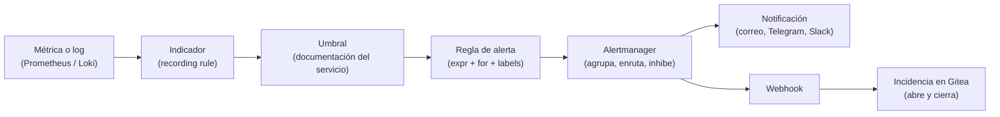
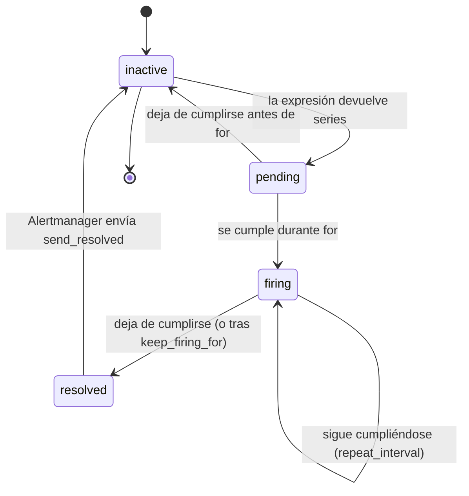
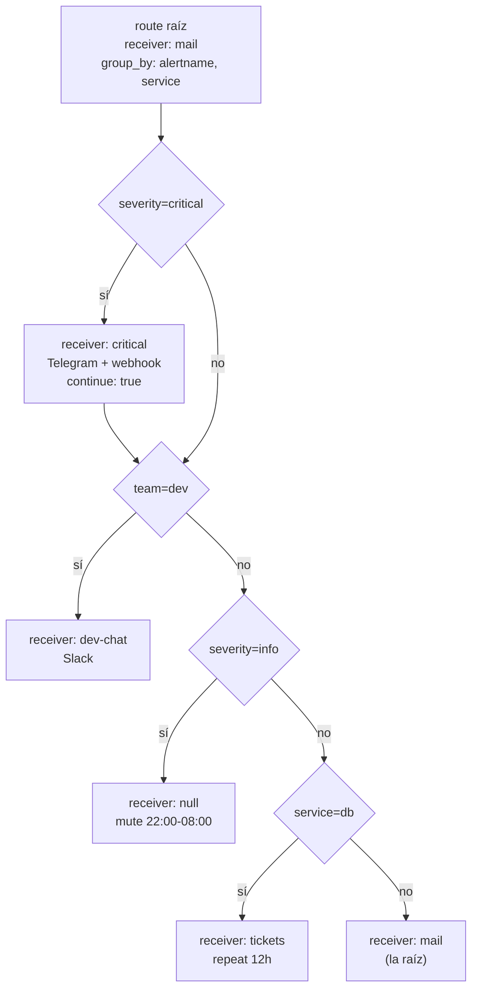

# UT2 · Umbrales, agregación y gestión de alarmas

<p class="ut-meta">Módulo 5169 · 16 h · Sesiones 8 a 15 · RA1 CE b, c, d, e</p>

En la UT1 dejamos mon01 recogiendo tres cosas del contenedor de referencia: métricas (cAdvisor, el exporter de la API y el de PostgreSQL en Prometheus), logs (Loki) y eventos del demonio Docker. Ahora mismo eso es un almacén que sólo sirve si alguien mira el dashboard. Esta unidad convierte esos datos en alarmas: condiciones que se evalúan solas, que despiertan a alguien cuando toca y que dejan rastro en un gestor de incidencias. En la UT3 protegeremos esta pila (autenticación, TLS, quién puede silenciar qué) y en la UT4 escribiremos el catálogo de alarmas y sus runbooks (el procedimiento escrito de qué hacer cuando suena cada una) a partir de lo que montemos aquí.

## Qué tienes que saber hacer al terminar

- Definir umbrales sobre contadores del contenedor (errores, latencia, memoria, reinicios, conexiones) a partir de la documentación del servicio y escribirlos en PromQL (el lenguaje de consultas de Prometheus) correcto (CE b).
- Definir cadenas a vigilar en logs y eventos y escribirlas en LogQL (el equivalente para Loki), incluidas las que necesitan parsear JSON (CE b).
- Agregar y correlar contadores mediante recording rules (consultas que Prometheus precalcula y guarda como métrica nueva) que generan indicadores nuevos con nombre normalizado (CE c).
- Integrar esos indicadores en Alertmanager (el componente que decide a quién avisar y cuándo) con reglas de alerta, agrupación, rutas, inhibición y silencios, y probar activación y recuperación (CE d).
- Almacenar cada alarma fuera de Alertmanager como incidencia, categorizada por fecha, origen, criticidad y servicio, con notificación por canal y cierre automático (CE e).

## Antes de entrar en detalle

Un jueves a las tres de la tarde la API del curso empieza a devolver errores 500 en uno de cada veinte pedidos porque PostgreSQL se ha quedado sin conexiones libres. Grafana lo pinta en rojo desde el primer minuto, pero nadie tiene el dashboard abierto: os enteráis el lunes. Con lo montado en la UT1 eso es lo normal, porque los datos se guardan pero nadie los mira. Queremos que a las tres y cinco de ese jueves llegue un mensaje al móvil de la persona de guardia diciendo qué falla y dónde, que en Gitea aparezca una incidencia con la hora exacta y que, al arreglarse, el aviso de "resuelto" salga solo y la incidencia se cierre. En una frase: que la pila de monitorización avise sola, avise a quien toca y deje constancia escrita.

| Herramienta o concepto | Qué es, en una frase | Para qué la usamos en esta unidad |
|---|---|---|
| Prometheus y PromQL | La base de datos de métricas de mon01 y su lenguaje de consultas ("cuántos errores por segundo lleva la API") | Escribir la condición numérica de cada alarma |
| Loki y LogQL | El almacén de logs de mon01 y su lenguaje de consultas, primo de PromQL pero sobre texto | Vigilar mensajes de error y eventos de Docker que no salen en ninguna métrica |
| cAdvisor y exporters | Programas que traducen el estado del contenedor, la API o PostgreSQL a métricas de Prometheus | Son el origen de los contadores sobre los que ponemos umbrales |
| Recording rule | Una consulta que Prometheus calcula cada pocos segundos y guarda como métrica nueva con nombre propio | Fabricar indicadores que no existen de serie, como el ratio de errores |
| Alertmanager | El servicio que recibe las alertas disparadas y decide a quién avisar, cómo agruparlas y cuándo callarse | Agrupar, enrutar, inhibir y silenciar sin saturar al equipo |
| promtool, amtool y lokitool | Utilidades de línea de comandos que validan los ficheros de Prometheus, Alertmanager y Loki | Comprobar cada fichero antes de recargar nada |
| Webhook | Una llamada HTTP de un programa a otro para avisar de que ha pasado algo | Sacar cada alarma de Alertmanager hacia el gestor de incidencias |
| Flask | Una librería mínima de Python para montar un servicio web en veinte líneas | Escribir el programa que recibe el webhook y habla con Gitea |
| Gitea y su API | El servidor Git del curso, con un gestor de incidencias consultable por HTTP | Guardar cada alarma como incidencia con fecha, origen, criticidad y servicio |
| Mailpit | Un servidor de correo de mentira: acepta cualquier mensaje y lo enseña en una web en vez de entregarlo | Probar las notificaciones por correo sin molestar a nadie |
| Plantillas de Go | El sistema de plantillas del lenguaje de Prometheus y Alertmanager: un texto con huecos que se rellenan | Dar formato a los mensajes de Telegram y correo |

**Cómo está organizada la unidad.** "De la métrica a la alarma" dibuja la cadena completa y fija dos ideas: se alerta por lo que sufre el usuario, no por su causa, y una alarma que nadie atiende es ruido. Siguen los dos apartados de consultas, "Umbrales sobre contadores" con PromQL y "Cadenas en logs y eventos" con LogQL, porque sin la condición no hay nada que disparar. "Agregación y correlación" guarda esas consultas como métricas nuevas, y va antes de "Reglas de alerta" porque las reglas se escriben sobre ellas, no sobre consultas crudas. "Alertmanager" es el tramo más largo: agrupar, enrutar y silenciar es donde se gana o se pierde la batalla contra la fatiga. Cierra "Categorizar, notificar y tratar", que saca las alarmas hacia Gitea y da el procedimiento para comprobar que todo funciona.

!!! info "Lo que necesitas de la otra asignatura"
    Esta unidad se hace sobre el entorno provisional de la UT1: `app01` y `mon01` son las dos VM del bridge del aula (vmbr0) que creaste en [5166 UT1, sesión 3, desde la plantilla cloud-init](https://victor-educ.github.io/apuntes-5166/ut/ut1-virtualizacion/), y las incidencias van al Gitea de 5166. Mientras trabajas aquí (29 oct a 24 nov), en 5166 se está construyendo la VPC ([UT2, del 28 oct al 18 nov](https://victor-educ.github.io/apuntes-5166/ut/ut2-vpc/)) y todavía no hay firewall: Alertmanager, Mailpit y el receptor webhook quedan abiertos en la red del aula, y por eso los tokens van en ficheros fuera del repositorio desde el primer día. Cuando 5166 termine VPC y firewall, en la UT3 de esta asignatura moveremos estas VM a la VPC dev, detrás de OPNsense, sin rehacer nada de lo que configures ahora.

## De la métrica a la alarma

Antes de escribir una sola consulta conviene ver qué piezas hay entre un número que sube en Prometheus y un mensaje en el móvil, porque cada pieza vive en un fichero distinto. Este apartado dibuja esa cadena y fija qué merece ser alarma.

Una alarma es una condición sobre los datos que, mantenida durante un tiempo, exige que alguien haga algo. Las cuatro palabras importantes son *condición*, *tiempo*, *alguien* y *algo*. Si falta cualquiera de ellas no es una alarma, es un panel con colores. La cadena completa que vamos a construir tiene seis eslabones y cada uno vive en un sitio distinto de mon01.



La métrica es lo que ya tienes. El indicador es una fórmula sobre ella (ratio de errores, percentil de latencia). El umbral es el número que separa lo normal de lo que no, y ese número no lo inventas: sale de la documentación del servicio o de un acuerdo de nivel de servicio. La regla de alerta une indicador, umbral y duración, y le pega etiquetas. Alertmanager recibe las reglas disparadas y decide a quién avisar, cuándo y cuántas veces. La notificación llega a un humano y, en paralelo, un webhook (una llamada HTTP de un programa a otro para avisar de que ha pasado algo) abre una incidencia que queda guardada aunque Alertmanager se reinicie.

### Alertar por síntomas, no por causas

El capítulo de monitorización del libro de SRE de Google (SRE, Site Reliability Engineering, es como Google llama a operar servicios; [sre.google/sre-book/monitoring-distributed-systems](https://sre.google/sre-book/monitoring-distributed-systems/), gratuito) fija el principio que vamos a seguir: las alarmas que despiertan a alguien deben responder a síntomas que sufre el usuario (la API devuelve errores, tarda demasiado, no responde), no a causas posibles (la CPU está al 90 %, hay muchas conexiones a la base de datos, el disco crece). El razonamiento es sencillo. Las causas son infinitas y cada una tiene un umbral discutible; los síntomas son pocos y todos tienen la misma consecuencia: alguien no puede usar el servicio. Una CPU al 95 % que sirve todas las peticiones en 80 ms no es un problema. Una CPU al 30 % con un 5 % de errores 500 sí lo es.

Eso no quiere decir que las métricas de causa se tiren. Sirven para dos cosas: como alarmas de aviso (warning) que se miran en horario laboral, y como paneles que consultas cuando una alarma de síntoma te ha despertado y buscas por qué. En nuestra tabla de umbrales lo verás: tasa de errores y latencia son `critical`; memoria y conexiones son `warning`.

El mismo capítulo da la regla para decidir si una alarma merece existir: cada vez que suena, alguien tiene que actuar de forma inteligente, tiene que hacerlo ahora, y eso no puede automatizarse. Si falla cualquiera de las tres condiciones, la alarma es ruido. El texto de Rob Ewaschuk que lo inspira, *My Philosophy on Alerting*, está enlazado desde ese capítulo y merece la media hora que lleva leerlo.

### Fatiga de alertas y cómo se mide

La fatiga de alertas es lo que pasa cuando el canal de notificaciones recibe tantos avisos que el equipo deja de leerlos. Es un fallo de ingeniería, no de disciplina: si en el canal de Telegram de guardia entran cuarenta mensajes al día y treinta y ocho no requieren acción, la gente aprende a ignorar el canal, y la alarma número treinta y nueve, la que importa, se pierde con las demás. Lo que distingue a un equipo que funciona es que lo mide y lo corrige.

Se mide con números que Prometheus y Alertmanager ya te dan. Prometheus expone la serie `ALERTS{alertname, alertstate, ...}` con valor 1 mientras una alerta está en `pending` o `firing`, así que puedes contar cuántas horas ha estado activa cada una en la última semana:

```promql
sum by (alertname) (count_over_time(ALERTS{alertstate="firing"}[7d]) * 15) / 3600
```

(15 es el intervalo de evaluación en segundos; ajusta al tuyo). Alertmanager expone `alertmanager_notifications_total{integration}` y `alertmanager_alerts_received_total`, con los que sacas notificaciones por día y por canal. Los indicadores que se usan en la práctica son estos cuatro:

| Indicador | Cómo se calcula | Valor razonable |
|---|---|---|
| Notificaciones por semana y persona de guardia | `increase(alertmanager_notifications_total[7d])` entre el número de personas | Menos de 10 fuera de horario |
| Porcentaje de alarmas accionables | Revisión manual semanal: de las incidencias creadas, cuántas llevaron a un cambio | Por encima del 80 % |
| Alarmas que se resuelven solas antes de que nadie mire | Incidencias cerradas por `resolved` sin comentario humano | Por debajo del 20 % |
| Tiempo hasta reconocer | Diferencia entre `startsAt` y el primer comentario en la incidencia | Minutos, no horas |

Las incidencias de Gitea que crearemos en esta unidad son precisamente lo que permite calcular los tres últimos, porque Alertmanager sólo guarda las alertas activas y olvida el pasado. Cuando una alarma sale mal en estos números se hace una de tres cosas: subir el umbral, alargar el `for`, o bajarla de `critical` a `warning` y quitarla del canal de guardia.

## Umbrales sobre contadores

{ .logo-inline } En este apartado vas a convertir los contadores que ya recoge Prometheus (peticiones, errores, memoria, reinicios, conexiones) en condiciones numéricas con un umbral justificado. Hay tres funciones de PromQL que se usan mal a menudo y un problema de etiquetas en casi todas las divisiones; sin eso, las alertas devuelven "no data" o disparan cuando no toca.

Un umbral sobre un contador nunca se escribe sobre el contador. `app_requests_total` vale 4 831 220 y mañana valdrá más: el número absoluto no dice nada. Lo que se compara con un umbral es su derivada, la tasa por segundo, o el incremento en una ventana.

### rate, increase y la ventana

`rate(c[5m])` calcula la tasa media por segundo del contador `c` en los últimos cinco minutos. `increase(c[5m])` es exactamente `rate(c[5m]) * 300`: el incremento total en la ventana. Las dos funciones corrigen los reinicios del contador (cuando el contenedor arranca de nuevo y vuelve a cero) y extrapolan al borde de la ventana, por lo que `increase` puede devolver valores no enteros aunque el contador sólo suba de uno en uno.

La ventana importa más que la función. Con un `scrape_interval` (cada cuánto Prometheus va a recoger muestras) de 15 s, `rate(c[1m])` sólo tiene cuatro muestras y va a dar picos y agujeros; `rate(c[5m])` tiene veinte y da una curva suave. Regla práctica: la ventana debe contener al menos cuatro muestras (cuatro veces el intervalo de scrape) y, para alertas, entre 2 y 10 minutos. Ventanas más largas suavizan tanto que la alarma llega tarde. `irate` toma sólo las dos últimas muestras y sirve para gráficas de detalle, no para alertar.

Hay una tercera función que necesitarás para el contador de reinicios. `container_start_time_seconds` de cAdvisor es un gauge (un valor que sube y baja; aquí, la marca de tiempo del último arranque), no un contador, así que `increase` sobre él no significa nada. La función correcta es `changes(v[1h])`, que cuenta cuántas veces ha cambiado el valor:

```promql
changes(container_start_time_seconds{name="app"}[1h]) > 3
```

El original de estos apuntes usaba `increase`; lo mantengo en la tabla como recordatorio de que hay que mirar el tipo de la métrica antes de escoger la función.

### Operadores con etiquetas

Casi todos los indicadores son una división entre dos series, y una división en PromQL sólo funciona si las etiquetas de ambos lados coinciden exactamente. Tres situaciones que te vas a encontrar:

- Las etiquetas coinciden tras agregar: `sum by (service)(rate(errores)) / sum by (service)(rate(total))`. Es el caso limpio.
- Sobran etiquetas en un lado: `container_memory_working_set_bytes{name="app"} / ignoring(id) container_spec_memory_limit_bytes{name="app"}`. `ignoring(x)` descarta `x` al emparejar; `on(a,b)` empareja sólo por `a` y `b`.
- Un lado tiene una serie y el otro varias (uno a muchos): `pg_stat_activity_count / on(server) group_left pg_settings_max_connections`. `group_left` dice que el lado izquierdo tiene más series y que la del derecho se repite para cada una.

Y una función que no es un operador pero que resuelve el problema más frecuente en alertas: `absent(up{job="app"})` devuelve 1 cuando la serie no existe. Sin ella, si el exporter desaparece, `up == 0` no dispara nada. La combinación `up{job="app"} == 0 or absent(up{job="app"})` cubre ambos casos. `absent_over_time(serie[10m])` hace lo mismo para "no ha habido muestras en 10 minutos".

### Tabla de umbrales del contenedor de referencia

Los umbrales orientativos salen de la documentación del servicio del curso: límite de memoria de 512 MiB en el Compose de app01, objetivo de latencia p95 (el tiempo por debajo del cual quedan el 95 % de las peticiones) de 500 ms y de disponibilidad del 99 % (que equivale a un 1 % de errores), `max_connections=100` en db01.

| Indicador | Consulta | Umbral orientativo | Severidad |
|---|---|---|---|
| Tasa de errores | `sum(rate(app_requests_total{status=~"5.."}[5m])) / sum(rate(app_requests_total[5m]))` | > 1 % durante 5 min | critical |
| Latencia p95 | `histogram_quantile(0.95, sum by (le)(rate(app_request_seconds_bucket[5m])))` | > 0,5 s durante 10 min | critical |
| Servicio ausente | `up{job="app"} == 0 or absent(up{job="app"})` | 2 min | critical |
| Memoria del contenedor | `container_memory_working_set_bytes{name="app"} / container_spec_memory_limit_bytes{name="app"}` | > 90 % durante 5 min | warning |
| Reinicios | `changes(container_start_time_seconds{name="app"}[1h])` (o eventos `die`) | > 3 en 1 h | warning |
| Conexiones a PostgreSQL | `pg_stat_activity_count / pg_settings_max_connections` | > 80 % | warning |

Los valores de partida vienen de la documentación; los definitivos se ajustan con una o dos semanas de datos reales. Un umbral del 1 % de errores es absurdo si el servicio lleva un 0,8 % permanente por un endpoint de salud mal configurado: primero se arregla eso, luego se pone el umbral. Para ver la distribución histórica de un indicador antes de fijar el umbral, `quantile_over_time(0.99, app:errors:ratio5m[7d])` te dice el valor que sólo se supera el 1 % del tiempo.

### Cómo elegir el for

`for` es el tiempo que la condición debe mantenerse cierta, en evaluaciones consecutivas, antes de que la alerta pase de `pending` a `firing`. Es el filtro contra picos. Tres criterios:

1. Más largo que la ventana de `rate` no tiene sentido duplicar: si ya suavizas con `[5m]`, un `for: 5m` añade otros cinco minutos de retraso. Total: diez minutos hasta el aviso. Pregúntate si el usuario aguanta diez minutos de errores.
2. Cero para lo que es irreversible o discreto: un OOM kill (el kernel ha matado el contenedor por pasarse de memoria) ya ha pasado, esperar no aporta información. `for: 0m` (o simplemente omitirlo).
3. Proporcional al coste de la falsa alarma: si la notificación despierta a alguien, `for` largo; si abre una incidencia que se mirará mañana, corto.

Prometheus 3 añade `keep_firing_for`, que mantiene la alerta en `firing` un tiempo después de que la condición deje de cumplirse. Sirve para el caso contrario al de `for`: una alarma que oscila (flapping) alrededor del umbral y genera una pareja de notificaciones (disparo, resolución) cada pocos minutos. Con `keep_firing_for: 10m` se queda encendida hasta que lleve diez minutos limpia.

## Cadenas en logs y eventos

{ .logo-inline } Hay fallos que no se ven en ninguna métrica porque la aplicación no los cuenta: una excepción concreta, un `timeout` hablando con la base de datos, un evento `oom` (sin memoria) del demonio Docker. Para esos se vigila el texto, y en nuestra pila el texto está en Loki y se consulta con LogQL.

### Selectores de stream y filtros de línea

Una consulta LogQL tiene dos partes: el selector de stream, entre llaves, que elige qué flujos de log se leen (por etiquetas indexadas, igual que en Prometheus), y una tubería de filtros y parsers que se aplican línea a línea. El selector es lo único que usa el índice; todo lo demás es un barrido del contenido. Por eso el selector debe ser lo más estrecho posible.

```text
{job="docker", container="app"}                     # todo el log del contenedor app
{container="app"} |= "ERROR"                        # líneas que contienen ERROR
{container="app"} |= "ERROR" != "healthcheck"       # ...pero no las del healthcheck
{container="app"} |~ "timeout|refused"              # expresión regular (RE2)
{container=~"app|web"} !~ "GET /static/.*"          # regex negada
```

Los cuatro filtros de línea son `|=`, `!=`, `|~` y `!~`. Se encadenan y se evalúan en orden, así que pon primero el que descarte más líneas. Las etiquetas del selector (`job`, `container`, `service`) son las que definimos en UT1 al configurar el recolector; si las cambiaste, cambian aquí.

### Parsers: json y logfmt

Cuando la aplicación escribe JSON estructurado (la API del curso lo hace: `{"level":"error","msg":"db timeout","path":"/api/orders","ms":5012}`), el parser `| json` convierte cada campo en una etiqueta temporal sobre la que puedes filtrar con los mismos operadores que en el selector:

```text
{container="app"} | json | level="error"
{container="app"} | json | level="error" | msg=~"timeout.*"
{container="app"} | json | ms > 2000
{container="app"} | json | level="error" | line_format "{{.path}} {{.msg}}"
```

Fíjate en que `level="error"` después del parser es un filtro de etiqueta (comparación exacta o regex), no un filtro de línea, y en que los campos numéricos se pueden comparar como números. `line_format` reescribe la línea con las etiquetas extraídas, útil para que la notificación lleve sólo lo que importa.

`| logfmt` hace lo mismo con el formato `clave=valor clave2="valor con espacios"` que usan Docker, Loki, Grafana y buena parte del ecosistema Go. El demonio Docker, si lo tienes en Loki vía journald (el registro del sistema de systemd), escribe en logfmt; nginx escribe en su formato propio, y para eso está `| pattern "<ip> - - <_> \"<method> <path> <_>\" <status> <_>"`, que extrae campos por posición sin regex.

Un aviso sobre coste: `| json` sobre un stream de 2 000 líneas por segundo se nota. Filtra primero con `|= "error"` (barato, busca una subcadena) y parsea después sólo las líneas que sobreviven.

### Métricas sobre logs

Para alertar hace falta un número, y LogQL obtiene números de los logs con funciones de rango sobre una consulta de log:

```text
sum(count_over_time({container="app"} |= "ERROR" [5m])) > 10
sum(count_over_time({container="app"} | json | level="error" | msg=~"timeout.*" [5m])) > 0
count_over_time({job="docker-events"} | json | Action="oom" [10m]) > 0
sum by (path)(rate({container="web"} | pattern "<_> - - <_> \"<_> <path> <_>\" <status> <_>" | status=~"5.." [5m]))
```

`count_over_time` cuenta líneas en la ventana; `rate` las divide por los segundos de la ventana; `bytes_over_time` y `bytes_rate` miden volumen, útil para detectar un contenedor que se pone a escribir sin control. Si has extraído un campo numérico con un parser, `| unwrap ms` lo convierte en valor y entonces `quantile_over_time(0.95, {container="app"} | json | unwrap ms [5m])` te da un p95 de latencia calculado desde los logs, sin instrumentar nada. Es más caro que un histograma de Prometheus y menos preciso, pero funciona con aplicaciones que no exponen métricas, que es la mayoría de las heredadas que te vas a encontrar.

Las cadenas a vigilar (mensajes de error conocidos, códigos internos) no se inventan: las da la documentación de la aplicación o su código fuente. Se mantienen en un fichero versionado junto a las reglas, con un comentario por cadena que diga de dónde sale y qué significa, porque dentro de seis meses nadie recordará por qué se vigila `"E1042"`.

### Alertas en el ruler de Loki

Loki lleva un componente, el ruler, que evalúa reglas con la misma sintaxis que Prometheus y las envía a Alertmanager. Es lo que hace que las alarmas sobre texto entren en la misma cadena que las de métricas sin pasar por Grafana. Se activa en `loki-config.yml`:

```yaml
ruler:
  storage:
    type: local
    local:
      directory: /loki/rules
  rule_path: /tmp/loki-rules-scratch
  alertmanager_url: http://alertmanager:9093
  enable_api: true
  evaluation_interval: 1m
```

Con la autenticación multiinquilino desactivada (`auth_enabled: false`, como en el laboratorio) las reglas van en `/loki/rules/fake/`, donde `fake` es el nombre del inquilino por defecto. El fichero `loki-alerts.yml` de ese directorio tiene la misma forma que uno de Prometheus; fíjate en que las expresiones son LogQL y en que cada regla lleva las etiquetas de categorización que usaremos en el resto de la unidad:

```yaml
groups:
  - name: app_logs
    interval: 1m
    rules:
      - alert: AppLogErrorsBurst
        expr: sum(count_over_time({container="app"} |= "ERROR" [5m])) > 10
        for: 2m
        labels:
          severity: warning
          team: dev
          service: app
          origen: loki
        annotations:
          summary: "Más de 10 líneas ERROR en 5 min en {{ $labels.container }}"
          runbook: "https://wiki.lab/runbooks/app-log-errors"
      - alert: AppDbTimeout
        expr: sum(count_over_time({container="app"} | json | level="error" | msg=~"timeout.*" [5m])) > 0
        for: 0m
        labels:
          severity: critical
          team: ops
          service: app
          origen: loki
        annotations:
          summary: "La API registra timeouts contra la base de datos"
      - alert: ContainerOOM
        expr: count_over_time({job="docker-events"} | json | Action="oom" [10m]) > 0
        labels:
          severity: critical
          team: ops
          service: app
          origen: docker-events
        annotations:
          summary: "OOM kill en {{ $labels.container }}"
```

Se valida con `lokitool rules lint loki-alerts.yml` (`lokitool` es la utilidad de línea de comandos de Loki y viene en la imagen de Loki 3) y se recarga con `curl -X POST http://mon01:3100/loki/api/v1/rules` o reiniciando el contenedor. Las reglas activas se ven en `GET /loki/api/v1/rules` y en `/prometheus/api/v1/alerts`, que Loki expone imitando la API de Prometheus. El ruler también admite `record:` para recording rules sobre logs, cuyo resultado puede escribirse en Prometheus con `remote_write` (el mecanismo con el que Prometheus acepta series enviadas desde fuera); no lo vamos a usar, pero es la forma de tener un contador de errores de log en Prometheus sin instrumentar la aplicación.

## Agregación y correlación: recording rules

Las consultas del apartado anterior funcionan, pero son largas, se repiten en cada panel y en cada alerta, y cada uno las calcula por su cuenta. Este apartado enseña a guardarlas una sola vez como métricas nuevas con nombre propio. Al terminar tendrás un `rules.yml` con los indicadores del contenedor de referencia listos para las reglas de alerta.

Una recording rule evalúa una expresión PromQL cada cierto tiempo y guarda el resultado como una serie nueva, con su propio nombre, en la base de datos de Prometheus. A partir de ese momento es una métrica más: se consulta, se grafica y se alerta sobre ella igual que sobre `up`.

### Por qué precalcular

Tres razones, en orden de importancia para nosotros:

**Correlar.** El indicador "ratio de errores" no existe en ninguna métrica; existe en la relación entre dos contadores. La recording rule lo materializa. Lo mismo con "latencia por petición", "porcentaje de memoria usada" o "conexiones respecto al máximo". Esto es literalmente el CE c: agregar y correlar contadores para obtener indicadores nuevos.

**Agregar.** Pasar de una serie por instancia (tres réplicas de la API, cada una con sus contadores) a una serie por servicio. Las alertas deben mirar el servicio, no la réplica: que una réplica tenga un 3 % de errores mientras el balanceador la ha sacado del pool no es un incidente.

**Aligerar.** `histogram_quantile` sobre un histograma con 12 buckets y 3 réplicas, calculado cada 15 s por cada panel de Grafana que lo pinta y cada regla que lo evalúa, es un coste que se multiplica. Precalculado una vez cada 30 s, cuesta lo mismo pintar diez paneles que uno.

Hay una cuarta razón menos evidente: coherencia. Si el panel calcula el ratio de errores con una fórmula y la alerta con otra ligeramente distinta (ventana de 5 m en una, de 2 m en la otra), tendrás alarmas disparadas con paneles en verde y nadie se fiará de ninguno de los dos. Con la recording rule, ambos usan la misma serie.

### Convención de nombres

Prometheus recomienda `nivel:métrica:operaciones`, separado por dos puntos, que es el único carácter que no puede aparecer en el nombre de una métrica exportada (así nunca chocan):

- `nivel` es el nivel de agregación, es decir, las etiquetas que quedan: `service`, `instance`, `path`. En el laboratorio agregamos por servicio y lo abreviamos como `app`, `db`.
- `métrica` es el nombre de la métrica base sin sufijo `_total`: `requests`, `errors`, `latency_p95`.
- `operaciones` es lo que se le ha hecho, incluida la ventana: `rate5m`, `ratio5m`, `sum`.

Así, `app:errors:ratio5m` se lee como "en el nivel de servicio app, ratio de errores, ventana de 5 m". Cuando encadenas reglas (una que usa el resultado de otra), el nombre de la segunda hereda el nivel y añade operaciones. La guía oficial, con más ejemplos, está en [prometheus.io/docs/practices/rules](https://prometheus.io/docs/practices/rules/).

### El fichero rules.yml

Los cinco indicadores de la tabla de umbrales, convertidos en métricas grabadas. Fíjate en el nombre de cada regla, en el `sum by (service)` que agrega por servicio y en los `ignoring` y `group_left` de los operadores con etiquetas.

```yaml
groups:
  - name: app_rules
    interval: 30s
    rules:
      - record: app:requests:rate5m
        expr: sum by (service)(rate(app_requests_total[5m]))
      - record: app:errors:ratio5m
        expr: |
          sum by (service)(rate(app_requests_total{status=~"5.."}[5m]))
          /
          sum by (service)(rate(app_requests_total[5m]))
      - record: app:latency_p95:5m
        expr: histogram_quantile(0.95, sum by (service, le)(rate(app_request_seconds_bucket[5m])))
      - record: app:memory:ratio
        expr: |
          container_memory_working_set_bytes{name="app"}
          / ignoring(id)
          container_spec_memory_limit_bytes{name="app"}
      - record: db:connections:ratio
        expr: pg_stat_activity_count / on(server) group_left pg_settings_max_connections
```

Todas las reglas de un grupo se evalúan en secuencia, cada `interval`, así que dentro de un grupo una regla puede usar el resultado de la anterior en la misma pasada. Entre grupos no hay orden garantizado. El fichero se referencia desde `prometheus.yml` con `rule_files: [ "rules.yml", "alerts.yml" ]`, se valida con `promtool check rules rules.yml` (`promtool` es la utilidad de línea de comandos que acompaña a Prometheus; siempre, antes de recargar) y se aplica con `curl -X POST http://mon01:9090/-/reload` si Prometheus arrancó con `--web.enable-lifecycle`, o con `kill -HUP` al proceso. Un error de sintaxis con reload en caliente no tumba Prometheus: se queda con la configuración anterior y lo registra en el log, así que mira `prometheus_config_last_reload_successful` después de cada cambio.

Las alertas usan las métricas grabadas, no las consultas crudas. Es la norma del repositorio de alerting y se revisa en la práctica.

## Reglas de alerta

Aquí se juntan umbrales, indicadores grabados y `for` en un fichero `alerts.yml` que Prometheus evalúa solo. Lo que este apartado añade es lo que decide todo lo que viene después: las etiquetas que Alertmanager usará para enrutar y las anotaciones que leerá la persona avisada.

Una regla de alerta tiene la misma estructura que una recording rule, pero en lugar de guardar la serie la compara con un umbral y, si se cumple durante `for`, la envía a Alertmanager con sus etiquetas y anotaciones. El fichero siguiente traduce la tabla de umbrales a seis reglas; fíjate en que las `expr` usan las métricas grabadas y en que las cinco etiquetas se repiten en todas.

```yaml
groups:
  - name: app_alerts
    rules:
      - alert: AppHighErrorRate
        expr: app:errors:ratio5m > 0.01
        for: 5m
        labels:
          severity: critical
          team: ops
          service: app
          origen: prometheus
          env: dev
        annotations:
          summary: "Errores 5xx al {{ $value | humanizePercentage }} en {{ $labels.service }}"
          description: "El ratio de errores lleva 5 min por encima del 1 % (SLA). Revisa app01 y db01."
          runbook: "https://wiki.lab/runbooks/app-errors"
      - alert: AppHighLatency
        expr: app:latency_p95:5m > 0.5
        for: 10m
        labels: { severity: critical, team: ops, service: app, origen: prometheus, env: dev }
        annotations:
          summary: "p95 de {{ $value | humanizeDuration }} en {{ $labels.service }}"
          runbook: "https://wiki.lab/runbooks/app-latency"
      - alert: AppDown
        expr: up{job="app"} == 0 or absent(up{job="app"})
        for: 2m
        labels: { severity: critical, team: ops, service: app, origen: prometheus, env: dev }
        annotations:
          summary: "El exporter de app no responde desde hace 2 min"
      - alert: AppMemoryHigh
        expr: app:memory:ratio > 0.9
        for: 5m
        labels: { severity: warning, team: dev, service: app, origen: cadvisor, env: dev }
        annotations:
          summary: "Memoria al {{ $value | humanizePercentage }} del límite en {{ $labels.name }}"
      - alert: AppRestarting
        expr: changes(container_start_time_seconds{name="app"}[1h]) > 3
        for: 0m
        labels: { severity: warning, team: dev, service: app, origen: cadvisor, env: dev }
        annotations:
          summary: "app reiniciado {{ $value }} veces en 1 h"
      - alert: DbConnectionsHigh
        expr: db:connections:ratio > 0.8
        for: 5m
        labels: { severity: warning, team: ops, service: db, origen: postgres_exporter, env: dev }
        annotations:
          summary: "PostgreSQL al {{ $value | humanizePercentage }} de max_connections"
```

Cargado este fichero y recargado Prometheus, las seis reglas aparecen en la pestaña *Alerts* en verde (`inactive`); si alguna sale en amarillo o rojo nada más cargar, revisa el umbral antes de seguir.

### Etiquetas y anotaciones

Las etiquetas viajan con la alerta y son lo único que Alertmanager usa para agrupar, enrutar e inhibir. Por eso el conjunto tiene que ser el mismo en todas las reglas: `severity` (critical, warning, info), `team` (ops, dev), `service` (app, db, web), `origen` (prometheus, cadvisor, loki, docker-events, postgres_exporter) y `env` (dev, pre, pro). Es la categorización que pide el CE e, decidida en el origen. A esas etiquetas Prometheus añade las de la propia serie (`instance`, `job`, `name`, `service` si viene de la recording rule) y `alertname`.

Las anotaciones no se usan para enrutar; son texto para la persona que recibe el aviso. Se escriben con plantillas de Go (texto con huecos entre dobles llaves): `{{ $labels.service }}` inserta una etiqueta, `{{ $value }}` el valor de la expresión en el momento de disparar, y las funciones `humanize` (1234567 pasa a 1.235M), `humanizePercentage` (0.0234 pasa a 2.34 %), `humanizeDuration` (0.5 pasa a 500ms) y `humanizeTimestamp` hacen el valor legible. Convención del laboratorio: `summary` de una línea con el qué y el dónde, `description` con el contexto que no cabe en un mensaje de Telegram, `runbook` con la URL del procedimiento (que escribiréis en UT4).

Prometheus valida la sintaxis con `promtool check rules alerts.yml` y, mejor, permite probar la lógica sin esperar a que pase nada con `promtool test rules`, que toma series sintéticas y comprueba qué alertas deben disparar en cada instante.

### Estados de una alerta



Los tres primeros estados los ves en Prometheus, en la pestaña *Alerts*: `inactive` (verde), `pending` (amarillo, con el tiempo que lleva) y `firing` (rojo). Prometheus manda la alerta a Alertmanager en cuanto entra en `firing` y la reenvía en cada evaluación mientras siga así; cuando deja de cumplirse, manda una última vez con `endsAt` fijado, y eso es lo que Alertmanager interpreta como `resolved`. Si Prometheus muere sin despedirse, Alertmanager considera resuelta la alerta cuando pasa `resolve_timeout` (5 min por defecto) sin recibirla.

## Alertmanager

Prometheus evalúa; Alertmanager decide. Recibe alertas de uno o varios Prometheus (y del ruler de Loki, y de Grafana si se configura) y hace cinco cosas con ellas: deduplica (dos Prometheus en alta disponibilidad mandan la misma alerta y sale una), agrupa, enruta, inhibe y silencia. Luego notifica por los receptores configurados y repite mientras la alerta siga activa. Configuración en `alertmanager.yml`, validación con `amtool check-config alertmanager.yml` (`amtool` es a Alertmanager lo que `promtool` a Prometheus), recarga con `POST /-/reload`.

### El árbol de rutas

Este es el `alertmanager.yml` completo del laboratorio: valores globales, plantillas, el árbol `route` con sus rutas hijas, intervalos de tiempo, inhibiciones y, al final, los receptores a los que apuntan las rutas. Fíjate en el `continue: true` de la ruta critical y en que los secretos van en ficheros, no en el YAML.

```yaml
global:
  resolve_timeout: 5m
  smtp_smarthost: mailpit:1025
  smtp_from: alertmanager@lab
  smtp_require_tls: false

templates:
  - /etc/alertmanager/templates/*.tmpl

route:
  receiver: mail
  group_by: [alertname, service]
  group_wait: 30s
  group_interval: 5m
  repeat_interval: 4h
  routes:
    - matchers: [severity="critical"]
      receiver: critical
      continue: true
    - matchers: [team="dev"]
      receiver: dev-chat
      group_by: [alertname, service, env]
    - matchers: [severity="info"]
      receiver: "null"
      mute_time_intervals: [noches]
    - matchers: [service="db"]
      receiver: tickets
      repeat_interval: 12h

time_intervals:
  - name: noches
    time_intervals:
      - times: [{ start_time: "22:00", end_time: "08:00" }]
        location: Europe/Madrid

inhibit_rules:
  - source_matchers: [alertname="HostDown"]
    target_matchers: [severity=~"warning|critical"]
    equal: [instance]
  - source_matchers: [alertname="AppDown"]
    target_matchers: [service="app"]
    equal: [env]

receivers:
  - name: mail
    email_configs:
      - to: ops@lab
        send_resolved: true
  - name: critical
    telegram_configs:
      - bot_token_file: /etc/alertmanager/secrets/tg_token
        chat_id: -100123456789
        parse_mode: HTML
        send_resolved: true
    webhook_configs:
      - url: http://tickets:5000/alertmanager
        send_resolved: true
  - name: dev-chat
    slack_configs:
      - api_url_file: /etc/alertmanager/secrets/slack_url
        channel: "#dev-alerts"
        send_resolved: true
  - name: tickets
    webhook_configs:
      - url: http://tickets:5000/alertmanager
        send_resolved: true
  - name: "null"
```



El árbol se recorre desde la raíz, en orden, y en cuanto una ruta coincide se detiene ahí y usa ese receptor. Salvo que la ruta tenga `continue: true`: entonces, además de usar su receptor, sigue probando las hermanas siguientes. En el ejemplo, una alerta `severity=critical, team=dev` va a `critical` (Telegram y ticket) y también a `dev-chat` (Slack); una `severity=warning, team=dev` sólo a `dev-chat`; una `severity=warning, team=ops, service=app` no coincide con ninguna hija y cae en el receptor de la raíz, `mail`. Los parámetros de agrupación y repetición se heredan de la raíz y cada ruta puede sobrescribirlos, como hace `tickets` con `repeat_interval` o `dev-chat` con `group_by`. `amtool config routes test --config.file=alertmanager.yml severity=critical team=dev` te dice a qué receptores llegaría un conjunto de etiquetas sin tener que provocar nada.

Los `matchers` admiten `=`, `!=`, `=~` y `!~`, y una lista de varios se combina con AND. El receptor `"null"` (con comillas, porque YAML interpretaría `null` como valor nulo) es la forma estándar de descartar: la alerta existe, se ve en la interfaz, pero no notifica.

### group_wait, group_interval y repeat_interval

Los tres parámetros que más confusión generan, con una línea temporal. Supón `group_by: [alertname, service]`, `group_wait: 30s`, `group_interval: 5m`, `repeat_interval: 4h`, y que app01 se queda sin base de datos a las 10:00:00.

| Instante | Qué pasa |
|---|---|
| 10:00:00 | Llega `AppHighErrorRate{service=app}`. No existe el grupo (`AppHighErrorRate`, `app`); se crea y arranca `group_wait`. |
| 10:00:20 | Llega `AppHighErrorRate{service=app, instance=app01:8000}` (otra réplica, misma alerta y servicio). Entra en el mismo grupo. No se notifica todavía. |
| 10:00:30 | Vence `group_wait`. Se envía **una** notificación con las dos alertas del grupo. |
| 10:02:00 | Llega una tercera réplica al grupo. No se notifica: el grupo está en su `group_interval`. |
| 10:05:30 | Vence `group_interval`. Como el grupo ha cambiado (hay una alerta nueva), se envía una notificación actualizada con las tres. |
| 10:10:30 | Vence otro `group_interval`. Nada ha cambiado, no se envía nada. |
| 14:00:30 | Han pasado 4 h desde la última notificación de un grupo sin cambios: vence `repeat_interval` y se reenvía, por si nadie lo ha atendido. |
| 14:20:00 | Se arregla. Las tres alertas llegan con `endsAt`. En el siguiente vencimiento de `group_interval` (14:20:30 como pronto, 14:25:30 en el peor caso) se envía la notificación de resolución, si `send_resolved: true`. |

`group_wait` es la espera inicial para juntar alertas que llegan a la vez (diez contenedores muertos en un host caído, en un solo correo). `group_interval` es cada cuánto se revisa un grupo ya notificado para mandar los cambios (nuevas alertas o resoluciones). `repeat_interval` es cada cuánto se insiste con un grupo que no ha cambiado, y siempre debe ser múltiplo de `group_interval` porque sólo se comprueba en esos vencimientos. Un `group_wait` de 0 s da inmediatez a cambio de una notificación por alerta; un `repeat_interval` de 1 h con diez alarmas activas son 240 mensajes al día.

### Inhibición

Una regla de inhibición dice: mientras esté activa una alerta que cumpla `source_matchers`, no notifiques las que cumplan `target_matchers` y compartan los valores de las etiquetas de `equal`. El caso canónico es el del ejemplo: si `HostDown{instance="app01"}` está en firing, las cuarenta alertas de contenedores, memoria y latencia de `app01` son consecuencia, no información, y se callan. Siguen existiendo (se ven en la interfaz marcadas como inhibidas) pero no llegan a ningún receptor ni al webhook. `equal` es imprescindible: sin él, un host caído en el CPD de Madrid silenciaría las alertas de Sevilla. Y cuidado con las inhibiciones circulares: si A inhibe a B y B inhibe a A, Alertmanager las resuelve de forma poco intuitiva.

### Silencios

Un silencio es una inhibición temporal creada a mano, con matchers, principio, fin y un comentario obligatorio que diga por qué. Se crean desde la interfaz web (puerto 9093) o con `amtool`:

```bash
amtool --alertmanager.url=http://mon01:9093 silence add \
  service=db env=dev --duration=2h \
  --author=victor --comment="Mantenimiento PostgreSQL 17.x, ticket #142"
amtool --alertmanager.url=http://mon01:9093 silence query
amtool --alertmanager.url=http://mon01:9093 silence expire <id>
amtool --alertmanager.url=http://mon01:9093 alert query severity=critical
```

Los silencios se guardan en el directorio de datos de Alertmanager (`--storage.path`), así que sobreviven a un reinicio del contenedor si el volumen persiste. Lo que no sobrevive es la memoria de las alertas: Alertmanager no tiene historial. Lo que ya no está en firing desaparece. Esa es la razón del webhook y las incidencias que vienen después.

### Receptores y plantillas

Alertmanager 0.28 trae integraciones para correo, Slack, Telegram, Discord, Microsoft Teams, PagerDuty, OpsGenie, Pushover, VictorOps, WeChat, SNS, webhook genérico y alguna más. Para el laboratorio usamos cuatro:

- **Correo** contra Mailpit (un SMTP de pruebas, explicado más abajo): `smtp_smarthost: mailpit:1025`, `smtp_require_tls: false`. En producción sería el relay de la empresa con `smtp_auth_username`/`smtp_auth_password_file` y TLS.
- **Telegram**: creas el bot con @BotFather, metes el bot en un grupo y obtienes el `chat_id` (negativo para grupos; el de un supergrupo empieza por -100). El token va en fichero (`bot_token_file`) y ese fichero fuera del repositorio; en UT3 lo formalizaremos.
- **Slack**: un webhook entrante de la aplicación de Slack, también en fichero.
- **Webhook**: un POST con JSON a la URL que digas. Es la integración universal: cualquier cosa que no esté en la lista se hace con esto.

Todas admiten `send_resolved`, y el valor por defecto cambia según la integración (en Slack es `false`). Ponlo explícito siempre: una alarma cuya resolución no se notifica obliga a mirar el panel para saber si sigue viva.

El texto de la notificación se controla con plantillas de Go. Las que trae Alertmanager por defecto son largas y feas en Telegram; una plantilla propia en `/etc/alertmanager/templates/lab.tmpl`:

```text
{{ define "lab.title" }}[{{ .Status | toUpper }}{{ if eq .Status "firing" }}:{{ .Alerts.Firing | len }}{{ end }}] {{ .GroupLabels.alertname }} ({{ .GroupLabels.service }}){{ end }}

{{ define "lab.telegram" }}
<b>{{ template "lab.title" . }}</b>
{{ range .Alerts -}}
<b>{{ .Status | toUpper }} · {{ .Labels.severity }}</b> {{ .Annotations.summary }}
Desde: {{ .StartsAt.Format "02/01 15:04" }} · Origen: {{ .Labels.origen }}
{{ if .Annotations.runbook }}<a href="{{ .Annotations.runbook }}">Runbook</a>{{ end }}
{{ end }}
{{ end }}
```

y en el receptor, `telegram_configs: [{ ..., message: '{{ template "lab.telegram" . }}' }]`. Los objetos disponibles (`.Status`, `.Alerts`, `.Alerts.Firing`, `.GroupLabels`, `.CommonLabels`, `.CommonAnnotations`, `.ExternalURL`) están en la [referencia de notificaciones](https://prometheus.io/docs/alerting/latest/notifications/). El estado en mayúsculas al principio de cada línea permite distinguir FIRING de RESOLVED en el móvil antes de leer nada más.

### Mailpit como SMTP de pruebas

Mailpit es un servidor SMTP falso: acepta cualquier correo en el puerto 1025, no lo entrega a nadie, y lo muestra en una interfaz web en el 8025 con búsqueda y vista del HTML. Sustituye a MailHog, que lleva años sin mantenimiento. En el Compose de mon01:

```yaml
  mailpit:
    image: axllent/mailpit
    ports: ["8025:8025", "1025:1025"]
    environment:
      MP_MAX_MESSAGES: 500
```

Con eso puedes probar plantillas de correo y comprobar `send_resolved` sin molestar a nadie ni depender del relay de la empresa. Tiene además una API (`/api/v1/messages`) que permite comprobar desde un script que ha llegado un correo con cierto asunto, lo que convierte la verificación de alarmas en algo automatizable.

## Categorizar, notificar y tratar

Cada alarma que sale de Alertmanager se clasifica para decidir quién la atiende, con qué prioridad y dónde queda registrada. La clasificación no se hace a mano: viene en las etiquetas que pusimos en la regla y en los campos que añade Alertmanager.

| Parámetro | Valores | De dónde sale |
|---|---|---|
| Fecha de creación | `startsAt` (fecha en formato estándar RFC 3339, en UTC) | Alertmanager, del primer envío de Prometheus |
| Fecha de resolución | `endsAt` | Alertmanager, cuando llega el resolved |
| Origen | prometheus, cadvisor, loki, docker-events, postgres_exporter | Etiqueta `origen` de la regla |
| Criticidad | critical, warning, info | Etiqueta `severity` |
| Servicio / entorno | app, db, web; dev, pre, pro | Etiquetas `service`, `env` |
| Equipo | ops, dev | Etiqueta `team` |
| Estado | firing, resolved (más silenced e inhibited en la interfaz) | Campo `status` |
| Identidad | `fingerprint` (hash de las etiquetas) | Alertmanager; es lo que permite emparejar el firing con su resolved |

### El JSON del webhook

Alertmanager envía al webhook un POST con `Content-Type: application/json` y este cuerpo (recortado sólo en las URL):

```json
{
  "version": "4",
  "groupKey": "{}/{severity=\"critical\"}:{alertname=\"AppHighErrorRate\", service=\"app\"}",
  "truncatedAlerts": 0,
  "status": "firing",
  "receiver": "critical",
  "groupLabels": { "alertname": "AppHighErrorRate", "service": "app" },
  "commonLabels": {
    "alertname": "AppHighErrorRate", "env": "dev", "origen": "prometheus",
    "service": "app", "severity": "critical", "team": "ops"
  },
  "commonAnnotations": {
    "summary": "Errores 5xx al 2.4% en app",
    "runbook": "https://wiki.lab/runbooks/app-errors"
  },
  "externalURL": "http://mon01:9093",
  "alerts": [
    {
      "status": "firing",
      "labels": {
        "alertname": "AppHighErrorRate", "env": "dev", "origen": "prometheus",
        "service": "app", "severity": "critical", "team": "ops"
      },
      "annotations": {
        "summary": "Errores 5xx al 2.4% en app",
        "description": "El ratio de errores lleva 5 min por encima del 1 % (SLA). Revisa app01 y db01.",
        "runbook": "https://wiki.lab/runbooks/app-errors"
      },
      "startsAt": "2026-11-12T09:41:30.512Z",
      "endsAt": "0001-01-01T00:00:00Z",
      "generatorURL": "http://mon01:9090/graph?g0.expr=app%3Aerrors%3Aratio5m+%3E+0.01",
      "fingerprint": "5c2f8a1e9b0d4c77"
    }
  ]
}
```

Tres detalles que importan al escribir el receptor. `status` del sobre es `firing` si alguna alerta del grupo lo está, y `resolved` sólo cuando todas lo están; por eso hay que mirar el `status` de cada elemento de `alerts`, no el del sobre. `endsAt` vale la fecha cero de Go mientras la alerta está activa. Y `fingerprint` es estable para el mismo conjunto de etiquetas, así que es el identificador natural para saber qué incidencia cerrar. `truncatedAlerts` es mayor que cero si el grupo tenía más alertas de las que caben (`max_alerts` en el receptor).

### Receptor Flask que abre y cierra incidencias en Gitea

Gitea está en gitea01 desde la 5166, así que las incidencias van ahí. El receptor es un script en Flask (una librería mínima de Python para montar un servicio web en pocas líneas). Recibe el POST, crea una issue por cada alerta en `firing` que no tenga ya una abierta, y cierra la correspondiente cuando llega en `resolved`. La relación fingerprint → número de issue se guarda en un JSON en disco para que sobreviva a un reinicio.

```python
import json, os, requests
from flask import Flask, request

GITEA = os.environ.get("GITEA_URL", "http://gitea01:3000")
REPO = os.environ.get("GITEA_REPO", "ops/incidencias")
HDR = {"Authorization": "token " + os.environ["GITEA_TOKEN"]}
API = f"{GITEA}/api/v1/repos/{REPO}/issues"
STATE_FILE = os.environ.get("STATE_FILE", "/data/issues.json")

app = Flask(__name__)
state = json.load(open(STATE_FILE)) if os.path.exists(STATE_FILE) else {}

def save():
    json.dump(state, open(STATE_FILE, "w"))

def abrir(a):
    l, an = a["labels"], a.get("annotations", {})
    titulo = f"[{l.get('severity','?')}][{l.get('service','?')}] {l['alertname']}: {an.get('summary','')}"
    cuerpo = (f"**Inicio:** {a['startsAt']}\n**Origen:** {l.get('origen','?')} · "
              f"**Entorno:** {l.get('env','?')} · **Equipo:** {l.get('team','?')}\n\n"
              f"{an.get('description','')}\n\nRunbook: {an.get('runbook','-')}\n"
              f"Consulta: {a.get('generatorURL','')}\n\n`fingerprint: {a['fingerprint']}`")
    r = requests.post(API, json={"title": titulo, "body": cuerpo}, headers=HDR, timeout=10)
    r.raise_for_status()
    state[a["fingerprint"]] = r.json()["number"]

def cerrar(a):
    num = state.pop(a["fingerprint"], None)
    if num is None:
        return
    requests.post(f"{API}/{num}/comments", headers=HDR, timeout=10,
                  json={"body": f"Resuelta automáticamente. Fin: {a['endsAt']}"})
    requests.patch(f"{API}/{num}", json={"state": "closed"}, headers=HDR, timeout=10)

@app.post("/alertmanager")
def alertmanager():
    for a in request.get_json(force=True)["alerts"]:
        if a["status"] == "firing" and a["fingerprint"] not in state:
            abrir(a)
        elif a["status"] == "resolved":
            cerrar(a)
    save()
    return "", 204

if __name__ == "__main__":
    app.run(host="0.0.0.0", port=5000)
```

El token de Gitea se genera en *Configuración → Aplicaciones → Generar token* con permiso de escritura sobre issues y se pasa por variable de entorno, nunca en el código. Las etiquetas de Gitea (las de colores) se asignan por identificador numérico en la API (`"labels": [3, 7]`), no por nombre, así que el script las mete en el título entre corchetes, que es buscable y no requiere mantener un mapa; si quieres etiquetas reales, consulta `GET /api/v1/repos/{owner}/{repo}/labels` una vez al arrancar y construye el diccionario nombre → id. Con GitLab el cambio es mínimo: `POST /api/v4/projects/:id/issues` con `labels: "critical,app,prometheus"` (ahí sí van por nombre), cabecera `PRIVATE-TOKEN`, y el cierre es `PUT /issues/:iid` con `state_event=close`.

Con esto la alarma queda almacenada fuera de Alertmanager: cuándo empezó, cuándo terminó, qué era, quién comentó qué. Y de paso tienes los datos para medir la fatiga de alertas del apartado inicial. La alternativa sin código es n8n (o Node-RED), automatización visual encadenando cajas de "cuando llegue esto, haz aquello", con un nodo webhook y un nodo HTTP; hace lo mismo con clics y es lo que verás en empresas que no quieren mantener scripts. Zammad y GLPI tienen API equivalentes si el gestor de incidencias es uno de esos.

### Grafana Alerting como alternativa

{ .logo-inline } Grafana 12 trae su propio motor de alertas: reglas que se definen desde la interfaz sobre cualquier fuente de datos (Prometheus, Loki, PostgreSQL, InfluxDB), con periodo de evaluación y pendiente equivalentes a `interval` y `for`, puntos de contacto que son los receptores, y políticas de notificación que son el árbol de rutas. Por debajo lleva embebido un Alertmanager, y puede configurarse para enviar a uno externo (el nuestro en mon01) en lugar de al suyo.

<figure markdown="span">
  { width="640" }
  <figcaption>Un dashboard de Grafana. Las reglas de Grafana Alerting se crean desde el mismo panel que muestra la serie. Fuente: Joel Kennedy, dominio público, vía Wikimedia Commons.</figcaption>
</figure>

Cuándo sí: cuando la fuente de datos no tiene ruler propio (una base de datos SQL, un Elasticsearch), cuando el equipo que define las alertas trabaja sólo en Grafana y no toca ficheros YAML, o cuando quieres una alerta puntual sobre un panel sin pasar por el repositorio. Cuándo no: cuando las reglas deben vivir en Git con revisión y `promtool test` (Grafana permite provisionarlas desde ficheros, pero el flujo es más incómodo), cuando ya tienes el ruler de Loki y Prometheus mandando al mismo Alertmanager (tener reglas en dos motores es tener dos sitios donde buscar), y cuando la disponibilidad de las alertas no puede depender de la base de datos de Grafana. En el laboratorio la norma es: reglas en ficheros, Prometheus y Loki como motores, Grafana para mirar.

### Procedimiento de verificación de una alarma

Sin esta prueba una alarma no se considera en producción. Se ejecuta para cada alarma nueva y cada cambio de umbral, `for` o ruta, y el resultado se apunta en el informe.

| Paso | Qué haces | Qué compruebas | Dónde |
|---|---|---|---|
| 1 | Anotas la hora y provocas la condición (tráfico con errores vía k6, una herramienta de generación de carga, o `curl` en bucle, `docker update --memory`, `docker kill`, `pg_sleep` en muchas conexiones) | El indicador cruza el umbral en la gráfica | Prometheus *Graph* o Grafana |
| 2 | Esperas | La alerta pasa a `pending` con el reloj del `for` | Prometheus *Alerts* |
| 3 | Esperas `for` | Pasa a `firing`; anotas el tiempo desde el paso 1 | Prometheus *Alerts* y Alertmanager (9093) |
| 4 | Esperas `group_wait` | Llega la notificación a cada canal de la ruta, con el texto de la plantilla correcto | Mailpit (8025), Telegram, Slack |
| 5 | Miras Gitea | Existe la issue con título, etiquetas y fecha correctos | Gitea, repositorio ops/incidencias |
| 6 | Resuelves la causa | El indicador vuelve por debajo del umbral | Prometheus *Graph* |
| 7 | Esperas `group_interval` | Llega la notificación de resolución (`send_resolved`); anotas el tiempo desde el paso 6 | Los mismos canales |
| 8 | Miras Gitea | La issue está cerrada con el comentario de resolución | Gitea |
| 9 | Registras | Alarma, cómo se provoca, tiempo hasta firing, canales, issue, tiempo hasta resolved, issue cerrada | Informe de verificación |

Los tiempos del paso 3 y del 7 son los que luego comparas con lo que el servicio tolera. Si el usuario nota los errores a los 30 s y tu alarma tarda 10 min en sonar, o bajas el `for` o aceptas que esa alarma es de diagnóstico, no de aviso.

## Errores frecuentes en el laboratorio

**La alerta nunca sale de `pending`.** Casi siempre es porque la expresión devuelve series de forma intermitente: con `rate(x[1m])` y scrape de 15 s, hay evaluaciones en las que la ventana no tiene muestras suficientes y la serie desaparece, lo que reinicia el contador de `for`. Amplía la ventana a `[5m]` o revisa que `evaluation_interval` no sea mayor que el scrape.

**`increase` devuelve 2,7 reinicios.** Es la extrapolación de la ventana, y además `container_start_time_seconds` es un gauge. Usa `changes()` para gauges que representan marcas de tiempo, y si necesitas un entero para un contador real, `round(increase(...))` o `resets()`.

**La división devuelve "no data".** Las etiquetas de numerador y denominador no coinciden. Ejecuta cada lado por separado, compara las etiquetas y añade `ignoring(...)`, `on(...)` o el `sum by` que falte. Con cAdvisor el culpable habitual es `id` o `image`.

**El exporter cae y no salta nada.** `up == 0` no dispara si la serie ha desaparecido del todo (por ejemplo, porque el target lo generaba un descubrimiento que ya no lo lista). Añade `or absent(up{job="..."})`.

**Alertmanager rechaza el fichero: `receiver "null" not found`.** Has escrito `receiver: null` sin comillas y YAML lo ha convertido en valor nulo. Ponlo entre comillas en los dos sitios.

**Llegan notificaciones por duplicado.** O la ruta tiene `continue: true` y dos receptores comparten canal, o tienes dos Prometheus con `external_labels` distintas mandando la "misma" alerta (para Alertmanager son distintas si difieren en cualquier etiqueta). `amtool alert query` te muestra las etiquetas completas.

**El correo no llega a Mailpit.** `smtp_require_tls` está a `true` por defecto y Mailpit no habla TLS de serie. Ponlo a `false` en `global`. Si ves `dial tcp: lookup mailpit`, el contenedor de Alertmanager no está en la misma red de Compose que Mailpit.

**Telegram devuelve `Bad Request: chat not found`.** El bot no está en el grupo, o el `chat_id` es el de un usuario y no el del grupo (que es negativo). Manda un mensaje al grupo con el bot dentro y consulta `https://api.telegram.org/bot<TOKEN>/getUpdates`.

**El ruler de Loki no carga las reglas.** El directorio es `/loki/rules/<tenant>/` y con `auth_enabled: false` el tenant es `fake`. Un fichero directamente en `/loki/rules/` se ignora sin error. Y la validación: `lokitool rules lint`.

**El webhook crea una issue por cada repetición.** El script no comprueba si el `fingerprint` ya tiene issue, o el fichero de estado está en un directorio que no persiste entre reinicios del contenedor. Monta `/data` como volumen.

**La inhibición no inhibe.** Falta `equal` o los valores de la etiqueta no coinciden literalmente (`instance="app01:9100"` en la fuente y `instance="app01:8080"` en el objetivo son distintos). Usa una etiqueta común como `host` puesta por `relabel_configs`, o inhibe por `env`.

## Actividades

### A2.1 Umbrales sobre contadores (sesión 8)

A partir de la documentación del servicio (te la da el profesor: límites de memoria, SLA de latencia y errores, `max_connections`), define cinco umbrales sobre los contadores del contenedor de referencia. Escribe las consultas PromQL, ejecútalas en Prometheus con tráfico real generado con k6 o un bucle de `curl`, y anota para cada una el valor normal observado y el umbral propuesto. Entrega un fichero `umbrales.md` con la tabla: indicador, consulta, umbral, severidad, de dónde sale el número.

### A2.2 Cadenas en logs y eventos (sesión 9)

Lista los mensajes de error conocidos de la aplicación (mínimo cinco, sacados de su documentación o de su código) y escribe la consulta LogQL de cada uno, al menos dos con parser `json`. Escribe además una regla para `oom` y otra para `unhealthy` a partir del stream de eventos Docker. Prueba todas con `logcli` contra mon01 y guárdalas en `cadenas.md` con el comentario de origen.

### A2.3 Recording rules (sesión 10)

Crea `rules.yml` con al menos cuatro métricas grabadas con la convención `nivel:métrica:operación`: tasa de peticiones por servicio, ratio de errores, latencia p95 y ratio de memoria usada. Valida con `promtool check rules`, recarga Prometheus, comprueba que aparecen como métricas nuevas en el explorador y úsalas en un panel de Grafana que sustituya a los paneles con consulta cruda de UT1.

### A2.4 Reglas de alerta (sesión 11)

Convierte los umbrales de A2.1 y A2.2 en reglas de alerta (`alerts.yml` para Prometheus, `loki-alerts.yml` para el ruler de Loki) con `for`, etiquetas (`severity`, `team`, `service`, `origen`, `env`) y anotaciones `summary`, `description` y `runbook` usando `$labels`, `$value` y `humanize`. Escribe un fichero de `promtool test rules` para al menos dos reglas. Provoca una y observa el ciclo `pending` → `firing` en Prometheus.

### A2.5 Alertmanager (sesión 12)

Configura `alertmanager.yml` con agrupación, tres rutas (critical, warning, dev), una inhibición y un silencio creado con `amtool`. Receptores: correo (Mailpit) y Telegram, con plantilla propia para Telegram y `send_resolved` explícito. Comprueba las rutas con `amtool config routes test`. Provoca dos alarmas del mismo grupo y comprueba que llega una sola notificación con las dos.

### A2.6 Integración con incidencias (sesión 13)

Despliega el receptor webhook (el script Flask de estos apuntes adaptado, o un flujo n8n) en mon01 y conéctalo a un repositorio `ops/incidencias` en Gitea. Debe crear una issue con título, etiquetas de severidad, servicio y origen, y fecha, y cerrarla con comentario al recibir `resolved`. Prueba activación y recuperación de una alarma de Prometheus y de una de Loki.

### A2.7 Verificación completa (sesión 14)

Para cada una de las alarmas configuradas (mínimo seis, al menos una de Loki y una de eventos Docker), ejecuta el procedimiento de verificación de nueve pasos y rellena la tabla: alarma, cómo se provoca, tiempo hasta firing, canales que notifican, issue creada, tiempo hasta resolved, issue cerrada. Anota los umbrales o `for` que decidas cambiar a la vista de los tiempos.

## Práctica evaluable

### Práctica evaluable UT2 (sesión 15)

Entrega el repositorio `alerting` en Gitea con `rules.yml`, `alerts.yml`, `loki-alerts.yml`, `alertmanager.yml` (sin secretos: tokens en ficheros ignorados), el receptor webhook con su Compose, y un `README` que explique cómo desplegarlo en mon01 y cómo probarlo. Junto al repositorio, el informe de verificación de A2.7 y una tabla de categorización de todas las alarmas recibidas durante la práctica agrupadas por origen, criticidad y servicio, con fecha de creación y de cierre de cada una (la sacas de las issues de Gitea).

- [ ] `promtool check rules` y `amtool check-config` sin errores
- [ ] Las alertas usan métricas grabadas, no consultas crudas
- [ ] Todas las reglas llevan las cinco etiquetas de categorización
- [ ] Activación y recuperación probadas para cada alarma, con issue abierta y cerrada
- [ ] Ningún token ni contraseña en el repositorio

| Criterio | RA1 | Peso |
|---|---|---|
| Umbrales de contadores y cadenas de eventos definidos desde la documentación | b | 25 % |
| Recording rules de agregación y correlación que generan indicadores nuevos | c | 20 % |
| Eventos integrados en el gestor de alarmas con activación y recuperación probadas y almacenadas fuera | d | 30 % |
| Categorización por fecha, origen, criticidad y servicio, con notificación y tratamiento | e | 25 % |

## Para ampliar

- [Monitoring Distributed Systems, libro SRE de Google](https://sre.google/sre-book/monitoring-distributed-systems/): el capítulo del que sale la filosofía de síntomas frente a causas y las cuatro señales de oro. Gratuito y corto.
- [Alerting rules, documentación de Prometheus](https://prometheus.io/docs/prometheus/latest/configuration/alerting_rules/): sintaxis completa de las reglas, `for`, `keep_firing_for` y las variables de plantilla.
- [Recording rules: best practices](https://prometheus.io/docs/practices/rules/): la convención `nivel:métrica:operaciones` con ejemplos.
- [Alerting: best practices](https://prometheus.io/docs/practices/alerting/): página breve de Prometheus que resume qué alertar y qué no.
- [Querying basics y functions](https://prometheus.io/docs/prometheus/latest/querying/functions/): referencia de `rate`, `increase`, `changes`, `absent`, `histogram_quantile` y el resto.
- [Alertmanager configuration](https://prometheus.io/docs/alerting/latest/configuration/): todas las opciones de rutas, inhibición, intervalos de silencio y cada receptor.
- [Notification template reference](https://prometheus.io/docs/alerting/latest/notifications/): los objetos y funciones disponibles en las plantillas.
- [LogQL: log queries](https://grafana.com/docs/loki/latest/query/log_queries/) y [metric queries](https://grafana.com/docs/loki/latest/query/metric_queries/): selectores, filtros, parsers y funciones de rango.
- [Loki ruler](https://grafana.com/docs/loki/latest/alert/): configuración del ruler, alertas y recording rules sobre logs.
- [Grafana Alerting](https://grafana.com/docs/grafana/latest/alerting/): reglas, puntos de contacto y políticas de notificación en Grafana 12.
- [Uso de la API de Gitea](https://docs.gitea.com/usage/api-usage): cómo generar el token y dónde está el Swagger con los endpoints de issues que usa el receptor webhook.
- [Mailpit](https://mailpit.axllent.org/docs/): instalación, opciones y API del SMTP de pruebas.
