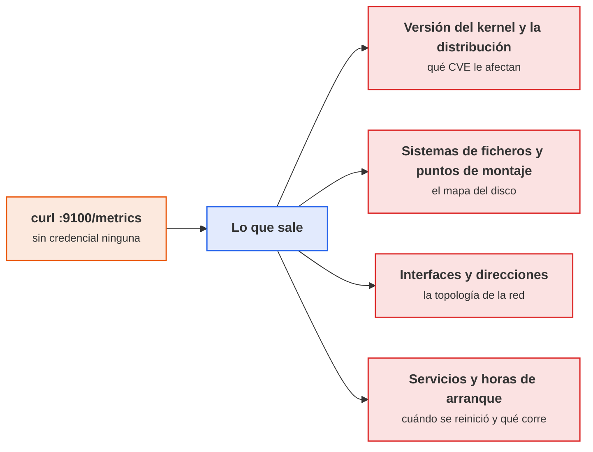
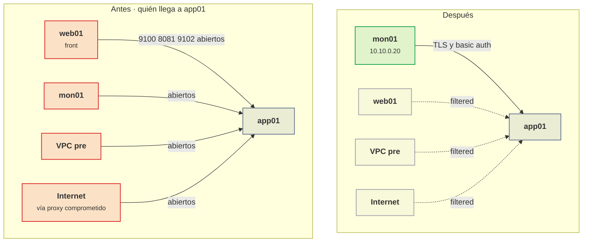
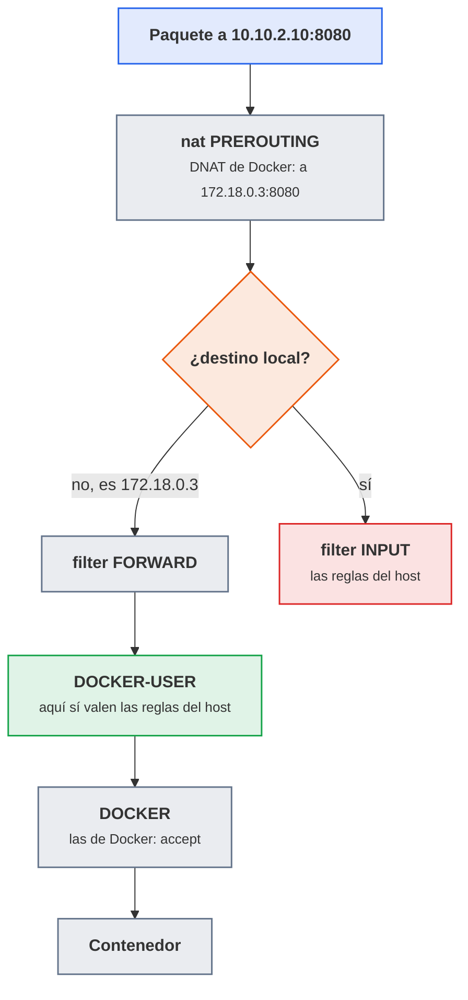
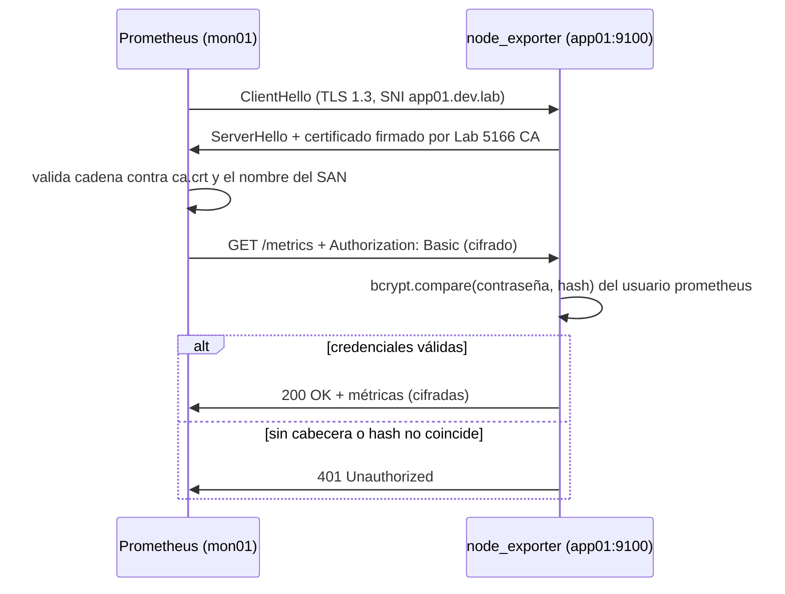
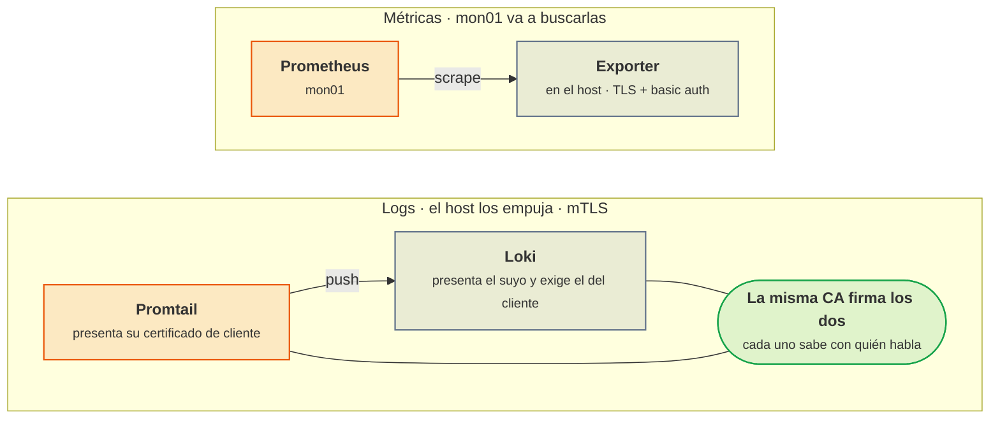

# UT3 · Seguridad de las comunicaciones de monitorización

<p class="ut-meta">6 h · Sesiones 16 a 18 · RA1 CE f, g</p>

La UT1 conectó el servicio del curso a la pila de mon01 (node_exporter, cAdvisor, postgres_exporter, el `/metrics` de la API, Promtail y Loki) y la UT2 le puso alarmas encima. Todo eso funciona, pero funciona en claro: cada exporter es un servidor HTTP sin autenticación, Promtail manda los logs a Loki por HTTP y Grafana está en el 3000 con la contraseña del primer día. Esta unidad da la vuelta a la pila y la mira como la miraría alguien que ha entrado en la red: qué puertos hay abiertos, quién puede llegar a ellos y qué se lleva si llega. Después se cierra lo que sobra por capas (red Docker, firewall del host, OPNsense), se cifra y se autentica lo que queda, y se documenta como una política que se pueda auditar. Lo que se hace aquí se apoya directamente en la [UT3 de la asignatura de despliegue](https://victor-educ.github.io/apuntes-5166/ut/ut3-seguridad-por-capas/): mismas zonas, mismo OPNsense, mismas herramientas (nmap, tcpdump, matriz de pruebas). Con esta unidad se cierra la primera evaluación: el examen es el 10 de diciembre y entra UT1, UT2 y UT3 completas. La UT4 vuelve a la explotación (KPI y pruebas) sobre una pila que ya no filtra nada.

## Introducción

Esta unidad sigue el orden de un trabajo real de seguridad: primero se mide, luego se cierra, luego se cifra y al final se documenta. Aquí van los objetivos al terminar, los conceptos y herramientas que se usan y el plan de las tres sesiones.

### Qué tienes que saber hacer al terminar

- Inventariar lo que escucha en cada host (`ss`, `docker ps`) y contrastarlo desde fuera con nmap y tcpdump, dejando evidencias con fecha (CE f).
- Rellenar una matriz de exposición origen/destino/puerto/esperado/obtenido y justificar cada puerto que queda abierto (CE f).
- Explicar por qué un puerto publicado por Docker se salta el firewall del host y resolverlo de tres maneras distintas (CE g).
- Escribir un fichero nftables persistente por host y la regla equivalente en OPNsense (CE g).
- Activar TLS y basic auth en los exporters, mTLS entre Promtail y Loki y TLS con roles en Grafana, y demostrar con curl, openssl y tcpdump que el tráfico va cifrado (CE g).
- Redactar secretos en los logs, saber dónde se fijan la retención y los permisos, y escribir el documento de política de protección entre el contenedor y la monitorización (CE g).

### Los conceptos de la unidad

Un compañero de otro grupo, desde su VM en la zona front, lanza un `curl` contra app01 por el puerto 9100 y le vuelve la lista completa de lo que corre en la máquina: versión del kernel, servicios activos, IPs, hasta la hora del último reinicio. Nadie se entera, porque nada lo registra. Basta cambiar "compañero" por alguien que ha entrado en la red a través del proxy de la DMZ, y añadir que puede leer todos los logs en Loki, silenciar las alarmas de Alertmanager y entrar en Grafana con la contraseña del primer día. Ese es el problema de la unidad: la pila que se montó para vigilar el servicio se ha convertido en la puerta más fácil para atacarlo. El objetivo al terminar cabe en una frase: que a la monitorización solo llegue quien tiene que llegar, que todo lo que viaje por la red vaya cifrado y con credenciales, y que se pueda demostrar con pruebas fechadas.

| Herramienta o concepto | Qué es, en una frase | Para qué se usa en esta unidad |
|------------------------|----------------------|-----------------------------------|
| `ss` y `docker ps` | Comandos que listan desde dentro del host qué puertos escuchan y cuáles publicó Docker | Inventario inicial: saber qué cree el host que expone |
| nmap | Un escáner de puertos: pregunta a una máquina remota, puerto a puerto, si alguien responde | Comprobar desde cada zona qué se ve de verdad, antes y después de cerrar |
| tcpdump | Un grabador de tráfico de red: muestra los paquetes que pasan por una interfaz | Ver quién usa cada puerto y demostrar que el tráfico va cifrado |
| nftables | El firewall del kernel Linux (sucesor de iptables), con reglas escritas en un fichero de texto | Cerrar en cada host todo lo que no justifique la matriz |
| Docker y su NAT | Docker publica puertos reescribiendo el destino de los paquetes en el kernel, no abriendo un socket normal | Entender por qué un puerto publicado ignora las reglas del firewall y cómo evitarlo |
| OPNsense | El cortafuegos central de la VPC que se montó en la 5166, con reglas por interfaz | Segunda capa: bloquear entre zonas lo que los hosts ya bloquean |
| TLS y la CA del curso | TLS es el cifrado de HTTPS; la CA es la autoridad que firma certificados en la que confían todos | Cifrar el tráfico de métricas y logs con certificados propios, sin comprar ninguno |
| Basic auth y bcrypt | Usuario y contraseña en cada petición HTTP; bcrypt es un hash lento pensado para guardar contraseñas | Que los exporters solo respondan a Prometheus |
| mTLS | TLS mutuo: también el cliente presenta certificado y el servidor lo valida | Que Loki solo acepte logs de los Promtail legítimos |
| nginx como proxy inverso | Un servidor web puesto delante de otro para aportarle lo que no tiene (TLS, autenticación) | Proteger Grafana, cAdvisor y el `/metrics` de la API sin tocarlos |
| Etapa `replace` de Promtail | Un filtro que reescribe cada línea de log antes de enviarla | Borrar contraseñas y tokens de los logs antes de que lleguen a Loki |

Cómo está organizada la unidad: sigue las tres sesiones en orden, y cada sesión trae primero la teoría que se explica en clase y después su hoja de práctica. En la sesión 16 se mide: inventario de puertos en cada host, escaneo desde cada zona, la matriz de exposición con lo que no debería verse y, como trabajo mecánico que libera las sesiones siguientes, la emisión por adelantado de los certificados. En la sesión 17 se cierra y se cifra en la misma clase, entera sobre app01, que es la máquina donde se ven los dos casos a la vez: el exporter que escucha como servicio del host y los dos que publica Docker. Ahí van el node_exporter en la IP de su zona, el fichero nftables con sus dos cadenas, las tres reglas de OPNsense y, encima, TLS y basic auth en el scrape, con el escaneo repetido como prueba. La sesión 18 es la práctica evaluable, y ahí se cierra mon01 (publicación acotada, su propio nftables y Grafana detrás de nginx), se monta el cifrado que queda (mTLS entre Promtail y Loki y la redacción de secretos en los logs), se repite la auditoría sobre el estado final, se cierra la matriz antes y después con sus evidencias y se redacta el documento de política. El material que esas tareas necesitan y que no se explica en clase va como consulta dentro de la propia sesión 18, y los errores frecuentes del laboratorio quedan al final.

!!! otra "Lo que hace falta de la otra asignatura"
    Esta unidad (26 nov a 3 dic) va en paralelo con la [UT3 de Despliegue, seguridad por capas con OPNsense](https://victor-educ.github.io/apuntes-5166/ut/ut3-seguridad-por-capas/) (20 nov a 9 dic): nmap, tcpdump, nftables, la CA del curso y las reglas de OPNsense se explican allí desde cero esa misma quincena, y aquí se dan por conocidos y se aplican a los puertos de la monitorización.
    Hasta ahora app01 y mon01 vivían en el entorno provisional del bridge del aula (vmbr0). Con la UT2 de la 5166 terminada (18 nov) ya existe la VPC dev, y durante su UT3 se le pone el cortafuegos: esta unidad es el momento de mover las VM a la VPC, detrás de OPNsense, y todas las IP 10.10.x.x de los ejemplos suponen que ya están allí.
    La matriz de reglas del cortafuegos hecha en la 5166 es la que aquí se amplía con los puertos de los exporters y de Loki: no se empieza una nueva.

### Plan de sesiones

Cada sesión de 110 minutos empieza con una explicación corta y sigue con laboratorio. La columna «Se explica» recoge los apartados de teoría que se desarrollan en clase, con su duración aproximada; la columna «Se practica», el trabajo de laboratorio de esa sesión. Las sesiones marcadas solo como práctica no traen teoría nueva.

| Sesión | Fecha | Tipo | Se explica | Se practica |
|---:|-------|------|------------|-------------|
| [16](#sesion-16-auditoria-inicial) | 26 nov | Teoría y práctica | Superficie de exposición de la monitorización; ss, nmap y tcpdump aplicados a exporters (20 min). | Inventario de puertos en app01, db01 y mon01, escaneo desde otras subredes, matriz de exposición con lo que no debería verse. |
| [17](#sesion-17-red-firewall-y-tls) | 1 dic | Teoría y práctica | Por qué un puerto publicado en Docker salta el firewall del host y cómo se corrige (10 min); red dedicada, nftables por host y las reglas de OPNsense (10 min); TLS y basic auth en los exporters con bcrypt (10 min). | Cerrar app01 en la VPC: node_exporter en la IP de zona, nftables del host y tres reglas en OPNsense, TLS y basic auth en su node_exporter; repetir el escaneo desde web01. |
| [18](#sesion-18-practica-evaluable) | 3 dic | Práctica evaluable | Aclaración del enunciado (10 min). | Cerrar la matriz de puertos antes y después, reglas, configuración TLS con mTLS entre Promtail y Loki, evidencias y el documento de política. |

!!! examen "La unidad cierra la primera evaluación"
    El 10 de diciembre hay examen de la primera evaluación y entra UT1, UT2 y UT3 completas. De esta unidad se pregunta lo que se explica en clase: qué se ve en un `/metrics` abierto, cómo se lee cada estado de nmap, por qué un puerto publicado por Docker no pasa por la cadena `input` y dónde va entonces la regla, y qué resuelve TLS frente a qué resuelve la autenticación. La práctica evaluable de la sesión 18 se entrega antes del examen, así que el trabajo de laboratorio queda cerrado el 3 de diciembre.

## Sesión 16 · Auditoría inicial

<p class="ut-meta" markdown>26 de noviembre · Teoría y práctica · <span class="dur" tabindex="0" aria-label="Superficie de exposición de la monitorización · 10 min&#10;Auditar: saber qué hay antes de tocar nada · 10 min&#10;A3.1 Auditoría inicial · 90 min" data-dur="Superficie de exposición de la monitorización · 10 min&#10;Auditar: saber qué hay antes de tocar nada · 10 min&#10;A3.1 Auditoría inicial · 90 min">:material-school:<i class="dur-barra" style="--teoria:18%"></i>:material-flask:</span></p>

Al acabar esta sesión queda hecha la matriz de exposición de la pila tal como está hoy: qué puertos escuchan en app01, db01 y mon01, quién llega a ellos desde cada zona y qué se lee si llega, todo con una evidencia fechada por fila. Antes de la hoja de práctica conviene leer qué se ve en un `/metrics` abierto y la tabla de puertos del entorno, que es de donde sale la columna "esperado" de la matriz, y después los cinco pasos de la auditoría (ss y docker ps, nmap, curl, tcpdump y la matriz), que la hoja repite en cada host.

### Superficie de exposición de la monitorización

Cada exporter es un servidor HTTP más en cada máquina. Cuando se montó la pila en la UT1 el objetivo era que Prometheus llegase a todo (el scrape: la lectura periódica de cada `/metrics`), y la forma rápida de conseguirlo fue publicar puertos en el host: `9100:9100`, `8081:8080`, `9187:9187`. El resultado es que la monitorización abre más puertos que la propia aplicación. El servicio del curso, bien desplegado, expone un único 443 en web01; la monitorización, sin control, expone cuatro puertos en app01, uno en db01 y cinco en mon01, ninguno con contraseña.

<figure markdown="span">
  { width="640" }
  <figcaption>Arquitectura de Prometheus: cada flecha de scrape es una conexión HTTP que hay que proteger. Fuente: Proyecto Prometheus, Apache 2.0.</figcaption>
</figure>

#### Qué se ve en un /metrics abierto

La idea de que las métricas son "solo números" no aguanta un `curl`. Esto es lo que devuelve un node_exporter recién instalado a cualquiera que llegue al 9100:



<p class="pie" markdown>No hace falta entrar en la máquina para saber cómo atacarla: basta con que el exporter esté abierto.</p>


```text
node_uname_info{domainname="(none)",machine="x86_64",nodename="app01",release="6.12.22-amd64",sysname="Linux",version="#1 SMP PREEMPT_DYNAMIC Debian 6.12.22-1"} 1
node_os_info{id="debian",name="Debian GNU/Linux",version_id="13"} 1
node_network_address_info{address="10.10.2.10",device="ens18",netmask="24"} 1
node_filesystem_size_bytes{device="/dev/sda1",mountpoint="/var/lib/docker"} 2.1e+10
node_systemd_unit_state{name="ssh.service",state="active"} 1
node_systemd_unit_state{name="postgresql.service",state="inactive"} 1
node_boot_time_seconds 1.763979e+09
```

Con eso un atacante sabe la versión exacta del kernel (y por tanto qué CVE, vulnerabilidades publicadas con identificador, aplican), el nombre y la IP de la máquina, qué servicios están corriendo y cuándo se reinició por última vez (una máquina con 400 días de uptime no se parchea). cAdvisor es peor: `container_last_seen` lleva las etiquetas `image` y `name` de cada contenedor, así que se ve `registry.lab/servicio/api:1.4.2`, y cualquier etiqueta del contenedor aparece como `container_label_*`. Si alguien puso una URL con credenciales en una etiqueta del compose, está ahí. postgres_exporter publica los nombres de las bases de datos, el número de conexiones por usuario y, si se activó la colección de `pg_settings`, la configuración completa del servidor. El `/metrics` de la API del curso enumera todas las rutas que existen (`http_requests_total{path="/admin/export"}`), incluidas las que no están enlazadas desde ningún sitio.

Los propios servidores de la pila filtran todavía más. La API de Prometheus responde en `/api/v1/targets` con la lista de todo lo que se monitoriza (un mapa de la infraestructura, con IPs y puertos), y `/api/v1/status/config` devuelve la configuración cargada. Prometheus enmascara los campos marcados como secreto (`password: <secret>`), pero no puede saber que la URL de un `remote_write` o un `relabel_config` (dos opciones de configuración de Prometheus) lleva un token dentro. Si Prometheus arranca con `--web.enable-admin-api`, cualquiera puede borrar series con un `POST` a `/api/v1/admin/tsdb/delete_series`, y con `--web.enable-lifecycle` puede pararlo con un `POST` a `/-/quit`. Alertmanager acepta silencios sin autenticación por su API: un atacante silencia la alarma y después ataca. Loki sin autenticación es el caso más grave: cualquiera lee todos los logs por `/loki/api/v1/query_range` (y en los logs de la API están las peticiones completas, con IPs de clientes y a veces con parámetros que nadie debería haber registrado) y cualquiera inyecta líneas falsas por `/loki/api/v1/push`, lo que sirve para envenenar una investigación o disparar alarmas falsas hasta que el equipo deje de mirarlas.

#### Casos reales

Esto no es teórico. En diciembre de 2024 el equipo de investigación de Aqua Security publicó un recuento hecho con Shodan y Censys (buscadores que indexan máquinas conectadas a Internet): alrededor de 296.000 instancias de node_exporter y 40.000 servidores Prometheus accesibles desde Internet sin ninguna autenticación, muchos de ellos con `/api/v1/status/config` mostrando credenciales de servicios en URLs y con la API de administración activa. Ya en 2021 JFrog había hecho un análisis parecido y había encontrado servidores Prometheus expuestos de empresas grandes cuya configuración incluía contraseñas de bases de datos y claves de proveedores de nube. Con Grafana el caso más conocido es la vulnerabilidad CVE-2021-43798 (versiones 8.0 a 8.3): un recorrido de directorios por la ruta de los plugins, sin autenticación, que permitía leer cualquier fichero del contenedor, incluido `grafana.db` con las credenciales cifradas de todos los datasources (las fuentes de datos conectadas), y el patrón de ataque era buscar Grafanas expuestos con Shodan y recorrer la lista. Y el error más repetido de todos: Grafana con `admin/admin` de fábrica, alcanzable desde fuera, sin cambiar. En un laboratorio pequeño uno piensa que a nadie le importa; en la empresa donde se hacen las prácticas la pila de monitorización suele ser el servidor más viejo, con menos parches y con más información sobre el resto.

#### Puertos del entorno del curso y quién debe llegar

| Componente | Puerto | Dónde corre | Quién debe llegar |
|------------|-------:|-------------|-------------------|
| node_exporter | 9100 | app01, db01, mon01 | Solo mon01 |
| cAdvisor | 8081 | app01 | Solo mon01 |
| postgres_exporter | 9187 | db01 | Solo mon01 |
| /metrics de la app | 9102 | app01 | Solo mon01 |
| Promtail | 9080 | app01, db01 | Nadie (solo inicia salida hacia Loki) |
| Loki | 3100 | mon01 | Promtail de cada host, Grafana |
| Prometheus | 9090 | mon01 | Grafana, administradores |
| Alertmanager | 9093 | mon01 | Prometheus, administradores |
| Grafana | 3000 (443 tras proxy) | mon01 | Usuarios |

El puerto de cAdvisor merece una aclaración, porque aparece dos veces con dos valores distintos: cAdvisor escucha en el 8080 dentro de la red de Docker, pero en el host de app01 ese puerto lo ocupa la API del curso, así que se publica en el 8081. Lo que se escanea desde fuera y lo que se pone en la matriz es el 8081; `cadvisor:8080` solo existe dentro del compose.

Todo lo demás, cerrado. Y de estos, los administradores entran por la red de gestión (10.10.0.0/24) con usuario nominal, nunca desde front ni desde back. Conviene fijarse en que los tres servidores de mon01 (Prometheus, Alertmanager, Loki) hablan entre sí dentro de la misma máquina: no hay ningún motivo para que sus puertos se publiquen en la IP 10.10.0.20 salvo el de Grafana, y este detrás de nginx.

Y un detalle del laboratorio que condiciona toda la unidad: **app01 y db01 no tienen pata en la red de gestión**. Cada uno lleva una sola tarjeta, la de su zona (app01 la 10.10.2.10 en back, db01 la 10.10.3.10 en data), y mon01 vive en gestión con la 10.10.0.20. Eso significa que el scrape cruza siempre el cortafuegos, y que la protección no puede consistir en esconder el puerto en una interfaz que solo ve gestión: hay que permitir el paso justo en OPNsense y cerrar el resto en cada host. Es lo que se monta en la sesión 17.

### Auditar: saber qué hay antes de tocar nada

La auditoría es la parte del criterio f y se hace antes de proteger nada, porque la práctica evaluable pide la matriz antes y después. El procedimiento tiene cinco pasos y se repite en app01, db01 y mon01.

#### Inventario desde dentro

Empieza en el propio host. `ss -tlnup` lista los sockets TCP y UDP en escucha con el proceso que los tiene abiertos (necesita root para ver el proceso):

```bash
sudo ss -tlnup
# Netid State  Recv-Q Send-Q Local Address:Port  Peer Address:Port Process
# tcp   LISTEN 0      4096         0.0.0.0:9100       0.0.0.0:*     users:(("node_exporter",pid=812,fd=3))
# tcp   LISTEN 0      4096         0.0.0.0:8081       0.0.0.0:*     users:(("docker-proxy",pid=1544,fd=4))
# tcp   LISTEN 0      4096         0.0.0.0:9102       0.0.0.0:*     users:(("docker-proxy",pid=1590,fd=4))
# tcp   LISTEN 0      128        127.0.0.1:9080       0.0.0.0:*     users:(("promtail",pid=790,fd=7))
# tcp   LISTEN 0      128          0.0.0.0:22         0.0.0.0:*     users:(("sshd",pid=610,fd=3))
```

La columna de dirección local es la que importa: `0.0.0.0` significa todas las interfaces, incluidas las de los bridges de Docker; `127.0.0.1` significa solo local (Promtail está bien); `10.10.2.10` significaría solo la tarjeta de la zona, que en app01 es la única que hay. Los puertos que aparecen con `docker-proxy` son puertos publicados por Docker, y ahí hay una trampa que se explica en el apartado siguiente: Docker puede publicar un puerto sin que aparezca ningún proceso en `ss` si `userland-proxy` está desactivado, porque entonces la publicación se hace solo con NAT. Por eso el segundo comando es obligatorio:

```bash
docker ps --format '{{.Names}}\t{{.Ports}}'
# api          0.0.0.0:9102->9102/tcp, :::9102->9102/tcp
# cadvisor     0.0.0.0:8081->8080/tcp, :::8081->8080/tcp
# promtail     9080/tcp
```

`0.0.0.0:9102->9102/tcp` es un puerto abierto a todo el mundo, en IPv4 y en IPv6 (`:::9102`). En la línea de cAdvisor, el primer número es el puerto del host (8081) y el segundo el del contenedor (8080): el que se escanea desde fuera es siempre el primero. `9080/tcp` sin flecha es un puerto que el contenedor expone (`EXPOSE` en su imagen) pero que no está publicado: solo es alcanzable desde la red Docker.

#### Escaneo desde fuera

El inventario dice lo que el host cree que expone; el escaneo dice lo que de verdad se ve desde cada zona, que es lo que un atacante vería. Se hace desde tres orígenes como mínimo: mon01 (que debe ver los exporters), una máquina de front como web01 (que no debe verlos) y el puesto de administración de la 5166 (10.10.0.50). nmap tiene varios tipos de escaneo y conviene saber cuál usar:

- `-sS` (SYN scan, necesita root): envía un SYN (el primer paquete de una conexión TCP) y mira la respuesta sin completar la conexión. Es el rápido y el que no deja una conexión en el log de la aplicación.
- `-sT` (connect scan): completa el three-way handshake (SYN, SYN-ACK, ACK: la conexión entera). Es el único posible sin root y el que usarás desde un contenedor sin capacidades.
- `-sU`: UDP. Lento y ambiguo (sin respuesta puede ser open o filtered). Aquí solo interesa para comprobar que no hay nada en UDP.
- `-sV`: tras encontrar un puerto abierto, habla con él para identificar el servicio. Es el que dice si hay TLS (el cifrado de HTTPS) o no después de la sesión 17.

```bash
sudo nmap -sS -p- --reason -T4 10.10.2.10        # desde web01, todos los puertos TCP
sudo nmap -sS -p 22,8081,9100,9102 --reason 10.10.2.10        # desde mon01, solo los esperados
```

La lectura de los estados es lo que se pide en la práctica y lo que la gente confunde:

| Estado nmap | Qué ha pasado en la red | Qué significa aquí |
|-------------|-------------------------|--------------------|
| `open` | Llegó un SYN-ACK | Hay un servicio escuchando y nada lo filtra |
| `closed` | Llegó un RST | El paquete llegó al host pero nadie escucha en ese puerto; un firewall con `reject` también da esto |
| `filtered` | No llegó nada, o llegó un ICMP unreachable | Un firewall con `drop` lo ha tirado por el camino (OPNsense o nftables) |

Antes de la unidad, desde web01 el 9100 de app01 sale `open`. Después de la sesión 17 tiene que salir `filtered` (si se usa `drop`) y desde mon01 tiene que seguir `open`. Conviene guardar la salida completa con `-oN escaneo-app01-desde-web01-$(date +%F).txt`: la fecha en el nombre y la cabecera con la hora que nmap pone son la evidencia. Con `-T4 -p-` el escaneo de un host de la VPC tarda entre 10 y 60 segundos si responde con RST y varios minutos si todo está filtrado, porque nmap tiene que esperar el timeout de cada puerto; es normal y también es una pista de que el firewall está haciendo `drop`.

#### Protocolos y autenticación

El tercer paso comprueba qué protocolo habla cada puerto abierto y si pide credenciales. Con `curl -v` se ve todo el diálogo:

```bash
curl -sv http://10.10.2.10:9100/metrics 2>&1 | head -20
```

Si desde web01 esto devuelve `HTTP/1.1 200 OK` y a continuación las métricas, hay tres cosas mal a la vez: alcanzable desde donde no toca, en claro y sin autenticación. Conviene apuntarlo así, en tres columnas, porque las tres se arreglan en sitios distintos: el firewall, TLS y basic auth (usuario y contraseña en cada petición HTTP).

#### Tráfico real con tcpdump

El escaneo dice qué puertos aceptan conexiones; tcpdump dice quién las está usando de verdad. En app01, mirando el tráfico de Promtail hacia Loki:

```bash
sudo tcpdump -i ens18 -nn port 3100 -c 20
# 10:42:17.301 IP 10.10.2.10.48122 > 10.10.0.20.3100: Flags [P.], seq ..., length 1834
# 10:42:17.303 IP 10.10.0.20.3100 > 10.10.2.10.48122: Flags [P.], seq ..., length 89
```

Lo que se busca: que el único destino sea 10.10.0.20 y que sea app01 quien inicia (puertos altos de origen, 3100 de destino). Y en mon01, `sudo tcpdump -i ens18 -nn 'dst port 9100 or dst port 8081 or dst port 9187 or dst port 9102'` debe mostrar solo salidas hacia los tres hosts cada 15 segundos (el `scrape_interval`), sin nada entrante. Si se añade `-A` se ve el contenido en texto: antes de la sesión 17 se leen las líneas `GET /metrics HTTP/1.1` y las métricas; después no se lee nada. Esa pareja de capturas, antes y después, es la evidencia de cifrado que pide la práctica. El nombre de la interfaz en las VM de Proxmox con virtio es `ens18`; se comprueba con `ip -br link`.

#### La matriz de exposición

Todo lo anterior se registra en una matriz como la matriz de pruebas de la [UT3 de despliegue](https://victor-educ.github.io/apuntes-5166/ut/ut3-seguridad-por-capas/), pero orientada a puertos de monitorización. Una fila por combinación origen/destino/puerto que merezca la pena comprobar. El ejemplo está escrito con las direcciones de la VPC, que son las de la columna "obtenido (antes)" medida el 1 de diciembre, justo después del traslado y antes de cerrar nada; la auditoría del 26 de noviembre se hace un paso antes, con app01 y mon01 todavía en el bridge del aula, y sus filas llevan las direcciones de ese día.

| Origen | Destino | Puerto | Esperado | Obtenido (antes) | Evidencia |
|--------|---------|-------:|----------|------------------|-----------|
| mon01 10.10.0.20 | app01 10.10.2.10 | 9100 | open | open | escaneo-app01-desde-mon01-2026-12-01.txt |
| web01 10.10.1.10 | app01 10.10.2.10 | 9100 | filtered | open | escaneo-app01-desde-web01-2026-12-01.txt |
| web01 10.10.1.10 | app01 10.10.2.10 | 8081 | filtered | open | ídem |
| app01 10.10.2.10 | mon01 10.10.0.20 | 3100 | open | open | tcpdump-app01-3100-2026-12-01.txt |
| web01 10.10.1.10 | mon01 10.10.0.20 | 3100 | filtered | open | escaneo-mon01-desde-web01-2026-12-01.txt |
| web01 10.10.1.10 | mon01 10.10.0.20 | 9090 | filtered | open | ídem |
| admin 10.10.0.50 | mon01 10.10.0.20 | 443 | open | closed (aún no hay proxy) | ídem |
| otra VPC | mon01 10.10.0.20 | 3000 | filtered | open | escaneo-mon01-desde-pre-2026-12-01.txt |

Las filas donde esperado y obtenido no coinciden se marcan en rojo y son la lista de trabajo de la sesión 17 y de la práctica evaluable de la sesión 18. La columna "obtenido (después)" se añade al final de la unidad con la fecha nueva. La matriz del 26 de noviembre tiene las mismas columnas y las mismas filas: lo único que cambia es que las direcciones son las del aula y que casi todo sale abierto, porque allí no hay cortafuegos ninguno.



<p class="pie" markdown>El objetivo de la unidad en una imagen: que solo quede una flecha, y además autenticada.</p>

### A3.1 Auditoría inicial (sesión 16)

<span class="et et-obj">Objetivo</span> Tener la matriz de exposición de la pila de monitorización tal como está hoy, con una evidencia fechada por fila y las filas que no deberían estar así marcadas en rojo.

<span class="et et-pre">Antes de empezar</span>

- app01 y mon01 encendidas con la pila de la UT2 funcionando (Prometheus con todos los targets en UP). Hoy, 26 de noviembre, las dos siguen en el bridge del aula (vmbr0): el traslado a la VPC lo hace Despliegue mañana, en su A3.3, y si ese día no se hizo es el primer paso de la sesión 17. La auditoría de hoy se hace con las direcciones que tienen ahora, y por eso los comandos llevan `<app01>` y `<mon01>` en vez de una IP fija.
- La base de datos: si la 5166 ya ha creado db01, inventaríalo también; si aún no está, la base de datos es el contenedor `db` del compose de app01 y ese inventario se repite sobre db01 en la sesión 17, cuando le toque cerrar sus exporters.
- Acceso por SSH a app01, mon01, web01 y el puesto de administración (10.10.0.50). web01 ya está en la zona front de la VPC y sale al aula por el NAT de OPNsense, así que sirve igual como origen "de fuera".
- nmap y tcpdump instalados donde vayas a lanzarlos.
- Un directorio `monitoring/audit/antes/` en el repositorio `monitoring` para las salidas.
- Para el último paso, `ca.crt` y `ca.key` de la CA del curso (`Lab 5166 CA`) en el puesto de administración: se crearon ayer, 25 de noviembre, en la [A3.2 de despliegue](https://victor-educ.github.io/apuntes-5166/ut/ut3-seguridad-por-capas/). Si ese día no se creó, créala hoy con los dos comandos de aquel apartado.
- Se ha explicado al principio de la sesión [qué se ve en un /metrics abierto](#superficie-de-exposicion-de-la-monitorizacion) y los [cinco pasos de la auditoría](#auditar-saber-que-hay-antes-de-tocar-nada); los estados de nmap se explican en la [UT3 de despliegue](https://victor-educ.github.io/apuntes-5166/ut/ut3-seguridad-por-capas/).

!!! ojo "Hoy se audita lo que hay, no lo que habrá"
    La pila vive todavía en la red del aula, donde no hay cortafuegos de ninguna clase: cualquier puesto del aula llega a los exporters, y eso es justo lo que la matriz tiene que demostrar con fecha. El traslado a la VPC dev, con app01 en `devback` (10.10.2.10), db01 en `devdata` (10.10.3.10) y mon01 en `devmgmt` (10.10.0.20), es del 27 de noviembre. La matriz acaba teniendo dos fotos obligatorias, la de hoy y la del final de la unidad, y una intermedia opcional, la de la VPC sin proteger, que se toma en la sesión 17 si da tiempo: el escaneo desde web01 sigue devolviendo `open` con las direcciones nuevas, porque entrar en la VPC no cierra nada por sí solo.

<span class="et et-pas">Pasos</span>

1. Inventario desde dentro, en app01 y en mon01, que son los dos hosts de la monitorización (db01 se inventaría igual en la sesión 17, con el mismo comando, cuando se toque su exporter). Guarda las dos salidas en un fichero por host:

    ```bash
    H=$(hostname); F=inventario-$H-$(date +%F).txt
    { echo "== ss =="; sudo ss -tlnup; echo "== docker ps =="; docker ps --format '{{.Names}}\t{{.Ports}}'; } | tee $F
    ```

    Anota por cada puerto la dirección local (`0.0.0.0`, `127.0.0.1` o una IP concreta) y si lo publica Docker (`docker-proxy` o flecha en `docker ps`).

2. Escaneo desde mon01 hacia app01, hacia la base de datos y hacia el propio mon01, solo con los puertos esperados. Desde mon01 todo lo de la tabla de puertos debe salir `open` (sustituye `<app01>` y `<db01>` por las direcciones de hoy; si db01 todavía no existe, sáltate la segunda línea y anótalo en la matriz):

    ```bash
    sudo nmap -sS -p 22,8081,9080,9100,9102 --reason <app01> -oN escaneo-app01-desde-mon01-$(date +%F).txt
    sudo nmap -sS -p 22,9080,9100,9187 --reason <db01> -oN escaneo-db01-desde-mon01-$(date +%F).txt
    ```

3. Escaneo desde web01 (front, que sale al aula por el NAT de OPNsense) hacia app01 y mon01. Es el escaneo que hace de atacante. El `-p-` completo se guarda una sola vez, contra app01, porque hoy todos los puertos responden y tarda entre 10 y 60 segundos; contra mon01 basta con los puertos de la matriz:

    ```bash
    sudo nmap -sS -p- --reason -T4 <app01> -oN escaneo-app01-desde-web01-$(date +%F).txt
    sudo nmap -sS -p 22,3000,3100,9090,9093,9100 --reason <mon01> -oN escaneo-mon01-desde-web01-$(date +%F).txt
    ```

4. Repite solo el escaneo de app01 desde pre o desde el puesto de administración, con `-desde-pre-` o `-desde-admin-` en el nombre: la matriz necesita un tercer origen, y con un destino se ve ya si el resultado depende de la zona. Sin root en el origen, usa `-sT`.

5. Protocolo y autenticación de cada puerto que salió `open` desde web01. Un `200 OK` con métricas es alcanzable, en claro y sin credenciales:

    ```bash
    for p in 9100 8081 9102; do echo "== $p =="; curl -sv http://<app01>:$p/metrics 2>&1 | head -20; done | tee curl-app01-desde-web01-$(date +%F).txt
    curl -sv http://<mon01>:3100/ready 2>&1 | head -20 | tee curl-mon01-3100-desde-web01-$(date +%F).txt
    ```

6. Tráfico real del 3100 en app01. Comprueba antes el nombre de la interfaz con `ip -br link` (en Proxmox con virtio es `ens18`) y captura 20 paquetes de Promtail hacia Loki, con `-A` para que se lea el contenido en claro:

    ```bash
    sudo tcpdump -i ens18 -nn -A port 3100 -c 20 | tee tcpdump-app01-3100-$(date +%F).txt
    ```

7. Copia todos los ficheros al puesto (`scp usuario@host:'*-2026-11-26.txt' monitoring/audit/antes/`) y rellena `monitoring/audit/matriz.md` con las columnas origen, destino, puerto, esperado, obtenido (antes) y evidencia, como en [La matriz de exposición](#la-matriz-de-exposicion), con al menos las ocho filas del ejemplo. Escribe las direcciones de hoy, las del aula, y deja una nota al pie diciendo que las mismas filas se vuelven a medir con las direcciones de la VPC: la foto del estado final, el 3 de diciembre, y si da tiempo también la intermedia, el 1 de diciembre. La columna "esperado" sale de la tabla [Puertos del entorno del curso](#puertos-del-entorno-del-curso-y-quien-debe-llegar).

    Marca en rojo (negrita o una columna "estado") las filas donde esperado y obtenido no coinciden: esa lista es el trabajo de la sesión 17 y de la práctica evaluable de la sesión 18.

8. Deja emitidos, en el puesto de administración, los certificados que las sesiones 17 y 18 solo tendrán que instalar. Es trabajo mecánico y hacerlo hoy libera esas dos sesiones para la parte que se aprende, que es configurar y comprobar. Las direcciones son las de la VPC, las de la sesión 17 en adelante, aunque hoy las máquinas sigan en el aula: el certificado no depende de dónde esté la máquina hoy. Trabaja en una carpeta fuera del repositorio (`mkdir -m 700 ~/tls-monitorizacion && cd ~/tls-monitorizacion`), porque aquí hay claves privadas, y copia ahí `ca.crt` y `ca.key`, que es lo que firman los dos bucles:

    ```bash
    for n in app01-node:app01.dev.lab:10.10.2.10 app01-nginx:app01.dev.lab:10.10.2.10 \
             db01-node:db01.dev.lab:10.10.3.10 db01-postgres:db01.dev.lab:10.10.3.10 \
             mon01-node:mon01.lab:10.10.0.20 mon01-loki:mon01.lab:10.10.0.20; do
      f=${n%%:*}; dns=$(echo $n | cut -d: -f2); ip=$(echo $n | cut -d: -f3)
      openssl req -newkey ec -pkeyopt ec_paramgen_curve:prime256v1 -nodes \
        -keyout $f.key -out $f.csr -subj "/CN=$dns"
      openssl x509 -req -in $f.csr -CA ca.crt -CAkey ca.key -CAcreateserial -days 365 -out $f.crt \
        -extfile <(printf "subjectAltName=DNS:$dns,IP:$ip\nextendedKeyUsage=serverAuth")
    done
    ```

    El de nginx de mon01 va aparte, porque lleva dos nombres en el SAN (el del host y el de Grafana), y los tres de cliente no llevan SAN y sí `clientAuth`:

    ```bash
    openssl req -newkey ec -pkeyopt ec_paramgen_curve:prime256v1 -nodes \
      -keyout mon01-nginx.key -out mon01-nginx.csr -subj "/CN=mon01.lab"
    openssl x509 -req -in mon01-nginx.csr -CA ca.crt -CAkey ca.key -CAcreateserial -days 365 -out mon01-nginx.crt \
      -extfile <(printf "subjectAltName=DNS:mon01.lab,DNS:grafana.lab,IP:10.10.0.20\nextendedKeyUsage=serverAuth")

    for c in promtail-app01 promtail-db01 grafana; do
      openssl req -newkey ec -pkeyopt ec_paramgen_curve:prime256v1 -nodes \
        -keyout $c.key -out $c.csr -subj "/CN=$c"
      openssl x509 -req -in $c.csr -CA ca.crt -CAkey ca.key -CAcreateserial -days 365 -out $c.crt \
        -extfile <(printf "extendedKeyUsage=clientAuth")
    done
    ```

    Comprueba dos, uno de cada clase, antes de darlos por buenos: `openssl x509 -in app01-node.crt -noout -subject -ext subjectAltName` y `openssl x509 -in promtail-app01.crt -noout -ext extendedKeyUsage`.

<span class="et et-com">Comprobación</span> Un fichero de inventario por host, al menos cuatro escaneos con fecha en el nombre y en la cabecera de nmap, un fichero de curl y una captura de tcpdump donde se lee `POST /loki/api/v1/push` en claro. En la matriz, las filas con origen web01 (y las del puesto del aula) hacia puertos de monitorización están en rojo (`open` donde se esperaba `filtered`) y las filas desde mon01 no. En `~/tls-monitorizacion/` hay diez certificados con su clave, y los dos que has comprobado dicen lo que tienen que decir: el de servidor lleva su SAN y el de cliente, `clientAuth`.

<span class="et et-ent">Entrega</span> Nada que entregar todavía: `monitoring/audit/antes/` y `matriz.md` forman la parte "antes" de la práctica evaluable de la sesión 18. Haz commit en el repositorio `monitoring` antes de salir. Los certificados y sus claves no van al repositorio: se quedan en el puesto y de ahí se copian a cada host en la sesión 17.

<span class="et et-ext">Si te sobra tiempo</span> Consulta `http://<mon01>:9090/api/v1/targets` y `/api/v1/status/config` desde web01 y anota qué se lee de la infraestructura sin ninguna credencial.

## Sesión 17 · Red, firewall y TLS

<p class="ut-meta" markdown>1 de diciembre · Teoría y práctica · <span class="dur" tabindex="0" aria-label="Por qué Docker se salta el firewall del host · 10 min&#10;Reducir: red Docker dedicada y firewall por host · 10 min&#10;Proteger: cifrado y autenticación · 10 min&#10;A3.2 Red, firewall y TLS · 80 min" data-dur="Por qué Docker se salta el firewall del host · 10 min&#10;Reducir: red Docker dedicada y firewall por host · 10 min&#10;Proteger: cifrado y autenticación · 10 min&#10;A3.2 Red, firewall y TLS · 80 min">:material-school:<i class="dur-barra" style="--teoria:27%"></i>:material-flask:</span></p>

Esta sesión junta las dos capas que quedan, cerrar y cifrar, porque una sin la otra no protege nada: un puerto cerrado sigue hablando en claro con quien sí puede llegar, y un puerto cifrado sigue estando expuesto a quien no debería verlo. La teoría cubre las dos capas en los tres hosts, porque cada uno plantea un caso distinto; la hoja las aplica enteras sobre app01, que es donde se ven a la vez el exporter que escucha como servicio del host y los dos que publica Docker. Al acabar, un escaneo desde web01 o desde otra VPC devolverá `filtered` para todos los puertos de monitorización de app01, ese cierre se deberá a dos capas independientes (el nftables del host y OPNsense en el centro de la VPC) y el scrape de su node_exporter irá ya cifrado y con contraseña, con `nmap -sV` respondiendo `ssl/http`. Empieza por el apartado sobre Docker y NAT, porque sin él las reglas que escriba la hoja parecerán no funcionar; después vienen la red `monitoring`, el fichero nftables completo, la tabla de reglas de OPNsense y, al final, los certificados de la CA del curso y el `web.config.file` con bcrypt. Los ficheros de configuración van completos aquí y la hoja se limita a copiarlos y cambiar dos o tres líneas en cada uno. Lo que no cabe en esta clase se monta en la práctica evaluable de la sesión 18, con su material de consulta allí: el cierre de mon01 (publicación acotada, su propio nftables y Grafana detrás de nginx), el mTLS entre Promtail y Loki y la redacción de secretos en los logs.

### Por qué Docker se salta el firewall del host

Es el error más común al poner un firewall en una máquina con Docker, y conviene entender el mecanismo porque aparece en cualquier host que combine las dos cosas. Alguien pone reglas en nftables (el firewall del kernel Linux) o en ufw (un frontal simplificado de iptables) para cerrar el 8080, comprueba con `nft list ruleset` que están, y desde otra máquina el 8080 sigue abierto. La regla no está mal: es que el paquete nunca pasa por ella.

Para seguir el mecanismo hay que conocer tres piezas de Netfilter, el filtro de paquetes del kernel: las tablas (`nat` para reescribir direcciones, `filter` para aceptar o tirar), las cadenas por las que pasa un paquete según su camino (`PREROUTING` al entrar, `INPUT` si va al propio host, `FORWARD` si el host lo reenvía) y DNAT, la reescritura de la dirección de destino.

Cuando se publica un puerto con `-p 8080:8080`, Docker no abre un socket en el host y reenvía (eso solo lo hace `docker-proxy` como apoyo para el tráfico local). Lo que hace es escribir reglas en las tablas del kernel: una regla DNAT en la cadena `PREROUTING` de la tabla `nat` que cambia el destino `10.10.2.10:8080` por `172.18.0.3:8080` (la IP del contenedor en su red bridge), y reglas en la cadena `FORWARD` de la tabla `filter` que aceptan ese tráfico hacia el bridge. Un paquete que llega de fuera con destino al contenedor entra por `PREROUTING`, se le cambia el destino, y como el nuevo destino no es una IP local del host, el kernel lo enruta: pasa por `FORWARD`, no por `INPUT`. Las reglas de `INPUT` (que es donde todo el mundo pone las reglas de "este host solo acepta X") no lo ven jamás. Con `-p 9100:9100` de un node_exporter en contenedor pasa exactamente lo mismo.



<p class="pie" markdown>El tráfico a un contenedor publicado nunca pasa por `INPUT`: por eso una regla en el firewall del host no lo filtra y hay que ponerla en `DOCKER-USER`.</p>

Docker sabe que esto es un problema y por eso crea la cadena `DOCKER-USER` al principio de `FORWARD`: es la única cadena que Docker promete no tocar, y todo el tráfico hacia contenedores pasa por ella antes que por las reglas de Docker. En Debian 13 con Docker Engine 28 las reglas de Docker se escriben con la API de iptables, que por debajo es `iptables-nft`, así que conviven con el ruleset propio de nftables en tablas distintas (`ip filter`, `ip nat` de Docker frente a `inet fw`). Un matiz de nftables que aquí importa: cuando hay varias tablas con cadenas base en el mismo hook, el kernel las evalúa todas. Un `accept` en la cadena de Docker no salva al paquete de un `drop` en la propia; un `drop` en cualquiera es definitivo. Por eso una cadena `forward` en la tabla propia con reglas de `drop` explícitas funciona aunque Docker acepte el tráfico en la suya.

Hay tres soluciones, y en el laboratorio se usan las tres según el caso:

1. **Publicar en una IP concreta.** `-p 10.10.2.10:9102:9102` (o `"10.10.2.10:9102:9102"` en el compose) hace que la regla DNAT solo se aplique a paquetes cuyo destino original es esa IP. En una máquina con varias tarjetas esto basta para esconder un puerto de las zonas que no deben verlo. En el laboratorio del curso no basta, y conviene tenerlo claro desde el principio: app01 tiene una sola tarjeta, la de la zona back, así que publicar en la 10.10.2.10 no lo esconde de nadie que ya esté en back. Lo que sí consigue es dejar de publicar en `0.0.0.0`, es decir, retirar el puerto de `localhost` y de los bridges de Docker, donde cualquier contenedor del host lo alcanzaba. Lo mismo vale para los exporters que corren como servicio del sistema (node_exporter con `--web.listen-address=10.10.2.10:9100`), que no tienen nada que ver con Docker pero sufren el mismo problema de "escuchar en todas partes". Se puede fijar como valor por defecto en `/etc/docker/daemon.json` con `"ip": "10.10.2.10"`, y entonces cualquier `-p 8080:8080` que a alguien se le olvide restringir se publica ahí y no en todas las interfaces. Quién llega de verdad al puerto lo decide la solución 3 y OPNsense.
2. **No publicar: red interna.** Si Prometheus corre en un contenedor de la misma máquina, no hace falta publicar nada: los dos contenedores comparten una red Docker y se hablan por nombre. Es lo que se hace en mon01 con Prometheus, Alertmanager, Loki y Grafana. Para app01, donde Prometheus está en otra máquina, la red Docker no cruza hosts, así que se combina con la solución 1 o la 3 (apartado siguiente).
3. **Reglas en DOCKER-USER o en la cadena forward de nftables.** Es la solución que protege aunque alguien publique mal un puerto, y por eso es la que exige la política. Con iptables:

```bash
iptables -I DOCKER-USER -i ens18 -p tcp -m conntrack --ctorigdstport 8081 ! -s 10.10.0.20 -j DROP
```

El `--ctorigdstport` es necesario porque en `DOCKER-USER` el paquete ya ha pasado por el DNAT y su puerto de destino es el del contenedor, que no siempre coincide con el publicado; conntrack (el seguimiento de conexiones del kernel) recuerda el destino original. Con nftables la misma idea va en la cadena `forward` de la tabla propia y aparece en el fichero completo más abajo.

!!! ojo "ufw y Docker"
    `ufw` es un frontal de iptables que solo escribe en `INPUT`, así que con Docker no sirve para nada respecto a los puertos publicados, y hay años de hilos en foros de gente sorprendida. Si aparece ufw en una máquina con Docker, lo prudente es asumir que los puertos publicados están abiertos y comprobarlo con nmap desde fuera.

### Reducir: red Docker dedicada y firewall por host

El trabajo de este apartado es cerrar puertos. El objetivo es que, al terminar, un escaneo desde cualquier sitio que no sea mon01 devuelva `filtered` para todos los puertos de la monitorización, y que ese resultado se deba a dos capas independientes: la forma de publicar los puertos y el firewall de cada host, por un lado, y OPNsense en el centro de la VPC, por otro. Si una de las dos falla o alguien la desconfigura, la otra sigue cerrando.

<figure markdown="span">
  { width="560" }
  <figcaption>La monitorización cruza zonas (gestión hacia back y data) y por eso necesita regla en el cortafuegos central, además de en cada host. Fuente: Pbroks13, dominio público, vía Wikimedia Commons.</figcaption>
</figure>

#### La red monitoring en cada host

En app01 el compose del servicio gana una red más. Los exporters que van en contenedor (cAdvisor y el propio contenedor de la API con su 9102) dejan de publicar puertos en `0.0.0.0` y se conectan a una red `monitoring`; lo que se publica se publica solo en la IP por la que llega mon01:

```yaml
services:
  api:
    image: registry.lab/servicio/api:1.4.2
    networks: [backend, monitoring]
    ports:
      - "10.10.2.10:9102:9102"
  cadvisor:
    image: gcr.io/cadvisor/cadvisor:v0.52.1
    networks: [monitoring]
    ports:
      - "10.10.2.10:8081:8080"
    volumes:
      - /:/rootfs:ro
      - /var/run:/var/run:ro
      - /sys:/sys:ro
      - /var/lib/docker/:/var/lib/docker:ro

networks:
  backend:
  monitoring:
    internal: false
```

Prometheus llega desde mon01 a `10.10.2.10:8081` y `10.10.2.10:9102`, cruzando OPNsense, y esos puertos dejan de estar publicados en `localhost` y en los bridges de Docker. Conviene fijarse en el `8081:8080` de cAdvisor: dentro del contenedor sigue siendo el 8080, pero en el host ese puerto lo ocupa la API del curso. Que desde front o desde otra máquina de back no se llegue no lo arregla este fichero, lo arreglan el nftables del host y OPNsense. La red `monitoring` aquí sirve para dos cosas: separar los exporters de la red `backend` de la aplicación (cAdvisor no tiene por qué poder hablar con la base de datos) y preparar el terreno para el sidecar TLS de cAdvisor (un contenedor auxiliar que se pone al lado del servicio para darle lo que le falta) que se explica después. Si en un host futuro Prometheus corriese en la misma máquina, se marcaría `internal: true` y no se publicaría nada.

En mon01 la pila entera va en una red interna y solo Grafana (detrás de nginx) publica el 443. Prometheus habla con `alertmanager:9093`, Grafana con `prometheus:9090` y `loki:3100`, todo por nombre dentro de la red, y Loki publica el 3100 únicamente en `10.10.0.20` para que lleguen los Promtail de app01 y db01. Al hacer `docker ps` en mon01 después de este cambio solo deben aparecer dos flechas: `10.10.0.20:443->443` y `10.10.0.20:3100->3100`.

#### nftables por host: el fichero completo

Cada host lleva su propio firewall aunque OPNsense ya filtre entre zonas, porque OPNsense no ve el tráfico dentro de una misma subred (una máquina comprometida en back llegaría a app01 sin pasar por él) y porque dos capas de fabricantes distintos son lo que pide la defensa en profundidad. El fichero va en `/etc/nftables.conf`, que es el que carga `nftables.service` en Debian, y se activa con `systemctl enable --now nftables`. Este es el de app01 completo. Conviene fijarse en las dos cadenas: `input` es para lo que escucha el propio host (node_exporter, SSH) y `forward` para los puertos que publica Docker, que no pasan por `input`:

```text
#!/usr/sbin/nft -f
flush table inet fw

table inet fw {
    set mon_ports {
        type inet_service
        elements = { 9100, 8081, 9102 }
    }

    chain input {
        type filter hook input priority filter; policy drop;

        iif lo accept
        ct state established,related accept
        ct state invalid drop
        ip protocol icmp accept
        ip6 nexthdr icmpv6 accept

        # gestión: SSH solo desde la red de gestión
        ip saddr 10.10.0.0/24 tcp dport 22 accept

        # servicio: la API (8080) la consume web01 a través del cortafuegos
        ip saddr 10.10.1.10 tcp dport 8080 accept

        # monitorización: exporters como servicio (node_exporter) solo desde mon01
        ip saddr 10.10.0.20 tcp dport @mon_ports accept
        tcp dport @mon_ports log prefix "mon-denegado: " drop
    }

    chain forward {
        type filter hook forward priority filter; policy accept;

        # puertos publicados por Docker: mismo criterio, aunque el DNAT ya haya ocurrido
        iifname "ens18" ip saddr != 10.10.0.20 ct original proto-dst @mon_ports log prefix "mon-docker-denegado: " drop
    }

    chain output {
        type filter hook output priority filter; policy accept;
    }
}
```

Varias decisiones que conviene entender. La cadena `input` tiene política `drop` y solo abre lo que la matriz justifica; la regla de `log ... drop` para los puertos de monitorización va explícita, aunque la política ya los tiraría, para que quede rastro en `journalctl -k` de quién lo intenta. La cadena `forward` no tiene política `drop`: si la tuviera, rompería el tráfico entre contenedores y la salida a Internet de los contenedores (que también pasa por `forward`), y habría que reescribir todas las reglas de Docker a mano. En vez de eso se deja `accept` y se ponen `drop` explícitos para lo que importa, apoyándose en que un `drop` en la tabla propia es definitivo aunque la tabla de Docker acepte. El `ct original proto-dst` es el equivalente nftables del `--ctorigdstport`: el puerto de destino tal como llegó, antes del DNAT. `flush table inet fw` al principio hace el fichero idempotente (se puede recargar con `nft -f /etc/nftables.conf` sin duplicar reglas) y a la vez no toca las tablas de Docker, que es lo que pasaría con un `flush ruleset` completo: Docker no las regenera hasta que se reinicia el servicio, y quedarían contenedores publicados sin NAT.

El fichero de db01 es el mismo cambiando el puerto de servicio (5432 desde 10.10.2.10) y el conjunto de puertos (`{ 9100, 9187 }`).

El de mon01 tiene una trampa que se lleva media hora de clase si se pasa por alto: en mon01 lo único que escucha como servicio del host es node_exporter, y todo lo demás (Loki, Grafana, nginx) son puertos publicados por Docker, así que **una cadena `input` no los filtra**. Cerrar solo `input` deja el 3100 de Loki y el 3000 de Grafana abiertos a toda la VPC, que es exactamente lo que la sesión pretende evitar. Hacen falta las dos cadenas:

```text
    set mon_pub {
        type inet_service
        elements = { 3000, 3100, 443 }
    }

    chain input {
        type filter hook input priority filter; policy drop;

        iif lo accept
        ct state established,related accept
        ct state invalid drop
        ip protocol icmp accept
        ip6 nexthdr icmpv6 accept

        ip saddr 10.10.0.0/24 tcp dport 22 accept
        # node_exporter: Prometheus llega por la IP del host o desde la red de Docker
        ip saddr { 10.10.0.20, 172.16.0.0/12 } tcp dport 9100 accept
        tcp dport 9100 log prefix "mon-denegado: " drop
    }

    chain forward {
        type filter hook forward priority filter; policy accept;

        # Loki: solo los Promtail de app01 y db01
        iifname "ens18" ip saddr { 10.10.2.10, 10.10.3.10 } ct original proto-dst 3100 accept
        # Grafana y su proxy: solo desde la red de gestión
        iifname "ens18" ip saddr 10.10.0.0/24 ct original proto-dst { 3000, 443 } accept
        # cualquier otro origen hacia un puerto publicado de la pila
        iifname "ens18" ct original proto-dst @mon_pub log prefix "mon-docker-denegado: " drop
    }
```

El orden importa: en `forward` la política es `accept`, así que los `accept` explícitos van antes del `drop` final y este último es el que cierra. Este fichero se escribe en la práctica evaluable de la sesión 18, en el mismo rato en que Grafana pasa a estar detrás de nginx: allí el conjunto `mon_pub` ya no lleva el 3000 sino `{ 443, 3100 }`, y así se escribe una sola vez y en su forma definitiva en vez de dos. Después de cargar, la comprobación es la de siempre: `nft list ruleset`, y el escaneo desde web01 pasando de `open` a `filtered`.

#### Segunda capa en OPNsense

Con los hosts cerrados, OPNsense debe decir lo mismo desde el centro. En la 5166 el cortafuegos quedó con política de denegación por defecto entre zonas y reglas explícitas para el servicio (front hacia back:8080, back hacia data:5432, gestión hacia todo por 22). La monitorización añade tres reglas, y se escriben con alias para que la matriz y el firewall usen los mismos nombres:

| Interfaz | Acción | Origen | Destino | Puertos | Log | Descripción |
|----------|--------|--------|---------|---------|-----|-------------|
| GESTION | pass | 10.10.0.20 (alias `mon01`) | 10.10.2.10 (alias `app01`) | alias `mon_ports_app`: 9100, 8081, 9102 | sí | scrape a app01 |
| GESTION | pass | `mon01` | 10.10.3.10 (`db01`) | `mon_ports_db`: 9100, 9187 | sí | scrape a db01 |
| BACK y DATA | pass | `app01`, `db01` | `mon01` | 3100 | sí | Promtail hacia Loki |

Las reglas se ponen en la interfaz por la que entra el tráfico al cortafuegos (la de gestión para los scrapes, back y data para Loki), que es como OPNsense evalúa. Cualquier otro origen hacia esos puertos cae en la denegación por defecto, que también registra. Con esto, un escaneo desde web01 hacia app01:9100 muestra `filtered` por dos motivos independientes, y en el registro en vivo de OPNsense (Firewall, Log Files, Live View) aparece el bloqueo con la regla que lo decidió. Conviene guardar una captura de esa vista: es evidencia de la segunda capa. Estas tres reglas no son opcionales: como app01 y db01 no tienen pata en gestión, todo el scrape cruza el cortafuegos, y sin ellas los targets se quedan en DOWN. Es el precio de no repartir tarjetas de gestión por las zonas, y a cambio cada permiso queda escrito en un sitio donde se puede auditar.

### Proteger: cifrado y autenticación

Con el firewall, alguien de front ya no llega a los exporters. Pero cualquiera con acceso a la red de gestión (un portátil de un administrador, una VM mal colocada, o la propia mon01 si la comprometen) sigue leyendo las métricas y los logs en claro. TLS resuelve la confidencialidad y la autenticación del servidor; basic auth o mTLS (TLS mutuo: también el cliente presenta certificado) resuelven quién puede pedir.

#### Certificados con la CA del curso

La CA del curso es la que se creó en la [UT3 de despliegue](https://victor-educ.github.io/apuntes-5166/ut/ut3-seguridad-por-capas/) con openssl (`Lab 5166 CA`, clave de curva elíptica P-256, `ca.crt` y `ca.key`). `ca.key` se guarda en el puesto de administración, nunca en mon01 ni en los hosts. Por cada servicio que va a hablar TLS se emite un certificado de servidor con su nombre DNS en el SAN (Subject Alternative Name, la lista de nombres e IP para los que vale el certificado), porque Prometheus y Promtail validan el nombre, no el CN (el campo clásico de nombre del certificado):

```bash
# en el puesto de administración, para node_exporter de app01
openssl req -newkey ec -pkeyopt ec_paramgen_curve:prime256v1 -nodes \
  -keyout app01-node.key -out app01-node.csr -subj "/CN=app01.dev.lab"
openssl x509 -req -in app01-node.csr -CA ca.crt -CAkey ca.key -CAcreateserial \
  -days 365 -out app01-node.crt \
  -extfile <(printf "subjectAltName=DNS:app01.dev.lab,IP:10.10.2.10\nextendedKeyUsage=serverAuth")
```

Para los certificados de cliente de Promtail (uno por host) el `extendedKeyUsage` es `clientAuth` y el CN puede ser `promtail-app01`. En el laboratorio del curso los diez certificados se emitieron por adelantado en la A3.1, así que lo que queda por hacer es copiarlos a cada host: estos dos comandos solo hacen falta para reemitir alguno. Los ficheros se copian al host con `scp` y se dejan con propietario el usuario del servicio y permisos 600 en la clave. Un certificado de un año en un laboratorio está bien; en una empresa lo normal es una CA interna que emite por ACME (el protocolo automático que usa Let's Encrypt), por ejemplo step-ca, con certificados de días, y es lo que aparece en la empresa cuando llega la práctica.

#### TLS y basic auth en los exporters

node_exporter, postgres_exporter y el resto de exporters oficiales usan la misma librería (`exporter-toolkit`) y admiten `--web.config.file`. El fichero tiene dos bloques, TLS de servidor y usuarios de basic auth:

```yaml
# /etc/node_exporter/web.yml
tls_server_config:
  cert_file: /etc/node_exporter/app01-node.crt
  key_file: /etc/node_exporter/app01-node.key
  min_version: TLS13
basic_auth_users:
  prometheus: "$2y$10$Wb3l0jwVfM1xC5eYq7p0Ee2q1HkzFq4t1g1hA5m9Xn3uQ2Xv3q5Ki"
```

La contraseña va en bcrypt (un hash lento hecho a propósito para contraseñas), no en claro. Se genera con `htpasswd` (paquete `apache2-utils`) o con Python si no se quiere instalar nada:

```bash
htpasswd -nBC 10 prometheus          # pide la contraseña y escribe usuario:hash
python3 -c 'import bcrypt,getpass; print(bcrypt.hashpw(getpass.getpass().encode(), bcrypt.gensalt(10)).decode())'
```

El coste 10 es suficiente: el exporter comprueba el hash en cada scrape (cada 15 segundos), y un coste 14 haría que cada petición tardase medio segundo de CPU. El servicio arranca con `node_exporter --web.config.file=/etc/node_exporter/web.yml --web.listen-address=10.10.2.10:9100` y en Prometheus el job cambia de esquema y gana credenciales:

```yaml
scrape_configs:
  - job_name: node
    scheme: https
    tls_config:
      ca_file: /etc/prometheus/ca.crt
      server_name: app01.dev.lab
    basic_auth:
      username: prometheus
      password_file: /etc/prometheus/secrets/node_exporter.pass
    static_configs:
      - targets: ["10.10.2.10:9100"]
        labels: { host: app01 }
```

`password_file` en lugar de `password` para que la contraseña no esté en un `prometheus.yml` que va a un repositorio Git; el fichero de secretos se monta en el contenedor de Prometheus y queda fuera del repo. `server_name` es necesario cuando el target es una IP y el certificado lleva el nombre DNS. Si el target del job tiene varios hosts con certificados distintos, cada uno debe llevar su IP en el SAN, que es lo que hace el `IP:10.10.2.10` de arriba, y entonces `server_name` sobra.



<p class="pie" markdown>Dos comprobaciones distintas y en este orden: el certificado dice quién es el exporter, y la contraseña dice quién es Prometheus.</p>

cAdvisor no usa exporter-toolkit y no tiene TLS ni autenticación propias. Las opciones son dos: dejarlo sin publicar y confiar en el firewall (aceptable, y es lo que hace mucha gente), o ponerle delante un contenedor nginx en la misma red `monitoring` que termine TLS y pida basic auth, y publicar solo ese nginx. En el laboratorio del curso se hace lo segundo para cAdvisor y para el 9102 de la API, con un único nginx sidecar que atiende dos `server` (uno por puerto) y reenvía a `cadvisor:8080` y `api:9102` por la red interna. La configuración es la del proxy de Grafana con dos cambios: un bloque `server` por puerto y una directiva `auth_basic`.

```nginx
server {
    listen 8081 ssl;
    server_name app01.dev.lab;
    ssl_certificate     /etc/nginx/tls/app01.crt;
    ssl_certificate_key /etc/nginx/tls/app01.key;
    ssl_protocols TLSv1.3;
    auth_basic           "monitorizacion";
    auth_basic_user_file /etc/nginx/htpasswd;
    location / { proxy_pass http://cadvisor:8080; }
}
# El segundo bloque es igual cambiando dos líneas: listen 9102 ssl; y proxy_pass http://api:9102;
```

El job de Prometheus para ellos es idéntico al de node_exporter. Si la API se hubiera instrumentado con una librería que sí soporta TLS (el cliente Python o el de Go lo permiten con unas líneas), se podría proteger el 9102 en la propia aplicación, pero la solución del sidecar tiene la ventaja de que no toca el código del servicio. Ese sidecar se monta al final, en la práctica evaluable de la sesión 18: el ejemplo completo que se hace hoy en clase es el node_exporter de app01, que es el caso que después se repite igual en todos los demás.

### Verificar que de verdad está protegido

!!! consulta "Material de consulta"
    Esto no se explica en clase: lo necesita la hoja de hoy para el último paso, y la práctica evaluable de la sesión 18 para cerrar la auditoría.

Lo que vale para la práctica no es el fichero de configuración sino la prueba de que hace lo que dice. Estas son las comprobaciones, con el resultado esperado:

```bash
# 1. sin CA: el certificado no se puede validar
curl https://10.10.2.10:9100/metrics
# curl: (60) SSL certificate problem: unable to get local issuer certificate

# 2. con CA pero sin credenciales
curl --cacert ca.crt https://app01.dev.lab:9100/metrics
# 401 Unauthorized

# 3. con CA y credenciales: las métricas
curl --cacert ca.crt -u prometheus https://app01.dev.lab:9100/metrics | head -3

# 4. el handshake visto por openssl: versión, cifrado, cadena y verificación
openssl s_client -connect 10.10.2.10:9100 -servername app01.dev.lab -CAfile ca.crt </dev/null
#   Protocol: TLSv1.3 / Cipher: TLS_AES_128_GCM_SHA256
#   Verify return code: 0 (ok)

# 5. mTLS en Loki: sin certificado de cliente no hay ni HTTP
curl --cacert ca.crt https://mon01.lab:3100/ready
# curl: (56) ... alert certificate required
curl --cacert ca.crt --cert promtail-app01.crt --key promtail-app01.key https://mon01.lab:3100/ready
# ready

# 6. Prometheus sigue viendo los targets UP
curl -s localhost:9090/api/v1/targets | jq -r '.data.activeTargets[] | "\(.labels.job) \(.scrapeUrl) \(.health)"'
```

La evidencia de cifrado en la red es tcpdump con `-A` sobre el puerto del exporter durante un scrape: antes se leía `GET /metrics HTTP/1.1` y las métricas; ahora se ven los bytes del ClientHello (`16 03 01` al principio del primer paquete de la conexión, TLS con versión de registro 1.0 que después negocia 1.3) y a partir de ahí datos que no significan nada. `nmap -sV -p 9100 10.10.2.10` desde mon01 lo resume en una línea: `9100/tcp open ssl/http Prometheus node_exporter`. Ese `ssl/` es la diferencia entre la matriz de antes y la de después.

### A3.2 Red, firewall y TLS (sesión 17)

<span class="et et-obj">Objetivo</span> Que un escaneo desde web01 hacia app01 devuelva `filtered` en todos los puertos de monitorización y que desde mon01 sigan `open`, que ese cierre se deba a dos capas (el nftables del propio host y OPNsense) que sobreviven a un reinicio, y que el scrape de su node_exporter viaje ya cifrado y con contraseña.

<span class="et et-pre">Antes de empezar</span>

- La matriz "antes" de la A3.1 con sus filas en rojo: es la lista de trabajo.
- app01, db01 y mon01 en la VPC dev detrás de OPNsense, cada una con una sola tarjeta, la de su zona: app01 en `devback` (10.10.2.10), db01 en `devdata` (10.10.3.10) y mon01 en `devmgmt` (10.10.0.20). Ninguna tiene pata de gestión, así que todo el scrape cruza el cortafuegos.
- Acceso a la interfaz web de OPNsense con la matriz de reglas que dejaste en la 5166.
- Los certificados que emitiste en la A3.1, en `~/tls-monitorizacion/` del puesto de administración, con `ca.crt` a mano y `ca.key` sin salir de ahí. Si aquel día no llegó el tiempo, emite al menos `app01-node` con el primer bucle de aquella hoja antes de llegar al paso 6.
- `htpasswd` (paquete `apache2-utils`) o Python con `bcrypt` en el puesto, y resolución de nombres para `app01.dev.lab` (DNS del laboratorio o `/etc/hosts` en mon01 y en el puesto).
- Se ha explicado al principio de la sesión [por qué Docker se salta el firewall del host](#por-que-docker-se-salta-el-firewall-del-host), las [tres soluciones](#reducir-red-docker-dedicada-y-firewall-por-host) y el [cifrado y la autenticación de los exporters](#proteger-cifrado-y-autenticacion). Ten a mano los ficheros que vas a copiar: el [fichero nftables completo](#nftables-por-host-el-fichero-completo), la [tabla de reglas de OPNsense](#segunda-capa-en-opnsense) y el [`web.yml` con TLS y basic auth](#tls-y-basic-auth-en-los-exporters).

!!! truco "Copia, no teclees"
    Los dos ficheros de hoy, el `nftables.conf` de app01 y el `web.yml` del node_exporter, están enteros en la teoría de esta sesión. El trabajo no es escribirlos sino adaptarlos: en cada uno cambian dos o tres líneas y el paso dice cuáles.

!!! ojo "Hoy se cierra app01; mon01 se cierra en la evaluable"
    La sesión 18 vuelve a tocar el compose y el `nftables.conf` de mon01 para poner nginx delante de Grafana, así que cerrarlo hoy sería escribir dos veces el mismo fichero. Hasta entonces mon01 queda protegido de las otras zonas por la denegación por defecto de OPNsense.

<span class="et et-pas">Pasos</span>

1. Comprueba dónde están hoy las tres máquinas, cada una en la zona que le toca. Si siguen en vmbr0, moverlas es lo primero, con la receta de la UT3 de la 5166. La columna "obtenido (antes)" de la matriz sigue siendo la del aula, la de la A3.1: la foto intermedia de la VPC sin proteger es la primera tarea de «si te sobra tiempo».

2. En mon01, cambia los targets de los jobs a las IP de zona de cada host (`10.10.2.10:9100`, `10.10.2.10:8081`, `10.10.2.10:9102`, `10.10.3.10:9100`, `10.10.3.10:9187`) y recarga con `docker compose kill -s HUP prometheus`. Los targets que cruzan zonas no vuelven a UP hasta que estén las reglas de OPNsense del paso 5, porque de gestión a back y a data se pasa por el cortafuegos; anótalo y sigue.

3. En app01, cierra el host. Primero el node_exporter, que no es un contenedor y escucha por sí mismo: `systemctl edit node_exporter`, añade `--web.listen-address=10.10.2.10:9100` a `ExecStart`, `systemctl daemon-reload && systemctl restart node_exporter`, y `ss -tlnp | grep 9100` debe mostrar esa IP y no `0.0.0.0`. Después escribe `/etc/nftables.conf` copiando tal cual el [fichero de app01](#nftables-por-host-el-fichero-completo); lo único que hay que revisar son las direcciones del conjunto y de la regla de servicio. Valida la sintaxis antes de cargar nada:

    ```bash
    sudo nft -c -f /etc/nftables.conf
    ```

    Fíjate en que cAdvisor y el 9102 de la API siguen publicados en `0.0.0.0`: quien los va a cerrar es la cadena `forward` del fichero y no el compose, y eso es justo lo que demuestra el paso 7. Retirarlos de `0.0.0.0` con la red `monitoring` es la primera tarea de «si te sobra tiempo».

4. Activa el firewall en app01 desde una sesión SSH que entre por la red de gestión (si entras por otra interfaz, la política `drop` de `input` te cierra la puerta):

    ```bash
    sudo systemctl enable --now nftables
    sudo nft list ruleset | head -40
    ```

    Comprueba que los contenedores de app01 siguen saliendo a Internet; si no, has puesto política `drop` en `forward`. Después reinicia la máquina: que al volver `nft list ruleset` muestre la tabla `inet fw` y `docker ps` siga publicando lo mismo es lo que significa que la configuración es persistente, y es medio criterio de la práctica evaluable. Mientras arranca, haz el paso 5.

5. En OPNsense, crea los alias `mon01`, `app01`, `db01`, `mon_ports_app` y `mon_ports_db` en Firewall, Aliases, y después las tres reglas de la [tabla del apartado](#segunda-capa-en-opnsense) en su interfaz, con registro activado. Aplica los cambios y vuelve a mirar los targets de Prometheus: los que cruzan zonas solo suben cuando estas reglas están puestas. No sigas hasta que estén todos en UP.

6. Cifra y autentica el scrape del node_exporter de app01, que es el ejemplo completo de la sesión. Copia con `scp` desde el puesto a `/etc/node_exporter/` su certificado `app01-node.crt`, su clave y `ca.crt` (nunca `ca.key`), con propietario el usuario del servicio y la clave en 600. Genera el hash con `htpasswd -nBC 10 prometheus` y guarda también la contraseña en claro. Escribe `/etc/node_exporter/web.yml` copiando el fichero de [TLS y basic auth en los exporters](#tls-y-basic-auth-en-los-exporters) y cambiando solo las tres rutas y el hash, que va entre comillas dobles; después añade `--web.config.file=/etc/node_exporter/web.yml` al `ExecStart` de la unidad y reinicia. En mon01, crea `/etc/prometheus/secrets/node_exporter.pass` con la contraseña (600, fuera del repositorio), móntalo junto a `ca.crt` en el contenedor de Prometheus, pasa a `https` el job de node de app01 con el `tls_config` y el `basic_auth` del apartado y recarga con `docker compose kill -s HUP prometheus`. Las tres comprobaciones, desde mon01:

    ```bash
    curl https://10.10.2.10:9100/metrics                        # error 60: sin CA no se valida el certificado
    curl --cacert ca.crt https://app01.dev.lab:9100/metrics     # 401: certificado bien, credenciales no hay
    curl --cacert ca.crt -u prometheus https://app01.dev.lab:9100/metrics | head -3
    ```

    Si el target se queda en DOWN, el mensaje exacto y su causa están en [Errores frecuentes](#errores-frecuentes-en-el-laboratorio). Los exporters que no saben hablar TLS (cAdvisor y el 9102 de la API) esperan a la sesión 18, protegidos de momento por la cadena `forward` y por OPNsense.

7. Cierra la sesión con la evidencia de que las dos capas funcionan: el escaneo de app01 desde web01 con la fecha de hoy, en `monitoring/audit/despues/`, y un `-sV` desde mon01 contra el 9100, que resume el cifrado en una línea:

    ```bash
    sudo nmap -sS -p 22,8081,9080,9100,9102 --reason 10.10.2.10 -oN escaneo-app01-desde-web01-$(date +%F).txt
    sudo nmap -sV -p 9100 10.10.2.10 -oN nmap-sv-app01-$(date +%F).txt
    ```

    Comprueba también que los intentos denegados dejan rastro: en app01, `sudo journalctl -k | grep mon-` debe mostrar líneas `mon-denegado:` y `mon-docker-denegado:` con la IP de web01. El juego completo de escaneos desde los tres orígenes y la captura del Live View de OPNsense se hacen sobre el estado final, en la [sesión 18](#sesion-18-practica-evaluable), para no medir dos veces lo mismo.

<span class="et et-com">Comprobación</span> Desde web01, los puertos de monitorización de app01 salen `filtered`, incluidos el 8081 y el 9102, que son los que publica Docker y los que se escapan si solo se cierra `input`; desde mon01 siguen `open`. Prometheus tiene todos los targets en UP, y el de node de app01 con un `scrapeUrl` que empieza por `https://`. `curl` sin CA da error 60, con CA y sin credenciales da 401, y con las dos devuelve métricas; `nmap -sV` responde `ssl/http` en el 9100. Grafana sigue mostrando los dashboards de la UT2 y los contenedores de app01 tienen salida a Internet. Tras el reinicio de app01, todo lo anterior sigue igual.

<span class="et et-ent">Entrega</span> Nada que entregar todavía. Deja en el repositorio `monitoring` el `nftables.conf` de app01 (en `monitoring/seguridad/nftables/`), el `web.yml` con el hash sustituido por `<bcrypt>`, el job de Prometheus que lo consume y los escaneos de hoy; la matriz gana la columna "obtenido (después)" en las filas de app01, y el resto (mon01, db01 y el cifrado que falta) se completa en la práctica evaluable de la sesión 18.

<span class="et et-ext">Si te sobra tiempo</span> Por este orden. Si al empezar la clase vas sobrado, la foto intermedia de la matriz es un solo comando, antes de cerrar nada: repite desde web01 el escaneo de app01 del paso 3 de la A3.1 con la dirección de la VPC y guárdalo en `monitoring/audit/antes/`. Retira de `0.0.0.0` los dos puertos que publica Docker en app01, con la red `monitoring` y la publicación por IP de [La red monitoring en cada host](#la-red-monitoring-en-cada-host): el firewall ya los cierra desde fuera, pero en `0.0.0.0` siguen alcanzables desde cualquier contenedor del host. Cierra db01, que es repetir lo de hoy con otras direcciones: `--web.listen-address` en sus dos exporters y el `nftables.conf` de app01 con dos cambios (`ip saddr 10.10.2.10 tcp dport 5432 accept` y el conjunto en `{ 9100, 9187 }`), activado desde una sesión que entre por gestión. Desactiva luego la regla de OPNsense y repite el escaneo: debe seguir `filtered` gracias a nftables, que es lo que significa tener dos capas. Y si queda rato, pon TLS y basic auth en el node_exporter de mon01, que es el mismo `web.yml` con otras tres rutas.

## Sesión 18 · Práctica evaluable

<p class="ut-meta" markdown>3 de diciembre · Práctica evaluable · <span class="dur" tabindex="0" aria-label="La política de protección entre contenedor y monitorización · 10 min&#10;Trabajo en la práctica · 100 min" data-dur="La política de protección entre contenedor y monitorización · 10 min&#10;Trabajo en la práctica · 100 min">:material-school:<i class="dur-barra" style="--teoria:9%"></i>:material-flask:</span></p>

En esta sesión se cierra la unidad entera: se cierra mon01 (publicación acotada, su propio `nftables.conf` y Grafana detrás de nginx), se monta el cifrado que quedaba pendiente (mTLS entre Promtail y Loki y la redacción de secretos en los logs), se repite la auditoría sobre el estado final, se completa la matriz con la columna "obtenido (después)" y se redacta el documento de política. El cierre de mon01 se hace aquí a propósito: su `nftables.conf` se explica en la sesión 17 y se escribe hoy, ya con el 443 en lugar del 3000 y a la vez que el compose, para no escribirlo dos veces. Los diez minutos de explicación se dedican al documento de política: qué son las cinco reglas y cómo se comprueba cada una. Los tres apartados que vienen a continuación son material de consulta, con los ficheros que hay que copiar tal cual; después van el documento de política y el enunciado, con el reparto de los cien minutos, los entregables y los criterios de calificación.

### mTLS entre Promtail y Loki

!!! consulta "Material de consulta"
    Esto no se explica en clase: lo necesita el primer bloque de la práctica evaluable de hoy.

En el sentido de los logs la relación se invierte: son los hosts los que hablan con mon01, y Loki tiene que saber que quien le envía logs es un Promtail legítimo y no cualquiera con acceso al 3100. Basic auth valdría, pero Loki no la implementa de forma nativa (habría que ponerle nginx delante) y con TLS ya en marcha lo natural es autenticación mutua. En el lado de Loki:



<p class="pie" markdown>La dirección del tráfico decide el mecanismo: si se va a buscar, basta con autenticarse; si el otro empuja los datos, hay que saber quién es.</p>


```yaml
# loki-config.yml (fragmento)
server:
  http_listen_port: 3100
  http_tls_config:
    cert_file: /etc/loki/tls/mon01-loki.crt
    key_file: /etc/loki/tls/mon01-loki.key
    client_auth_type: RequireAndVerifyClientCert
    client_ca_file: /etc/loki/tls/ca.crt
```

Y en cada Promtail, el cliente lleva su certificado:

```yaml
# promtail-config.yml (fragmento) en app01
clients:
  - url: https://mon01.lab:3100/loki/api/v1/push
    tls_config:
      ca_file: /etc/promtail/tls/ca.crt
      cert_file: /etc/promtail/tls/promtail-app01.crt
      key_file: /etc/promtail/tls/promtail-app01.key
      server_name: mon01.lab
```

Con `RequireAndVerifyClientCert`, un `curl https://mon01.lab:3100/ready --cacert ca.crt` sin certificado de cliente ya no devuelve nada: el handshake termina con `alert certificate required` antes de que exista una petición HTTP. Eso tiene una consecuencia que hay que prever: Grafana también es cliente de Loki, así que su datasource necesita el certificado de cliente. En el provisioning de Grafana (los ficheros YAML con los que Grafana crea datasources y dashboards al arrancar) se declara con `jsonData: { tlsAuth: true, tlsAuthWithCACert: true }` y las claves en `secureJsonData` (`tlsCACert`, `tlsClientCert`, `tlsClientKey`), o bien se emite un certificado `grafana` con `clientAuth` y se monta. Lo mismo para cualquier `promtool` o `logcli` (las herramientas de línea de comandos de Prometheus y de Loki) que se use desde el puesto: `logcli --ca-cert --cert --key`. Promtail está en modo mantenimiento desde Loki 3 y Grafana recomienda Alloy como sustituto; la configuración TLS de Alloy es equivalente (`loki.write` con bloque `tls_config`), así que lo que se aprende aquí se traslada tal cual.

### Grafana detrás de nginx con TLS y roles

!!! consulta "Material de consulta"
    Esto no se explica en clase: lo necesita el segundo bloque de la práctica evaluable de hoy.

Grafana no debe escuchar directamente en 10.10.0.20:3000. En mon01 se añade un nginx al compose, en la red interna, que publica `10.10.0.20:443` y reenvía a `grafana:3000`:

```nginx
server {
    listen 443 ssl;
    http2 on;
    server_name grafana.lab mon01.lab;
    ssl_certificate     /etc/nginx/tls/mon01.crt;
    ssl_certificate_key /etc/nginx/tls/mon01.key;
    ssl_protocols TLSv1.3;

    location / {
        proxy_pass http://grafana:3000;
        proxy_set_header Host $host;
        proxy_set_header X-Forwarded-Proto https;
        proxy_set_header X-Forwarded-For $proxy_add_x_forwarded_for;
        # Grafana Live usa WebSocket
        proxy_http_version 1.1;
        proxy_set_header Upgrade $http_upgrade;
        proxy_set_header Connection "upgrade";
    }
}
```

Y en la configuración de Grafana (por variables de entorno en el compose, que en Grafana equivalen a las secciones de `grafana.ini`) se cierra lo que viene abierto de fábrica:

```yaml
environment:
  GF_SERVER_ROOT_URL: https://grafana.lab/
  GF_SECURITY_ADMIN_USER: admin
  GF_SECURITY_ADMIN_PASSWORD__FILE: /run/secrets/grafana_admin
  GF_SECURITY_COOKIE_SECURE: "true"
  GF_AUTH_ANONYMOUS_ENABLED: "false"
  GF_USERS_ALLOW_SIGN_UP: "false"
  GF_USERS_AUTO_ASSIGN_ORG_ROLE: Viewer
  GF_AUTH_BASIC_ENABLED: "false"
```

Los roles de Grafana son cuatro por organización: Admin (todo), Editor (crea y modifica dashboards y alertas), Viewer (solo mira) y, desde Grafana 10, No basic role combinado con permisos por recurso. La regla de la política es sencilla: cada persona con su usuario nominal, Viewer por defecto, Editor para quien mantiene dashboards y un solo Admin (el de la cuenta de servicio de provisioning, no una persona). `auto_assign_org_role: Viewer` garantiza que un usuario nuevo no pueda tocar nada hasta que alguien le suba el rol. `auth.basic` desactivado evita que la API de Grafana acepte usuario y contraseña en cada petición (los tokens de cuenta de servicio son la forma correcta de automatizar, y se pueden revocar). Prometheus y Alertmanager no se publican: quien necesite su interfaz entra por SSH a mon01 con un túnel (`ssh -L 9090:localhost:9090 ops@mon01`) o lo mira desde Grafana, que para eso está el datasource.

### Datos: redacción, retención y permisos

!!! consulta "Material de consulta"
    Esto no se explica en clase: lo necesita el primer bloque de la práctica evaluable de hoy, que añade las etapas `replace` al Promtail de app01.

Cifrar el canal no sirve de nada si el contenido ya está mal. Los logs de la API del curso pasaron a Loki en la UT1 tal como salían de la aplicación, y las aplicaciones registran cosas que no deberían: parámetros de la petición con contraseñas, cabeceras `Authorization`, tokens en URLs de callback. La primera línea de defensa es la aplicación: registrar de forma estructurada (JSON con campos elegidos), nunca volcar la petición entera, y tener una lista de campos que el logger sustituye antes de escribir. Como no siempre controlas el código, la segunda línea está en Promtail, que puede reescribir cada línea antes de enviarla:

```yaml
scrape_configs:
  - job_name: docker
    docker_sd_configs:
      - host: unix:///var/run/docker.sock
    pipeline_stages:
      - replace:
          expression: '(?i)password=(\S+)'
          replace: '***'
      - replace:
          expression: 'Authorization: (?:Basic|Bearer) (\S+)'
          replace: '***'
      - replace:
          expression: '\b(\d{4})\d{8}(\d{4})\b'
          replace: '${1}********${2}'
```

En la etapa `replace`, si la expresión tiene grupos de captura, se sustituye el contenido de cada grupo (no la línea entera), de modo que `password=hunter2` queda como `password=***` y la clave del campo se conserva para poder seguir buscando. El tercer ejemplo enmascara el centro de un número de 16 dígitos (una tarjeta) dejando los cuatro primeros y los cuatro últimos. Se comprueba con `promtail --dry-run --config.file=...` sobre un fichero de muestra antes de desplegar, y después con una consulta en Grafana: `{service="api"} |= "password="` no debe devolver nada que no lleve asteriscos. La redacción en Promtail tiene un límite: actúa sobre lo que ya salió de la aplicación, así que ese secreto estuvo unos milisegundos en `journald` o en el fichero JSON del driver de Docker. Por eso la política pide las dos cosas.

La retención también es una decisión de seguridad: cuanto más tiempo se guarda, más hay que robar y más cuesta cumplir una petición de borrado. En Loki se fija en `limits_config: retention_period: 168h` con el compactor activo (`compactor: { retention_enabled: true, delete_request_store: filesystem }`); sin el compactor, la retención no se aplica y el disco crece hasta llenarse. En Prometheus es `--storage.tsdb.retention.time=15d`. Y los volúmenes donde vive todo esto (`/var/lib/monitoring/prometheus`, `/var/lib/monitoring/loki`, `/var/lib/monitoring/grafana`) van con permisos 700 y propietario el UID con el que corre cada contenedor (65534 para Prometheus, 10001 para Loki, 472 para Grafana), de forma que un usuario sin privilegios de mon01 no pueda leer la base de datos de Grafana, que contiene las credenciales de los datasources, ni los chunks (los ficheros de datos) de Loki con los logs de todos.

### La política de protección entre contenedor y monitorización

El criterio g no pide solo configurar sino documentar. El documento de política que se entrega es corto (una o dos páginas), vive en el repositorio `monitoring` junto a la configuración, y dice lo que se cumple y cómo se comprueba. El del curso tiene cinco reglas:

1. **Los exporters solo son alcanzables desde mon01.** Publicados en la IP de la zona del host o en red interna, con regla en nftables del host (cadenas `input` y `forward`) y en OPNsense. Comprobación: escaneo desde front, back y otra VPC con resultado `filtered`, y desde mon01 `open`.
2. **Todo tráfico de monitorización va cifrado y autenticado.** TLS 1.3 con certificados de la CA del curso; basic auth en exporters; mTLS entre Promtail y Loki; Grafana tras nginx con TLS y usuarios nominales. Comprobación: curl sin CA, sin credenciales y sin certificado de cliente fallan; tcpdump no muestra HTTP en claro.
3. **Nada de la monitorización es alcanzable desde la DMZ externa.** web01 no tiene ninguna regla hacia mon01, y mon01 no publica más que 443 y 3100 en la red de gestión. Comprobación: escaneo desde web01 a mon01 con todos los puertos `filtered`.
4. **Los administradores acceden por la red de gestión, con usuario nominal.** Grafana sin acceso anónimo ni registro; Prometheus y Alertmanager solo por túnel SSH. Comprobación: lista de usuarios de Grafana con roles, `docker ps` de mon01.
5. **Cualquier puerto nuevo requiere actualizar la matriz y las reglas.** Un exporter nuevo entra por un cambio en el repositorio que toca a la vez el compose, `nftables.conf`, las reglas de OPNsense y la matriz, y se prueba con el mismo escaneo. Sin eso no se despliega.

Junto a cada regla van la fecha de la última comprobación y el nombre del fichero de evidencia. Es el mismo formato de procedimiento de cambios de la 5166, y es lo que un auditor externo (o el tutor de empresa) va a pedir en la primera reunión.

Toma la pila de monitorización de tu entorno tal como quedó en la UT2 y déjala conforme a la política de protección de esta unidad, con evidencias de cada paso. Se entrega por Aules como un directorio `monitoring/seguridad/` en el repositorio `monitoring`, con un `README.md` que enlace cada evidencia.

Los cien minutos de laboratorio tienen un orden y conviene respetarlo, porque los dos primeros bloques son configuración que la parte documental necesita tener hecha:

1. **mTLS entre Promtail y Loki y redacción de secretos, 30 minutos.** Copia `mon01-loki.crt`, su clave y `ca.crt` a `/var/lib/monitoring/loki/tls/`, monta la carpeta como `/etc/loki/tls` y añade el bloque `http_tls_config` con `client_auth_type: RequireAndVerifyClientCert` de [mTLS entre Promtail y Loki](#mtls-entre-promtail-y-loki). Al reiniciar Loki los Promtail dejan de poder enviar: es lo esperado. En app01, copia el certificado de cliente `promtail-app01` y `ca.crt` a `/etc/promtail/tls/`, cambia `clients` a la URL `https://` del apartado con su `tls_config` y reinicia; `docker logs promtail` debe dejar de mostrar errores de envío. Aprovecha el mismo fichero para añadir las tres etapas `replace` de [Datos: redacción, retención y permisos](#datos-redaccion-retencion-y-permisos) al `pipeline_stages`, probadas antes con `promtail --dry-run` sobre un fichero con una línea `password=hunter2`.
2. **Cerrar mon01: publicación, nginx y nftables, 30 minutos.** Un solo compose y un solo fichero de firewall. En el compose: Prometheus y Alertmanager dejan de publicar puertos, Loki solo `10.10.0.20:3100:3100`, el 3000 de Grafana se retira y entra el nginx de [Grafana detrás de nginx](#grafana-detras-de-nginx-con-tls-y-roles) con `10.10.0.20:443:443`, el certificado `mon01-nginx` y las variables `GF_*`. Añade el certificado de cliente para Loki en el provisioning del datasource, porque desde el bloque anterior Loki también se lo pide a Grafana; al levantar, `docker ps` solo debe mostrar esas dos flechas. Después escribe `/etc/nftables.conf` copiando el [fichero de mon01](#nftables-por-host-el-fichero-completo) con `mon_pub` ya en `{ 443, 3100 }`, valídalo con `nft -c -f` y actívalo desde una sesión que entre por gestión. Entra en `https://grafana.lab/` con `ca.crt` importada, mira en Explore que Loki devuelve logs y crea un usuario nominal por persona, con Viewer por defecto.
3. **Auditoría final, 15 minutos.** Las seis comprobaciones de [Verificar que de verdad está protegido](#verificar-que-de-verdad-esta-protegido), los escaneos desde mon01, web01 y pre con la fecha de hoy, un `tcpdump -i ens18 -nn -A 'dst port 9100' -c 20` durante un scrape, que es la mitad "después" de la pareja que empezó en la A3.1, y la captura del Live View de OPNsense filtrada por el 9100, evidencia de la segunda capa. Todo a `monitoring/audit/despues/`, con la fecha en el nombre.
4. **Matriz, 10 minutos.** Las mismas filas de la A3.1, ni una menos, con la columna "obtenido (después)" rellena y el fichero de evidencia en cada una; los ficheros ya están, así que es transcribir. Las filas que sigan en rojo se explican en el documento de política.
5. **Documento de política, 15 minutos.** Las cinco reglas de arriba adaptadas a tu entorno: el esqueleto está escrito y lo que añades es qué parte está hecha y con qué fichero se demuestra. Lo que se haya quedado sin cifrar (los exporters de db01, cAdvisor o el 9102 de la API) se escribe como pendiente con fecha prevista: una política que dice lo que falta vale mucho más que una que declara lo que no está hecho.

Si sobra tiempo, cierra lo que queda, que es repetir recetas ya escritas: el sidecar nginx de cAdvisor y del 9102 en app01 (si en la A3.2 no creaste la red `monitoring`, ese es su primer paso), los dos exporters de db01 y el node_exporter de mon01 con su `web.yml`, el Promtail de db01 con su certificado de cliente, y la retención y los permisos (en Loki `retention_period: 168h` con el compactor activo, en Prometheus `--storage.tsdb.retention.time=15d`, y `chmod 700` con el `chown` correcto en `/var/lib/monitoring/{prometheus,loki,grafana}`).

Entregables:

- [ ] Matriz de exposición antes y después, con las mismas filas y las columnas obtenido (antes), obtenido (después) y evidencia.
- [ ] `nftables.conf` de app01, db01 y mon01, y captura de las reglas y alias de OPNsense.
- [ ] Configuración de TLS y autenticación: `web.yml` de los exporters (sin el hash real, sustituido por `<bcrypt>`), jobs de Prometheus, fragmentos de Loki y Promtail con mTLS, nginx y variables de Grafana, `pipeline_stages` de redacción.
- [ ] Evidencias de escaneo desde mon01, front, back y otra VPC (ficheros `-oN` con fecha) que demuestran que solo mon01 llega a los exporters.
- [ ] Evidencias de tcpdump antes (HTTP legible) y después (TLS), y salidas de curl y openssl s_client con y sin certificado.
- [ ] Documento de política de protección entre contenedor y monitorización adaptado a tu entorno, con las cinco reglas, su comprobación y la fecha de la última verificación.

| Criterio | RA1 | Peso |
|----------|-----|-----:|
| Auditoría de comunicaciones: solo protocolos y puertos requeridos habilitados, con evidencias | f | 50 % |
| Reglas de protección configuradas (red, firewall, TLS, autenticación, redacción) y documentadas | g | 50 % |

Para el criterio f se valora que la matriz sea completa (todos los orígenes relevantes, no solo mon01), que los estados de nmap estén bien interpretados y que cada fila tenga evidencia con fecha. Para el criterio g se valora que las reglas estén en las dos capas, que la configuración sea persistente (sobrevive a reiniciar host y contenedores) y que el documento de política se corresponda con lo que de verdad hay configurado; una política que dice "mTLS" con un Loki que acepta HTTP se corrige sobre la mitad de ese criterio. Del criterio g, el cierre de app01 y el TLS de su node_exporter vienen hechos de la sesión 17 y aquí solo se documentan; lo que se configura hoy, y se evalúa a la vez que se hace, es el cierre de mon01 (publicación y su `nftables.conf`), el mTLS entre Promtail y Loki, Grafana tras nginx con usuarios nominales y la redacción de secretos.

## Errores frecuentes en el laboratorio

**El puerto sigue abierto después de poner la regla en nftables.** Casi siempre es un puerto publicado por Docker y la regla está en `input`. Se ve con `docker ps` (si tiene flecha con `0.0.0.0`, es esto) y la regla va en `forward` con `ct original proto-dst`, o se publica en la IP concreta.

**Después de `nft flush ruleset` los contenedores no tienen red.** El `flush ruleset` ha borrado las tablas `ip nat` e `ip filter` de Docker. `systemctl restart docker` las regenera. En el fichero se usa `flush table inet fw` y nunca `flush ruleset`.

**Prometheus marca el target como DOWN con `x509: certificate signed by unknown authority`.** Prometheus no encuentra `ca.crt` (ruta dentro del contenedor distinta de la del host) o el certificado se emitió con otra CA. `docker exec prometheus ls -l /etc/prometheus/ca.crt` y `openssl verify -CAfile ca.crt app01-node.crt`.

**`x509: certificate is valid for app01.dev.lab, not 10.10.2.10`.** El target es una IP y el certificado no la lleva en el SAN. Hay que añadir `server_name` al `tls_config` o reemitir el certificado con `IP:10.10.2.10`.

**El target da `401 Unauthorized` con la contraseña correcta.** El hash bcrypt tiene un `$` que se ha comido el shell o YAML. En el `web.yml` va entre comillas dobles; si se generó con `echo` sin comillas simples, se han perdido caracteres. Se regenera con `htpasswd -nBC 10` y se pega el hash tal cual.

**Promtail registra `certificate required` o `bad certificate` contra Loki.** Falta el certificado de cliente o se emitió sin `extendedKeyUsage=clientAuth`. Se verifica con `openssl x509 -in promtail-app01.crt -noout -ext extendedKeyUsage`.

**Grafana dice que Loki no responde después de activar mTLS.** El datasource no tiene certificado de cliente. Se añade en el provisioning (`tlsAuth`) o se emite uno para Grafana.

**Grafana redirige a `http://` o pierde la sesión al entrar por nginx.** Falta `GF_SERVER_ROOT_URL` con `https://` o la cabecera `X-Forwarded-Proto`. Sin ella Grafana cree que está en HTTP y las cookies marcadas `secure` no se envían.

**nmap desde web01 tarda diez minutos y no acaba.** Es lo esperado con todo filtrado: cada puerto espera su timeout. Conviene escanear solo los puertos de la matriz (`-p 22,8081,9100,9102,3100,9090,3000`) para las evidencias y guardar un `-p-` solo una vez.

**Alerta `NodeExporterDown` de la UT2 saltando cada 15 segundos tras el cambio.** Se cambió el exporter a TLS antes que el job de Prometheus, o al revés. Las dos cosas se cambian en la misma ventana y se recarga Prometheus con `docker compose kill -s HUP prometheus`; si hay que hacerlo por partes, conviene poner un silencio de 30 minutos en Alertmanager antes.

Los enlaces para ampliar y los apartados que van más allá de lo que se hace en clase están en [Para ampliar](../ampliacion.md#ut3-seguridad-de-las-comunicaciones-de-monitorizacion).
