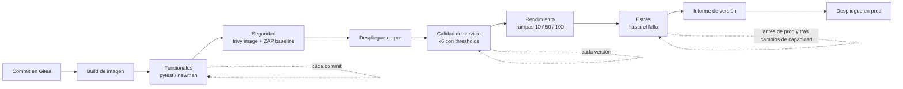
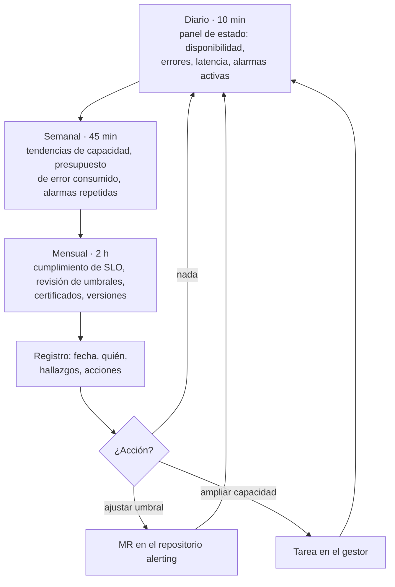

# UT4 · Indicadores, KPI y pruebas del servicio

<p class="ut-meta">Módulo 5169 · 18 h · Sesiones 20 a 28 · RA2 CE a, b, c, d, e, f</p>

En la UT1 pusimos el contenedor de referencia a exponer métricas, logs y eventos; en la UT2 convertimos algunas de esas métricas en alarmas con Alertmanager; en la UT3 protegimos la pila de monitorización. Ahora toca ordenar todo eso para que sirva a alguien que no seáis vosotros: documentar qué mide cada contador, definir con fórmula y umbral los indicadores que de verdad describen el servicio, escribir el runbook de cada alarma (la guía de qué hacer cuando salta) y, sobre todo, probar el servicio de forma repetible (funcional, carga, estrés, seguridad) y dejar evidencia de cada prueba. Lo que salga de aquí es el dossier de operación que os pedirá cualquier empresa antes de pasar un servicio a producción. En la UT7 estas mismas pruebas serán la verificación de cada actualización, y buena parte de esta unidad entra en el examen de la primera evaluación de abril.

## Qué tienes que saber hacer al terminar

- Documentar una métrica con su ficha (contador, tipo, unidad, etiquetas, referencia al código o al exporter) y clasificarla en capacidad, rendimiento o calidad (CE a).
- Definir indicadores con fórmula PromQL, categoría, umbral de aviso y umbral crítico, y justificar cada umbral con datos (CE b).
- Mantener un catálogo de alarmas donde cada una tenga origen, posible fallo, impacto, pasos de análisis, resolución y escalado (CE c).
- Ejecutar pruebas funcionales, de calidad de servicio, de rendimiento, de estrés y de seguridad contra el servicio en pre, con herramientas que devuelvan un código de salida utilizable en un pipeline (CE d).
- Documentar cada prueba con una ficha de caso y evidencias archivadas junto a la versión (CE e).
- Diseñar y ejecutar un ciclo de revisión periódica de indicadores frente a umbrales, dejando registro (CE f).

## Antes de entrar en detalle

Imaginad que el martes a las 10, con la clase entera lanzando peticiones contra `app01`, la API empieza a tardar tres segundos. La alarma `AppSlow` de la UT2 salta, y ahí se acaba lo bueno: quien la recibe no sabe si un p95 de 300 ms es normal, no encuentra escrito qué mirar primero, y nadie sabe si la versión desplegada el viernes ya iba lenta, porque nadie la probó con carga. Lo que falta no es más monitorización, sino la documentación que la acompaña y las pruebas que se adelantan al problema. Al terminar la unidad queremos un dossier en el repositorio del servicio con el que alguien que no lo conoce sepa qué se mide, qué valores son aceptables, qué hacer cuando salta cada alarma y qué pruebas ha pasado cada versión antes de producción.

Las herramientas de monitorización las conocéis de la UT1 y la UT2; las de pruebas son nuevas.

| Herramienta o concepto | Qué es, en una frase | Para qué la usamos en esta unidad |
|---|---|---|
| Prometheus y PromQL | La base de datos de métricas de `mon01` y su lenguaje de consulta | Escribir y calcular las fórmulas de los indicadores |
| Recording rules (reglas grabadas) | Consultas que Prometheus evalúa cada poco y guarda como una serie nueva con nombre propio | Que panel, alerta e informe usen el mismo número |
| Exporters (cAdvisor, node_exporter, postgres_exporter, blackbox_exporter) | Programas que traducen el estado de un contenedor, una máquina, PostgreSQL o una URL a métricas legibles por Prometheus | Origen de casi todas las métricas que vais a documentar |
| SLI, SLO y presupuesto de error | La medida de calidad de un servicio, el objetivo comprometido y el margen de fallo que ese objetivo deja | Fijar umbrales con criterio y decidir cuándo se puede desplegar |
| Runbook | La guía paso a paso, con comandos exactos, para quien recibe una alarma | Que cualquiera resuelva una alarma sin preguntar |
| Grafana | El visor de paneles conectado a Prometheus | Ver qué le pasa al servidor durante una prueba y capturar la evidencia |
| pytest y requests | El ejecutor de pruebas de Python y su librería de peticiones HTTP | Pruebas funcionales: llamar a la API y comprobar la respuesta |
| Postman y newman | Un editor gráfico de peticiones HTTP y su ejecutor de línea de comandos | Alternativa a pytest para las pruebas funcionales |
| k6 | Un generador de carga que simula muchos usuarios y comprueba si se cumplen los objetivos de latencia y errores | Pruebas de calidad de servicio, rendimiento y estrés |
| OWASP ZAP | Un escáner de seguridad web; en modo baseline solo observa, no ataca | Detectar cabeceras y cookies mal configuradas en pre |
| Trivy | Un escáner de vulnerabilidades de imágenes de contenedor | Saber si la imagen lleva paquetes con fallos conocidos |
| Jenkins e informe JUnit | El servidor de automatización de 5166 y el XML en que las herramientas de pruebas le entregan resultados | Que las pruebas se lancen solas en cada versión y frenen el despliegue si fallan |

Cómo está organizada la unidad. Primero decidimos qué medir (señales doradas, USE y RED), porque sin criterio se documentan 400 contadores y no sirve ninguno. Con ese filtro documentamos las métricas en fichas y las clasificamos. Sobre ellas construimos los indicadores con fórmula y umbrales, y de los indicadores salen las alarmas, que reciben su runbook en el catálogo. Ese es el bloque de monitorización. El segundo son las pruebas: los tipos, la herramienta de cada uno y cómo leer los resultados junto a Grafana; después, cómo documentarlas y meterlas en el pipeline. Cierra el seguimiento periódico, que mantiene vivo todo lo anterior, y los errores frecuentes.

!!! info "Lo que necesitas de la otra asignatura"
    Esta unidad va del 15 de diciembre al 2 de febrero, en paralelo con la UT5 de 5166 (infraestructura como código con OpenTofu y Ansible, del 11 de diciembre al 27 de enero): [https://victor-educ.github.io/apuntes-5166/ut/ut5-iac/](https://victor-educ.github.io/apuntes-5166/ut/ut5-iac/).
    El entorno `pre` contra el que se lanzan las pruebas de esta unidad (`pre.app.lab`) es el que crea ese repositorio IaC. Mientras no exista, lanzad las pruebas contra `app01` en la VPC dev, que está detrás del firewall desde la UT3.
    A principios de febrero `pre` ya existe, y es el mismo que la UT7 actualiza y la UT8 destruye con `tofu destroy`.
    El pipeline de Jenkins en el que se integra la etapa de pruebas se construye en 5166 UT6, del 3 de febrero al 24 de marzo ([https://victor-educ.github.io/apuntes-5166/ut/ut6-ci/](https://victor-educ.github.io/apuntes-5166/ut/ut6-ci/)): si al llegar a la A4.7 aún no está, la etapa se prueba en un job aparte de `jenkins01` y se integra en el `Jenkinsfile` cuando exista.

## Elegir qué medir antes de documentarlo

El error habitual al empezar es documentar los 400 contadores que expone cAdvisor (el exporter que publica las métricas de cada contenedor). No se puede vigilar todo y tampoco hace falta. Hay dos métodos clásicos que os van a servir para decidir qué métricas merecen ficha, indicador y alarma.

### Las cuatro señales doradas

El libro de SRE de Google (*Site Reliability Engineering*, la forma de operar servicios que Google publicó como libro) las llama *golden signals* y son el mínimo que hay que tener de cualquier servicio de cara al usuario:

- Latencia: cuánto tarda en responder una petición. Conviene separar la latencia de las respuestas correctas de la de los errores, porque un 500 que se devuelve en 2 ms baja la media y disfraza el problema.
- Tráfico: cuánta demanda recibe el servicio. En una API, peticiones por segundo; en una base de datos, transacciones o sesiones; en un proxy, bytes y conexiones.
- Errores: proporción de peticiones que fallan, de forma explícita (5xx), implícita (200 con contenido incorrecto) o por política (más de 1 s de respuesta cuenta como fallo).
- Saturación: cómo de lleno está el recurso que antes se va a agotar. En el contenedor `app` es la CPU limitada por la cuota de compose; en `db01` suelen ser las conexiones o el disco.

Con estas cuatro señales del servicio del curso ya tenéis un panel útil y las alarmas de síntoma de la UT2 caen de forma natural: latencia alta, errores altos, tráfico anómalo (cero tráfico también es síntoma) y saturación.

### USE para recursos, RED para servicios

Brendan Gregg propuso el método USE para diagnosticar recursos físicos: para cada recurso (CPU, memoria, disco, red) mira Utilization (porcentaje de tiempo ocupado), Saturation (cola de trabajo pendiente) y Errors. Tom Wilkie hizo el equivalente para servicios con el método RED: Rate (peticiones por segundo), Errors (peticiones fallidas por segundo) y Duration (distribución de la latencia). Son la misma idea que las señales doradas vista desde dos lados: USE mira hacia dentro (infraestructura, capacidad), RED mira hacia el usuario (calidad, rendimiento).

En el laboratorio la correspondencia es directa. RED de la API sale de las dos métricas que añadisteis en la UT1 (`app_requests_total` y `app_request_seconds_bucket`). USE del contenedor sale de cAdvisor (`container_cpu_usage_seconds_total`, `container_memory_working_set_bytes`, `container_fs_*`, `container_network_*`) y del nodo (`node_*`, que publica node_exporter). USE de PostgreSQL sale de `postgres_exporter` (`pg_stat_activity_count` como saturación de conexiones, `pg_stat_database_*` como tasa y errores). Cuando en la actividad A4.1 os falten métricas de una categoría, recorred USE y RED y aparecerán.

## Documentar las métricas

Antes de vigilar un sistema hay que saber qué mide cada contador, quién lo produce, con qué unidad y para qué se usa. Eso es la ficha de métrica. Su valor no está en la ficha en sí, sino en que obliga a responder preguntas que de otro modo nadie se hace: ¿esta métrica es un gauge o un counter? ¿En segundos o en milisegundos? ¿Quién la mantiene si cambia el código?

| Campo | Ejemplo |
|---|---|
| Nombre | `app_request_seconds_bucket` |
| Tipo | histogram |
| Unidad | segundos |
| Etiquetas | `method`, `route`, `le` |
| Qué mide | Tiempo de respuesta de la API por petición |
| Referencia | Código: `api/metrics.py`; documentación del cliente Prometheus para Python |
| Categoría | Rendimiento |
| Uso | Latencia p95 (KPI 2); alerta `AppSlow` |

Sobre los campos hay tres detalles que marcan la diferencia entre una ficha útil y una de relleno. El tipo dice cómo se comporta el valor: un counter solo sube (como un cuentakilómetros), un gauge sube y baja (como un termómetro) y un histogram reparte cada observación en cubos por rango de valor. El tipo determina qué funciones de PromQL (el lenguaje de consultas de Prometheus) tienen sentido: `rate()` solo sobre counters, `histogram_quantile()` solo sobre los `_bucket` de un histogram, y a un gauge se le aplica `avg_over_time()` o `predict_linear()`. La unidad debe ser la base (segundos, bytes), como manda la convención de nombres de Prometheus, y la conversión a ms o GiB se hace en Grafana. La referencia es lo que permite ir al origen cuando la métrica se comporta raro: fichero y función del código propio, o la página del exporter y su versión.

### Las tres categorías con ejemplos del laboratorio

Las métricas se agrupan en tres categorías y un servicio bien documentado tiene indicadores de las tres. Si al terminar la A4.1 solo tenéis capacidad, es que estáis mirando el contenedor y no el servicio.

Capacidad responde a "¿cuándo se llenará?" y son casi siempre gauges o cocientes entre un uso y un límite:

| Métrica | Tipo | Origen | Qué mide |
|---|---|---|---|
| `container_memory_working_set_bytes{name="app"}` | gauge | cAdvisor | Memoria que el kernel no puede reclamar; es la que cuenta para el OOM killer (el mecanismo del kernel que mata un proceso cuando se agota la memoria) |
| `container_spec_memory_limit_bytes{name="app"}` | gauge | cAdvisor | Límite `mem_limit` de compose; sin límite cAdvisor devuelve un número enorme, no cero |
| `node_filesystem_avail_bytes{mountpoint="/data"}` | gauge | node_exporter en db01 | Bytes disponibles para usuarios no root (distinto de `_free_bytes`, que incluye la reserva del 5 %) |
| `pg_stat_activity_count{datname="app"}` | gauge | postgres_exporter | Conexiones abiertas por estado (`state="active"`, `"idle"`) |
| `pg_settings_max_connections` | gauge | postgres_exporter | Valor de `max_connections` en `postgresql.conf` |

Rendimiento responde a "¿cuánto tarda y cuánto procesa?" y suelen ser histogramas o counters derivados en el tiempo:

| Métrica | Tipo | Origen | Qué mide |
|---|---|---|---|
| `app_request_seconds_bucket` | histogram | API, `api/metrics.py` | Distribución de la latencia por `method` y `route` |
| `app_requests_total` | counter | API | Peticiones atendidas por `method`, `route` y `status`; su `rate()` es el throughput |
| `pg_stat_database_xact_commit_total` | counter | postgres_exporter | Transacciones confirmadas; su `rate()` es la carga real de la BD |
| `container_cpu_usage_seconds_total{name="app"}` | counter | cAdvisor | Segundos de CPU consumidos; en rendimiento cuando se compara con la latencia, en capacidad cuando se divide por la cuota |

Calidad responde a "¿el resultado es correcto?" y son la parte que más se olvida porque hay que construirla:

| Métrica | Tipo | Origen | Qué mide |
|---|---|---|---|
| `app_requests_total{status=~"5.."}` | counter | API | Respuestas con error de servidor |
| `app_requests_total{status="429"}` | counter | API | Peticiones rechazadas por límite de tasa (calidad desde el punto de vista del cliente) |
| `probe_success{job="blackbox",instance="https://app.lab/health"}` | gauge | blackbox_exporter en mon01 | 1 si la sonda externa obtuvo respuesta válida; base de la disponibilidad "vista desde fuera" |
| `pg_stat_database_deadlocks_total` | counter | postgres_exporter | Interbloqueos; cada uno es una transacción abortada |
| `app_orders_inconsistent` | gauge | job de comprobación en la API | Pedidos cuyo total no cuadra con sus líneas; ejemplo de métrica de negocio que hay que programar |

La última fila es deliberada. Ninguna herramienta os va a dar la calidad del dato: si un pedido guardado con importe negativo es un fallo del servicio, alguien tiene que escribir la consulta que lo cuenta y exponerla como gauge. En una empresa esto es lo que distingue "monitorizamos el servidor" de "monitorizamos el servicio".

## Indicadores: fórmulas y umbrales

Un indicador (KPI, *key performance indicator*) combina contadores en un valor con significado para alguien que no conoce el código. "El contenedor lleva 1.234.567 segundos de CPU" no dice nada; "la API va al 62 % de su cuota de CPU" sí. El marco que se usa en la industria para hablar de indicadores es el de SLI, SLO y SLA:

- SLI (*service level indicator*): la medida, expresada normalmente como cociente de eventos buenos entre eventos totales. Disponibilidad = peticiones correctas / peticiones totales.
- SLO (*service level objective*): el valor comprometido internamente para ese SLI en una ventana. Disponibilidad ≥ 99,5 % en 30 días.
- SLA (*service level agreement*): el contrato con el cliente, con consecuencias (penalizaciones) si se incumple. Siempre menos exigente que el SLO, para que el equipo tenga margen de reaccionar antes de que la empresa pague.
- Presupuesto de error (*error budget*): lo que se puede fallar sin incumplir el SLO. Es la herramienta que convierte el SLO en decisiones: si queda presupuesto, se despliega; si no queda, se congela el despliegue y se arregla la fiabilidad.

### El presupuesto de error con números

Con un SLO de disponibilidad del 99,5 % en 30 días el presupuesto es el 0,5 % de la ventana:

```text
30 días × 24 h × 60 min = 43.200 min
0,5 % de 43.200 min = 216 min = 3,6 h
```

Si el servicio recibe de media 20 peticiones/s, en 30 días son 51,84 millones de peticiones y el presupuesto son 259.200 peticiones fallidas. Da igual si esas 3,6 h son una caída completa o un 1 % de errores repartido durante 15 días: el presupuesto se consume igual, y esa es la gracia del modelo. Un SLO del 99,9 % deja 43 min al mes; uno del 99,99 %, 4,3 min. Cada nueve más cuesta un orden de magnitud en infraestructura y en guardias, así que el SLO se negocia con quien paga, no se pone el máximo por defecto.

El ritmo al que se gasta el presupuesto es el *burn rate*. Un burn rate de 1 significa que, al ritmo actual de errores, el presupuesto se agota justo al final de la ventana de 30 días. Con SLO 99,5 %:

```text
burn rate = tasa de errores observada / (1 - SLO)
          = tasa de errores observada / 0,005

Tasa de errores del 0,5 %  → burn rate 1   → presupuesto agotado en 30 días
Tasa de errores del 3 %    → burn rate 6   → presupuesto agotado en 5 días
Tasa de errores del 7,2 %  → burn rate 14,4 → presupuesto agotado en 50 horas
```

Por eso las alarmas basadas en SLO no se disparan por "errores > 1 %" a secas, sino por burn rate en dos ventanas a la vez (por ejemplo, burn rate 14,4 sostenido en la última hora y también en los últimos 5 minutos): la ventana larga evita el ruido y la corta comprueba que el problema sigue activo. En PromQL, con las reglas grabadas de la UT2 (recording rules: consultas que Prometheus evalúa cada poco y guarda como una serie nueva):

```promql
# 2 % del presupuesto mensual consumido en 1 h y el problema sigue vivo
(app:errors:ratio1h > (14.4 * 0.005)) and (app:errors:ratio5m > (14.4 * 0.005))
```

Necesitáis grabar `app:errors:ratio1h` además del `ratio5m` que ya tenéis. El capítulo "Alerting on SLOs" del *SRE Workbook* (enlazado al final) tiene la tabla completa de ventanas y burn rates; no hace falta memorizarla, sí entender por qué existe.

### Los nueve indicadores del servicio

Esta tabla es el núcleo de la unidad: los nueve números que describen el servicio del curso, cada uno con la fórmula que lo calcula, la categoría a la que pertenece y los dos umbrales (aviso y crítico) que después se convierten en alarmas. Cuando leáis p95 pensad en el percentil 95, el valor que el 95 % de las peticiones no supera.

| Indicador | Fórmula (PromQL) | Categoría | Umbral aviso | Umbral crítico |
|---|---|---|---|---|
| Disponibilidad | `sum(rate(app_requests_total{status!~"5.."}[30d])) / sum(rate(app_requests_total[30d]))` | Calidad | < 99,7 % | < 99,5 % |
| Latencia p95 | `histogram_quantile(0.95, sum by(le)(rate(app_request_seconds_bucket[5m])))` | Rendimiento | > 300 ms | > 500 ms |
| Throughput | `sum(rate(app_requests_total[5m]))` | Rendimiento | informativo | ninguno |
| Tasa de errores | `app:errors:ratio5m` | Calidad | > 0,5 % | > 1 % |
| Saturación CPU | `rate(container_cpu_usage_seconds_total{name="app"}[5m]) / container_spec_cpu_quota{name="app"} * container_spec_cpu_period{name="app"}` | Capacidad | > 70 % | > 90 % |
| Memoria | `container_memory_working_set_bytes{name="app"} / container_spec_memory_limit_bytes{name="app"}` | Capacidad | > 80 % | > 90 % |
| Disco BD | `node_filesystem_avail_bytes{mountpoint="/data"} / node_filesystem_size_bytes{mountpoint="/data"}` | Capacidad | < 20 % | < 10 % |
| Días hasta disco lleno | `predict_linear(node_filesystem_avail_bytes{mountpoint="/data"}[7d], 30*86400) < 0` | Capacidad | 30 días | 7 días |
| Conexiones BD | `sum(pg_stat_activity_count) / pg_settings_max_connections` | Capacidad | > 70 % | > 85 % |

Cada fórmula tiene un porqué y al menos una trampa. Repasadlas una a una porque en la A4.2 las vais a implementar como recording rules y en el examen os voy a preguntar por ellas.

**Disponibilidad.** El cociente excluye del numerador los 5xx pero mantiene los 4xx, porque un 404 o un 401 es una respuesta correcta a una petición incorrecta y no es culpa del servicio. La trampa es la ventana: `rate(...[30d])` obliga a Prometheus a leer 30 días de muestras de todas las series de `app_requests_total` cada vez que se evalúa, y con una etiqueta `route` de alta cardinalidad (muchos valores distintos, una serie por cada uno) eso tarda segundos. Lo correcto es grabar `app:requests:rate5m` y `app:errors:rate5m` como reglas y calcular la disponibilidad mensual sobre ellas con `sum_over_time`, o usar directamente `increase()` sobre la regla grabada. `rate` sobre 30 días exige que la retención de Prometheus supere 30 días (en mon01 está en 45 d por esta razón).

**Latencia p95.** `histogram_quantile` no calcula el percentil real: estima en qué cubo cae el 95 % acumulado y hace una interpolación lineal dentro de ese cubo. Con los cubos por defecto del cliente Python (0,005, 0,01, 0,025, 0,05, 0,075, 0,1, 0,25, 0,5, 0,75, 1, 2,5, 5, 7,5, 10 s), si el p95 real está en 320 ms el resultado será cualquier valor entre 250 y 500 ms según el reparto, y con pocos cubos en la zona de interés la gráfica da saltos. Dos consecuencias prácticas: definid los cubos en `api/metrics.py` alrededor del SLO (por ejemplo 0,1, 0,2, 0,3, 0,4, 0,5, 0,75, 1, 2, 5), y no pongáis un umbral de 500 ms si tenéis un cubo en 500 ms, porque el valor estimado se pegará al borde. La segunda trampa es el `sum by(le)`: si agregáis quitando `le`, la función no tiene con qué trabajar y devuelve NaN. Si el 95 % de las peticiones supera el último cubo finito, el resultado es el límite de ese cubo (10 s), no un valor mayor. Un p95 es la latencia que el 5 % de peticiones más lentas supera: con 20 peticiones/s son 60 usuarios por minuto viendo algo peor que el número del panel.

**Throughput.** No tiene umbral porque no es bueno ni malo en sí, pero es contexto imprescindible: un p95 de 800 ms con 200 peticiones/s no es el mismo problema que con 2 peticiones/s. Sí vale la pena una alarma de "tráfico cero durante 10 min en horario laboral", que casi siempre significa que el proxy de web01 ha dejado de enviar peticiones.

**Tasa de errores.** Se usa la regla grabada `app:errors:ratio5m` de la UT2 y no la consulta cruda, para que el panel, la alerta y el informe mensual coincidan al céntimo. El umbral crítico del 1 % es el doble del presupuesto de error (0,5 %), es decir, burn rate 2. Con poco tráfico el cociente es ruidoso: 1 error entre 50 peticiones ya es un 2 %. Si el servicio tiene picos de tráfico bajo, añadid al numerador de la alerta una condición de tráfico mínimo (`and app:requests:rate5m > 1`).

**Saturación de CPU.** cAdvisor expone la cuota (`container_spec_cpu_quota`, en microsegundos por periodo) y el periodo (`container_spec_cpu_period`, normalmente 100.000 µs). `cpus: "1.5"` en compose se traduce en cuota 150.000, periodo 100.000. La fórmula divide los segundos de CPU consumidos por segundo (que pueden ser 1,5 si el contenedor usa un núcleo y medio) entre la cuota normalizada. Sin límite de CPU la cuota vale 0 y el cociente da `+Inf`; el indicador solo tiene sentido si el servicio tiene `cpus` fijado, que es una de las razones por las que se fija. Superar el 100 % es imposible de forma sostenida: el kernel estrangula (`container_cpu_cfs_throttled_periods_total`), y esa métrica de throttling es mejor señal de saturación que el porcentaje.

**Memoria.** Se usa `working_set` y no `usage` porque `usage` incluye la caché de páginas, que el kernel puede liberar sin afectar al proceso. El OOM killer actúa cuando el working set alcanza el límite, así que el 90 % del límite es un aviso real de que estáis a un pico de un reinicio. Igual que con la CPU, sin `mem_limit` en compose el denominador es un número enorme y el indicador queda en 0 % para siempre, lo que os da falsa tranquilidad.

**Disco de la base de datos.** Se usa `avail` y no `free`: ext4 reserva por defecto un 5 % para root, y PostgreSQL no corre como root. Con 100 GiB de volumen, cuando `free` marca 5 GiB, PostgreSQL ya no puede escribir. El umbral del 10 % es agresivo a propósito: PostgreSQL con el disco lleno no responde a las escrituras y, si el WAL (el diario de escrituras que PostgreSQL guarda antes de tocar las tablas) no puede crecer, se para entero.

**Días hasta disco lleno.** `predict_linear` ajusta una recta por mínimos cuadrados sobre los últimos 7 días de la serie y la extrapola 30 días (30 × 86.400 s). Si el valor previsto es negativo, el disco se llena antes de un mes. La ventana de 7 días absorbe los ciclos semanales (las copias del domingo, los `VACUUM` de la noche, la limpieza interna de PostgreSQL); una ventana de 1 h daría avisos con cada carga masiva. Para pintar directamente los días que quedan en un panel se puede usar `node_filesystem_avail_bytes{mountpoint="/data"} / -deriv(node_filesystem_avail_bytes{mountpoint="/data"}[7d]) / 86400`, que da un valor sin sentido (negativo) cuando el disco está vaciándose: en Grafana se limita el eje a valores positivos. La trampa de cualquier predicción lineal es que un borrado grande la deja ciega durante una semana.

**Conexiones de la base de datos.** `pg_stat_activity_count` viene desglosado por estado y base de datos, de ahí el `sum`. El límite es `max_connections`, 100 por defecto. Los umbrales del 70 y el 85 % son relativamente bajos porque el agotamiento de conexiones es brusco: un pool mal dimensionado en la API pasa de 40 a 100 en segundos cuando la BD se ralentiza, y a partir de ahí todo son `FATAL: too many clients`. Este indicador es el candidato natural para probar el estrés en la A4.6.

### Cómo fijar umbrales

La regla general es que cada categoría tiene su propia lógica y no se mezclan:

- Capacidad: por margen restante, es decir, por el tiempo que tenéis para reaccionar. El aviso tiene que llegar con días de margen si la acción es comprar disco o pedir una VM más grande, y con minutos si la acción es un `docker compose restart`. Por eso "días hasta disco lleno" avisa a 30 días y "memoria" al 80 %.
- Rendimiento: por el SLO más un margen. Si el SLO de latencia es p95 < 500 ms, el aviso va en 300 ms para dar tiempo a mirar antes de incumplir.
- Calidad: por el presupuesto de error, con burn rate. El crítico es burn rate 2 o superior; el aviso, burn rate 1 sostenido.

Y una regla práctica: ningún umbral se fija sin haber mirado antes la distribución real. En la A4.2 tenéis dos días de tráfico de prueba; un umbral de CPU al 70 % cuando el servicio vive al 75 % en horas punta es una alarma permanente, y una alarma permanente es una alarma ignorada.

## Catálogo de alarmas y runbooks

Cada alarma posible tiene una ficha con lo que un operador necesita a las 3 de la mañana. No es documentación para quien escribió la alarma, es documentación para quien la recibe sin contexto, medio dormido y con un cliente esperando. La ficha del original:

| Campo | AppHighErrorRate |
|---|---|
| Origen | `app:errors:ratio5m > 1 %` durante 5 min |
| Posible fallo | BD no responde; despliegue con bug; dependencia externa caída |
| Impacto | Usuarios reciben errores 5xx; afecta al SLO de disponibilidad |
| Análisis | 1. Panel "app" en Grafana: ¿coincide con un despliegue? 2. `docker logs app --since 10m \| grep ERROR` 3. `nc -zv db01 5432` 4. Loki: `{container="app"} \| json \| level="error"` |
| Resolución | Si es despliegue: rollback (`docker compose up -d` con la imagen de la versión anterior). Si es BD: ver alarma PgDown. Si es externo: activar modo degradado |
| Escalado | Desarrollador de guardia si persiste más de 15 min |

### Qué hace bueno a un runbook

Un runbook bueno se reconoce porque alguien que no conoce el servicio puede seguirlo sin preguntar. Eso se traduce en cinco propiedades:

1. Los pasos de análisis van del más rápido y frecuente al más lento y raro, y cada uno dice qué significa el resultado ("si `nc` falla, el problema es de red o de PostgreSQL: salta a PgDown").
2. Los comandos son exactos, copiables, con el host desde el que se ejecutan. "Mirar los logs" no vale; `ssh app01 docker logs app --since 10m 2>&1 | grep -c ERROR` sí.
3. Las acciones de resolución están ordenadas por reversibilidad: primero lo que no rompe nada (reiniciar un contenedor), luego lo que tiene coste (rollback), y lo destructivo (borrar datos, ampliar disco en caliente) solo con escalado.
4. Hay un criterio de escalado con tiempo y persona o rol, no "avisar a alguien".
5. Se enlaza desde la anotación `runbook` de la regla de alerta (como hicisteis en la A2.4) y vive en el mismo repositorio que `alerts.yml`, de modo que un cambio en la alarma obligue a revisar el runbook en el mismo merge request.

Y una regla de higiene: cada vez que una alarma salta y el runbook no resuelve el caso, el cierre de la incidencia incluye actualizar el runbook. Un runbook que no cambia en un año es un runbook que nadie usa.

### Dos runbooks más

Dos fichas más, escritas con el mismo esquema, para que veáis cómo cambia el contenido según la alarma: una de fallo brusco (la base de datos deja de responder) y una de aviso con margen (el disco se llenará en una semana).

| Campo | PgDown |
|---|---|
| Origen | `pg_up == 0` durante 1 min (postgres_exporter no consigue conectar) o `probe_success{instance="db01:5432"} == 0` |
| Posible fallo | Contenedor `postgres` parado o reiniciándose (OOM, disco lleno, corrupción); `max_connections` agotadas y el exporter no entra; red entre mon01 y la subred data cortada por una regla de OPNsense |
| Impacto | Toda escritura y la mayoría de lecturas de la API fallan con 5xx; salta AppHighErrorRate a los 5 min. Inhibida por HostDown de db01 (UT2) |
| Análisis | 1. Desde mon01: `nc -zv 10.10.3.10 5432` (si falla, red o proceso caído). 2. En db01: `docker compose ps postgres` y `docker inspect postgres --format '{{.State.OOMKilled}} {{.State.ExitCode}}'`. 3. `df -h /data` (disco lleno es la causa más frecuente en el laboratorio). 4. `docker logs postgres --since 15m \| tail -50` buscando `FATAL`, `PANIC` o `could not write`. 5. Si el contenedor está arriba: `docker exec postgres psql -U postgres -c "select count(*) from pg_stat_activity"` para descartar conexiones agotadas |
| Resolución | Reinicio por OOM: `docker compose restart postgres` y subir `mem_limit` en el mismo turno. Disco lleno: liberar espacio (logs antiguos, WAL archivado ya copiado) y reiniciar; nunca borrar dentro de `pgdata`. Conexiones agotadas: `pg_terminate_backend` de las sesiones `idle` más antiguas y revisar el pool de la API. Corrupción (`PANIC` en los logs): no tocar, escalar y preparar restauración de la copia (UT6) |
| Escalado | Inmediato al responsable de datos si hay `PANIC` o si no arranca en 10 min; en horario, aviso al equipo de desarrollo si la causa es el pool |

| Campo | DiskWillFillIn7d |
|---|---|
| Origen | `predict_linear(node_filesystem_avail_bytes{mountpoint="/data"}[7d], 7*86400) < 0` durante 1 h |
| Posible fallo | Crecimiento normal de datos sin plan de capacidad; logs de PostgreSQL o de la aplicación sin rotación; copias locales (`pg_dump`) acumuladas en el mismo volumen; tabla sin `VACUUM` con bloat (espacio que siguen ocupando filas ya borradas) |
| Impacto | Ninguno inmediato. Si no se actúa, en menos de una semana PostgreSQL deja de escribir y salta PgDown |
| Análisis | 1. Panel "capacidad db01": pendiente de la gráfica de 30 días y fecha estimada. 2. `du -xsh /data/* \| sort -h \| tail` para ver qué crece. 3. `docker exec postgres psql -U postgres -c "select relname, pg_size_pretty(pg_total_relation_size(oid)) from pg_class order by pg_total_relation_size(oid) desc limit 10"`. 4. `ls -la /data/backups` (¿hay copias que ya están en restic, la herramienta de copias de la UT6?). 5. Comprobar `logrotate` en `/var/lib/docker/containers` si el crecimiento está fuera de `/data` |
| Resolución | Copias locales ya replicadas: borrar las de más de 7 días. Logs: activar rotación (`max-size` en el driver `json-file`). Bloat: `VACUUM (VERBOSE)` de la tabla en ventana de baja carga. Crecimiento legítimo: abrir tarea de ampliación del disco virtual en Proxmox (`qm resize`) y `resize2fs`, con copia previa |
| Escalado | Si la fecha estimada es inferior a 3 días, tratar como crítico y avisar al responsable de infraestructura en el día |

El catálogo es la colección de fichas, versionada con las reglas de alerta y enlazada desde la anotación `runbook` de cada alarma. En la A4.3 os pido diez como mínimo; en la empresa lo normal es que haya entre 30 y 80 para un servicio mediano, y que la mitad se retiren al cabo de un año por no haber saltado nunca o por saltar sin acción posible.

## Pruebas del servicio

Monitorizar dice cómo se comporta el servicio con el tráfico que hay; probar dice cómo se comportará con el tráfico que habrá, o con el que no debería haber. Cada tipo de prueba responde a una pregunta distinta y se ejecuta en un momento distinto del ciclo de vida.

| Tipo | Qué comprueba | Herramientas | Cuándo |
|---|---|---|---|
| Funcionales | Que cada función hace lo que debe (y falla como debe) | pytest, Postman/newman, curl con asserts | Cada cambio |
| Calidad de servicio | Que cumple los SLO con carga normal | k6 con umbrales (`thresholds`) | Cada versión |
| Rendimiento | Latencia y throughput bajo carga creciente | k6, JMeter, Locust | Cada versión, cambios de infraestructura |
| Estrés | Dónde y cómo se rompe; cómo se recupera | k6 con rampas hasta fallo | Antes de producción, tras cambios de capacidad |
| Seguridad | Vulnerabilidades en la aplicación y sus componentes | OWASP ZAP (baseline), `trivy image`, nikto | Cada versión |



Las pruebas funcionales son rápidas (segundos) y se lanzan en cada commit. Las de calidad y rendimiento necesitan un entorno desplegado y varios minutos, así que van por versión. El estrés puede tumbar el entorno, por lo que no se automatiza en cada versión: se lanza a mano, en pre, antes de la primera puesta en producción y cuando cambia la capacidad (más CPU, otro tamaño de pool, otra VM). La seguridad va en cada versión porque una imagen base nueva puede traer CVE nuevas (vulnerabilidades conocidas, publicadas con un identificador) sin que el código cambie.

### Pruebas funcionales con pytest

Una prueba funcional contra la API es una petición HTTP y una serie de afirmaciones sobre la respuesta. Con `pytest` (el ejecutor de pruebas de Python) y `requests` (su librería para hacer peticiones HTTP), el fichero queda así; fijaos en que el fixture `token` inicia sesión una sola vez y que cada función prueba una cosa con `assert`:

```python
# tests/functional/test_items.py
import os
import requests
import pytest

BASE = os.environ.get("API_URL", "https://app.lab/api")

@pytest.fixture(scope="session")
def token():
    r = requests.post(f"{BASE}/login", json={"user": "test", "password": os.environ["API_TEST_PASS"]})
    assert r.status_code == 200
    return r.json()["token"]

def test_list_items_ok(token):
    r = requests.get(f"{BASE}/items", headers={"Authorization": f"Bearer {token}"}, timeout=5)
    assert r.status_code == 200
    assert r.headers["Content-Type"].startswith("application/json")
    assert isinstance(r.json(), list)

def test_list_items_requires_auth():
    r = requests.get(f"{BASE}/items", timeout=5)
    assert r.status_code == 401

def test_create_item_validates_price(token):
    r = requests.post(f"{BASE}/items", json={"name": "x", "price": -3},
                      headers={"Authorization": f"Bearer {token}"}, timeout=5)
    assert r.status_code == 422
    assert "price" in r.json()["detail"][0]["loc"]

def test_unknown_item_is_404(token):
    r = requests.get(f"{BASE}/items/999999", headers={"Authorization": f"Bearer {token}"}, timeout=5)
    assert r.status_code == 404
```

Fijaos en el reparto: un caso correcto, uno de autenticación, uno de validación y uno de recurso inexistente. Los diez casos que pide la A4.4 deben cubrir los tres grupos (correctos, errores esperados, validación); una suite con diez casos que solo comprueban `status == 200` no prueba que el servicio falle bien, y fallar bien es la mitad del trabajo de una API. La contraseña de prueba va en variable de entorno (en Jenkins, una credencial), nunca en el fichero.

La ejecución con informe JUnit (un XML con un resultado por caso, que es el formato que Jenkins y Gitea entienden):

```bash
pip install pytest requests
API_URL=https://pre.app.lab/api API_TEST_PASS=... pytest tests/functional -v --junitxml=reports/pytest.xml
```

`pytest` devuelve 0 si todo pasa y 1 si algo falla, que es lo que necesita el pipeline (la cadena de etapas automáticas de Jenkins que construye, prueba y despliega).

### Pruebas funcionales con Postman y newman

Postman es cómodo para diseñar la petición con la interfaz gráfica; newman es su ejecutor de línea de comandos, que es lo que se lleva al pipeline. Una colección exportada (formato v2.1) es un JSON con las peticiones y sus scripts de comprobación. Fijaos en el bloque `event`: es donde van las afirmaciones, escritas en JavaScript con `pm.test`, y equivale a los `assert` de pytest:

```json
{
  "info": { "name": "API curso", "schema": "https://schema.getpostman.com/json/collection/v2.1.0/collection.json" },
  "item": [
    {
      "name": "GET items",
      "request": {
        "method": "GET",
        "header": [{ "key": "Authorization", "value": "Bearer {{token}}" }],
        "url": "{{base}}/items"
      },
      "event": [{
        "listen": "test",
        "script": { "exec": [
          "pm.test('status 200', () => pm.response.to.have.status(200));",
          "pm.test('responde en menos de 500 ms', () => pm.expect(pm.response.responseTime).to.be.below(500));",
          "pm.test('devuelve una lista', () => pm.expect(pm.response.json()).to.be.an('array'));"
        ] }
      }]
    },
    {
      "name": "POST item precio negativo",
      "request": {
        "method": "POST",
        "header": [{ "key": "Content-Type", "value": "application/json" },
                   { "key": "Authorization", "value": "Bearer {{token}}" }],
        "body": { "mode": "raw", "raw": "{\"name\": \"x\", \"price\": -3}" },
        "url": "{{base}}/items"
      },
      "event": [{
        "listen": "test",
        "script": { "exec": ["pm.test('status 422', () => pm.response.to.have.status(422));"] }
      }]
    }
  ]
}
```

Las variables `{{base}}` y `{{token}}` se resuelven con un fichero de entorno o desde la línea de comandos, y así la misma colección sirve para dev, pre y prod. La ejecución con informe JUnit usa el reporter integrado:

```bash
npm install -g newman
newman run tests/postman/api-curso.json \
  --env-var base=https://pre.app.lab/api --env-var token="$API_TOKEN" \
  --reporters cli,junit --reporter-junit-export reports/newman.xml
```

O sin instalar nada, con la imagen oficial:

```bash
docker run --rm -v "$PWD/tests/postman:/etc/newman" postman/newman \
  run api-curso.json --env-var base=https://pre.app.lab/api \
  --reporters cli,junit --reporter-junit-export /etc/newman/newman.xml
```

Mi criterio: si el equipo ya usa Postman para documentar la API, newman; si la API tiene lógica que exige preparar datos antes de cada caso (crear un usuario, un pedido), pytest, porque los fixtures lo hacen limpio y en Postman acaba siendo JavaScript incrustado en un JSON.

### Calidad de servicio y rendimiento con k6

k6 es un generador de carga que se programa en JavaScript, se ejecuta como binario único (en el laboratorio está instalado en jenkins01 y en vuestras VM de trabajo) y devuelve código de salida distinto de cero cuando no se cumple un umbral. Esa última propiedad es la que lo convierte en herramienta de pipeline y no solo de laboratorio. El script del original:

```javascript
import http from 'k6/http';
import { check, sleep } from 'k6';

export const options = {
  stages: [
    { duration: '2m', target: 50 },
    { duration: '5m', target: 50 },
    { duration: '2m', target: 0 },
  ],
  thresholds: {
    http_req_duration: ['p(95)<500'],
    http_req_failed: ['rate<0.01'],
  },
};

export default function () {
  const r = http.get('https://app.lab/api/items');
  check(r, { 'status 200': (r) => r.status === 200 });
  sleep(1);
}
```

Cada pieza tiene su función:

- `options.stages` define la rampa en usuarios virtuales (VU): 2 min subiendo de 0 a 50, 5 min estables en 50, 2 min bajando. Un VU es un bucle que ejecuta la función por defecto una y otra vez; con `sleep(1)` y una respuesta de 100 ms, cada VU genera algo menos de 1 petición/s, así que 50 VU son unas 45 peticiones/s. Si queréis controlar el ritmo en peticiones por segundo y no en usuarios, el ejecutor `constant-arrival-rate` que viene más abajo es el adecuado.
- `thresholds` son los SLO expresados sobre las métricas internas de k6. `http_req_duration` es el tiempo total de la petición; `http_req_failed` es la proporción de respuestas que k6 considera fallidas (4xx y 5xx por defecto). Si un umbral no se cumple al terminar, k6 lo marca en rojo y sale con código 99.
- `check` es una afirmación que no detiene la prueba: cuenta cuántas veces se cumplió. Se refleja en la métrica `checks` y se puede poner umbral sobre ella (`checks: ['rate>0.99']`). Un `check` que falla no cuenta como `http_req_failed`; son dos cosas distintas y conviene tener umbral en ambas.

Un script más completo, que es el que vais a usar en la A4.5, separa escenarios, etiqueta peticiones y aborta si el SLO se incumple de forma clara para no gastar 9 minutos en una prueba ya perdida:

```javascript
import http from 'k6/http';
import { check, sleep } from 'k6';

export const options = {
  scenarios: {
    navegacion: {
      executor: 'ramping-vus',
      startVUs: 0,
      stages: [
        { duration: '1m', target: 10 },
        { duration: '3m', target: 10 },
        { duration: '1m', target: 50 },
        { duration: '3m', target: 50 },
        { duration: '1m', target: 100 },
        { duration: '3m', target: 100 },
        { duration: '1m', target: 0 },
      ],
      gracefulRampDown: '30s',
    },
    escrituras: {
      executor: 'constant-arrival-rate',
      rate: 5, timeUnit: '1s',
      duration: '13m',
      preAllocatedVUs: 10, maxVUs: 30,
      exec: 'crear',
    },
  },
  thresholds: {
    'http_req_duration{name:items}': ['p(95)<500', 'p(99)<1000'],
    'http_req_duration{name:crear}': [{ threshold: 'p(95)<800', abortOnFail: true, delayAbortEval: '1m' }],
    http_req_failed: ['rate<0.01'],
    checks: ['rate>0.99'],
  },
  tags: { version: __ENV.APP_VERSION || 'desconocida' },
};

const BASE = __ENV.API_URL || 'https://pre.app.lab/api';
const params = { headers: { Authorization: `Bearer ${__ENV.API_TOKEN}` } };

export default function () {
  const r = http.get(`${BASE}/items`, { ...params, tags: { name: 'items' } });
  check(r, {
    'status 200': (r) => r.status === 200,
    'lista no vacía': (r) => r.json().length > 0,
  });
  sleep(1);
}

export function crear() {
  const r = http.post(`${BASE}/items`, JSON.stringify({ name: 'k6', price: 9.5 }),
    { ...params, headers: { ...params.headers, 'Content-Type': 'application/json' }, tags: { name: 'crear' } });
  check(r, { 'creado': (r) => r.status === 201 });
}
```

Lo que aporta cada novedad: los `scenarios` permiten mezclar en la misma prueba una carga de lectura que crece por escalones (ejecutor `ramping-vus`) y una carga de escritura constante de 5 peticiones/s (`constant-arrival-rate`), que es lo que se parece a un servicio real. Las `tags: { name }` en cada petición hacen que los umbrales se puedan fijar por endpoint, porque un SLO global esconde que `/items` va bien y `/crear` va mal. `abortOnFail` con `delayAbortEval` corta la prueba si el p95 de escritura supera 800 ms una vez pasado el primer minuto (para no abortar por el arranque frío). La etiqueta global `version` se propaga a todas las métricas y, cuando las mandéis a Prometheus, permite comparar dos versiones en el mismo panel.

Ejecución y salidas:

```bash
API_URL=https://pre.app.lab/api API_TOKEN=... APP_VERSION=1.4.2 \
k6 run --out json=tests/evidence/1.4.2/k6-carga.json \
       --summary-export=tests/evidence/1.4.2/k6-resumen.json \
       tests/k6/carga.js
echo "código de salida: $?"
```

`--out json` escribe una línea por muestra (con 100 VU durante 13 min son cientos de MB; es la evidencia completa pero no la que se lee). `--summary-export` escribe un JSON pequeño con los agregados por métrica y umbral, que es el que se adjunta al informe y el que un script puede consultar (con `jq`, el filtro de línea de comandos para JSON: `jq '.metrics.http_req_duration.values["p(95)"]'`). Para tener las métricas de k6 al lado de las del servicio en Grafana, lo que de verdad interesa, k6 puede escribir directamente en Prometheus por remote write (la API con la que Prometheus acepta que otro programa le mande series):

```bash
K6_PROMETHEUS_RW_SERVER_URL=http://10.10.0.20:9090/api/v1/write \
K6_PROMETHEUS_RW_TREND_AS_NATIVE_HISTOGRAM=true \
k6 run --out experimental-prometheus-rw tests/k6/carga.js
```

Para que funcione, el Prometheus de mon01 debe arrancar con `--web.enable-remote-write-receiver` (en la UT3 lo dejamos cerrado; se abre solo desde la subred de gestión). El nombre del output ha ido perdiendo el prefijo `experimental-` en versiones recientes de k6 1.x; `k6 run --help` os dice cuál acepta la instalada. Las métricas llegan con el prefijo `k6_` y las etiquetas del escenario, y en Grafana se importa el panel oficial de k6 para Prometheus o se hace uno propio con `k6_http_req_duration_p95` y `k6_http_reqs_total`.

### Carga, rendimiento y estrés no son lo mismo

Los tres usan k6 y a menudo el mismo script, pero buscan cosas distintas y se leen de forma distinta:

- La prueba de carga o de calidad de servicio somete al servicio a la carga esperada (los 50 usuarios del script original) y responde a una pregunta binaria: ¿cumple los SLO o no? Es la que va en el pipeline y la que en la UT7 verificará cada actualización. Su resultado es el veredicto de los `thresholds`.
- La prueba de rendimiento sube la carga por escalones (10, 50, 100 usuarios en la A4.5) y busca la curva: cómo crece la latencia con la carga y a partir de qué punto se incumple el SLO. Su resultado es un número ("el SLO se incumple a partir de 80 usuarios") y una gráfica. Sirve para planificar capacidad y para comparar versiones (si la 1.4.2 aguanta 80 y la 1.5.0 aguanta 60, alguien tiene que explicar por qué).
- La prueba de estrés sube hasta romper y luego baja. Busca tres datos: el punto de rotura (errores > 10 % o timeouts), el modo de fallo (¿la API devuelve 503 limpios o se cuelga? ¿muere PostgreSQL por conexiones o la API por memoria?) y el tiempo de recuperación al retirar la carga. Un servicio que se rompe a 300 usuarios pero se recupera solo en 20 s es mejor que uno que aguanta 400 y luego necesita un reinicio manual. Para el estrés no se usan `thresholds` que aborten: queremos ver el fallo entero.

```javascript
// tests/k6/estres.js: rampa hasta el fallo y bajada
export const options = {
  stages: [
    { duration: '2m', target: 100 },
    { duration: '2m', target: 200 },
    { duration: '2m', target: 300 },
    { duration: '2m', target: 400 },
    { duration: '3m', target: 0 },   // aquí se mide la recuperación
  ],
  thresholds: { http_req_failed: ['rate<0.10'] }, // solo informativo: no aborta
};
```

### Leer los resultados junto a Grafana

El resumen de k6 dice qué vio el cliente; Grafana dice qué le pasó al servidor mientras tanto. Solo cruzando los dos se entiende el resultado. Durante cada rampa tened abierto el panel del servicio con la ventana de tiempo de la prueba y mirad, en este orden:

1. Latencia p95 del servidor (`app:latency_p95:5m`) frente al `p(95)` de k6. Si k6 ve 800 ms y el servidor ve 200 ms, el cuello está delante de la API: el proxy de web01, la red o el límite de conexiones de nginx.
2. Saturación de CPU del contenedor `app` y `container_cpu_cfs_throttled_periods_total`. Si la latencia sube justo cuando el throttling aparece, la cuota de `cpus` es el límite y la solución es cambiarla, no optimizar código.
3. Conexiones de PostgreSQL. Si se pegan a `max_connections` antes de que suba la latencia, el pool de la API está sobredimensionado respecto a la BD.
4. Memoria working set. Una subida lineal que no baja al retirar la carga es una fuga; el estrés es la mejor manera de encontrarlas.
5. Tasa de errores y logs en Loki filtrados por el intervalo: el primer error que aparece suele decir qué se rompió (`too many clients`, `upstream timed out`, `OOMKilled`).

<figure markdown="span">
  { width="640" }
  <figcaption>Panel de Grafana con métricas de servicio. Durante una prueba de carga se captura con la ventana de tiempo ajustada a la prueba y se guarda como evidencia. Fuente: Joel Kennedy, dominio público, vía Wikimedia Commons.</figcaption>
</figure>

La captura del panel es evidencia obligatoria en la A4.5 y la A4.6, y tiene que llevar el rango de tiempo visible, para que quien la lea después sepa a qué ejecución corresponde. Mejor todavía: una anotación en Grafana al inicio y al final de cada prueba (se pueden crear desde el propio script de k6 con una llamada a la API de anotaciones de Grafana en las funciones `setup()` y `teardown()`).

### Seguridad: ZAP baseline y trivy image

Las pruebas de seguridad de esta unidad son las dos que caben en un pipeline sin intervención humana. El análisis en profundidad (pentest, escaneo activo de ZAP) se ve en la UT7 con la gestión de vulnerabilidades.

ZAP (OWASP Zed Attack Proxy, el escáner de aplicaciones web de la fundación OWASP) en modo baseline lanza la araña (el rastreador que sigue los enlaces de la página) contra la URL durante un minuto y aplica solo las reglas pasivas: no envía ataques, solo observa las respuestas, así que es seguro contra pre e incluso contra prod. Detecta cabeceras de seguridad ausentes, cookies sin `Secure` o `HttpOnly`, información de versión en `Server`, formularios sin protección CSRF (falsificación de peticiones desde otro sitio), contenido mixto:

```bash
mkdir -p tests/evidence/1.4.2/zap
docker run --rm -t -v "$PWD/tests/evidence/1.4.2/zap:/zap/wrk:rw" ghcr.io/zaproxy/zaproxy:stable \
  zap-baseline.py -t https://pre.app.lab -r zap.html -J zap.json -c zap-rules.conf
echo "código de salida: $?"
```

El volumen en `/zap/wrk` es imprescindible: sin él el informe se escribe dentro del contenedor y desaparece. Los códigos de salida son 0 (sin hallazgos), 1 (hay hallazgos marcados como FAIL), 2 (solo WARN) y 3 (error de ejecución). Por defecto todo es WARN y el pipeline no falla nunca; el fichero `zap-rules.conf` es donde decidís qué reglas son FAIL, con el id de la regla:

```text
10020	FAIL	(Anti-clickjacking Header)
10021	FAIL	(X-Content-Type-Options Header Missing)
10038	FAIL	(Content Security Policy (CSP) Header Not Set)
10054	WARN	(Cookie without SameSite Attribute)
10096	IGNORE	(Timestamp Disclosure)
```

Al leer `zap.html`, cada alerta trae riesgo (High, Medium, Low, Informational), confianza, las URL afectadas y una solución genérica. En el laboratorio, los hallazgos de cabeceras se resuelven en la configuración de nginx en web01 (`add_header X-Content-Type-Options nosniff always;`), no en la aplicación, y esa es la primera lección: la mitad de lo que ZAP encuentra se arregla en el proxy.

trivy escanea la imagen del contenedor: el sistema operativo base y las dependencias de la aplicación (los paquetes de `requirements.txt` o `package.json` que quedaron en la imagen), además de secretos incrustados y configuraciones erróneas del Dockerfile:

```bash
trivy image --severity HIGH,CRITICAL --ignore-unfixed \
  --format json -o tests/evidence/1.4.2/trivy.json \
  --exit-code 1 registry.lab/app:1.4.2
echo "código de salida: $?"
trivy image --severity HIGH,CRITICAL --ignore-unfixed registry.lab/app:1.4.2   # tabla legible
```

`--ignore-unfixed` descarta las CVE que no tienen corrección publicada, porque no podéis hacer nada con ellas salvo cambiar de imagen base, y meterlas en el informe solo genera ruido; en la UT7 veréis cuándo sí conviene listarlas. `--exit-code 1` hace que trivy falle si queda algún hallazgo tras los filtros, que es lo que quiere el pipeline. En la tabla, las columnas que importan son `Library`, `Vulnerability` (el id CVE), `Severity`, `Installed Version` y `Fixed Version`: la última os dice si basta con reconstruir la imagen (la corrección está en el repositorio de Debian) o si hay que subir la versión de una dependencia en el código. La primera vez que escanéis la imagen del curso vais a ver entre 20 y 60 hallazgos si la base es `python:3.12` completa y menos de 5 si es `python:3.12-slim` actualizada: ese dato solo ya justifica la elección de la base.

## Documentar las pruebas

Una prueba que no se documenta no existe a efectos de auditoría ni de la UT7, donde tendréis que demostrar que la versión anterior pasaba lo que la nueva no pasa. Por cada ejecución relevante se rellena un caso de prueba:

| Campo | Contenido |
|---|---|
| Id y nombre | PR-03 Carga 50 usuarios |
| Versión probada | `app:1.4.2`, commit `abc1234` |
| Entorno | pre |
| Fecha y ejecutor | 2027-01-14 · Jenkins job `app-pruebas` #87 (lanzado por vsl) |
| Procedimiento | `k6 run --summary-export=... tests/k6/carga.js` con `API_URL=https://pre.app.lab/api`, `APP_VERSION=1.4.2` |
| Resultado esperado | p95 < 500 ms, errores < 1 % |
| Resultado obtenido | p95 = 412 ms, errores 0,2 % |
| Veredicto | OK |
| Evidencias | `k6-resumen.json`, `k6-carga.json`, `grafana-carga-50.png`, `app-logs.txt`, exportación de `app:latency_p95:5m` del intervalo |

La ficha es corta a propósito. Lo que la hace verificable es que el procedimiento permite repetir la prueba exactamente y que las evidencias están donde dice que están. La estructura de carpetas que usaremos en el repositorio del servicio:

```text
tests/
├── functional/            # pytest
├── postman/               # colección y entornos de newman
├── k6/                    # carga.js, estres.js
├── zap-rules.conf
└── evidence/
    └── 1.4.2/
        ├── INFORME.md         # informe de pruebas de la versión
        ├── casos/
        │   ├── PF-01.md … PF-10.md
        │   ├── PR-01.md … PR-04.md
        │   └── PS-01.md, PS-02.md
        ├── pytest.xml
        ├── newman.xml
        ├── k6-resumen.json
        ├── k6-carga.json.gz
        ├── grafana-carga-10.png, grafana-carga-50.png, grafana-carga-100.png
        ├── grafana-estres.png
        ├── zap/zap.html, zap/zap.json
        ├── trivy.json
        └── app-logs.txt
```

Las evidencias se guardan en el repositorio o en un almacén con la misma retención que las versiones: si la imagen `1.4.2` sigue en el registry, sus pruebas siguen disponibles. El JSON completo de k6 se comprime (pasa de 300 MB a 20) y, si el repositorio Git empieza a pesar, se mueve a un bucket o a un share con la misma política; el `INFORME.md` enlaza entonces a la ruta externa. El informe de pruebas de una versión es un documento de una página que enlaza todos sus casos y da un veredicto único:

```markdown
# Informe de pruebas · app 1.4.2 · commit abc1234 · pre · 2027-01-14

| Bloque | Casos | OK | KO | Veredicto |
|---|---|---|---|---|
| Funcionales (pytest) | PF-01 a PF-10 | 10 | 0 | OK |
| Calidad de servicio (k6, 50 VU) | PR-03 | 1 | 0 | OK |
| Rendimiento (rampas) | PR-01, PR-02, PR-04 | 3 | 0 | OK; SLO se incumple a partir de 85 VU |
| Estrés | PE-01 | informativo | | rotura a 260 VU (conexiones BD); recuperación 40 s |
| Seguridad | PS-01 (ZAP), PS-02 (trivy) | 1 | 1 | KO: CVE-2026-XXXXX HIGH en libssl, corregida en 3.5.2-1 |

Veredicto de la versión: NO APTA para producción hasta reconstruir con base actualizada (PS-02).
Firmado: vsl · Revisado: ...
```

### La puerta de pruebas en el pipeline de Jenkins

El pipeline de despliegue en jenkins01 se monta en la UT6 de la asignatura de despliegue (https://victor-educ.github.io/apuntes-5166/ut/ut6-ci/), que empieza justo cuando esta unidad termina; mientras no exista, las pruebas se lanzan como un job aparte en jenkins01 y se integran en el Jenkinsfile en cuanto haya etapa de deploy. Lo que se añade es una etapa de pruebas entre el despliegue en pre y el despliegue en prod, que solo deja pasar si todos los códigos de salida son cero, y que archiva las evidencias con el número de build:

```groovy
stage('Pruebas en pre') {
  environment {
    API_URL = 'https://pre.app.lab/api'
    API_TOKEN = credentials('api-token-pre')
  }
  steps {
    sh 'pytest tests/functional --junitxml=reports/pytest.xml'
    sh 'newman run tests/postman/api-curso.json --env-var base=$API_URL --env-var token=$API_TOKEN --reporters cli,junit --reporter-junit-export reports/newman.xml'
    sh "trivy image --severity HIGH,CRITICAL --ignore-unfixed --exit-code 1 --format json -o reports/trivy.json registry.lab/app:${APP_VERSION}"
    sh 'docker run --rm -v "$WORKSPACE/reports:/zap/wrk:rw" ghcr.io/zaproxy/zaproxy:stable zap-baseline.py -t https://pre.app.lab -r zap.html -J zap.json -c /zap/wrk/zap-rules.conf'
    sh "APP_VERSION=${APP_VERSION} k6 run --summary-export=reports/k6-resumen.json tests/k6/carga.js"
  }
  post {
    always {
      junit 'reports/*.xml'
      archiveArtifacts artifacts: 'reports/**', fingerprint: true
    }
  }
}
```

El paso `junit` hace que Jenkins pinte la tendencia de casos OK/KO entre builds y marque el build como inestable si hay fallos; `archiveArtifacts` guarda las evidencias unidas al número de build, que es lo que después se copia a `tests/evidence/<versión>/` (o se enlaza desde el informe, si preferís que las evidencias vivan en Jenkins). El estrés no está en la etapa: se lanza a mano con otro job parametrizado, porque tumbar pre cada vez que alguien hace un commit no es aceptable para el resto del equipo que también usa pre.

!!! warning "El orden importa"
    trivy va antes que k6 y ZAP porque es el más barato (segundos) y el que más veces falla. No tiene sentido gastar 13 minutos de carga sobre una imagen que no va a pasar a producción por una CVE crítica.

## Seguimiento periódico

Los indicadores se revisan en un ciclo fijo, no solo cuando salta una alarma. Una alarma avisa de que algo ha pasado el umbral; la revisión detecta lo que se acerca al umbral despacio, lo que el umbral no cubre y los umbrales que están mal puestos. Son cosas que una alarma nunca os va a decir.



- Diario: panel de estado (disponibilidad, errores, latencia, alarmas activas). Es un vistazo de 10 minutos al empezar el día y su valor es detectar lo que pasó de noche sin llegar a alarma: un pico de errores a las 3:00 que duró 4 minutos y no llegó a los 5 del `for`.
- Semanal: tendencias de capacidad (disco, memoria, conexiones), presupuesto de error consumido en lo que va de mes, alarmas repetidas. Una alarma que ha saltado cuatro veces en la semana y se ha cerrado sola las cuatro es o un umbral mal puesto o un problema real intermitente; en ambos casos hay que decidir algo.
- Mensual: cumplimiento de SLO con el dato cerrado del mes, revisión de cada umbral contra la distribución real de ese mes (¿el p95 del 70 % de CPU sigue teniendo sentido tras el crecimiento de tráfico?), caducidad de certificados (`probe_ssl_earliest_cert_expiry` del blackbox_exporter), y versiones desplegadas frente a las publicadas (enlaza con la UT7).

Cada revisión deja un registro breve. La plantilla que usaremos, en `ops/revisiones/AAAA-Wnn.md` para las semanales:

```markdown
# Revisión semanal · 2027-W03 · 2027-01-22 · vsl

## Estado
- Disponibilidad 30 d: 99,71 % (SLO 99,5 %). Presupuesto consumido: 58 % a día 22 → ritmo por encima de 1.
- p95 semana: 340 ms (aviso 300). Subida desde 280 la semana anterior; coincide con despliegue 1.4.2 el día 19.
- Disco /data: 71 % usado, predict_linear a 30 d: 84 %. Sin riesgo.
- Conexiones BD: pico 62 de 100 el martes 10:15.

## Alarmas de la semana
| Alarma | Veces | Duración media | Causa | ¿Acción? |
|---|---|---|---|---|
| AppHighErrorRate | 1 | 8 min | despliegue 1.4.2, rollback | no (funcionó el runbook) |
| AppSlow | 4 | 3 min | picos de 10:00 | sí: umbral de aviso 300 → 350 ms o for 5m → 10m |

## Hallazgos
1. AppSlow salta cada mañana con la carga de las 10:00 y se cierra sola. Ruido.
2. El presupuesto de error va rápido por la incidencia del día 19; no hay margen para otro despliegue fallido este mes.

## Acciones
- [ ] MR alerting!42: AppSlow for 5m → 10m. Responsable vsl. Antes del 26.
- [ ] Congelar despliegues no urgentes hasta el cierre del mes (presupuesto < 50 %). Comunicado a dev.
```

La parte de acciones con responsable y fecha es la que distingue una revisión de una lectura del panel. Y fijaos en la primera acción: el ajuste de umbral es un merge request sobre el repositorio de alerting de la UT2, con lo que el histórico de por qué un umbral vale lo que vale queda en Git y no en la memoria de quien lo cambió.

### Informes automáticos: Grafana y la alternativa por script

Grafana permite programar informes: un dashboard convertido en PDF y enviado por correo cada lunes. En Grafana 12 la función de *Reporting* pertenece a la edición Enterprise y a Grafana Cloud, no a la edición OSS que tenemos en mon01, así que en el laboratorio no la vais a poder usar; en la empresa es probable que sí, y se configura desde el propio dashboard (Share, Schedule report), eligiendo rango de tiempo, formato y destinatarios. Con la edición OSS se puede instalar el plugin `grafana-image-renderer` y pedir a Grafana la imagen de un panel por su API (`/render/d-solo/<uid>/<slug>?panelId=2&from=now-7d&to=now&width=1000&height=500`), que es lo que usaremos para las capturas de la práctica.

La alternativa que prefiero, porque no depende de la edición ni del correo, es un script que consulte los KPI a Prometheus, escriba el resumen en Markdown y lo confirme en Git. Queda un histórico consultable y diferenciable:

```bash
#!/usr/bin/env bash
# ops/bin/kpi-semanal.sh: exporta los KPI de la semana a Markdown y lo guarda en Git
set -euo pipefail
PROM=http://10.10.0.20:9090
q() { curl -sG "$PROM/api/v1/query" --data-urlencode "query=$1" | jq -r '.data.result[0].value[1] // "n/a"'; }

SEMANA=$(date +%G-W%V)
OUT="ops/revisiones/$SEMANA-kpi.md"
{
  echo "# KPI $SEMANA ($(date -I))"
  echo
  echo "| Indicador | Valor |"
  echo "|---|---|"
  printf '| Disponibilidad 30 d | %.3f %% |\n' "$(echo "$(q 'app:availability:30d') * 100" | bc -l)"
  printf '| p95 7 d (ms) | %.0f |\n'          "$(echo "$(q 'quantile_over_time(0.95, app:latency_p95:5m[7d])') * 1000" | bc -l)"
  printf '| Errores 7 d | %.3f %% |\n'        "$(echo "$(q 'avg_over_time(app:errors:ratio5m[7d])') * 100" | bc -l)"
  printf '| Disco /data usado | %.1f %% |\n'  "$(echo "(1 - $(q 'node_filesystem_avail_bytes{mountpoint="/data"} / node_filesystem_size_bytes{mountpoint="/data"}')) * 100" | bc -l)"
  printf '| Conexiones BD (máx 7 d) | %s |\n' "$(q 'max_over_time(sum(pg_stat_activity_count)[7d:5m])')"
  printf '| Alarmas disparadas 7 d | %s |\n'  "$(q 'sum(changes(ALERTS_FOR_STATE[7d]))')"
} > "$OUT"
git add "$OUT" && git commit -qm "kpi: $SEMANA" && git push -q
```

Se lanza los lunes a las 7:00 con un `cron` o un job de Jenkins, y la revisión semanal empieza leyendo ese fichero en vez de abriendo diez paneles. `ALERTS_FOR_STATE` es una serie interna de Prometheus que existe mientras una alerta está en `pending` o `firing`; contar sus cambios es una forma barata de saber cuántas veces ha saltado algo.

## Errores frecuentes en el laboratorio

**`histogram_quantile` devuelve NaN o una línea plana.** Casi siempre falta `le` en el `sum by()`, o el `rate` está sobre `app_request_seconds_count` en vez de `_bucket`. Si devuelve exactamente el valor de un cubo (0,5 o 10) de forma constante, el p95 está fuera del rango de cubos: revisad los cubos definidos en `api/metrics.py`.

**La disponibilidad a 30 días tarda 20 s o da timeout.** `rate(app_requests_total[30d])` sobre la métrica cruda con la etiqueta `route`. Grabad las tasas a 5 min como reglas y calculad la mensual con `sum_over_time` sobre ellas; en Grafana subid el timeout de la fuente de datos solo si no hay más remedio.

**La saturación de CPU da `+Inf` o la memoria da 0 % siempre.** El servicio no tiene `cpus` o `mem_limit` en `compose.yaml`, así que el denominador es 0 o un número de 18 cifras. No es un fallo de la fórmula: es que el contenedor no tiene límites y por tanto no puede saturarse "respecto a" nada. Poned límites; los necesitáis igualmente para el estrés.

**k6 termina con código 99 pero todos los `check` están en verde.** Los `check` y los `thresholds` son independientes. El umbral que falla suele ser `http_req_duration`, que incluye el tiempo de las peticiones con error, o `http_req_failed` por redirecciones 3xx que k6 no sigue si `redirects: 0`. El resumen final marca con una cruz el umbral incumplido; leedlo antes de tocar el script.

**k6 alcanza 100 VU pero el throughput no pasa de 30 peticiones/s y la API está al 20 % de CPU.** El cuello está en el generador o en el camino. Comprobad primero `worker_connections` de nginx en web01 (128 por defecto en algunas imágenes) y después la propia máquina que lanza k6: un portátil por Wi-Fi contra la VPC no da para más de unas decenas de conexiones concurrentes estables. En el laboratorio, lanzad k6 desde jenkins01 o desde una VM en la subred front.

**ZAP no escribe el informe.** Falta el volumen en `/zap/wrk` o la carpeta local no tiene permisos de escritura para el usuario `zap` (uid 1000) del contenedor. `chmod 777` en la carpeta de evidencias es aceptable en el laboratorio; en la empresa se crea la carpeta con el uid correcto.

**ZAP baseline devuelve 3 al instante.** No llega a la URL: certificado autofirmado de pre sin `-I`, o resolución de `pre.app.lab` que funciona en vuestra máquina pero no dentro del contenedor. Probad con `--network host` o pasando la IP.

**trivy tarda minutos o falla al descargar la base de datos.** La primera ejecución descarga la base de vulnerabilidades (varios cientos de MB) desde ghcr.io; en jenkins01 pasa por el proxy de OPNsense. Cachead `~/.cache/trivy` en el agente de Jenkins o levantad un `trivy server` en gitea01 y usad `--server`.

**`predict_linear` da un valor absurdo la semana después de ampliar el disco.** La recta se ajusta sobre 7 días que incluyen un salto de +100 GiB, así que predice que el disco se vacía. No es un fallo: es la ventana. Durante esa semana, mirad el indicador de porcentaje.

**La suite de pytest pasa en local y falla en Jenkins con 401.** La credencial `api-token-pre` es de dev, o el token ha caducado. Las pruebas funcionales deberían obtener su propio token en un fixture de sesión con un usuario de prueba, no reutilizar uno guardado.

**El pipeline se pone en amarillo (inestable) pero despliega en prod.** `junit` marca el build como UNSTABLE si hay casos KO, y por defecto las etapas siguientes se ejecutan con UNSTABLE. Añadid `skipStagesAfterUnstable()` en `options` o comprobad `currentBuild.result` antes de la etapa de producción.

## Actividades

### A4.1 Fichas de métricas (sesión 20)

Documenta todas las métricas relevantes del contenedor de referencia (aplicación, cAdvisor, postgres_exporter; mínimo 15) con la ficha del apartado de métricas y clasifícalas. Comprueba que hay al menos tres de cada categoría. Usa USE y RED para encontrar las que falten: si no llegas a tres de calidad, es que no has mirado los códigos de estado de la API ni el blackbox_exporter.

### A4.2 Indicadores (sesión 21)

Implementa los nueve indicadores de la tabla como recording rules en el repositorio alerting de la UT2 (convención `nivel:métrica:operación`) y monta un panel de KPI en Grafana con ellos. Fija umbrales de aviso y crítico justificados con los datos de dos días de tráfico de prueba: para cada umbral, una línea diciendo qué distribución has visto y por qué has puesto ese valor. Calcula el presupuesto de error mensual del servicio en minutos y en peticiones.

### A4.3 Catálogo de alarmas (sesión 22)

Ficha completa (origen, fallo, impacto, análisis, resolución, escalado) para las alarmas de la UT2 más las nuevas de esta UT: mínimo diez. Enlaza cada una desde la anotación `runbook` de su regla. Los comandos de análisis deben ser copiables y llevar el host desde el que se ejecutan. Prueba al menos un runbook con un compañero que no lo haya escrito: si tiene que preguntarte algo, el runbook está incompleto.

### A4.4 Pruebas funcionales (sesión 23)

Colección Postman/newman o suite pytest con al menos diez casos sobre la API, repartidos entre casos correctos, errores esperados (401, 403, 404) y validación (422). Ejecución automatizada con informe JUnit y código de salida distinto de cero cuando falla un caso. Comprueba que el informe se ve en Jenkins.

### A4.5 Calidad de servicio y rendimiento (sesión 24)

Script k6 con umbrales de los SLO (p95 y tasa de errores). Ejecuta rampas de 10, 50 y 100 usuarios contra pre. Captura el panel de Grafana durante cada una, con el rango de tiempo visible. ¿A partir de cuántos usuarios se incumple el SLO? ¿Qué recurso limita (CPU, conexiones, proxy)? Compara el p95 que ve k6 con el que ve el servidor y explica la diferencia.

### A4.6 Estrés y seguridad (sesión 25)

Estrés: rampa hasta que falle (errores > 10 % o timeout); anota el punto de rotura, el modo de fallo (qué componente se rompe y cómo) y el tiempo de recuperación al bajar la carga. Seguridad: ZAP baseline con fichero de reglas y `trivy image` sobre la imagen; lista los hallazgos con su severidad e indica para cada uno dónde se corrige (proxy, imagen base, dependencia, código).

### A4.7 Documentación de pruebas (sesión 26)

Rellena la ficha de caso de prueba para las diez pruebas más relevantes de A4.4 a A4.6, con evidencias archivadas en el repositorio (`tests/evidence/<versión>/`). Redacta el informe de pruebas de la versión con veredicto. Añade la etapa de pruebas al pipeline de Jenkins de la 5166 con `junit` y `archiveArtifacts`, y provoca un fallo (un umbral imposible) para demostrar que la puerta cierra.

### A4.8 Seguimiento (sesión 27)

Diseña el ciclo de revisión (diario/semanal/mensual) para tu servicio, con duración, quién y qué se mira en cada uno. Ejecuta una revisión semanal con los datos de las dos últimas semanas usando la plantilla: registro con hallazgos y acciones. Ajusta al menos un umbral con datos y hazlo mediante merge request en el repositorio alerting. Opcional: el script de exportación de KPI a Git programado en cron.

## Práctica evaluable

**Práctica evaluable UT4 (sesión 28, 2 de febrero de 2027).** Entrega el dossier de operación del servicio: fichas de métricas, tabla de indicadores con fórmulas y umbrales, catálogo de alarmas con runbooks, informe de pruebas de la versión con casos y evidencias, y el registro de la revisión periódica. Todo en el repositorio del servicio en Gitea, con un `README` en la raíz que enlace cada parte.

Entregables:

- [ ] `docs/metricas.md`: mínimo 15 fichas, tres o más por categoría.
- [ ] `docs/indicadores.md` y `alerting/rules.yml`: nueve indicadores con fórmula, categoría, umbrales y justificación; recording rules cargadas en el Prometheus de mon01.
- [ ] `docs/alarmas/`: catálogo con mínimo diez runbooks enlazados desde `alerting/alerts.yml`.
- [ ] `tests/` con la suite funcional, los scripts de k6, el fichero de reglas de ZAP y `tests/evidence/<versión>/` con `INFORME.md`, los casos y las evidencias.
- [ ] Etapa de pruebas en el `Jenkinsfile` con al menos una ejecución archivada en jenkins01.
- [ ] `ops/revisiones/`: diseño del ciclo y al menos un registro de revisión semanal con acciones, más el merge request del umbral ajustado.

| Criterio | RA2 | Peso |
|---|---|---|
| Métricas documentadas con contador, referencia y las tres categorías | a | 15 % |
| Indicadores implementados con fórmulas y umbrales por tipo | b | 20 % |
| Catálogo de alarmas con origen, fallo, impacto y pasos de resolución | c | 15 % |
| Pruebas funcionales, de calidad de servicio, rendimiento, seguridad y estrés ejecutadas | d | 25 % |
| Pruebas documentadas con evidencias, indicadores y registros | e | 15 % |
| Indicadores monitorizados y revisados periódicamente frente a umbrales | f | 10 % |

Este dossier es el punto de partida de la UT7: cuando actualicéis la aplicación y PostgreSQL, la verificación consistirá en volver a pasar exactamente estas pruebas y comparar el informe de la versión nueva con el de la 1.4.2.

## Para ampliar

- [Monitoring Distributed Systems (Google SRE Book)](https://sre.google/sre-book/monitoring-distributed-systems/): el capítulo de donde salen las cuatro señales doradas y el principio de alertar por síntomas.
- [Alerting on SLOs (Google SRE Workbook)](https://sre.google/workbook/alerting-on-slos/): burn rate, ventanas múltiples y la tabla de umbrales; es la referencia para las alarmas de calidad.
- [The USE Method, Brendan Gregg](https://www.brendangregg.com/usemethod.html): el método para recursos, con la lista de comprobación por componente de un servidor Linux.
- [Histograms and summaries (Prometheus)](https://prometheus.io/docs/practices/histograms/): cómo funciona `histogram_quantile`, el error de interpolación y por qué los cubos deben elegirse alrededor del SLO.
- [Query functions (Prometheus)](https://prometheus.io/docs/prometheus/latest/querying/functions/): referencia de `rate`, `increase`, `predict_linear`, `deriv` y `histogram_quantile` con sus condiciones de uso.
- [Documentación de k6](https://grafana.com/docs/k6/latest/): opciones, escenarios y ejecutores, umbrales, salidas (JSON, Prometheus remote write) y la referencia de métricas internas.
- [Thresholds (k6)](https://grafana.com/docs/k6/latest/using-k6/thresholds/): sintaxis completa de umbrales, umbrales por etiqueta y `abortOnFail`.
- [ZAP Baseline Scan](https://www.zaproxy.org/docs/docker/baseline-scan/): parámetros, códigos de salida y formato del fichero de reglas.
- [Trivy](https://trivy.dev/latest/docs/): escaneo de imágenes, filtros de severidad, `--ignore-unfixed`, formatos de salida y modo servidor.
- [Running collections with Newman](https://learning.postman.com/docs/collections/using-newman-cli/command-line-integration-with-newman/): ejecución, variables de entorno y reporters, incluido el JUnit.
- [Pipeline step junit (Jenkins)](https://www.jenkins.io/doc/pipeline/steps/junit/): cómo publica Jenkins los informes y qué significa UNSTABLE.
- [Reporting (Grafana)](https://grafana.com/docs/grafana/latest/dashboards/create-reports/): informes programados; conviene leer el aviso de edición antes de contar con ello.
