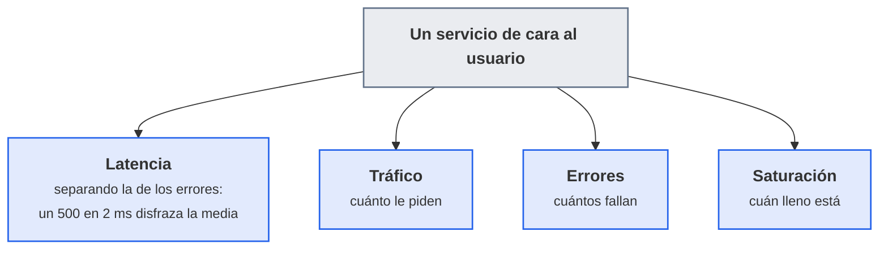
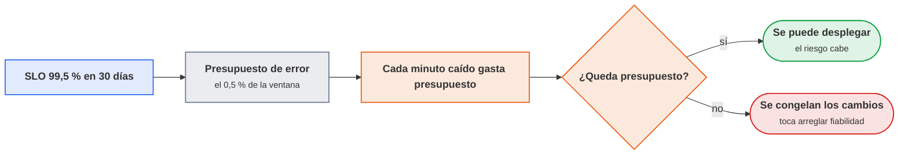
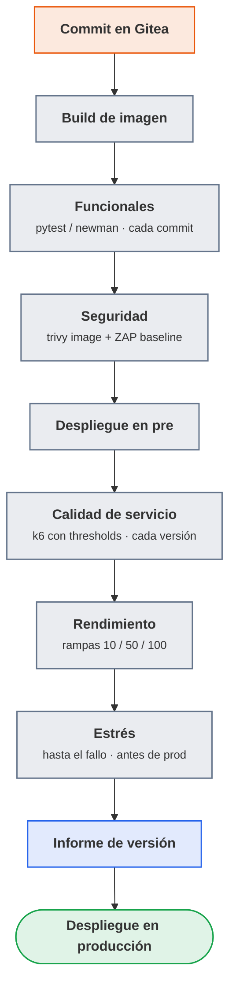
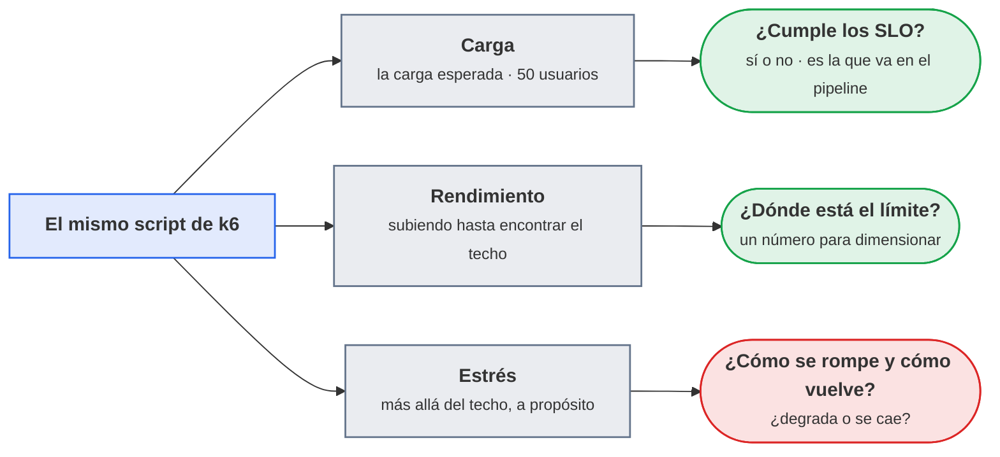
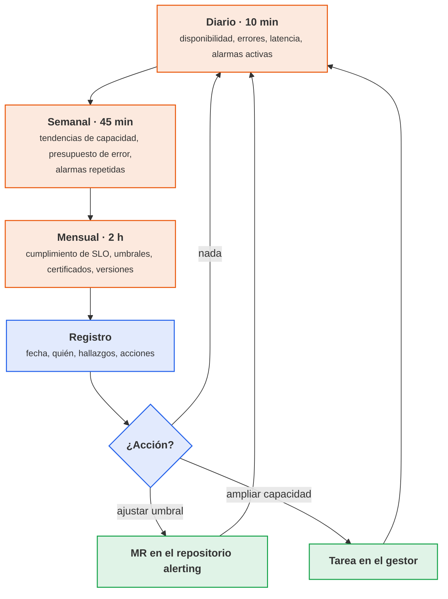

# UT4 · Indicadores, KPI y pruebas del servicio

<p class="ut-meta">16 h · Sesiones 20 a 27 · RA2 CE a, b, c, d, e, f</p>

La UT1 puso el contenedor de referencia a exponer métricas, logs y eventos; la UT2 convirtió algunas de esas métricas en alarmas con Alertmanager; la UT3 protegió la pila de monitorización. Ahora toca ordenar todo eso para que sirva a alguien ajeno al trabajo: documentar qué mide cada contador, definir con fórmula y umbral los indicadores que de verdad describen el servicio, escribir el runbook de cada alarma (la guía de qué hacer cuando salta) y, sobre todo, probar el servicio de forma repetible (funcional, carga, estrés, seguridad) y dejar evidencia de cada prueba. Lo que salga de aquí es el dossier de operación que pide cualquier empresa antes de pasar un servicio a producción. En la UT7 estas mismas pruebas serán la verificación de cada actualización, y buena parte de esta unidad entra en el examen de la primera evaluación de abril.
## Introducción

Esta unidad se lee en el orden en que se da: primero los conceptos y el plan de sesiones, y después cada sesión con la teoría que se explica seguida de su hoja de práctica. Lo que va más allá de lo que se hace en clase está en la página de ampliación enlazada al final.

### Qué tienes que saber hacer al terminar

- Documentar una métrica con su ficha (contador, tipo, unidad, etiquetas, referencia al código o al exporter) y clasificarla en capacidad, rendimiento o calidad (CE a).
- Definir indicadores con fórmula PromQL, categoría, umbral de aviso y umbral crítico, y justificar cada umbral con datos (CE b).
- Mantener un catálogo de alarmas donde cada una tenga origen, posible fallo, impacto, pasos de análisis, resolución y escalado (CE c).
- Ejecutar pruebas funcionales, de calidad de servicio, de rendimiento, de estrés y de seguridad contra el servicio en pre, con herramientas que devuelvan un código de salida utilizable en un pipeline (CE d).
- Documentar cada prueba con una ficha de caso y evidencias archivadas junto a la versión (CE e).
- Diseñar y ejecutar un ciclo de revisión periódica de indicadores frente a umbrales, dejando registro (CE f).

### Los conceptos de la unidad

Un martes a las 10, con la clase entera lanzando peticiones contra `app01`, la API empieza a tardar tres segundos. La alarma `AppSlow` de la UT2 salta, y ahí se acaba lo bueno: quien la recibe no sabe si un p95 de 300 ms es normal, no encuentra escrito qué mirar primero, y nadie sabe si la versión desplegada el viernes ya iba lenta, porque nadie la probó con carga. Lo que falta no es más monitorización, sino la documentación que la acompaña y las pruebas que se adelantan al problema. Al terminar la unidad el resultado es un dossier en el repositorio del servicio con el que alguien que no lo conoce sabe qué se mide, qué valores son aceptables, qué hacer cuando salta cada alarma y qué pruebas ha pasado cada versión antes de producción.

Las herramientas de monitorización vienen de la UT1 y la UT2; las de pruebas son nuevas.

| Herramienta o concepto | Qué es, en una frase | Para qué se usa en esta unidad |
|---|---|---|
| Prometheus y PromQL | La base de datos de métricas de `mon01` y su lenguaje de consulta | Escribir y calcular las fórmulas de los indicadores |
| Recording rules (reglas grabadas) | Consultas que Prometheus evalúa cada poco y guarda como una serie nueva con nombre propio | Que panel, alerta e informe usen el mismo número |
| Exporters (cAdvisor, node_exporter, postgres_exporter, blackbox_exporter) | Programas que traducen el estado de un contenedor, una máquina, PostgreSQL o una URL a métricas legibles por Prometheus | Origen de casi todas las métricas que se documentan aquí |
| SLI, SLO y presupuesto de error | La medida de calidad de un servicio, el objetivo comprometido y el margen de fallo que ese objetivo deja | Fijar umbrales con criterio y decidir cuándo se puede desplegar |
| Runbook | La guía paso a paso, con comandos exactos, para quien recibe una alarma | Que cualquiera resuelva una alarma sin preguntar |
| Grafana | El visor de paneles conectado a Prometheus | Ver qué le pasa al servidor durante una prueba y capturar la evidencia |
| pytest y requests | El ejecutor de pruebas de Python y su librería de peticiones HTTP | Pruebas funcionales: llamar a la API y comprobar la respuesta |
| Postman y newman | Un editor gráfico de peticiones HTTP y su ejecutor de línea de comandos | Alternativa a pytest para las pruebas funcionales |
| k6 | Un generador de carga que simula muchos usuarios y comprueba si se cumplen los objetivos de latencia y errores | Pruebas de calidad de servicio, rendimiento y estrés |
| OWASP ZAP | Un escáner de seguridad web; en modo baseline solo observa, no ataca | Detectar cabeceras y cookies mal configuradas en pre |
| Trivy | Un escáner de vulnerabilidades de imágenes de contenedor | Saber si la imagen lleva paquetes con fallos conocidos |
| Jenkins e informe JUnit | El servidor de automatización de 5166 y el XML en que las herramientas de pruebas le entregan resultados | Que las pruebas se lancen solas en cada versión y frenen el despliegue si fallan |

Cómo está organizada la unidad. Sigue las sesiones en orden, y cada sesión trae primero la teoría que se explica y después su hoja de práctica. En las tres primeras se construye el bloque de monitorización: se decide qué medir y se documentan las métricas (sesión 20), se definen los nueve indicadores con fórmula y umbrales (sesión 21) y se escribe el catálogo de alarmas con sus runbooks (sesión 22). Las tres siguientes son las pruebas: funcionales con pytest o newman (sesión 23), calidad de servicio y rendimiento con k6 leídas junto a Grafana (sesión 24), y estrés y seguridad con ZAP y trivy (sesión 25). La sesión 26 documenta las pruebas, las mete en el pipeline y monta el ciclo de revisión periódica; la 27 cierra el dossier en la práctica evaluable. Los errores frecuentes quedan al final como material de consulta.

!!! otra "Lo que hace falta de la otra asignatura"
    Esta unidad va del 15 de diciembre al 28 de enero, en paralelo con la UT5 de 5166 (infraestructura como código con OpenTofu y Ansible, del 11 de diciembre al 27 de enero): [https://victor-educ.github.io/apuntes-5166/ut/ut5-iac/](https://victor-educ.github.io/apuntes-5166/ut/ut5-iac/).
    El entorno `pre` contra el que se lanzan las pruebas de esta unidad lo crea ese repositorio IaC en enero, cuando la UT5 de Despliegue saca el módulo `vm` y los directorios `envs/dev` y `envs/pre`. El servicio publicado allí es `api.pre.lab`, igual que en dev es `api.dev.lab`. Las tres primeras sesiones (20, 21 y 22) trabajan sobre dev; las pruebas empiezan en la sesión 23, el 14 de enero, con `pre` ya levantado. Si ese día `pre` todavía no está, las pruebas se lanzan contra `app01` en la VPC dev, que está detrás del firewall desde la UT3, y se anota en la ficha de cada caso. `pre` es además el mismo entorno que la UT7 actualiza y la UT8 destruye con `tofu destroy`.
    Jenkins es otra cosa: **no existe hasta el 5 de febrero**, con la UT6 de Despliegue ([https://victor-educ.github.io/apuntes-5166/ut/ut6-ci/](https://victor-educ.github.io/apuntes-5166/ut/ut6-ci/), del 3 de febrero al 24 de marzo), es decir, después de la práctica evaluable de esta unidad. Por eso aquí no se monta ningún job: lo que se hace es dejar la integración **preparada y documentada** (el fragmento de `Jenkinsfile`, las credenciales que hará falta crear y los comandos exactos ya probados a mano, con su código de salida), y se conecta al pipeline en febrero, en cuanto haya controlador. Las pruebas de estas hojas se lanzan a mano desde el puesto o desde una VM de la subred front.

### Plan de sesiones

Cada sesión de 110 minutos empieza con una explicación corta y sigue con laboratorio. La columna «Se explica» recoge los apartados de teoría que se desarrollan en clase, con su duración aproximada; la columna «Se practica», el trabajo de laboratorio de esa sesión. Las sesiones marcadas solo como práctica no traen teoría nueva.

| Sesión | Fecha | Tipo | Se explica | Se practica |
|---:|-------|------|------------|-------------|
| [20](#sesion-20-fichas-de-metricas) | 15 dic | Teoría y práctica | Señales doradas, USE y RED; la ficha de métrica y las tres categorías (25 min). | Documentar al menos quince métricas del contenedor de referencia y clasificarlas. |
| [21](#sesion-21-indicadores) | 17 dic | Teoría y práctica | SLI, SLO y presupuesto de error; los nueve indicadores y sus trampas (25 min). | Implementar los nueve indicadores como recording rules y panel de KPI con umbrales justificados. |
| [22](#sesion-22-catalogo-de-alarmas) | 12 ene | Teoría y práctica | Qué hace un buen runbook (15 min). | Ficha completa para al menos diez alarmas y enlace desde la anotación runbook. |
| [23](#sesion-23-pruebas-funcionales) | 14 ene | Teoría y práctica | Tipos de prueba y qué comprueba cada una; pytest y newman (20 min). | Suite con diez casos sobre la API e informe JUnit. |
| [24](#sesion-24-calidad-de-servicio-y-rendimiento) | 19 ene | Teoría y práctica | k6: options, stages, thresholds, checks; leer resultados junto a Grafana (20 min). | Script k6 con umbrales de los SLO; rampas de 10, 50 y 100 usuarios contra pre; capturas del panel. |
| [25](#sesion-25-estres-y-seguridad) | 21 ene | Teoría y práctica | Estrés frente a carga; ZAP baseline y trivy image (15 min). | Rampa hasta el fallo y tiempo de recuperación; ZAP y trivy sobre la imagen; lista de hallazgos. |
| [26](#sesion-26-documentacion-de-pruebas-y-seguimiento) | 26 ene | Teoría y práctica | La ficha de caso de prueba, el informe de versión y el ciclo de revisión diario, semanal y mensual (20 min). | Fichas de las diez pruebas con evidencias archivadas, informe de la versión, y una revisión semanal ejecutada con la plantilla y un umbral ajustado por merge request. |
| [27](#sesion-27-practica-evaluable) | 28 ene | Práctica evaluable | Aclaración del enunciado (10 min). | Cerrar el dossier de operación: fichas, indicadores, catálogo, informe de pruebas y registro de revisión. |

## Sesión 20 · Fichas de métricas

<p class="ut-meta" markdown>15 de diciembre · Teoría y práctica · <span class="dur" tabindex="0" aria-label="Elegir qué medir antes de documentarlo · 10 min&#10;Documentar las métricas · 15 min&#10;A4.1 Fichas de métricas · 85 min" data-dur="Elegir qué medir antes de documentarlo · 10 min&#10;Documentar las métricas · 15 min&#10;A4.1 Fichas de métricas · 85 min">:material-school:<i class="dur-barra" style="--teoria:23%"></i>:material-flask:</span></p>

Al acabar la sesión hay al menos quince métricas del contenedor de referencia documentadas en fichas y clasificadas en capacidad, rendimiento o calidad. Para la hoja A4.1 hacen falta los dos apartados que siguen: el criterio para elegir qué medir (señales doradas, USE y RED) y la ficha de métrica con sus tres categorías.

### Elegir qué medir antes de documentarlo

El error habitual al empezar es documentar los 400 contadores que expone cAdvisor (el exporter que publica las métricas de cada contenedor). No se puede vigilar todo y tampoco hace falta. Hay dos métodos clásicos para decidir qué métricas merecen ficha, indicador y alarma.

#### Las cuatro señales doradas

El libro de SRE de Google (*Site Reliability Engineering*, la forma de operar servicios que Google publicó como libro) las llama *golden signals* y son el mínimo que hay que tener de cualquier servicio de cara al usuario:



<p class="pie" markdown>Las cuatro señales doradas son el mínimo. Si solo se pueden instrumentar cuatro cosas de un servicio, que sean estas.</p>


- Latencia: cuánto tarda en responder una petición. Conviene separar la latencia de las respuestas correctas de la de los errores, porque un 500 que se devuelve en 2 ms baja la media y disfraza el problema.
- Tráfico: cuánta demanda recibe el servicio. En una API, peticiones por segundo; en una base de datos, transacciones o sesiones; en un proxy, bytes y conexiones.
- Errores: proporción de peticiones que fallan, de forma explícita (5xx), implícita (200 con contenido incorrecto) o por política (más de 1 s de respuesta cuenta como fallo).
- Saturación: cómo de lleno está el recurso que antes se va a agotar. En el contenedor `app` es la CPU limitada por la cuota de compose; en `db01` suelen ser las conexiones o el disco.

Con estas cuatro señales del servicio del curso ya hay un panel útil y las alarmas de síntoma de la UT2 caen de forma natural: latencia alta, errores altos, tráfico anómalo (cero tráfico también es síntoma) y saturación.

#### USE para recursos, RED para servicios

Brendan Gregg propuso el método USE para diagnosticar recursos físicos: para cada recurso (CPU, memoria, disco, red) se miran Utilization (porcentaje de tiempo ocupado), Saturation (cola de trabajo pendiente) y Errors. Tom Wilkie hizo el equivalente para servicios con el método RED: Rate (peticiones por segundo), Errors (peticiones fallidas por segundo) y Duration (distribución de la latencia). Son la misma idea que las señales doradas vista desde dos lados: USE mira hacia dentro (infraestructura, capacidad), RED mira hacia el usuario (calidad, rendimiento).

En el laboratorio la correspondencia es directa. RED de la API sale de las dos métricas añadidas en la UT1 (`app_http_requests_total` y `app_http_request_duration_seconds_bucket`). USE del contenedor sale de cAdvisor (`container_cpu_usage_seconds_total`, `container_memory_working_set_bytes`, `container_fs_*`, `container_network_*`) y del nodo (`node_*`, que publica node_exporter). USE de PostgreSQL sale de `postgres_exporter` (`pg_stat_activity_count` como saturación de conexiones, `pg_stat_database_*` como tasa y errores). Cuando en la actividad A4.1 falten métricas de una categoría, conviene recorrer USE y RED: aparecen.

### Documentar las métricas

Antes de vigilar un sistema hay que saber qué mide cada contador, quién lo produce, con qué unidad y para qué se usa. Eso es la ficha de métrica. Su valor no está en la ficha en sí, sino en que obliga a responder preguntas que de otro modo nadie se hace: ¿esta métrica es un gauge o un counter? ¿En segundos o en milisegundos? ¿Quién la mantiene si cambia el código?

| Campo | Ejemplo |
|---|---|
| Nombre | `app_http_request_duration_seconds_bucket` |
| Tipo | histogram |
| Unidad | segundos |
| Etiquetas | `method`, `route`, `le` |
| Qué mide | Tiempo de respuesta de la API por petición |
| Referencia | Código: `api/metrics.py`; documentación del cliente Prometheus para Python |
| Categoría | Rendimiento |
| Uso | Latencia p95 (KPI 2); alerta `AppSlow` |

Sobre los campos hay tres detalles que marcan la diferencia entre una ficha útil y una de relleno. El tipo dice cómo se comporta el valor: un counter solo sube (como un cuentakilómetros), un gauge sube y baja (como un termómetro) y un histogram reparte cada observación en cubos por rango de valor. El tipo determina qué funciones de PromQL (el lenguaje de consultas de Prometheus) tienen sentido: `rate()` solo sobre counters, `histogram_quantile()` solo sobre los `_bucket` de un histogram, y a un gauge se le aplica `avg_over_time()` o `predict_linear()`. La unidad debe ser la base (segundos, bytes), como manda la convención de nombres de Prometheus, y la conversión a ms o GiB se hace en Grafana. La referencia es lo que permite ir al origen cuando la métrica se comporta raro: fichero y función del código propio, o la página del exporter y su versión.

#### Las tres categorías con ejemplos del laboratorio

Las métricas se agrupan en tres categorías y un servicio bien documentado tiene indicadores de las tres. Si al terminar la A4.1 solo hay indicadores de capacidad, es que se está mirando el contenedor y no el servicio.

Capacidad responde a "¿cuándo se llenará?" y son casi siempre gauges o cocientes entre un uso y un límite:

| Métrica | Tipo | Origen | Qué mide |
|---|---|---|---|
| `container_memory_working_set_bytes{service="app"}` | gauge | cAdvisor | Memoria que el kernel no puede reclamar; es la que cuenta para el OOM killer (el mecanismo del kernel que mata un proceso cuando se agota la memoria) |
| `container_spec_memory_limit_bytes{service="app"}` | gauge | cAdvisor | Límite `mem_limit` de compose; sin límite cAdvisor devuelve un número enorme, no cero |
| `node_filesystem_avail_bytes{mountpoint="/data"}` | gauge | node_exporter en db01 | Bytes disponibles para usuarios no root (distinto de `_free_bytes`, que incluye la reserva del 5 %) |
| `pg_stat_activity_count{datname="app"}` | gauge | postgres_exporter | Conexiones abiertas por estado (`state="active"`, `"idle"`) |
| `pg_settings_max_connections` | gauge | postgres_exporter | Valor de `max_connections` en `postgresql.conf` |

Rendimiento responde a "¿cuánto tarda y cuánto procesa?" y suelen ser histogramas o counters derivados en el tiempo:

| Métrica | Tipo | Origen | Qué mide |
|---|---|---|---|
| `app_http_request_duration_seconds_bucket` | histogram | API, `api/metrics.py` | Distribución de la latencia por `method` y `route` |
| `app_http_requests_total` | counter | API | Peticiones atendidas por `method`, `route` y `status`; su `rate()` es el throughput |
| `pg_stat_database_xact_commit_total` | counter | postgres_exporter | Transacciones confirmadas; su `rate()` es la carga real de la BD |
| `container_cpu_usage_seconds_total{service="app"}` | counter | cAdvisor | Segundos de CPU consumidos; en rendimiento cuando se compara con la latencia, en capacidad cuando se divide por la cuota |

Calidad responde a "¿el resultado es correcto?" y son la parte que más se olvida porque hay que construirla:

| Métrica | Tipo | Origen | Qué mide |
|---|---|---|---|
| `app_http_requests_total{status=~"5.."}` | counter | API | Respuestas con error de servidor |
| `app_http_requests_total{status="429"}` | counter | API | Peticiones rechazadas por límite de tasa (calidad desde el punto de vista del cliente) |
| `probe_success{job="blackbox",instance="https://api.dev.lab/health"}` | gauge | blackbox_exporter en mon01 | 1 si la sonda externa obtuvo respuesta válida; base de la disponibilidad "vista desde fuera" |
| `pg_stat_database_deadlocks_total` | counter | postgres_exporter | Interbloqueos; cada uno es una transacción abortada |
| `app_orders_inconsistent` | gauge | job de comprobación en la API | Pedidos cuyo total no cuadra con sus líneas; ejemplo de métrica de negocio que hay que programar |

La última fila es deliberada. Ninguna herramienta da la calidad del dato: si un pedido guardado con importe negativo es un fallo del servicio, alguien tiene que escribir la consulta que lo cuenta y exponerla como gauge. En una empresa esto es lo que distingue "monitorizamos el servidor" de "monitorizamos el servicio".

### A4.1 Fichas de métricas (sesión 20)

<span class="et et-obj">Objetivo</span> Un fichero `docs/metricas.md` en el repositorio del servicio con al menos quince fichas de métrica, tres o más por categoría, y cada una con su referencia al código o al exporter.

<span class="et et-pre">Antes de empezar</span>

- La pila de la UT1 en marcha: Prometheus en `mon01` (`http://10.10.0.20:9090`) recogiendo la API y los exporters.
- El repositorio del servicio clonado, con `api/metrics.py`.
- Lo explicado al principio de la sesión: [las señales doradas, USE y RED](#elegir-que-medir-antes-de-documentarlo) y [la ficha de métrica con sus categorías](#documentar-las-metricas).

<span class="et et-pas">Pasos</span>

1. Lista qué métricas expone cada origen. Para la API, directamente desde `app01`:

    ```bash
    curl -s http://app01:9102/metrics | grep -E '^# (HELP|TYPE)' | head -40
    ```

    Para cAdvisor y postgres_exporter, lo mismo con los puertos `8081` y `9187`. El 8081 es el que cAdvisor publica en el host de app01, porque el 8080 lo ocupa la API; dentro de la red de Docker sigue siendo `cadvisor:8080`. El `# TYPE` es el campo Tipo de la ficha.

2. Comprueba en `http://10.10.0.20:9090/graph` que cada métrica llega con las etiquetas que crees. Las de cAdvisor identifican el contenedor con `service` (`app`, `db`, `nginx`), que es el renombre que hace el job de la UT1, y ese mismo job trae solo las diez métricas de su bloque `keep`: si alguna ficha necesita una que no esté en la lista (`container_spec_cpu_quota`, `container_start_time_seconds`), amplía el `keep` y recarga antes de documentarla.

    ```promql
    app_http_request_duration_seconds_bucket{route="/items"}
    container_memory_working_set_bytes{service="app"}
    pg_stat_activity_count{datname="app"}
    ```

    Si una consulta no devuelve nada, la métrica no existe con ese nombre o esa etiqueta: corrige la ficha, no la consulta.

3. Crea `docs/metricas.md` con una ficha por métrica (Nombre, Tipo, Unidad, Etiquetas, Qué mide, Referencia, Categoría, Uso). Empieza por las de las tres tablas de categorías del apartado y añade las tuyas. En Referencia, para la API pon fichero y función (`api/metrics.py`); para un exporter, su página y la versión que corre (`docker inspect cadvisor --format '{{.Config.Image}}'`).

4. Clasifica cada ficha y cuenta cuántas hay por categoría. Si no llegas a tres de calidad, es que no has mirado los códigos de estado de la API (`app_http_requests_total{status=~"5.."}`, `{status="429"}`) ni el blackbox_exporter (`probe_success`). Si no llegas a tres de rendimiento, recorre RED sobre la API y las transacciones de PostgreSQL.

5. Cierra con una tabla resumen: nombre, categoría y en qué indicador o alarma se usa. La columna Uso se completa en la A4.2.

<span class="et et-com">Comprobación</span> Quince fichas o más con las ocho filas rellenas; tres o más por categoría; todas devuelven datos en Prometheus; el tipo coincide con el `# TYPE` de `/metrics`.

<span class="et et-ent">Entrega</span> `docs/metricas.md` confirmado en el repositorio del servicio en Gitea. Forma parte del dossier de la práctica evaluable.

## Sesión 21 · Indicadores

<p class="ut-meta" markdown>17 de diciembre · Teoría y práctica · <span class="dur" tabindex="0" aria-label="Indicadores: fórmulas y umbrales · 25 min&#10;A4.2 Indicadores · 85 min" data-dur="Indicadores: fórmulas y umbrales · 25 min&#10;A4.2 Indicadores · 85 min">:material-school:<i class="dur-barra" style="--teoria:23%"></i>:material-flask:</span></p>

Esta sesión convierte las métricas documentadas en los nueve indicadores del servicio, cargados como recording rules y visibles en un panel de KPI con umbrales justificados con datos. La hoja A4.2 se apoya en todo el apartado siguiente: el marco de SLI, SLO y presupuesto de error, la tabla de los nueve indicadores con sus trampas y las reglas para fijar umbrales.

### Indicadores: fórmulas y umbrales

Un indicador (KPI, *key performance indicator*) combina contadores en un valor con significado para alguien que no conoce el código. "El contenedor lleva 1.234.567 segundos de CPU" no dice nada; "la API va al 62 % de su cuota de CPU" sí. El marco que se usa en la industria para hablar de indicadores es el de SLI, SLO y SLA:

- SLI (*service level indicator*): la medida, expresada normalmente como cociente de eventos buenos entre eventos totales. Disponibilidad = peticiones correctas / peticiones totales.
- SLO (*service level objective*): el valor comprometido internamente para ese SLI en una ventana. Disponibilidad ≥ 99,5 % en 30 días.
- SLA (*service level agreement*): el contrato con el cliente, con consecuencias (penalizaciones) si se incumple. Siempre menos exigente que el SLO, para que el equipo tenga margen de reaccionar antes de que la empresa pague.
- Presupuesto de error (*error budget*): lo que se puede fallar sin incumplir el SLO. Es la herramienta que convierte el SLO en decisiones: si queda presupuesto, se despliega; si no queda, se congela el despliegue y se arregla la fiabilidad.

#### El presupuesto de error con números

Con un SLO de disponibilidad del 99,5 % en 30 días el presupuesto es el 0,5 % de la ventana:



<p class="pie" markdown>El presupuesto de error convierte «¿desplegamos el viernes?» en una pregunta con respuesta numérica en lugar de una discusión de opiniones.</p>


```text
30 días × 24 h × 60 min = 43.200 min
0,5 % de 43.200 min = 216 min = 3,6 h
```

Si el servicio recibe de media 20 peticiones/s, en 30 días son 51,84 millones de peticiones y el presupuesto son 259.200 peticiones fallidas. Da igual si esas 3,6 h son una caída completa o un 1 % de errores repartido durante 15 días: el presupuesto se consume igual, y esa es la gracia del modelo. Un SLO del 99,9 % deja 43 min al mes; uno del 99,99 %, 4,3 min. Cada nueve más cuesta un orden de magnitud en infraestructura y en guardias, así que el SLO se negocia con quien paga, no se pone el máximo por defecto.

El ritmo al que se gasta el presupuesto es el *burn rate*. Un burn rate de 1 significa que, al ritmo actual de errores, el presupuesto se agota justo al final de la ventana de 30 días. Con SLO 99,5 %:

```text
burn rate = tasa de errores observada / (1 - SLO)
          = tasa de errores observada / 0,005

Tasa de errores del 0,5 %  → burn rate 1   → presupuesto agotado en 30 días
Tasa de errores del 3 %    → burn rate 6   → presupuesto agotado en 5 días
Tasa de errores del 7,2 %  → burn rate 14,4 → presupuesto agotado en 50 horas
```

Por eso las alarmas basadas en SLO no se disparan por "errores > 1 %" a secas, sino por burn rate en dos ventanas a la vez (por ejemplo, burn rate 14,4 sostenido en la última hora y también en los últimos 5 minutos): la ventana larga evita el ruido y la corta comprueba que el problema sigue activo. En PromQL, con las reglas grabadas de la UT2 (recording rules: consultas que Prometheus evalúa cada poco y guarda como una serie nueva):

```promql
# 2 % del presupuesto mensual consumido en 1 h y el problema sigue vivo
(app:errors:ratio1h > (14.4 * 0.005)) and (app:errors:ratio5m > (14.4 * 0.005))
```

Hace falta grabar `app:errors:ratio1h` además del `ratio5m` que ya existe. El capítulo "Alerting on SLOs" del *SRE Workbook* (enlazado en [Para ampliar](../ampliacion.md#ut4-indicadores-kpi-y-pruebas-del-servicio)) tiene la tabla completa de ventanas y burn rates; no hace falta memorizarla, sí entender por qué existe.

#### Los nueve indicadores del servicio

Esta tabla es el núcleo de la unidad: los nueve números que describen el servicio del curso, cada uno con la fórmula que lo calcula, la categoría a la que pertenece y los dos umbrales (aviso y crítico) que después se convierten en alarmas. p95 es el percentil 95: el valor que el 95 % de las peticiones no supera.

| Indicador | Fórmula (PromQL) | Categoría | Umbral aviso | Umbral crítico |
|---|---|---|---|---|
| Disponibilidad | `sum(rate(app_http_requests_total{status!~"5.."}[30d])) / sum(rate(app_http_requests_total[30d]))` | Calidad | < 99,7 % | < 99,5 % |
| Latencia p95 | `histogram_quantile(0.95, sum by(le)(rate(app_http_request_duration_seconds_bucket[5m])))` | Rendimiento | > 300 ms | > 500 ms |
| Throughput | `sum(rate(app_http_requests_total[5m]))` | Rendimiento | informativo | ninguno |
| Tasa de errores | `app:errors:ratio5m` | Calidad | > 0,5 % | > 1 % |
| Saturación CPU | `rate(container_cpu_usage_seconds_total{service="app"}[5m]) / container_spec_cpu_quota{service="app"} * container_spec_cpu_period{service="app"}` | Capacidad | > 70 % | > 90 % |
| Memoria | `container_memory_working_set_bytes{service="app"} / container_spec_memory_limit_bytes{service="app"}` | Capacidad | > 80 % | > 90 % |
| Disco BD | `node_filesystem_avail_bytes{mountpoint="/data"} / node_filesystem_size_bytes{mountpoint="/data"}` | Capacidad | < 20 % | < 10 % |
| Días hasta disco lleno | `predict_linear(node_filesystem_avail_bytes{mountpoint="/data"}[7d], 30*86400) < 0` | Capacidad | 30 días | 7 días |
| Conexiones BD | `sum(pg_stat_activity_count) / pg_settings_max_connections` | Capacidad | > 70 % | > 85 % |

Cada fórmula tiene un porqué y al menos una trampa. Conviene repasarlas una a una: en la A4.2 se implementan como recording rules y entran en el examen.

**Disponibilidad.** El cociente excluye del numerador los 5xx pero mantiene los 4xx, porque un 404 o un 401 es una respuesta correcta a una petición incorrecta y no es culpa del servicio. La trampa es la ventana: `rate(...[30d])` obliga a Prometheus a leer 30 días de muestras de todas las series de `app_http_requests_total` cada vez que se evalúa, y con una etiqueta `route` de alta cardinalidad (muchos valores distintos, una serie por cada uno) eso tarda segundos. Lo correcto es grabar `app:requests:rate5m` y `app:errors:rate5m` como reglas y calcular la disponibilidad mensual sobre ellas con `sum_over_time`, o usar directamente `increase()` sobre la regla grabada. `rate` sobre 30 días exige que la retención de Prometheus supere 30 días (en mon01 está en 45 d por esta razón).

**Latencia p95.** `histogram_quantile` no calcula el percentil real: estima en qué cubo cae el 95 % acumulado y hace una interpolación lineal dentro de ese cubo. Con los cubos por defecto del cliente Python (0,005, 0,01, 0,025, 0,05, 0,075, 0,1, 0,25, 0,5, 0,75, 1, 2,5, 5, 7,5, 10 s), si el p95 real está en 320 ms el resultado será cualquier valor entre 250 y 500 ms según el reparto, y con pocos cubos en la zona de interés la gráfica da saltos. Dos consecuencias prácticas: los cubos se definen en `api/metrics.py` alrededor del SLO (por ejemplo 0,1, 0,2, 0,3, 0,4, 0,5, 0,75, 1, 2, 5), y no se pone un umbral de 500 ms si hay un cubo en 500 ms, porque el valor estimado se pegará al borde. La segunda trampa es el `sum by(le)`: si se agrega quitando `le`, la función no tiene con qué trabajar y devuelve NaN. Si el 95 % de las peticiones supera el último cubo finito, el resultado es el límite de ese cubo (10 s), no un valor mayor. Un p95 es la latencia que el 5 % de peticiones más lentas supera: con 20 peticiones/s son 60 usuarios por minuto viendo algo peor que el número del panel.

**Throughput.** No tiene umbral porque no es bueno ni malo en sí, pero es contexto imprescindible: un p95 de 800 ms con 200 peticiones/s no es el mismo problema que con 2 peticiones/s. Sí vale la pena una alarma de "tráfico cero durante 10 min en horario laboral", que casi siempre significa que el proxy de web01 ha dejado de enviar peticiones.

**Tasa de errores.** Se usa la regla grabada `app:errors:ratio5m` de la UT2 y no la consulta cruda, para que el panel, la alerta y el informe mensual coincidan al céntimo. El umbral crítico del 1 % es el doble del presupuesto de error (0,5 %), es decir, burn rate 2. Con poco tráfico el cociente es ruidoso: 1 error entre 50 peticiones ya es un 2 %. Si el servicio tiene picos de tráfico bajo, conviene añadir al numerador de la alerta una condición de tráfico mínimo (`and app:requests:rate5m > 1`).

**Saturación de CPU.** cAdvisor expone la cuota (`container_spec_cpu_quota`, en microsegundos por periodo) y el periodo (`container_spec_cpu_period`, normalmente 100.000 µs). `cpus: "1.5"` en compose se traduce en cuota 150.000, periodo 100.000. La fórmula divide los segundos de CPU consumidos por segundo (que pueden ser 1,5 si el contenedor usa un núcleo y medio) entre la cuota normalizada. Sin límite de CPU la cuota vale 0 y el cociente da `+Inf`; el indicador solo tiene sentido si el servicio tiene `cpus` fijado, que es una de las razones por las que se fija. Superar el 100 % es imposible de forma sostenida: el kernel estrangula (`container_cpu_cfs_throttled_periods_total`), y esa métrica de throttling es mejor señal de saturación que el porcentaje.

**Memoria.** Se usa `working_set` y no `usage` porque `usage` incluye la caché de páginas, que el kernel puede liberar sin afectar al proceso. El OOM killer actúa cuando el working set alcanza el límite, así que el 90 % del límite es un aviso real de que un pico más provoca el reinicio. Igual que con la CPU, sin `mem_limit` en compose el denominador es un número enorme y el indicador queda en 0 % para siempre, lo que da falsa tranquilidad.

**Disco de la base de datos.** Se usa `avail` y no `free`: ext4 reserva por defecto un 5 % para root, y PostgreSQL no corre como root. Con 100 GiB de volumen, cuando `free` marca 5 GiB, PostgreSQL ya no puede escribir. El umbral del 10 % es agresivo a propósito: PostgreSQL con el disco lleno no responde a las escrituras y, si el WAL (el diario de escrituras que PostgreSQL guarda antes de tocar las tablas) no puede crecer, se para entero.

**Días hasta disco lleno.** `predict_linear` ajusta una recta por mínimos cuadrados sobre los últimos 7 días de la serie y la extrapola 30 días (30 × 86.400 s). Si el valor previsto es negativo, el disco se llena antes de un mes. La ventana de 7 días absorbe los ciclos semanales (las copias del domingo, los `VACUUM` de la noche, la limpieza interna de PostgreSQL); una ventana de 1 h daría avisos con cada carga masiva. Para pintar directamente los días que quedan en un panel se puede usar `node_filesystem_avail_bytes{mountpoint="/data"} / -deriv(node_filesystem_avail_bytes{mountpoint="/data"}[7d]) / 86400`, que da un valor sin sentido (negativo) cuando el disco está vaciándose: en Grafana se limita el eje a valores positivos. La trampa de cualquier predicción lineal es que un borrado grande la deja ciega durante una semana.

**Conexiones de la base de datos.** `pg_stat_activity_count` viene desglosado por estado y base de datos, de ahí el `sum`. El límite es `max_connections`, 100 por defecto. Los umbrales del 70 y el 85 % son relativamente bajos porque el agotamiento de conexiones es brusco: un pool mal dimensionado en la API pasa de 40 a 100 en segundos cuando la BD se ralentiza, y a partir de ahí todo son `FATAL: too many clients`. Este indicador es el candidato natural para probar el estrés en la A4.6.

#### Cómo fijar umbrales

La regla general es que cada categoría tiene su propia lógica y no se mezclan:

- Capacidad: por margen restante, es decir, por el tiempo disponible para reaccionar. El aviso tiene que llegar con días de margen si la acción es comprar disco o pedir una VM más grande, y con minutos si la acción es un `docker compose restart`. Por eso "días hasta disco lleno" avisa a 30 días y "memoria" al 80 %.
- Rendimiento: por el SLO más un margen. Si el SLO de latencia es p95 < 500 ms, el aviso va en 300 ms para dar tiempo a mirar antes de incumplir.
- Calidad: por el presupuesto de error, con burn rate. El crítico es burn rate 2 o superior; el aviso, burn rate 1 sostenido.

Y una regla práctica: ningún umbral se fija sin haber mirado antes la distribución real. En la A4.2 hay dos días de tráfico de prueba; un umbral de CPU al 70 % cuando el servicio vive al 75 % en horas punta es una alarma permanente, y una alarma permanente es una alarma ignorada.

### A4.2 Indicadores (sesión 21)

<span class="et et-obj">Objetivo</span> Los nueve indicadores cargados como recording rules en el Prometheus de `mon01`, un panel de KPI en Grafana que los muestra, y `docs/indicadores.md` con fórmula, categoría, umbrales y la justificación de cada umbral.

<span class="et et-pre">Antes de empezar</span>

- El repositorio alerting de la UT2 clonado, con `rules.yml`, `alerts.yml` y la recarga de Prometheus que montaste entonces.
- Dos días de tráfico de prueba contra `app01` (el generador de la UT1 o k6 a ratos). Sin datos no hay umbral que justificar.
- Límites `cpus` y `mem_limit` en el servicio `app` de `compose.yaml`; sin ellos los indicadores de saturación dan `+Inf` y 0 %.
- Lo explicado al principio de la sesión: [SLI, SLO y presupuesto de error](#indicadores-formulas-y-umbrales), [los nueve indicadores](#los-nueve-indicadores-del-servicio) y [cómo fijar umbrales](#como-fijar-umbrales).

<span class="et et-pas">Pasos</span>

1. Prueba cada fórmula de la tabla de los nueve indicadores en `http://10.10.0.20:9090/graph` antes de grabarla. Para la disponibilidad no uses `rate(...[30d])` sobre la métrica cruda: graba primero las tasas a 5 min y calcula la mensual sobre ellas.

2. Añade las recording rules a `rules.yml` con la convención `nivel:métrica:operación`. Este es el bloque de partida; completa las que faltan:

    ```yaml
    groups:
      - name: app-kpi
        interval: 30s
        rules:
          - record: app:requests:rate5m
            expr: sum(rate(app_http_requests_total[5m]))
          - record: app:errors:rate5m
            expr: sum(rate(app_http_requests_total{status=~"5.."}[5m]))
          - record: app:errors:ratio5m
            expr: app:errors:rate5m / app:requests:rate5m
          - record: app:errors:ratio1h
            expr: sum(rate(app_http_requests_total{status=~"5.."}[1h])) / sum(rate(app_http_requests_total[1h]))
          - record: app:latency_p95:5m
            expr: histogram_quantile(0.95, sum by(le)(rate(app_http_request_duration_seconds_bucket[5m])))
          - record: app:availability:30d
            expr: 1 - (sum_over_time(app:errors:rate5m[30d]) / sum_over_time(app:requests:rate5m[30d]))
          - record: app:cpu:ratio5m
            expr: rate(container_cpu_usage_seconds_total{service="app"}[5m]) / (container_spec_cpu_quota{service="app"} / container_spec_cpu_period{service="app"})
          - record: app:memory:ratio
            expr: container_memory_working_set_bytes{service="app"} / container_spec_memory_limit_bytes{service="app"}
          - record: db:disk_avail:ratio
            expr: node_filesystem_avail_bytes{mountpoint="/data"} / node_filesystem_size_bytes{mountpoint="/data"}
          - record: db:disk_full:predict30d
            expr: predict_linear(node_filesystem_avail_bytes{mountpoint="/data"}[7d], 30*86400)
          - record: db:connections:ratio
            expr: sum(pg_stat_activity_count) / pg_settings_max_connections
    ```

3. Valida y recarga:

    ```bash
    docker run --rm -v "$PWD:/rules" prom/prometheus promtool check rules /rules/rules.yml
    curl -X POST http://10.10.0.20:9090/-/reload
    ```

    Comprueba en `http://10.10.0.20:9090/rules` que el grupo `app-kpi` aparece sin errores y que cada regla tiene "last evaluation" reciente.

4. Monta en Grafana un dashboard "KPI app" con un panel Stat por indicador que lea la regla grabada, con la unidad correcta (percent 0.0-1.0, seconds, bytes) y los umbrales como colores de fondo.

5. Mira dos días de cada indicador en Grafana y anota mínimo, máximo y valor habitual en hora punta. Con eso escribe `docs/indicadores.md`: tabla con indicador, regla, categoría y umbrales, y debajo una línea por umbral con lo que has visto y por qué ese valor. Si el servicio vive al 75 % de CPU en hora punta, un aviso al 70 % es una alarma permanente.

6. Calcula el presupuesto de error mensual con tu SLO y tu tráfico medio (`avg_over_time(app:requests:rate5m[2d])`), en minutos y en peticiones, y añádelo con las cuentas a la vista.

<span class="et et-com">Comprobación</span> `promtool check rules` sin errores; los nueve indicadores devuelven valor (ninguno `NaN` ni `+Inf`); el panel los muestra con colores según umbral; cada umbral tiene su justificación con datos.

<span class="et et-ent">Entrega</span> `rules.yml` en el repositorio alerting (merge request), `docs/indicadores.md` y la exportación del dashboard en `docs/grafana/kpi.json` en el repositorio del servicio. Forma parte del dossier de la práctica evaluable.

<span class="et et-ext">Si te sobra tiempo</span> Añade a `alerts.yml` la alerta de burn rate en dos ventanas del apartado y fuérzala parando `postgres` un par de minutos.

## Sesión 22 · Catálogo de alarmas

<p class="ut-meta" markdown>12 de enero · Teoría y práctica · <span class="dur" tabindex="0" aria-label="Catálogo de alarmas y runbooks · 15 min&#10;A4.3 Catálogo de alarmas · 95 min" data-dur="Catálogo de alarmas y runbooks · 15 min&#10;A4.3 Catálogo de alarmas · 95 min">:material-school:<i class="dur-barra" style="--teoria:14%"></i>:material-flask:</span></p>

Al terminar hay un catálogo con una ficha completa por alarma, enlazada desde la anotación `runbook` de cada regla de alerta. Para la hoja A4.3 hacen falta el esquema de la ficha, las cinco propiedades de un buen runbook y los dos ejemplos completos del apartado siguiente.

### Catálogo de alarmas y runbooks

Cada alarma posible tiene una ficha con lo que un operador necesita a las 3 de la mañana. No es documentación para quien escribió la alarma, es documentación para quien la recibe sin contexto, medio dormido y con un cliente esperando. La ficha del original:

| Campo | AppHighErrorRate |
|---|---|
| Origen | `app:errors:ratio5m > 1 %` durante 5 min |
| Posible fallo | BD no responde; despliegue con bug; dependencia externa caída |
| Impacto | Usuarios reciben errores 5xx; afecta al SLO de disponibilidad |
| Análisis | 1. Panel "app" en Grafana: ¿coincide con un despliegue? 2. `docker logs app --since 10m \| grep ERROR` 3. `nc -zv db01 5432` 4. Loki: `{container="app"} \| json \| level="error"` |
| Resolución | Si es despliegue: rollback (`docker compose up -d` con la imagen de la versión anterior). Si es BD: ver alarma PgDown. Si es externo: activar modo degradado |
| Escalado | Desarrollador de guardia si persiste más de 15 min |

#### Qué hace bueno a un runbook

Un runbook bueno se reconoce porque alguien que no conoce el servicio puede seguirlo sin preguntar. Eso se traduce en cinco propiedades:

1. Los pasos de análisis van del más rápido y frecuente al más lento y raro, y cada uno dice qué significa el resultado ("si `nc` falla, el problema es de red o de PostgreSQL: salta a PgDown").
2. Los comandos son exactos, copiables, con el host desde el que se ejecutan. "Mirar los logs" no vale; `ssh app01 docker logs app --since 10m 2>&1 | grep -c ERROR` sí.
3. Las acciones de resolución están ordenadas por reversibilidad: primero lo que no rompe nada (reiniciar un contenedor), luego lo que tiene coste (rollback), y lo destructivo (borrar datos, ampliar disco en caliente) solo con escalado.
4. Hay un criterio de escalado con tiempo y persona o rol, no "avisar a alguien".
5. Se enlaza desde la anotación `runbook` de la regla de alerta (como en la A2.4) y vive en el mismo repositorio que `alerts.yml`, de modo que un cambio en la alarma obligue a revisar el runbook en el mismo merge request.

Y una regla de higiene: cada vez que una alarma salta y el runbook no resuelve el caso, el cierre de la incidencia incluye actualizar el runbook. Un runbook que no cambia en un año es un runbook que nadie usa.

#### Dos runbooks más

Dos fichas más, escritas con el mismo esquema, para ver cómo cambia el contenido según la alarma: una de fallo brusco (la base de datos deja de responder) y una de aviso con margen (el disco se llenará en una semana).

| Campo | PgDown |
|---|---|
| Origen | `pg_up == 0` durante 1 min (postgres_exporter no consigue conectar) o `probe_success{instance="db01:5432"} == 0` |
| Posible fallo | Contenedor `postgres` parado o reiniciándose (OOM, disco lleno, corrupción); `max_connections` agotadas y el exporter no entra; red entre mon01 y la subred data cortada por una regla de OPNsense |
| Impacto | Toda escritura y la mayoría de lecturas de la API fallan con 5xx; salta AppHighErrorRate a los 5 min. Inhibida por HostDown de db01 (UT2) |
| Análisis | 1. Desde mon01: `nc -zv 10.10.3.10 5432` (si falla, red o proceso caído). 2. En db01: `docker compose ps postgres` y `docker inspect postgres --format '{{.State.OOMKilled}} {{.State.ExitCode}}'`. 3. `df -h /data` (disco lleno es la causa más frecuente en el laboratorio). 4. `docker logs postgres --since 15m \| tail -50` buscando `FATAL`, `PANIC` o `could not write`. 5. Si el contenedor está arriba: `docker exec postgres psql -U postgres -c "select count(*) from pg_stat_activity"` para descartar conexiones agotadas |
| Resolución | Reinicio por OOM: `docker compose restart postgres` y subir `mem_limit` en el mismo turno. Disco lleno: liberar espacio (logs antiguos, WAL archivado ya copiado) y reiniciar; nunca borrar dentro de `pgdata`. Conexiones agotadas: `pg_terminate_backend` de las sesiones `idle` más antiguas y revisar el pool de la API. Corrupción (`PANIC` en los logs): no tocar, escalar y preparar restauración de la copia (UT6) |
| Escalado | Inmediato al responsable de datos si hay `PANIC` o si no arranca en 10 min; en horario, aviso al equipo de desarrollo si la causa es el pool |

| Campo | DiskWillFillIn7d |
|---|---|
| Origen | `predict_linear(node_filesystem_avail_bytes{mountpoint="/data"}[7d], 7*86400) < 0` durante 1 h |
| Posible fallo | Crecimiento normal de datos sin plan de capacidad; logs de PostgreSQL o de la aplicación sin rotación; copias locales (`pg_dump`) acumuladas en el mismo volumen; tabla sin `VACUUM` con bloat (espacio que siguen ocupando filas ya borradas) |
| Impacto | Ninguno inmediato. Si no se actúa, en menos de una semana PostgreSQL deja de escribir y salta PgDown |
| Análisis | 1. Panel "capacidad db01": pendiente de la gráfica de 30 días y fecha estimada. 2. `du -xsh /data/* \| sort -h \| tail` para ver qué crece. 3. `docker exec postgres psql -U postgres -c "select relname, pg_size_pretty(pg_total_relation_size(oid)) from pg_class order by pg_total_relation_size(oid) desc limit 10"`. 4. `ls -la /data/backups` (¿hay copias que ya están en restic, la herramienta de copias de la UT6?). 5. Comprobar `logrotate` en `/var/lib/docker/containers` si el crecimiento está fuera de `/data` |
| Resolución | Copias locales ya replicadas: borrar las de más de 7 días. Logs: activar rotación (`max-size` en el driver `json-file`). Bloat: `VACUUM (VERBOSE)` de la tabla en ventana de baja carga. Crecimiento legítimo: abrir tarea de ampliación del disco virtual en Proxmox (`qm resize`) y `resize2fs`, con copia previa |
| Escalado | Si la fecha estimada es inferior a 3 días, tratar como crítico y avisar al responsable de infraestructura en el día |

El catálogo es la colección de fichas, versionada con las reglas de alerta y enlazada desde la anotación `runbook` de cada alarma. La A4.3 pide diez como mínimo; en la empresa lo normal es que haya entre 30 y 80 para un servicio mediano, y que la mitad se retiren al cabo de un año por no haber saltado nunca o por saltar sin acción posible.

### A4.3 Catálogo de alarmas (sesión 22)

<span class="et et-obj">Objetivo</span> Un catálogo en `docs/alarmas/` con una ficha completa por alarma (mínimo diez) y cada regla de `alerts.yml` enlazando a la suya desde la anotación `runbook`.

<span class="et et-pre">Antes de empezar</span>

- El repositorio alerting con las alarmas de la UT2 (`AppSlow`, `AppHighErrorRate`, `HostDown`, `PgDown` y las que añadiste) y los umbrales de la A4.2 ya cargados.
- Un compañero disponible para la prueba cruzada del último paso.
- Lo explicado al principio de la sesión: [la ficha de alarma](#catalogo-de-alarmas-y-runbooks), [qué hace bueno a un runbook](#que-hace-bueno-a-un-runbook) y [los dos ejemplos completos](#dos-runbooks-mas).

<span class="et et-pas">Pasos</span>

1. Lista las alarmas: las de la UT2 más una por umbral crítico de la A4.2 (`AppLowAvailability`, `AppCpuSaturated`, `AppMemoryHigh`, `DbDiskLow`, `DiskWillFillIn7d`, `DbConnectionsHigh`). Si no llegas a diez, añade tráfico cero y throttling de CPU.

2. Crea un fichero por alarma en `docs/alarmas/<NombreAlarma>.md` con las seis filas: Origen, Posible fallo, Impacto, Análisis, Resolución, Escalado. Copia el esquema de `AppHighErrorRate`.

3. En Análisis, cada paso lleva el comando exacto, el host desde el que se lanza y qué significa el resultado. Ejecuta cada comando antes de escribirlo. La forma esperada:

    ```text
    1. Desde mon01: nc -zv 10.10.3.10 5432  (si falla, red o proceso caído: salta a PgDown)
    2. En app01: docker logs app --since 10m 2>&1 | grep -c ERROR  (más de 0: mira el primero con | head)
    ```

4. En Resolución, ordena las acciones de menos a más destructiva. En Escalado, tiempo y rol concreto, no "avisar a alguien".

5. Enlaza cada ficha desde su regla en `alerts.yml`:

    ```yaml
    - alert: AppHighErrorRate
      expr: app:errors:ratio5m > 0.01
      for: 5m
      labels: { severity: critical }
      annotations:
        summary: "Tasa de errores 5xx por encima del 1 %"
        runbook: "https://gitea.lab/servicio/app/src/branch/main/docs/alarmas/AppHighErrorRate.md"
    ```

    Valida con `promtool check rules alerts.yml`, recarga Prometheus y comprueba en `http://10.10.0.20:9090/alerts` que la anotación aparece en cada alarma.

6. Prueba cruzada: dale un runbook a un compañero que no lo haya escrito y provoca la alarma (parar `postgres`, llenar `/data` con `fallocate -l 5G /data/relleno`, lanzar carga con k6). Cada pregunta que te haga es una línea que falta en la ficha: corrígela antes de terminar.

<span class="et et-com">Comprobación</span> Diez fichas o más con las seis filas rellenas; cada regla de `alerts.yml` tiene anotación `runbook` con una URL que abre; al menos un runbook ha pasado la prueba cruzada y recoge lo que hubo que añadir.

<span class="et et-ent">Entrega</span> `docs/alarmas/` en el repositorio del servicio y `alerts.yml` actualizado en el repositorio alerting (merge request). Forma parte del dossier de la práctica evaluable.

## Sesión 23 · Pruebas funcionales

<p class="ut-meta" markdown>14 de enero · Teoría y práctica · <span class="dur" tabindex="0" aria-label="Pruebas del servicio · 20 min&#10;A4.4 Pruebas funcionales · 90 min" data-dur="Pruebas del servicio · 20 min&#10;A4.4 Pruebas funcionales · 90 min">:material-school:<i class="dur-barra" style="--teoria:18%"></i>:material-flask:</span></p>

Aquí empieza el bloque de pruebas: al acabar hay una suite de diez casos funcionales sobre la API que genera un informe JUnit y sale con código distinto de cero cuando falla un caso. Para la hoja A4.4 hacen falta la tabla de tipos de prueba, que sitúa cada uno en el ciclo de vida, y los dos apartados de herramientas: pytest, y Postman con newman.

### Pruebas del servicio

Monitorizar dice cómo se comporta el servicio con el tráfico que hay; probar dice cómo se comportará con el tráfico que habrá, o con el que no debería haber. Cada tipo de prueba responde a una pregunta distinta y se ejecuta en un momento distinto del ciclo de vida.

| Tipo | Qué comprueba | Herramientas | Cuándo |
|---|---|---|---|
| Funcionales | Que cada función hace lo que debe (y falla como debe) | pytest, Postman/newman, curl con asserts | Cada cambio |
| Calidad de servicio | Que cumple los SLO con carga normal | k6 con umbrales (`thresholds`) | Cada versión |
| Rendimiento | Latencia y throughput bajo carga creciente | k6, JMeter, Locust | Cada versión, cambios de infraestructura |
| Estrés | Dónde y cómo se rompe; cómo se recupera | k6 con rampas hasta fallo | Antes de producción, tras cambios de capacidad |
| Seguridad | Vulnerabilidades en la aplicación y sus componentes | OWASP ZAP (baseline), `trivy image`, nikto | Cada versión |



<p class="pie" markdown>Cada prueba tiene su frecuencia: las funcionales en cada commit, las de carga en cada versión, las de estrés solo antes de producción o al cambiar la capacidad.</p>

Las pruebas funcionales son rápidas (segundos) y se lanzan en cada commit. Las de calidad y rendimiento necesitan un entorno desplegado y varios minutos, así que van por versión. El estrés puede tumbar el entorno, por lo que no se automatiza en cada versión: se lanza a mano, en pre, antes de la primera puesta en producción y cuando cambia la capacidad (más CPU, otro tamaño de pool, otra VM). La seguridad va en cada versión porque una imagen base nueva puede traer CVE nuevas (vulnerabilidades conocidas, publicadas con un identificador) sin que el código cambie.

#### Pruebas funcionales con pytest

Una prueba funcional contra la API es una petición HTTP y una serie de afirmaciones sobre la respuesta. Con `pytest` (el ejecutor de pruebas de Python) y `requests` (su librería para hacer peticiones HTTP), el fichero queda así. El fixture `token` inicia sesión una sola vez y cada función prueba una cosa con `assert`:

```python
# tests/functional/test_items.py
import os
import requests
import pytest

BASE = os.environ.get("API_URL", "https://api.dev.lab")

@pytest.fixture(scope="session")
def token():
    r = requests.post(f"{BASE}/login", json={"user": "test", "password": os.environ["API_TEST_PASS"]})
    assert r.status_code == 200
    return r.json()["token"]

def test_list_items_ok(token):
    r = requests.get(f"{BASE}/items", headers={"Authorization": f"Bearer {token}"}, timeout=5)
    assert r.status_code == 200
    assert r.headers["Content-Type"].startswith("application/json")
    assert isinstance(r.json(), list)

def test_list_items_requires_auth():
    r = requests.get(f"{BASE}/items", timeout=5)
    assert r.status_code == 401

def test_create_item_validates_price(token):
    r = requests.post(f"{BASE}/items", json={"name": "x", "price": -3},
                      headers={"Authorization": f"Bearer {token}"}, timeout=5)
    assert r.status_code == 422
    assert "price" in r.json()["detail"][0]["loc"]

def test_unknown_item_is_404(token):
    r = requests.get(f"{BASE}/items/999999", headers={"Authorization": f"Bearer {token}"}, timeout=5)
    assert r.status_code == 404
```

Conviene fijarse en el reparto: un caso correcto, uno de autenticación, uno de validación y uno de recurso inexistente. Los diez casos que pide la A4.4 deben cubrir los tres grupos (correctos, errores esperados, validación); una suite con diez casos que solo comprueban `status == 200` no prueba que el servicio falle bien, y fallar bien es la mitad del trabajo de una API. La contraseña de prueba va en variable de entorno (en Jenkins, una credencial), nunca en el fichero.

La ejecución con informe JUnit (un XML con un resultado por caso, que es el formato que Jenkins y Gitea entienden):

```bash
pip install pytest requests
API_URL=https://api.pre.lab API_TEST_PASS=... pytest tests/functional -v --junitxml=reports/pytest.xml
```

`pytest` devuelve 0 si todo pasa y 1 si algo falla, que es lo que necesita el pipeline (la cadena de etapas automáticas de Jenkins que construye, prueba y despliega).

#### Pruebas funcionales con Postman y newman

Postman es cómodo para diseñar la petición con la interfaz gráfica; newman es su ejecutor de línea de comandos, que es lo que se lleva al pipeline. Una colección exportada (formato v2.1) es un JSON largo: por cada petición, su método, sus cabeceras, su cuerpo y su URL, escritos como los escribiría cualquier cliente HTTP. Lo único propio de las pruebas es el bloque `event` que cuelga de cada petición, donde van las afirmaciones escritas en JavaScript con `pm.test`, equivalentes a los `assert` de pytest:

```json
"event": [{
  "listen": "test",
  "script": { "exec": [
    "pm.test('status 200', () => pm.response.to.have.status(200));",
    "pm.test('responde en menos de 500 ms', () => pm.expect(pm.response.responseTime).to.be.below(500));",
    "pm.test('devuelve una lista', () => pm.expect(pm.response.json()).to.be.an('array'));"
  ] }
}]
```

La colección entera de la que sale este fragmento, con las dos peticiones completas, está en [Para ampliar](../ampliacion.md#una-coleccion-de-postman-entera).

Las variables `{{base}}` y `{{token}}` se resuelven con un fichero de entorno o desde la línea de comandos, y así la misma colección sirve para dev, pre y prod. La ejecución con informe JUnit usa el reporter integrado:

```bash
npm install -g newman
newman run tests/postman/api-curso.json \
  --env-var base=https://api.pre.lab --env-var token="$API_TOKEN" \
  --reporters cli,junit --reporter-junit-export reports/newman.xml
```

O sin instalar nada, con la imagen oficial:

```bash
docker run --rm -v "$PWD/tests/postman:/etc/newman" postman/newman \
  run api-curso.json --env-var base=https://api.pre.lab \
  --reporters cli,junit --reporter-junit-export /etc/newman/newman.xml
```

El criterio práctico es sencillo: si el equipo ya usa Postman para documentar la API, newman; si la API tiene lógica que exige preparar datos antes de cada caso (crear un usuario, un pedido), pytest, porque los fixtures lo hacen limpio y en Postman acaba siendo JavaScript incrustado en un JSON.

### A4.4 Pruebas funcionales (sesión 23)

<span class="et et-obj">Objetivo</span> Una suite de diez casos funcionales sobre la API (pytest o Postman/newman) que genera un informe JUnit, sale con código distinto de cero cuando falla un caso, y el fragmento de `Jenkinsfile` que la ejecutará en el pipeline, escrito y validado, a la espera de que exista Jenkins.

<span class="et et-pre">Antes de empezar</span>

- La API accesible: `api.pre.lab` si el entorno `pre` de 5166 ya existe; si no, `app01` en la VPC dev.
- Un usuario de prueba en la API (`test`), con la contraseña fuera del repositorio.
- Nada de Jenkins: `jenkins01` se monta en la UT6 de Despliegue, a partir del 5 de febrero. Hoy la suite se ejecuta a mano y el trabajo de pipeline se deja escrito.
- Lo explicado al principio de la sesión: [los tipos de prueba](#pruebas-del-servicio), [pytest](#pruebas-funcionales-con-pytest) y [Postman y newman](#pruebas-funcionales-con-postman-y-newman).

<span class="et et-pas">Pasos</span>

1. Elige herramienta: pytest si los casos necesitan preparar datos, newman si el equipo ya documenta la API en Postman. Crea `tests/functional/` o `tests/postman/` en el repositorio del servicio.

2. Escribe los diez casos en tres grupos: correctos (listar, obtener uno, crear, borrar), errores esperados (401 sin token, 403 con token de otro usuario, 404 con id inexistente) y validación (422 con precio negativo, nombre vacío, campo desconocido). Parte del `test_items.py` del apartado. Un caso de creación con limpieza queda así:

    ```python
    def test_create_and_delete_item(token):
        h = {"Authorization": f"Bearer {token}"}
        r = requests.post(f"{BASE}/items", json={"name": "prueba", "price": 9.5}, headers=h, timeout=5)
        assert r.status_code == 201
        item_id = r.json()["id"]
        r = requests.delete(f"{BASE}/items/{item_id}", headers=h, timeout=5)
        assert r.status_code == 204
        assert requests.get(f"{BASE}/items/{item_id}", headers=h, timeout=5).status_code == 404
    ```

3. Ejecuta en local con informe JUnit y mira el código de salida:

    ```bash
    pip install pytest requests
    mkdir -p reports
    API_URL=https://api.pre.lab API_TEST_PASS=... pytest tests/functional -v --junitxml=reports/pytest.xml
    echo "código de salida: $?"
    ```

    Con newman:

    ```bash
    npm install -g newman
    newman run tests/postman/api-curso.json \
      --env-var base=https://api.pre.lab --env-var token="$API_TOKEN" \
      --reporters cli,junit --reporter-junit-export reports/newman.xml
    echo "código de salida: $?"
    ```

4. Rompe un caso a propósito (cambia un `422` esperado por `200`) y vuelve a ejecutar: el código de salida tiene que ser 1 y el XML tiene que contener un `<failure>`. Deshaz el cambio.

5. Deja preparada la integración en el pipeline. Jenkins no existe todavía (llega el 5 de febrero con la UT6 de Despliegue), así que lo que se entrega hoy es el fichero, no una ejecución: guarda en `ci/Jenkinsfile.pruebas` este `Jenkinsfile` mínimo y, junto a él, `ci/README.md` con lo que habrá que hacer el día que haya controlador (crear la credencial `api-test-pass` como Secret text, crear el job Pipeline "app-pruebas-funcionales" y apuntarlo a este fichero):

    ```groovy
    pipeline {
      agent any
      environment {
        API_URL = 'https://api.pre.lab'
        API_TEST_PASS = credentials('api-test-pass')
      }
      stages {
        stage('Funcionales') {
          steps { sh 'pytest tests/functional -v --junitxml=reports/pytest.xml' }
        }
      }
      post { always { junit 'reports/*.xml' } }
    }
    ```

    Comprueba que el `sh` del fichero es exactamente el comando que acabas de ejecutar a mano en el paso 3, con las mismas variables: esa es la única parte que se puede verificar hoy, y es la que más falla después.

<span class="et et-com">Comprobación</span> Diez casos que pasan contra pre (o dev); al menos tres de cada grupo; con un caso roto, código de salida 1 y `<failure>` en el XML; `ci/Jenkinsfile.pruebas` y `ci/README.md` escritos, con el comando idéntico al que has ejecutado.

<span class="et et-ent">Entrega</span> `tests/functional/` o `tests/postman/` en el repositorio del servicio, y el `reports/pytest.xml` (o `newman.xml`) de la ejecución buena en `tests/evidence/<versión>/`. En la A4.7 le pondrás su ficha de caso.

<span class="et et-ext">Si te sobra tiempo</span> Añade un caso que verifique que `/metrics` responde y contiene `app_http_requests_total`: es la prueba funcional de la monitorización.

## Sesión 24 · Calidad de servicio y rendimiento

<p class="ut-meta" markdown>19 de enero · Teoría y práctica · <span class="dur" tabindex="0" aria-label="Calidad de servicio y rendimiento con k6 · 15 min&#10;Leer los resultados junto a Grafana · 5 min&#10;A4.5 Calidad de servicio y rendimiento · 90 min" data-dur="Calidad de servicio y rendimiento con k6 · 15 min&#10;Leer los resultados junto a Grafana · 5 min&#10;A4.5 Calidad de servicio y rendimiento · 90 min">:material-school:<i class="dur-barra" style="--teoria:18%"></i>:material-flask:</span></p>

Al terminar hay un script k6 con los SLO como umbrales, ejecutado con rampas de 10, 50 y 100 usuarios contra pre, y una respuesta escrita a partir de cuántos usuarios se incumple el SLO y qué recurso limita. La hoja A4.5 necesita el apartado de k6 (options, stages, thresholds, checks y las salidas) y el de leer los resultados junto a Grafana. La diferencia entre carga, rendimiento y estrés, que la hoja también cita, se explica al principio de la sesión 25, adonde lleva el enlace.

### Calidad de servicio y rendimiento con k6

k6 es un generador de carga que se programa en JavaScript, se ejecuta como binario único (en el laboratorio se instala en el puesto de administración y en las VM de trabajo; a partir de febrero también en `jenkins01`) y devuelve código de salida distinto de cero cuando no se cumple un umbral. Esa última propiedad es la que lo convierte en herramienta de pipeline y no solo de laboratorio. El script del original:

```javascript
import http from 'k6/http';
import { check, sleep } from 'k6';

export const options = {
  stages: [
    { duration: '2m', target: 50 },
    { duration: '5m', target: 50 },
    { duration: '2m', target: 0 },
  ],
  thresholds: {
    http_req_duration: ['p(95)<500'],
    http_req_failed: ['rate<0.01'],
  },
};

export default function () {
  const r = http.get('https://api.dev.lab/items');
  check(r, { 'status 200': (r) => r.status === 200 });
  sleep(1);
}
```

Cada pieza tiene su función:

- `options.stages` define la rampa en usuarios virtuales (VU): 2 min subiendo de 0 a 50, 5 min estables en 50, 2 min bajando. Un VU es un bucle que ejecuta la función por defecto una y otra vez; con `sleep(1)` y una respuesta de 100 ms, cada VU genera algo menos de 1 petición/s, así que 50 VU son unas 45 peticiones/s. Para controlar el ritmo en peticiones por segundo y no en usuarios, el ejecutor `constant-arrival-rate` que viene más abajo es el adecuado.
- `thresholds` son los SLO expresados sobre las métricas internas de k6. `http_req_duration` es el tiempo total de la petición; `http_req_failed` es la proporción de respuestas que k6 considera fallidas (4xx y 5xx por defecto). Si un umbral no se cumple al terminar, k6 lo marca en rojo y sale con código 99.
- `check` es una afirmación que no detiene la prueba: cuenta cuántas veces se cumplió. Se refleja en la métrica `checks` y se puede poner umbral sobre ella (`checks: ['rate>0.99']`). Un `check` que falla no cuenta como `http_req_failed`; son dos cosas distintas y conviene tener umbral en ambas.

Un script más completo, que es el que se usa en la A4.5, separa escenarios, etiqueta peticiones y aborta si el SLO se incumple de forma clara para no gastar 9 minutos en una prueba ya perdida:

```javascript
import http from 'k6/http';
import { check, sleep } from 'k6';

export const options = {
  scenarios: {
    navegacion: {
      executor: 'ramping-vus',
      startVUs: 0,
      stages: [
        { duration: '1m', target: 10 },
        { duration: '3m', target: 10 },
        { duration: '1m', target: 50 },
        { duration: '3m', target: 50 },
        { duration: '1m', target: 100 },
        { duration: '3m', target: 100 },
        { duration: '1m', target: 0 },
      ],
      gracefulRampDown: '30s',
    },
    escrituras: {
      executor: 'constant-arrival-rate',
      rate: 5, timeUnit: '1s',
      duration: '13m',
      preAllocatedVUs: 10, maxVUs: 30,
      exec: 'crear',
    },
  },
  thresholds: {
    'http_req_duration{name:items}': ['p(95)<500', 'p(99)<1000'],
    'http_req_duration{name:crear}': [{ threshold: 'p(95)<800', abortOnFail: true, delayAbortEval: '1m' }],
    http_req_failed: ['rate<0.01'],
    checks: ['rate>0.99'],
  },
  tags: { version: __ENV.APP_VERSION || 'desconocida' },
};

const BASE = __ENV.API_URL || 'https://api.pre.lab';
const params = { headers: { Authorization: `Bearer ${__ENV.API_TOKEN}` } };

export default function () {
  const r = http.get(`${BASE}/items`, { ...params, tags: { name: 'items' } });
  check(r, {
    'status 200': (r) => r.status === 200,
    'lista no vacía': (r) => r.json().length > 0,
  });
  sleep(1);
}

export function crear() {
  const r = http.post(`${BASE}/items`, JSON.stringify({ name: 'k6', price: 9.5 }),
    { ...params, headers: { ...params.headers, 'Content-Type': 'application/json' }, tags: { name: 'crear' } });
  check(r, { 'creado': (r) => r.status === 201 });
}
```

Lo que aporta cada novedad: los `scenarios` permiten mezclar en la misma prueba una carga de lectura que crece por escalones (ejecutor `ramping-vus`) y una carga de escritura constante de 5 peticiones/s (`constant-arrival-rate`), que es lo que se parece a un servicio real. Las `tags: { name }` en cada petición hacen que los umbrales se puedan fijar por endpoint, porque un SLO global esconde que `/items` va bien y `/crear` va mal. `abortOnFail` con `delayAbortEval` corta la prueba si el p95 de escritura supera 800 ms una vez pasado el primer minuto (para no abortar por el arranque frío). La etiqueta global `version` se propaga a todas las métricas y, cuando se mandan a Prometheus, permite comparar dos versiones en el mismo panel.

Ejecución y salidas:

```bash
API_URL=https://api.pre.lab API_TOKEN=... APP_VERSION=1.4.2 \
k6 run --out json=tests/evidence/1.4.2/k6-carga.json \
       --summary-export=tests/evidence/1.4.2/k6-resumen.json \
       tests/k6/carga.js
echo "código de salida: $?"
```

`--out json` escribe una línea por muestra (con 100 VU durante 13 min son cientos de MB; es la evidencia completa pero no la que se lee). `--summary-export` escribe un JSON pequeño con los agregados por métrica y umbral, que es el que se adjunta al informe y el que un script puede consultar (con `jq`, el filtro de línea de comandos para JSON: `jq '.metrics.http_req_duration.values["p(95)"]'`). Para tener las métricas de k6 al lado de las del servicio en Grafana, lo que de verdad interesa, k6 puede escribir directamente en Prometheus por remote write (la API con la que Prometheus acepta que otro programa le mande series):

```bash
K6_PROMETHEUS_RW_SERVER_URL=http://10.10.0.20:9090/api/v1/write \
K6_PROMETHEUS_RW_TREND_AS_NATIVE_HISTOGRAM=true \
k6 run --out experimental-prometheus-rw tests/k6/carga.js
```

Para que funcione, el Prometheus de mon01 debe arrancar con `--web.enable-remote-write-receiver` (en la UT3 quedó cerrado; se abre solo desde la subred de gestión). El nombre del output ha ido perdiendo el prefijo `experimental-` en versiones recientes de k6 1.x; `k6 run --help` dice cuál acepta la versión instalada. Las métricas llegan con el prefijo `k6_` y las etiquetas del escenario, y en Grafana se importa el panel oficial de k6 para Prometheus o se hace uno propio con `k6_http_req_duration_p95` y `k6_http_reqs_total`.

### Leer los resultados junto a Grafana

El resumen de k6 dice qué vio el cliente; Grafana dice qué le pasó al servidor mientras tanto. Solo cruzando los dos se entiende el resultado. Durante cada rampa conviene tener abierto el panel del servicio con la ventana de tiempo de la prueba y mirar, en este orden:

1. Latencia p95 del servidor (`app:latency_p95:5m`) frente al `p(95)` de k6. Si k6 ve 800 ms y el servidor ve 200 ms, el cuello está delante de la API: el proxy de web01, la red o el límite de conexiones de nginx.
2. Saturación de CPU del contenedor `app` y `container_cpu_cfs_throttled_periods_total`. Si la latencia sube justo cuando el throttling aparece, la cuota de `cpus` es el límite y la solución es cambiarla, no optimizar código.
3. Conexiones de PostgreSQL. Si se pegan a `max_connections` antes de que suba la latencia, el pool de la API está sobredimensionado respecto a la BD.
4. Memoria working set. Una subida lineal que no baja al retirar la carga es una fuga; el estrés es la mejor manera de encontrarlas.
5. Tasa de errores y logs en Loki filtrados por el intervalo: el primer error que aparece suele decir qué se rompió (`too many clients`, `upstream timed out`, `OOMKilled`).

<figure markdown="span">
  { width="640" }
  <figcaption>Panel de Grafana con métricas de servicio. Durante una prueba de carga se captura con la ventana de tiempo ajustada a la prueba y se guarda como evidencia. Fuente: Joel Kennedy, dominio público, vía Wikimedia Commons.</figcaption>
</figure>

La captura del panel es evidencia obligatoria en la A4.5 y la A4.6, y tiene que llevar el rango de tiempo visible, para que quien la lea después sepa a qué ejecución corresponde. Mejor todavía: una anotación en Grafana al inicio y al final de cada prueba (se pueden crear desde el propio script de k6 con una llamada a la API de anotaciones de Grafana en las funciones `setup()` y `teardown()`).

### A4.5 Calidad de servicio y rendimiento (sesión 24)

<span class="et et-obj">Objetivo</span> Un script k6 con los SLO como umbrales, ejecutado con rampas de 10, 50 y 100 usuarios contra pre, con las capturas de Grafana de cada rampa y una respuesta escrita a partir de cuántos usuarios se incumple el SLO y qué recurso limita.

<span class="et et-pre">Antes de empezar</span>

- k6 (`k6 version`) en una VM de la subred front o en el puesto de administración conectado por cable, no en el portátil por Wi-Fi.
- El entorno pre (o `app01`) con `cpus` y `mem_limit` en compose, y un token válido en `API_TOKEN`.
- El panel de KPI de la A4.2 abierto en Grafana.
- Lo explicado al principio de la sesión: [k6, options, stages, thresholds y checks](#calidad-de-servicio-y-rendimiento-con-k6), [carga, rendimiento y estrés](#carga-rendimiento-y-estres-no-son-lo-mismo) y [leer los resultados junto a Grafana](#leer-los-resultados-junto-a-grafana).

<span class="et et-pas">Pasos</span>

1. Copia a `tests/k6/carga.js` el script completo del apartado (escenarios `navegacion` y `escrituras`, umbrales por etiqueta `name`) y ajusta los umbrales a los SLO de la A4.2. Comprueba que `BASE` y las rutas coinciden con tu API.

2. Crea la carpeta de evidencias y lanza la prueba completa (13 min: rampas de 10, 50 y 100 usuarios encadenadas):

    ```bash
    mkdir -p tests/evidence/1.4.2
    API_URL=https://api.pre.lab API_TOKEN=... APP_VERSION=1.4.2 \
    k6 run --out json=tests/evidence/1.4.2/k6-carga.json \
           --summary-export=tests/evidence/1.4.2/k6-resumen.json \
           tests/k6/carga.js
    echo "código de salida: $?"
    ```

    Mientras corre, ten Grafana abierto con el rango "últimos 15 min" y refresco de 10 s.

3. Al terminar cada escalón (minutos 4, 8 y 12 del script), captura el panel de KPI con el rango de tiempo visible y guarda `grafana-carga-10.png`, `grafana-carga-50.png` y `grafana-carga-100.png` en `tests/evidence/1.4.2/`.

4. Lee el resumen de k6 y el servidor a la vez. Del resumen:

    ```bash
    jq '.metrics["http_req_duration{name:items}"].values["p(95)"], .metrics.http_req_failed.values.rate' tests/evidence/1.4.2/k6-resumen.json
    ```

    En Prometheus, el p95 del servidor en la misma ventana: `max_over_time(app:latency_p95:5m[15m])`. Anota los dos valores por escalón.

5. Con los tres escalones, escribe `tests/evidence/1.4.2/rendimiento.md` respondiendo a tres preguntas: a partir de cuántos usuarios se incumple el SLO de p95; qué recurso limita (mira en este orden CPU y throttling de `app`, conexiones de PostgreSQL y `worker_connections` de nginx en web01); y por qué difieren el p95 de k6 y el del servidor.

6. Comprime el JSON completo antes de confirmarlo: `gzip tests/evidence/1.4.2/k6-carga.json`.

<span class="et et-com">Comprobación</span> `k6-resumen.json` con los umbrales evaluados (código de salida 0 si se cumplen, 99 si no); tres capturas con el rango visible; `rendimiento.md` con las tres respuestas.

<span class="et et-ent">Entrega</span> `tests/k6/carga.js` y `tests/evidence/1.4.2/` (resumen, JSON comprimido, capturas y `rendimiento.md`) en el repositorio del servicio. En la A4.7 le pondrás sus fichas de caso.

<span class="et et-ext">Si te sobra tiempo</span> Activa el remote write en el Prometheus de mon01 y repite un escalón con `--out experimental-prometheus-rw` para ver `k6_http_req_duration_p95` al lado de `app:latency_p95:5m`.

## Sesión 25 · Estrés y seguridad

<p class="ut-meta" markdown>21 de enero · Teoría y práctica · <span class="dur" tabindex="0" aria-label="Carga, rendimiento y estrés no son lo mismo · 5 min&#10;Seguridad: ZAP baseline y trivy image · 10 min&#10;A4.6 Estrés y seguridad · 95 min" data-dur="Carga, rendimiento y estrés no son lo mismo · 5 min&#10;Seguridad: ZAP baseline y trivy image · 10 min&#10;A4.6 Estrés y seguridad · 95 min">:material-school:<i class="dur-barra" style="--teoria:14%"></i>:material-flask:</span></p>

Esta sesión cierra las pruebas con las dos que quedan: el estrés, que busca dónde y cómo se rompe el servicio y cuánto tarda en recuperarse, y la seguridad con ZAP baseline y trivy sobre la imagen. Para la hoja A4.6 hacen falta el apartado que distingue carga, rendimiento y estrés (con el script `estres.js`) y el de ZAP y trivy con sus códigos de salida.

### Carga, rendimiento y estrés no son lo mismo

Los tres usan k6 y a menudo el mismo script, pero buscan cosas distintas y se leen de forma distinta:



<p class="pie" markdown>Se confunden porque comparten herramienta. Lo que cambia es la pregunta, y por eso el resultado se lee distinto.</p>


- La prueba de carga o de calidad de servicio somete al servicio a la carga esperada (los 50 usuarios del script original) y responde a una pregunta binaria: ¿cumple los SLO o no? Es la que va en el pipeline y la que en la UT7 verificará cada actualización. Su resultado es el veredicto de los `thresholds`.
- La prueba de rendimiento sube la carga por escalones (10, 50, 100 usuarios en la A4.5) y busca la curva: cómo crece la latencia con la carga y a partir de qué punto se incumple el SLO. Su resultado es un número ("el SLO se incumple a partir de 80 usuarios") y una gráfica. Sirve para planificar capacidad y para comparar versiones (si la 1.4.2 aguanta 80 y la 1.5.0 aguanta 60, alguien tiene que explicar por qué).
- La prueba de estrés sube hasta romper y luego baja. Busca tres datos: el punto de rotura (errores > 10 % o timeouts), el modo de fallo (¿la API devuelve 503 limpios o se cuelga? ¿muere PostgreSQL por conexiones o la API por memoria?) y el tiempo de recuperación al retirar la carga. Un servicio que se rompe a 300 usuarios pero se recupera solo en 20 s es mejor que uno que aguanta 400 y luego necesita un reinicio manual. Para el estrés no se usan `thresholds` que aborten: interesa ver el fallo entero.

```javascript
// tests/k6/estres.js: rampa hasta el fallo y bajada
export const options = {
  stages: [
    { duration: '2m', target: 100 },
    { duration: '2m', target: 200 },
    { duration: '2m', target: 300 },
    { duration: '2m', target: 400 },
    { duration: '3m', target: 0 },   // aquí se mide la recuperación
  ],
  thresholds: { http_req_failed: ['rate<0.10'] }, // solo informativo: no aborta
};
```

### Seguridad: ZAP baseline y trivy image

Las pruebas de seguridad de esta unidad son las dos que caben en un pipeline sin intervención humana. El análisis en profundidad (pentest, escaneo activo de ZAP) se ve en la UT7 con la gestión de vulnerabilidades.

ZAP (OWASP Zed Attack Proxy, el escáner de aplicaciones web de la fundación OWASP) en modo baseline lanza la araña (el rastreador que sigue los enlaces de la página) contra la URL durante un minuto y aplica solo las reglas pasivas: no envía ataques, solo observa las respuestas, así que es seguro contra pre e incluso contra prod. Detecta cabeceras de seguridad ausentes, cookies sin `Secure` o `HttpOnly`, información de versión en `Server`, formularios sin protección CSRF (falsificación de peticiones desde otro sitio), contenido mixto:

```bash
mkdir -p tests/evidence/1.4.2/zap
docker run --rm -t -v "$PWD/tests/evidence/1.4.2/zap:/zap/wrk:rw" ghcr.io/zaproxy/zaproxy:stable \
  zap-baseline.py -t https://api.pre.lab -r zap.html -J zap.json -c zap-rules.conf
echo "código de salida: $?"
```

El volumen en `/zap/wrk` es imprescindible: sin él el informe se escribe dentro del contenedor y desaparece. Los códigos de salida son 0 (sin hallazgos), 1 (hay hallazgos marcados como FAIL), 2 (solo WARN) y 3 (error de ejecución). Por defecto todo es WARN y el pipeline no falla nunca; el fichero `zap-rules.conf` es donde decidís qué reglas son FAIL, con el id de la regla:

```text
10020	FAIL	(Anti-clickjacking Header)
10021	FAIL	(X-Content-Type-Options Header Missing)
10038	FAIL	(Content Security Policy (CSP) Header Not Set)
10054	WARN	(Cookie without SameSite Attribute)
10096	IGNORE	(Timestamp Disclosure)
```

Al leer `zap.html`, cada alerta trae riesgo (High, Medium, Low, Informational), confianza, las URL afectadas y una solución genérica. En el laboratorio, los hallazgos de cabeceras se resuelven en la configuración de nginx en web01 (`add_header X-Content-Type-Options nosniff always;`), no en la aplicación, y esa es la primera lección: la mitad de lo que ZAP encuentra se arregla en el proxy.

trivy escanea la imagen del contenedor: el sistema operativo base y las dependencias de la aplicación (los paquetes de `requirements.txt` o `package.json` que quedaron en la imagen), además de secretos incrustados y configuraciones erróneas del Dockerfile:

```bash
trivy image --severity HIGH,CRITICAL --ignore-unfixed \
  --format json -o tests/evidence/1.4.2/trivy.json \
  --exit-code 1 registry.lab:5000/app:1.4.2
echo "código de salida: $?"
trivy image --severity HIGH,CRITICAL --ignore-unfixed registry.lab:5000/app:1.4.2   # tabla legible
```

`--ignore-unfixed` descarta las CVE que no tienen corrección publicada, porque no se puede hacer nada con ellas salvo cambiar de imagen base, y meterlas en el informe solo genera ruido; en la UT7 se ve cuándo sí conviene listarlas. `--exit-code 1` hace que trivy falle si queda algún hallazgo tras los filtros, que es lo que quiere el pipeline. En la tabla, las columnas que importan son `Library`, `Vulnerability` (el id CVE), `Severity`, `Installed Version` y `Fixed Version`: la última dice si basta con reconstruir la imagen (la corrección está en el repositorio de Debian) o si hay que subir la versión de una dependencia en el código. La primera vez que se escanea la imagen del curso aparecen entre 20 y 60 hallazgos si la base es `python:3.12` completa y menos de 5 si es `python:3.12-slim` actualizada: ese dato solo ya justifica la elección de la base.

### A4.6 Estrés y seguridad (sesión 25)

<span class="et et-obj">Objetivo</span> Una prueba de estrés con punto de rotura, modo de fallo y tiempo de recuperación anotados, y los informes de ZAP baseline y trivy sobre la imagen con la lista de hallazgos y dónde se corrige cada uno.

<span class="et et-pre">Antes de empezar</span>

- Avisa a la clase antes de lanzar el estrés: pre es compartido y esta prueba lo tumba. Acordad turnos.
- k6 como en la A4.5, Docker (para ZAP), trivy (`trivy version`) y acceso a `registry.lab:5000/app:1.4.2`.
- Panel de KPI y Loki (`{container="app"}`) abiertos en Grafana.
- Lo explicado al principio de la sesión: [estrés frente a carga](#carga-rendimiento-y-estres-no-son-lo-mismo) y [ZAP baseline y trivy image](#seguridad-zap-baseline-y-trivy-image).

<span class="et et-pas">Pasos</span>

1. Crea `tests/k6/estres.js` con las rampas del apartado (100, 200, 300, 400 usuarios y 3 min de bajada, umbral de errores solo informativo) y la misma función por defecto que `carga.js`. Lánzalo con resumen:

    ```bash
    API_URL=https://api.pre.lab API_TOKEN=... APP_VERSION=1.4.2 \
    k6 run --summary-export=tests/evidence/1.4.2/k6-estres.json tests/k6/estres.js
    ```

2. Durante la subida, anota el minuto y los VU en que la tasa de errores supera el 10 % o aparecen timeouts: es el punto de rotura. En ese instante busca el modo de fallo: ¿503 limpios o cuelgue? ¿El primer error en Loki es `too many clients` (PostgreSQL), `upstream timed out` (nginx) u `OOMKilled`? Apunta esa línea con su hora.

3. Durante la bajada, mide el tiempo de recuperación: desde que la carga baja hasta que `app:errors:ratio5m` vuelve por debajo del 1 % y el p95 por debajo del SLO. Si algo no se recupera solo, eso también es un resultado: anótalo y arréglalo a mano.

4. Captura el panel de KPI con toda la prueba en el rango (`grafana-estres.png`) y escribe `tests/evidence/1.4.2/estres.md` con punto de rotura, modo de fallo y tiempo de recuperación, cada uno con el dato que lo demuestra.

5. ZAP baseline con fichero de reglas. Crea `tests/zap-rules.conf` con al menos las tres reglas de cabeceras en FAIL del apartado y lanza:

    ```bash
    mkdir -p tests/evidence/1.4.2/zap && chmod 777 tests/evidence/1.4.2/zap
    cp tests/zap-rules.conf tests/evidence/1.4.2/zap/
    docker run --rm -t -v "$PWD/tests/evidence/1.4.2/zap:/zap/wrk:rw" ghcr.io/zaproxy/zaproxy:stable \
      zap-baseline.py -t https://api.pre.lab -r zap.html -J zap.json -c zap-rules.conf
    echo "código de salida: $?"
    ```

    Si devuelve 3 al instante, es el certificado autofirmado o la resolución de nombres dentro del contenedor: añade `-I` o pasa la IP.

6. trivy sobre la imagen, en JSON para la evidencia y en tabla para leerlo:

    ```bash
    trivy image --severity HIGH,CRITICAL --ignore-unfixed \
      --format json -o tests/evidence/1.4.2/trivy.json \
      --exit-code 1 registry.lab:5000/app:1.4.2
    echo "código de salida: $?"
    trivy image --severity HIGH,CRITICAL --ignore-unfixed registry.lab:5000/app:1.4.2
    ```

7. Escribe `tests/evidence/1.4.2/seguridad.md` con una tabla: hallazgo, herramienta, severidad y dónde se corrige (proxy nginx en web01, imagen base, dependencia, código). Corrige al menos uno de los de nginx (`add_header X-Content-Type-Options nosniff always;`) y vuelve a pasar ZAP.

<span class="et et-com">Comprobación</span> `estres.md` con los tres datos y su evidencia; `grafana-estres.png` con el rango visible; `zap.html` y `zap.json` en la carpeta; `trivy.json` con el código de salida anotado; `seguridad.md` con todos los hallazgos HIGH y CRITICAL y uno corregido y verificado.

<span class="et et-ent">Entrega</span> `tests/k6/estres.js`, `tests/zap-rules.conf` y la carpeta `tests/evidence/1.4.2/` con `k6-estres.json`, `grafana-estres.png`, `estres.md`, `zap/`, `trivy.json` y `seguridad.md`, en el repositorio del servicio.

<span class="et et-ext">Si te sobra tiempo</span> Reconstruye la imagen sobre `python:3.12-slim` actualizada, vuelve a pasar trivy y compara el número de hallazgos con el de la base completa: ese par de cifras es el argumento que más convence para elegir base.

## Sesión 26 · Documentación de pruebas y seguimiento

<p class="ut-meta" markdown>26 de enero · Teoría y práctica · <span class="dur" tabindex="0" aria-label="Documentar las pruebas · 15 min&#10;Seguimiento periódico · 5 min&#10;A4.7 Documentación de pruebas y seguimiento · 90 min" data-dur="Documentar las pruebas · 15 min&#10;Seguimiento periódico · 5 min&#10;A4.7 Documentación de pruebas y seguimiento · 90 min">:material-school:<i class="dur-barra" style="--teoria:18%"></i>:material-flask:</span></p>

Al acabar están las fichas de caso con sus evidencias, el informe de pruebas de la versión con veredicto, la puerta de pruebas en Jenkins y una revisión semanal ejecutada con la plantilla que termina en un merge request de ajuste de umbral. La hoja A4.7 se apoya en los dos apartados siguientes: cómo documentar las pruebas (ficha de caso, carpeta de evidencias, informe de versión y etapa de Jenkins) y el ciclo de seguimiento periódico con su plantilla de revisión y el script de KPI semanal.

### Documentar las pruebas

Una prueba que no se documenta no existe a efectos de auditoría ni de la UT7, donde hay que demostrar que la versión anterior pasaba lo que la nueva no pasa. Por cada ejecución relevante se rellena un caso de prueba:

| Campo | Contenido |
|---|---|
| Id y nombre | PR-03 Carga 50 usuarios |
| Versión probada | `app:1.4.2`, commit `abc1234` |
| Entorno | pre |
| Fecha y ejecutor | 2027-01-14 · Jenkins job `app-pruebas` #87 (lanzado por vsl) |
| Procedimiento | `k6 run --summary-export=... tests/k6/carga.js` con `API_URL=https://api.pre.lab`, `APP_VERSION=1.4.2` |
| Resultado esperado | p95 < 500 ms, errores < 1 % |
| Resultado obtenido | p95 = 412 ms, errores 0,2 % |
| Veredicto | OK |
| Evidencias | `k6-resumen.json`, `k6-carga.json`, `grafana-carga-50.png`, `app-logs.txt`, exportación de `app:latency_p95:5m` del intervalo |

La ficha es corta a propósito. Lo que la hace verificable es que el procedimiento permite repetir la prueba exactamente y que las evidencias están donde dice que están. La estructura de carpetas en el repositorio del servicio:

```text
tests/
├── functional/            # pytest
├── postman/               # colección y entornos de newman
├── k6/                    # carga.js, estres.js
├── zap-rules.conf
└── evidence/
    └── 1.4.2/
        ├── INFORME.md         # informe de pruebas de la versión
        ├── casos/
        │   ├── PF-01.md … PF-10.md
        │   ├── PR-01.md … PR-04.md
        │   └── PS-01.md, PS-02.md
        ├── pytest.xml
        ├── newman.xml
        ├── k6-resumen.json
        ├── k6-carga.json.gz
        ├── grafana-carga-10.png, grafana-carga-50.png, grafana-carga-100.png
        ├── grafana-estres.png
        ├── zap/zap.html, zap/zap.json
        ├── trivy.json
        └── app-logs.txt
```

Las evidencias se guardan en el repositorio o en un almacén con la misma retención que las versiones: si la imagen `1.4.2` sigue en el registry, sus pruebas siguen disponibles. El JSON completo de k6 se comprime (pasa de 300 MB a 20) y, si el repositorio Git empieza a pesar, se mueve a un bucket o a un share con la misma política; el `INFORME.md` enlaza entonces a la ruta externa. El informe de pruebas de una versión es un documento de una página que enlaza todos sus casos y da un veredicto único:

```markdown
# Informe de pruebas · app 1.4.2 · commit abc1234 · pre · 2027-01-14

| Bloque | Casos | OK | KO | Veredicto |
|---|---|---|---|---|
| Funcionales (pytest) | PF-01 a PF-10 | 10 | 0 | OK |
| Calidad de servicio (k6, 50 VU) | PR-03 | 1 | 0 | OK |
| Rendimiento (rampas) | PR-01, PR-02, PR-04 | 3 | 0 | OK; SLO se incumple a partir de 85 VU |
| Estrés | PE-01 | informativo | | rotura a 260 VU (conexiones BD); recuperación 40 s |
| Seguridad | PS-01 (ZAP), PS-02 (trivy) | 1 | 1 | KO: CVE-2026-XXXXX HIGH en libssl, corregida en 3.5.2-1 |

Veredicto de la versión: NO APTA para producción hasta reconstruir con base actualizada (PS-02).
Firmado: vsl · Revisado: ...
```

#### La puerta de pruebas en el pipeline de Jenkins

El pipeline de despliegue en `jenkins01` se monta en la UT6 de la asignatura de despliegue (https://victor-educ.github.io/apuntes-5166/ut/ut6-ci/), que empieza el 3 de febrero, una semana después de esta sesión: hoy no hay controlador donde lanzar nada. Lo que se escribe aquí es la etapa tal como se añadirá entonces, entre el despliegue en pre y el despliegue en prod, que solo deja pasar si todos los códigos de salida son cero y que archiva las evidencias con el número de build. Es trabajo preparado, no ejecutado: su comprobación de hoy es que cada `sh` sea exactamente el comando que ya se ha lanzado a mano, con el mismo código de salida.

```groovy
stage('Pruebas en pre') {
  environment {
    API_URL = 'https://api.pre.lab'
    API_TOKEN = credentials('api-token-pre')
  }
  steps {
    sh 'pytest tests/functional --junitxml=reports/pytest.xml'
    sh 'newman run tests/postman/api-curso.json --env-var base=$API_URL --env-var token=$API_TOKEN --reporters cli,junit --reporter-junit-export reports/newman.xml'
    sh "trivy image --severity HIGH,CRITICAL --ignore-unfixed --exit-code 1 --format json -o reports/trivy.json registry.lab:5000/app:${APP_VERSION}"
    sh 'docker run --rm -v "$WORKSPACE/reports:/zap/wrk:rw" ghcr.io/zaproxy/zaproxy:stable zap-baseline.py -t https://api.pre.lab -r zap.html -J zap.json -c /zap/wrk/zap-rules.conf'
    sh "APP_VERSION=${APP_VERSION} k6 run --summary-export=reports/k6-resumen.json tests/k6/carga.js"
  }
  post {
    always {
      junit 'reports/*.xml'
      archiveArtifacts artifacts: 'reports/**', fingerprint: true
    }
  }
}
```

El paso `junit` hace que Jenkins pinte la tendencia de casos OK/KO entre builds y marque el build como inestable si hay fallos; `archiveArtifacts` guarda las evidencias unidas al número de build, que es lo que después se copia a `tests/evidence/<versión>/` (o se enlaza desde el informe, si preferís que las evidencias vivan en Jenkins). El estrés no está en la etapa: se lanza a mano con otro job parametrizado, porque tumbar pre cada vez que alguien hace un commit no es aceptable para el resto del equipo que también usa pre.

!!! ojo "El orden importa"
    trivy va antes que k6 y ZAP porque es el más barato (segundos) y el que más veces falla. No tiene sentido gastar 13 minutos de carga sobre una imagen que no va a pasar a producción por una CVE crítica.

### Seguimiento periódico

Los indicadores se revisan en un ciclo fijo, no solo cuando salta una alarma. Una alarma avisa de que algo ha pasado el umbral; la revisión detecta lo que se acerca al umbral despacio, lo que el umbral no cubre y los umbrales que están mal puestos. Son cosas que una alarma nunca dice.



<p class="pie" markdown>El ciclo se cierra siempre en el registro: una revisión que no deja rastro escrito no se puede auditar ni mejorar.</p>

- Diario: panel de estado (disponibilidad, errores, latencia, alarmas activas). Es un vistazo de 10 minutos al empezar el día y su valor es detectar lo que pasó de noche sin llegar a alarma: un pico de errores a las 3:00 que duró 4 minutos y no llegó a los 5 del `for`.
- Semanal: tendencias de capacidad (disco, memoria, conexiones), presupuesto de error consumido en lo que va de mes, alarmas repetidas. Una alarma que ha saltado cuatro veces en la semana y se ha cerrado sola las cuatro es o un umbral mal puesto o un problema real intermitente; en ambos casos hay que decidir algo.
- Mensual: cumplimiento de SLO con el dato cerrado del mes, revisión de cada umbral contra la distribución real de ese mes (¿el p95 del 70 % de CPU sigue teniendo sentido tras el crecimiento de tráfico?), caducidad de certificados (`probe_ssl_earliest_cert_expiry` del blackbox_exporter), y versiones desplegadas frente a las publicadas (enlaza con la UT7).

Cada revisión deja un registro breve. La plantilla, en `ops/revisiones/AAAA-Wnn.md` para las semanales:

```markdown
# Revisión semanal · 2027-W03 · 2027-01-22 · vsl

## Estado
- Disponibilidad 30 d: 99,71 % (SLO 99,5 %). Presupuesto consumido: 58 % a día 22 → ritmo por encima de 1.
- p95 semana: 340 ms (aviso 300). Subida desde 280 la semana anterior; coincide con despliegue 1.4.2 el día 19.
- Disco /data: 71 % usado, predict_linear a 30 d: 84 %. Sin riesgo.
- Conexiones BD: pico 62 de 100 el martes 10:15.

## Alarmas de la semana
| Alarma | Veces | Duración media | Causa | ¿Acción? |
|---|---|---|---|---|
| AppHighErrorRate | 1 | 8 min | despliegue 1.4.2, rollback | no (funcionó el runbook) |
| AppSlow | 4 | 3 min | picos de 10:00 | sí: umbral de aviso 300 → 350 ms o for 5m → 10m |

## Hallazgos
1. AppSlow salta cada mañana con la carga de las 10:00 y se cierra sola. Ruido.
2. El presupuesto de error va rápido por la incidencia del día 19; no hay margen para otro despliegue fallido este mes.

## Acciones
- [ ] MR alerting!42: AppSlow for 5m → 10m. Responsable vsl. Antes del 26.
- [ ] Congelar despliegues no urgentes hasta el cierre del mes (presupuesto < 50 %). Comunicado a dev.
```

La parte de acciones con responsable y fecha es la que distingue una revisión de una lectura del panel. Y conviene fijarse en la primera acción: el ajuste de umbral es un merge request sobre el repositorio de alerting de la UT2, con lo que el histórico de por qué un umbral vale lo que vale queda en Git y no en la memoria de quien lo cambió.

#### Informes automáticos: Grafana y la alternativa por script

Grafana sabe programar informes (un dashboard convertido en PDF y enviado por correo cada lunes), pero en Grafana 12 esa función es de la edición Enterprise y no está en la edición libre que corre en mon01, así que en el laboratorio no se puede usar. Lo que sí trae la edición libre es el plugin `grafana-image-renderer`, que devuelve la imagen de un panel por su API (`/render/d-solo/<uid>/<slug>?panelId=2&from=now-7d&to=now&width=1000&height=500`), y de ahí salen las capturas de la práctica.

La alternativa que no depende de la edición ni del correo es un script que consulte los KPI a Prometheus, escriba el resumen en Markdown y lo confirme en Git. Queda un histórico consultable y diferenciable:

```bash
#!/usr/bin/env bash
# ops/bin/kpi-semanal.sh: exporta los KPI de la semana a Markdown y lo guarda en Git
set -euo pipefail
PROM=http://10.10.0.20:9090
q() { curl -sG "$PROM/api/v1/query" --data-urlencode "query=$1" | jq -r '.data.result[0].value[1] // "n/a"'; }

SEMANA=$(date +%G-W%V)
OUT="ops/revisiones/$SEMANA-kpi.md"
{
  echo "# KPI $SEMANA ($(date -I))"
  echo
  echo "| Indicador | Valor |"
  echo "|---|---|"
  printf '| Disponibilidad 30 d | %.3f %% |\n' "$(echo "$(q 'app:availability:30d') * 100" | bc -l)"
  printf '| p95 7 d (ms) | %.0f |\n'          "$(echo "$(q 'quantile_over_time(0.95, app:latency_p95:5m[7d])') * 1000" | bc -l)"
  printf '| Errores 7 d | %.3f %% |\n'        "$(echo "$(q 'avg_over_time(app:errors:ratio5m[7d])') * 100" | bc -l)"
  printf '| Disco /data usado | %.1f %% |\n'  "$(echo "(1 - $(q 'node_filesystem_avail_bytes{mountpoint="/data"} / node_filesystem_size_bytes{mountpoint="/data"}')) * 100" | bc -l)"
  printf '| Conexiones BD (máx 7 d) | %s |\n' "$(q 'max_over_time(sum(pg_stat_activity_count)[7d:5m])')"
  printf '| Alarmas disparadas 7 d | %s |\n'  "$(q 'sum(changes(ALERTS_FOR_STATE[7d]))')"
} > "$OUT"
git add "$OUT" && git commit -qm "kpi: $SEMANA" && git push -q
```

Se lanza los lunes a las 7:00 con un `cron` o un job de Jenkins, y la revisión semanal empieza leyendo ese fichero en vez de abriendo diez paneles. `ALERTS_FOR_STATE` es una serie interna de Prometheus que existe mientras una alerta está en `pending` o `firing`; contar sus cambios es una forma barata de saber cuántas veces ha saltado algo.

### A4.7 Documentación de pruebas y seguimiento (sesión 26)

Documentar las pruebas y montar el ciclo de revisión comparten sesión: lo primero deja las evidencias en su sitio, lo segundo decide quién las mira y cuándo.

<span class="et et-obj">Objetivo</span> Diez fichas de caso con sus evidencias, el informe de pruebas de la versión con veredicto, la puerta de pruebas escrita para el pipeline y comprobada a mano con un fallo provocado, y una revisión semanal ejecutada con la plantilla que termina en una propuesta de ajuste de umbral.

<span class="et et-pre">Antes de empezar</span>

- Las evidencias de la A4.4, la A4.5 y la A4.6 en `tests/evidence/1.4.2/`.
- El `ci/Jenkinsfile.pruebas` y el `ci/README.md` de la A4.4. El pipeline de despliegue de 5166 UT6 no existe todavía (empieza el 3 de febrero), así que esta hoja lo deja todo listo para ese día.
- Dos semanas de datos en Prometheus (las pruebas de las sesiones anteriores cuentan como tráfico).
- Lo explicado al principio de la sesión: [la ficha de caso y el informe de versión](#documentar-las-pruebas), [la puerta de pruebas en Jenkins](#la-puerta-de-pruebas-en-el-pipeline-de-jenkins) y [el ciclo de revisión](#seguimiento-periodico).

<span class="et et-pas">Pasos</span>

1. Crea `tests/evidence/1.4.2/casos/` y rellena la ficha de caso del apartado para las diez pruebas más relevantes: por ejemplo seis funcionales (PF-01 a PF-06), dos de rendimiento (PR-01 rampa 50, PR-02 rampa 100), una de estrés (PE-01) y una de seguridad (PS-01 o PS-02). En Procedimiento va el comando exacto con sus variables; en Evidencias, ficheros que existan en la carpeta.

2. Escribe `tests/evidence/1.4.2/INFORME.md` con la tabla por bloque del apartado y el veredicto único de la versión, firmado. Si trivy o ZAP dejaron un hallazgo en FAIL, la versión es NO APTA aunque el resto pase.

3. Escribe la etapa `Pruebas en pre` del apartado en `ci/Jenkinsfile.pruebas`, en el sitio que ocupará dentro del pipeline de 5166 (entre el despliegue en pre y el de prod), con `junit` y `archiveArtifacts` en `post { always }`. Añade a `ci/README.md` la lista de lo que habrá que crear en febrero: la credencial `api-token-pre`, el orden de las etapas y quién puede lanzarlas. Comprueba línea a línea que cada `sh` es un comando que has ejecutado en la A4.4, la A4.5 o la A4.6.

4. Provoca el fallo a mano, que es la parte que sí se puede demostrar hoy: pon un umbral imposible en `carga.js` (`http_req_duration: ['p(95)<1']`), lanza `k6 run` y comprueba que sale con código 99. Encadena los comandos de la etapa con `&&` en un script (`ci/puerta-pruebas.sh`) y verás que la cadena se detiene ahí, que es exactamente lo que hará la etapa. Guarda la salida como evidencia y deshaz el umbral. Anota en `ci/README.md` que, con Jenkins, un build en amarillo no detiene el pipeline y hace falta `options { skipStagesAfterUnstable() }`.

5. Escribe `ops/revisiones/README.md` con el diseño del ciclo para tu servicio: para cada revisión (diaria, semanal, mensual), duración, quién la hace y qué mira, adaptando las listas del apartado a tus indicadores y alarmas.

6. Ejecuta la revisión semanal con los datos de las dos últimas semanas en `ops/revisiones/AAAA-Wnn.md`, con la plantilla del apartado. Las cifras de Estado salen de Prometheus:

    ```bash
    PROM=http://10.10.0.20:9090
    q() { curl -sG "$PROM/api/v1/query" --data-urlencode "query=$1" | jq -r '.data.result[0].value[1] // "n/a"'; }
    q 'app:availability:30d'
    q 'quantile_over_time(0.95, app:latency_p95:5m[7d])'
    q 'max_over_time(sum(pg_stat_activity_count)[7d:5m])'
    q 'sum(changes(ALERTS_FOR_STATE[7d]))'
    ```

    La tabla de alarmas sale de Alertmanager o de `ALERTS` en Prometheus. Cada hallazgo termina en una acción con responsable y fecha o en un "no procede" razonado.

7. Elige un umbral que los datos digan que está mal (una alarma que salta y se cierra sola varias veces, o un aviso que nunca se acerca) y ajústalo en una rama del repositorio `alerting`, no en `main`. En el mensaje del commit pon las cifras que lo justifican y enlaza el registro de la revisión: ese texto es el que se convertirá en la descripción del merge request en cuanto el repositorio tenga remoto.

<span class="et et-com">Comprobación</span> Diez fichas cuyas evidencias existen en la carpeta; `INFORME.md` con veredicto; `ci/Jenkinsfile.pruebas` y `ci/README.md` completos, con la salida del fallo provocado que demuestra que la cadena se detiene; `ops/revisiones/README.md` y un registro semanal con acciones; la rama de `alerting` con el umbral ajustado y su justificación.

<span class="et et-ent">Entrega</span> Todo en el repositorio del servicio (`tests/evidence/1.4.2/`, `ci/`, `ops/revisiones/`) y la rama de ajuste de umbral en el repositorio `alerting`. Es el grueso del dossier de la práctica evaluable.

<span class="et et-ext">Si te sobra tiempo</span> Deja `ops/bin/kpi-semanal.sh` del apartado funcionando desde una entrada de `cron` en mon01 los lunes a las 7:00, y apunta en `ci/README.md` cómo pasarlo a un job programado de Jenkins cuando exista.

## Sesión 27 · Práctica evaluable

<p class="ut-meta" markdown>28 de enero · Práctica evaluable · <span class="dur" tabindex="0" aria-label="Explicación · 10 min&#10;Trabajo en la práctica · 100 min" data-dur="Explicación · 10 min&#10;Trabajo en la práctica · 100 min">:material-school:<i class="dur-barra" style="--teoria:9%"></i>:material-flask:</span></p>

La sesión se dedica a cerrar el dossier de operación con todo lo producido en las hojas anteriores; el arranque es para aclarar dudas del enunciado. No hay teoría nueva: lo que haga falta está en los apartados de las sesiones anteriores.

**Práctica evaluable UT4 (sesión 27, 28 de enero de 2027).** Entrega el dossier de operación del servicio: fichas de métricas, tabla de indicadores con fórmulas y umbrales, catálogo de alarmas con runbooks, informe de pruebas de la versión con casos y evidencias, y el registro de la revisión periódica. Todo en el repositorio del servicio, con un `README` en la raíz que enlace cada parte.

Entregables:

- [ ] `docs/metricas.md`: mínimo 15 fichas, tres o más por categoría.
- [ ] `docs/indicadores.md` y `alerting/rules.yml`: nueve indicadores con fórmula, categoría, umbrales y justificación; recording rules cargadas en el Prometheus de mon01.
- [ ] `docs/alarmas/`: catálogo con mínimo diez runbooks enlazados desde `alerting/alerts.yml`.
- [ ] `tests/` con la suite funcional, los scripts de k6, el fichero de reglas de ZAP y `tests/evidence/<versión>/` con `INFORME.md`, los casos y las evidencias.
- [ ] `ci/Jenkinsfile.pruebas` con la etapa de pruebas completa y `ci/README.md` con lo que queda pendiente de crear en Jenkins, más la evidencia del fallo provocado a mano.
- [ ] `ops/revisiones/`: diseño del ciclo y al menos un registro de revisión semanal con acciones, más la rama con el umbral ajustado y su justificación.

| Criterio | RA2 | Peso |
|---|---|---|
| Métricas documentadas con contador, referencia y las tres categorías | a | 15 % |
| Indicadores implementados con fórmulas y umbrales por tipo | b | 20 % |
| Catálogo de alarmas con origen, fallo, impacto y pasos de resolución | c | 15 % |
| Pruebas funcionales, de calidad de servicio, rendimiento, seguridad y estrés ejecutadas | d | 25 % |
| Pruebas documentadas con evidencias, indicadores y registros | e | 15 % |
| Indicadores monitorizados y revisados periódicamente frente a umbrales | f | 10 % |

Este dossier es el punto de partida de la UT7: cuando se actualicen la aplicación y PostgreSQL, la verificación consistirá en volver a pasar exactamente estas pruebas y comparar el informe de la versión nueva con el de la 1.4.2.

## Errores frecuentes en el laboratorio

**`histogram_quantile` devuelve NaN o una línea plana.** Casi siempre falta `le` en el `sum by()`, o el `rate` está sobre `app_http_request_duration_seconds_count` en vez de `_bucket`. Si devuelve exactamente el valor de un cubo (0,5 o 10) de forma constante, el p95 está fuera del rango de cubos: hay que revisar los cubos definidos en `api/metrics.py`.

**La disponibilidad a 30 días tarda 20 s o da timeout.** `rate(app_http_requests_total[30d])` sobre la métrica cruda con la etiqueta `route`. Grabad las tasas a 5 min como reglas y calculad la mensual con `sum_over_time` sobre ellas; en Grafana subid el timeout de la fuente de datos solo si no hay más remedio.

**La saturación de CPU da `+Inf` o la memoria da 0 % siempre.** El servicio no tiene `cpus` o `mem_limit` en `compose.yaml`, así que el denominador es 0 o un número de 18 cifras. No es un fallo de la fórmula: es que el contenedor no tiene límites y por tanto no puede saturarse "respecto a" nada. Hay que poner límites; hacen falta igualmente para el estrés.

**k6 termina con código 99 pero todos los `check` están en verde.** Los `check` y los `thresholds` son independientes. El umbral que falla suele ser `http_req_duration`, que incluye el tiempo de las peticiones con error, o `http_req_failed` por redirecciones 3xx que k6 no sigue si `redirects: 0`. El resumen final marca con una cruz el umbral incumplido; conviene leerlo antes de tocar el script.

**k6 alcanza 100 VU pero el throughput no pasa de 30 peticiones/s y la API está al 20 % de CPU.** El cuello está en el generador o en el camino. Se comprueba primero `worker_connections` de nginx en web01 (128 por defecto en algunas imágenes) y después la propia máquina que lanza k6: un portátil por Wi-Fi contra la VPC no da para más de unas decenas de conexiones concurrentes estables. En el laboratorio, k6 se lanza desde una VM en la subred front o desde el puesto de administración.

**ZAP no escribe el informe.** Falta el volumen en `/zap/wrk` o la carpeta local no tiene permisos de escritura para el usuario `zap` (uid 1000) del contenedor. `chmod 777` en la carpeta de evidencias es aceptable en el laboratorio; en la empresa se crea la carpeta con el uid correcto.

**ZAP baseline devuelve 3 al instante.** No llega a la URL: certificado autofirmado de pre sin `-I`, o resolución de `api.pre.lab` que funciona en la máquina local pero no dentro del contenedor. Se prueba con `--network host` o pasando la IP.

**trivy tarda minutos o falla al descargar la base de datos.** La primera ejecución descarga la base de vulnerabilidades (varios cientos de MB) desde ghcr.io y sale por el proxy de OPNsense. Conviene cachear `~/.cache/trivy` en la máquina desde la que se lanza (y, cuando exista el pipeline, en el agente de Jenkins) o levantar un `trivy server` y usar `--server`.

**`predict_linear` da un valor absurdo la semana después de ampliar el disco.** La recta se ajusta sobre 7 días que incluyen un salto de +100 GiB, así que predice que el disco se vacía. No es un fallo: es la ventana. Durante esa semana conviene mirar el indicador de porcentaje.

**La suite de pytest pasa en local y falla en Jenkins con 401.** La credencial `api-token-pre` es de dev, o el token ha caducado. Las pruebas funcionales deberían obtener su propio token en un fixture de sesión con un usuario de prueba, no reutilizar uno guardado.

**El pipeline se pone en amarillo (inestable) pero despliega en prod.** `junit` marca el build como UNSTABLE si hay casos KO, y por defecto las etapas siguientes se ejecutan con UNSTABLE. Se añade `skipStagesAfterUnstable()` en `options` o se comprueba `currentBuild.result` antes de la etapa de producción.

Los enlaces para ampliar y los apartados que van más allá de lo que se hace en clase están en [Para ampliar](../ampliacion.md#ut4-indicadores-kpi-y-pruebas-del-servicio).
