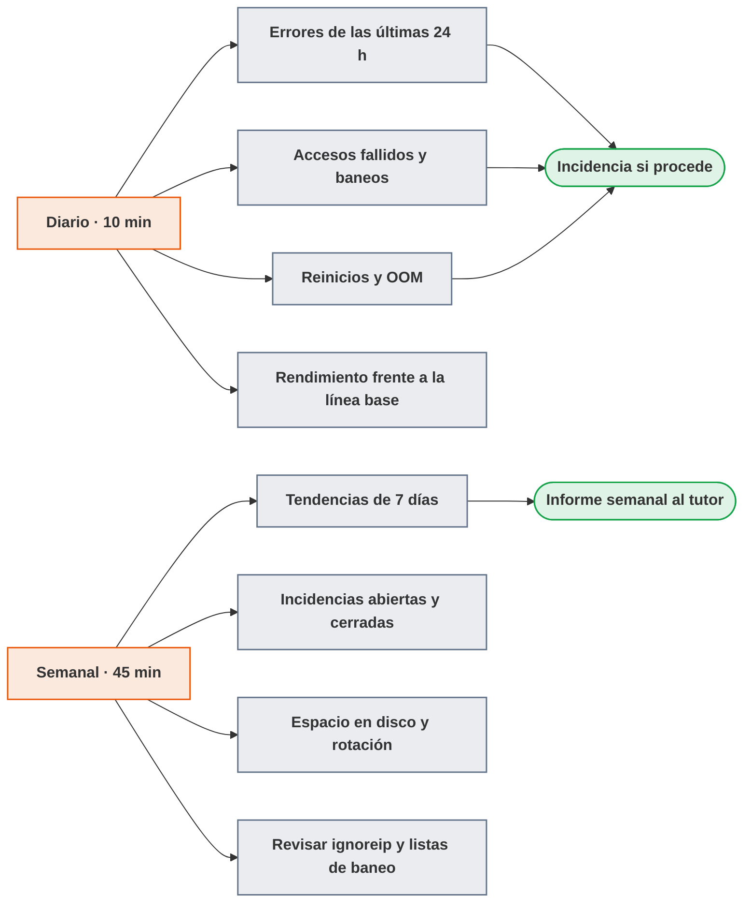
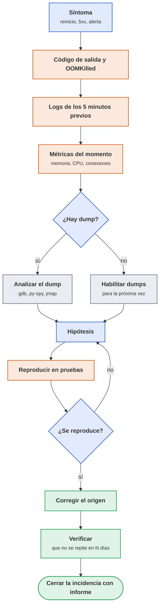
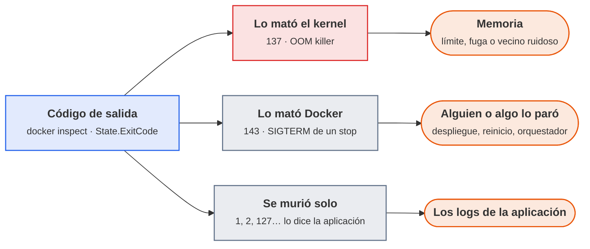

# UT5 · Explotación de logs, accesos y rendimiento

<p class="ut-meta">14 h · Formación en empresa (19 abr a 9 jun 2027) · RA3 CE a, b, c, d</p>

Hasta aquí todo el trabajo se ha hecho sobre el laboratorio: la pila de observabilidad de mon01 (UT1), las alarmas (UT2), la monitorización de seguridad (UT3) y los KPI y las pruebas de carga (UT4). Esta unidad y la siguiente (UT6, copias de seguridad) se cursan en la empresa, entre el 19 de abril y el 9 de junio de 2027, sobre un sistema real que asigne el tutor. No hay sesiones numeradas ni laboratorio compartido: hay cuatro actividades (A5.1 a A5.4), una actividad de cierre y una ficha de evidencias que firma el tutor de empresa. Este documento es la guía de referencia para hacer ese trabajo con criterio, y al mismo tiempo la lista de lo que hay que traer de vuelta. La UT7 (actualización y vulnerabilidades) y la UT8 (terminación segura) se dieron en el centro antes de salir, en febrero y marzo, así que lo que se ve aquí se apoya en ellas y no al revés.

Una regla desde el principio: todo dato de la empresa que aparezca en las evidencias se anonimiza. Nombres de host, IPs públicas, nombres de usuario, dominios, rutas con nombre de cliente. Se sustituyen por equivalentes (`web01`, `203.0.113.45`, `usuario_a`, `empresa.example`) antes de pegar nada en el informe. Las redes 192.0.2.0/24, 198.51.100.0/24 y 203.0.113.0/24 están reservadas por la RFC 5737 justo para esto, para documentación, y el dominio `example` por la RFC 2606. Ante la duda de si algo se puede incluir, se pregunta al tutor antes de incluirlo, no después.

## Introducción

Esta unidad no tiene sesiones: se hace en la empresa, sobre un sistema real, en cuatro bloques que siguen los criterios de evaluación. Cada bloque trae primero la teoría que hace falta y después la hoja de actividad que la aplica; conviene leer la Introducción entera antes del primer día con el tutor.

### Qué tienes que saber hacer al terminar

- Revisar los registros de un servicio de forma periódica y sistemática, saber qué buscar en ellos y reportar los fallos encontrados como una incidencia útil (CE 3a).
- Monitorizar los accesos a un sistema (SSH, proxy inverso, aplicación), reconocer patrones de fuerza bruta y password spraying, y configurar o revisar el mecanismo de bloqueo (fail2ban, CrowdSec o el que use la empresa) (CE 3b).
- Analizar un fallo o un reinicio a partir del código de salida, los volcados de memoria y los registros de error, llegar a una hipótesis, corregir el origen y verificar que no se repite (CE 3c).
- Tomar una línea base de rendimiento de CPU, memoria, disco y red, compararla con un periodo de carga y proponer una acción justificada (CE 3d).

### Los conceptos de la unidad

Un caso típico, y de los que se dan en el laboratorio: el jueves a las tres de la tarde la API de `app01` empieza a devolver algún 502. Nadie mira nada porque "funciona casi siempre". El lunes se descubre que el contenedor lleva cuatro días reiniciándose cada veinte minutos por falta de memoria, que una IP de fuera probó ochenta usuarios distintos por SSH y que el disco está al 94 % porque nadie configuró la rotación de logs. Nada era grave el jueves; el lunes son tres incidencias a la vez. El objetivo de la unidad cabe en una frase: dedicar diez minutos cada mañana a un sistema real, ver lo que va mal antes de que se note, y contarlo de forma que otra persona pueda actuar.

| Herramienta o concepto | Qué es, en una frase | Para qué se usa en esta unidad |
|---|---|---|
| journald y `journalctl` | El registro central de systemd con lo que escriben los servicios y el kernel, y el comando para leerlo | Buscar errores por prioridad y servicio, y vigilar el disco que ocupa |
| `docker logs` | El comando que muestra lo que un contenedor ha escrito por pantalla | Revisar los errores de las últimas 24 h contenedor por contenedor |
| Loki y LogQL | La base de datos de logs de UT1 y su lenguaje de consulta, parecido al de Prometheus | Guardar las búsquedas en un panel de Grafana y convertirlas en alertas |
| logrotate | Un programa que cada noche comprime y borra logs antiguos para que el disco no se llene | Comprobar que los logs de nginx y de la aplicación tienen retención |
| fail2ban | Un vigilante que lee los logs, cuenta los fallos de cada IP y la bloquea un rato en el firewall | Cortar la fuerza bruta contra SSH, nginx y la aplicación |
| CrowdSec | Lo mismo que fail2ban, con una lista de IPs maliciosas compartida entre quienes lo usan | Alternativa con varios hosts o cuando se bloquea en OPNsense |
| nftables | El firewall del kernel de Linux, el mismo de UT3 | Comprobar sobre el firewall que la IP bloqueada lo está de verdad |
| cgroups y OOM killer | El mecanismo del kernel que limita la memoria de un contenedor, y el proceso que mata al que se pasa | Entender por qué un contenedor muere con código 137 |
| Core dumps (gdb, py-spy, jmap) | Una copia de la memoria de un proceso al morir, y las herramientas que la leen según el lenguaje | Saber en qué función ha reventado un servicio en vez de adivinarlo |
| Prometheus, node_exporter, cAdvisor y `sar` | La pila de métricas de mon01 (recolector y agentes de host y contenedores), y el grabador a fichero que la sustituye si no hay servidor | Tomar la línea base de CPU, memoria, disco y red y compararla con un día de carga |
| Método USE | Tres preguntas por recurso (uso, saturación, errores) para no dejarse nada | Recorrer CPU, memoria, disco y red con el mismo guion |

Cómo está organizada la unidad: la Introducción reúne los conceptos y las reglas para trabajar en la empresa, que marcan qué se puede tocar y qué no. Después vienen cuatro bloques, uno por criterio de evaluación y en el orden de la rutina diaria; cada bloque trae primero la teoría necesaria y después su hoja de actividad. El bloque 1 monta la revisión diaria de logs y abre una incidencia; el 2 clasifica los accesos y comprueba un bloqueo real; el 3 analiza un reinicio hasta su corrección; el 4 toma una línea base de rendimiento y la compara con un periodo de carga, y para eso hay que empezar a grabar datos el primer día aunque el análisis sea lo último. Al final, la práctica evaluable recoge el procedimiento de cierre y la ficha que firma el tutor.

!!! otra "Lo que hace falta de la otra asignatura"
    Esta unidad coincide en el tiempo con la UT4 de 5166, Nube pública
    ([https://victor-educ.github.io/apuntes-5166/ut/ut4-nube-publica/](https://victor-educ.github.io/apuntes-5166/ut/ut4-nube-publica/)),
    que también se cursa en la empresa.
    Son las mismas semanas y, casi seguro, los mismos sistemas: la nube de la empresa donde se despliega en 5166 es
    donde aquí se revisan logs, accesos y rendimiento, de modo que conviene acordar con el tutor un único sistema para las dos
    asignaturas y reutilizar las evidencias que sirvan para ambas (una captura de Grafana anonimizada vale en las dos).
    De 5166 hacen falta además dos cosas anteriores: el cortafuegos de la UT3 y su apartado de nftables, para entender
    dónde mete fail2ban su tabla, y la pila de monitorización de la UT7 (del 17 de marzo al 7 de abril), que es la versión definitiva
    del mon01 sobre el que se construyen los paneles de línea base.

### Cómo trabajar en la empresa

Cada empresa tiene sus herramientas. Unas tendrán Loki y Grafana como en mon01, otras tendrán Elastic y Kibana, Graylog, Datadog, o simplemente ficheros en `/var/log` y un `grep`. Lo que se evalúa no es la herramienta, es el método: qué se busca, cómo se justifica y qué se hace con lo que se encuentra. Por eso cada apartado de esta unidad da primero el método y después los comandos para el caso más habitual (Linux con Docker, journald y nginx), con su equivalente en Loki cuando existe. Si en la empresa hay otra cosa, se adapta el comando y se anota en la evidencia cuál se ha usado.

Lo segundo que hay que tener claro es el alcance. El trabajo se hace sobre sistemas en producción o cerca de producción. Todo lo que sea lectura (leer logs, consultar métricas, listar IPs bloqueadas) queda cubierto por la autorización general del tutor. Todo lo que cambie algo (activar una jail, cambiar un límite de memoria, reiniciar un servicio) se acuerda antes con el tutor, se hace en el horario que él diga y se apunta. Una evidencia que diga "reinicié el contenedor para comprobar" sin que el tutor lo supiera es una evidencia que no vale, aunque el resultado sea correcto.



<p class="pie" markdown>La rutina diaria son diez minutos y cuatro miradas. Lo que la hace útil es hacerla siempre, no hacerla bien un día.</p>

Ese esquema es lo que al final de la estancia se entrega convertido en un procedimiento de dos páginas con los comandos reales del sistema. Conviene guardar desde el primer día lo que se ejecuta: un fichero de texto con fecha, comando y una línea de resultado ahorra la mitad del trabajo del cierre.

### Plan de trabajo

Las cuatro actividades se hacen sobre sistemas reales de la empresa, en el orden que el tutor considere, dentro del periodo del 19 de abril al 9 de junio de 2027. Cada una produce una evidencia concreta que se adjunta a la ficha. Todo se anonimiza.

| Bloque | CE | Qué se hace | Evidencia |
|---|---|---|---|
| [Bloque 1 · Revisión de logs](#bloque-1-revision-de-logs-ce-3a) | 3a | Cinco días de revisión diaria de los logs de un servicio y una incidencia redactada con la plantilla | `a5.1-logs.md` |
| [Bloque 2 · Accesos y fuerza bruta](#bloque-2-accesos-y-fuerza-bruta-ce-3b) | 3b | Clasificar 24 h de intentos de acceso, revisar el mecanismo de bloqueo y demostrar un baneo de extremo a extremo | `a5.2-accesos.md` |
| [Bloque 3 · Fallos y reinicios](#bloque-3-fallos-y-reinicios-ce-3c) | 3c | Analizar un reinicio o fallo real (o reproducido en pruebas) hasta la corrección y su verificación | `a5.3-fallos.md` |
| [Bloque 4 · Rendimiento](#bloque-4-rendimiento-ce-3d) | 3d | Línea base de una semana, comparación con un periodo de carga y propuesta de acción con su coste | `a5.4-rendimiento.md` |
| [Práctica evaluable](#practica-evaluable) | a, b, c, d | Procedimiento de cierre de dos páginas, ficha de evidencias firmada y entrega del conjunto | `rutina.md`, `ficha-evidencias.pdf` |

Dónde se guarda el trabajo mientras dura la estancia. El Gitea del laboratorio (`gitea.lab`) es una máquina del centro y desde la red de la empresa no se alcanza, así que el primer día se crea un repositorio local con `git init` en el equipo propio, con una carpeta `ut5/` dentro, y ahí van las evidencias según se producen; es lo mismo que se hizo con `alerting` en la UT2 cuando todavía no había servidor al que empujar. Al volver al centro se añade el remoto (`git remote add origin` y `git push -u`) y el conjunto se entrega por Aules, como el resto de prácticas evaluables. Regla que no admite excepción: nada entra en ese repositorio sin anonimizar antes, porque una vez en el historial de git borrarlo ya no es borrar un fichero.

## Bloque 1 · Revisión de logs (CE 3a)

<p class="ut-meta">En la empresa · con el tutor</p>

Este bloque termina con una rutina de revisión diaria de los logs de un servicio de la empresa y con el criterio para convertir un hallazgo en una incidencia que otra persona pueda atender. La hoja A5.1 se apoya en Qué buscar, Comandos para la revisión diaria y Cómo se redacta una incidencia útil; la retención es el paso 5 de la hoja y el script diario, la ampliación para quien acabe antes.

### Revisar los archivos de registro (CE 3a)

Los logs se leen de forma periódica y sistemática, no solo cuando algo falla. La diferencia entre un administrador que "mira los logs cuando pasa algo" y uno que los revisa cada mañana es que el segundo detecta el problema una semana antes, cuando todavía es una línea rara y no una caída. En UT1 se montó Loki para tener los logs centralizados; en la empresa el sitio donde están los logs lo indica el tutor, y puede ser cualquiera de estos: ficheros en `/var/log`, el journal de systemd (el registro central donde systemd guarda lo que escriben los servicios), `docker logs` o `docker compose logs`, o una plataforma central.

#### Qué buscar

- Niveles ERROR y FATAL, y excepciones no controladas: en Java o Python se reconocen por la traza de pila (varias líneas que empiezan por `at ...` o `File "..."`), en Go por `panic:` seguido de `goroutine`. Una excepción no controlada que se repite cada pocos minutos es un bug que alguien tiene que mirar aunque el servicio siga respondiendo.
- Salidas inesperadas: reinicios del servicio, `timeout`, `connection refused`, `connection reset by peer`, `out of memory`, `too many open files`, `no space left on device`, códigos HTTP 5xx en el proxy. Cada uno apunta a una capa distinta: `connection refused` es que no había nadie escuchando (el backend estaba caído o reiniciando), `timeout` es que había alguien pero no respondió a tiempo, `502` en nginx es el primero visto desde el proxy, `504` es el segundo.
- Cambios de volumen. El doble de líneas de lo habitual suele ser un bucle de reintentos o un escáner; el silencio total es peor, porque significa que el servicio no está escribiendo (colgado, disco lleno, o el agente de logs muerto). Loki lo mide con `count_over_time` y Prometheus con la métrica `promtail_sent_entries_total` o su equivalente en Alloy (Promtail y Alloy son los agentes que recogen los logs del host y los envían a Loki); sin nada de eso, `wc -l` sobre el fichero de hoy comparado con el de ayer.
- Avisos que anuncian un fallo futuro: `deprecated`, certificados que caducan (`certificate will expire`), `disk usage above 85%`, reconexiones a la base de datos, `slow query` en PostgreSQL si tiene activado `log_min_duration_statement`.

#### Comandos para la revisión diaria

Con Docker, la ventana de tiempo es el parámetro que más se olvida. `docker logs app` sin más vuelca todo lo que el contenedor ha escrito desde que existe, y en un contenedor con semanas de vida eso son cientos de miles de líneas.

```bash
# Errores de las últimas 24 h en un contenedor
docker logs --since 24h app 2>&1 | grep -E "ERROR|FATAL|Exception|panic:" | tail -50

# Cuántos por tipo (agrupa por la parte del mensaje tras el nivel)
docker logs --since 24h app 2>&1 | grep -oE "(ERROR|FATAL) [A-Za-z._]+" | sort | uniq -c | sort -rn | head

# Servicio de systemd: solo prioridad err o superior desde ayer
journalctl -u nginx --since yesterday -p err --no-pager

# Todo el host, prioridad crit o superior, con explicación de cada mensaje
journalctl -p crit -x --since "-24h"

# Ficheros clásicos: nginx, últimas 24 h de 5xx
awk -v d="$(date -d '-1 day' +%d/%b/%Y)" '$4 ~ d && $9 ~ /^5/' /var/log/nginx/access.log | wc -l
```

`journalctl -p` acepta el nombre o el número de prioridad syslog (0 emerg a 7 debug); `-p err` equivale a `-p 0..3`. Docker escribe stdout y stderr por separado y `docker logs` los devuelve en los dos descriptores, de ahí el `2>&1` antes del `grep`.

En Loki, las mismas búsquedas con LogQL, su lenguaje de consulta: el selector entre llaves elige el flujo de logs y lo que va detrás lo filtra o lo cuenta. La ventaja no es la sintaxis, es que la consulta se guarda en un panel de Grafana y no depende de recordar el comando.

```text
{job="docker", container="app"} |~ "ERROR|FATAL|Exception"

sum by (level) (count_over_time({job="docker", container="app"} | json | level =~ "error|fatal" [24h]))

# Volumen de líneas por hora, para ver el "doble de lo habitual" o el silencio
sum(count_over_time({job="docker", container="app"}[1h]))

# 5xx en nginx en la última hora
count_over_time({job="nginx"} | pattern `<ip> - - [<_>] "<method> <uri> <_>" <status> <_>` | status >= 500 [1h])
```

En Grafana 12 estas consultas van a un dashboard "Revisión diaria" con cuatro paneles (errores por nivel, volumen por hora, 5xx, accesos fallidos) y una variable `$container`. Es el panel que se abre cada mañana, y una captura suya con fecha vale como evidencia de la revisión. Conviene guardar además las consultas en la pestaña Explore con la estrella de favoritos (query library en Grafana 12), para que el siguiente que llegue las herede.

#### Un script diario que resuma errores

Cuando no hay plataforma central, o como complemento a ella, un script en cron (el planificador de tareas de Linux) que resuma los errores por tipo y lo envíe por correo o a un canal de chat es lo que mantiene la rutina viva los días en que nadie se acuerda de hacerla. Este es un ejemplo mínimo, pensado para llevarlo a la empresa y adaptarlo; lo importante es que agrupa, no que vuelque.

```bash
#!/usr/bin/env bash
# /usr/local/sbin/resumen-logs.sh : resumen diario de errores por contenedor
set -euo pipefail
DESDE="24h"
DEST="ops@empresa.example"
TMP=$(mktemp)
{
  echo "Resumen de errores $(hostname) $(date +%F) (últimas $DESDE)"
  echo
  for c in $(docker ps --format '{{.Names}}'); do
    n=$(docker logs --since "$DESDE" "$c" 2>&1 | grep -cE "ERROR|FATAL|panic:" || true)
    echo "== $c: $n líneas de error"
    if [ "$n" -gt 0 ]; then
      docker logs --since "$DESDE" "$c" 2>&1 \
        | grep -E "ERROR|FATAL|panic:" \
        | sed -E 's/^[0-9T:.-]+Z? //; s/[0-9a-f]{8,}/<id>/g; s/[0-9]{2,}/<n>/g' \
        | sort | uniq -c | sort -rn | head -10
    fi
    echo
  done
  echo "== Reinicios de contenedores en $DESDE"
  docker events --since "$DESDE" --until 0s --filter event=die --filter event=oom \
    --format '{{.Time}} {{.Actor.Attributes.name}} {{.Action}} exit={{.Actor.Attributes.exitCode}}' 2>/dev/null || true
  echo
  echo "== journal, prioridad err o superior"
  journalctl -p err --since "-$DESDE" --no-pager -q | tail -20
} > "$TMP"
mail -s "Resumen de errores $(hostname) $(date +%F)" "$DEST" < "$TMP"
rm -f "$TMP"
```

El `sed` del medio es el truco que hace útil el resumen: sustituye identificadores y números por marcadores para que "timeout en petición 48213" y "timeout en petición 48214" cuenten como el mismo error. Sin eso, el `uniq -c` no agrupa nada. Se programa en `/etc/cron.d/resumen-logs` a las 07:30 (`30 7 * * * root /usr/local/sbin/resumen-logs.sh`), o como timer de systemd si la empresa los prefiere. `docker events --until 0s` es la forma de que el comando termine en lugar de quedarse escuchando.

#### Retención: logrotate y journald

Un sistema en el que nadie ha pensado en la retención acaba con el disco lleno, y un disco lleno en un host de contenedores es una caída completa (Docker no puede escribir su estado, PostgreSQL deja de aceptar escrituras). Tres sitios a revisar la primera semana en la empresa.

Los logs de Docker con el driver `json-file` (el que hay por defecto) no rotan si nadie lo configura. Lo normal es fijarlo en `/etc/docker/daemon.json` para todos los contenedores:

```json
{
  "log-driver": "json-file",
  "log-opts": { "max-size": "50m", "max-file": "5" }
}
```

Eso limita cada contenedor a 250 MB de logs. Solo afecta a contenedores creados después del cambio; los que ya existen hay que recrearlos (`docker compose up -d --force-recreate`). Para ver cuánto ocupa ahora mismo: `du -sh /var/lib/docker/containers/*/*-json.log | sort -rh | head`. Alternativa: driver `journald`, que mete los logs del contenedor en el journal del host y hereda su retención; entonces se leen con `journalctl CONTAINER_NAME=app`.

journald tiene su propia retención en `/etc/systemd/journald.conf`: `SystemMaxUse=2G` limita el total en disco, `MaxRetentionSec=1month` la antigüedad, y `Storage=persistent` asegura que sobreviva al reinicio (con `auto`, si no existe `/var/log/journal` se queda en RAM y se pierde al reiniciar; en Debian 13 el directorio existe por defecto). Para ver y recortar:

```bash
journalctl --disk-usage
journalctl --vacuum-size=1G          # deja como mucho 1 GB
journalctl --vacuum-time=30d         # elimina lo anterior a 30 días
journalctl --verify                  # comprueba la integridad de los ficheros
```

`vacuum` solo borra ficheros de archivo, nunca el activo; si el uso no baja, primero `journalctl --rotate` y después el vacuum.

logrotate se encarga de los ficheros clásicos (`/var/log/nginx/*.log`, `/var/log/auth.log`, los de la aplicación si escribe a fichero). Cada servicio deja su configuración en `/etc/logrotate.d/`, y un ejemplo típico para una aplicación en `/srv/app/logs`:

```text
/srv/app/logs/*.log {
    daily
    rotate 14
    compress
    delaycompress
    missingok
    notifempty
    copytruncate
}
```

`copytruncate` copia el fichero y vacía el original en lugar de renombrarlo; es lo que hace falta cuando el proceso mantiene el descriptor abierto y no sabe recibir un `SIGHUP` (la mayoría de aplicaciones dentro de contenedores que escriben a un volumen). El precio es que las líneas escritas entre la copia y el truncado se pierden. Con `logrotate -d /etc/logrotate.d/app` se simula sin tocar nada, y `logrotate -f` fuerza una rotación para comprobar que funciona. Documentación: la página de manual de logrotate en [man7.org](https://man7.org/linux/man-pages/man8/logrotate.8.html) y la de [journald.conf](https://man7.org/linux/man-pages/man5/journald.conf.5.html).

#### Cómo se redacta una incidencia útil

Todo fallo encontrado se reporta. Reportar no es mandar un mensaje diciendo "he visto errores en app"; es abrir una incidencia con lo que alguien necesita para decidir si es urgente y por dónde empezar. Los ingredientes son siempre los mismos y conviene tener la plantilla a mano en la herramienta que use la empresa (Jira, GitLab issues, un Gitea como el del laboratorio, o un correo estructurado).

```text
Título: [servicio] resumen de una línea del síntoma
Fecha y hora de detección: 2027-05-04 08:10 (revisión diaria)
Servicio / host: api (contenedor app en app01)
Mensaje exacto (una línea, tal cual aparece):
  ERROR sqlalchemy.pool: QueuePool limit of size 5 overflow 10 reached, connection timed out
Frecuencia: 143 apariciones entre 02:00 y 02:40; ninguna fuera de esa ventana
Impacto observado: 37 respuestas 502 en nginx en el mismo intervalo; sin quejas de usuarios
Contexto: coincide con la copia de seguridad de la BD (02:00) según el cron de db01
Fragmento de log (10 líneas alrededor, anonimizado): adjunto
Hipótesis (opcional, marcada como tal): el pool se agota porque las consultas
  se ralentizan durante el pg_dump
Gravedad propuesta: media (recurrente, sin pérdida de servicio visible)
```

El mensaje exacto es lo más valioso: es lo que se busca en Google, en la documentación y en el histórico de incidencias. Se copia literal, sin parafrasear. La frecuencia y la ventana temporal son lo segundo, porque convierten "hay errores" en "hay errores a las dos de la mañana", que ya es media investigación hecha. La hipótesis va aparte y marcada, para que nadie la confunda con un hecho.

### A5.1 Revisión de logs (CE 3a)

<span class="et et-obj">Objetivo</span> Al terminar tienes un registro de cinco días laborables de revisión diaria de los logs de un servicio y una incidencia abierta con la plantilla de la unidad.

<span class="et et-pre">Antes de empezar</span>

- Autorización del tutor: qué servicio se revisa, dónde están sus logs (fichero, journal, `docker logs` o plataforma central) y con qué usuario se leen. Solo lectura; no hace falta más.
- Un fichero `a5.1-logs.md` en tu carpeta de trabajo, con la tabla del paso 1 vacía.
- Leídos [Qué buscar](#que-buscar), [Comandos para la revisión diaria](#comandos-para-la-revision-diaria) y [Cómo se redacta una incidencia útil](#como-se-redacta-una-incidencia-util).

<span class="et et-pas">Pasos</span>

1. El primer día, mira cinco líneas del log para conocer el formato (texto plano, JSON, nivel en mayúsculas o minúsculas) y adapta los comandos. Con contenedores:

    ```bash
    docker logs --since 24h --tail 5 app 2>&1
    docker logs --since 24h app 2>&1 | grep -iE "error|fatal|exception|panic:" | tail -50
    docker logs --since 24h app 2>&1 | grep -oiE "(error|fatal) [A-Za-z._]+" | sort | uniq -c | sort -rn | head
    ```

    Con un servicio de systemd o con ficheros:

    ```bash
    journalctl -u nginx --since yesterday -p err --no-pager
    awk -v d="$(date -d '-1 day' +%d/%b/%Y)" '$4 ~ d && $9 ~ /^5/' /var/log/nginx/access.log | wc -l
    ```

    En Loki, la consulta equivalente es `{job="docker", container="app"} |~ "ERROR|FATAL|Exception"` y el volumen por hora `sum(count_over_time({job="docker", container="app"}[1h]))`.

2. Cada día, a la misma hora, ejecuta la revisión y rellena una fila de la tabla. La columna de errores agrupa por tipo, no lista líneas sueltas:

    ```text
    | Fecha | Servicio | Intervalo revisado | Comando o consulta | Errores (tipo y recuento) | Incidencia |
    |---|---|---|---|---|---|
    | 2027-05-04 | api (app01) | últimas 24 h | docker logs --since 24h ... | QueuePool limit x143, timeout db x12 | INC-2027-041 |
    ```

3. Compara el volumen de hoy con el de ayer (`wc -l` sobre el fichero, o el panel de volumen por hora). Anota si se dobla o si hay silencio: los dos son hallazgos.

4. Elige uno de los hallazgos y ábrelo como incidencia con la plantilla del apartado teórico, en la herramienta de la empresa si el tutor lo autoriza, o en un fichero con ese formato si no procede abrirla ahí. Mensaje literal, frecuencia con ventana horaria, impacto observado y fragmento de diez líneas anonimizado; la hipótesis, aparte y marcada como tal.

5. Si el sistema no tiene retención configurada (`journalctl --disk-usage`, `du -sh /var/lib/docker/containers/*/*-json.log`), anótalo en el registro como hallazgo y propónselo al tutor; no cambies nada sin su visto bueno.

<span class="et et-com">Comprobación</span> La tabla tiene cinco filas con fecha, cada fila cita el comando exacto que se ejecutó, y la incidencia contiene un mensaje de log copiado literal con su recuento y su ventana temporal. Ningún host, IP pública ni usuario real aparece en el fichero.

<span class="et et-ent">Entrega</span> `a5.1-logs.md` en la carpeta `ut5/` del repositorio de la unidad, con el registro de los cinco días y la incidencia anonimizada. Pide al tutor que firme la fila A5.1 de la ficha.

<span class="et et-ext">Si te sobra tiempo</span> Adapta el script `resumen-logs.sh` del apartado teórico a los contenedores de la empresa y propón al tutor programarlo en cron; adjunta la salida de una ejecución manual como evidencia extra.

## Bloque 2 · Accesos y fuerza bruta (CE 3b)

<p class="ut-meta">En la empresa · con el tutor</p>

El objetivo es leer 24 h de accesos de un sistema, decir con argumentos si lo que hay es ruido de fondo, fuerza bruta o spraying, y comprobar sobre el firewall que el bloqueo funciona. Para A5.2 hacen falta la tabla de Dónde se registran, los patrones de Qué se busca y el apartado de la herramienta que use la empresa, fail2ban a fondo o CrowdSec como alternativa; la regla de Loki queda para el tiempo que sobre.

### Monitorizar los accesos (CE 3b)

Un sistema expuesto a Internet recibe intentos de acceso desde el minuto uno. Un servidor con SSH en el puerto 22 abierto ve entre cientos y varios miles de intentos fallidos al día sin que nadie lo esté atacando en particular; son botnets que prueban credenciales por defecto contra todo lo que responde. Monitorizar los accesos es distinguir ese ruido de fondo de un ataque dirigido, y asegurarse de que el mecanismo de bloqueo hace su trabajo.

#### Dónde se registran

| Origen | Dónde mirar | Qué contiene |
|---|---|---|
| SSH | `/var/log/auth.log` (Debian con rsyslog) o `journalctl -u ssh` | Intentos fallidos, logins correctos, usuario inválido, clave aceptada |
| sudo, su, PAM | mismo fichero o journal, `_COMM=sudo` | Quién escaló privilegios y qué ejecutó |
| Proxy inverso (nginx) | `/var/log/nginx/access.log` y `error.log` | Intentos a rutas de administración, 401/403, escáneres |
| Aplicación | su log (stdout del contenedor) | Login fallido, usuario bloqueado, cambio de contraseña, tokens rechazados |
| Panel del hipervisor | Proxmox: `/var/log/pve/tasks/`, `journalctl -u pvedaemon`, `-u pveproxy` | Accesos al panel web, acciones sobre VM |
| VPN (red privada virtual) | WireGuard no registra handshakes por defecto; OpenVPN en su log; OPNsense en Sistema > Registro | Conexiones, orígenes, fallos de autenticación |
| Firewall | OPNsense, `nft monitor`, `journalctl -k` con reglas `log` | Conexiones rechazadas, escaneos de puertos |

En Debian 13 sin rsyslog instalado (rsyslog es el servicio clásico que reparte los mensajes del sistema en ficheros de `/var/log`), `auth.log` no existe y todo está en el journal; `journalctl -u ssh --since today` es el equivalente. El filtro va por unidad de systemd y no por nombre de proceso a propósito: desde OpenSSH 9.8, que es la versión que trae Debian 13, el demonio que escucha (`sshd`) delega cada conexión en un proceso hijo, `sshd-session`, y es ese hijo el que escribe `Failed password`, `Invalid user` y `Accepted publickey`. Por eso `journalctl _COMM=sshd` devuelve poco más que los arranques del servicio y parece que nadie ha intentado entrar, mientras que `-u ssh` recoge los tres procesos (`sshd`, `sshd-session` y `sshd-auth`) porque todos cuelgan de la misma unidad, y funciona igual en Debian 12 y en Debian 13. Si la empresa centraliza en Loki con Alloy o Promtail, el job suele llamarse `auth` o `syslog` y ahí van todas las búsquedas de abajo con `|=`.

#### Qué se busca: patrones de fuerza bruta y password spraying

Fuerza bruta clásica: una misma IP prueba muchas contraseñas contra uno o pocos usuarios. En `auth.log` se ve así (anonimizado):

```text
May  4 03:12:41 web01 sshd[18422]: Failed password for root from 203.0.113.45 port 51204 ssh2
May  4 03:12:44 web01 sshd[18422]: Failed password for root from 203.0.113.45 port 51204 ssh2
May  4 03:12:47 web01 sshd[18422]: Failed password for root from 203.0.113.45 port 51204 ssh2
May  4 03:12:49 web01 sshd[18422]: Failed password for root from 203.0.113.45 port 51204 ssh2
May  4 03:12:50 web01 sshd[18422]: Failed password for root from 203.0.113.45 port 51204 ssh2
May  4 03:12:50 web01 sshd[18422]: Disconnecting authenticating user root 203.0.113.45 port 51204: Too many authentication failures [preauth]
May  4 03:12:53 web01 sshd[18431]: Invalid user admin from 203.0.113.45 port 51290
May  4 03:12:55 web01 sshd[18431]: Failed password for invalid user admin from 203.0.113.45 port 51290 ssh2
```

Password spraying: una IP (o varias coordinadas) prueba una o dos contraseñas contra muchos usuarios distintos. Está pensado justo para esquivar el `maxretry` por usuario y por IP: pocos intentos por cuenta, repartidos en el tiempo. Se reconoce por la variedad de usuarios, no por el volumen:

```text
May  4 04:01:10 web01 sshd[19002]: Invalid user oracle from 198.51.100.7 port 40122
May  4 04:03:52 web01 sshd[19017]: Invalid user postgres from 198.51.100.7 port 40310
May  4 04:06:31 web01 sshd[19033]: Invalid user jenkins from 198.51.100.7 port 40488
May  4 04:09:14 web01 sshd[19051]: Invalid user deploy from 198.51.100.7 port 40615
May  4 04:11:58 web01 sshd[19068]: Invalid user ubuntu from 198.51.100.7 port 40790
```

Un intento cada tres minutos no dispara un `findtime = 10m` con `maxretry = 5` (los dos parámetros con los que fail2ban decide cuándo bloquear, que se explican más abajo: cuántos fallos y en qué ventana de tiempo). Por eso la detección de spraying se hace contando usuarios distintos por IP en ventanas largas, no intentos.

```bash
# Fuerza bruta: intentos fallidos por IP, hoy
journalctl -u ssh --since today --no-pager \
  | grep -oE "Failed password for (invalid user )?\S+ from \S+" \
  | awk '{print $NF}' | sort | uniq -c | sort -rn | head

# Spraying: usuarios distintos por IP en las últimas 24 h
journalctl -u ssh --since -24h --no-pager \
  | grep -oE "Invalid user \S+ from \S+" \
  | awk '{print $5, $3}' | sort -u | awk '{print $1}' | uniq -c | sort -rn | head

# Logins correctos, para ver quién ha entrado y desde dónde (y cuándo)
journalctl -u ssh --since -7d --no-pager | grep "Accepted"

# nginx: IPs que más 401/403/404 generan (escáneres y rutas de administración)
awk '$9 ~ /^(401|403|404)$/ {print $1}' /var/log/nginx/access.log | sort | uniq -c | sort -rn | head
awk '$7 ~ /(wp-login|wp-admin|\.env|phpmyadmin|\/admin|\.git)/ {print $1, $7}' /var/log/nginx/access.log | sort | uniq -c | sort -rn | head
```

Otras dos señales que no son fuerza bruta pero se revisan en el mismo pase: accesos correctos fuera del horario habitual (un `Accepted publickey` a las 03:40 de una cuenta que siempre entra de 8 a 18) y orígenes geográficos raros. Para lo segundo, `geoiplookup` (paquete `geoip-bin`) o la base de datos GeoLite2 de MaxMind (gratuita con registro) dan el país de una IP; en Loki, Alloy tiene una etapa `geoip` que añade `geoip_country_code` como etiqueta, y con eso el panel de Grafana puede mostrar un mapa de orígenes. Un país nuevo en la lista de logins correctos es motivo de llamada, no de incidencia.

#### Detección en Loki y alerta

En Loki 3.x las reglas de alerta van en el ruler, el componente que evalúa consultas cada cierto tiempo igual que hace Prometheus con sus reglas (`ruler.yaml` o un fichero en el directorio de reglas), con la misma sintaxis que Prometheus, y disparan a Alertmanager como las de UT2.

```yaml
groups:
  - name: accesos
    rules:
      - alert: FuerzaBrutaSSH
        expr: |
          sum by (host) (count_over_time({job="auth"} |= "Failed password" [5m])) > 20
        for: 0m
        labels: { severity: warning }
        annotations:
          summary: "Más de 20 fallos SSH en 5 min en {{ $labels.host }}"
      - alert: PasswordSprayingSSH
        expr: |
          count by (host, ip) (
            sum by (host, ip, user) (
              count_over_time({job="auth"}
                | regexp `Invalid user (?P<user>\S+) from (?P<ip>\S+)` [1h])
          )) > 8
        for: 0m
        labels: { severity: warning }
        annotations:
          summary: "IP {{ $labels.ip }} ha probado más de 8 usuarios distintos en 1 h"
```

La segunda es la de spraying: extrae usuario e IP con `regexp`, agrupa por los tres, y cuenta cuántos usuarios distintos tiene cada IP. Un umbral de 8 usuarios distintos en una hora no lo alcanza nadie legítimo. Ojo con `count_over_time` sin agregación en logs con muchas etiquetas: devuelve una serie por stream y la alerta se dispara por cada una. La agregación `sum by` es la que la deja en una por host.

#### fail2ban a fondo

{ .logo-inline }

fail2ban lee ficheros de log (o el journal), aplica expresiones regulares (filtros) y, cuando una IP supera `maxretry` fallos dentro de `findtime`, ejecuta una acción de bloqueo durante `bantime`. Cada combinación de filtro más acción es una jail. La configuración de fábrica está en `/etc/fail2ban/jail.conf` y no se toca; la configuración propia va en `/etc/fail2ban/jail.local` o en ficheros bajo `/etc/fail2ban/jail.d/`, que se cargan encima. El `jail.local` de abajo es uno completo para un host con SSH y nginx; las tres líneas que más problemas evitan o causan son `ignoreip`, `backend` y `bantime.increment`, y son las que hay que entender antes de copiarlo.

```ini
# /etc/fail2ban/jail.local
[DEFAULT]
# Redes que nunca se bloquean: loopback, oficina, monitorización, bastión
ignoreip = 127.0.0.1/8 ::1 10.10.0.0/24 203.0.113.0/28
bantime  = 1h
findtime = 10m
maxretry = 5
# Bantime incremental: cada reincidencia dobla el tiempo, hasta 4 semanas
bantime.increment = true
bantime.factor    = 2
bantime.maxtime   = 4w
# Debian 13: sin rsyslog, el backend systemd lee el journal
backend = systemd
banaction = nftables-multiport
banaction_allports = nftables-allports

[sshd]
enabled = true
mode    = aggressive
# Debian 13: el journalmatch de fábrica solo casa _COMM=sshd y no ve a sshd-session
journalmatch = _SYSTEMD_UNIT=ssh.service

[nginx-http-auth]
enabled  = true
logpath  = /var/log/nginx/error.log

[nginx-botsearch]
enabled  = true
logpath  = /var/log/nginx/access.log
maxretry = 2

[recidive]
enabled  = true
bantime  = 1w
findtime = 1d
maxretry = 3
```

Puntos a entender de esa configuración. `ignoreip` es obligatorio pensarlo antes de activar nada: un bloqueo sobre la propia IP de administración o sobre la sonda de monitorización es un problema autoinfligido que en una empresa se nota. Ahí van la red de gestión, la IP pública de la oficina y la del bastión desde el que se administra. `bantime.increment` es la forma moderna de castigar reincidentes: una IP que vuelve tras el primer baneo de 1 h recibe 2 h, luego 4 h, y así hasta `bantime.maxtime`; fail2ban guarda el historial en su base de datos SQLite (`/var/lib/fail2ban/fail2ban.sqlite3`), así que sobrevive a reinicios. La jail `recidive` es el mecanismo antiguo para lo mismo (lee el propio log de fail2ban y banea en todos los puertos a quien ha sido baneado tres veces en un día); se pueden usar las dos. El modo `aggressive` del filtro sshd incluye también los intentos que se quedan en preauth y los de usuario inválido. La línea `journalmatch` es la que evita el fallo más silencioso de todos en Debian 13: el filtro de fábrica busca los mensajes del proceso `sshd` y en esa versión los escribe `sshd-session`, así que la jail arranca, se queda a cero fallos y no banea nunca. Filtrando por unidad, `_SYSTEMD_UNIT=ssh.service`, entran los mensajes de los tres procesos y la configuración vale también en Debian 12.

Un filtro propio para la aplicación. Si la API del curso escribe `WARN auth: login failed for user=opstor ip=203.0.113.45` cuando alguien falla la contraseña, el filtro es una regex con el marcador `<HOST>` (o `<ADDR>` en versiones recientes) en el sitio de la IP:

```ini
# /etc/fail2ban/filter.d/app-login.conf
[Definition]
failregex = ^.*auth: login failed for user=\S+ ip=<HOST>\s*$
ignoreregex =
```

```ini
# /etc/fail2ban/jail.d/app-login.conf
[app-login]
enabled  = true
filter   = app-login
logpath  = /srv/app/logs/app.log
port     = http,https
maxretry = 8
findtime = 15m
bantime  = 2h
```

Aquí hay un detalle de contenedores: fail2ban corre en el host y necesita leer el log de la aplicación. Si la aplicación escribe a stdout, el fichero está en `/var/lib/docker/containers/<id>/<id>-json.log` (cada línea envuelta en JSON, la regex tiene que contemplarlo) y cambia de nombre al recrear el contenedor; es más limpio que la aplicación escriba a un volumen montado, o usar `backend = systemd` con el driver de logs `journald` y `journalmatch = CONTAINER_NAME=app` en la jail. Y la IP que ve la aplicación detrás de nginx es la del proxy, no la del cliente, salvo que nginx pase `X-Forwarded-For` o `X-Real-IP` (cabeceras HTTP en las que el proxy pone la IP original del cliente) y la aplicación lo registre. Sin eso, el filtro banearía a nginx.

Para probar un filtro antes de activarlo se usa `fail2ban-regex`, que dice cuántas líneas casan y cuáles no:

```bash
fail2ban-regex /srv/app/logs/app.log /etc/fail2ban/filter.d/app-login.conf --print-all-missed | tail -20
fail2ban-regex "$(journalctl -u ssh --since -1h -o short-iso | tail -200)" sshd
```

Operación con `fail2ban-client`:

```bash
fail2ban-client status                       # jails activas
fail2ban-client status sshd                  # fallos, baneos actuales e IPs
fail2ban-client set sshd unbanip 203.0.113.45
fail2ban-client set sshd banip 198.51.100.7  # baneo manual
fail2ban-client get sshd bantime
fail2ban-client reload                       # recarga sin perder baneos
fail2ban-client banned                       # todas las IPs baneadas por jail
```

El bloqueo lo aplica la acción. Con `banaction = nftables-multiport`, fail2ban crea una tabla `inet f2b-table` (el nombre exacto depende de la versión) con un set por jail y una regla que descarta el tráfico de las IPs del set en los puertos de la jail. Se comprueba directamente con nftables (el firewall del kernel, el mismo de UT3), que es donde de verdad se ve si el bloqueo existe:

```bash
nft list table inet f2b-table
nft list set inet f2b-table addr-set-sshd
```

Si en el host ya hay un firewall nftables propio (como el de 5166 UT3, [https://victor-educ.github.io/apuntes-5166/ut/ut3-seguridad-por-capas/](https://victor-educ.github.io/apuntes-5166/ut/ut3-seguridad-por-capas/)), fail2ban añade su tabla aparte y las dos conviven; el orden de evaluación entre tablas depende de la prioridad de las cadenas, y la de fail2ban usa `priority -1` para ir antes que `filter` (0). Con Docker de por medio, el tráfico a puertos publicados por contenedores pasa por la cadena `DOCKER-USER` de iptables antes que por `INPUT`; fail2ban tiene la acción `iptables-multiport` con `chain = DOCKER-USER` para ese caso, o se banea en `forward` con una acción nftables personalizada. Es uno de los motivos por los que en el laboratorio del curso el bloqueo se hace en el proxy o en OPNsense y no en app01.

Comprobar un bloqueo de verdad, que es lo que pide la actividad A5.2: desde una máquina que no esté en `ignoreip` (una VM de pruebas, el móvil con datos), fallar la contraseña SSH seis veces, ver la IP en `fail2ban-client status sshd`, ver la regla en nftables, comprobar que la conexión ahora da `Connection refused` o se queda en timeout, y desbanear. Capturas de esos cuatro pasos son la evidencia. Documentación oficial: [https://github.com/fail2ban/fail2ban/wiki](https://github.com/fail2ban/fail2ban/wiki) y las páginas de manual `jail.conf(5)`.

#### CrowdSec como alternativa

CrowdSec hace lo mismo que fail2ban con dos diferencias de diseño. La primera es que separa la detección (el agente, que lee logs con "parsers" y "scenarios" en YAML descargados desde su hub) del bloqueo (los "bouncers": un componente para nftables, otro para nginx, otro para OPNsense, otro para Traefik, que consultan la API local del agente y aplican las decisiones). Así el agente puede estar en un host y el bouncer en el firewall. La segunda es que es colaborativo: cada instalación que reporta ataques a la red de CrowdSec recibe a cambio una lista de IPs maliciosas vistas por la comunidad, de modo que un atacante queda bloqueado antes de llegar al sistema propio. Esa lista es opcional y en algunas empresas no gusta enviar datos fuera; se puede desactivar (`crowdsec` en modo sin API central) y sigue funcionando como fail2ban.

```bash
cscli metrics                  # qué logs lee y qué escenarios disparan
cscli decisions list           # IPs bloqueadas, motivo, duración
cscli decisions add --ip 203.0.113.45 --duration 4h --reason "prueba manual"
cscli decisions delete --ip 203.0.113.45
cscli alerts list              # histórico de detecciones
cscli hub list                 # colecciones instaladas (nginx, sshd, linux)
cscli bouncers list            # bouncers registrados y cuándo consultaron
```

La elección va por tamaño. Con uno o dos hosts, fail2ban basta: es más sencillo de operar y permite escribir filtros propios con expresiones regulares a medida. Con varios hosts, o cuando interesa bloquear en un solo punto, CrowdSec, porque separa el agente del bouncer y OPNsense tiene plugin oficial; la lista comunitaria es un argumento añadido a su favor donde se acepte enviar datos fuera. En la empresa, lo que haya. Documentación: [https://docs.crowdsec.net/](https://docs.crowdsec.net/).

### A5.2 Accesos y fuerza bruta (CE 3b)

<span class="et et-obj">Objetivo</span> Clasificar los intentos de acceso de al menos 24 h de log de un sistema, revisar o configurar el mecanismo de bloqueo y demostrar un bloqueo real de extremo a extremo.

<span class="et et-pre">Antes de empezar</span>

- Autorización del tutor en dos niveles: lectura de los logs de acceso (general) y, aparte, permiso explícito para la prueba de bloqueo del paso 5, con la IP de pruebas acordada, el día y la hora. Si no autoriza la prueba, se documenta y la actividad termina en el paso 4.
- Saber qué mecanismo usa la empresa (fail2ban, CrowdSec, bloqueo en OPNsense u otro) y dónde está su configuración.
- Leídos [Qué se busca: patrones de fuerza bruta y password spraying](#que-se-busca-patrones-de-fuerza-bruta-y-password-spraying) y [fail2ban a fondo](#fail2ban-a-fondo) o [CrowdSec como alternativa](#crowdsec-como-alternativa), según el caso.

<span class="et et-pas">Pasos</span>

1. Localiza el log de accesos del sistema elegido (SSH, proxy inverso o aplicación) según la tabla del apartado teórico. En Debian sin rsyslog, `journalctl -u ssh --since -24h`.

2. Cuenta los intentos fallidos por IP y los usuarios distintos por IP:

    ```bash
    # Fuerza bruta: intentos fallidos por IP
    journalctl -u ssh --since -24h --no-pager \
      | grep -oE "Failed password for (invalid user )?\S+ from \S+" \
      | awk '{print $NF}' | sort | uniq -c | sort -rn | head

    # Spraying: usuarios distintos por IP
    journalctl -u ssh --since -24h --no-pager \
      | grep -oE "Invalid user \S+ from \S+" \
      | awk '{print $5, $3}' | sort -u | awk '{print $1}' | uniq -c | sort -rn | head

    # Logins correctos de la semana, con hora y origen
    journalctl -u ssh --since -7d --no-pager | grep "Accepted"

    # nginx: escáneres y rutas de administración
    awk '$9 ~ /^(401|403|404)$/ {print $1}' /var/log/nginx/access.log | sort | uniq -c | sort -rn | head
    ```

3. Clasifica lo que ves en una de cuatro categorías y explica por qué: ruido de fondo (muchas IPs, pocos intentos cada una), fuerza bruta (una IP, muchos intentos contra pocos usuarios), spraying (una IP, muchos usuarios, ritmo lento) o nada. Guarda un extracto de diez a veinte líneas, anonimizado, que muestre el patrón.

4. Revisa la configuración del bloqueo y anota los valores que importan. Con fail2ban:

    ```bash
    fail2ban-client status                 # jails activas
    fail2ban-client status sshd            # fallos, baneos e IPs
    fail2ban-client get sshd bantime
    fail2ban-client get sshd logpath       # que el backend lea el log que existe
    grep -E "ignoreip|bantime|findtime|maxretry|backend" /etc/fail2ban/jail.local
    ```

    Con CrowdSec: `cscli metrics`, `cscli decisions list`, `cscli bouncers list`. Comprueba que `ignoreip` (o la lista blanca equivalente) incluye la red de gestión, la oficina y la sonda de monitorización. Si hay una aplicación propia con log de logins fallidos y no tiene filtro, propón uno y pruébalo sin activarlo: `fail2ban-regex /ruta/app.log /etc/fail2ban/filter.d/app-login.conf --print-all-missed | tail -20`.

5. Prueba de bloqueo, en el momento acordado con el tutor y desde una IP que no esté en `ignoreip`:

    ```bash
    # Desde la máquina de pruebas: fallar la contraseña seis veces
    ssh usuario_inexistente@servidor   # repetir hasta superar maxretry
    # En el servidor
    fail2ban-client status sshd        # la IP aparece en "Banned IP list"
    nft list table inet f2b-table      # el nombre del set cambia con la versión; míralo aquí
    nft list set inet f2b-table addr-set-sshd
    # Desde la máquina de pruebas: la conexión da "Connection refused" o timeout
    # En el servidor, al terminar
    fail2ban-client set sshd unbanip 203.0.113.45
    ```

    Con CrowdSec, `cscli decisions list` y `cscli decisions delete --ip ...` en lugar de los dos comandos de fail2ban. Captura de cada uno de los cuatro pasos: IP baneada, regla en el firewall, conexión rechazada y desbaneo.

<span class="et et-com">Comprobación</span> El extracto de log tiene el patrón marcado y una explicación de por qué es esa categoría; la configuración muestra jails activas, `ignoreip`, tiempos y backend; las capturas del bloqueo demuestran que la IP dejó de poder conectar y que al final quedó desbaneada.

<span class="et et-ent">Entrega</span> `a5.2-accesos.md` en `ut5/` del repositorio, con el extracto clasificado, la configuración anonimizada y la prueba del bloqueo (salida de `fail2ban-client status`, `cscli decisions list` o equivalente, y la regla del firewall). Firma del tutor en la fila A5.2.

<span class="et et-ext">Si te sobra tiempo</span> Si la empresa tiene Loki, escribe la regla `PasswordSprayingSSH` del apartado [Detección en Loki y alerta](#deteccion-en-loki-y-alerta) adaptada a su job y comprueba en Explore que la consulta devuelve algo con el log real.

## Bloque 3 · Fallos y reinicios (CE 3c)

<p class="ut-meta">En la empresa · con el tutor</p>

Aquí se explica un reinicio hasta su causa y su corrección, en un informe de una página. A5.3 se apoya en Códigos de salida, OOM: el kernel y los cgroups, Core dumps en contenedores y El método y la plantilla de informe; Registros de error de la aplicación es la referencia del paso 4 según el runtime que tenga el servicio.

### Fallos y reinicios: crashdumps y registros de error (CE 3c)

Un contenedor que se reinicia solo y vuelve a funcionar es el fallo más fácil de ignorar y el que más caro sale ignorar. Con `restart: unless-stopped` en el Compose, el servicio está caído unos segundos, el proxy devuelve unos 502, y nadie se entera hasta que el reinicio pasa a ser cada diez minutos. El análisis siempre sigue el mismo camino.



<p class="pie" markdown>El bucle hipótesis → reproducir → hipótesis es el trabajo real. Sin reproducir, corregir es adivinar.</p>

#### Códigos de salida

Lo primero que se mira, porque acota el problema a una de tres familias: lo mató el kernel, lo mató Docker, o se murió solo.



<p class="pie" markdown>El código acota antes de leer nada: cada familia lleva a un sitio distinto donde mirar, y ahorra media hora de logs.</p>


| Código | Qué significa | Causa habitual |
|---|---|---|
| 0 | Salida normal | El proceso principal terminó (un script que acaba, un `CMD` mal pensado) |
| 1 | Error genérico de la aplicación | Excepción no controlada, fichero de configuración que falta, variable de entorno vacía |
| 2 | Uso incorrecto | Argumentos erróneos al binario, típico en shell |
| 125 | Fallo del propio `docker run` | Opción inválida, imagen inexistente |
| 126 | El comando no es ejecutable | Permisos del entrypoint, falta el bit `x` |
| 127 | Comando no encontrado | Ruta errónea en `CMD`, binario que no está en la imagen |
| 134 | 128 + 6 (SIGABRT) | `abort()`: aserción fallida, error de memoria detectado por la propia biblioteca (glibc) |
| 137 | 128 + 9 (SIGKILL) | OOM killer (comprobar `OOMKilled`), o `docker stop` que agotó el periodo de gracia, o alguien con `kill -9` |
| 139 | 128 + 11 (SIGSEGV) | Fallo de segmentación: bug en código nativo, biblioteca incompatible, corrupción de memoria |
| 143 | 128 + 15 (SIGTERM) | Parada ordenada: `docker stop`, `compose down`, reinicio del host; el proceso capturó la señal y salió |
| 255 | Fuera de rango | Muchos programas lo usan como "error no especificado"; SSH lo devuelve al fallar la conexión |

La regla es: código mayor de 128 es señal (código menos 128 da el número de señal, `kill -l N` da el nombre). `137` sin `OOMKilled=true` es que a alguien se le acabó la paciencia con un `docker stop` (10 s de gracia por defecto, `stop_grace_period` en Compose) o que lo mató un `kill -9`; 137 con `OOMKilled=true` es memoria. Con `143` el proceso salió bien pero alguien le pidió salir, y lo que hay que averiguar es quién: un `docker events` o el journal de dockerd lo dicen.

```bash
docker inspect app --format '{{.RestartCount}} {{.State.ExitCode}} {{.State.OOMKilled}} {{.State.FinishedAt}} {{.State.Error}}'
docker events --since 24h --until 0s --filter container=app --filter event=die --filter event=oom --filter event=restart
docker compose ps -a         # muestra "Exited (137) 2 hours ago"
```

`RestartCount` se pone a cero cuando el contenedor se recrea, así que un `0` no es garantía de nada si alguien hizo `compose up` esta mañana. Las políticas de reinicio de Docker: `no`, `on-failure[:N]` (solo si sale con código distinto de 0, como mucho N veces), `always` y `unless-stopped` (como `always`, pero si se paró a mano no arranca con el demonio). En producción lo normal es `unless-stopped`; `on-failure:5` tiene sentido en trabajos por lotes que no deben reintentar sin fin. Docker aplica un retardo creciente entre reinicios (100 ms, 200 ms, 400 ms...) que se reinicia si el contenedor aguanta 10 s; un contenedor en bucle de arranque se reconoce por `RestartCount` alto y `docker ps` mostrando "Restarting (1) 3 seconds ago".

#### OOM: el kernel y los cgroups

Cuando un contenedor tiene `mem_limit` (Compose) o `--memory`, Docker lo traduce a `memory.max` en el cgroup v2 del contenedor (los cgroups son el mecanismo del kernel con el que Docker acota la CPU y la memoria de cada contenedor). Si el uso llega al límite, el kernel invoca al OOM killer dentro de ese cgroup y mata el proceso que más memoria consume (lo normal, el principal), y el contenedor sale con 137. Si no hay límite, el contenedor puede consumir toda la RAM del host y el OOM killer global mata lo que le parezca, que puede ser otro contenedor o PostgreSQL. Por eso todo contenedor en producción lleva límite: mejor que muera él solo que el host entero.

```bash
# Mensajes del OOM killer, con marca de tiempo legible
dmesg -T | grep -iE "oom|killed process" | tail
journalctl -k --since -24h | grep -iE "oom-kill|out of memory"
# Ejemplo de lo que aparece:
#   Memory cgroup out of memory: Killed process 21877 (python3) total-vm:1893204kB, anon-rss:1044120kB ...
#   oom-kill:constraint=CONSTRAINT_MEMCG,...,task=python3,pid=21877,uid=1000

# Límite y uso del cgroup del contenedor (cgroup v2, Debian 13 y Docker 28)
CG=$(docker inspect app --format '{{.Id}}')
cat /sys/fs/cgroup/system.slice/docker-$CG.scope/memory.max
cat /sys/fs/cgroup/system.slice/docker-$CG.scope/memory.current
cat /sys/fs/cgroup/system.slice/docker-$CG.scope/memory.events    # oom_kill N
cat /sys/fs/cgroup/system.slice/docker-$CG.scope/memory.stat | head -20

docker stats --no-stream app
```

`memory.events` guarda un contador `oom_kill` que no se pierde entre reinicios del proceso (sí del contenedor), y es la forma más limpia de saber si hubo OOM aunque el mensaje del kernel ya no esté. `anon-rss` en el mensaje del kernel es la memoria realmente usada por el proceso; `total-vm` es la reservada y no dice mucho. En Prometheus, `container_memory_working_set_bytes` de cAdvisor (el exporter que publica las métricas de cada contenedor) es lo que compara Docker contra el límite (excluye la caché de ficheros reclamable), y `container_oom_events_total` cuenta los OOM; un panel con el working set y el límite `container_spec_memory_limit_bytes` superpuestos muestra la fuga como una rampa que sube hasta tocar la línea y cae en vertical.

Una fuga de memoria y un pico de carga se ven distinto en ese panel: la fuga es una rampa constante, día tras día, hasta el OOM; el pico es un escalón que coincide con un evento (la copia de seguridad, un informe pesado, un ataque). La corrección es diferente: la fuga se arregla en el código (o se mitiga con reinicios programados mientras se arregla), el pico con más límite o con menos carga.

#### Core dumps en contenedores

Un core dump es la imagen de la memoria del proceso en el momento de morir por señal (SIGSEGV, SIGABRT). Por defecto en un host Linux con systemd los captura `systemd-coredump` y se listan con `coredumpctl`. En un contenedor hay dos obstáculos: `core_pattern` (el parámetro del kernel que dice dónde y cómo se escribe el dump) es del kernel y por tanto del host, no del contenedor (un `|/usr/lib/systemd/systemd-coredump ...` del host se ejecuta en el espacio de nombres del host y a veces no puede leer el binario del contenedor), y el `ulimit -c` del contenedor suele ser 0.

```bash
# En el host
cat /proc/sys/kernel/core_pattern
# Si empieza por | es systemd-coredump; si es una ruta, escribe fichero
coredumpctl list
coredumpctl info 21877
coredumpctl debug 21877          # abre gdb sobre el dump

# Alternativa para contenedores: patrón de fichero en un directorio compartido
echo '/var/crash/core.%e.%p.%t' > /proc/sys/kernel/core_pattern
sysctl -w fs.suid_dumpable=2
```

```yaml
# docker-compose.yml: permitir dumps y montar el directorio
services:
  app:
    ulimits:
      core: -1
    volumes:
      - /var/crash:/var/crash
```

El directorio `/var/crash` tiene que existir dentro del contenedor en la misma ruta que indica `core_pattern`, porque el kernel escribe la ruta interpretada desde el espacio de nombres de montaje del proceso que murió. Y hay que vigilar el tamaño: un dump de una JVM con 4 GB de heap ocupa 4 GB.

Dos cosas más antes de habilitar esto en un sistema que no sea el propio. `core_pattern` y `fs.suid_dumpable` son parámetros del kernel del host: el cambio afecta a todos los contenedores y a los procesos del propio host, no solo al servicio que se está investigando. Y un volcado es una copia literal de la memoria del proceso, con lo que hubiera dentro en claro: contraseñas, tokens de sesión y datos personales. Por eso el volcado se trata como un dato a proteger (directorio con permisos restrictivos, retención corta, borrado en cuanto deja de hacer falta) y, fuera de un laboratorio propio, habilitar los volcados es un cambio que se autoriza, se anota y se revierte, no una configuración que se deja puesta por si acaso.

Análisis según el runtime, con una herramienta por lenguaje: gdb es el depurador clásico de binarios nativos (C, C++, Go, Rust) y es el que lee el dump; py-spy inspecciona un proceso Python vivo sin pararlo; jcmd, jmap y jstack son las utilidades de la JVM para volcar memoria e hilos. Conviene fijarse en dos detalles del bloque: gdb se ejecuta dentro de la misma imagen que murió, y Java no necesita el dump del kernel porque genera el suyo.

```bash
# C/C++/Go/Rust: gdb básico sobre el dump, con el mismo binario y bibliotecas
docker run --rm -it -v /var/crash:/var/crash --entrypoint bash app-imagen:1.4.2
gdb /usr/local/bin/servidor /var/crash/core.servidor.17.1746340361
(gdb) bt            # traza de pila del hilo que falló
(gdb) info threads  # todos los hilos
(gdb) thread apply all bt   # traza de todos
(gdb) frame 3       # saltar a un marco concreto
(gdb) info locals   # variables locales de ese marco

# Python: py-spy no necesita dump, inspecciona el proceso vivo (colgado, no muerto)
pip install py-spy
py-spy dump --pid $(docker inspect app --format '{{.State.Pid}}')
py-spy top --pid <pid>          # qué funciones consumen CPU ahora mismo
# Un proceso Python que ha muerto por segfault viene de una extensión en C: gdb + python-gdb.py

# Java: heap dump para fugas, thread dump para cuelgues
docker exec app jcmd 1 GC.heap_info
docker exec app jmap -dump:live,format=b,file=/var/crash/heap.hprof 1
docker exec app jstack 1 > /var/crash/threads.txt
# O que la JVM lo haga sola al morir por OOM:
# JAVA_TOOL_OPTIONS="-XX:+HeapDumpOnOutOfMemoryError -XX:HeapDumpPath=/var/crash"
```

Para gdb el detalle importante es que el binario y las bibliotecas tienen que ser exactamente los del contenedor que murió; por eso se abre gdb dentro de la misma imagen (y versión). Sin símbolos de depuración la traza da direcciones y nombres de función, que suele bastar para saber en qué biblioteca ha reventado. Los `.hprof` de Java se analizan con Eclipse MAT o VisualVM en un equipo de trabajo, no en el servidor. El PID `1` en los `docker exec` es el proceso principal del contenedor; si la aplicación arranca a través de un script, el PID real se busca con `docker top app`.

#### Registros de error de la aplicación

Aparte de stdout, muchos runtimes dejan su propio informe de fallo: la JVM escribe `hs_err_pid<N>.log` en el directorio de trabajo cuando muere por un error fatal (con la traza, los hilos y el estado de memoria; es lo primero que se busca en un 134 de Java); Node deja la traza en stderr y con `--report-on-fatalerror` genera un JSON de diagnóstico; PostgreSQL escribe en `/var/log/postgresql/postgresql-17-main.log` (o stdout en el contenedor oficial) y ahí está el `FATAL: too many connections` o el `server process was terminated by signal 9` que explica un 137 del contenedor de la aplicación media hora después. Para un front en el navegador, los errores están en el cliente y no en el servidor: sin un servicio tipo Sentry o GlitchTip (plataformas que reciben los errores del navegador y del servidor y los agrupan) que los recoja, solo se ven en la consola del usuario, y la evidencia es la captura que este envíe.

#### El método y la plantilla de informe

Lo que reúne el diagrama de arriba, con el orden que importa: primero se recopila, después se piensa. Reunir el dump o el log de error, las líneas de log de los cinco minutos previos al fallo (`docker logs --until "2027-05-04T02:41:00" --since "2027-05-04T02:36:00" app`), y las métricas de ese instante (memoria, CPU, conexiones, latencia; en Grafana, el intervalo de tiempo fijado a esos diez minutos y una captura). Con eso se formula una hipótesis, se intenta reproducir en un entorno previo de la empresa (nunca en producción), se corrige el origen y no el síntoma (subir el límite de memoria para una fuga es un parche, arreglar la fuga es la corrección; poner `restart: always` a algo que muere cada hora no es corregir nada), y se verifica durante días que el reinicio no se repite. Todo va a la incidencia.

El informe de A5.3 es una página y sigue esta estructura:

```text
1. Síntoma y detección: qué se vio, cuándo, cómo se detectó (alerta, revisión, aviso)
2. Datos del fallo: contenedor, imagen y versión, código de salida, OOMKilled,
   RestartCount, mensaje del kernel o del runtime (literal)
3. Contexto: log de los 5 min previos (extracto anonimizado), métricas del momento
   (captura o tabla: memoria usada/límite, CPU, conexiones, latencia p95)
4. Análisis del dump o del registro de error: traza, hilo, función, o "no había dump,
   se ha habilitado para la próxima"
5. Hipótesis (una principal, alternativas descartadas y por qué)
6. Reproducción: dónde, cómo, resultado
7. Corrección aplicada: qué se cambió (fichero, valor antes y después), quién lo aprobó
8. Verificación: métrica o comando que demuestra que no se repite, y durante cuánto tiempo
9. Acciones pendientes: lo que queda para el equipo de desarrollo o para más adelante
```

### A5.3 Fallos y reinicios (CE 3c)

<span class="et et-obj">Objetivo</span> Un informe de una página, con los nueve puntos de la unidad, sobre un reinicio o fallo real (o reproducido en pruebas) que llegue hasta la corrección y su verificación.

<span class="et et-pre">Antes de empezar</span>

- Autorización del tutor en dos niveles. El primero, de lectura: `docker inspect`, `docker events`, el journal del kernel y los directorios de dumps que ya existan. El segundo, aparte y explícito, para cualquier cambio en la máquina de la empresa: instalar una herramienta de diagnóstico que no esté (gdb, py-spy), habilitar volcados de memoria (paso 4) o aplicar la corrección. Si no ha habido ningún fallo en el periodo, acuerda con él un entorno de pruebas (nunca producción) donde reproducir uno, y quién aprueba la corrección si la hay.
- Un contenedor de pruebas propio con la misma imagen y versión del servicio, en tu equipo o en ese entorno de pruebas. Es donde se hace todo lo que toca el kernel del host, que en el sistema de la empresa casi nunca se va a autorizar.
- Acceso a las métricas del momento del fallo (Grafana o `sar`).
- Leídos [Códigos de salida](#codigos-de-salida), [OOM: el kernel y los cgroups](#oom-el-kernel-y-los-cgroups), [Core dumps en contenedores](#core-dumps-en-contenedores) y [El método y la plantilla de informe](#el-metodo-y-la-plantilla-de-informe).

<span class="et et-pas">Pasos</span>

1. Identifica el fallo. Con contenedores:

    ```bash
    docker inspect app --format '{{.RestartCount}} {{.State.ExitCode}} {{.State.OOMKilled}} {{.State.FinishedAt}} {{.State.Error}}'
    docker events --since 24h --until 0s --filter container=app --filter event=die --filter event=oom --filter event=restart
    docker compose ps -a
    ```

    Anota código de salida, `OOMKilled`, `RestartCount`, imagen y versión. Si el código es mayor de 128, resta 128 y `kill -l N` da la señal.

2. Si no ha ocurrido ninguno, reproduce uno en el entorno de pruebas acordado. Dos formas sencillas:

    ```yaml
    # OOM: un contenedor que reserva memoria por encima de su límite
    services:
      fuga:
        image: python:3-slim
        mem_limit: 64m
        command: python3 -c "a=[]; [a.append(b' '*1024*1024) for _ in range(200)]"
    ```

    ```bash
    # Segfault con dumps habilitados (ulimits core -1 y /var/crash montado)
    kill -SEGV $(docker inspect app --format '{{.State.Pid}}')
    ```

3. Recoge el contexto: el log de los cinco minutos previos (`docker logs --since "2027-05-04T02:36:00" --until "2027-05-04T02:41:00" app`), el mensaje del kernel si hubo OOM (`journalctl -k --since -24h | grep -iE "oom-kill|out of memory"`, `cat /sys/fs/cgroup/system.slice/docker-$CG.scope/memory.events`), y una captura de Grafana o una tabla de `sar` con memoria, CPU y conexiones en esos diez minutos.

4. Analiza el dump o el registro de error según el runtime. Lo que es solo lectura y no cambia nada en la máquina: `coredumpctl list` e `info` en el host, el `hs_err_pid*.log` de la JVM, y gdb sobre el dump dentro de un contenedor de la misma imagen y versión (`bt`, `thread apply all bt`). Instalar gdb o py-spy donde no estén, o inspeccionar un proceso vivo con `py-spy dump --pid`, ya es tocar el sistema: pídelo antes, es el segundo nivel de autorización de Antes de empezar.

    Si no había dump, lo que falta es habilitar los volcados, y eso no se hace por cuenta propia en un sistema de la empresa.

    !!! ojo "Habilitar volcados necesita autorización explícita del tutor"
        `core_pattern` y `fs.suid_dumpable` son parámetros del kernel del **host**: valen para todos los contenedores y para los procesos del propio
        host, no solo para el servicio que se está mirando. Además, un volcado ocupa tanto como la memoria que tuviera el proceso (una JVM con 4 GB
        de heap da un fichero de 4 GB, y un disco lleno es una caída) y contiene en claro lo que hubiera en esa memoria: contraseñas, tokens y datos
        personales. Por eso el volcado se protege como cualquier otro dato de la empresa y el cambio se pide por escrito, en la incidencia o por
        correo, diciendo qué se cambia, en qué máquina, durante cuánto tiempo y quién lo revierte. Que el tutor diga que no en un sistema en
        producción es lo normal y es una respuesta válida: se anota en el informe y se sigue por el camino de abajo, el de sin autorización.

    **Con autorización**, y solo en la máquina y la ventana que él indique. Anota antes los valores actuales para poder dejarlo como estaba, y acuerda con él en ese mismo momento la retención de `/var/crash`, no después:

    ```bash
    cat /proc/sys/kernel/core_pattern        # anótalo: es el valor al que hay que volver
    sysctl fs.suid_dumpable
    ```

    En el servicio, `ulimits: core: -1` y el volumen `/var/crash:/var/crash` en el Compose, con la misma ruta dentro y fuera. Al terminar, restaura el `core_pattern` anterior y borra los volcados que ya no hagan falta (`sudo find /var/crash -name 'core.*' -mtime +7 -delete`, o lo que el tutor acuerde), y dilo en el informe.

    **Sin autorización**, que es lo que va a pasar casi siempre: haz la comprobación en tu contenedor de pruebas, con la misma imagen y versión del servicio. Ahí el kernel es el de tu equipo y lo tocas tú:

    ```bash
    cat /proc/sys/kernel/core_pattern                     # el valor al que volverás al acabar
    sudo mkdir -p /var/crash
    echo '/var/crash/core.%e.%p.%t' | sudo tee /proc/sys/kernel/core_pattern
    docker run -d --rm --name prueba --ulimit core=-1 -v /var/crash:/var/crash imagen:1.4.2
    docker exec prueba sh -c 'kill -SEGV 1'               # provoca el fallo en el proceso principal
    ls -lh /var/crash                                     # el volcado está ahí
    ```

    El informe dice entonces: no había volcado, se ha comprobado en un entorno de pruebas que con esta configuración se genera, y se propone al equipo de Sistemas aplicarla en el host cuando se autorice, con el valor exacto de `core_pattern`, el `ulimits` del servicio, el espacio que haría falta en `/var/crash` y su retención. Eso responde al punto 4 de la plantilla igual de bien que un volcado real, y es lo que se valora.

5. Formula una hipótesis principal y las alternativas que descartas, con el motivo. Reproduce en pruebas, corrige el origen (no el síntoma) con la aprobación del tutor, anotando fichero y valor antes y después.

6. Verifica durante los días que queden de estancia: `RestartCount` estable, `oom_kill` sin subir, o el panel sin nuevas caídas. Indica cuántos días.

<span class="et et-com">Comprobación</span> El informe cabe en una página, sigue los nueve puntos en orden, incluye el mensaje del kernel o del runtime literal y termina con una verificación medible y con las acciones pendientes.

<span class="et et-ent">Entrega</span> `a5.3-fallos.md` en `ut5/` del repositorio. Firma del tutor en la fila A5.3.

<span class="et et-ext">Si te sobra tiempo</span> Añade al panel de revisión diaria un gráfico con `container_memory_working_set_bytes` y `container_spec_memory_limit_bytes` superpuestos para el contenedor analizado, y una alerta sobre `container_oom_events_total`.

## Bloque 4 · Rendimiento (CE 3d)

<p class="ut-meta">En la empresa · con el tutor</p>

Este bloque termina con una línea base de una semana comparada con un periodo de carga y una propuesta con su coste. La grabación de datos empieza el primer día de estancia, porque la semana no se recupera hacia atrás. A5.4 usa Cómo se toma y se guarda la línea base, la tabla de USE por recurso y Señales de problema y acciones; El steal en máquinas virtuales es el detalle que importa cuando el sistema es una VM.

### Rendimiento del equipo (CE 3d)

El rendimiento no se evalúa con un número, se evalúa contra una línea base: los mismos indicadores en una semana normal. "CPU al 60 %" no dice nada; "CPU al 60 % cuando la línea base de ese día y esa hora es 25 %" sí. Sin línea base, la mitad de las alertas de rendimiento son falsas y la otra mitad llegan tarde.

#### Cómo se toma y se guarda la línea base

La toma más útil es la de Prometheus, porque ya está: si `node_exporter` y cAdvisor llevan semanas en marcha, la línea base son las últimas dos o cuatro semanas, y en Grafana se superpone con la función "time shift" de un panel (mostrar la misma serie desplazada 7 días, en gris, debajo de la actual) o con una consulta `offset 1w`. La línea base no es un promedio plano: tiene forma (el pico de las 9:00, el valle de la noche, la copia de las 02:00), y lo que se compara es la forma.

```text
# Uso de CPU del host ahora frente a hace una semana
100 * (1 - avg by (instance) (rate(node_cpu_seconds_total{mode="idle"}[5m])))
100 * (1 - avg by (instance) (rate(node_cpu_seconds_total{mode="idle"}[5m] offset 1w)))

# Percentil 95 de la última semana, como número de referencia
quantile_over_time(0.95, (100 * (1 - avg by (instance) (rate(node_cpu_seconds_total{mode="idle"}[5m]))))[7d:5m])
```

Si no hay Prometheus, la línea base se toma con `sar` (paquete `sysstat`), que graba cada 10 minutos en `/var/log/sysstat/` y guarda un mes por defecto: `sar -u -f /var/log/sysstat/sa04` da la CPU de todo el día 4, `sar -r` la memoria, `sar -d` el disco, `sar -n DEV` la red. Conviene activarlo la primera semana en la empresa si no está (`ENABLED="true"` en `/etc/default/sysstat`), porque la semana de datos es el requisito de A5.4 y no se puede recuperar hacia atrás.

Se guarda como tabla, con lo mínimo que hace falta para comparar después: por recurso, valor medio, p95 (el valor que el 95 % de las muestras no supera, para que un pico aislado no distorsione) y máximo, en horario laboral y fuera de él, más las tres o cuatro horas concretas que definen la forma (pico de la mañana, batch nocturno). Y se guarda con fecha y con la versión de la aplicación desplegada en ese momento, porque una línea base tomada con la versión 1.4 no sirve para juzgar la 1.6 si el despliegue cambió el consumo.

| Recurso | Métrica | Media laboral | p95 laboral | Máximo | Media nocturna | Hora del pico |
|---|---|---|---|---|---|---|
| CPU host | % uso | 22 | 48 | 71 | 6 | 09:15 |
| CPU contenedor app | % de un núcleo | 35 | 80 | 140 | 4 | 09:15 |
| Memoria app | working set / límite | 410 MB / 1 GB | 520 MB | 610 MB | 380 MB | 17:40 |
| Disco vdb (datos) | %util, await ms | 12, 1.8 | 35, 4.1 | 88, 22 | 45 (02:00) | 02:10 |
| Red ens18 | Mbit/s entrada/salida | 3 / 11 | 9 / 30 | 24 / 85 | 0.4 / 1 | 12:30 |
| Peticiones | req/s, p95 latencia ms | 18, 120 | 45, 260 | 70, 410 | 2, 90 | 09:15 |

#### USE por recurso: comandos y métricas

El método USE (Utilization, Saturation, Errors, de Brendan Gregg) es la lista de comprobación: para cada recurso, cuánto se usa, cuánta cola hay esperando por él, y cuántos errores da. La tabla recoge las tres preguntas por recurso y la métrica de Prometheus equivalente, para poder usar en la empresa lo uno o lo otro.

| Recurso | Comando | Métrica Prometheus | Utilización | Saturación | Errores / señal de problema |
|---|---|---|---|---|---|
| CPU | `top`, `mpstat -P ALL 1`, `docker stats` | `node_cpu_seconds_total`, `container_cpu_usage_seconds_total`, `container_cpu_cfs_throttled_periods_total` | % no idle > 80 % sostenido | load average > número de núcleos (`node_load1`), `%r` de `vmstat` alto, throttling de CFS en contenedores con límite de CPU | `%steal` alto en VM (ver abajo) |
| Memoria | `free -h`, `vmstat 1` (columnas `si`/`so`) | `node_memory_MemAvailable_bytes`, `container_memory_working_set_bytes` frente a `container_spec_memory_limit_bytes` | working set cerca del límite | swap activo (`si`/`so` > 0 de forma continua), `node_vmstat_pswpin` | OOM kills (`container_oom_events_total`) |
| Disco | `iostat -xz 1`, `df -h`, `df -i` | `node_disk_io_time_seconds_total`, `node_disk_read_time_seconds_total`, `node_filesystem_avail_bytes` | `%util` > 80 % | `await` > 10 ms en SSD o > 30 ms en disco rotacional, `aqu-sz` creciente | errores en `dmesg` (`I/O error`, `reset`), espacio < 15 %, inodos < 10 % |
| Red | `ss -s`, `ss -tan state established \| wc -l`, `iftop -i ens18`, `ip -s link` | `node_network_receive_bytes_total`, `node_network_transmit_drop_total`, `node_netstat_Tcp_RetransSegs` | Mbit/s frente a la capacidad del enlace | cola de conexiones (`ss -ltn` columna Recv-Q en escucha), `SYN` en `ss -s` | retransmisiones, `drop` y `errors` en `ip -s link`, `overruns` |
| Procesos | `ps aux --sort=-%mem \| head`, `pidstat -r -u 5`, `docker top app` | `container_memory_working_set_bytes` por contenedor, `process_resident_memory_bytes` de la propia aplicación | un proceso con % desproporcionado | número de hilos creciente (`ps -o nlwp`), descriptores de fichero (`ls /proc/<pid>/fd \| wc -l`) frente a `ulimit -n` | un proceso que crece sin parar (fuga), zombis (`Z` en `ps`) |

Dos comandos que merecen explicación aparte. `vmstat 1 5` da cinco muestras de un segundo; las columnas que importan son `r` (procesos esperando CPU; si es mayor que los núcleos de forma continua, hay saturación de CPU), `b` (bloqueados en E/S), `si`/`so` (swap in/out en KB/s; cualquier valor sostenido distinto de cero es un problema) y `wa` (% de CPU esperando E/S; alto quiere decir que el disco es el cuello de botella, no la CPU). `iostat -xz 1` con `-x` da las columnas extendidas y `-z` oculta los discos sin actividad; `%util` es el porcentaje de tiempo con al menos una petición en curso, `await` la latencia media de cada petición en milisegundos, y `aqu-sz` la longitud media de la cola. En un SSD virtual de Proxmox, `await` por encima de 10 ms de forma continua indica que el almacenamiento del host está saturado, y eso no se arregla desde la VM.

#### El steal en máquinas virtuales

`%st` en `top` o `mpstat` es el tiempo en que la VM quería ejecutar y el hipervisor le dio la CPU a otra. Es la única columna que apunta fuera de la máquina que se está mirando. Un `steal` por encima del 5 al 10 % sostenido significa que el host de Proxmox (o el de la nube) está sobresuscrito: hay más vCPU asignadas de las que el host puede atender a la vez. Desde dentro de la VM la aplicación va lenta sin que ninguna métrica interna lo explique (CPU al 40 %, latencia el doble). En Prometheus es `rate(node_cpu_seconds_total{mode="steal"}[5m])`, y una alerta razonable es steal > 10 % durante 15 minutos. La acción no es de la VM: es hablar con quien administra el hipervisor (en la empresa, el equipo de sistemas; en el laboratorio, mirar en el nodo de Proxmox qué otra VM se está comiendo los núcleos, como en 5166 UT1, [https://victor-educ.github.io/apuntes-5166/ut/ut1-virtualizacion/](https://victor-educ.github.io/apuntes-5166/ut/ut1-virtualizacion/)).

#### Señales de problema y acciones

La comparación con la línea base termina en una propuesta. Las propuestas tipo, para no quedarse en "la CPU está alta":

- CPU del contenedor limitada por CFS, el planificador del kernel que frena al contenedor cuando agota su cuota `cpus:` (`throttled_periods` creciente con uso por debajo del 100 % del host): subir `cpus:` en el Compose o quitar el límite si el host tiene margen. Caso muy frecuente con límites puestos "por si acaso" a 0.5 CPU.
- Memoria del contenedor con rampa hasta el límite y OOM: fuga; pedir corrección a desarrollo y, mientras, reinicio programado en la ventana de menor carga, con `restart` y monitorización del contador de OOM. Si no es rampa sino escalón, subir el límite y justificarlo con el nuevo consumo.
- Disco con `await` alto y `wa` alto en la ventana de la copia de seguridad: mover la copia, limitar su E/S con `ionice -c3` o `pg_dump` con `--jobs` menor, o pedir almacenamiento más rápido para la BD.
- Disco lleno o cerca: revisar la retención de logs (apartado anterior), `docker system df` y `docker system prune` de imágenes huérfanas, dumps olvidados en `/var/crash`.
- Red con retransmisiones: mirar primero el enlace físico o virtual (`ip -s link`, errores en la interfaz), después la MTU (el tamaño máximo de paquete de la interfaz) si hay túneles (WireGuard o VXLAN restan cabecera; 1420 o 1450 son valores habituales), después el firewall que pueda estar descartando.
- Latencia p95 alta con todos los recursos del host tranquilos: el cuello está fuera (base de datos, servicio externo, DNS) o en el pool de conexiones de la aplicación; se ve en el log de la aplicación y en las métricas de la BD (`pg_stat_activity`, consultas lentas), no en `top`.
- Carga muy por encima de la línea base sin ninguna causa interna: mirar los accesos. Un escáner o un ataque a la API se ve antes en `req/s` por IP que en la CPU.

Se documenta con una tabla antes/después (línea base, periodo de carga, diferencia, umbral) o con una captura del panel con la línea base superpuesta, y se propone la acción con su coste: ajustar límites (gratis, inmediato), escalar (dinero o recursos del hipervisor), optimizar una consulta (tiempo de desarrollo), limpiar disco (gratis, pero recurrente si no se arregla la retención).

### A5.4 Rendimiento (CE 3d)

<span class="et et-obj">Objetivo</span> Una línea base de CPU, memoria, disco y red de una semana, comparada con un periodo de carga, y una propuesta de acción justificada con su coste y su efecto esperado.

<span class="et et-pre">Antes de empezar</span>

- Autorización del tutor para consultar Prometheus y Grafana o, si no los hay, para activar `sysstat` en el equipo (`ENABLED="true"` en `/etc/default/sysstat`), que es un cambio y por tanto se acuerda. Empieza el primer día de estancia: la semana de datos no se recupera hacia atrás.
- Acordar con el tutor cuál será el periodo de carga: cierre de mes, campaña, prueba de carga como las de UT4 o el día de más tráfico de la semana siguiente.
- Leídos [Cómo se toma y se guarda la línea base](#como-se-toma-y-se-guarda-la-linea-base), [USE por recurso: comandos y métricas](#use-por-recurso-comandos-y-metricas) y [Señales de problema y acciones](#senales-de-problema-y-acciones).

<span class="et et-pas">Pasos</span>

1. Asegúrate de que se están grabando datos. Con Prometheus, `node_exporter` y cAdvisor en UP; sin él, `sar` cada 10 minutos en `/var/log/sysstat/`. Anota la versión de la aplicación desplegada ese día.

2. Tras la semana, saca para cada recurso media, p95 y máximo en horario laboral y fuera de él, más la hora del pico. Con Prometheus:

    ```text
    100 * (1 - avg by (instance) (rate(node_cpu_seconds_total{mode="idle"}[5m])))
    quantile_over_time(0.95, (100 * (1 - avg by (instance) (rate(node_cpu_seconds_total{mode="idle"}[5m]))))[7d:5m])
    container_memory_working_set_bytes{name="app"} / container_spec_memory_limit_bytes{name="app"}
    rate(node_disk_io_time_seconds_total[5m])
    rate(node_network_receive_bytes_total{device="ens18"}[5m]) * 8
    ```

    Con `sar`: `sar -u -f /var/log/sysstat/sa04` (CPU), `sar -r` (memoria), `sar -d` (disco), `sar -n DEV` (red), un día por fichero.

3. Rellena la tabla con el formato del apartado teórico (recurso, métrica, media laboral, p95 laboral, máximo, media nocturna, hora del pico), con fecha y versión de la aplicación.

4. En el periodo de carga, toma las mismas medidas y aplica USE a cada recurso con los comandos de la tabla del apartado: `vmstat 1 5` (columnas `r`, `si`/`so`, `wa`), `iostat -xz 1` (`%util`, `await`, `aqu-sz`), `ss -s` e `ip -s link`, `docker stats --no-stream`, y `%st` en `top` si es una VM.

5. Construye la comparación: tabla antes/después (línea base, carga, diferencia, umbral) o captura del panel con la serie de hace una semana superpuesta (`offset 1w` o time shift).

6. Redacta la propuesta usando la lista de [Señales de problema y acciones](#senales-de-problema-y-acciones): qué se cambia, qué cuesta (gratis, recursos, dinero, tiempo de desarrollo) y qué métrica esperas que cambie y cuánto.

<span class="et et-com">Comprobación</span> La línea base cubre cinco días laborables representativos (sin festivos ni vacaciones de medio equipo) y lleva fecha y versión; cada recurso tiene sus tres preguntas USE respondidas; la propuesta nombra una métrica concreta y un valor esperado.

<span class="et et-ent">Entrega</span> `a5.4-rendimiento.md` en `ut5/` del repositorio, con la tabla o la captura y la propuesta. Firma del tutor en la fila A5.4.

<span class="et et-ext">Si te sobra tiempo</span> Propón al tutor una alerta sobre la desviación respecto a la línea base (por ejemplo, CPU por encima del doble del valor de hace una semana durante 30 minutos) en lugar de un umbral fijo.

## Práctica evaluable

<p class="ut-meta">En la empresa · con el tutor</p>

En esta unidad no hay una práctica de laboratorio aparte: la práctica evaluable es el conjunto de las cuatro evidencias más el procedimiento de cierre, con la ficha firmada por el tutor de empresa. Se entrega por Aules la carpeta `ut5/` del repositorio de la unidad (un fichero Markdown o PDF por actividad, más `rutina.md` y la ficha escaneada) antes del 11 de junio de 2027, dos días después de terminar la estancia, y ese mismo día se empuja el repositorio a Gitea, que hasta la vuelta al centro no se alcanza. Todo anonimizado; una evidencia con datos identificables de la empresa se devuelve sin corregir hasta que se anonimice.

Entregables:

- [ ] `a5.1-logs.md`: registro de cinco días e incidencia reportada
- [ ] `a5.2-accesos.md`: extracto de log clasificado, configuración y prueba de bloqueo
- [ ] `a5.3-fallos.md`: informe de análisis de una página
- [ ] `a5.4-rendimiento.md`: tabla de línea base, comparación y propuesta
- [ ] `rutina.md`: procedimiento diario y semanal de dos páginas
- [ ] `ficha-evidencias.pdf`: firmada por el tutor

| Criterio | CE | Peso | Qué se valora |
|---|---|---|---|
| A5.1 Revisión de logs | 3a | 20 % | Registro completo y constante; incidencia con mensaje literal, frecuencia, impacto y fragmento; comandos o consultas adecuados al sistema |
| A5.2 Accesos y fuerza bruta | 3b | 20 % | Patrón correctamente identificado y explicado; configuración coherente (`ignoreip`, tiempos, filtro si procede); bloqueo comprobado de extremo a extremo |
| A5.3 Fallos y reinicios | 3c | 20 % | Datos completos del fallo; hipótesis razonada y alternativas descartadas; corrección del origen y verificación |
| A5.4 Rendimiento | 3d | 20 % | Línea base representativa y bien guardada; USE aplicado; propuesta justificada con coste y efecto esperado |
| Procedimiento de cierre | a, b, c, d | 15 % | Reproducible por otra persona; comandos reales; criterios de normalidad y de escalado |
| Forma y anonimización | | 5 % | Evidencias legibles, con fecha, sin datos identificables; ficha firmada |

Las observaciones del tutor de empresa en la ficha se tienen en cuenta en cada apartado. Una actividad sin firma del tutor no puntúa.

### Actividad de cierre

<span class="et et-obj">Objetivo</span> Un procedimiento de dos páginas, "Rutina de revisión diaria y semanal de logs, accesos, fallos y rendimiento en la empresa", que pueda seguir alguien que llegue nuevo al puesto.

<span class="et et-pre">Antes de empezar</span>

- Las cuatro actividades hechas y el fichero con fecha, comando y resultado que has ido guardando desde el primer día.
- Visto bueno del tutor sobre qué comandos y rutas pueden aparecer (anonimizados) en el procedimiento.
- El diagrama de rutina de [Cómo trabajar en la empresa](#como-trabajar-en-la-empresa) como esqueleto.

<span class="et et-pas">Pasos</span>

1. Para cada caja del diagrama (cuatro diarias, cuatro semanales) escribe una fila: qué se mira, herramienta, comando o consulta literal, tiempo estimado, qué se considera normal, qué dispara una incidencia.
2. Añade al principio los accesos necesarios (usuario, hosts, paneles) y al final la plantilla de incidencia y a quién se escala.
3. Pide a un compañero o al tutor que lo siga una mañana sin tu ayuda y anota lo que no entendió; corrígelo.

<span class="et et-com">Comprobación</span> Dos páginas, todos los comandos son los que has usado de verdad, y otra persona ha podido ejecutar la rutina diaria con él.

<span class="et et-ent">Entrega</span> `rutina.md` en `ut5/` del repositorio. Firma del tutor en la fila Cierre.

### Ficha de evidencias

La ficha la rellena el tutor de empresa conforme se van entregando las evidencias, y se entrega firmada al final de la estancia junto con el conjunto de evidencias.

| Actividad | CE | Fecha | Evidencia adjunta | Observaciones del tutor | Firma |
|---|---|---|---|---|---|
| A5.1 Logs | 3a | | | | |
| A5.2 Accesos | 3b | | | | |
| A5.3 Fallos | 3c | | | | |
| A5.4 Rendimiento | 3d | | | | |
| Cierre | (todos) | | | | |

## Errores frecuentes en el laboratorio

Aunque esta unidad se hace en la empresa, estos son los tropiezos que se repiten y que conviene conocer antes de llegar.

- `docker logs` sin `--since` tarda minutos y llena el terminal. Siempre con ventana de tiempo, y con `--tail 200` para un vistazo rápido.
- `grep ERROR` no encuentra nada porque la aplicación escribe en JSON con `"level":"error"` en minúsculas. Conviene mirar primero cinco líneas del log para ver el formato y usar `grep -i` o `jq`: `docker logs --since 1h app | jq -r 'select(.level=="error") | .msg'`.
- `journalctl _COMM=sshd` no devuelve nada en Debian 13 y parece que no hay ni un intento de acceso. Desde OpenSSH 9.8 cada conexión la atiende un hijo llamado `sshd-session`, y es él quien escribe `Failed password` e `Invalid user`. Se filtra por unidad, `journalctl -u ssh`, que recoge `sshd`, `sshd-session` y `sshd-auth` y funciona igual en Debian 12.
- fail2ban activo pero `status sshd` da cero fallos. Dos causas, y conviene descartar las dos: el backend lee un `auth.log` que no existe porque el sistema no tiene rsyslog (`backend = systemd` en `jail.local` y reiniciar fail2ban, se comprueba con `fail2ban-client get sshd logpath` o mirando `/var/log/fail2ban.log`), o el `journalmatch` de fábrica del filtro `sshd` solo casa `_COMM=sshd` y en Debian 13 no ve a `sshd-session` (`journalmatch = _SYSTEMD_UNIT=ssh.service` en la jail).
- Baneada la IP de la propia oficina o de la sonda de Blackbox de mon01. `ignoreip` antes de `enabled = true`, y si ya ha pasado, `fail2ban-client set sshd unbanip`.
- fail2ban banea en `INPUT` pero el puerto publicado por Docker sigue accesible: el tráfico a contenedores pasa por `DOCKER-USER`/`forward`, no por `input`. Bloquear en el proxy, en OPNsense, o usar la acción con `chain = DOCKER-USER`.
- El filtro propio banea al proxy nginx (10.10.1.10) en lugar de al cliente: la aplicación registra la IP del proxy. Configurar `X-Forwarded-For` en nginx y que la aplicación lo registre (con cuidado: solo confiar en esa cabecera cuando viene del proxy).
- `OOMKilled=false` con código 137: no era memoria, era un `docker stop` sin tiempo de gracia suficiente. La aplicación no maneja `SIGTERM` y Docker la mata a los 10 s; arreglar la aplicación o subir `stop_grace_period`.
- No hay core dump aunque `ulimit -c` es ilimitado en el contenedor: el `core_pattern` del host apunta a un directorio que no existe dentro del contenedor, o a `systemd-coredump` que no encuentra el binario. Montar `/var/crash` en la misma ruta y usar un patrón de fichero.
- `RestartCount` a cero después de un `compose up -d` que recreó el contenedor. Los reinicios anteriores están en `docker events` o en el journal de dockerd (`journalctl -u docker | grep -i oom`), no en `inspect`.
- Línea base tomada un festivo o en la semana de vacaciones de medio equipo. La línea base es una semana representativa; si no lo es, se anota y se toma otra.
- `iostat` muestra `%util` al 100 % en un volumen virtual y se concluye que el disco está saturado, cuando en dispositivos con colas paralelas (NVMe, almacenamiento en red) `%util` deja de ser fiable a partir de cierto punto. En esos casos manda `await`.
- La captura de Grafana en la evidencia lleva el nombre real de la empresa en el título del dashboard o en la etiqueta `instance`. Revisar cada captura antes de adjuntarla; recortar o pixelar lo que haga falta.

Los enlaces para ampliar y los apartados que van más allá de lo que se hace en clase están en [Para ampliar](../ampliacion.md#ut5-explotacion-de-logs-accesos-y-rendimiento).
