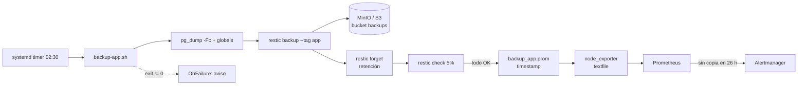
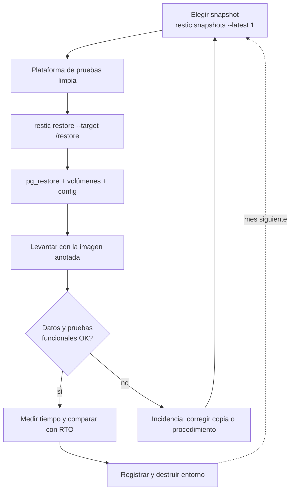

# UT6 · Copias de seguridad y restauración

<p class="ut-meta">Módulo 5169 · 14 h · Formación en empresa (29 mar a 9 jun 2027) · RA4 CE a, b, c</p>

Hasta la UT5 todo el módulo ha transcurrido en el laboratorio del centro, sobre el servicio del curso (nginx en web01, API en app01, PostgreSQL en db01). Esta unidad y la UT5 se cursan durante la formación en empresa, y el objeto de trabajo pasa a ser un servicio real de la empresa que os acoge: revisáis o montáis sus copias de seguridad, comprobáis que llegan a un medio externo y las restauráis en un entorno de pruebas. Lo que aprendáis aquí lo vais a necesitar en la UT7 (antes de actualizar hay que poder volver atrás) y en la UT8 (terminar un servicio incluye destruir sus copias de forma controlada, y el repositorio restic (la herramienta de copias del curso) que dejasteis en MinIO (el almacenamiento de objetos del laboratorio) es justo el que se destruye allí).

Estas páginas son guía de referencia y lista de evidencias. No se sacan datos de la empresa: lo que entregáis son configuraciones, listados y capturas anonimizadas (nombres de host, rutas y buckets pueden cambiarse por genéricos; el contenido de un dump nunca sale de allí).

!!! note "Punto de partida en el laboratorio"
    Antes de iros a la empresa ya tenéis un repositorio restic funcionando contra el MinIO del laboratorio, con la convención `s3:http://10.10.0.30:9000/backups` y la contraseña en `/etc/restic/pass`. Sirve como referencia para comparar con lo que os encontréis: la empresa tendrá su propia herramienta, su propio destino y sus propias políticas, y parte del trabajo es entender por qué son distintas.

## Qué tienes que saber hacer al terminar

- Programar la copia de un servicio en contenedores y verificar que se ha ejecutado, con alerta si falta (CE 4a).
- Exportar la copia a un medio externo respetando la política de almacenamiento, rotación y limpieza de la empresa, y comprobar que se cumple (CE 4b).
- Restaurar periódicamente una copia en una plataforma de pruebas, medir el tiempo y dejar registro (CE 4c).
- Redactar un plan de copias y restauración de dos páginas que alguien que no seas tú pueda ejecutar.

## Antes de entrar en detalle

Un lunes a las 9, en la empresa, alguien lanza `docker compose down -v` en el host equivocado y el volumen de PostgreSQL se va con los pedidos de tres años. "Hay copia", dice el tutor: está en `/var/backups` del mismo host, así que también se ha ido. Queda la de la semana pasada en el NAS, y el dump ocupa 0 bytes desde hace dos meses porque a la orden le faltaba un flag. Es lo normal en un servicio cuyas copias nadie ha restaurado nunca. Al final de la unidad tienes que poder decir tres cosas de un servicio, con pruebas: qué se copia y cuándo, dónde está la copia fuera del host, y cuánto tarda en volver a funcionar porque lo has restaurado tú con el cronómetro en marcha.

| Herramienta o concepto | Qué es, en una frase | Para qué la usamos en esta unidad |
|---|---|---|
| restic | Programa de copias que trocea los ficheros, guarda solo los trozos nuevos y cifra todo lo que envía | Copiar, retener, verificar y restaurar; la herramienta principal |
| BorgBackup y borgmatic | Un programa parecido a restic que trabaja por SSH; borgmatic lo configura desde un YAML | Reconocer la alternativa habitual en empresas con NAS |
| pg_dump y pg_restore (mysqldump en MySQL) | Utilidades del propio motor que vuelcan la base de datos a un fichero consistente y lo cargan de vuelta | Obtener una copia de la base de datos que arranca seguro |
| S3 y MinIO | Almacenamiento de objetos por HTTP, organizado en cubos (*buckets*); S3 es el de Amazon y MinIO su equivalente instalable en casa | Destino externo de las copias |
| mc | El cliente de línea de comandos de MinIO | Activar versionado, retención y ciclo de vida en el bucket |
| systemd timers y cron | Los dos programadores de tareas de Linux; el timer de systemd añade log propio y recuperación de ejecuciones perdidas | Lanzar la copia cada noche sin intervención |
| node_exporter y Prometheus | El agente de métricas del host, que también lee métricas propias de un fichero; Prometheus las recoge | Alerta por ausencia: enterarse de que la copia no se ha hecho |
| Healthchecks.io | Servicio que espera un "sigo vivo" periódico y avisa cuando no llega | La misma alerta cuando la empresa no tiene Prometheus |
| age y sops | Dos herramientas pequeñas para cifrar ficheros | Cifrar el `.env` con las contraseñas antes de copiarlo |
| Regla 3-2-1, RPO y RTO | Cuántas copias y dónde; cuántos datos puedes perder; cuánto puede tardar en volver el servicio | Los números con los que se juzga una copia y se mide la restauración |
| Versionado y Object Lock | Dos ajustes del bucket que conservan versiones anteriores e impiden borrar durante un plazo | Proteger la copia frente a un atacante o un error en el host |
| Snapshots de VM (Proxmox) | Instantánea del disco entero de una máquina virtual | Entender por qué no sustituyen a la copia de aplicación |

**Cómo está organizada la unidad.** Empieza por qué se copia y qué no, porque el error más caro es copiar lo equivocado. Siguen los números (3-2-1, RPO y RTO), que deciden frecuencia y destino antes de escribir una línea, y los tipos de copia, necesarios para entender por qué restic los mezcla todos. Con eso se entra en restic a fondo, programar la copia y verificar que se ha ejecutado, que juntos cubren el CE 4a. Destinos y políticas es lo que en la empresa se audita (CE 4b); restaurar es la prueba real de todo lo anterior (CE 4c); y el plan como documento va el último porque recoge lo demás.

!!! info "Lo que necesitas de la otra asignatura"
    Esta unidad y la UT5 se hacen en la empresa, del 29 de marzo al 9 de junio, a la vez que la [UT4 Nube pública de 5166](https://victor-educ.github.io/apuntes-5166/ut/ut4-nube-publica/). Las dos trabajan sobre el mismo sitio: la nube o el CPD de la empresa es donde están los buckets a los que llegan las copias, y las cuentas, regiones y políticas de acceso que allí se explican son las que aquí compruebas en la A6.2. Si el destino de la empresa es S3, Azure Blob o B2 de verdad, la parte de credenciales, ubicación de datos y coste de descarga la tienes en esa unidad de 5166; aquí se da por sabida. Del laboratorio te llevas el repositorio restic contra MinIO y la pila de mon01 (Prometheus y Alertmanager, de 5169 UT1 y UT2), que es donde va la alerta de ausencia si la empresa no tiene la suya.

## Qué se copia y qué no

*Material de consulta para la formación en empresa.*

De un servicio en contenedores se copia lo que no se puede reconstruir desde el código. Las imágenes están en el registry y el código en Git; copiarlos otra vez es gastar espacio y, peor, dar una sensación de seguridad falsa. Lo que sí hay que copiar cabe en tres cajones:

- **Datos**: la base de datos y los volúmenes de ficheros que suben los usuarios (adjuntos, imágenes, documentos generados).
- **Configuración**: el `compose.yml`, el `.env` (cifrado, nunca en claro), certificados y claves TLS, la configuración del proxy y de la monitorización (reglas de alerta, dashboards exportados).
- **Metadatos del despliegue**: qué versión de imagen estaba en producción cuando se hizo la copia. Un dump de la base de datos de la versión 2.4 no arranca con la imagen 2.6 si hubo migraciones de esquema. Basta con un `docker compose images` volcado a un fichero junto al dump.

### Dump lógico frente a copia del volumen

Una base de datos escribe en disco de forma continua. Si copias el directorio del volumen mientras PostgreSQL está en marcha, obtienes ficheros de distintos instantes: un fichero de datos que ya tiene la transacción y un WAL (el registro de transacciones, *write-ahead log*) que todavía no. Ese conjunto puede no arrancar, o arrancar con datos corruptos que no descubres hasta meses después. Hay dos maneras limpias de resolverlo:

**Dump lógico.** El propio motor genera un fichero consistente (una instantánea transaccional) que además es portable entre versiones y arquitecturas. Para PostgreSQL:

```bash
# Una base, formato custom (comprimido, permite restauración selectiva y en paralelo)
docker compose exec -T db pg_dump -U app -Fc app > /var/backups/app.dump

# Roles y contraseñas del clúster, que pg_dump NO incluye
docker compose exec -T db pg_dumpall -U postgres --globals-only > /var/backups/globals.sql
```

El `-T` desactiva la asignación de TTY (terminal interactivo); sin él, la salida por `>` se corrompe. `-Fc` produce el formato custom, que se restaura con `pg_restore` y admite `-j 4` para paralelizar y `-t tabla` para sacar una sola tabla. `pg_dumpall` sin `--globals-only` vuelca todo el clúster en SQL plano, útil para migraciones, poco práctico como copia diaria de una base de 40 GB.

Para MySQL o MariaDB el equivalente es `mysqldump --single-transaction --routines --triggers --events app > app.sql`. El `--single-transaction` abre una transacción con lectura consistente para que el volcado corresponda a un instante, sin bloquear tablas InnoDB (el motor de almacenamiento habitual de MySQL); si hay tablas del motor antiguo MyISAM no sirve y toca `--lock-tables`. Para MongoDB, `mongodump --archive --gzip`.

**Copia del volumen con el servicio parado o congelado.** Si la base de datos es enorme y el dump tarda más de lo que permite la ventana, se para el contenedor (o se hace una copia física con `pg_basebackup`, que admite PITR, recuperación a un instante concreto, si se archiva el WAL) y se copia el directorio. Para el resto de volúmenes (ficheros subidos) la copia directa es lo normal:

```bash
# Copiar un volumen con nombre sin conocer su ruta en el host
docker run --rm -v app_uploads:/data:ro -v /var/backups:/backup alpine \
  tar czf /backup/uploads.tgz -C /data .
```

Con restic no hace falta el tar: se le pasa la ruta del volumen y deduplica fichero a fichero.

| Método | Consistencia | Portabilidad | Tamaño | Cuándo |
|---|---|---|---|---|
| `pg_dump -Fc` | Transaccional | Entre versiones mayores | Comprimido | Copia diaria estándar |
| `pg_basebackup` + WAL | Física, con PITR | Misma versión mayor | Igual que el clúster | Bases grandes, RPO de minutos |
| Copia del volumen en caliente | Ninguna | Misma versión | Igual que el clúster | Nunca para bases de datos |
| Copia del volumen parado | Total | Misma versión | Igual que el clúster | Ventana de parada aceptable |

### Ficheros, configuración y secretos

Los ficheros subidos por usuarios se copian tal cual; el único cuidado es que no cambien a mitad de copia (un fichero de 2 GB que se está subiendo). restic detecta la modificación y avisa, y se puede repetir esa ruta. La configuración va toda al mismo snapshot que los datos, para que una restauración devuelva un conjunto coherente.

Los secretos merecen aparte. El `.env` con la contraseña de la base de datos, las claves de API y los certificados privados tienen que estar en la copia (sin ellos no se restaura nada), pero no pueden viajar en claro a un bucket que gestiona otro equipo. Dos opciones válidas: cifrarlos antes con `age` o `sops` (dos herramientas de cifrado de ficheros) y copiar el fichero cifrado, o confiar en el cifrado del repositorio restic (todo lo que entra está cifrado con AES-256 y autenticado con Poly1305; el destino solo ve blobs). En la mayoría de empresas veréis las dos a la vez: el repositorio cifra, y además los secretos van cifrados con una clave que custodia otra persona.

## Regla 3-2-1, RPO y RTO

*Material de consulta para la formación en empresa.*

Antes de tocar ninguna herramienta hay que saber con qué vara se mide una copia. Aquí fijamos tres números que decide la empresa, no el técnico, y con los que se justifica todo lo que viene después: frecuencia, destino y método de restauración.

La regla **3-2-1** es el mínimo defendible: tres copias de los datos (la de producción y dos más), en dos soportes distintos (disco local y almacenamiento de objetos, por ejemplo), y una fuera del sitio (otro centro de datos, otra región de la nube, una cinta en una caja fuerte). La variante **3-2-1-1-0**, que se ha extendido con el ransomware, añade una copia *offline* o inmutable (que nadie con credenciales del host pueda borrar) y cero errores en la verificación (las copias se comprueban y restauran, no se dan por buenas).

Los dos parámetros que fija la empresa, no el técnico:

- **RPO** (*Recovery Point Objective*): cuántos datos se pueden perder, medido en tiempo. Fija la frecuencia de copia. Si el RPO es 24 h, una copia diaria a las 02:30 vale. Si es 1 h, o copias cada hora o archivas el WAL de PostgreSQL de forma continua.
- **RTO** (*Recovery Time Objective*): cuánto puede tardar el servicio en volver. Fija el método de restauración y dónde está la copia. Un RTO de 4 h permite descargar 30 GB de un bucket remoto y hacer un `pg_restore`; un RTO de 15 min exige una réplica en caliente o un snapshot local.

Con números: una tienda con 200 pedidos al día y copia diaria a las 02:30 tiene un RPO real de hasta 24 h; si el disco muere a las 02:00, se pierden 199 pedidos. Si la empresa dice que solo puede perder una hora de pedidos, la copia diaria no cumple, por muy bien que funcione. Y si el RTO es de 2 h pero la restauración de prueba tardó 3 h 40 min, el plan está mal aunque la copia sea perfecta.

## Tipos de copia y snapshots

*Material de consulta para la formación en empresa.*

En la documentación de cualquier herramienta y en la conversación con el tutor van a salir las copias completas, incrementales y diferenciales. Se definen aquí para que sepas de qué hablan y por qué con restic o borg la distinción casi deja de importar; al final, por qué un snapshot del hipervisor no cuenta como copia.

- **Completa**: todo, cada vez. Simple de restaurar (un solo conjunto), cara en espacio y tiempo.
- **Incremental**: solo lo que cambió desde la última copia (completa o incremental). Barata; restaurar exige la completa más toda la cadena, y un eslabón corrupto rompe lo que viene después.
- **Diferencial**: lo que cambió desde la última completa. Restaurar necesita dos conjuntos; cada diferencial crece hasta la siguiente completa.
- **Deduplicada**: la que hacen restic y borg. Los ficheros se trocean en bloques de tamaño variable (*content-defined chunking*), cada bloque se identifica por su hash y solo se almacenan los bloques nuevos. Cada snapshot es lógicamente completo (se restaura solo, sin cadenas), pero cuesta lo que un incremental. Es la razón por la que la distinción clásica ha dejado de importar en la práctica.

Aparte están los **snapshots del hipervisor** (Proxmox, `vzdump` con modo *snapshot*) y los del sistema de ficheros (ZFS, LVM). Son instantáneas del disco de la VM entera: rápidos, cómodos para volver atrás antes de una actualización, y engañosos como copia de seguridad. Un snapshot en el mismo almacenamiento que la VM desaparece con él; capta la base de datos en caliente con los mismos problemas de consistencia que copiar el volumen (aunque el *guest agent* de QEMU con `fsfreeze`, que congela un instante el sistema de ficheros del invitado, mitiga parte); y restaurar un fichero suelto obliga a levantar la VM entera. La combinación habitual en empresa es ambas cosas: copia de VM con Proxmox Backup Server para recuperar el host en bloque, y copia de aplicación con restic para recuperar datos con granularidad. Cómo se hace el snapshot de VM lo visteis en [5166 UT1](https://victor-educ.github.io/apuntes-5166/ut/ut1-virtualizacion/).

## restic a fondo

*Material de consulta para la formación en empresa.*

Con restic se hace casi todo lo que sigue: copiar, retener, verificar y restaurar. Este apartado es su referencia; no hay que memorizar las opciones, sino saber que existen para reconocerlas en el script de la empresa. El bloque de comandos es lo mínimo; la lista de puntos, lo que separa una prueba de una copia en producción.

restic (versión 0.18 en el laboratorio) es un programa de un solo binario, escrito en Go, que crea repositorios deduplicados y cifrados en local, SFTP, S3 y compatibles (MinIO, Backblaze B2), Azure, GCS o su propio `rest-server`. Todo lo que se configura son variables de entorno y flags.

```bash
export RESTIC_REPOSITORY=s3:http://10.10.0.30:9000/backups
export RESTIC_PASSWORD_FILE=/etc/restic/pass        # chmod 600, propietario root
export AWS_ACCESS_KEY_ID=backup-app
export AWS_SECRET_ACCESS_KEY='...'                  # mejor en /etc/restic/env con EnvironmentFile=
export RESTIC_CACHE_DIR=/var/cache/restic           # índices locales; acelera todo
export RESTIC_COMPRESSION=auto                      # off | auto | max

restic init                                          # una vez; crea la clave del repo
restic backup /var/backups /opt/app/compose.yml /var/lib/docker/volumes/app_uploads/_data \
  --tag app --tag daily --exclude-file /etc/restic/excludes --one-file-system
restic snapshots                                     # lista
restic snapshots --latest 1 --tag app --json         # el último con tag app, para scripts
```

Puntos que importan al usarlo en serio:

- **Tags y host**: cada snapshot lleva el nombre del host y los tags que le pongas. Las políticas de retención se aplican por grupo (`--group-by host,tags` es el valor por defecto), así que si la misma máquina copia dos aplicaciones con tags distintos, cada una tiene su propia rotación.
- **Exclusiones**: `--exclude '*.tmp'`, `--exclude-file`, `--exclude-caches` (respeta los ficheros `CACHEDIR.TAG`) y `--exclude-if-present .nobackup`. Excluir `node_modules`, cachés y logs rotados reduce el snapshot de una aplicación típica a una fracción.
- **Volcado por stdin**: en lugar de escribir el dump a disco y copiarlo, `pg_dump ... | restic backup --stdin --stdin-filename app.dump --tag app`. Ahorra el espacio intermedio; la pega es que restic no puede deduplicar contra la versión anterior tan bien porque no ve metadatos, aunque el *chunking* sigue funcionando.
- **Retención**: `restic forget --keep-daily 7 --keep-weekly 4 --keep-monthly 6 --keep-yearly 2 --prune`. `forget` borra los snapshots; sin `--prune` los datos siguen ocupando espacio hasta que se ejecute `restic prune`, que reempaqueta y elimina blobs huérfanos. `prune` es lento y toma un bloqueo exclusivo, así que se programa aparte (semanal) y no en cada copia. `--max-unused 5%` limita cuánto reempaqueta.
- **Verificación**: `restic check` valida la estructura del repositorio con los índices; `--read-data` descarga y verifica cada blob (caro con 500 GB en un bucket remoto); `--read-data-subset=5%` o `--read-data-subset=1/10` lo hace por partes, de forma que en 10 ejecuciones lo has leído todo.
- **Restauración**: `restic restore latest --target /restore` restaura el último snapshot; `--include /var/backups/app.dump` saca solo esa ruta; `--host` y `--tag` seleccionan el snapshot cuando hay varios. `restic ls latest` y `restic find app.dump` localizan ficheros sin restaurar; `restic diff id1 id2` muestra qué cambió entre dos snapshots.
- **Montaje**: `restic mount /mnt/restic` expone el repositorio por FUSE (un sistema de ficheros en espacio de usuario: el repositorio aparece como un directorio normal), con un directorio por snapshot (`/mnt/restic/snapshots/latest/...`). Es la forma más rápida de recuperar un fichero suelto o de inspeccionar qué hay dentro sin restaurar nada. Necesita el paquete `fuse3`.
- **Rendimiento**: la primera copia va limitada por CPU (hash y cifrado) y por la subida; las siguientes solo leen ficheros cambiados si los metadatos coinciden (por defecto compara tamaño, mtime e inodo). `--read-concurrency 4` acelera en discos rápidos; `RESTIC_PACK_SIZE=64` (MiB) reduce el número de objetos en S3 para repositorios grandes; `limit-upload` acota el ancho de banda en la ventana nocturna. La caché local en `RESTIC_CACHE_DIR` es lo que más se nota: sin ella cada operación descarga los índices del bucket.
- **Bloqueos**: si una copia muere a medias (reinicio del host), queda un lock y la siguiente falla con "repository is already locked". `restic unlock` lo limpia; antes de hacerlo, asegurarse de que no hay otro proceso restic vivo.
- **Contraseña**: `restic key add` y `restic key remove` gestionan varias claves para el mismo repositorio; cambiarla según la política de la empresa es añadir la nueva, verificar que abre el repo y quitar la antigua. Perderla equivale a perder el repositorio entero; en la empresa preguntad dónde está custodiada.

### borg como alternativa

BorgBackup hace lo mismo con otra filosofía: repositorio en local o por SSH (con `borg serve` en el destino, sin S3 nativo hasta la versión 2), compresión configurable (`lz4`, `zstd`), deduplicación y cifrado por clave o contraseña. Los comandos son paralelos: `borg init --encryption=repokey-blake2`, `borg create --stats ::app-{now} /rutas`, `borg prune --keep-daily 7 --keep-weekly 4 --keep-monthly 6`, `borg compact`, `borg check --verify-data`, `borg mount`. Tiene `--append-only` como opción del servidor SSH, muy práctica contra ransomware. En empresa la elección suele venir dada por el destino: si es un NAS por SSH, borg; si es almacenamiento de objetos, restic. Borgmatic añade encima un fichero YAML con antes/después (`before_backup: pg_dump...`) y hooks para healthchecks, que es lo que os encontraréis en muchas instalaciones pequeñas.

=== "restic"

    ```bash
    restic backup /opt/app /var/backups --tag app
    restic forget --keep-daily 7 --keep-weekly 4 --keep-monthly 6 --prune
    restic restore latest --target /restore --include /var/backups/app.dump
    ```

=== "borg"

    ```bash
    borg create --stats --compression zstd ssh://backup@nas.empresa.local/./app::{now} /opt/app /var/backups
    borg prune --keep-daily 7 --keep-weekly 4 --keep-monthly 6 ssh://backup@nas.empresa.local/./app
    borg compact ssh://backup@nas.empresa.local/./app
    borg extract ssh://backup@nas.empresa.local/./app::2027-05-03T02:30:14 var/backups/app.dump
    ```

## Programar la copia

*Material de consulta para la formación en empresa.*

El script hace de orquestador: vuelca la base de datos, lanza restic, aplica retención y verifica, y al terminar escribe una métrica que node_exporter (el agente de Prometheus de la UT1) recoge. Lo que se ejecuta cada noche en el laboratorio es este; fíjate en el `set -euo pipefail` de la cabecera y en que la métrica se escribe solo al final:

```bash
#!/bin/bash
# /usr/local/bin/backup-app.sh
set -euo pipefail
export RESTIC_REPOSITORY=s3:http://10.10.0.30:9000/backups
export RESTIC_PASSWORD_FILE=/etc/restic/pass
export RESTIC_CACHE_DIR=/var/cache/restic
# AWS_ACCESS_KEY_ID y AWS_SECRET_ACCESS_KEY llegan por EnvironmentFile= de la unit

TS_FILE=/var/lib/node_exporter/textfile_collector/backup_app.prom
START=$(date +%s)

cd /opt/app
docker compose images --format json > /var/backups/app-images.json
docker compose exec -T db pg_dump -U app -Fc app > /var/backups/app.dump
docker compose exec -T db pg_dumpall -U postgres --globals-only > /var/backups/globals.sql

restic backup /var/backups /opt/app/compose.yml /opt/app/.env.enc \
  /var/lib/docker/volumes/app_uploads/_data \
  --tag app --exclude-file /etc/restic/excludes --one-file-system
restic forget --keep-daily 7 --keep-weekly 4 --keep-monthly 6 --tag app
restic check --read-data-subset=5%

# Métrica para Prometheus: solo se escribe si todo lo anterior ha ido bien (set -e)
cat > "$TS_FILE.$$" <<EOF
# HELP backup_last_success_timestamp_seconds Epoch de la última copia correcta
# TYPE backup_last_success_timestamp_seconds gauge
backup_last_success_timestamp_seconds{job="app"} $(date +%s)
backup_last_duration_seconds{job="app"} $(( $(date +%s) - START ))
EOF
mv "$TS_FILE.$$" "$TS_FILE"
```

El `set -euo pipefail` es lo que convierte cualquier fallo intermedio en un código de salida distinto de cero, que es lo que systemd va a mirar. El `mv` final es atómico: node_exporter nunca lee un fichero a medio escribir. El `prune` no está aquí a propósito: va en un timer semanal separado.

### systemd timers

Una unit de servicio `oneshot` (se ejecuta, termina y no queda residente) y un timer que la dispara:

```ini
# /etc/systemd/system/backup-app.service
[Unit]
Description=Copia de seguridad de app
After=docker.service network-online.target
Wants=network-online.target
OnFailure=status-email@%n.service

[Service]
Type=oneshot
EnvironmentFile=/etc/restic/env
ExecStart=/usr/local/bin/backup-app.sh
Nice=10
IOSchedulingClass=best-effort
IOSchedulingPriority=7
```

```ini
# /etc/systemd/system/backup-app.timer
[Unit]
Description=Lanza backup-app.service cada noche

[Timer]
OnCalendar=*-*-* 02:30:00
Persistent=true
RandomizedDelaySec=15m
Unit=backup-app.service

[Install]
WantedBy=timers.target
```

`OnCalendar` admite expresiones como `Mon..Fri 02:30`, `*-*-01 04:00` (el día 1 de cada mes) o `hourly`; `systemd-analyze calendar '*-*-* 02:30:00'` te dice cuándo será la próxima ejecución. `Persistent=true` guarda en disco la última ejecución y, si el host estaba apagado a las 02:30, lanza la copia en cuanto arranca (cron no hace esto). `RandomizedDelaySec` reparte la carga cuando varios hosts comparten el mismo destino a la misma hora. `OnFailure` engancha una unit que avisa (correo, webhook a Alertmanager) cuando la de copia termina con error. Se activa con `systemctl enable --now backup-app.timer`; `systemctl list-timers` muestra la próxima y la última ejecución; `journalctl -u backup-app.service -n 50` es el log, sin gestionar rotación ni redirecciones.

### cron y contenedor programador

Con cron la línea equivalente en `/etc/cron.d/backup-app` es `30 2 * * * root /usr/local/bin/backup-app.sh >> /var/log/backup-app.log 2>&1`. Funciona en cualquier sitio y es lo que veréis en muchas empresas; sus carencias frente al timer son las que acabáis de leer: no recupera ejecuciones perdidas, el log lo gestionas tú y el fallo solo se ve si alguien lee el correo de root. Cuando el host no es vuestro (una plataforma gestionada donde solo tenéis Docker), el programador va en un contenedor: ofelia lee etiquetas de los otros contenedores (`ofelia.job-exec.backup.schedule: "0 30 2 * * *"`, `ofelia.job-exec.backup.command: "pg_dump ..."`) y ejecuta comandos dentro de ellos; o un *sidecar* (contenedor auxiliar que acompaña al principal) Alpine con `crond` que monta el socket de Docker. Ambos tienen el mismo problema: el contenedor programador necesita acceso al socket o a los volúmenes, y eso es un privilegio grande que hay que documentar.



## Verificar que se ha ejecutado

*Material de consulta para la formación en empresa.*

Una copia programada que nadie mira deja de funcionar en silencio: caduca la credencial del bucket, se llena `/var/backups`, cambia la contraseña de la base de datos, y nadie lo descubre hasta que hace falta restaurar. La verificación tiene cuatro capas, de la más barata a la más fiable:

1. **Código de salida.** El `set -e` del script y `Type=oneshot` hacen que systemd marque la unit como `failed`. `systemctl is-failed backup-app.service` lo consulta; `OnFailure` avisa.
2. **Log.** `journalctl -u backup-app.service --since yesterday`. restic imprime al final de cada copia cuántos ficheros nuevos, cambiados y sin cambios, y cuántos datos se han añadido. Un "Added to the repository: 0 B" tres días seguidos en una aplicación viva es sospechoso aunque el código de salida sea 0.
3. **El repositorio.** `restic snapshots --latest 1 --tag app` devuelve fecha, host, tags y rutas del último snapshot. Comprobar que la fecha es de hoy y que el tamaño (`restic stats latest`) está en el rango esperado. Es lo que mira quien audita.
4. **Alerta por ausencia** (*dead man's switch*). Las tres anteriores fallan si el host que copia está apagado, si el timer se deshabilitó o si el script no llega ni a arrancar. La única forma de detectarlo es que otro sistema espere una señal y avise cuando no llega.

Con la pila de monitorización de mon01 se hace con la métrica que escribe el script y el *textfile collector* de node_exporter (arrancado con `--collector.textfile.directory=/var/lib/node_exporter/textfile_collector`):

```yaml
groups:
  - name: backups
    rules:
      - alert: BackupMissing
        expr: time() - backup_last_success_timestamp_seconds > 26 * 3600
        for: 10m
        labels: {severity: critical}
        annotations:
          summary: "Sin copia correcta de {{ $labels.job }} en más de 26 h"
      - alert: BackupMetricAbsent
        expr: absent(backup_last_success_timestamp_seconds{job="app"})
        for: 30m
        labels: {severity: warning}
```

Las 26 h dejan margen a `RandomizedDelaySec` y a una copia que tarde más de lo habitual sin generar ruido cada noche. La segunda regla cubre el caso en que la métrica desaparece (node_exporter caído, fichero borrado): sin `absent()`, la primera expresión no devuelve nada y no salta. En la UT2 vimos cómo enrutar estas alertas en Alertmanager; aquí solo hay que añadirlas.

Si la empresa no tiene Prometheus, o el host que copia está fuera de su red de monitorización, el mismo patrón se hace con un servicio externo tipo [healthchecks.io](https://healthchecks.io/docs/): se crea un *check* con periodo 24 h y gracia 2 h, y el script hace `curl -fsS -m 10 --retry 3 https://hc-ping.com/<uuid>` al terminar bien (y `.../<uuid>/fail` en el `trap ERR`, el manejador que bash ejecuta cuando falla un comando). Si no llega el ping, avisa por correo, Slack o webhook. Healthchecks se puede autoalojar en un contenedor si la política de la empresa no permite servicios externos.

## Destinos y políticas

*Material de consulta para la formación en empresa.*

La copia local en `/var/backups` del propio host no es una copia: se pierde con el servidor, con el ransomware que cifra el disco y con el `rm -rf` equivocado. El destino externo es la parte del 3-2-1 que más se descuida. Lo que os vais a encontrar:

| Destino | Acceso desde restic | Puntos a favor | Puntos en contra |
|---|---|---|---|
| S3 / MinIO (propio o de otro CPD) | `s3:` nativo | Versionado, Object Lock, políticas IAM (permisos por credencial) por bucket | Coste por GB y por petición en nube; latencia en `prune` |
| NAS por SFTP o NFS | `sftp:` o ruta local | Barato, rápido en LAN | Mismo edificio; permisos difíciles de hacer *append-only* |
| Nube pública (B2, S3, Azure Blob) | nativo | Fuera del sitio sin esfuerzo | Egress (pago por descargar) al restaurar; cifrado en cliente obligatorio; ubicación |
| Cinta LTO (cinta magnética) | Vía intermedio (restic no escribe en cinta) | Offline de verdad, décadas de retención | Lento, requiere robot o disciplina manual |
| Disco externo rotado | ruta local | Trivial, offline | Depende de que alguien lo cambie; se olvida |

Las **políticas** que hay que respetar y comprobar, y que son el contenido de la A6.2:

**Almacenamiento.** Cifrado en cliente (el repositorio restic ya lo hace; en nube pública es obligatorio, no opcional). Ubicación permitida: si el servicio trata datos personales, el RGPD (artículo 32, seguridad del tratamiento; y el capítulo V sobre transferencias internacionales) condiciona dónde puede estar la copia; un bucket en `eu-west-1` o `eu-south-2` vale, uno en `us-east-1` exige garantías adicionales que probablemente la empresa no quiere gestionar. Y protección contra borrado: el host que copia no debe poder destruir las copias. En S3/MinIO se consigue con dos mecanismos combinados: **versionado del bucket** (`mc version enable minio/backups`, con `mc`, el cliente de línea de comandos de MinIO), que conserva las versiones anteriores de un objeto sobrescrito o borrado, y **Object Lock** en modo *compliance* con un periodo de retención (`mc retention set --default COMPLIANCE 30d minio/backups`), que impide que nadie, ni el administrador, borre un objeto antes de que venza. Las credenciales que usa el script tienen una política IAM con `s3:PutObject`, `s3:GetObject` y `s3:ListBucket` pero sin `s3:DeleteObject`; con eso restic puede hacer `backup` y `check`, pero no `forget --prune`, que se ejecuta desde otro host con otras credenciales (o con `rest-server --append-only` si el destino es el servidor REST de restic). Un atacante con acceso al host de producción no puede entonces borrar la copia, que es el primer paso del ransomware moderno.

**Rotación.** La política escrita dice cuántas diarias, semanales, mensuales y anuales se conservan; los flags `--keep-*` tienen que coincidir con ella, y el listado del destino también. Se comprueba con `restic snapshots --group-by tags` y contando.

**Limpieza.** `prune` programado y ejecutándose (con lock exclusivo, en horario que no coincida con la copia); espacio ocupado dentro de lo previsto (`restic stats --mode raw-data`, `mc du minio/backups`); y copias caducadas realmente eliminadas, lo que con versionado y Object Lock exige además una regla de ciclo de vida en el bucket (`mc ilm rule add --expire-delete-marker --noncurrent-expire-days 30 minio/backups`) para que las versiones no actuales se borren cuando venza la retención.

La comprobación es siempre la misma: listar el destino (`restic snapshots`, `aws s3 ls --recursive`, `mc ls --versions`, listado de la NAS) y compararlo línea a línea con la política. Lo que no coincide va a la tabla de cumplimiento con una fecha de corrección.

!!! warning "Las credenciales del bucket no son secretos de segunda"
    Con `AWS_SECRET_ACCESS_KEY` y `RESTIC_PASSWORD` en el mismo fichero, quien lea `/etc/restic/env` tiene las copias enteras de la empresa. Ese fichero va con `chmod 600`, propietario root, fuera de cualquier repositorio Git y, si la empresa tiene Vault (un gestor de secretos) o similar, se sirve desde allí en tiempo de ejecución.

## Restaurar: el mantenimiento preventivo

*Material de consulta para la formación en empresa.*

Una copia que no se ha restaurado nunca no es una copia; es una esperanza. La restauración periódica (mensual como mínimo, y siempre antes de una actualización mayor) es la tarea de mantenimiento preventivo de esta unidad, y la que cubre el CE 4c. El procedimiento, paso a paso, con el cronómetro en marcha desde el primer comando:

1. **Elegir la copia.** Normalmente la última: `restic snapshots --latest 1 --tag app`. Anotar el ID corto.
2. **Preparar la plataforma de pruebas.** Una VM limpia o un `docker compose` con proyecto distinto (`-p app_restore`) en un host que no sea producción. Comprobar que tiene Docker, restic, espacio en disco (el doble del tamaño del dump) y acceso al destino.
3. **Restaurar.** `restic restore <id> --target /restore`. Anotar cuánto tarda; en un bucket remoto esta suele ser la fase larga.
4. **Levantar la base de datos vacía** con la versión de imagen que dice `/restore/var/backups/app-images.json`, y cargar: `psql -U postgres -f /restore/var/backups/globals.sql` para los roles, y `pg_restore -U app -d app -j 4 /restore/var/backups/app.dump`. Los errores de "role already exists" al cargar globals son normales si la imagen ya creó el rol.
5. **Restaurar los volúmenes de ficheros** copiando `/restore/var/lib/docker/volumes/app_uploads/_data` al volumen nuevo, y colocar `compose.yml` y el `.env` descifrado.
6. **Levantar el servicio** y verificar: la aplicación arranca; los datos están (`SELECT count(*) FROM pedidos`, el último registro por fecha, un fichero subido que se abre); pruebas funcionales básicas (login, una búsqueda, generar un informe). Comparar los recuentos con los de producción a la hora de la copia si es posible.
7. **Parar el cronómetro** y comparar con el RTO. Si has tardado más, el plan tiene un problema y es preferible descubrirlo hoy.
8. **Registrar**: fecha, snapshot usado, quién, tiempo por fase, resultado, incidencias encontradas y qué se corrigió. **Destruir** el entorno de pruebas (contiene datos reales de la empresa) y borrar `/restore`.



Tres tareas complementarias que también forman parte del mantenimiento:

- **`restic check --read-data` completo** con periodicidad (trimestral en repositorios grandes, mensual en pequeños), además del 5% de cada noche. Detecta corrupción silenciosa en el almacenamiento, que los subconjuntos pueden tardar meses en encontrar.
- **Rotación de la contraseña del repositorio** según la política (`restic key add`, probar, `restic key remove <id antiguo>`), con la nueva custodiada donde diga la empresa.
- **Restauración de un fichero suelto**, que es lo que de verdad piden los usuarios ("he borrado el informe de marzo"). Con restic: `restic find informe-marzo.pdf` para localizar en qué snapshots está, y `restic restore <id> --target /tmp/r --include '/var/lib/docker/volumes/app_uploads/_data/informes/informe-marzo.pdf'`; o `restic mount` y copiar con `cp`. Medir este tiempo también: es un RTO distinto, y suele ser el que más veces se ejerce.

!!! tip "Restauración a un punto anterior"
    Cuando el problema no es un disco roto sino un borrado lógico descubierto días después ("alguien vació la tabla de clientes el martes"), la copia que interesa no es la última sino la anterior al daño. `restic snapshots` con la fecha y `restic diff` entre dos snapshots ayudan a localizar el momento exacto; con `pg_restore -t clientes` se recupera solo esa tabla en una base auxiliar y se traspasan las filas.

## El plan de copias como documento

*Material de consulta para la formación en empresa.*

Lo que la empresa necesita al final no es el script, sino un documento que otra persona pueda seguir a las tres de la mañana con el servicio caído. Dos páginas, con estos apartados en este orden:

1. **Alcance**: qué servicio, qué componentes (base de datos, volúmenes, configuración) y qué queda fuera y por qué (imágenes en el registry, código en Git).
2. **Objetivos**: RPO y RTO acordados con quien responde del servicio, y los medidos en la última restauración de prueba.
3. **Qué y cuándo**: método por componente (dump `-Fc`, copia de volumen), programación (timer, hora, ventana), herramienta y versión.
4. **Dónde**: destino principal y externo, cifrado, ubicación geográfica, quién custodia las claves.
5. **Retención y limpieza**: política de rotación (diarias, semanales, mensuales), Object Lock o equivalente, `prune` y ciclo de vida.
6. **Verificación**: qué se mira a diario (alerta de ausencia, log), qué mensualmente (restauración de prueba, `check`), quién lo hace.
7. **Procedimiento de restauración**: los ocho pasos anteriores adaptados, con comandos literales y rutas reales, y el de fichero suelto.
8. **Registro**: tabla con las restauraciones de prueba realizadas (fecha, snapshot, tiempo, resultado).

## Errores frecuentes en el laboratorio

- **`pg_dump` vacío o de 0 bytes y código de salida 0.** Casi siempre es el `-T` que falta en `docker compose exec`, o `set -o pipefail` ausente cuando se encadena con `gzip`. Se ve mirando el tamaño del fichero (`ls -la /var/backups`) antes de dar la copia por buena; el script debería comprobar `[ -s "$DUMP" ]`.
- **`Fatal: unable to open config file ... repository does not exist`.** La variable `RESTIC_REPOSITORY` no llega al script (systemd no hereda el entorno de tu shell). O se exporta en el propio script o va en `EnvironmentFile=`. `systemctl show backup-app.service -p Environment` dice qué ve la unit.
- **`repository is already locked`.** Copia anterior interrumpida (reinicio, `kill`). `restic unlock` tras confirmar con `ps aux | grep restic` que no hay otro proceso.
- **Copias de 0 B añadidos durante días.** La ruta copiada es un volumen que ya no usa la aplicación (se recreó con otro nombre tras un `docker compose down -v`). `docker volume ls` y `docker inspect` del contenedor para ver el volumen real.
- **La alerta `BackupMissing` no salta aunque no haya copia.** La métrica desapareció (node_exporter reiniciado sin el directorio de textfile, fichero `.prom` borrado). Es el caso que cubre `absent()`; si no está la segunda regla, no hay aviso. `curl -s 10.10.1.12:9100/metrics | grep backup_` desde mon01 lo confirma.
- **`forget --prune` falla con `AccessDenied`.** Las credenciales son *append-only*, como debe ser. El `prune` se ejecuta desde el host de administración con otras credenciales, no desde producción.
- **El bucket no deja de crecer aunque `forget` borra snapshots.** Versionado activado sin regla de ciclo de vida: los objetos borrados por `prune` quedan como versiones no actuales. `mc ls --versions` lo muestra; `mc ilm rule add` lo arregla.
- **`pg_restore` falla con "role app does not exist" o con errores de extensiones.** No se restauraron los globals (`pg_dumpall --globals-only`) o la imagen de PostgreSQL de pruebas no tiene la extensión (`pg_trgm`, `postgis`). Va en los metadatos del despliegue.
- **La restauración arranca pero la aplicación falla al abrir un fichero subido.** Se restauró la base pero no el volumen de ficheros, o se restauró en otra ruta y los permisos (UID del contenedor) no coinciden. `chown -R 1000:1000` sobre el volumen restaurado, con el UID que use la imagen.
- **El timer no se ejecutó y `Persistent=true` está puesto.** El timer no estaba `enabled`, solo `started`; al reiniciar el host no se cargó. `systemctl enable --now` y `systemctl list-timers --all` para ver los inactivos.

## Material de práctica

Las tres actividades se hacen en la empresa, con el tutor, sobre un servicio real. Los plazos orientativos dentro del periodo (29 de marzo a 9 de junio de 2027) son la primera quincena para A6.1, la segunda para A6.2 y la tercera para A6.3, dejando la última semana para el cierre. Cada actividad termina con la evidencia adjunta a la ficha y firmada por el tutor.

### A6.1 Copias programadas (CE 4a)

**En la empresa · con el tutor**

**Objetivo.** Al terminar, la aplicación elegida tiene una copia programada que se ejecuta sola, deja rastro de que se ha ejecutado y avisa cuando falta.

**Antes de empezar.**

- Autorización escrita del tutor para trabajar sobre la aplicación elegida (o para revisar su copia actual), y acuerdo sobre qué puedes ejecutar en producción y qué no.
- Acceso al host de la aplicación (leer el `compose.yml`, `docker compose exec`, crear units o entradas de cron), o el tutor delante si no te lo dan.
- Un destino aprobado por la empresa (bucket, NAS o, si no hay nada, el MinIO del laboratorio como prueba temporal).
- Leído: [Qué se copia y qué no](#que-se-copia-y-que-no), [Regla 3-2-1, RPO y RTO](#regla-3-2-1-rpo-y-rto), [restic a fondo](#restic-a-fondo), [Programar la copia](#programar-la-copia) y [Verificar que se ha ejecutado](#verificar-que-se-ha-ejecutado).

**Pasos.**

1. Inventario con el tutor. Anota, en una tabla de dos columnas (componente, se copia o no y por qué), la base de datos, cada volumen de ficheros, la configuración y los secretos de la aplicación. Guarda también la versión de imagen en producción:

    ```bash
    cd /opt/app
    docker compose config --volumes
    docker volume ls
    docker compose images --format json > /var/backups/app-images.json
    ```

2. Pregunta el RPO y el RTO al responsable del servicio y apúntalos. De ahí salen hora y frecuencia; si nadie los ha fijado, propón 24 h y 4 h y deja constancia de que es una propuesta.
3. Si la empresa ya tiene copias, contrasta su script con [Qué se copia y qué no](#que-se-copia-y-que-no): dump consistente o volumen en caliente, `-T` en el `exec`, secretos en claro, `set -e`, retención escrita. Cada diferencia va a una lista de mejoras. Si no las tiene, móntalas en los pasos siguientes.
4. Prepara el dump de la base de datos y comprueba que no está vacío antes de seguir:

    ```bash
    docker compose exec -T db pg_dump -U app -Fc app > /var/backups/app.dump
    docker compose exec -T db pg_dumpall -U postgres --globals-only > /var/backups/globals.sql
    ls -la /var/backups
    ```

    Con MySQL o MariaDB, `mysqldump --single-transaction --routines --triggers --events app > app.sql`.

5. Inicializa el repositorio (o usa el que ya exista) y haz una primera copia a mano, con el tag de la aplicación:

    ```bash
    export RESTIC_REPOSITORY=s3:https://<destino>/backups
    export RESTIC_PASSWORD_FILE=/etc/restic/pass        # chmod 600, propietario root
    export RESTIC_CACHE_DIR=/var/cache/restic
    restic init                                          # solo si el repositorio es nuevo
    restic backup /var/backups /opt/app/compose.yml /opt/app/.env.enc \
      /var/lib/docker/volumes/app_uploads/_data --tag app --one-file-system
    restic snapshots --latest 1 --tag app
    ```

    El `.env` va cifrado (`age` o `sops`) antes de entrar en la copia; el fichero en claro no se incluye.

6. Escribe el script tomando como base el `backup-app.sh` de [Programar la copia](#programar-la-copia) (`set -euo pipefail`, dump, `restic backup`, `restic forget --keep-*` con la retención acordada, `restic check --read-data-subset=5%`, métrica al final), con rutas, usuario y destino de la empresa. Con otra herramienta (borg, borgmatic) el script cambia, las fases no.
7. Programa el script con el timer y la unit de [systemd timers](#systemd-timers) (`OnCalendar` a la hora acordada, `Persistent=true`, `EnvironmentFile=/etc/restic/env` con las credenciales) o con la entrada de cron si es lo que usa la empresa:

    ```bash
    systemctl daemon-reload
    systemctl enable --now backup-app.timer
    systemctl list-timers backup-app.timer
    systemctl start backup-app.service          # primera ejecución a mano, para ver el log
    journalctl -u backup-app.service -n 50
    ```

8. Configura la alerta por ausencia: las reglas `BackupMissing` y `BackupMetricAbsent` de [Verificar que se ha ejecutado](#verificar-que-se-ha-ejecutado) si hay Prometheus, o un check de healthchecks.io (periodo 24 h, gracia 2 h) con el `curl` al final del script.
9. Provoca la ausencia con el tutor al lado: para el timer (`systemctl stop backup-app.timer`), baja temporalmente el umbral (`> 5 * 60` en la regla, o periodo de 5 min en el check), espera a que dispare, captura y deja todo como estaba.

**Comprobación.**

- `systemctl list-timers` muestra el timer con próxima ejecución, y `journalctl -u backup-app.service` termina con el resumen de restic (ficheros nuevos, cambiados, datos añadidos) y sin errores.
- `restic snapshots --latest 1 --tag app` devuelve un snapshot de hoy con las rutas esperadas; `restic ls latest | grep app.dump` lo localiza dentro.
- El dump tiene tamaño coherente con la base (`ls -la /var/backups`), no 0 bytes.
- La alerta ha saltado en la prueba de ausencia y ha vuelto a estado normal al reactivar el timer.

**Entrega.** En `a61/` del repositorio personal en Gitea: script o configuración anonimizados, unit y timer (o la línea de cron), salida de `restic snapshots` (o equivalente), la regla o el check de alerta y la captura de la alerta disparada, más la tabla de inventario del paso 1 y la lista de mejoras del paso 3 si había copias previas. Fila A6.1 de la ficha de evidencias firmada por el tutor.

### A6.2 Exportación y políticas (CE 4b)

**En la empresa · con el tutor**

**Objetivo.** Al terminar, has demostrado con listados que las copias están fuera del host, que el host que copia no puede borrarlas, y que la rotación y la limpieza que hay coinciden con la política escrita (de la empresa o la que propones tú).

**Antes de empezar.**

- Autorización del tutor para leer la configuración del destino y lanzar comandos de solo lectura contra él; los cambios (versionado, Object Lock, ciclo de vida) solo con su visto bueno y, mejor, ejecutados por él.
- La copia de la A6.1 funcionando desde hace al menos unos días, para que haya varios snapshots que contar.
- Credenciales de lectura al destino (`mc alias set`, `aws configure` o acceso a la NAS) y, si el destino es una nube pública, lo visto en [5166 UT4](https://victor-educ.github.io/apuntes-5166/ut/ut4-nube-publica/) sobre cuentas, regiones y coste de descarga.
- Leído: [Destinos y políticas](#destinos-y-politicas) y el apartado de retención de [restic a fondo](#restic-a-fondo).

**Pasos.**

1. Pide la política de copias escrita. Si no existe, redáctala en media página a partir del RPO de la A6.1 y del espacio disponible: cifrado, ubicación, protección contra borrado, retención y limpieza. Márcala como propuesta y que el tutor la lea antes de comprobar nada.
2. Lista el destino y guarda la salida anonimizada:

    ```bash
    restic snapshots --group-by tags
    mc ls --versions minio/backups | head -50      # o aws s3 ls --recursive s3://backups | head
    mc du minio/backups                            # espacio ocupado
    restic stats --mode raw-data
    ```

    Con una NAS, el listado del directorio del repositorio con `ls -la` y `du -sh`.

3. Almacenamiento: comprueba cada punto y anota el comando y el resultado.
    - Cifrado en cliente: `restic cat config` abre solo con la contraseña; en el destino solo hay blobs (`mc ls` no muestra nombres de fichero de la aplicación).
    - Ubicación: región del bucket (`mc admin info` o la consola de la nube) frente a la que permite la política.
    - Protección contra borrado: `mc version info minio/backups`, `mc retention info minio/backups` y la política IAM de la credencial que usa el script (sin `s3:DeleteObject`). Si el destino es una NAS por SSH con borg, `--append-only` en el `authorized_keys` del usuario de copias.
    - Prueba, con el tutor delante: desde producción, `restic forget <id> --prune` sobre un snapshot de prueba tiene que fallar con `AccessDenied`.
4. Rotación: cuenta en la salida de `restic snapshots --group-by tags` cuántas diarias, semanales y mensuales hay de verdad y compáralo con los `--keep-*` del script y con lo que dice la política. Las tres cosas tienen que coincidir.
5. Limpieza: localiza el `prune` (timer o cron separado, en otro host o con otras credenciales) y su última ejecución (`journalctl -u backup-prune.service` o el log de cron); compara el espacio ocupado con el previsto; y comprueba que las copias caducadas han desaparecido del destino. Con versionado activado, mira la regla de ciclo de vida (`mc ilm rule ls minio/backups`) y que no queden versiones no actuales más viejas que la retención (`mc ls --versions`).
6. Rellena la tabla de cumplimiento, una fila por punto de la política: requisito, cómo se comprobó, resultado, acción correctora con fecha si procede. Lo que no cumple se propone al tutor y, si lo autoriza, se corrige y se vuelve a comprobar.

**Comprobación.**

- El listado del destino muestra los snapshots de la A6.1 y el recuento por tipo coincide con la política y con los flags `--keep-*`.
- El `forget --prune` desde producción ha fallado (o hay otra prueba equivalente de que el host que copia no puede borrar).
- La tabla de cumplimiento no tiene filas vacías y cada "no cumple" tiene acción y fecha.

**Entrega.** En `a62/` del repositorio personal en Gitea: los listados del destino (anonimizados), la política (de la empresa o tu propuesta, indicando cuál) y la tabla de cumplimiento. Fila A6.2 de la ficha de evidencias firmada por el tutor.

### A6.3 Restauración de prueba (CE 4c)

**En la empresa · con el tutor**

**Objetivo.** Al terminar, has levantado el servicio en una plataforma de pruebas desde la última copia, con los datos verificados, un tiempo medido por fase comparado con el RTO, y el entorno de pruebas destruido.

**Antes de empezar.**

- Autorización del tutor para restaurar datos reales en pruebas, con acuerdo escrito de que el entorno se destruye al terminar.
- Una VM o un host de pruebas que no sea producción, con Docker, restic (o la herramienta de la empresa), acceso de lectura al destino y espacio libre por lo menos el doble del tamaño del último snapshot (`restic stats latest`).
- El `.env` descifrado o la clave con la que descifrarlo, en manos de quien la custodie.
- Un cronómetro (`date +%s` al empezar y terminar cada fase) y una plantilla de registro: fase, inicio, fin, duración, incidencia.
- Leído: [Restaurar: el mantenimiento preventivo](#restaurar-el-mantenimiento-preventivo) entero, incluida la restauración de un fichero suelto.

**Pasos.**

1. Elige la copia y arranca el cronómetro:

    ```bash
    restic snapshots --latest 1 --tag app       # anota el ID corto
    date +%s                                    # inicio total
    ```

2. Restaura el snapshot en la plataforma de pruebas y anota la duración de esta fase, que en un bucket remoto suele ser la larga:

    ```bash
    restic restore <id> --target /restore
    ls -la /restore/var/backups
    cat /restore/var/backups/app-images.json     # versión de imagen con la que se hizo la copia
    ```

3. Levanta solo la base de datos con esa versión de imagen, en un proyecto de compose distinto, y carga roles y dump:

    ```bash
    cd /restore/opt/app
    docker compose -p app_restore up -d db
    docker compose -p app_restore exec -T db psql -U postgres -f - < /restore/var/backups/globals.sql
    docker compose -p app_restore exec -T db pg_restore -U app -d app -j 4 < /restore/var/backups/app.dump
    ```

    Los avisos de "role already exists" al cargar globals son normales. Anota la duración.

4. Restaura los volúmenes de ficheros y la configuración: copia `/restore/var/lib/docker/volumes/app_uploads/_data` al volumen nuevo del proyecto `app_restore`, ajusta el propietario al UID que use la imagen (`chown -R 1000:1000` o el que corresponda), y coloca `compose.yml` y el `.env` descifrado.
5. Levanta el resto del servicio (`docker compose -p app_restore up -d`) y verifica: recuento de las tablas principales (`SELECT count(*) FROM pedidos;` y el último registro por fecha), un fichero subido que se abre, y las pruebas funcionales que acuerdes con el tutor. Si es posible, compara los recuentos con producción a la hora de la copia.
6. Para el cronómetro total y compáralo con el RTO de la A6.1. Si has tardado más, la incidencia va al registro con lo que habría que cambiar.
7. Restauración de un fichero suelto, con su propio tiempo:

    ```bash
    restic find <nombre-de-fichero>
    restic restore <id> --target /tmp/r --include '<ruta completa del fichero>'
    ```

    O bien `restic mount /mnt/restic` y copiar con `cp` desde `/mnt/restic/snapshots/latest/...`.

8. Registra todo (fecha, snapshot, quién, tiempo por fase y total, resultado, incidencias, qué se corrigió) y destruye el entorno:

    ```bash
    docker compose -p app_restore down -v
    rm -rf /restore /tmp/r
    ```

    El tutor confirma la destrucción y lo firma en la ficha.

9. Redacta la propuesta de periodicidad para la empresa (mensual, trimestral, siempre antes de una actualización mayor) justificada con el tiempo medido y con lo que cambia en el servicio entre copias.

**Comprobación.**

- La aplicación restaurada arranca y las pruebas funcionales pasan; los recuentos coinciden o la diferencia se explica por la hora de la copia.
- El registro tiene un tiempo por cada fase y el total, con la comparación con el RTO escrita.
- El fichero suelto se ha recuperado y su tiempo está anotado aparte.
- `docker compose -p app_restore ps` no devuelve nada y `/restore` no existe.

**Entrega.** En `a63/` del repositorio personal en Gitea: el registro de la restauración (comandos ejecutados, tiempos por fase, resultado, incidencias, capturas anonimizadas de la aplicación restaurada) y la propuesta de periodicidad. Fila A6.3 de la ficha de evidencias firmada por el tutor.

**Si te sobra tiempo.** Ensaya la restauración a un punto anterior: localiza con `restic snapshots` y `restic diff` la copia previa a un cambio conocido y recupera una sola tabla con `pg_restore -t <tabla>` en una base auxiliar.

### Actividad de cierre

Documento de dos páginas, "Plan de copias y restauración del servicio X", con los ocho apartados de la sección anterior: qué, cuándo, dónde, retención, verificación, procedimiento de restauración y RPO/RTO acordados y alcanzados. Se entrega al tutor de empresa y al profesor.

### Ficha de evidencias

| Actividad | CE | Fecha | Evidencia adjunta | Observaciones del tutor | Firma |
|---|---|---|---|---|---|
| A6.1 Copias programadas | 4a |  |  |  |  |
| A6.2 Exportación y políticas | 4b |  |  |  |  |
| A6.3 Restauración | 4c |  |  |  |  |
| Cierre: plan de copias | 4a, 4b, 4c |  |  |  |  |

## Práctica evaluable

**En la empresa · con el tutor**

En esta unidad la práctica evaluable es el conjunto de las tres actividades más el plan de cierre, valoradas con la ficha de evidencias firmada por el tutor de empresa y revisadas por el profesor. Los pesos:

| Criterio | Peso | Qué se valora |
|---|---|---|
| A6.1 Copias programadas (CE 4a) | 25 % | Selección justificada de qué se copia, consistencia del dump, programación correcta, verificación con alerta de ausencia funcionando |
| A6.2 Exportación y políticas (CE 4b) | 25 % | Copia en medio externo, tabla de cumplimiento completa y honesta, protección contra borrado, rotación y limpieza comprobadas contra la política |
| A6.3 Restauración de prueba (CE 4c) | 30 % | Procedimiento seguido en plataforma de pruebas, verificación de datos, tiempos medidos por fase, fichero suelto, registro completo, entorno destruido |
| Plan de copias y restauración | 15 % | Dos páginas ejecutables por un tercero, RPO/RTO acordados y medidos, comandos literales, registro de pruebas |
| Ficha de evidencias y anonimización | 5 % | Ficha completa y firmada, evidencias sin datos de la empresa |

Entregables, en la carpeta de la UT6 del repositorio personal en Gitea:

- [ ] `a61/` con script, unit, timer (o cron), listado de snapshots y regla o check de alerta con captura.
- [ ] `a62/` con listado del destino, política y tabla de cumplimiento.
- [ ] `a63/` con registro de restauración, tiempos y propuesta de periodicidad.
- [ ] `plan-copias-servicio-X.pdf` (dos páginas).
- [ ] `ficha-evidencias.pdf` firmada.

## Para ampliar

- [Documentación de restic](https://restic.readthedocs.io/en/stable/): referencia completa de comandos, backends, variables de entorno y el diseño interno del repositorio (capítulo "References"), que explica por qué deduplica y cifra como lo hace.
- [BorgBackup, guía rápida](https://borgbackup.readthedocs.io/en/stable/quickstart.html): para comparar con restic y entender el modo `--append-only` del servidor.
- [PostgreSQL 17, capítulo Backup and Restore](https://www.postgresql.org/docs/17/backup.html): dump lógico, copia física y PITR con archivado de WAL, que es el siguiente paso cuando el RPO baja de una hora.
- [pg_dump, página de referencia](https://www.postgresql.org/docs/17/app-pgdump.html): todas las opciones de formato y selección, y las limitaciones (no vuelca roles ni tablespaces).
- [mysqldump, manual de MySQL 8.4](https://dev.mysql.com/doc/refman/8.4/en/mysqldump.html): el detalle de `--single-transaction` y cuándo no basta.
- [systemd.timer(5)](https://www.freedesktop.org/software/systemd/man/latest/systemd.timer.html) y [systemd.time(7)](https://www.freedesktop.org/software/systemd/man/latest/systemd.time.html): sintaxis de `OnCalendar`, `Persistent`, `RandomizedDelaySec` y ejemplos de expresiones de calendario.
- [crontab(5) en man7.org](https://man7.org/linux/man-pages/man5/crontab.5.html): formato de las entradas de cron y las cadenas especiales (`@daily`).
- [node_exporter, textfile collector](https://github.com/prometheus/node_exporter#textfile-collector): cómo exponer métricas propias desde un fichero, con el detalle del `mv` atómico.
- [MinIO, Object Lock y retención](https://min.io/docs/minio/linux/administration/object-management/object-retention.html): modos *governance* y *compliance*, retención por defecto del bucket y su relación con el versionado.
- [Healthchecks.io, documentación](https://healthchecks.io/docs/): el patrón *dead man's switch* con ejemplos de integración desde bash, cron y systemd.
- [Proxmox VE, Backup and Restore](https://pve.proxmox.com/wiki/Backup_and_Restore): modos de copia de VM (`stop`, `suspend`, `snapshot`) y por qué el snapshot no sustituye a la copia de aplicación.
- [Reglamento (UE) 2016/679, RGPD](https://eur-lex.europa.eu/eli/reg/2016/679/oj): artículo 32 (seguridad del tratamiento, que incluye la capacidad de restaurar) y capítulo V (transferencias a terceros países), que condicionan dónde puede estar la copia.
