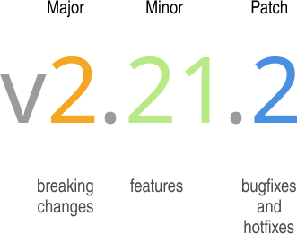
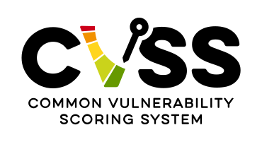
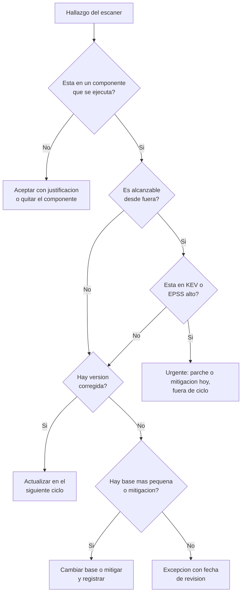
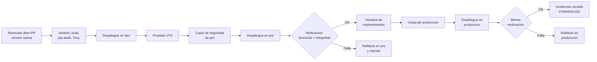

# UT7 · Actualización y gestión de vulnerabilidades

<p class="ut-meta">Módulo 5169 · 14 h · Sesiones 30 a 36 · RA4 CE d, e, f, g, h, i</p>

Hasta aquí habéis aprendido a mirar el servicio (UT1 a UT3), a medirlo y probarlo (UT4) y, en la empresa, a explotarlo y a copiarlo (UT5 y UT6). Todo eso da por hecho que el servicio no cambia. En esta unidad cambia: aparecen versiones nuevas de la base de datos, del proxy y de la aplicación, aparecen vulnerabilidades en librerías que ni sabíais que llevaba el contenedor, y hay que decidir qué se actualiza, cuándo y cómo, sin romper nada y dejando rastro. Las pruebas de la UT4 se reutilizan tal cual como red de seguridad de cada actualización, y las copias de la UT6 son el plan B. Después de esta unidad viene la UT8, donde daremos de baja el entorno pre que aquí vamos a usar tanto. Entre medias, del 1 al 5 de marzo, están las fiestas de la Magdalena, así que la práctica evaluable de la sesión 36 cierra la unidad antes del parón.

## Qué tienes que saber hacer al terminar

- Inventariar las imágenes y dependencias del contenedor de referencia con versión y digest, fijar las etiquetas flotantes y seguir la aparición de versiones nuevas de forma automática (CE d).
- Generar el SBOM de una imagen, escanear código, binarios y librerías con Trivy, Grype y las herramientas del lenguaje, leer un informe y proponer una solución justificada por hallazgo (CE e).
- Actualizar el servicio desde el repositorio, primero en pre y luego en producción, con copia previa, plan de vuelta atrás y verificación de integridad de los datos (CE f y h).
- Diagnosticar una actualización que falla, clasificarla, decidir rollback o parche dentro del plazo acordado y redactar el reporte para el equipo de desarrollo (CE g).
- Dejar cada actualización registrada como incidencia en Gitea con enlaces a todo lo que la sustenta y actualizar el CHANGELOG (CE i).

## Antes de entrar en detalle

Un jueves a las cuatro de la tarde llega un aviso: la librería que la API usa para hablar con PostgreSQL tiene un fallo que permite ejecutar código desde fuera. Nadie en el aula sabe si el contenedor de `app01` lleva esa librería ni en qué versión, ni si la imagen de producción es la misma que se probó en pre, porque el compose dice `postgres:17` y eso puede ser cualquier cosa. Alguien propone un `docker compose pull` "a ver qué pasa", que es justo lo que no queremos: puede no arrancar o perder datos, y no hay forma de volver atrás. Al terminar la unidad tienes que poder contestar en minutos a "¿nos afecta?", decidir qué se actualiza y cuándo, hacerlo sin perder datos y con vuelta atrás preparada, y dejarlo escrito para que otra persona lo reconstruya meses después.

| Herramienta o concepto | Qué es, en una frase | Para qué la usamos en esta unidad |
|---|---|---|
| Etiqueta y digest de una imagen | La etiqueta (`postgres:17.6`) es un nombre que el mantenedor puede mover; el digest (`sha256:…`) es la huella del contenido exacto. | Para saber sin dudas qué hay desplegado. |
| Versionado semántico | Convención `MAYOR.MENOR.PARCHE` con la que un proyecto avisa de cuánto puede romperse al subir de versión. | Para decidir qué actualizaciones se aplican solas y cuáles hay que leer y planificar. |
| Renovate, Dependabot y Watchtower | Robots que detectan versiones nuevas: los dos primeros abren una propuesta de cambio, el tercero actualiza por su cuenta. | Para enterarnos de las versiones nuevas sin mirar veinte páginas a mano, y para saber cuál no usar en producción. |
| CVE, CVSS, EPSS y KEV | El CVE nombra un fallo de seguridad; CVSS puntúa su gravedad de 0 a 10; EPSS estima si se explotará; KEV lista los que ya se explotan. | Para ordenar los hallazgos por urgencia real y no solo por la puntuación. |
| SBOM (con Syft) | Lista de todo el software de una imagen con su versión, como los ingredientes de un envase; Syft la genera. | Para saber qué llevamos y responder rápido cuando sale un fallo nuevo. |
| Trivy y Grype | Escáneres que comparan el contenido de una imagen con las bases de datos de vulnerabilidades. | Para encontrar los fallos de nuestras imágenes y poner una puerta en el pipeline. |
| pip-audit, npm audit, osv-scanner | Escáneres que leen el fichero de dependencias del lenguaje en vez de la imagen. | Para revisar las librerías de la aplicación antes de construir la imagen. |
| `.trivyignore` | Fichero del repositorio con los hallazgos aceptados, con motivo y fecha de caducidad. | Para que las excepciones queden escritas y no bloqueen el pipeline. |
| Jenkins y el Jenkinsfile | El servidor de pipelines de la 5166 y el fichero que describe sus etapas. | Para añadir la etapa de escaneo y desplegar a través de él. |
| Gitea (incidencias) y Keep a Changelog | El gestor de incidencias del curso y el formato estándar del `CHANGELOG.md`. | Para dejar rastro de cada actualización con enlaces a lo que la justifica. |
| restic, newman, k6 y ZAP | Copias (UT6) y pruebas (UT4), que ya conoces. | Plan B y red de seguridad de cada actualización. |

**Cómo está organizada la unidad.** Empieza por las versiones, etiquetas y digests, porque sin nombrar con exactitud lo desplegado nada de lo demás tiene sentido. Sigue con cómo seguir la aparición de versiones: fijado todo, hace falta algo que avise de que hay una nueva, y ahí entran Renovate y la política escrita. Después, las vulnerabilidades: con el inventario hecho, se escanea, se lee el informe y se decide qué hacer con cada hallazgo. Después, actualizar: el procedimiento con copia, pruebas, verificación de datos y qué hacer cuando falla. Y la trazabilidad, que cierra el círculo con la incidencia, el CHANGELOG y la etapa de escaneo en el pipeline.

!!! info "Lo que necesitas de la otra asignatura"
    Esta unidad va del 2 al 23 de febrero y coincide con la [UT6 de Despliegue, integración continua con Jenkins](https://victor-educ.github.io/apuntes-5166/ut/ut6-ci/), que va del 27 de enero al 26 de febrero. Dos cosas dependen de ella (Jenkins, sus credenciales y el registry local se explican allí y aquí se dan por conocidos):

    - El entorno pre que aquí actualizamos lo crea el repositorio IaC de la [UT5 de Despliegue](https://victor-educ.github.io/apuntes-5166/ut/ut5-iac/) con OpenTofu, así que a principios de febrero ya existe. No lo montes a mano.
    - La etapa de escaneo con Trivy que se pide en la sesión 35 (18 de febrero) se añade al Jenkinsfile que en la 5166 se está construyendo en sus sesiones 34 a 36 (del 10 al 17 de febrero), en el apartado [Pipeline declarativo](https://victor-educ.github.io/apuntes-5166/ut/ut6-ci/#pipeline-declarativo). Si ese día tu pipeline aún no despliega, prueba la etapa en un job aparte que solo construya y escanee, e intégrala cuando el pipeline esté completo.

## Versiones, etiquetas y digests

Antes de actualizar nada hay que poder decir con exactitud qué hay desplegado, y con contenedores el nombre del compose no siempre identifica el mismo software. Aprendes a nombrar una imagen sin ambigüedad, a leer lo que promete un número de versión y a escoger la variante de imagen adecuada.

Una imagen de contenedor se nombra por `repositorio:etiqueta` (`postgres:17.6`) y se identifica de forma inequívoca por su digest (`postgres@sha256:…`), que es el hash SHA-256 del manifiesto. La diferencia importa más de lo que parece: la etiqueta es un puntero que el mantenedor puede mover cuando quiera, el digest es el contenido. Cuando el equipo de PostgreSQL reconstruye `17.6` porque Debian ha publicado un parche de `libssl`, la etiqueta no cambia y el digest sí. Un `docker compose pull` en producción un lunes puede traeros una imagen distinta de la que probasteis el viernes aunque el compose diga lo mismo.

Hay tres niveles de precisión, de menos a más:

| Referencia | Qué significa | Dónde tiene sentido |
|---|---|---|
| `postgres:latest`, `postgres:17` | La última versión que haya en ese momento. Impredecible: un `pull` puede saltar de 17.5 a 17.6 o, peor, de 17 a 18 si usáis `latest`. | Pruebas rápidas en un portátil. Nunca en un compose que se despliegue. |
| `postgres:17.6`, `postgres:17.6-bookworm` | Versión concreta. Sabéis qué software lleva, pero la imagen se puede reconstruir por debajo (parches del SO base). | Mínimo aceptable en pre y producción. Es lo que se lee y lo que se escribe en el CHANGELOG. |
| `postgres:17.6@sha256:3f1a…` | Contenido exacto. Reproducible al 100 %: lo que probasteis es lo que desplegáis. | Pipelines y producción. La etiqueta se deja al lado para que un humano sepa qué es. |

Los comandos para pasar de una cosa a otra (`jq` filtra JSON en la línea de comandos):

```bash
# Digest de una imagen que ya tenéis descargada
docker images --digests postgres

# Digest y arquitecturas de una etiqueta en el registry, sin descargarla
docker manifest inspect postgres:17.6 | jq '.manifests[] | {digest, platform}'

# Digest concreto de la imagen que está corriendo ahora mismo
docker inspect --format '{{index .RepoDigests 0}}' app01-db-1

# Reescribir el compose con todas las imágenes resueltas a digest
docker compose config --resolve-image-digests > compose.pinned.yml
```

Ojo con `docker manifest inspect`: en una imagen multiarquitectura devuelve un índice con un digest por plataforma (`linux/amd64`, `linux/arm64`) y además el digest del propio índice. Para fijar en el compose se usa el del índice (el que aparece en `RepoDigests`), y Docker escoge la plataforma correcta al hacer `pull`. Si fijáis el digest de `amd64` a mano y algún día el servicio se mueve a una máquina ARM, el `pull` falla con un mensaje poco claro.

La forma de trabajo de las empresas que lo hacen bien: la etiqueta para leer, el digest para desplegar. En el compose del servicio del curso queda así:

```yaml
services:
  db:
    image: postgres:17.6@sha256:3f1a9c...   # renovate: datasource=docker
  proxy:
    image: nginx:1.28.0-bookworm@sha256:9b2e...
  api:
    image: gitea01.lab:5000/api:1.4.2@sha256:c0de...
```

Y quien mantiene esos digests al día no sois vosotros a mano, sino Renovate, un robot que revisa el repositorio y abre propuestas de cambio con cada versión nueva, que veremos en la sección siguiente.

### Versionado semántico

<figure markdown="span">
  { width="520" }
  <figcaption>Las tres partes de una versión semántica y qué puede cambiar en cada una. Fuente: Surjit Bains, CC BY-SA 4.0, vía Wikimedia Commons.</figcaption>
</figure>

El versionado semántico (`MAYOR.MENOR.PARCHE`) es una promesa del proyecto sobre qué puede romperse al actualizar:

- **Parche** (1.4.2 → 1.4.3): corrección de errores compatible. Se puede aplicar sin leer casi nada. Es el único tipo de cambio que admite fusión automática.
- **Menor** (1.4.3 → 1.5.0): funcionalidad nueva compatible hacia atrás. Conviene leer las notas por si hay opciones nuevas o algo marcado como obsoleto (deprecated), que es el aviso de que en la siguiente mayor desaparece.
- **Mayor** (1.5.0 → 2.0.0): cambios incompatibles. Hay que leer la guía de migración entera, probar en pre con datos reales y planificar ventana. Aquí es donde se rompen formatos de configuración, se renombran variables de entorno y cambian los esquemas de base de datos.

La promesa la hace cada proyecto y no todos la cumplen igual. PostgreSQL usa dos números: el primero es la mayor (17 → 18, requiere `pg_upgrade` o volcado y restauración porque cambia el formato en disco) y el segundo es la "menor" (17.5 → 17.6) que en realidad se comporta como un parche: solo correcciones, mismo formato de datos, se actualiza parando y arrancando con la imagen nueva. nginx alterna ramas: las versiones con segundo número par (1.28.x) son la rama estable y las impares (1.29.x) la de desarrollo. Python sí sigue semver en el sentido habitual, con una menor al año (3.13, 3.14) y parches mensuales.

### Políticas de etiquetas de las imágenes oficiales

Las imágenes oficiales de Docker Hub publican un abanico de etiquetas por versión y hay que saber qué significa cada sufijo, porque escogerlo bien es una de las cuatro soluciones a una vulnerabilidad:

| Variante | Base | Tamaño orientativo | Cuándo |
|---|---|---|---|
| `python:3.13` (sin sufijo) | Debian completa con compiladores y cabeceras | ~1 GB | Solo para construir. Nunca como imagen final. |
| `python:3.13-slim`, `-slim-bookworm` | Debian con lo mínimo para ejecutar | ~150 MB | La opción por defecto para la aplicación del curso. |
| `postgres:17.6-bookworm`, `-trixie` | Indica la versión de Debian debajo (12 o 13) | | Fijadla siempre: sin sufijo, el proyecto puede cambiar de Debian al lanzar una versión nueva. |
| `nginx:1.28.0-alpine`, `postgres:17.6-alpine` | Alpine, con musl (otra biblioteca C, no la glibc de Debian) y `apk` como gestor de paquetes | 20 a 80 MB | Muchos menos paquetes y menos CVE (fallos de seguridad publicados). Cuidado con programas que dependen de glibc o de la resolución DNS de glibc. |
| `gcr.io/distroless/python3-debian12` | Sin shell, sin gestor de paquetes | Muy pequeña | Mínima superficie. No se puede entrar con `docker exec … sh` para depurar. |
| `cgr.dev/chainguard/python` | Wolfi (una distribución mínima de Chainguard pensada para contenedores), reconstruida a diario, cero CVE como objetivo | Muy pequeña | Igual que distroless pero con parches mucho más rápidos. La etiqueta `latest` es gratuita, las versiones fijadas son de pago. |

Una regla práctica: para el escáner, cada paquete que no está no puede ser vulnerable. Pasar la API del curso de `python:3.13` a `python:3.13-slim` quita de un plumazo cientos de hallazgos que venían de `gcc`, `perl` o `imagemagick` que nadie usaba. Lo vais a medir en la actividad A7.4.

## Seguir la aparición de versiones

Con las versiones fijadas, el problema pasa a ser el contrario: nada cambia hasta que alguien se entera de que hay una versión nueva y la propone. Vemos de dónde sale esa información, tres formas de automatizar el aviso (una descartada a propósito) y la política escrita que dice quién decide qué.

### Fuentes y cómo se leen

- **Releases y CHANGELOG del proyecto.** En GitHub o GitLab, la pestaña Releases de cada componente. Para las imágenes oficiales, además, el repositorio `docker-library/official-images` y la página de la imagen en Docker Hub. En una nota de versión buscad tres cosas por este orden: la sección de seguridad (a veces solo dice "fixes CVE-XXXX"), la lista de cambios incompatibles (breaking changes) y las opciones marcadas como obsoletas.
- **Avisos de seguridad del proyecto.** La pestaña Security de GitHub (los GHSA, GitHub Security Advisories), las listas `announce` de PostgreSQL y nginx, y la lista `oss-security` para lo que afecta a varios proyectos a la vez. Las distribuciones publican los suyos: DSA (Debian Security Advisory) en Debian, que es la base de casi todas vuestras imágenes.
- **NVD** (https://nvd.nist.gov/): la base oficial de CVE del NIST, el instituto de estándares de Estados Unidos. De cada ficha interesa el vector CVSS, las versiones afectadas (en formato CPE, un nombre normalizado de producto y versión) y las referencias, que suelen enlazar al parche.
- **OSV** (https://osv.dev/): base abierta pensada para lenguajes. Indexa por paquete y versión con rangos precisos, por lo que da menos falsos positivos que NVD en dependencias de Python o Node.
- **GitHub Advisory Database** (https://github.com/advisories): los GHSA. Suele ser la primera en publicar para librerías, y es la fuente de Dependabot.
- **CISA KEV** (https://www.cisa.gov/known-exploited-vulnerabilities-catalog): catálogo de la agencia de ciberseguridad de Estados Unidos de vulnerabilidades que se están explotando de verdad. Es corto (unas pocas al mes) y cualquier cosa que aparezca ahí y esté en vuestro inventario salta la cola.

Cuando en la actividad A7.4 os toque investigar un hallazgo, el orden de lectura es: ficha NVD u OSV para saber qué es y qué versiones afecta, aviso del proyecto para saber si ya hay parche y cómo se activa, issue tracker del componente para ver si hay mitigación mientras tanto, y KEV para saber si corre prisa.

### Renovate a fondo

Renovate lee vuestro repositorio, detecta dependencias (imágenes en `compose.yml` y en `FROM` de los Dockerfile, paquetes en `requirements.txt` o `package-lock.json`, módulos de Ansible, versiones de acciones de CI) y abre un pull request (PR: una propuesta de cambio que alguien revisa antes de fusionarla en la rama principal) por cada actualización disponible, con las notas de la versión pegadas en la descripción. Vosotros revisáis, el pipeline prueba, alguien fusiona. Automatiza el aviso, no la decisión.

Funciona en GitHub, GitLab y Gitea, que es lo que tenemos en `gitea01`. Se ejecuta como contenedor con el token de un usuario técnico (una cuenta de Gitea solo para el robot):

```bash
docker run --rm \
  -e RENOVATE_PLATFORM=gitea \
  -e RENOVATE_ENDPOINT=https://gitea01.lab/api/v1 \
  -e RENOVATE_TOKEN=$TOKEN_BOT \
  -e RENOVATE_REPOSITORIES=curso/servicio \
  -e LOG_LEVEL=info \
  renovate/renovate:latest
```

La configuración vive en el propio repositorio, en `renovate.json`. Fijaos en `extends`, que carga una configuración base ya hecha, y en `packageRules`, que decide qué se fusiona solo y qué no:

```json
{
  "$schema": "https://docs.renovatebot.com/renovate-schema.json",
  "extends": ["config:recommended", ":pinDigests"],
  "timezone": "Europe/Madrid",
  "schedule": ["after 7am and before 9am every weekday"],
  "labels": ["actualizacion"],
  "prConcurrentLimit": 5,
  "enabledManagers": ["docker-compose", "dockerfile", "pip_requirements"],
  "packageRules": [
    {
      "description": "Parches y digests: fusión automática si el pipeline pasa",
      "matchUpdateTypes": ["patch", "digest"],
      "automerge": true,
      "automergeType": "pr"
    },
    {
      "description": "Versiones menores de la base de datos y el proxy: un solo PR semanal",
      "matchPackageNames": ["postgres", "nginx"],
      "matchUpdateTypes": ["minor"],
      "groupName": "software de base",
      "schedule": ["before 8am on monday"]
    },
    {
      "description": "Mayores: nunca automático, etiqueta para que se vea",
      "matchUpdateTypes": ["major"],
      "labels": ["actualizacion", "mayor", "requiere-ventana"],
      "automerge": false
    }
  ],
  "vulnerabilityAlerts": {
    "labels": ["seguridad"],
    "schedule": ["at any time"]
  }
}
```

Lo que hace cada bloque:

- `:pinDigests` convierte `postgres:17.6` en `postgres:17.6@sha256:…` la primera vez y a partir de ahí abre un PR cada vez que el digest cambia por debajo, aunque la etiqueta no se mueva. Es la manera de enteraros de que la imagen se ha reconstruido con un parche de Debian.
- `schedule` limita cuándo abre PR (no un viernes a las siete de la tarde). `vulnerabilityAlerts` los salta: un PR de seguridad se abre en cuanto se detecta.
- `automerge` solo para `patch` y `digest`, y solo si el pipeline está en verde. Renovate no fusiona nada que no haya pasado por Jenkins. Una menor o una mayor la fusiona una persona después de leer las notas.
- `groupName` junta varias actualizaciones en un PR para no tener quince abiertos el lunes.

Renovate detecta la imagen del servicio del curso porque está en `compose.yml` con registry propio (`gitea01.lab:5000/api:1.4.2`). Para que pueda consultarlo hay que darle credenciales en `hostRules`; si no, ignora esa imagen en silencio y creéis que está cubierta cuando no lo está. Eso lo veréis con `LOG_LEVEL=debug`.

### Dependabot

Dependabot es el equivalente integrado en GitHub. Se configura en `.github/dependabot.yml`:

```yaml
version: 2
updates:
  - package-ecosystem: "docker"
    directory: "/"
    schedule:
      interval: "weekly"
      day: "monday"
  - package-ecosystem: "pip"
    directory: "/api"
    schedule:
      interval: "weekly"
```

Cubre menos gestores que Renovate, agrupa peor y solo corre en GitHub. Como el repositorio del curso está en Gitea, en clase usaremos Renovate; Dependabot hay que conocerlo porque en cualquier proyecto en GitHub os aparecerán sus PR.

### Watchtower y por qué no en producción

Watchtower es un contenedor que vigila los demás contenedores del host, hace `pull` de sus imágenes de forma periódica y, si hay una nueva, los recrea. Suena a lo que queremos y es justo lo contrario: actualiza sin probar, sin copia previa, sin ventana, sin registro y sin posibilidad de vuelta atrás distinta de "buscar a mano la etiqueta anterior". Si la imagen nueva tiene un cambio de configuración incompatible, el servicio cae a las tres de la mañana y os enteráis por la alarma de la UT2. Y si el compose usa `latest`, os puede cambiar una versión mayor de la base de datos, que directamente no arranca contra el directorio de datos antiguo.

Para un laboratorio personal donde nada importa está bien. En el entorno dev del curso tampoco lo usaremos: dev es donde probáis y no queréis que las cosas cambien solas mientras depuráis.

### Un job en el pipeline

La tercera vía es un job programado en Jenkins que compara lo desplegado con lo publicado y abre una incidencia. Es lo que hace Renovate pero a mano; sirve cuando no podéis instalar nada más o cuando la imagen viene de un registry que Renovate no entiende. El ejemplo abre la incidencia con `tea`, el cliente de línea de comandos de Gitea:

```bash
DESPLEGADO=$(ssh app01 docker inspect --format '{{index .RepoDigests 0}}' app01-db-1 | cut -d@ -f2)
PUBLICADO=$(docker manifest inspect postgres:17.6 -v | jq -r '.[0].Descriptor.digest')
if [ "$DESPLEGADO" != "$PUBLICADO" ]; then
  tea issues create --repo curso/servicio --title "postgres:17.6 reconstruida" \
    --labels actualizacion --description "Desplegado $DESPLEGADO, publicado $PUBLICADO"
fi
```

### La política escrita

Aquí toca escribir media página que diga cómo se actualiza el servicio. Sin eso, cada actualización se decide sobre la marcha según quién esté de guardia. La política tiene que responder a esto:

- Frecuencia de revisión: Renovate abre PR a diario; una persona revisa los abiertos cada lunes.
- Quién aprueba: parches y digests, el pipeline; menores, quien esté de mantenimiento; mayores, el responsable del servicio y aviso al equipo de desarrollo.
- Ventana de mantenimiento: martes de 7:00 a 8:00, fuera de ella solo emergencias.
- Qué salta la cola: CVE CRITICAL con parche disponible o cualquier entrada en KEV, se aplica en pre el mismo día y en producción en la siguiente ventana o antes si hay explotación activa.
- Qué espera al ciclo: todo lo demás, agrupado cada dos semanas.
- Cuánto tiempo se da a una actualización que falla antes de volver atrás: 40 minutos en pre, 20 en producción.

## Vulnerabilidades en los componentes

Saber qué versión lleva cada pieza sirve para la segunda pregunta de la unidad: ¿alguna de esas piezas tiene un fallo de seguridad publicado? Aquí aprendes el vocabulario con el que se describen esos fallos, a inventariar y escanear una imagen y, sobre todo, a leer el resultado con calma: la mayoría de los hallazgos no requieren hacer nada hoy, y decidir cuáles sí es el trabajo.

Un contenedor de la API del curso lleva, de fuera hacia dentro: la imagen base (Debian y sus paquetes: `libc`, `openssl`, `zlib`), el runtime (Python y su biblioteca estándar), las librerías de la aplicación (`fastapi`, `sqlalchemy`, `psycopg`, y las decenas que arrastran) y el propio código. Cualquiera de las cuatro capas puede tener una vulnerabilidad publicada, y el escáner no distingue entre "está en la imagen" y "se ejecuta".

### CVE, CVSS, EPSS y KEV

Un **CVE** (Common Vulnerabilities and Exposures) es un identificador público, `CVE-AÑO-NÚMERO`, asignado por una autoridad (CNA, normalmente el propio proyecto o un fabricante autorizado) a un fallo concreto. No dice nada de su gravedad, solo lo nombra.

<figure markdown="span">
  { width="240" }
  <figcaption>CVSS es el sistema con el que se puntúa la gravedad de un CVE; la versión 4.0 se publicó en 2023 y convive con la 3.1. Fuente: FIRST, CC BY-SA 4.0, vía Wikimedia Commons.</figcaption>
</figure>

**CVSS** (Common Vulnerability Scoring System) puntúa de 0 a 10 la gravedad técnica a partir de un vector. Un ejemplo con la versión 3.1, que es la que todavía veréis en la mayoría de fichas:

```text
CVSS:3.1/AV:N/AC:L/PR:N/UI:N/S:U/C:H/I:H/A:H   →   9.8 CRITICAL
```

Desglosado:

| Métrica | Valor | Significado |
|---|---|---|
| AV (Attack Vector) | N (Network) | Se explota por red, sin estar en la máquina. |
| AC (Attack Complexity) | L (Low) | No hace falta ninguna condición especial. |
| PR (Privileges Required) | N (None) | Sin cuenta ni credenciales. |
| UI (User Interaction) | N (None) | Nadie tiene que pinchar nada. |
| S (Scope) | U (Unchanged) | El daño se queda en el componente vulnerable. |
| C / I / A | H / H / H | Pérdida total de confidencialidad, integridad y disponibilidad. |

Es el peor caso: ejecución remota de código sin autenticación. Si el mismo fallo requiriera usuario local (`AV:L`) y privilegios (`PR:L`), la puntuación bajaría a la zona de 7. CVSS 4.0 cambia la notación (separa el impacto sobre el sistema vulnerable, `VC/VI/VA`, del impacto sobre otros sistemas, `SC/SI/SA`, y añade métricas de ataque como `AT`), y el mismo perfil queda en 9.3. La escala es la misma: 0,1 a 3,9 LOW, 4,0 a 6,9 MEDIUM, 7,0 a 8,9 HIGH, 9,0 a 10 CRITICAL. Los niveles que enseña Trivy salen de aquí.

El problema de CVSS es que mide gravedad teórica, no probabilidad. Un 9.8 en una librería que solo se usa para leer imágenes TIFF que vuestra API nunca recibe es menos urgente que un 7.5 en el parser de HTTP del proxy. Para eso hay dos complementos:

- **EPSS** (Exploit Prediction Scoring System, de FIRST, el foro internacional de equipos de respuesta a incidentes): probabilidad, entre 0 y 1, de que el CVE se explote en los próximos 30 días, calculada a diario con datos reales de ataques. La mayoría de CVE tienen EPSS por debajo del 1 %; los que pasan del 10 % son una minoría y es donde hay que mirar primero.
- **KEV** (Known Exploited Vulnerabilities, de CISA): la lista de los que se están explotando ya. Binario: está o no está.

La priorización que usaremos en clase, en este orden: está en KEV, EPSS alto, CRITICAL o HIGH con parche disponible y componente alcanzable desde fuera, el resto por ciclo. Y todo ello después de la pregunta que ningún escáner responde: ¿este componente se ejecuta en mi contenedor?

### SBOM: el inventario

Un **SBOM** (Software Bill of Materials) es la lista de todo lo que hay dentro de una imagen: paquetes del SO con versión, librerías del lenguaje con versión, ficheros binarios detectados, y el origen de cada uno. Hay dos formatos estándar: **CycloneDX** (de OWASP, más orientado a seguridad) y **SPDX** (de la Linux Foundation, más orientado a licencias). Cualquiera de los dos lo entienden todos los escáneres.

Syft, una herramienta de línea de comandos de Anchore (la misma casa que Grype), lo genera:

```bash
syft gitea01.lab:5000/api:1.4.2 -o cyclonedx-json > sbom-api-1.4.2.cdx.json
syft postgres:17.6 -o spdx-json > sbom-postgres-17.6.spdx.json

# Cuántos componentes y de qué tipo
jq '.components | group_by(.type) | map({type: .[0].type, n: length})' sbom-api-1.4.2.cdx.json
```

El SBOM se guarda con cada versión, junto al informe de escaneo, en el repositorio o como artefacto del pipeline. Su valor está en el futuro: cuando dentro de cuatro meses salga un CVE en `libxml2`, no hace falta reescanear las veinte versiones desplegadas por ahí, basta con buscar en los SBOM archivados cuáles la llevaban y en qué versión. Cuando salió el fallo de `xz` (CVE-2024-3094), las empresas con SBOM contestaron en minutos.

### Escanear con Trivy

Trivy es el escáner de referencia: gratuito, rápido, con base de datos actualizada cada seis horas y tres modos que cubren las tres cosas que pide el CE e:

```bash
# Imagen: paquetes del SO + dependencias del lenguaje detectadas en la imagen
trivy image --severity HIGH,CRITICAL --ignore-unfixed gitea01.lab:5000/api:1.4.2

# Sistema de ficheros: el código fuente y sus lockfiles (requirements.txt, package-lock.json)
trivy fs --scanners vuln,secret .

# Configuración: Dockerfile, compose, manifiestos; busca malas prácticas, no CVE
trivy config .

# Desde un SBOM ya generado, sin volver a descargar la imagen
trivy sbom sbom-api-1.4.2.cdx.json

# Para archivar y para el pipeline
trivy image --format json -o trivy-api-1.4.2.json gitea01.lab:5000/api:1.4.2
trivy image --format sarif -o trivy-api-1.4.2.sarif gitea01.lab:5000/api:1.4.2
```

Las opciones que cambian el resultado:

- `--severity HIGH,CRITICAL` filtra por nivel. Sin él, una imagen `python:3.13` completa devuelve más de mil líneas y nadie se las lee.
- `--ignore-unfixed` oculta los hallazgos para los que la distribución todavía no ha publicado parche. No es que no existan, es que no podéis hacer nada con `apt` hoy. Se usa para la lista de trabajo, no para el informe archivado.
- `--format json` guarda todo con estructura; `--format sarif` es el formato que entienden Gitea, GitLab y GitHub para pintar los hallazgos en la interfaz del código.
- `--exit-code 1` hace que el comando falle si encuentra algo del nivel pedido. Es lo que convierte a Trivy en una puerta del pipeline.

Trivy también escanea secretos (claves, tokens dejados en el código) y licencias, y `trivy config` os avisará de cosas de la 5166: contenedor que corre como root, `ADD` con URL, puerto 22 expuesto.

### Grype, Docker Scout y los escáneres del lenguaje

Grype (de los mismos autores que Syft) escanea imágenes o SBOM contra otra base de datos. Da resultados parecidos a Trivy pero no idénticos, y esa diferencia es útil: un hallazgo que aparece en los dos es más fiable, y uno que solo aparece en uno hay que mirarlo con más cuidado.

```bash
grype sbom:sbom-api-1.4.2.cdx.json --only-fixed --fail-on high
grype postgres:17.6 -o table
```

Docker Scout viene integrado en Docker Desktop y en Docker Hub, y desde la línea de comandos con `docker scout cves imagen` y `docker scout recommendations imagen`, que sugiere directamente qué etiqueta de base os quitaría más CVE. Es cómodo en un portátil; en el servidor no lo tenéis.

Para las dependencias del lenguaje, los escáneres propios ven cosas que los de imagen se pierden, porque leen el lockfile con la resolución exacta:

```bash
# Python: escanea el entorno o un requirements
pip-audit -r api/requirements.txt --strict

# Node: lee package-lock.json
npm audit --audit-level=high

# Cualquier lenguaje, contra OSV, incluyendo el lockfile de Go, Rust, Ruby...
osv-scanner scan --lockfile api/requirements.txt --lockfile web/package-lock.json
```

En el pipeline, `pip-audit` corre en la etapa de construcción contra el `requirements.txt` antes de construir la imagen, y Trivy después contra la imagen construida. Dos filtros a distinta altura.

### Leer un informe

Esto es un extracto real de lo que devuelve `trivy image` sobre una API en `python:3.12-slim-bookworm` de hace unos meses, sin `--ignore-unfixed`:

```text
python-api:1.4.2 (debian 12.5)
Total: 3 (HIGH: 2, CRITICAL: 1)

┌────────────────┬────────────────┬──────────┬──────────────┬───────────────────┬───────────────┬─────────────────────────────────────┐
│    Library     │ Vulnerability  │ Severity │    Status    │ Installed Version │ Fixed Version │                Title                │
├────────────────┼────────────────┼──────────┼──────────────┼───────────────────┼───────────────┼─────────────────────────────────────┤
│ zlib1g         │ CVE-2023-45853 │ CRITICAL │ will_not_fix │ 1:1.2.13.dfsg-1   │               │ zlib: integer overflow in MiniZip   │
│ libnghttp2-14  │ CVE-2023-44487 │ HIGH     │ fixed        │ 1.52.0-1          │ 1.52.0-1+deb12u1 │ HTTP/2: rapid reset attack       │
└────────────────┴────────────────┴──────────┴──────────────┴───────────────────┴───────────────┴─────────────────────────────────────┘

Python (python-pkg)
│ setuptools     │ CVE-2024-6345  │ HIGH     │ fixed        │ 65.5.1            │ 70.0.0        │ pypa/setuptools: remote code exec.. │
```

Las columnas que deciden: `Status` (si hay parche o la distribución ha dicho que no lo va a arreglar), `Fixed Version` (a qué hay que subir) y, fuera de la tabla, lo que vosotros sabéis del servicio. Y por cada fila, las preguntas del diagrama:



Aplicado a las tres filas del informe:

1. `zlib1g / CVE-2023-45853`. CRITICAL 9.8, pero el fallo está en MiniZip, una utilidad que forma parte del código fuente de zlib y que Debian no compila en `zlib1g`. Debian lo marca `will_not_fix` precisamente por eso. No se ejecuta: excepción en `.trivyignore`, con esa justificación y una fecha para revisar si Debian cambia de opinión.
2. `libnghttp2-14 / CVE-2023-44487`. Rapid Reset, con explotación conocida (está en KEV). ¿Se ejecuta? La API en Python no habla HTTP/2 y `libnghttp2` está en la imagen porque `curl` la arrastra. No es alcanzable desde fuera (el HTTP/2 lo termina nginx, que tiene su propia corrección). Pero tiene parche y es un `apt upgrade`: se actualiza en el siguiente ciclo reconstruyendo la imagen con la base al día. En el proxy nginx, en cambio, sería urgente.
3. `setuptools / CVE-2024-6345`. Ejecución remota a través de `package_index`, que solo se usa al instalar paquetes. En una imagen que ya está construida y no ejecuta `pip install`, no es alcanzable. Aun así la corrección es gratis (subir `setuptools` en la etapa de construcción o directamente desinstalarlo de la imagen final), así que se hace en ciclo y de paso desaparece una fila del informe.

Fijaos en que la fila más grave del informe ha terminado como excepción, y una HIGH como actualización normal. Esa es la diferencia entre escanear y gestionar vulnerabilidades.

### Las cuatro soluciones y el registro de excepciones

Para cada hallazgo hay exactamente cuatro salidas, y la incidencia tiene que decir cuál se ha tomado:

1. **Actualizar** la imagen base o el paquete afectado. Reconstruir con `FROM python:3.13-slim-bookworm` al día (y `apt-get upgrade` en el Dockerfile si la base oficial va por detrás de Debian) o subir la versión de la librería en el lockfile.
2. **Cambiar a una base más pequeña**: `-slim`, `-alpine`, distroless o Chainguard. Menos paquetes, menos hallazgos y menos superficie de ataque real. Tiene coste: puede que falten librerías nativas, que no haya shell para depurar o que cambie el comportamiento de DNS en Alpine.
3. **Mitigar** sin tocar la versión: desinstalar el componente en el Dockerfile (`apt-get purge curl`), deshabilitar la función vulnerable en la configuración (un módulo de nginx, un protocolo de TLS), o limitar por red con las reglas de la 5166 UT3 para que el componente no sea alcanzable.
4. **Aceptar el riesgo** por escrito, con motivo, responsable y fecha de revisión. Es legítimo, pero solo si está documentado.

Las excepciones aceptadas van a `.trivyignore` en la raíz del repositorio. Trivy admite comentarios y fechas de caducidad, y hay que usar las dos cosas:

```text
# CVE-2023-45853: MiniZip no se compila en zlib1g de Debian. Debian: will_not_fix.
# Decidido en #142 por V. Sellés el 2027-02-11. Revisar cuando Debian cambie de estado.
CVE-2023-45853 exp:2027-08-01

# CVE-2024-6345: setuptools solo se usa en la etapa de construcción; no está en la imagen final desde 1.4.3.
# Cerrar esta excepción al fusionar !57.
CVE-2024-6345 exp:2027-03-15
```

Una línea sin comentario ni fecha es una excepción que nadie revisará, y en seis meses el fichero tiene ochenta líneas que ya no significan nada. En la práctica evaluable, un `.trivyignore` sin justificaciones cuenta como no entregado.

## Actualizar

Con el inventario hecho y los hallazgos decididos, toca ejecutar la actualización. Este apartado es el procedimiento: el mismo ciclo para un parche de PostgreSQL que para una versión nueva de la API, con copia previa, pruebas y un plan de vuelta atrás escrito antes de tocar nada.

### El ciclo



### Paso a paso

1. **Fuente.** La versión nueva está en un repositorio: el registry de `gitea01` para la aplicación (imagen reconstruida por el pipeline con la base actualizada) o Docker Hub para las oficiales. Nunca una imagen que os haya pasado alguien por un `docker save`. Comprobad el digest contra el publicado.
2. **Cambio en el repositorio, no en el servidor.** La versión se cambia en el `compose.yml` (o en las variables de Ansible de la 5166 UT5) a través de un PR. Editar el compose a mano en `app01` es la forma más rápida de que nadie sepa qué hay desplegado.
3. **Dev primero, luego pre.** En dev veis si arranca; en pre, con datos parecidos a producción, veis si funciona. Nunca directamente en producción, ni para un parche.
4. **Copia de seguridad previa** con el procedimiento de la UT6, y anotad el nombre del snapshot de restic o del volcado. Es el plan B y tiene que existir antes de tocar nada.
5. **Plan de vuelta atrás escrito** antes de empezar. Para el servicio del curso es la etiqueta y el digest anteriores apuntados en la incidencia, y el comando exacto para volver:

    ```bash
    # Guardar antes de actualizar
    docker compose config --resolve-image-digests > /srv/servicio/compose.anterior.yml
    # Vuelta atrás
    docker compose -f /srv/servicio/compose.anterior.yml up -d
    ```

    Cuando la actualización lleva migración de esquema, el rollback no es solo la imagen: hay que saber si la migración es reversible (`alembic downgrade -1` si la aplicación usa Alembic, el gestor de migraciones de SQLAlchemy) o si toca restaurar la copia. Eso se decide antes, no a los 35 minutos.

6. **Despliegue.** `docker compose pull && docker compose up -d` a mano en dev; en pre y producción, el pipeline de despliegue de la 5166 UT6 con la versión nueva, que además deja el log del despliegue enlazable.
7. **Migraciones.** Si la aplicación las lleva, leed las notas de la versión: unas se ejecutan solas al arrancar, otras requieren un comando (`alembic upgrade head`, `python manage.py migrate`, `flyway migrate`). Comprobad que han terminado antes de dar la actualización por buena. Para PostgreSQL, una versión menor (17.5 → 17.6) es parar y arrancar con la imagen nueva; una mayor (17 → 18) requiere `pg_upgrade` o volcado y restauración, y eso es un proyecto aparte.
8. **Verificación** con las pruebas de la UT4 (funcionales con newman, carga con k6 y sus umbrales, ZAP en modo baseline) más la verificación de integridad de datos de abajo.
9. **Producción en ventana**, con la misma copia previa, la misma verificación y la misma persona que hizo pre, que es la que sabe qué esperar.

### Verificación de integridad de datos

Después de actualizar la base de datos o una aplicación con migraciones, funcionar no basta: hay que demostrar que los datos son los mismos. Se toma una foto antes y otra después y se comparan. Estas consultas van en un script `integridad.sql` que se ejecuta con `psql -f` en ambos momentos y cuya salida se guarda en la incidencia. Las consultas van de menos a más precisas; la que da la confianza es la 3:

```sql
-- 1. Recuentos por tabla (rápido, detecta pérdidas gordas)
SELECT relname, n_live_tup
FROM pg_stat_user_tables
ORDER BY relname;

-- 2. Recuento exacto de las tablas críticas (n_live_tup es una estimación)
SELECT 'pedidos' AS tabla, count(*) FROM pedidos
UNION ALL SELECT 'clientes', count(*) FROM clientes
UNION ALL SELECT 'lineas_pedido', count(*) FROM lineas_pedido;

-- 3. Suma de control del contenido, ordenada para que sea determinista
SELECT md5(string_agg(p::text, '|' ORDER BY p.id)) AS hash_pedidos FROM pedidos p;
SELECT md5(string_agg(c::text, '|' ORDER BY c.id)) AS hash_clientes FROM clientes c;

-- 4. Últimos registros: fecha y id máximos
SELECT max(id), max(creado_en) FROM pedidos;

-- 5. Secuencias: que no se hayan reiniciado ni adelantado
SELECT sequencename, last_value FROM pg_sequences WHERE schemaname = 'public';

-- 6. Migraciones aplicadas (según el ORM)
SELECT version_num FROM alembic_version;        -- SQLAlchemy/Alembic
-- SELECT app, name, applied FROM django_migrations ORDER BY applied DESC LIMIT 5;
-- SELECT version, success FROM flyway_schema_history ORDER BY installed_rank DESC LIMIT 5;
```

El `md5(string_agg(...))` es la parte que da confianza: si el hash de `pedidos` es el mismo antes y después, cada fila es idéntica. En una tabla de millones de filas no es gratis; en el servicio del curso, con decenas de miles, son segundos. Si la migración cambia columnas, el hash cambiará legítimamente: en ese caso se hace sobre las columnas que no cambian (`md5(string_agg(id || ':' || total, '|' ORDER BY id))`).

Y las cosas que solo se ven desde fuera: una prueba funcional de lectura y escritura de extremo a extremo (crear un pedido por la API, leerlo, borrarlo) y comparar los KPI de la UT4 (latencia p95, tasa de errores) durante la hora siguiente con la línea base. Una actualización que "funciona" pero dobla la latencia es una degradación, y eso también se anota.

### Ventanas de mantenimiento

La ventana es un compromiso con los usuarios: en ese rato puede haber cortes y fuera de él no. Para el servicio del curso, martes de 7:00 a 8:00. Dentro de la ventana el orden es siempre el mismo: aviso previo (banner o correo, 48 horas antes para mayores), silencio de las alarmas afectadas en Alertmanager (UT2) con fecha de fin, copia, despliegue, verificación, retirada del silencio, cierre de la incidencia. Y un reloj: si a los 20 minutos de la hora prevista de fin no está verificado, se vuelve atrás sin discutir. Esa regla evita el "cinco minutos más" que acaba en dos horas de caída.

### Cuando algo falla

El análisis se hace en pre, que para eso existe. Lo que hay que mirar, por orden de probabilidad:

1. **Qué ha cambiado.** Las notas de la versión, sección de cambios incompatibles. El 80 % de los fallos de actualización están escritos ahí.
2. **Logs del arranque.** `docker compose logs --tail 200 api`. Un contenedor que se reinicia en bucle suele fallar en las primeras diez líneas: variable de entorno que ya no existe, fichero de configuración con formato nuevo, migración que no puede aplicarse.
3. **Dependencias incompatibles.** La aplicación nueva requiere una versión de PostgreSQL o de una librería que no está. En Python se ve en el arranque; en compilados, en tiempo de ejecución.
4. **Permisos.** La imagen nueva corre con otro usuario (muchas pasaron de root a un usuario sin privilegios en los últimos años) y el volumen tiene el propietario antiguo.
5. **Formato de configuración.** Claves renombradas, YAML en lugar de INI, valores que ahora se validan y antes se ignoraban.

La clasificación decide qué se hace:

| Clase | Definición | Acción |
|---|---|---|
| **Bloqueante** | El servicio no arranca o no cumple su función principal, o los datos no cuadran | Rollback inmediato, aviso al responsable y reporte a desarrollo |
| **Degradación** | Funciona pero peor: latencia, errores parciales, una función secundaria caída | Parche si es evidente y cabe en plazo; si no, rollback. Reporte |
| **Cosmético** | Avisos en el log, cambios de formato de salida, algo visual | Se registra y se sigue adelante |

El plazo se respeta. Cuarenta minutos en pre y no está resuelto: se vuelve atrás y se reporta. El tiempo que se gana insistiendo lo pierde después el equipo de desarrollo sin logs limpios de lo que pasó.

Todo lo que afecte al código o a la configuración de la aplicación se reporta al equipo de desarrollo, y un reporte que no se puede reproducir no sirve. La plantilla que usaremos, la misma que os pedirán en cualquier empresa ordenada:

```markdown
## Fallo al actualizar api 1.4.3 → 1.5.0 en pre

**Fecha y hora:** 2027-02-18 09:15, entorno pre (app01-pre, 10.10.2.21)
**Versión origen:** api:1.4.3@sha256:c0de…  **Versión destino:** api:1.5.0@sha256:f00d…
**Clasificación:** bloqueante. **Decisión:** rollback a 1.4.3 a las 09:41 (26 min).

### Síntoma
El contenedor `api` se reinicia cada 8 s. El endpoint /health devuelve 502 desde el proxy.

### Pasos para reproducir
1. Con la base de datos en pre (volcado del 2027-02-18 07:00), cambiar la imagen a 1.5.0 en compose.yml.
2. `docker compose up -d api`.
3. `docker compose logs api` muestra lo de abajo.

### Logs (primeras líneas del arranque)
    pydantic_settings.ValidationError: 1 validation error for Settings
    DATABASE_URL  Field required [type=missing]
    (la 1.4.3 leía DB_HOST, DB_NAME, DB_USER, DB_PASS por separado)

### Causa probable
El cambio a una sola variable DATABASE_URL no aparece en las notas de la 1.5.0
ni en la plantilla .env.example del repositorio.

### Qué se pide
Documentar el cambio en las notas y en .env.example, o mantener compatibilidad
con las variables antiguas durante una versión con aviso de obsoleto.

### Enlaces
Incidencia #147 · PR !61 · Pipeline #892 · Copia previa restic snapshot 3fa2b1c
```

Con eso, quien lo lea reproduce el fallo sin preguntar nada; si falta un bloque, el reporte vuelve con preguntas.

## Trazabilidad

Cada actualización deja rastro en el repositorio de incidencias. En clase es el gestor de issues de Gitea (`gitea01`); en la empresa será GitLab, Jira o GLPI, y la estructura es la misma. La regla es una incidencia por actualización, abierta antes de empezar y cerrada después de verificar en producción, con este contenido:

- Título: `Actualizar postgres 17.5 → 17.6 (pre y pro)`.
- Etiquetas: `actualizacion`, y una de `seguridad` / `funcionalidad` / `ciclo` según el motivo; `mayor` si lo es; `revertida` si acaba así.
- Cuerpo: versión origen y destino con digest, motivo (el CVE o la funcionalidad, con enlace a la ficha), entornos, fecha prevista, responsable y plan de vuelta atrás.
- Enlaces, que en Gitea se hacen con `#número` para incidencias, `!número` para PR y URL para el resto: al PR de Renovate o al del cambio de etiqueta, al pipeline de Jenkins que construyó y desplegó, al informe de Trivy antes y después (artefactos del pipeline), a la salida de las pruebas de la UT4 y del script de integridad, y al snapshot de la copia previa.
- Estado mediante el tablero del proyecto: `planificada → en pre → en producción → verificada`, o `revertida` con la causa y el enlace al reporte a desarrollo.

Las etiquetas no son decoración: dentro de un año, `label:seguridad label:revertida` responde en un segundo a "¿cuántas actualizaciones de seguridad hemos tenido que deshacer?", que es exactamente lo que os van a preguntar en una auditoría.

### CHANGELOG del servicio

El `CHANGELOG.md` del repositorio sigue el formato Keep a Changelog (https://keepachangelog.com/es-ES/1.1.0/): una sección por versión con fecha, y dentro, las categorías fijas `Added`, `Changed`, `Deprecated`, `Removed`, `Fixed`, `Security`. Lo que os interesa como mantenedores es la categoría `Security` y anotar las versiones de las dependencias:

```markdown
## [1.4.3] - 2027-02-16
### Security
- Base actualizada a python:3.13-slim-bookworm (digest 2027-02-10): corrige CVE-2023-44487 en libnghttp2 (#142).
- setuptools eliminado de la imagen final (#143).
### Changed
- PostgreSQL 17.5 → 17.6 en pre y producción (#145).

## [1.4.2] - 2027-01-20
### Fixed
- ...
```

Con la incidencia, el PR y el CHANGELOG cruzados entre sí, cualquiera puede reconstruir semanas después qué cambió, cuándo, por qué y qué se comprobó. Sin eso, "¿desde cuándo va lenta la API?" se responde con arqueología de `docker history` y la memoria de quien estuviera de guardia.

### La etapa de escaneo en el Jenkinsfile

El pipeline de despliegue de la 5166 UT6, definido en el `Jenkinsfile` del repositorio del servicio, construye la imagen y la sube al registry. Entre esas dos cosas va la puerta de seguridad: una etapa que escanea la imagen recién construida y falla con cualquier CRITICAL corregible, archiva el informe completo y respeta el `.trivyignore` del repositorio. En la sintaxis declarativa que se ve en la 5166, la etapa queda así (la variable `TAG` es la versión que se está construyendo e `IMAGEN` el nombre en el registry):

```groovy
stage('Escaneo de vulnerabilidades') {
    steps {
        sh '''
            trivy image --format json -o trivy-${TAG}.json --ignore-unfixed ${IMAGEN}:${TAG}
            trivy image --format sarif -o trivy-${TAG}.sarif ${IMAGEN}:${TAG}
            trivy image --exit-code 1 --severity CRITICAL --ignore-unfixed \
                --ignorefile .trivyignore ${IMAGEN}:${TAG}
        '''
    }
    post {
        always {
            archiveArtifacts artifacts: 'trivy-*.json,trivy-*.sarif', fingerprint: true
        }
        failure {
            echo "Imagen ${IMAGEN}:${TAG} bloqueada por CRITICAL. Revisar trivy-${TAG}.json"
        }
    }
}
```

Tres detalles: el JSON se genera siempre, falle o no la puerta, porque es lo que se enlaza desde la incidencia; `--ignore-unfixed` en la puerta evita bloquear el pipeline por algo que nadie puede arreglar hoy (pero no en el informe archivado); y el umbral empieza en CRITICAL. Cuando llevéis un mes con la puerta en verde, bajadlo a `HIGH,CRITICAL`. Empezar en HIGH el primer día es la forma de que el equipo desactive la etapa la primera semana.

## Errores frecuentes en el laboratorio

- **El compose fijado a digest no arranca tras `docker compose pull`: "manifest unknown".** Habéis copiado el digest de una plataforma concreta de `docker manifest inspect` en vez del digest del índice. Usad el que devuelve `docker inspect --format '{{index .RepoDigests 0}}'` o dejad que `docker compose config --resolve-image-digests` lo escriba.
- **Renovate corre y no abre ningún PR.** Casi siempre: el token no tiene permiso de escritura en el repositorio, el `schedule` no incluye la hora a la que lo lanzáis, o la imagen del registry propio no está en `hostRules` y Renovate la ignora. Con `LOG_LEVEL=debug` aparece `skipping` con el motivo.
- **Trivy devuelve 0 hallazgos en una imagen que sabéis que los tiene.** Base de datos sin descargar (sin salida a Internet desde la máquina; hay que bajarla en otra con `trivy image --download-db-only` y copiar `~/.cache/trivy`), o estáis escaneando una imagen distroless donde Trivy no detecta el SO. Comprobad la línea de cabecera del informe: si no dice `(debian 12.x)` no ha reconocido la base.
- **Trivy y Grype dan números muy distintos.** Normal: bases de datos y heurísticas diferentes. Preocupaos solo de los hallazgos HIGH y CRITICAL que aparezcan en uno y no en otro, y mirad la ficha para decidir quién tiene razón.
- **`md5(string_agg(...))` da distinto antes y después sin que haya cambiado nada.** Falta el `ORDER BY` dentro del `string_agg`, así que el orden de las filas depende del plan de ejecución. O la migración ha añadido una columna y `p::text` ahora incluye un campo más.
- **PostgreSQL no arranca tras subir de 17 a 18: "database files are incompatible with server".** Es un cambio de versión mayor sobre un directorio de datos con formato antiguo. No es un fallo de la imagen: hace falta `pg_upgrade` o volcado y restauración. Y si estabais usando `postgres:latest`, esto os ha pasado sin que nadie lo pidiera.
- **El contenedor nuevo no puede escribir en el volumen.** La imagen ha cambiado el usuario con el que corre (por ejemplo de root a `uid 1000`). Se ve en los logs como `Permission denied` en el arranque. Ajustad el propietario del volumen o fijad `user:` en el compose, y anotadlo en la incidencia porque en producción pasará igual.
- **La etapa de Trivy falla en Jenkins pero en local pasa.** En Jenkins no se está leyendo `.trivyignore` (el fichero está en otro directorio o falta `--ignorefile`), o la base de datos del agente está más nueva y ya conoce un CVE de ayer. Lo segundo es correcto y es la razón de tener la etapa.
- **Renovate hace automerge de algo que no era un parche.** Un proyecto que no sigue semver (etiquetas tipo `2027.02`, o `v1.28` sin tercer número) hace que Renovate clasifique mal el cambio. Para esos paquetes se añade una `packageRule` con `versioning` explícito o se les quita el automerge.

## Actividades

### A7.1 Inventario de versiones y seguimiento automático (sesión 30)

Esta sesión precede al examen de la 1ª evaluación (sesión 29) y arranca la unidad con dos tareas encadenadas: primero se levanta el inventario y luego, sobre él, se automatiza su vigilancia.

1. Lista todas las imágenes y dependencias del contenedor de referencia con su versión, digest y fecha de publicación. Para las imágenes, `docker images --digests` y `docker manifest inspect`; para las dependencias de Python, el SBOM de Syft o `pip list` dentro del contenedor. Identifica cuáles usan etiquetas flotantes (`latest`, solo mayor, sin sufijo de Debian) y fija versiones concretas con digest en el compose y en el `FROM` del Dockerfile. Entrega el inventario como tabla en el repositorio (`docs/inventario.md`) y el PR con los cambios.
2. Configura Renovate sobre el repositorio del servicio en `gitea01`, con un usuario técnico y un `renovate.json` que fije digests, agrupe el software de base y solo permita automerge de parches. Comprueba que abre un PR con la nueva versión de una imagen (si no hay ninguna disponible, baja una versión a mano en el compose para provocarlo). Escribe la política de actualización (media página, en `docs/politica-actualizacion.md`) con los seis puntos de la sección correspondiente.

### A7.2 Escaneo (sesión 31)

Genera el SBOM con Syft (CycloneDX) de la imagen de la aplicación, de la base de datos y del proxy, y escanea las tres con Trivy y con Grype. Guarda los informes en JSON. Construye la tabla de hallazgos HIGH y CRITICAL con estas columnas: CVE, imagen, componente, versión instalada, corregida en, exploit conocido (KEV o EPSS), alcanzable desde fuera (sí, no, no sé). Anota las diferencias entre los dos escáneres.

### A7.3 Investigar y decidir (sesión 32)

Para cinco hallazgos de la tabla anterior (al menos uno CRITICAL y uno sin parche), busca la ficha en NVD u OSV, el aviso del proyecto y el issue tracker del componente. Decide la solución (actualizar, cambiar base, mitigar, aceptar) siguiendo el diagrama de decisión y justifícala en tres o cuatro líneas por hallazgo. Reconstruye la imagen de la aplicación con base `-slim` (y, si te da tiempo, `-alpine`) y compara el número de hallazgos y el tamaño de la imagen antes y después. Escribe el `.trivyignore` con las excepciones aceptadas, comentadas y con fecha.

### A7.4 Actualización en pre (sesión 33)

Actualiza PostgreSQL a la siguiente versión menor y la aplicación a la versión con la base corregida, en dev y luego en pre, con copia previa (UT6) y plan de vuelta atrás escrito. Ejecuta el script `integridad.sql` antes y después y guarda ambas salidas. Pasa las pruebas de la UT4 (newman, k6 con umbrales, ZAP baseline) y compara los KPI con la línea base. Todo queda enlazado desde una incidencia abierta al principio.

### A7.5 Fallo provocado (sesión 34)

El profesor entrega una versión de la aplicación que falla al actualizar (cambio de formato de configuración). Despliégala en pre, analiza los logs, clasifica el fallo, decide rollback o parche dentro de 40 minutos y ejecuta la decisión. Redacta el reporte al equipo de desarrollo con la plantilla de la unidad: pasos para reproducir, logs, versiones y qué se pide.

### A7.6 Trazabilidad (sesión 35)

Registra las actualizaciones de A7.5 y A7.6 como incidencias en Gitea con etiquetas y todos los enlaces (PR, pipeline, escaneo antes y después, pruebas, integridad, copia), con el estado correcto de cada una (verificada, revertida). Actualiza el `CHANGELOG.md` en formato Keep a Changelog. Añade al Jenkinsfile del servicio la etapa de escaneo con Trivy que archive el informe y falle con CRITICAL, y demuestra que falla con una imagen vulnerable y pasa con la corregida.

## Práctica evaluable UT7 (sesión 36)

Sobre el servicio del curso, entrega en el repositorio de `gitea01` y en la carpeta de la práctica:

- [ ] Inventario de versiones con digests y política de actualización escrita.
- [ ] `renovate.json` funcionando, con captura del PR abierto.
- [ ] SBOM de las tres imágenes e informe de vulnerabilidades (tabla de hallazgos, decisión justificada por hallazgo, comparación de bases) y `.trivyignore` documentado.
- [ ] Evidencia de la actualización en pre y producción: incidencia, copia previa, salida de `integridad.sql` antes y después, resultados de las pruebas de la UT4.
- [ ] Reporte del fallo provocado con la plantilla de la unidad y la decisión tomada en plazo.
- [ ] Incidencias trazables en Gitea con etiquetas y enlaces, CHANGELOG actualizado y etapa de Trivy en el Jenkinsfile con un pipeline en rojo y otro en verde.

| Criterio | RA4 | Peso |
|----|----|----|
| Software de base mantenido: seguimiento de versiones e instalación | d | 15 % |
| Vulnerabilidades examinadas (escaneo de código, binarios y librerías, fuentes consultadas) con soluciones | e | 25 % |
| Actualización periódica desde repositorio con verificación de datos | f | 15 % |
| Problemas de actualización analizados y resueltos en plazo, reportados a desarrollo | g | 15 % |
| Funcionamiento e integridad comprobados en previo y producción | h | 15 % |
| Documentación y trazabilidad en el repositorio de incidencias | i | 15 % |

## Para ampliar

- [Semantic Versioning 2.0.0](https://semver.org/lang/es/): la especificación completa, corta, y la que citan todos los proyectos que dicen seguirla.
- [Documentación de Renovate](https://docs.renovatebot.com/): referencia de todas las opciones de `renovate.json`, con la lista de gestores que detecta y los presets como `config:recommended`.
- [Trivy, documentación oficial](https://trivy.dev/latest/docs/): modos de escaneo, filtros, formatos de salida e integración en CI, con ejemplos para Jenkins y GitLab.
- [Especificación CVSS v4.0 de FIRST](https://www.first.org/cvss/v4.0/specification-document): qué mide cada métrica del vector y cómo se calcula la puntuación; incluye la calculadora.
- [EPSS, de FIRST](https://www.first.org/epss/): el modelo, los datos diarios descargables y por qué complementa a CVSS.
- [Catálogo KEV de CISA](https://www.cisa.gov/known-exploited-vulnerabilities-catalog): la lista de vulnerabilidades con explotación confirmada, descargable en JSON y CSV para cruzarla con vuestro SBOM.
- [OSV.dev](https://osv.dev/): base de datos abierta de vulnerabilidades por paquete y versión, con API y el proyecto `osv-scanner`.
- [Keep a Changelog](https://keepachangelog.com/es-ES/1.1.0/): el formato del CHANGELOG, con las categorías y las razones de cada regla.
- [Guía de actualización de PostgreSQL](https://www.postgresql.org/docs/current/upgrading.html): diferencia entre versión menor y mayor, y las tres formas de hacer una mayor.
- [Documentación de la imagen oficial de Python en Docker Hub](https://hub.docker.com/_/python): descripción de cada variante (`slim`, `alpine`, `bookworm`, `trixie`) y sus limitaciones.
