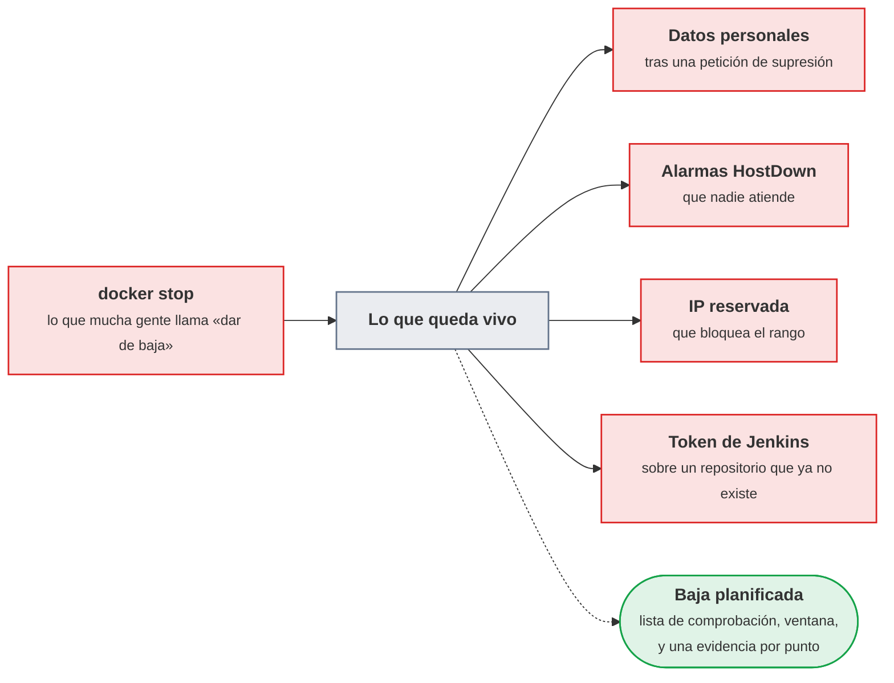
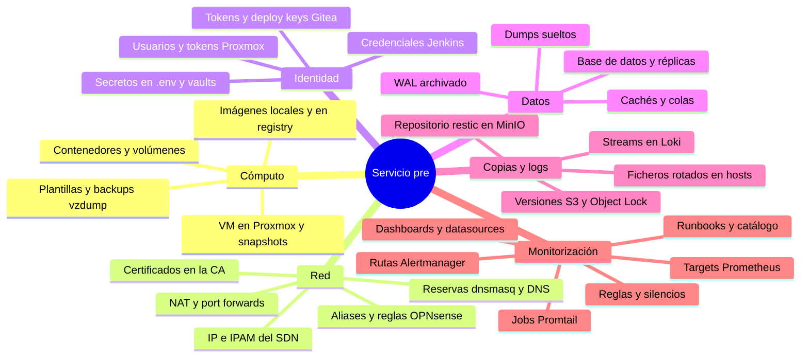
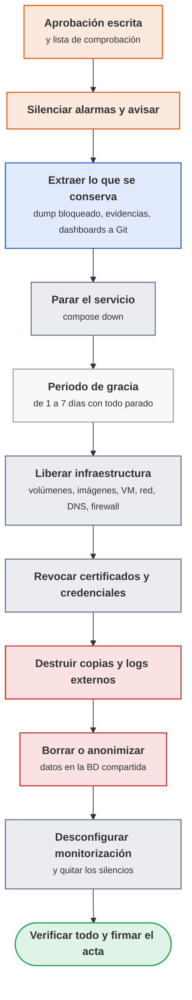
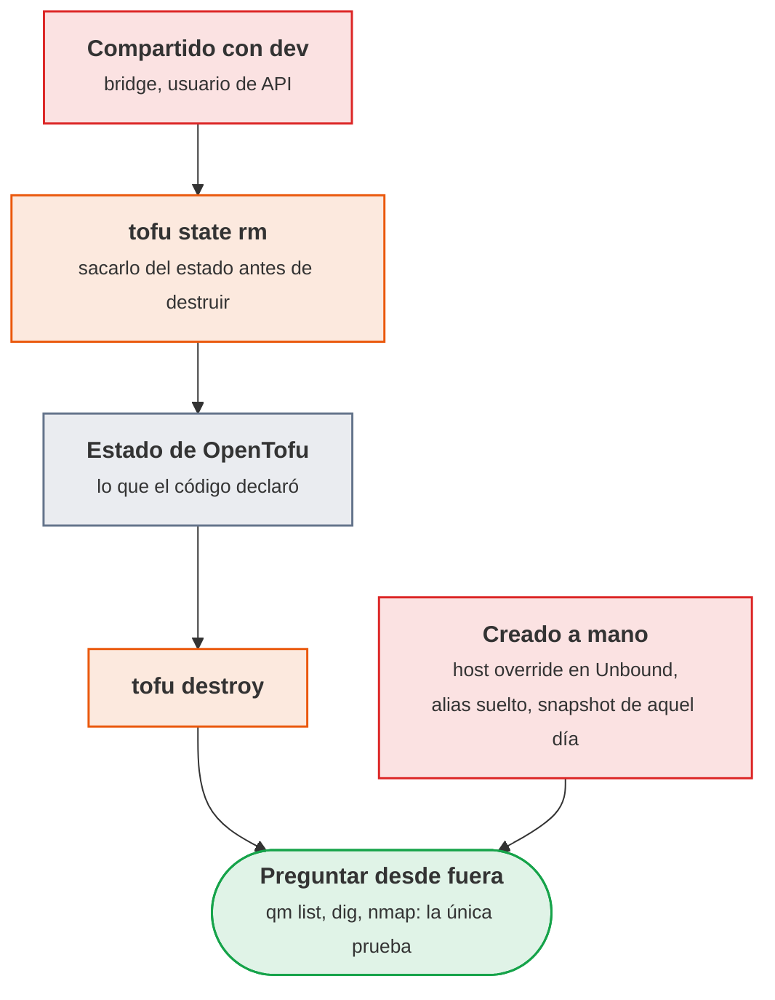
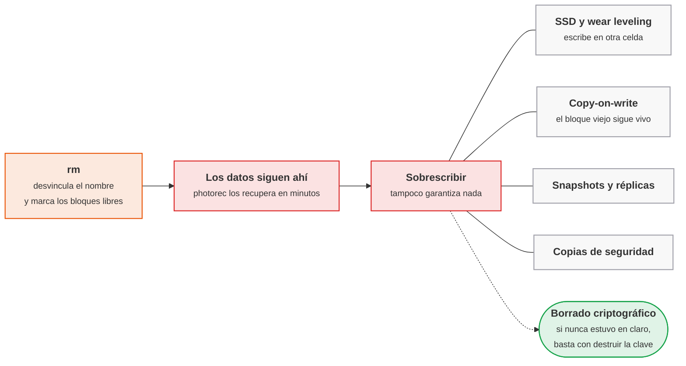

# UT8 · Terminación segura del contenedor

<p class="ut-meta">12 h · Sesiones 35 a 40 · RA5 CE a, b, c, d</p>

Esta es la última unidad en el centro. Durante el curso el servicio se ha levantado, instrumentado, protegido, probado, copiado y actualizado; ahora toca lo contrario: retirarlo sin dejar rastro. El sujeto de la baja es el entorno **pre** creado con OpenTofu en la UT7 para ensayar actualizaciones. Se da de baja de verdad: VM, red, DNS, reglas de firewall, certificados, credenciales, copias en MinIO, logs en Loki, datos en la base de datos y toda referencia en la monitorización. Después de la sesión 40, la práctica evaluable, quedan el 6 de abril como día de margen para recuperar entregas y repasar, el examen de la segunda evaluación el 8 de abril, que entra UT4, UT7 y UT8, y la formación en empresa, donde se pide exactamente esto cuando un cliente deja de serlo.

## Introducción

Antes de entrar en las sesiones, tres cosas: lo que hay que saber hacer al terminar la unidad, los conceptos y herramientas que van a aparecer, y el plan de las seis sesiones con lo que se explica y lo que se practica en cada una.

### Qué tienes que saber hacer al terminar

- Inventariar todo lo que un servicio ha dejado en la infraestructura y planificar su baja como un cambio con aprobación, ventana y comunicación (CE a).
- Terminar la aplicación y liberar contenedores, volúmenes, imágenes, VM, IP, DNS, reglas, certificados y credenciales, verificando cada punto con un comando (CE a).
- Eliminar copias de seguridad y logs externos de forma que nadie pueda recuperarlos, eligiendo el método según el soporte (CE b).
- Borrar o anonimizar datos confidenciales en una base de datos que sigue en uso, y saber por qué un DELETE no basta (CE c).
- Retirar targets, reglas, rutas, dashboards y conectividad de la monitorización sin disparar alarmas fantasma (CE d).
- Redactar un acta de baja con evidencias que aguante una auditoría.

### Los conceptos de la unidad

Un jueves de marzo, dos días después de "dar de baja" el entorno pre parando los contenedores, alguien hace push al repositorio del servicio. El job de pre en Jenkins seguía habilitado, así que construye una imagen nueva con etiqueta `-pre`, la sube al registry e intenta desplegarla en una VM que ya no existe. A la vez, Prometheus lleva dos días con cuatro targets en rojo, Alertmanager ha abierto una incidencia por cada uno y el compañero de guardia ha recibido avisos a las once de la noche por un servicio que todo el mundo sabía que se iba a apagar. Y en MinIO sigue habiendo un repositorio de copias con la base de datos completa de pre, con los correos y teléfonos de los usuarios de prueba, que nadie va a rotar ni a vigilar nunca más. Eso es lo que pasa cuando terminar un servicio se confunde con `docker stop`. El objetivo de la unidad es sencillo de decir: que del entorno pre no quede nada que no se haya decidido conservar, y poder demostrarlo con un acta en la que cada línea lleva su prueba.

| Herramienta o concepto | Qué es, en una frase | Para qué se usa en esta unidad |
|---|---|---|
| ITIL y el cambio normal | Un catálogo de buenas prácticas para gestionar servicios de TI; un "cambio normal" es el que necesita aprobación, evaluación de riesgo y ventana | Para tratar la baja como un cambio con solicitud, aprobación y acta, no como un apagado |
| RGPD, LOPDGDD y NIST SP 800-88 | Las dos normas de protección de datos aplicables en España y la guía del instituto de estándares de EE. UU. sobre borrado de soportes | Para decidir qué se conserva, hasta cuándo, y qué método de borrado vale para cada soporte |
| OpenTofu | La herramienta que describe la infraestructura en ficheros y la crea o destruye a partir de ellos (ya vista en 5166) | `tofu destroy` deshace el entorno pre que `tofu apply` creó, y `tofu state rm` protege lo que era compartido |
| Proxmox: `qm`, `pvesh`, vzdump | Los mandos de línea del hipervisor del aula y su sistema de copias de VM | Destruir VM, snapshots y backups vzdump, y liberar IP en el IPAM del SDN |
| Docker Compose y registry Distribution | Compose gestiona el conjunto de contenedores de un proyecto; el registry es el almacén de imágenes de gitea01 | `compose down -v --rmi all` limpia el host; el borrado por digest y el garbage collect limpian el registry |
| OPNsense, dnsmasq y la CA del curso | El firewall del laboratorio, el DNS del SDN y la autoridad que firmó los certificados de `*.pre.lab` | Quitar reglas y aliases, borrar registros DNS y revocar certificados publicando una CRL |
| Jenkins y Gitea | El servidor de integración continua y el gestor de repositorios de 5166 | Borrar credenciales, tokens, deploy keys y webhooks; deshabilitar el job y archivar el repositorio |
| restic y MinIO | El programa de copias cifradas del laboratorio y el almacén S3 del aula donde guarda el repositorio | Borrado criptográfico (destruir la clave del repositorio) y limpieza de versiones en un bucket versionado |
| Loki y `logcli` | El almacén de logs de la UT1 y su cliente de consulta por terminal | Enviar peticiones de borrado al compactor de Loki y comprobar que `{env="pre"}` no devuelve nada |
| Prometheus, Alertmanager (`amtool`) y Grafana | La pila de monitorización que se usa durante todo el curso; `amtool` es el cliente de terminal de Alertmanager | Silenciar, retirar targets, reglas, rutas y dashboards, borrar series del TSDB y expirar el silencio al final |
| PostgreSQL | La base de datos del servicio | Entender por qué `DELETE` no borra, usar `VACUUM FULL` y anonimizar con una sal de un solo uso |
| photorec y testdisk | Dos herramientas de recuperación de ficheros y particiones borrados | Demostrar sobre un volumen de pruebas qué se recupera tras `rm`, tras `shred` y con cifrado |

**Cómo está organizada la unidad.** La unidad sigue las seis sesiones en orden y cada sesión trae primero la teoría que se explica y después su hoja de práctica. En la sesión 35 se planifica la baja como un cambio y se inventaría todo lo que pre ha dejado en la infraestructura; de ahí sale la lista de comprobación. Las sesiones 36 y 37 ejecutan esa lista sobre la infraestructura, partida en dos mitades: primero lo que vive dentro de las máquinas (servicio, contenedores, volúmenes, imágenes y registry) y después lo que vive fuera (VM, direcciones, DNS, firewall, certificados y credenciales), que es la mitad que más tarda en verificarse. En la 38 se destruyen copias y logs externos entendiendo por qué borrar no borra, y en la 39 se limpian los datos de la base de datos compartida y la monitorización. La sesión 40 cierra con el acta de baja, que es el entregable evaluable; al final quedan los errores frecuentes como material de consulta.

!!! otra "Lo que hace falta de la otra asignatura"
    - El entorno pre que aquí se destruye nació con OpenTofu en la [UT5 de 5166](https://victor-educ.github.io/apuntes-5166/ut/ut5-iac/) (diciembre y enero). `tofu destroy` es el inverso exacto de aquel `tofu apply`; conviene tener a mano el repositorio `infra` y el estado.
    - Las credenciales del pipeline que se retiran (registry, SSH de app01-pre, token de Gitea) se crearon en la [UT6 de 5166](https://victor-educ.github.io/apuntes-5166/ut/ut6-ci/), que termina el 12 de marzo, justo un día después de la sesión 37, que es cuando aquí se borran. Conviene coordinar con el profesor de 5166 qué credencial es de pre y cuál sigue usando dev: allí el pipeline tiene que seguir desplegando contra dev cuando aquí pre ya no exista.
    - Las reglas de firewall, los aliases y la CA que se revocan vienen de la [UT3 de 5166](https://victor-educ.github.io/apuntes-5166/ut/ut3-seguridad-por-capas/) y de la UT3 de esta asignatura.
    - Mientras esta unidad termina, la [UT7 de 5166](https://victor-educ.github.io/apuntes-5166/ut/ut7-monitorizacion/) (17 de marzo a 7 de abril) monta la pila de monitorización "definitiva". Lo que aquí se desconfigura (targets, reglas, rutas, dashboards) es el ensayo inverso de esa instalación: cada cosa que se retira es una que allí habrá que dar de alta.
    - Las dos pilas viven en la misma máquina y usan los mismos puertos, así que los días 17 y 24 de marzo la de 5166 ocupa `mon01` y la de esta asignatura, la de `/opt/monitoring`, se para durante esa clase. Aquellas hojas la dejan levantada otra vez al terminar, que es lo que permite trabajar aquí el 18 y el 23. Si al empezar la sesión la pila no responde, lo primero es `docker compose up -d` en `/opt/monitoring`, no dar por perdida la configuración: los volúmenes con nombre siguen ahí.

### Plan de sesiones

Cada sesión son 110 minutos y empieza con una explicación corta antes del laboratorio. La columna «Se explica» recoge los apartados de teoría que se desarrollan en clase, con su duración aproximada; la columna «Se practica», el trabajo de laboratorio de esa sesión. Las sesiones marcadas solo como práctica no traen teoría nueva.

| Sesión | Fecha | Tipo | Se explica | Se practica |
|---:|-------|------|------------|-------------|
| [35](#sesion-35-plan-de-baja) | 25 feb | Teoría y práctica | La baja como cambio: aprobación, ventana, qué se conserva; dónde deja rastro un servicio (25 min). | Inventariar todo lo que el servicio ha dejado en el entorno y redactar la lista de comprobación de baja con verificación por punto. |
| [36](#sesion-36-liberar-la-infraestructura-servicio-y-contenedores) | 9 mar | Teoría y práctica | Orden correcto de la baja (10 min); cómo se liberan contenedores, volúmenes, imágenes y registry (15 min). | Parar el servicio y liberar contenedores, volúmenes, imágenes y redes; guardar el dump de bloqueo y los dashboards; borrar del registry por digest. |
| [37](#sesion-37-liberar-la-infraestructura-vm-red-y-credenciales) | 11 mar | Teoría y práctica | Lo que tofu destroy no se lleva; reglas antes que aliases; revocar no es borrar (10 min); cómo se liberan VM, IP, DNS, firewall, certificados y credenciales (20 min). | Destruir las VM con tofu destroy, liberar IP y DNS, quitar reglas y aliases, revocar certificados y borrar credenciales; verificar cada punto desde fuera. |
| [38](#sesion-38-copias-y-logs) | 16 mar | Teoría y práctica | Por qué borrar no borra: SSD, copy-on-write, versionado; borrado criptográfico (20 min). | Destruir la clave de restic, borrar versiones en S3, logs rotados y streams de Loki; intentar recuperar con photorec. |
| [39](#sesion-39-datos-y-monitorizacion) | 18 mar | Teoría y práctica | DELETE, DROP y VACUUM FULL; anonimización; desconfigurar targets, reglas y dashboards (15 min). | Anonimizar y borrar con VACUUM FULL; retirar targets, reglas, rutas, dashboards y Promtail; comprobar que no quedan series ni alarmas. |
| [40](#sesion-40-practica-evaluable) | 23 mar | Práctica evaluable | Aclaración del enunciado (10 min). | Cerrar el acta de baja con la lista de comprobación completa y una evidencia por punto. |

## Sesión 35 · Plan de baja

<p class="ut-meta" markdown>25 de febrero · Teoría y práctica · <span class="dur" tabindex="0" aria-label="La baja es un cambio más · 10 min&#10;Inventario de rastros · 15 min&#10;A8.1 Plan de baja · 85 min" data-dur="La baja es un cambio más · 10 min&#10;Inventario de rastros · 15 min&#10;A8.1 Plan de baja · 85 min">:material-school:<i class="dur-barra" style="--teoria:23%"></i>:material-flask:</span></p>

Al acabar esta sesión queda escrito el plan de baja del entorno pre: el inventario de todo lo que ha dejado en la infraestructura y la lista de comprobación con un comando de verificación por punto. La hoja se apoya en los dos apartados que se explican al principio: por qué la baja se trata como un cambio, con lo que la ley obliga a conservar, y el método para inventariar rastros a partir de las tres cadenas que hay que rastrear.

### La baja es un cambio más

Terminar un contenedor "para siempre" no es `docker stop`. Un servicio deja huella en la infraestructura, en la monitorización, en las copias y en los datos, y cada rastro es un coste o un riesgo: datos personales que siguen existiendo después de que el cliente pidiera su supresión, alarmas HostDown que nadie atiende, una IP reservada que impide reutilizar el rango, un token de Jenkins con permisos sobre un repositorio que ya no existe. Por eso la baja se planifica con una lista de comprobación y se documenta como cualquier otro cambio.



<p class="pie" markdown>Cada rastro que se queda es un coste o un riesgo. Por eso la baja se aprueba, se ejecuta y se documenta como cualquier otro cambio.</p>


En ITIL (el catálogo de buenas prácticas de gestión de servicios de TI), la baja de un servicio es un **cambio normal**: pasa por una solicitud (RFC), una evaluación de riesgo, la aprobación de quien tiene autoridad sobre el servicio (en una empresa pequeña el responsable técnico y el dueño del negocio; en una grande, el CAB, el comité que aprueba los cambios) y una ventana acordada. No es un cambio estándar (los cambios estándar son los repetitivos y de bajo riesgo, y una baja destruye datos, así que nunca lo es) ni una emergencia. En la práctica eso se traduce en cuatro cosas que tienen que existir antes de tocar nada:

1. **Confirmación escrita** del responsable del servicio con fecha. Un correo vale; una conversación en el pasillo no. Ese correo va al acta.
2. **Ventana de ejecución.** Aunque el servicio ya no dé tráfico, la baja toca sistemas compartidos (el firewall, Prometheus, la base de datos común). Se hace en horario en que alguien pueda deshacer un error.
3. **Comunicación.** A los usuarios que quedasen (aviso previo de cierre, normalmente con semanas), a los equipos que consumen la monitorización (para que no abran incidencias) y al equipo de soporte.
4. **Lista de lo que se conserva y hasta cuándo.** Esto es lo que más se olvida y lo que más problemas legales da en las dos direcciones: conservar de más incumple el principio de limitación del plazo de conservación, y borrar de menos incumple una obligación fiscal.

#### Qué hay que conservar por obligación legal

Esto no es asesoramiento jurídico, pero un técnico tiene que saber qué preguntar y a quién. En España los plazos orientativos son estos:

| Tipo de dato | Norma | Plazo habitual |
|---|---|---|
| Facturas y documentación contable | Código de Comercio, art. 30 | 6 años |
| Justificantes con trascendencia tributaria | Ley General Tributaria, art. 66 y siguientes | 4 años desde la prescripción |
| Datos personales de clientes tras el fin de la relación | RGPD art. 5.1.e y 17; LOPDGDD | Bloqueo (art. 32 LOPDGDD) mientras puedan derivarse responsabilidades; después supresión |
| Logs de acceso con IP o usuario | RGPD (son datos personales); ENS (Esquema Nacional de Seguridad) para el sector público | Entre 6 meses y 2 años según finalidad y política; el ENS pide al menos lo que dure el análisis de incidentes |
| Registros de actividades de tratamiento | RGPD art. 30 | Mientras exista el tratamiento, y se actualiza con la baja |

El mecanismo del artículo 32 de la LOPDGDD (bloqueo de datos) es el que da sentido a "qué se conserva por si acaso": los datos se dejan de tratar, se aíslan con acceso restringido al responsable y a la autoridad, y solo se destruyen cuando prescriben las responsabilidades. Técnicamente eso es un dump cifrado en un sitio al que solo llega el DPO (el delegado de protección de datos) o el responsable, con fecha de destrucción apuntada en el acta. Lo que no puede ser es "lo dejamos en el bucket de siempre porque nunca se sabe".

El acta tiene que decir, para cada categoría de datos, una de tres cosas: se destruye ahora (y cómo), se bloquea hasta una fecha (y dónde), o se transfiere a otro servicio que hereda el tratamiento.

### Inventario de rastros

Antes de borrar hay que saber qué hay. Un servicio de un año deja rastros en sitios que nadie recuerda, y el que mejor conoce el sistema se fue hace tres meses. Hace falta un método, no memoria. El mapa siguiente agrupa los rastros en seis familias; conviene fijarse en que la mitad no están en el servicio sino alrededor de él (red, identidad, copias, monitorización), y esas son las que se olvidan.



<p class="pie" markdown>Seis sitios donde queda rastro de un servicio. El que siempre se olvida es el último: la monitorización sigue vigilando algo que ya no existe.</p>

El método es buscar el nombre del servicio, su entorno y sus IP en todos los sitios donde pueda estar escrito. Con la etiqueta `env=pre`, el dominio `pre.lab` y el rango de IP asignado, hay tres cadenas que rastrear. Cada sistema se pregunta de una manera distinta, y la diferencia no es un capricho de cada herramienta: depende de dónde guarde la información y de si la deja ver en claro.

- **Repositorios de código y configuración.** Todo lo que está en Git se encuentra con un `git grep` de las tres cadenas sobre los cuatro repositorios de la asignatura más el de infraestructura de la 5166. Que salga una línea en `alerting/alerts.yml` que no estaba prevista es lo normal; se apunta.
- **Prometheus.** No basta con leer el fichero de configuración: hay que preguntar a su API por las series que existen ahora mismo con esa etiqueta, por los targets configurados aunque estén caídos y por las reglas que mencionan el entorno. Configuración y estado no siempre coinciden, y lo que sobra puede estar en cualquiera de los dos.
- **Jenkins.** Las credenciales no se ven con un grep porque están cifradas en `credentials.xml`; se listan por la API (o por la consola de scripts), igual que los jobs cuyo nombre contenga el entorno.
- **Gitea.** Tokens de acceso, deploy keys, webhooks y paquetes del registry viven en la base de datos del servidor, no en el repositorio, así que solo se ven por la API.
- **DNS y direcciones.** Hay que mirar dos cosas distintas: qué resuelve hoy, directo e inverso, y qué reservas siguen apuntadas en el IPAM (el registro de qué IP está asignada a quién) del SDN de Proxmox y en las leases de dnsmasq. Un nombre puede haber dejado de resolver y la dirección seguir reservada.
- **Firewall.** En OPNsense los aliases se buscan por la API, pero las reglas no tienen aún una API de búsqueda completa en todas las versiones, así que la fuente es la matriz de reglas que se mantiene en `operacion/`. Si no coincide con lo que hay en la interfaz, la matriz estaba mal, y eso también se apunta.
- **Certificados.** En la CA del curso no hay API que preguntar: el fichero `index.txt` lista todo lo emitido con su estado (V válido, R revocado, E expirado) y se lee buscando el dominio.
- **Proxmox.** VM, snapshots, backups vzdump y plantillas se listan con `qm` y `pvesm`, y los tokens de API creados para OpenTofu con `pveum`, porque son subsistemas distintos del hipervisor y cada uno tiene su mando.

Los comandos concretos de cada punto están en los pasos 2 a 5 de la [A8.1](#a81-plan-de-baja-sesion-35), que es donde se teclean.

El resultado de este inventario es una tabla: rastro, dónde, cómo se elimina, cómo se verifica, quién lo hace. Esa tabla es la lista de comprobación de la baja, y es la primera actividad de la unidad.

### A8.1 Plan de baja (sesión 35)

<span class="et et-obj">Objetivo</span> `operacion/baja/pre/plan.md` con el inventario de rastros de pre y la lista de comprobación de baja, con un comando de verificación por punto.

<span class="et et-pre">Antes de empezar</span>

- SSH a mon01, app01-pre, gitea01, al nodo Proxmox y a la CA; `$TOKEN` (Jenkins), `$GT` (Gitea), `$KEY` y `$SECRET` (OPNsense) exportados en la shell.
- Los cinco repositorios (`servicio`, `monitoring`, `alerting`, `operacion`, `iac-lab`) clonados en `~/repos/` y actualizados.
- Se ha explicado [la baja como cambio](#la-baja-es-un-cambio-mas) y [el inventario de rastros](#inventario-de-rastros); la [lista de comprobación completa](#lista-de-comprobacion-completa) es tu plantilla.

<span class="et et-pas">Pasos</span>

1. Crea `operacion/baja/pre/ev/` y `operacion/baja/pre/plan.md` con cuatro secciones: "Inventario de rastros" (tabla rastro, dónde, cómo se elimina, cómo se verifica, quién), "Lista de comprobación", "Qué se conserva" (tabla elemento, motivo, dónde, hasta, responsable) y "Hallazgos no esperados".

2. Rastrea las tres cadenas (`pre.lab`, `env=pre`, el rango `10.20.`) en los cinco repositorios y guarda la salida como primera evidencia:

    ```bash
    for r in servicio monitoring alerting operacion infra; do
      echo "== $r"; git -C ~/repos/$r grep -n -i -E 'pre\.lab|env="?pre"?|10\.20\.' -- . ':!*.lock'
    done | tee ~/repos/operacion/baja/pre/ev/00-grep-repos.txt
    ```

3. Pregunta por API, desde la misma shell, a los tres sistemas que no se dejan inventariar con un grep: Prometheus (valores de `job` con `env="pre"`, targets activos y reglas que mencionen pre), Jenkins (credenciales y jobs, que están cifrados en `credentials.xml`) y Gitea (tokens, deploy keys, webhooks y paquetes, que viven en su base de datos).

    ```bash
    P=http://10.10.0.20:9090
    curl -s "$P/api/v1/label/job/values?match[]={env=\"pre\"}" | jq .
    curl -s "$P/api/v1/targets" | jq '.data.activeTargets[] | select(.labels.env=="pre") | .scrapeUrl'
    curl -s "$P/api/v1/rules" | jq '.data.groups[].rules[] | select(.query|test("pre")) | .name'
    J=https://jenkins.lab
    curl -s -u ops:$TOKEN "$J/credentials/store/system/domain/_/api/json?depth=1" | jq '.credentials[] | {id, typeName, description}'
    curl -s -u ops:$TOKEN "$J/api/json?tree=jobs[name,color]" | jq '.jobs[]|select(.name|test("pre"))'
    G=https://gitea.lab/api/v1
    curl -s -H "Authorization: token $GT" $G/repos/ops/servicio/keys | jq '.[]|{id,title}'
    curl -s -H "Authorization: token $GT" $G/repos/ops/servicio/hooks | jq '.[]|{id,config}'
    curl -s -H "Authorization: token $GT" "$G/packages/ops?type=container" | jq '.[]|{name,version}'
    ```

4. En el nodo Proxmox y en el resolver: VM, snapshots, backups vzdump, tokens de API, IPAM, leases y DNS.

    ```bash
    qm list | grep pre
    for id in $(qm list | awk '/pre/{print $1}'); do qm listsnapshot $id; done
    for ID in 210 220 230; do pvesm list local --vmid $ID; done
    pveum user token list tofu@pve
    pvesh get /cluster/sdn/ipams/pve/status --output-format json | jq '.[]|select(.vnet|startswith("pre"))'
    grep -h pre /var/lib/misc/dnsmasq.*.leases 2>/dev/null
    dig +short app01.pre.lab @10.10.0.1; dig +short -x 10.20.2.10 @10.10.0.1
    ```

5. Aliases de OPNsense por API (las reglas, comparando la matriz de `operacion/` con la interfaz) y el `index.txt` de la CA:

    ```bash
    curl -s -k -u "$KEY:$SECRET" https://10.10.0.1/api/firewall/alias/searchItem | jq '.rows[]|select(.name|test("pre"))|{uuid,name,content}'
    grep -E 'pre\.lab' /etc/ca/index.txt
    ```

6. Rellena la tabla de inventario con una fila por rastro y las seis familias cubiertas. Lo que haya aparecido y no esperabas (una regla de `alerts.yml`, un alias en uso, un token olvidado) va a "Hallazgos no esperados".
7. Redacta la lista de comprobación en orden de ejecución, partiendo de la [lista completa](#lista-de-comprobacion-completa) y ajustándola a lo encontrado, con una línea por bloque que justifique su posición.
8. Rellena "Qué se conserva" (dump bloqueado, dashboards, repositorio archivado, obligaciones legales de la tabla de conservación) con motivo, dónde y hasta cuándo, y haz commit del plan y de la evidencia del grep.

<span class="et et-com">Comprobación</span> Cuatro secciones rellenas; ninguna fila sin "Cómo se verifica"; la lista empieza por aprobación y silencio y termina por expiración del silencio y acta; al menos un hallazgo no esperado (si no, repasa `alerting` y los aliases).

<span class="et et-ent">Entrega</span> `operacion/baja/pre/plan.md` y `operacion/baja/pre/ev/00-grep-repos.txt` en un commit del repositorio `operacion`.

<span class="et et-ext">Si te sobra tiempo</span> Redacta el correo de solicitud de baja (RFC) con fecha, ventana y lo que se conserva; guárdalo como `ev/01-aprobacion.txt`.

## Sesión 36 · Liberar la infraestructura: servicio y contenedores

<p class="ut-meta" markdown>9 de marzo · Teoría y práctica · <span class="dur" tabindex="0" aria-label="El orden importa · 10 min&#10;Cómo se libera cada capa dentro de la VM · 15 min&#10;A8.2 Liberar el servicio y los contenedores · 85 min" data-dur="El orden importa · 10 min&#10;Cómo se libera cada capa dentro de la VM · 15 min&#10;A8.2 Liberar el servicio y los contenedores · 85 min">:material-school:<i class="dur-barra" style="--teoria:23%"></i>:material-flask:</span></p>

Primera mitad de la baja de la infraestructura: la que ocurre dentro de las máquinas. Al terminar la sesión el servicio está parado, en app01 de pre no quedan contenedores, volúmenes, imágenes ni redes del proyecto, la imagen que estaba desplegada ha salido del registry, y el dump de bloqueo y los dashboards están guardados antes de que se destruya nada. Las VM siguen en pie a propósito: son el trabajo de la sesión siguiente. La sesión empieza por el orden de la baja y por la lista de comprobación entera, y sigue con cómo se libera cada capa dentro de la máquina: los bloques de comandos que teclea la hoja se ven antes en clase, de modo que en el laboratorio se copian y solo se les cambian los identificadores.

### El orden importa

Hay una secuencia correcta y no es "borrar de arriba abajo". Si el servicio se para antes de silenciar las alarmas, Alertmanager abre incidencias, el receptor webhook crea tickets y el equipo de guardia recibe un aviso a las diez de la noche por un servicio que se sabía que iba a apagarse. Si los volúmenes se borran antes de haber verificado que la copia bloqueada existe y se puede restaurar, ya no hay vuelta atrás. Si la VM se destruye antes de exportar las evidencias que están dentro (logs de auditoría, por ejemplo), el acta se queda sin pruebas.



<p class="pie" markdown>El periodo de gracia es el único paso reversible: una vez pasado, lo de la derecha ya no se puede deshacer. De ahí que se extraiga antes lo que se conserva.</p>

El periodo de gracia del paso E es opcional pero muy recomendable: el servicio está parado, nada se ha destruido, y si alguien grita ("el informe mensual tiraba de esa API") se levanta en un minuto. En una empresa una semana es lo habitual; en el laboratorio se simula con los dos días que separan la sesión 36 de la 37, con el servicio parado y las VM todavía en pie; a partir del borrado de los volúmenes la única vuelta atrás es la copia bloqueada.

Los silencios se quitan al final, no antes, y con criterio: si el silencio se retira con los targets todavía configurados, salta todo. Primero se retiran los targets y las reglas, se comprueba que no hay alertas pendientes, y entonces se expira el silencio.

#### Lista de comprobación completa

Esta es la lista de comprobación. Cada línea lleva el comando de verificación, porque una casilla marcada sin evidencia no vale nada en un acta.

- [ ] Aprobación escrita archivada (correo con fecha y nombre)
- [ ] Silencio en Alertmanager para `env="pre"` con duración mayor que la ventana: `amtool silence query env=pre`
- [ ] Dump bloqueado cifrado y guardado donde indica el acta; hash SHA-256 apuntado: `sha256sum pre-bloqueo.sql.gpg`
- [ ] Dashboards exportados a Git: `git -C operacion log -1 -- dashboards/pre/`
- [ ] Servicio parado: `docker compose -p servicio-pre ps -a` vacío
- [ ] Volúmenes eliminados: `docker volume ls -q --filter label=com.docker.compose.project=servicio-pre` vacío
- [ ] Imágenes locales eliminadas: `docker images --filter reference='registry.lab:5000/*:pre*'` vacío
- [ ] Imágenes borradas del registry y garbage collect ejecutado: `curl -s registry.lab:5000/v2/ops/api/tags/list`
- [ ] Redes eliminadas: `docker network ls --filter label=com.docker.compose.project=servicio-pre` vacío
- [ ] VM destruidas: `qm list | grep pre` vacío; `tofu state list` vacío
- [ ] Snapshots y backups vzdump del entorno eliminados: `pvesm list local --vmid 210`, `--vmid 220` y `--vmid 230` vacíos
- [ ] IP liberadas en IPAM y reservas dnsmasq: `pvesh get /cluster/sdn/ipams/pve/status` sin las vnets de pre
- [ ] DNS no resuelve: `dig +short app01.pre.lab @10.10.0.1` vacío
- [ ] Aliases y reglas de firewall eliminados; matriz actualizada; `nmap -Pn 10.20.1.10 -p 80,443,8080` sin respuesta
- [ ] Certificados revocados y CRL publicada: `openssl crl -in crl.pem -noout -text | grep -A2 'Serial Number: 1A'`
- [ ] Tokens y usuarios de Proxmox, Jenkins y Gitea eliminados: listados vacíos por API
- [ ] Proyecto en Jenkins deshabilitado y repositorio en Gitea archivado
- [ ] Clave del repositorio restic destruida: `restic -r s3:... snapshots` falla con "wrong password or no key found"
- [ ] Versiones y marcadores de borrado en S3 eliminados: `mc ls --versions --recursive s3/backups/pre/` vacío
- [ ] Streams de Loki borrados: `logcli query '{env="pre"}' --since=8760h` sin resultados
- [ ] Ficheros de log rotados eliminados en web01, app01, db01 y en mon01
- [ ] Tablas del servicio eliminadas y `VACUUM FULL` ejecutado; usuarios anonimizados: consulta de comprobación
- [ ] Réplicas, dumps sueltos, caché y colas revisados
- [ ] Targets, reglas, rutas, receptores, datasources y jobs Promtail retirados; `count({env="pre"})` sin datos tras la retención o tras `delete_series`
- [ ] Runbooks y catálogo de alarmas marcados como retirados con fecha
- [ ] Silencio expirado y sin alertas: `amtool alert query env=pre` vacío
- [ ] Acta firmada y guardada con las incidencias del servicio

### Cómo se libera cada capa dentro de la VM

Aquí empieza la parte de manos en el teclado. En esta primera mitad se devuelve lo que el entorno pre tenía asignado dentro de las máquinas: los contenedores, los volúmenes, las imágenes y las redes de Docker, y las imágenes que subió al registry de gitea01. Cada recurso tiene un comando para liberarlo y otro para comprobar que ya no está, y ese segundo es el que va al acta. La tabla resume el qué; el cómo y el por qué van debajo, por subapartados.

| Recurso | Cómo se libera | Cómo se verifica |
|---|---|---|
| Contenedores | `docker compose down` | `docker ps -a` vacío del proyecto |
| Volúmenes | `docker compose down -v`; `docker volume rm` | `docker volume ls`; espacio en `df -h` |
| Imágenes | `docker image rm`; `docker image prune -a` (con cuidado); borrar del registry | `docker images`; API del registry |
| Redes | `docker network rm` | `docker network ls` |

#### Docker en app01 de pre

`docker compose down` para y elimina contenedores y redes del proyecto, pero deja los volúmenes con nombre y las imágenes. Con `-v` elimina también los volúmenes declarados en el fichero y los anónimos; con `--rmi all` borra las imágenes que usaba el proyecto. Es la forma limpia de terminar un despliegue de Compose porque usa las etiquetas `com.docker.compose.project` para saber qué es suyo y no toca nada de otros proyectos del mismo host:

```bash
cd /opt/servicio && docker compose -p servicio-pre down -v --rmi all --remove-orphans
docker volume ls -q --filter label=com.docker.compose.project=servicio-pre   # vacío
docker network ls --filter label=com.docker.compose.project=servicio-pre     # vacío
docker ps -a --filter label=com.docker.compose.project=servicio-pre          # vacío
```

`--remove-orphans` limpia contenedores del proyecto que ya no aparecen en el fichero (por ejemplo, un sidecar retirado en la UT7 y que seguía parado). Lo que `down -v` no ve son los volúmenes creados a mano con `docker volume create` y montados como `external: true`. Esos hay que borrarlos con `docker volume rm` y, antes, mirar quién más los usa: `docker ps -a --filter volume=pgdata-pre`.

`docker image prune -a` borra todas las imágenes sin contenedor asociado del host entero, no solo las del proyecto. En app01 de pre, donde solo vive este servicio, es aceptable. En un host compartido no se ejecuta: se usa `docker image rm` con la referencia concreta. `docker system prune --volumes` es todavía más agresivo (contenedores parados, redes sin usar, imágenes colgantes, caché de build y volúmenes anónimos) y es lo que se deja ejecutado justo antes de destruir la VM, porque a esas alturas ya da igual.

El volumen borrado con `docker volume rm` es un `rm -rf` de `/var/lib/docker/volumes/<nombre>/_data`. Los bloques siguen en el disco de la VM. Se trata en el apartado de copias: la baja del volumen se completa cuando se destruye el disco de la VM, y de verdad cuando el disco estaba cifrado o cuando se sobrescribe.

#### Borrar del registry

Borrar una imagen del host no la quita del registry en gitea01, y ese es el rastro que más se olvida: la imagen `servicio:1.4.2-pre` con el `.env` de pruebas dentro de una capa sigue ahí para quien la pida. La API del registry de Distribution (la imagen `registry:2` del laboratorio) no borra por etiqueta, borra por **digest** del manifiesto (la huella SHA-256 que identifica su contenido), y solo si el registry arrancó con borrado habilitado (`REGISTRY_STORAGE_DELETE_ENABLED=true`). El registry del laboratorio va con TLS y htpasswd, así que estas llamadas necesitan además la CA del aula y las credenciales de lectura y escritura (`--cacert ca.crt -u ops:<clave>`), que se omiten aquí para no alargar cada línea.

```bash
R=https://registry.lab:5000
# 1. Obtener el digest del manifiesto (hay que pedir el media type correcto)
D=$(curl -sI -H 'Accept: application/vnd.oci.image.manifest.v1+json, application/vnd.docker.distribution.manifest.v2+json' \
     $R/v2/ops/api/manifests/1.4.2-pre | awk -F': ' '/[Dd]ocker-Content-Digest/{print $2}' | tr -d '\r')
echo $D    # sha256:9f2c...
# 2. Borrar el manifiesto por digest (borra todas las etiquetas que apunten a él)
curl -s -o /dev/null -w '%{http_code}\n' -X DELETE $R/v2/ops/api/manifests/$D   # 202
# 3. Comprobar
curl -s $R/v2/ops/api/tags/list
```

El paso 2 desvincula el manifiesto, pero las capas (blobs) siguen ocupando disco hasta que se ejecuta el recolector de basura, que necesita el registry parado o en modo solo lectura:

```bash
docker compose -f /opt/registry/compose.yml stop registry
docker compose -f /opt/registry/compose.yml run --rm registry garbage-collect --delete-untagged /etc/docker/registry/config.yml
docker compose -f /opt/registry/compose.yml start registry
```

Si en vez de `registry:2` se usa el registro de paquetes integrado en Gitea, la operación es `DELETE /api/v1/packages/ops/container/api/1.4.2-pre` y Gitea limpia los blobs en su tarea periódica de mantenimiento. Y si la imagen se subió a un registro público (Docker Hub, ghcr.io) para alguna prueba, hay que borrarla allí también; los registries públicos guardan el manifiesto en cachés intermedias durante horas.

### A8.2 Liberar el servicio y los contenedores (sesión 36)

<span class="et et-obj">Objetivo</span> El entorno pre parado y limpio por dentro: sin contenedores, volúmenes, imágenes ni redes del proyecto en app01-pre y sin la imagen desplegada en el registry, con el dump de bloqueo y los dashboards guardados antes de destruir nada y la salida de cada verificación en `operacion/baja/pre/ev/`.

<span class="et et-pre">Antes de empezar</span>

- El plan de A8.1 aprobado (nota del profesor con fecha en `ev/01-aprobacion.txt`).
- Acceso a app01-pre, a db01-pre, a gitea01 y a mon01; `$TOKEN` (Jenkins), `$GT` (Gitea) y `$GRAFANA_TOKEN` exportados en la shell.
- Se han explicado [el orden de la baja](#el-orden-importa) y [cómo se libera cada capa dentro de la VM](#como-se-libera-cada-capa-dentro-de-la-vm): los bloques de comandos de ese apartado son los que se copian aquí.

<span class="et et-pas">Pasos</span>

1. Silencia antes de tocar nada; el silencio dura más que la ventana entera, porque no se retira hasta la sesión 39:

    ```bash
    A=http://10.10.0.20:9093
    amtool --alertmanager.url=$A silence add env=pre --duration=12d --author="$USER" --comment="Baja servicio-pre, RFC en operacion/baja/pre"
    amtool --alertmanager.url=$A silence query env=pre | tee ~/repos/operacion/baja/pre/ev/02-silencio.txt
    ```

2. Extrae lo que se conserva: dump completo cifrado (bloqueo) y dashboards a Git.

    ```bash
    ssh db01-pre 'pg_dump -U app servicio' | gpg -e -r dpo@lab -o pre-bloqueo.sql.gpg
    sha256sum pre-bloqueo.sql.gpg | tee ~/repos/operacion/baja/pre/ev/03-dump-bloqueo.txt
    G=http://10.10.0.20:3000; H="Authorization: Bearer $GRAFANA_TOKEN"
    mkdir -p ~/repos/operacion/dashboards/pre
    for uid in $(curl -s -H "$H" "$G/api/search?tag=pre" | jq -r '.[].uid'); do
      curl -s -H "$H" $G/api/dashboards/uid/$uid | jq '.dashboard' > ~/repos/operacion/dashboards/pre/$uid.json
    done
    git -C ~/repos/operacion add dashboards/pre && git -C ~/repos/operacion commit -m "UT8: dashboards de pre archivados antes de la baja"
    ```

    El `.gpg` se entrega al profesor (hace de DPO) y no se sube al repositorio. Este es el paso que hay que hacer bien: a partir del siguiente, la única copia de los datos de pre es esta.

3. Deshabilita el job de pre en Jenkins antes de tocar el registry, para que un push no reconstruya imágenes:

    ```bash
    curl -s -o /dev/null -w '%{http_code}\n' -X POST -u ops:$TOKEN https://jenkins.lab/job/servicio-pre/disable
    ```

4. Para el servicio sin destruir todavía nada, y comprueba que no queda contenedor ni red del proyecto:

    ```bash
    cd /opt/servicio && docker compose -p servicio-pre down --remove-orphans
    { docker ps -a --filter label=com.docker.compose.project=servicio-pre
      docker network ls --filter label=com.docker.compose.project=servicio-pre; } | tee ev/04-docker.txt
    ```

    Hasta aquí todo es reversible: los volúmenes siguen ahí y un `compose up -d` devolvería el servicio. Esa reversibilidad es el periodo de gracia del diagrama, y en el laboratorio dura los dos días que faltan hasta la sesión siguiente.

5. Volúmenes e imágenes, que es lo que `down` no se lleva:

    ```bash
    docker compose -p servicio-pre down -v --rmi all --remove-orphans
    docker volume rm pgdata-pre                      # los volúmenes external, a mano
    { docker volume ls -q --filter label=com.docker.compose.project=servicio-pre
      docker images --filter reference='registry.lab:5000/*:pre*'; } | tee -a ev/04-docker.txt
    docker system prune -af --volumes
    ```

6. Borra del registry **una sola etiqueta**, la de la imagen que estaba desplegada, para ver de cerca que se borra por digest y no por nombre. Las demás etiquetas `-pre` y el recolector de basura son lo mismo repetido: van al paso 7 con su comando.

    ```bash
    R=https://registry.lab:5000; T=1.4.2-pre
    D=$(curl -sI -H 'Accept: application/vnd.oci.image.manifest.v1+json, application/vnd.docker.distribution.manifest.v2+json' \
         $R/v2/ops/api/manifests/$T | awk -F': ' '/[Dd]ocker-Content-Digest/{print $2}' | tr -d '\r')
    echo $D; curl -s -o /dev/null -w '%{http_code}\n' -X DELETE $R/v2/ops/api/manifests/$D   # 202
    curl -s $R/v2/ops/api/tags/list | tee ev/05-registry.txt
    ```

    Si responde 405, el registry no arrancó con `REGISTRY_STORAGE_DELETE_ENABLED=true` y eso es un hallazgo: anótalo en "Incidencias" y sigue.

7. Cierra la mitad de hoy en `plan.md`. Marca cada punto ejecutado con su evidencia y escribe como filas de la lista de comprobación, con comando de baja, comando de verificación, responsable y fecha, lo que no se ejecuta hoy: el resto de etiquetas `-pre` del registry con su recolector de basura, y las capas de la sesión siguiente (VM, direcciones, DNS, reglas, certificados y credenciales). Esas filas son los "pendientes con fecha" del acta, y sin comando no valen. Apunta en "Incidencias" cualquier desviación y haz commit.

<span class="et et-com">Comprobación</span> Los cuatro listados de `ev/04-docker.txt` vacíos; el DELETE del manifiesto responde `202` y `ev/05-registry.txt` ya no trae la etiqueta borrada; el silencio de `ev/02-silencio.txt` expira después de la sesión 39; el hash del dump de bloqueo apuntado en `ev/03-dump-bloqueo.txt`; el job de pre en `disabled`. Las VM de pre siguen en pie y `qm list | grep pre` todavía las lista: al acabar hoy, eso es lo correcto.

<span class="et et-ent">Entrega</span> Commit en `operacion` con `plan.md` al día y las evidencias `ev/02` a `ev/05`; el `pre-bloqueo.sql.gpg` entregado al profesor fuera del repositorio.

<span class="et et-ext">Si te sobra tiempo</span> Borra las demás etiquetas `-pre` del registry y lanza el recolector de basura con el registry parado, guardando el listado de etiquetas en `ev/05b-gc.txt` y marcando esa fila de la lista de comprobación como ejecutada. Después comprueba si el registro de paquetes de Gitea guarda alguna versión `-pre` (`GET /api/v1/packages/ops?type=container`) y anótalo.

## Sesión 37 · Liberar la infraestructura: VM, red y credenciales

<p class="ut-meta" markdown>11 de marzo · Teoría y práctica · <span class="dur" tabindex="0" aria-label="Destruir lo declarado no basta · 10 min&#10;Cómo se libera cada capa fuera de la VM · 20 min&#10;A8.3 Liberar la VM, la red y las credenciales · 80 min" data-dur="Destruir lo declarado no basta · 10 min&#10;Cómo se libera cada capa fuera de la VM · 20 min&#10;A8.3 Liberar la VM, la red y las credenciales · 80 min">:material-school:<i class="dur-barra" style="--teoria:27%"></i>:material-flask:</span></p>

Segunda mitad de la baja: lo que vive fuera de las máquinas. Al terminar la sesión las VM no existen, las direcciones están libres, el nombre no resuelve, no quedan reglas ni aliases, los certificados están revocados con la CRL publicada y no sobrevive ninguna credencial de pre en Proxmox, Gitea ni Jenkins. Lo que distingue esta mitad de la anterior es la verificación: dentro de una máquina basta con que un listado salga vacío, y aquí hay que preguntar desde fuera, que es lo que de verdad prueba que algo ya no está. La sesión empieza por las trampas de destruir infraestructura declarada y sigue con cómo se libera cada capa fuera de la máquina, que es el apartado más largo de la unidad y del que sale entero el procedimiento de la hoja: en el laboratorio los bloques se copian de ahí y solo se les cambian los identificadores inventariados en la A8.1. Por eso la explicación se lleva hoy la mayor parte de teoría de la unidad.

### Destruir lo declarado no basta

`tofu destroy` deshace lo que el código declaró, ni más ni menos, y en esa frase caben tres trampas que aparecen las tres en la hoja de esta sesión.

**Lo que se creó a mano no está en el estado.** El estado de OpenTofu es la lista de lo que la herramienta creó. El host override que alguien puso en Unbound para que `app01.pre.lab` resolviera antes de tiempo, el alias que se añadió a mano en OPNsense una tarde de pruebas o el snapshot que se tomó antes de una actualización no están ahí, y sobreviven intactos a `tofu destroy`. Por eso el inventario de la A8.1 se hizo preguntando a cada sistema en vez de leyendo el código, y por eso la verificación se hace contra el sistema y nunca contra el plan.

**Y lo que está en el estado no siempre es de pre.** El caso contrario destruye de más: si el módulo de red o el usuario de API de Proxmox entraron en el estado de este entorno, `tofu destroy` se los lleva y con ellos el entorno dev, que los comparte. `tofu plan -destroy` es el único sitio donde eso se ve antes de que pase, y `tofu state rm` saca el recurso del estado sin tocarlo en el hipervisor.

**En OPNsense, las reglas antes que los aliases.** Un alias al que apunta una regla no se deja borrar, y hace bien: el orden correcto es quitar las reglas, aplicar y entonces borrar los aliases. Si al borrar un alias el firewall responde que está en uso, no es un problema de la herramienta, es que queda una regla que nadie había inventariado. Eso es un hallazgo y va al acta.

**Revocar una credencial no es lo mismo que borrarla.** Un certificado borrado del servidor sigue siendo válido hasta su fecha de caducidad para cualquiera que conserve una copia de la clave privada; lo único que lo invalida es revocarlo y publicar la CRL donde apunta el `crlDistributionPoints` de los certificados emitidos. Con un token pasa al revés: muere en cuanto se borra del sistema que lo emitió, pero las copias que viajaron (un `.env` en un portátil, el estado de OpenTofu, un workspace de Jenkins) no se borran solas y hay que pedir su destrucción por escrito. En el acta se anotan por separado las dos cosas: qué se revocó y a quién se le pidió destruir qué.



<p class="pie" markdown>`tofu destroy` solo deshace lo declarado. Lo creado a mano y lo compartido con **dev** se tratan aparte, y la prueba de que algo ya no existe es siempre una pregunta desde fuera.</p>

### Cómo se libera cada capa fuera de la VM

La segunda mitad devuelve lo que el entorno tenía asignado fuera de las máquinas: las propias VM con sus copias, las direcciones, el DNS, las reglas del firewall, los certificados y las credenciales. Cada recurso tiene un comando para liberarlo y otro para comprobar que ya no está, y aquí ese segundo comando se lanza desde fuera del recurso: el hipervisor no lista la VM, el resolutor no resuelve el nombre, el escaneo no encuentra puerto abierto. La tabla resume el qué; el cómo y el por qué van debajo, por subapartados.

| Recurso | Cómo se libera | Cómo se verifica |
|---|---|---|
| Máquinas virtuales | `tofu destroy` del entorno ([5166 UT5](https://victor-educ.github.io/apuntes-5166/ut/ut5-iac/)) o `qm destroy` | Proxmox sin la VM; estado de OpenTofu vacío |
| Snapshots y backups vzdump | `pvesm free`; `proxmox-backup-client forget` | `pvesm list local --vmid` vacío |
| IP, DNS, DHCP | Quitar reserva en dnsmasq / IPAM del SDN; borrar registros | `dig` no resuelve; reserva libre |
| Reglas de firewall y NAT | Eliminar reglas y aliases del servicio | Matriz de reglas actualizada; escaneo |
| Certificados | Revocar en la CA | CRL y respuesta OCSP |
| Credenciales | Borrar usuarios de servicio, tokens, credenciales en Jenkins, secretos | Inventario de credenciales |
| Pipeline y repositorio | Archivar el proyecto en Jenkins/Gitea (no borrar el código) | Lista de proyectos |

#### OpenTofu y el estado

El entorno pre nació con `tofu apply` sobre el código de la 5166 UT5, así que muere con `tofu destroy`. Antes de ejecutarlo hay que mirar el plan: `tofu plan -destroy` muestra todo lo que va a desaparecer, y ahí es donde se descubre que el módulo de red compartía la vnet con dev o que el estado incluye el usuario de API de Proxmox que otros entornos usan.

```bash
cd infra/envs/pre
tofu plan -destroy -out=destroy.plan
# revisar: solo recursos de pre; si hay algo compartido, sacarlo del estado sin destruirlo
tofu state rm module.red.proxmox_virtual_environment_network_linux_bridge.vmbr_shared
tofu apply destroy.plan
tofu state list          # vacío
```

`tofu state rm` quita un recurso del estado sin tocarlo en Proxmox; es la herramienta para decir "esto no es de pre, que no se destruya". Cuando el estado queda vacío, el fichero `terraform.tfstate` (o el workspace en el backend remoto) todavía contiene el historial y, en el caso del provider de Proxmox, puede contener datos sensibles como la contraseña de cloud-init en claro. El estado se borra también: `tofu workspace delete pre` con workspaces, o el fichero y sus copias `.backup` si es local. El estado va al mismo tratamiento que un dump de base de datos.

#### Proxmox: qm destroy y lo que arrastra

Si OpenTofu no puede (el estado se perdió, la VM se creó a mano), se hace con `qm`:

```bash
qm stop 210 --timeout 60
qm listsnapshot 210
qm destroy 210 --purge --destroy-unreferenced-disks 1
```

`--purge` quita la VM de los trabajos de backup, de la replicación y de la configuración de alta disponibilidad; sin él, el job de vzdump (las copias de VM de Proxmox) del domingo fallará con "VM 210 not found" cada semana hasta que alguien lo edite. `--destroy-unreferenced-disks` borra también los discos que quedaron huérfanos en el storage (por ejemplo, un `vm-210-disk-1` desvinculado para probar algo). Los snapshots se destruyen con la VM. Lo que **no** se destruye son los backups vzdump ya hechos ni las plantillas clonadas de esa VM:

```bash
pvesm list local --vmid 210       # backups vzdump
pvesm free local:backup/vzdump-qemu-210-2027_02_28-02_00_01.vma.zst
qm list | awk '$1>=9000'          # plantillas; comprobar si alguna nació de pre
```

En Proxmox Backup Server, si está en uso, los snapshots del grupo `vm/210` se eliminan con `proxmox-backup-client forget` o desde la interfaz, y el espacio se libera en el siguiente garbage collect del datastore, que respeta un periodo de 24 horas y 5 minutos sobre los chunks. Hasta entonces, los datos están ahí.

#### Direcciones, DNS y firewall

Con el SDN de Proxmox y el IPAM integrado (`pve`), las IP se asignan por vnet y las reservas se guardan en el IPAM y en la configuración de dnsmasq. Al destruir las vnets de pre con OpenTofu se liberan las dos cosas; si alguna sigue porque es compartida, se liberan las IP una a una, cada una en la vnet de su zona:

```bash
pvesh delete /cluster/sdn/vnets/preback/ips --zone lab --vnet preback --ip 10.20.2.10
pvesh delete /cluster/sdn/vnets/prefront/ips --zone lab --vnet prefront --ip 10.20.1.10
pvesh delete /cluster/sdn/vnets/predata/ips --zone lab --vnet predata --ip 10.20.3.10
pvesh set /cluster/sdn                       # aplicar
pvesh get /cluster/sdn/ipams/pve/status --output-format json | jq '.[]|select(.ip|startswith("10.20."))'
```

Los registros DNS del laboratorio los sirve Unbound (el resolutor DNS integrado en OPNsense) mediante host overrides o el propio dnsmasq del SDN según cómo se montara en la 5166 UT2. En cualquiera de los dos, la verificación es la misma: `dig` con `+short` contra el resolver del laboratorio no devuelve nada, ni en directa ni en inversa. Un DNS que sigue resolviendo un nombre a una IP libre es un problema de seguridad futuro: cuando esa IP se reasigne, `app01.pre.lab` apuntará a una máquina que no es.

En OPNsense, el orden es reglas primero y aliases después, porque un alias en uso no se puede borrar. Las reglas que permitían a mon01 llegar a los exporters de pre (las de la UT3 de esta asignatura) y las de NAT hacia web01 de pre desaparecen; los aliases `pre_front`, `pre_back`, `pre_data` también. Luego `Apply changes` o, por API, `firewall/filter/apply` y `firewall/alias/reconfigure`. La verificación no es mirar la interfaz: es un escaneo desde fuera y desde mon01 que ya no llega a nada, y la matriz de reglas de `operacion/` actualizada en un commit.

#### Certificados: revocar en la CA propia

Los certificados de `*.pre.lab` que emitió la CA del curso siguen siendo válidos hasta su fecha de caducidad aunque la máquina haya desaparecido. Si alguien conserva la clave privada (estaba en un volumen, en un backup, en el estado de OpenTofu), puede suplantar el servicio. Revocar es lo único que lo impide, y solo funciona si los clientes consultan la CRL (la lista de certificados revocados que publica la CA) o un respondedor OCSP (el servicio que contesta en línea si un certificado concreto está revocado).

```bash
cd /etc/ca
openssl ca -config ca.cnf -revoke certs/app01.pre.lab.pem -crl_reason cessationOfOperation
openssl ca -config ca.cnf -gencrl -out crl/ca.crl.pem
openssl crl -in crl/ca.crl.pem -noout -text | grep -B1 -A3 'cessationOfOperation'
cp crl/ca.crl.pem /var/www/ca/ca.crl      # donde apunta el crlDistributionPoints de los certificados
```

El motivo `cessationOfOperation` es el correcto para una baja (no `keyCompromise`, salvo constancia de que la clave se filtró). Para OCSP con OpenSSL basta un respondedor mínimo sobre el mismo `index.txt`:

```bash
openssl ocsp -index index.txt -CA ca.pem -rsigner ocsp.pem -rkey ocsp.key -port 2560 -text &
openssl ocsp -issuer ca.pem -cert certs/app01.pre.lab.pem -url http://ca.lab:2560 -resp_text | grep 'Cert Status'
# Cert Status: revoked
```

Si la CA es step-ca, es `step ca revoke --cert app01.pre.lab.pem --key app01.pre.lab.key --reason cessationOfOperation` y el propio step-ca responde OCSP. El certificado de la CA no se toca; lo que se revoca son las hojas. Y la clave privada del servicio se destruye con el resto del entorno, que es lo que hace innecesaria la revocación en la práctica pero no en la teoría: la revocación cubre las copias de la clave cuya existencia se desconoce.

#### Credenciales y tokens

Cada sistema tiene las suyas y todas hay que tocarlas. Un token que sobrevive a su servicio es una credencial huérfana: nadie lo rota, nadie lo audita y sigue siendo válido.

```bash
# Proxmox: token de API que usaba OpenTofu para pre, y el usuario si era exclusivo
pveum user token remove tofu@pve pre
pveum user delete tofu-pre@pve
pveum user token list tofu@pve

# Gitea: token de acceso del pipeline, deploy key y webhook del repositorio
curl -X DELETE -H "Authorization: token $GT" https://gitea.lab/api/v1/users/jenkins/tokens/pre-deploy
curl -X DELETE -H "Authorization: token $GT" https://gitea.lab/api/v1/repos/ops/servicio/keys/7
curl -X DELETE -H "Authorization: token $GT" https://gitea.lab/api/v1/repos/ops/servicio/hooks/3

# Jenkins: credencial del entorno pre (registry, SSH de app01-pre, token de Gitea)
curl -X POST -u ops:$TOKEN https://jenkins.lab/credentials/store/system/domain/_/credential/pre-ssh-app01/doDelete
```

Además de lo que está en los sistemas, están los secretos que viajaron: el `.env` de pre que alguien tiene en su portátil, la contraseña de cloud-init en el estado de OpenTofu, el `pass` de restic en `/etc/restic/` de app01-pre. La destrucción de la VM se lleva los de dentro; los de fuera se piden por escrito y se anotan como "solicitada destrucción a X, confirmada el día Y".

#### Archivar, no borrar el código

El repositorio del servicio y el Jenkinsfile no se borran: son el registro de cómo se hizo y pueden hacer falta para una auditoría o para resucitar el servicio. En Gitea, el repositorio se archiva (Settings, Danger Zone, Archive, o `PATCH /api/v1/repos/ops/servicio` con `{"archived": true}`): queda en solo lectura, no acepta pushes ni issues, y se ve en la lista con la marca de archivado. En Jenkins no hay "archivar": el job de pre se deshabilita (`Disable Project`, o `POST /job/servicio-pre/disable`) y se mueve a una carpeta `archivo/`; el Jenkinsfile sigue en el repositorio. Borrar el job elimina también el historial de builds y sus artefactos, que a veces son la única evidencia de qué versión se desplegó cuándo.

### A8.3 Liberar la VM, la red y las credenciales (sesión 37)

<span class="et et-obj">Objetivo</span> El entorno pre sin VM, sin IP, sin DNS, sin reglas ni aliases, con los certificados revocados y la CRL publicada y sin credenciales vivas, cada punto verificado desde fuera (`qm list` y `tofu state list` vacíos, `dig` sin respuesta, escaneo sin puertos) y guardado en `operacion/baja/pre/ev/`, y lo que hoy no se ejecuta entero anotado en la lista de comprobación con su comando y su fecha.

<span class="et et-pre">Antes de empezar</span>

- A8.2 terminada: el servicio parado, el host limpio y el dump de bloqueo entregado.
- `infra/envs/pre` con su estado, `tofu` instalado y el token de Proxmox del provider exportado.
- Acceso al nodo Proxmox, a la CA y a OPNsense, y `$TOKEN`, `$GT`, `$KEY` y `$SECRET` exportados en la shell desde la que se llama a las API de Gitea, Jenkins y el firewall.
- Se han explicado [lo que `tofu destroy` no se lleva](#destruir-lo-declarado-no-basta) y [cómo se libera cada capa fuera de la VM](#como-se-libera-cada-capa-fuera-de-la-vm). Los bloques de ese apartado se copian aquí tal cual: lo único que cambia son los identificadores que inventariaste en la A8.1 (IDs de VM, nombre del fichero vzdump, nombres de alias, fichero del certificado, y los números del token, la deploy key y el webhook).

Los pasos están agrupados por máquina a propósito: cada cambio de máquina cuesta tiempo, así que el nodo Proxmox se visita una sola vez y todo lo que se hace por API se hace desde la misma shell.

<span class="et et-pas">Pasos</span>

1. Plan de destrucción, limpieza del estado y ejecución, y la comprobación desde fuera de que las VM ya no existen, que es lo que va al acta. Lee el plan entero antes de aplicarlo: es el único momento en que se ve qué va a desaparecer. Lo que salga y no sea de pre, sácalo del estado y anótalo en "Incidencias".

    ```bash
    cd ~/repos/infra/envs/pre
    tofu plan -destroy -out=destroy.plan | tee ~/repos/operacion/baja/pre/ev/06-tofu-plan.txt
    # si el plan lista algo que no es de pre (bridge compartido, usuario de API):
    tofu state rm module.red.proxmox_virtual_environment_network_linux_bridge.vmbr_shared
    tofu apply destroy.plan
    { tofu state list; qm list | grep pre; ping -c1 -W2 10.20.2.10; } 2>&1 \
      | tee ~/repos/operacion/baja/pre/ev/07-tofu-state.txt
    ```

    Los tres tienen que salir vacíos o fallar. Si el estado de OpenTofu no sirvió y las VM siguen ahí, se destruyen con un bucle en vez de una a una: `for ID in 210 220 230; do qm stop $ID --timeout 60; qm destroy $ID --purge --destroy-unreferenced-disks 1; done` (son `web01`, `app01` y `db01` de pre; la 200 es `router-pre`, si el entorno lo tiene).

2. Todo lo demás que se hace en el nodo Proxmox, en una sola visita y en este orden: liberar los backups vzdump (que la destrucción de la VM no se lleva), mirar el IPAM, preguntar al DNS en directa y en inversa, y borrar el token y el usuario de API que usaba OpenTofu. Los tres IDs se recorren con un bucle en vez de repetir el comando tres veces:

    ```bash
    for ID in 210 220 230; do pvesm list local --vmid $ID; done | tee ev/08-proxmox.txt
    pvesm free local:backup/vzdump-qemu-210-2027_02_28-02_00_01.vma.zst   # uno por cada fichero que haya listado
    for ID in 210 220 230; do pvesm list local --vmid $ID; done | tee -a ev/08-proxmox.txt
    { pvesh get /cluster/sdn/ipams/pve/status --output-format json | jq '.[]|select(.ip|startswith("10.20."))'
      dig +short app01.pre.lab @10.10.0.1; dig +short -x 10.20.2.10 @10.10.0.1; } | tee ev/09-red-dns.txt
    pveum user token remove tofu@pve pre; pveum user delete tofu-pre@pve 2>/dev/null
    pveum user token list tofu@pve | tee ev/12-credenciales.txt
    ```

    Si el IPAM aún lista alguna IP porque la vnet era compartida, libérala con el `pvesh delete` del [apartado de direcciones](#direcciones-dns-y-firewall) y aplica con `pvesh set /cluster/sdn`. Si `dig` sigue resolviendo, el registro es un host override de Unbound puesto a mano en la 5166: bórralo en el paso siguiente y repite la verificación.

3. En OPNsense, reglas primero y aliases después, que es el orden que obliga el firewall. Las dos reglas (mon01 hacia los exporters de pre y el NAT hacia web01-pre) se quitan en la interfaz según la matriz de `operacion/`; los tres aliases salen de un tirón por API. Si al borrar un alias responde que está en uso, queda una regla sin inventariar: anótala en "Incidencias". La verificación que vale es el escaneo desde fuera:

    ```bash
    O=https://10.10.0.1/api/firewall
    for A in pre_front pre_back pre_data; do
      U=$(curl -s -k -u "$KEY:$SECRET" $O/alias/searchItem | jq -r ".rows[]|select(.name==\"$A\")|.uuid")
      [ -n "$U" ] && curl -s -k -u "$KEY:$SECRET" -X POST $O/alias/delItem/$U
    done
    curl -s -k -u "$KEY:$SECRET" -X POST $O/alias/reconfigure
    nmap -Pn 10.20.1.10 -p 80,443,8080 | tee ev/10-firewall.txt
    ```

    Corrige la matriz de reglas de `operacion/`; su commit va con el del paso 6.

4. Revoca en la CA **un** certificado, el de la máquina que estaba publicada, y publica la CRL. Con uno basta para ver el mecanismo entero y para que la CRL exista; los demás `*.pre.lab` son el mismo comando cambiando el fichero y van al paso 6 con el suyo. El bloque es el del [apartado de certificados](#certificados-revocar-en-la-ca-propia) con el nombre del fichero cambiado:

    ```bash
    cd /etc/ca
    openssl ca -config ca.cnf -revoke certs/web01.pre.lab.pem -crl_reason cessationOfOperation
    openssl ca -config ca.cnf -gencrl -out crl/ca.crl.pem
    cp crl/ca.crl.pem /var/www/ca/ca.crl
    openssl crl -in crl/ca.crl.pem -noout -text | grep -B1 -A3 'cessationOfOperation' \
      | tee ~/repos/operacion/baja/pre/ev/11-crl.txt
    ```

    La clave privada se destruyó con la VM en el paso 1, así que esto no protege de nada que sepas; protege de las copias de esa clave cuya existencia desconoces, que es la razón por la que se revoca igual.

5. Gitea y Jenkins, todo por API desde la misma shell. Ajusta los identificadores a los que listaste en la A8.1, ejecuta el bloque entero y archiva el repositorio en último lugar, porque uno archivado ya no acepta cambios en sus claves ni en sus webhooks:

    ```bash
    G=https://gitea.lab/api/v1
    curl -X DELETE -H "Authorization: token $GT" $G/users/jenkins/tokens/pre-deploy
    curl -X DELETE -H "Authorization: token $GT" $G/repos/ops/servicio/keys/7
    curl -X DELETE -H "Authorization: token $GT" $G/repos/ops/servicio/hooks/3
    curl -X POST -u ops:$TOKEN https://jenkins.lab/credentials/store/system/domain/_/credential/pre-ssh-app01/doDelete
    { curl -s -u ops:$TOKEN "https://jenkins.lab/credentials/store/system/domain/_/api/json?depth=1" | jq '.credentials[]|{id}'
      curl -s -H "Authorization: token $GT" $G/repos/ops/servicio/keys
      curl -s -H "Authorization: token $GT" $G/repos/ops/servicio/hooks; } | tee -a ev/12-credenciales.txt
    curl -s -X PATCH -H "Authorization: token $GT" -H 'Content-Type: application/json' \
      -d '{"archived": true}' $G/repos/ops/servicio | jq '.archived' | tee ev/13-archivado.txt
    ```

    El repositorio se archiva, no se borra, y el job de Jenkins sigue deshabilitado desde la A8.2 con su historial: son la única prueba de qué versión se desplegó y cuándo.

6. Cierra el plan. Marca en `plan.md` cada punto ejecutado con su evidencia y escribe como filas de la lista de comprobación, con comando de baja, comando de verificación, responsable y fecha, lo que no se ejecuta hoy: los demás certificados de `*.pre.lab` por revocar, las plantillas nacidas de pre que sigan en el hipervisor y los secretos que viajaron fuera de los sistemas (un `.env` en un portátil, una copia del estado). Esas filas son los "pendientes con fecha" del acta, y sin comando no valen. Apunta en "Incidencias" cualquier desviación y haz un solo commit con `plan.md`, las evidencias y la matriz de reglas corregida.

<span class="et et-com">Comprobación</span> `tofu state list` vacío y `qm list | grep pre` sin salida; el `ping` a las direcciones de pre falla; `dig` sin respuesta en directa y en inversa; `nmap` sin puertos abiertos; la CRL publicada con el certificado revocado dentro; los listados de credenciales de `ev/12` sin nada de pre y `archived: true`; ninguna fila de la lista de comprobación sin evidencia o, si queda pendiente, sin comando, responsable y fecha.

<span class="et et-ent">Entrega</span> Commit en `operacion` con `plan.md` al día, las evidencias `ev/06` a `ev/13` y la matriz de reglas corregida.

<span class="et et-ext">Si te sobra tiempo</span> Comprueba también desde dentro que el firewall ya no deja pasar: `ssh mon01 'nc -zv -w2 10.20.2.10 9100'` y añade la salida a `ev/10-firewall.txt`. Revoca el resto de certificados de `*.pre.lab` con el mismo bloque del paso 4, regenera la CRL y marca esa fila como ejecutada. Después levanta el respondedor OCSP mínimo del apartado de certificados y guarda `Cert Status: revoked` en `ev/11b-ocsp.txt`. Y si aún te queda tiempo, revisa una a una las plantillas que liste `qm list | awk '$1>=9000'`, porque una clonada de pre lleva dentro su `.env`, y borra las que nacieron de pre.

## Sesión 38 · Copias y logs

<p class="ut-meta" markdown>16 de marzo · Teoría y práctica · <span class="dur" tabindex="0" aria-label="Por qué borrar no borra · 15 min&#10;Verificar con photorec sobre un volumen de pruebas · 5 min&#10;A8.4 Copias y logs · 90 min" data-dur="Por qué borrar no borra · 15 min&#10;Verificar con photorec sobre un volumen de pruebas · 5 min&#10;A8.4 Copias y logs · 90 min">:material-school:<i class="dur-barra" style="--teoria:18%"></i>:material-flask:</span></p>

En esta sesión cambia la escala: ya no se trata de quitar cosas de sistemas que obedecen a un comando, sino de garantizar que unos datos no se puedan recuperar. La explicación inicial es por qué borrar no borra (SSD, copy-on-write, versionado, snapshots), y de ahí sale el orden de opciones, con el borrado criptográfico primero; los comandos de restic, S3 y Loki están en los subapartados. El apartado de photorec es material de consulta para los tres escenarios de recuperación de la hoja.

### Por qué borrar no borra

Este apartado cambia de escala. Hasta ahora se han quitado cosas de sistemas que obedecen a un comando; ahora hay que garantizar que unos datos no se puedan recuperar, y para eso hace falta entender qué ocurre en el disco al borrar un fichero. La idea de fondo es que el borrado fiable solo se consigue si los datos nunca estuvieron en claro, y por eso la lista de opciones empieza por el cifrado y no por sobrescribir.

`rm` desvincula el nombre del fichero de sus bloques y marca los bloques como libres. Los datos siguen ahí hasta que otra escritura los pise, y un `photorec` (herramienta de recuperación de ficheros borrados) los recupera en minutos. Sobre eso se apilan cuatro mecanismos modernos que hacen que ni siquiera sobrescribir garantice nada:



<p class="pie" markdown>Por eso la lista de opciones empieza por el cifrado y no por sobrescribir: el borrado fiable solo se consigue si los datos nunca estuvieron en claro.</p>


- **SSD y wear leveling.** El controlador del SSD reparte las escrituras entre celdas para que se desgasten por igual. Cuando `shred` escribe tres veces sobre el mismo LBA (la dirección lógica del bloque, lo que el sistema operativo cree que es "el mismo sitio"), el controlador escribe en tres páginas físicas distintas y deja la original marcada como inválida, legible con acceso al chip. TRIM (`fstrim`, `blkdiscard`) le dice al controlador que puede borrar esas páginas, pero "puede" no es "debe", y no todos los firmwares lo hacen de inmediato.
- **Copy-on-write en ZFS y btrfs.** Estos sistemas de ficheros nunca sobrescriben un bloque en su sitio: escriben el nuevo en otro lugar y actualizan los punteros. `shred` en ZFS crea tres copias nuevas y deja la original intacta. Y si hay un snapshot, el bloque original está referenciado y ni siquiera se marca libre. En Proxmox con storage ZFS (`local-zfs`) el disco de la VM es un zvol (un volumen de bloques dentro de ZFS) con esta propiedad.
- **Versionado en el almacenamiento de objetos.** Un bucket S3 o MinIO con versionado activado no borra nunca: `DELETE` crea un marcador de borrado y la versión anterior sigue ahí. Con Object Lock en modo compliance, ni el administrador puede borrarla antes de que venza la retención.
- **Snapshots del hipervisor y backups.** El snapshot de "antes de la actualización" de la UT7 contiene el disco completo con los datos recién borrados dentro de la VM. Lo mismo el vzdump de cada domingo.

La consecuencia práctica es que el borrado fiable de un soporte que no se controla físicamente (una VM sobre ZFS, un bucket en un proveedor, un disco de un servidor alquilado) solo se consigue de una manera: que los datos nunca hayan estado en claro. De ahí el orden de opciones.

#### Opciones de más a menos fiable

**1. Borrado criptográfico.** Si las copias estaban cifradas (restic, borg, gpg, LUKS, S3 con cifrado en servidor), se destruye la clave y los datos se vuelven ruido aunque el fichero exista, aunque haya versiones, aunque haya snapshots. Es el método correcto y por eso las copias se cifran desde el principio ([UT6](ut6-copias-seguridad.md)). NIST SP 800-88 lo reconoce como técnica de *Purge* (borrado que resiste incluso una recuperación de laboratorio) siempre que la clave se haya gestionado bien (nunca almacenada junto a los datos, nunca copiada a sitios fuera de control).

En restic, el repositorio tiene una clave maestra que se guarda cifrada con cada contraseña en `keys/`. Destruir todos los ficheros de `keys/` y la contraseña equivale a destruir la clave maestra:

```bash
export RESTIC_REPOSITORY=s3:http://10.10.0.30:9000/backups/pre
restic key list                                           # apuntar los IDs en el acta
mc rm --recursive --force --versions s3/backups/pre/keys/  # todas las versiones de las claves
shred -u /etc/restic/pass-pre                              # y la contraseña, en todos los hosts que la tenían
restic snapshots
# Fatal: wrong password or no key found
```

La comprobación final es esa: restic no puede abrir el repositorio con la contraseña correcta porque ya no hay clave que abrir. Para liberar además el espacio, `mc rm --recursive --force --versions s3/backups/pre/` después; pero la irrecuperabilidad ya estaba garantizada antes de eso.

Con borg, la clave está en el repositorio (modo `repokey`) o en `~/.config/borg/keys/` (modo `keyfile`): `borg key export` indica cuál y dónde, y se destruyen las copias de la clave y la passphrase. Con LUKS, `cryptsetup luksErase /dev/sdb1` borra todos los keyslots de la cabecera (queda la cabecera sin claves; `cryptsetup luksDump` muestra los slots vacíos) y la copia de la cabecera guardada con `luksHeaderBackup` hay que destruirla también. Con KMS (el servicio gestor de claves del proveedor) en la nube, `aws kms schedule-key-deletion --key-id <id> --pending-window-in-days 7`: el borrado es diferido a propósito y en esos siete días cualquier objeto cifrado con esa clave sigue siendo legible.

**2. Borrado en el sistema de copias.** Si el repositorio se conserva porque tiene otros clientes, se borran los snapshots del servicio y se reescribe: `restic forget --tag pre --prune` (o `--host app01-pre`) marca los snapshots y `prune` reempaqueta los packs que los contenían. En borg, `borg delete --glob-archives 'pre-*' repo` y luego `borg compact repo`; sin `compact` borg solo marca los segmentos y el espacio, y los datos, siguen. En los dos casos, los packs antiguos se han borrado del backend, lo cual sobre S3 con versionado significa que hay que ir al punto 3.

**3. Almacenamiento de objetos.** Listar todas las versiones y marcadores del prefijo, borrarlos explícitamente por `VersionId`, quitar las reglas de ciclo de vida y comprobar que no hay replicación a otro bucket:

```bash
aws --endpoint-url http://10.10.0.30:9000 s3api list-object-versions --bucket backups --prefix pre/ \
  --query '{Objects: [Versions[].{Key:Key,VersionId:VersionId}, DeleteMarkers[].{Key:Key,VersionId:VersionId}][]}' \
  --output json > versiones.json
aws --endpoint-url http://10.10.0.30:9000 s3api delete-objects --bucket backups --delete file://versiones.json
aws --endpoint-url http://10.10.0.30:9000 s3api list-object-versions --bucket backups --prefix pre/   # vacío
mc replicate ls s3/backups                                                                            # sin réplicas
```

`delete-objects` admite 1000 claves por llamada; con más, se trocea. Si el bucket tiene Object Lock en modo *governance*, el borrado necesita `--bypass-governance-retention` y el permiso correspondiente; en modo *compliance* no hay forma de borrar antes de la fecha de retención, ni siquiera siendo root del proveedor. Eso es exactamente lo que se buscaba al activarlo para protegerse del ransomware, y por eso la retención de Object Lock se decide contando con la baja: una retención de 90 días significa que el acta de baja tendrá una fecha de destrucción 90 días posterior a la ejecución, y alguien tiene que volver a verificarla entonces. Con la clave de restic destruida, mientras tanto, esos objetos son ruido.

**4. Sobrescritura y destrucción del soporte.** Cuando el soporte es propio y sale de servicio, la referencia que se cita en cualquier pliego es NIST SP 800-88 rev. 1, que ordena los métodos en tres niveles:

- *Clear*: sobrescritura lógica con las herramientas del sistema operativo; protege frente a una recuperación con software.
- *Purge*: borrado criptográfico, borrado seguro del propio firmware del disco o desmagnetizado; protege además frente a una recuperación de laboratorio.
- *Destroy*: trituración o perforación del soporte, con proveedor certificado y certificado de destrucción por número de serie.

El nivel exigible lo fija la normativa que aplique (ENS categoría alta, datos de salud, contratos que lo especifiquen) y el tipo de soporte, y esa elección es lo que hay que justificar en el acta. En una VM de Proxmox no se llega a ninguno de los tres: el disco virtual es un fichero o un zvol, y sobrescribir desde dentro de la VM no toca el soporte físico, así que el método que queda es el punto 1. Las herramientas por tipo de soporte (discos magnéticos, SSD y NVMe, cinta, desmagnetizadores y destructoras) están en [Para ampliar](../ampliacion.md#borrado-fisico-de-soportes-por-tipo).

#### Logs externos

Los logs del servicio están en tres sitios: en Loki, en los ficheros rotados de cada host y en cualquier sitio al que se reenviaran (un SIEM, que es el sistema que centraliza eventos de seguridad, o el correo de las alarmas). En Loki 3.x el borrado por consulta lo hace el **compactor**, y hay que tenerlo configurado para ello:

```yaml
compactor:
  working_directory: /loki/compactor
  retention_enabled: true
  delete_request_store: filesystem
limits_config:
  deletion_mode: filter-and-delete
  retention_period: 168h
  retention_stream:
    - selector: '{env="pre"}'
      priority: 1
      period: 24h
```

Con eso, la petición de borrado se envía a la API del compactor y se ejecuta en el siguiente ciclo, después del periodo de cancelación (24 horas por defecto, `delete_request_cancel_period`) durante el cual se puede anular. No es inmediato, y eso hay que reflejarlo en el acta:

```bash
curl -s -X POST -G 'http://10.10.0.20:3100/loki/api/v1/delete' \
  --data-urlencode 'query={env="pre"}' --data-urlencode 'start=1700000000' --data-urlencode "end=$(date +%s)"
curl -s 'http://10.10.0.20:3100/loki/api/v1/delete' | jq .        # estado: received, processed
logcli --addr=http://10.10.0.20:3100 query '{env="pre"}' --since=8760h --limit=1   # vacío tras el procesado
logcli --addr=http://10.10.0.20:3100 series '{env="pre"}'                          # vacío
```

La `retention_stream` con `period: 24h` para `{env="pre"}` es el cinturón además de los tirantes: aunque llegue algún log rezagado (un Promtail que no se retiró), desaparece en un día. Los chunks borrados del filesystem o del bucket de Loki están sujetos a lo mismo que todo lo demás: versionado, snapshots, bloques libres.

En los hosts, los ficheros rotados: `/var/log/nginx/*.gz` en web01, los JSON del driver de logs de Docker en `/var/lib/docker/containers/*/` en app01, `/var/log/postgresql/` en db01, y el `positions.yaml` de Promtail. Y en mon01, si en la UT2 se configuró Alertmanager para enviar correo a Mailpit, la bandeja de Mailpit contiene el texto de las alertas con etiquetas e IP. Se limpia con `journalctl --vacuum-time=1s` para el journal si el servicio escribía ahí, `rm` para los rotados, y la destrucción de la VM para todos a la vez.

La verificación tiene dos niveles: una consulta que no devuelve nada, y, sobre un soporte accesible, una herramienta de recuperación que no encuentra nada legible. Ese segundo nivel es la actividad A8.4.

### Verificar con photorec sobre un volumen de pruebas

!!! consulta "Material de consulta"
    Este apartado no se desarrolla en clase: es material de consulta para la hoja de práctica de esta sesión.

Para que el "irrecuperable" del acta no sea un acto de fe, la actividad A8.4 lo pone a prueba sobre un volumen controlado del todo. Se crea un fichero imagen, se formatea, se escribe un fichero reconocible, se borra con cada método y se intenta recuperar:

```bash
dd if=/dev/zero of=prueba.img bs=1M count=256 && mkfs.ext4 -q prueba.img
mkdir -p /mnt/prueba && sudo mount -o loop prueba.img /mnt/prueba
sudo pg_dump -U app servicio > /mnt/prueba/dump.sql        # o cualquier fichero de texto con datos reconocibles
sudo rm /mnt/prueba/dump.sql && sudo umount /mnt/prueba
photorec /d recuperado /cmd prueba.img search             # modo no interactivo
grep -rl 'INSERT INTO usuarios' recuperado/ | head
```

Qué esperar: tras un `rm` en ext4, photorec recupera el dump entero (encuentra la firma de texto y sigue los bloques contiguos). Tras `shred -u` sobre el fichero antes del `umount`, photorec no encuentra nada legible en ext4 sobre un fichero imagen; al repetir la prueba con la imagen en un dataset ZFS con un snapshot previo, el `shred` no ha servido para nada: `zfs diff` y un `photorec` sobre el snapshot lo devuelven íntegro. Y si el volumen estaba en LUKS y se han destruido los keyslots, photorec sobre el dispositivo en bruto encuentra solo ruido: ninguna firma de fichero.

`testdisk` es el hermano de photorec para recuperar particiones y tablas de ficheros enteras; sirve para demostrar que una tabla de particiones borrada con `wipefs` sigue siendo reconstruible. Ninguna de las dos herramientas hace nada contra un cifrado con clave destruida, y esa es la conclusión que tiene que aparecer en el informe de la actividad, con las capturas.

### A8.4 Copias y logs (sesión 38)

<span class="et et-obj">Objetivo</span> Repositorio restic de pre irrecuperable, prefijo `pre/` del bucket sin versiones, Loki sin nada para `{env="pre"}` e informe de photorec con tres escenarios.

<span class="et et-pre">Antes de empezar</span>

- A8.3 terminada: las VM de pre no existen. Queda lo que vive fuera de ellas: MinIO, Loki y Mailpit, los tres en la pila de `mon01` (MinIO publicado en la 10.10.0.30, que es una segunda dirección de esa máquina), y la contraseña de restic en los hosts que la tenían.
- `mc` con el alias `s3` hacia MinIO, `aws` CLI, `restic`, `logcli`, `photorec` (paquete `testdisk`) y una máquina con ZFS (el nodo Proxmox con `local-zfs` o una VM).
- Se ha explicado [por qué borrar no borra](#por-que-borrar-no-borra); los comandos están en [Opciones de más a menos fiable](#opciones-de-mas-a-menos-fiable), [Logs externos](#logs-externos) y [Verificar con photorec](#verificar-con-photorec-sobre-un-volumen-de-pruebas).

<span class="et et-pas">Pasos</span>

1. Borrado criptográfico del repositorio restic: lista las claves (los IDs van al acta), destruye todas sus versiones y la contraseña:

    ```bash
    export RESTIC_REPOSITORY=s3:http://10.10.0.30:9000/backups/pre
    export RESTIC_PASSWORD_FILE=/etc/restic/pass-pre
    restic key list | tee ~/repos/operacion/baja/pre/ev/14-restic-keys.txt
    mc ls --versions s3/backups/pre/keys/
    mc rm --recursive --force --versions s3/backups/pre/keys/
    mc ls --versions s3/backups/pre/keys/                       # vacío
    restic snapshots 2>&1 | tee ~/repos/operacion/baja/pre/ev/15-restic-nokey.txt   # Fatal: wrong password or no key found
    shred -u /etc/restic/pass-pre                               # en cada host que la tenía
    rm -rf ~/.cache/restic
    ```

2. Versiones y marcadores del prefijo `pre/` en el bucket, replicación y ciclo de vida:

    ```bash
    E="--endpoint-url http://10.10.0.30:9000"
    aws $E s3api list-object-versions --bucket backups --prefix pre/ \
      --query '{Objects: [Versions[].{Key:Key,VersionId:VersionId}, DeleteMarkers[].{Key:Key,VersionId:VersionId}][]}' \
      --output json > versiones.json
    aws $E s3api delete-objects --bucket backups --delete file://versiones.json   # máximo 1000 claves por llamada
    aws $E s3api list-object-versions --bucket backups --prefix pre/ | tee ~/repos/operacion/baja/pre/ev/16-s3-versions.json
    mc replicate ls s3/backups | tee -a ~/repos/operacion/baja/pre/ev/16-s3-versions.json
    ```

    Con Object Lock en modo compliance, `delete-objects` fallará: apunta la fecha de retención en "Pendientes con fecha".

3. Loki, en una sola edición de su configuración y un solo reinicio. En el repositorio `monitoring`, comprueba que el compactor admite borrados (`retention_enabled: true`, `deletion_mode: filter-and-delete`) y, en la misma pasada, añade la `retention_stream` de 24 h para `{env="pre"}`; el bloque entero está en [Logs externos](#logs-externos) y se copia tal cual. Commit, despliegue y reinicio de Loki; solo después, la petición de borrado:

    ```bash
    L=http://10.10.0.20:3100
    curl -s -X POST -G "$L/loki/api/v1/delete" \
      --data-urlencode 'query={env="pre"}' --data-urlencode 'start=1700000000' --data-urlencode "end=$(date +%s)"
    curl -s "$L/loki/api/v1/delete" | jq . | tee ~/repos/operacion/baja/pre/ev/17-loki-delete.json   # status: received
    ```

    El compactor la procesa tras el periodo de cancelación (24 h por defecto); la verificación con `logcli` se hace al empezar la sesión 39. La `retention_stream` es el cinturón además de los tirantes: si llega algún log rezagado de un Promtail que no se retiró, desaparece en un día.

4. Logs fuera de las VM destruidas, en mon01: la bandeja de Mailpit y el journal:

    ```bash
    ssh mon01 'curl -s -X DELETE http://localhost:8025/api/v1/messages; sudo journalctl --vacuum-time=1s'
    ssh mon01 'curl -s http://localhost:8025/api/v1/messages | jq .total' | tee ~/repos/operacion/baja/pre/ev/18-mailpit.txt   # 0
    ```

5. Escenario 1 de recuperación (`rm` en ext4), con un volumen de pruebas y un fichero reconocible:

    ```bash
    mkdir -p ~/photorec && cd ~/photorec
    dd if=/dev/zero of=prueba.img bs=1M count=256 && mkfs.ext4 -q prueba.img
    mkdir -p /mnt/prueba && sudo mount -o loop prueba.img /mnt/prueba
    for i in $(seq 1 500); do echo "INSERT INTO usuarios VALUES ($i, 'usuario$i@pre.lab', '6000000$i');"; done | sudo tee /mnt/prueba/dump.sql >/dev/null
    sudo rm /mnt/prueba/dump.sql && sudo umount /mnt/prueba
    photorec /d rec-rm /cmd prueba.img search
    grep -rl 'INSERT INTO usuarios' rec-rm/ | head | tee ev-photorec-rm.txt
    ```

6. Escenario 2 (`shred` en ext4): repite el paso 5 con `sudo shred -u -n 3 /mnt/prueba/dump.sql` en lugar de `rm`, recupera en `rec-shred/` y guarda el `grep` en `ev-photorec-shred.txt`.

7. Escenario 3 (ZFS con snapshot):

    ```bash
    sudo zfs create rpool/prueba
    sudo cp dump.sql /rpool/prueba/ && sudo zfs snapshot rpool/prueba@antes
    sudo shred -u -n 3 /rpool/prueba/dump.sql
    sudo zfs diff rpool/prueba@antes
    grep -c 'INSERT INTO usuarios' /rpool/prueba/.zfs/snapshot/antes/dump.sql | tee ev-photorec-zfs.txt
    sudo zfs destroy -r rpool/prueba
    ```

8. Redacta `operacion/baja/pre/informe-photorec.md` con una tabla (escenario, método, qué recuperó photorec, por qué) y la conclusión: qué método garantiza la irrecuperabilidad en un soporte que no controlas. Copia los tres `ev-photorec-*.txt` a `ev/19-photorec/`.

<span class="et et-com">Comprobación</span> `restic snapshots` falla con "wrong password or no key found"; `list-object-versions` de `pre/` sin `Versions` ni `DeleteMarkers`; petición de Loki en `received` o `processed`; escenario 1 recupera el dump entero, el 2 nada y el 3 conserva las 500 líneas en el snapshot.

<span class="et et-ent">Entrega</span> Commit en `operacion` con `ev/14` a `ev/19` e `informe-photorec.md`; commit en `monitoring` con la `retention_stream`.

<span class="et et-ext">Si te sobra tiempo</span> Cuarto escenario: volumen LUKS, `cryptsetup luksErase` y photorec sobre la imagen en bruto (cero ficheros).

## Sesión 39 · Datos y monitorización

<p class="ut-meta" markdown>18 de marzo · Teoría y práctica · <span class="dur" tabindex="0" aria-label="Datos confidenciales en la base de datos interna · 10 min&#10;Desconfigurar la monitorización y las alarmas · 5 min&#10;A8.5 Datos y monitorización · 95 min" data-dur="Datos confidenciales en la base de datos interna · 10 min&#10;Desconfigurar la monitorización y las alarmas · 5 min&#10;A8.5 Datos y monitorización · 95 min">:material-school:<i class="dur-barra" style="--teoria:14%"></i>:material-flask:</span></p>

Última sesión de ejecución: al acabar, la base de datos de dev no conserva datos personales del tenant pre y la monitorización no guarda ninguna referencia al entorno, con el silencio expirado y sin alertas. La explicación inicial son dos cosas: qué hace de verdad un DELETE en PostgreSQL y cómo se anonimiza cuando hay que conservar estadísticas, y en qué orden se desconfiguran targets, reglas, rutas, dashboards y Promtail para no disparar alarmas fantasma.

### Datos confidenciales en la base de datos interna

En el laboratorio la base de datos de pre muere con db01-pre. Pero el caso habitual en una empresa es que la base de datos se conserva porque otros servicios la usan, y lo que hay que borrar son las tablas y los datos de un servicio concreto. Ahí es donde `DELETE` engaña.

PostgreSQL usa MVCC (control de concurrencia por versiones: cada modificación crea una versión nueva de la fila en vez de tocar la vieja): `DELETE` no borra la fila, marca la tupla como muerta y la deja en la página hasta que `VACUUM` la recicla. `VACUUM` normal libera el espacio para que la propia tabla lo reutilice, pero no lo devuelve al sistema operativo ni sobrescribe nada: los bytes siguen en el fichero de la tabla, legibles con un editor hexadecimal por cualquiera con acceso al directorio de datos o a un backup del mismo. `DROP TABLE` desvincula los ficheros del segmento, con lo que aplica lo del apartado anterior.

```sql
-- Antes: ver cuánto hay muerto
SELECT relname, n_live_tup, n_dead_tup FROM pg_stat_user_tables WHERE relname LIKE 'pre_%';
DELETE FROM pre_sesiones;   -- deja n_dead_tup = filas
VACUUM FULL pre_sesiones;   -- reescribe la tabla en un fichero nuevo y desvincula el viejo
DROP TABLE pre_sesiones, pre_pedidos CASCADE;
```

`VACUUM FULL` bloquea la tabla en exclusiva mientras la reescribe, lo que en una tabla de 50 GB en producción puede ser una hora sin servicio. `pg_repack` hace lo mismo sin bloqueo largo (crea una copia, la sincroniza con triggers y cambia los ficheros al final): `pg_repack -d servicio -t usuarios`. En los dos casos el fichero antiguo se desvincula, no se sobrescribe. Hay tres sitios más donde viven los datos borrados y que la gente olvida: el **WAL** (el registro de escrituras de PostgreSQL: cada fila insertada o actualizada está en los segmentos de WAL y en el archivo de WAL si hay PITR configurado (recuperación a un punto en el tiempo), hasta que la retención los recicle), las **réplicas** (la réplica en streaming aplica el DELETE, pero su base backup inicial y sus propios WAL archivados no) y los **dumps sueltos** (el `pg_dump` en `/tmp` que alguien hizo para probar la migración, el fichero en el portátil de desarrollo, el que dejó el pipeline en un workspace de Jenkins).

#### Anonimizar cuando hay que conservar estadísticas

Si el negocio necesita conservar los pedidos por mes pero no a quién se hicieron, no se borra: se anonimiza. El RGPD (considerando 26) distingue **seudonimización**, que sigue siendo dato personal porque con información adicional se puede volver a identificar, de **anonimización**, que ya no lo es. Un `md5(email)` sin sal es seudonimización: cualquiera con una lista de correos puede calcular el hash y cruzar. Para que sea anonimización el hash lleva una sal aleatoria que se destruye al acabar, o directamente se sustituye por valores sintéticos que no derivan del original:

```sql
BEGIN;
-- Sal de un solo uso; no se guarda en ningún sitio
CREATE TEMP TABLE sal AS SELECT gen_random_uuid()::text AS s;
UPDATE usuarios u SET
  email    = encode(sha256(convert_to(u.email || (SELECT s FROM sal), 'UTF8')), 'hex') || '@anon.invalid',
  nombre   = 'Usuario ' || u.id,
  telefono = NULL,
  direccion = NULL,
  ip_alta  = NULL,
  fecha_nac = date_trunc('year', u.fecha_nac)   -- se conserva el año para estadísticas de edad
WHERE u.tenant = 'pre';
-- Tablas satélite con texto libre: no se pueden anonimizar, se borran
DELETE FROM comentarios WHERE usuario_id IN (SELECT id FROM usuarios WHERE tenant = 'pre');
COMMIT;
VACUUM FULL usuarios, comentarios;
-- Comprobación
SELECT count(*) FROM usuarios WHERE tenant='pre' AND (email NOT LIKE '%@anon.invalid' OR telefono IS NOT NULL);
```

Los campos de texto libre (comentarios, notas del pedido, motivo de la devolución) no se pueden anonimizar de forma fiable: la gente escribe su teléfono en el comentario. Se borran. Y las columnas cuasi-identificadoras (código postal completo, fecha de nacimiento exacta, sexo) combinadas identifican a una persona aunque no haya nombre, así que se generalizan (año en vez de fecha, provincia en vez de código postal). Ante un encargo de "anonimizar la base de datos" sin más detalle, esa es la conversación que hay que tener antes de escribir el UPDATE.

#### Si la base de datos se elimina entera

Se para el servicio, se borra el volumen o el disco y se aplica al soporte lo del apartado de copias. Con el volumen cifrado con LUKS, se destruyen las claves y listo. Sin cifrado, la única garantía en una VM es la destrucción del disco virtual más la confianza en que el storage del hipervisor no lo conserve en snapshots, que es una confianza que conviene verificar con `zfs list -t snapshot | grep vm-210`.

Quedan las **cachés y colas**: Redis guarda en memoria y, si tiene persistencia, en `dump.rdb` y en el AOF (su fichero de registro de escrituras); `FLUSHDB` y borrar los ficheros. RabbitMQ o similar: purgar la cola (`rabbitmqctl purge_queue pedidos-pre`) y borrar el vhost. Un mensaje encolado con datos de un cliente puede sobrevivir años en una cola muerta que nadie consume.

### Desconfigurar la monitorización y las alarmas

Un servicio dado de baja que sigue en la monitorización genera alarmas eternas, ocupa retención y, lo peor, puede resucitar por error: alguien ve el target en rojo, piensa que se cayó y lo levanta desde un snapshot.

**Prometheus.** Se quitan los targets del `prometheus.yml` o del fichero de descubrimiento (`file_sd`), se valida y se recarga sin reiniciar:

```bash
promtool check config /etc/prometheus/prometheus.yml
curl -X POST http://10.10.0.20:9090/-/reload      # necesita --web.enable-lifecycle
curl -s http://10.10.0.20:9090/api/v1/targets | jq '[.data.activeTargets[]|select(.labels.env=="pre")]|length'   # 0
```

Quitar el target no borra las series: las muestras siguen en el TSDB hasta que la retención las expulse (15 días por defecto); el TSDB es la base de datos de series temporales de Prometheus, sus ficheros en `/prometheus`. `count({env="pre"})` devuelve datos hasta entonces. Si el acta necesita que desaparezcan ya, la API de administración lo hace, si Prometheus arrancó con `--web.enable-admin-api`:

```bash
curl -X POST -G http://10.10.0.20:9090/api/v1/admin/tsdb/delete_series --data-urlencode 'match[]={env="pre"}'
curl -X POST http://10.10.0.20:9090/api/v1/admin/tsdb/clean_tombstones
curl -s -G http://10.10.0.20:9090/api/v1/query --data-urlencode 'query=count({env="pre"})' | jq '.data.result'   # []
```

`delete_series` marca tombstones; `clean_tombstones` reescribe los bloques para que las muestras desaparezcan del disco. Sin el segundo, las muestras siguen en los ficheros de bloque aunque las consultas no las devuelvan.

**Reglas.** Las recording rules `app:...` y las alertas de `alerts.yml` que filtren por `env="pre"` se retiran del repositorio `alerting` con un commit; el pipeline las despliega y recarga. Antes de retirarlas, el silencio puesto al principio sigue activo, así que el vaivén de la recarga no dispara nada. Comprobación: `curl -s :9090/api/v1/rules | jq '.data.groups[].rules[]|select(.query|test("pre"))'` vacío.

**Alertmanager.** Rutas con `match` sobre `env: pre`, receptores exclusivos (el webhook al gestor de incidencias de pre, el correo del equipo) y las plantillas que los referencian. `amtool check-config alertmanager.yml` y recarga con `curl -X POST :9093/-/reload`. Las incidencias abiertas de pre en el gestor se cierran con el motivo "servicio dado de baja" y referencia al acta. Al final, se expira el silencio y se comprueba que no hay nada:

```bash
amtool --alertmanager.url=http://10.10.0.20:9093 silence query env=pre         # apuntar el ID
amtool --alertmanager.url=http://10.10.0.20:9093 silence expire <id>
amtool --alertmanager.url=http://10.10.0.20:9093 alert query env=pre            # vacío
```

**Grafana.** Los dashboards se exportan a Git antes de borrarlos, porque un dashboard bien hecho vale para el siguiente servicio y porque en una auditoría pueden pedir "qué se vigilaba":

```bash
G=http://10.10.0.20:3000; H="Authorization: Bearer $GRAFANA_TOKEN"
for uid in $(curl -s -H "$H" "$G/api/search?tag=pre" | jq -r '.[].uid'); do
  curl -s -H "$H" $G/api/dashboards/uid/$uid | jq '.dashboard' > operacion/dashboards/pre/$uid.json
  curl -s -X DELETE -H "$H" $G/api/dashboards/uid/$uid
done
curl -s -X DELETE -H "$H" $G/api/datasources/uid/loki-pre   # solo si la fuente era exclusiva de pre
git -C operacion add dashboards/pre && git -C operacion commit -m "UT8: dashboards de pre archivados antes de la baja"
```

Si la fuente de datos era la compartida (el Prometheus y el Loki de mon01), no se toca: solo se borra la que apuntaba en exclusiva a pre. Las reglas de alerta propias de Grafana, si las hay, se listan en `/api/v1/provisioning/alert-rules` y se borran igual.

**Promtail.** El job con `env: pre` se quita del `promtail.yml` de cada host antes de destruir las VM; si las VM ya no existen, no hay nada que quitar, pero el fichero de configuración en el repositorio `monitoring` sí, y ese commit es la evidencia.

**Firewall y runbooks.** Las reglas de la UT3 que permitían a mon01 llegar a los exporters de pre (9100, 8081, 9187, 9102) se quitan con las demás del apartado de infraestructura, y se comprueba desde mon01 que `nc -zv 10.20.2.10 9100` no conecta. En `operacion/`, la ficha de cada alarma de pre y su runbook se marcan como retirados con fecha y enlace al acta; no se borran, porque el catálogo de alarmas es historia del servicio.

### A8.5 Datos y monitorización (sesión 39)

<span class="et et-obj">Objetivo</span> La base de datos de dev sin datos personales del tenant `pre`, y la monitorización sin referencias a pre: cero targets, reglas, series, dashboards, silencios y alertas.

<span class="et et-pre">Antes de empezar</span>

- Acceso a db01 de dev con el usuario `app` y a mon01.
- Prometheus arrancado con `--web.enable-lifecycle` y `--web.enable-admin-api` (si falta, añádelo al compose de mon01 y reinicia antes de empezar).
- Los repositorios `alerting`, `monitoring` y `operacion` actualizados; los dashboards de pre ya están en Git desde A8.2.
- Se ha explicado [DELETE y VACUUM FULL](#datos-confidenciales-en-la-base-de-datos-interna), [la anonimización](#anonimizar-cuando-hay-que-conservar-estadisticas) y [la desconfiguración de la monitorización](#desconfigurar-la-monitorizacion-y-las-alarmas).

<span class="et et-pas">Pasos</span>

1. Cierra el pendiente de la sesión anterior: la petición de borrado de Loki debe estar en `processed`.

    ```bash
    L=http://10.10.0.20:3100
    curl -s "$L/loki/api/v1/delete" | jq '.[]|{status,query}'
    logcli --addr=$L query '{env="pre"}' --since=8760h --limit=1 | tee ~/repos/operacion/baja/pre/ev/20-loki-vacio.txt
    logcli --addr=$L series '{env="pre"}' | tee -a ~/repos/operacion/baja/pre/ev/20-loki-vacio.txt
    ```

2. En db01 de dev, y sin salir de esa conexión hasta el paso 4. Mide antes de tocar nada, porque la medida de antes es la mitad de la evidencia: `SELECT count(*) FROM usuarios WHERE tenant='pre';` y la consulta de `pg_stat_user_tables` del paso 3. Después anonimiza los usuarios del tenant `pre` con sal de un solo uso y borra las tablas satélite con texto libre, en una transacción. Copia la del apartado [Anonimizar cuando hay que conservar estadísticas](#anonimizar-cuando-hay-que-conservar-estadisticas) tal cual y cambia solo tres cosas: los nombres de las columnas que no coincidan con tu esquema, el nombre de la tabla satélite y el valor del `tenant`. Guárdala como `operacion/baja/pre/anonimiza.sql` antes de ejecutarla, porque es evidencia del método.

3. Borra las tablas exclusivas del servicio, reescribe las que se conservan y saca la consulta de control seguida, que es la que va al acta. Si `VACUUM FULL` falla por espacio (necesita el doble del tamaño de la tabla), haz primero los `DROP`.

    ```sql
    DROP TABLE pre_sesiones, pre_pedidos CASCADE;
    VACUUM FULL usuarios, comentarios;
    ```

    ```bash
    psql -U app -d servicio -c "SELECT count(*) AS restos FROM usuarios WHERE tenant='pre' AND (email NOT LIKE '%@anon.invalid' OR telefono IS NOT NULL OR direccion IS NOT NULL OR ip_alta IS NOT NULL);" \
         -c "SELECT relname, n_live_tup, n_dead_tup FROM pg_stat_user_tables WHERE relname IN ('usuarios','comentarios') OR relname LIKE 'pre_%';" \
      | tee ~/repos/operacion/baja/pre/ev/21-db-control.txt
    ```

4. Revisa dónde más pueden vivir esos datos. Hazlo entero en db01, que es donde están, y anota en la lista de comprobación de `plan.md` las otras dos búsquedas con su comando y su responsable: el workspace de `jenkins01` (`sudo find /var/lib/jenkins/workspace -name "*.sql*"`) y el Redis compartido si sobrevive (`redis-cli -h 10.20.2.11 --scan --pattern 'pre:*'`).

    ```bash
    psql -U app -d servicio -c 'SELECT * FROM pg_stat_replication;'
    ssh db01 'sudo find /tmp /var/tmp /home -name "*.sql*" -o -name "*.dump" 2>/dev/null; ls /var/lib/postgresql/archive 2>/dev/null | tail -3'
    ```

    Lo que aparezca se borra con `shred -u`; el WAL archivado va a "Pendientes con fecha".

5. En el repositorio `monitoring`, una sola pasada y un solo commit: quita los targets de pre del `prometheus.yml` (o del fichero de `file_sd`) y el job con `env: pre` del `promtail.yml`. Despliega, valida y recarga sin reiniciar:

    ```bash
    P=http://10.10.0.20:9090
    promtool check config /etc/prometheus/prometheus.yml
    curl -X POST $P/-/reload
    curl -s $P/api/v1/targets | jq '[.data.activeTargets[]|select(.labels.env=="pre")]|length'      # 0
    ```

6. Quitar el target detiene el scrape pero no borra las muestras: siguen en el TSDB hasta que la retención las expulse. Bórralas y comprueba que la consulta ya no devuelve nada:

    ```bash
    curl -X POST -G $P/api/v1/admin/tsdb/delete_series --data-urlencode 'match[]={env="pre"}'
    curl -X POST $P/api/v1/admin/tsdb/clean_tombstones
    curl -s -G $P/api/v1/query --data-urlencode 'query=count({env="pre"})' | jq '.data.result' | tee ~/repos/operacion/baja/pre/ev/22-prometheus.txt   # []
    ```

7. En el repositorio `alerting`, lo mismo con un solo commit: retira de `alerts.yml` y de las recording rules lo que filtre por `env="pre"`, y de `alertmanager.yml` las rutas con `match` sobre `env: pre`, los receptores exclusivos y las plantillas que los referencian. El silencio sigue activo, así que el vaivén de la recarga no dispara nada:

    ```bash
    amtool check-config alertmanager.yml
    curl -X POST http://10.10.0.20:9093/-/reload
    curl -s $P/api/v1/rules | jq '.data.groups[].rules[]|select(.query|test("pre"))' | tee ~/repos/operacion/baja/pre/ev/23-reglas.txt   # vacío
    ```

8. Grafana: borra los dashboards de pre (ya exportados en la A8.2) y la datasource exclusiva si la había:

    ```bash
    G=http://10.10.0.20:3000; H="Authorization: Bearer $GRAFANA_TOKEN"
    for uid in $(curl -s -H "$H" "$G/api/search?tag=pre" | jq -r '.[].uid'); do curl -s -X DELETE -H "$H" $G/api/dashboards/uid/$uid; done
    curl -s -X DELETE -H "$H" $G/api/datasources/uid/loki-pre      # solo si era exclusiva de pre
    curl -s -H "$H" "$G/api/search?tag=pre" | tee ~/repos/operacion/baja/pre/ev/24-grafana.txt   # []
    ```

9. Comprueba que no hay alertas pendientes y solo entonces expira el silencio. Mientras corren los dos minutos de espera, marca en `operacion/` las fichas de alarma y los runbooks de pre como retirados con fecha y enlace al acta; no se borran, porque el catálogo de alarmas es historia del servicio. Los commits de `operacion`, `alerting` y `monitoring`, al final:

    ```bash
    A=http://10.10.0.20:9093
    amtool --alertmanager.url=$A alert query env=pre                       # vacío antes de expirar
    amtool --alertmanager.url=$A silence expire $(amtool --alertmanager.url=$A silence query -q env=pre)
    sleep 120; amtool --alertmanager.url=$A alert query env=pre | tee ~/repos/operacion/baja/pre/ev/25-alertas.txt   # vacío
    ```

<span class="et et-com">Comprobación</span> `restos = 0`; `n_dead_tup` de `usuarios` y `comentarios` a 0 y sin tablas `pre_*`; `count({env="pre"})` devuelve `[]`; targets, reglas y dashboards de pre a cero; `amtool alert query env=pre` vacío dos minutos después de expirar el silencio.

<span class="et et-ent">Entrega</span> Commit en `operacion` con `ev/20` a `ev/25` y los runbooks marcados; commits en `alerting` (reglas y rutas) y `monitoring` (targets y Promtail).

<span class="et et-ext">Si te sobra tiempo</span> `hexdump -C` sobre el fichero de `usuarios` (`pg_relation_filepath`) antes y después del `VACUUM FULL`: `DELETE` deja los bytes.

## Sesión 40 · Práctica evaluable

<p class="ut-meta" markdown>23 de marzo · Práctica evaluable · <span class="dur" tabindex="0" aria-label="Acta de baja · 10 min&#10;Trabajo en la práctica · 100 min" data-dur="Acta de baja · 10 min&#10;Trabajo en la práctica · 100 min">:material-school:<i class="dur-barra" style="--teoria:9%"></i>:material-flask:</span></p>

La práctica evaluable cierra la unidad con el acta de baja: el documento que recoge la aprobación, lo conservado, lo destruido con su método, la lista de comprobación con una evidencia por punto y los pendientes con fecha. La sesión empieza aclarando el enunciado y repasando la plantilla del acta, que es el apartado que sigue; el resto de la sesión es para completarla y entregar.

### Acta de baja

El acta es el entregable de la unidad y el documento que cierra la vida del servicio. Se guarda con las incidencias del servicio (en `operacion/`, en el gestor de incidencias, en el sistema documental de la empresa) y es lo que se enseña cuando dentro de dos años alguien pregunta "¿qué pasó con los datos de pre?".

```markdown
# Acta de baja · servicio-pre (entorno pre del servicio del curso)

## Identificación
- Servicio: API del curso, entorno pre (pre.lab, vnets premgmt/prefront/preback/predata, VMs 210, 220 y 230)
- Responsable del servicio: <nombre, cargo>
- Ejecuta: <nombre>, con revisión de <nombre>
- Solicitud: RFC-2027-014, aprobada el 2027-03-04 por <nombre> (correo adjunto)
- Ventana: 2027-03-09 16:00 a 2027-03-23 18:00
- Comunicación: aviso a usuarios el 2027-02-25; aviso a soporte y guardia el 2027-03-05

## Qué se conserva
| Elemento | Motivo | Dónde | Hasta | Responsable de destruirlo |
|---|---|---|---|---|
| Dump de pedidos anonimizado | Estadística | operacion/datos/pre-pedidos-anon.sql.gpg | Indefinido (sin datos personales) | n/a |
| Dump completo cifrado (bloqueo LOPDGDD art. 32) | Posibles reclamaciones | Caja fuerte documental, solo DPO | 2030-03-23 | DPO |
| Repositorio de código (archivado) | Trazabilidad | Gitea ops/servicio | Indefinido | n/a |
| Dashboards y catálogo de alarmas | Reutilización | operacion/dashboards/pre | Indefinido | n/a |

## Qué se destruye y cómo
| Elemento | Método | Fecha | Evidencia |
|---|---|---|---|
| Repositorio restic pre | Borrado criptográfico: claves 3f9a…, b21c… y contraseña destruidas | 2027-03-16 | ev/03-restic-nokey.txt |
| Versiones S3 backups/pre/ | delete-objects por VersionId; sin réplicas | 2027-03-16 | ev/04-s3-versions.json |
| ...

## Lista de comprobación
| # | Punto | Verificación | Resultado | Evidencia |
|---|---|---|---|---|
| 1 | Silencio activo | amtool silence query env=pre | OK, id 7c1e… | ev/01.txt |
| ...

## Incidencias durante la baja
- 2027-03-11: el alias pre_back estaba en uso por una regla no inventariada (matriz desactualizada). Corregida la matriz, commit a1b2c3.

## Pendientes con fecha
- 2027-06-14: verificar expiración de Object Lock en backups/pre/ y borrar (responsable: <nombre>)
- 2030-03-23: destruir el dump bloqueado (responsable: DPO)

## Firmas
Ejecuta: ______  Revisa: ______  Responsable del servicio: ______  Fecha: ______
```

La sección de pendientes con fecha es la que distingue un acta útil de una que se archiva y se olvida: todo lo que no se pudo destruir en la ventana (Object Lock, bloqueo legal, KMS diferido) tiene fecha y nombre, y entra en el calendario del equipo.

### Enunciado

Entrega el **acta de baja** del entorno pre siguiendo la plantilla del apartado correspondiente, con la lista de comprobación completa y una evidencia por punto (salida de comando o captura, en `operacion/baja/pre/ev/`), incluida la prueba de que las copias no son restaurables (restic sin clave y listado de versiones vacío), el informe de recuperación con photorec sobre el volumen de pruebas, la consulta de control sobre la base de datos anonimizada y la demostración de que la monitorización no conserva referencias (targets, reglas, series, silencios y alertas a cero). El acta incluye la aprobación, lo conservado con fecha de destrucción, las incidencias durante la baja y los pendientes con fecha y responsable.

Entregables:

- [ ] `operacion/baja/pre/acta.md` con todas las secciones de la plantilla y firmas
- [ ] `operacion/baja/pre/ev/` con una evidencia numerada por punto de la lista
- [ ] Informe de photorec con los tres escenarios y conclusión
- [ ] Commits en `alerting`, `monitoring` y `operacion` que retiran reglas, targets, jobs y marcan los runbooks

| Criterio | RA5 | Peso |
|---|---|---|
| Aplicación terminada y todos los recursos de infraestructura liberados y verificados | a | 30 % |
| Copias de seguridad y logs externos eliminados de forma irrecuperable | b | 30 % |
| Datos confidenciales borrados en la base de datos interna | c | 15 % |
| Conectividad y referencias en monitorización y alarmas eliminadas | d | 25 % |

## Errores frecuentes en el laboratorio

**El pipeline vuelve a desplegar pre.** Alguien hace push al repositorio del servicio, el job de pre seguía habilitado, y Jenkins intenta desplegar contra una VM que no existe. Falla, pero antes ha creado imágenes nuevas en el registry con etiqueta `-pre`. Orden correcto: deshabilitar el job antes de borrar del registry, no después.

**`tofu destroy` quiere borrar el usuario de API de Proxmox que usan todos los entornos.** El recurso `proxmox_virtual_environment_user` se definió en el módulo compartido y entró en el estado de pre. Diagnóstico: `tofu plan -destroy` lo lista. Solución: `tofu state rm` de ese recurso antes de destruir, y mover su definición a un estado propio para el futuro.

**`docker compose down -v` no borra el volumen de la base de datos.** Estaba declarado `external: true`. `docker volume ls` lo muestra y `docker volume rm` lo quita. La lección es que `down -v` solo gestiona lo que Compose creó.

**Alertmanager dispara HostDown a los dos minutos de parar el servicio.** El silencio se puso con `env=pre` pero la alerta lleva la etiqueta `env="pre-lab"` porque en la UT2 se etiquetó distinto en el job de node_exporter. Diagnóstico: `amtool alert query` muestra las etiquetas reales. Se corrige el matcher del silencio; y se apunta en la matriz de etiquetas.

**La petición de borrado de Loki queda en "received" para siempre.** El compactor no tiene `retention_enabled: true` o el `deletion_mode` sigue en `disabled`. Los logs de Loki lo dicen: `delete requests are disabled`. Se corrige la configuración, se reinicia Loki y la petición se procesa en el siguiente ciclo.

**`count({env="pre"})` sigue devolviendo series después de quitar los targets.** Es lo esperado: quitar el target detiene el scrape, no borra el TSDB. O se espera a la retención o se usa `delete_series` más `clean_tombstones`. Si `delete_series` responde 405, Prometheus no arrancó con `--web.enable-admin-api`.

**El registry responde 405 al DELETE del manifiesto.** No arrancó con `REGISTRY_STORAGE_DELETE_ENABLED=true`. Se añade la variable al compose del registry y se reinicia. Y si responde 404 con un digest recién leído, es que se pidió el manifiesto sin la cabecera `Accept` correcta y el registry devolvió el digest de un manifiesto convertido, no del real.

**Después de destruir la VM, `dig` sigue resolviendo `app01.pre.lab`.** El registro estaba en un host override de Unbound puesto a mano en la 5166, no en el dnsmasq del SDN. El inventario con grep no lo encontró porque la configuración de OPNsense no está en Git. Moraleja para el plan: incluir OPNsense en el inventario aunque cueste hacerlo a mano.

**`restic snapshots` sigue funcionando después de borrar `keys/`.** La caché local de restic (`~/.cache/restic/`) todavía tiene el índice, pero no la clave; funciona solo hasta que necesita leer un pack. O bien había otra copia de la clave: `restic key list` antes de borrar habría dicho cuántas claves había. Al listar de nuevo el prefijo `keys/` con `--versions` casi siempre queda una versión antigua sin borrar.

**`VACUUM FULL` falla por falta de espacio.** Necesita el doble del tamaño de la tabla porque escribe la copia entera antes de borrar la original. Con `df -h` se ve. `pg_repack` tiene el mismo requisito. Solución en el laboratorio: borrar primero las tablas grandes con `DROP` y hacer `VACUUM FULL` solo en las que se conservan.

Los enlaces para ampliar y los apartados que van más allá de lo que se hace en clase están en [Para ampliar](../ampliacion.md#ut8-terminacion-segura-del-contenedor).
