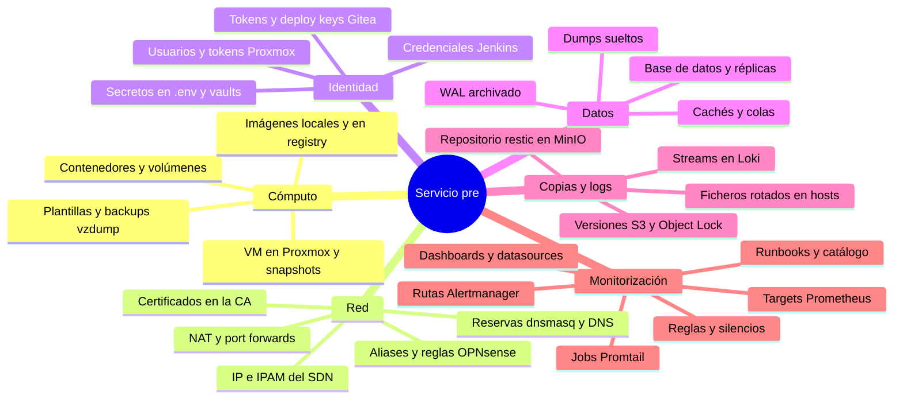
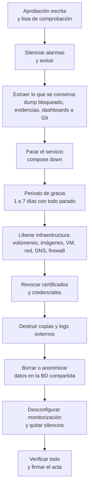

# UT8 · Terminación segura del contenedor

<p class="ut-meta">Módulo 5169 · 10 h · Sesiones 37 a 41 · RA5 CE a, b, c, d</p>

Esta es la última unidad en el centro. Durante el curso habéis levantado el servicio, lo habéis instrumentado, protegido, probado, copiado y actualizado; ahora toca lo contrario: retirarlo sin dejar rastro. El sujeto de la baja es el entorno **pre** que creasteis con OpenTofu en la UT7 para ensayar actualizaciones. Lo vamos a dar de baja de verdad: VM, red, DNS, reglas de firewall, certificados, credenciales, copias en MinIO, logs en Loki, datos en la base de datos y toda referencia en la monitorización. Después de la sesión 41 quedan el examen y la recuperación de abril, y la formación en empresa, donde os pedirán exactamente esto cuando un cliente deje de serlo.

## Qué tienes que saber hacer al terminar

- Inventariar todo lo que un servicio ha dejado en la infraestructura y planificar su baja como un cambio con aprobación, ventana y comunicación (CE a).
- Terminar la aplicación y liberar contenedores, volúmenes, imágenes, VM, IP, DNS, reglas, certificados y credenciales, verificando cada punto con un comando (CE a).
- Eliminar copias de seguridad y logs externos de forma que nadie pueda recuperarlos, eligiendo el método según el soporte (CE b).
- Borrar o anonimizar datos confidenciales en una base de datos que sigue en uso, y saber por qué un DELETE no basta (CE c).
- Retirar targets, reglas, rutas, dashboards y conectividad de la monitorización sin disparar alarmas fantasma (CE d).
- Redactar un acta de baja con evidencias que aguante una auditoría.

## La baja es un cambio más

Terminar un contenedor "para siempre" no es `docker stop`. Un servicio deja huella en la infraestructura, en la monitorización, en las copias y en los datos, y cada rastro es un coste o un riesgo: datos personales que siguen existiendo después de que el cliente pidiera su supresión, alarmas HostDown que nadie atiende, una IP reservada que impide reutilizar el rango, un token de Jenkins con permisos sobre un repositorio que ya no existe. Por eso la baja se planifica con una lista de comprobación y se documenta como cualquier otro cambio.

En ITIL, la baja de un servicio es un **cambio normal**: pasa por una solicitud (RFC), una evaluación de riesgo, la aprobación de quien tiene autoridad sobre el servicio (en una empresa pequeña el responsable técnico y el dueño del negocio; en una grande, el CAB) y una ventana acordada. No es un cambio estándar (los cambios estándar son los repetitivos y de bajo riesgo, y una baja destruye datos, así que nunca lo es) ni una emergencia. En la práctica eso se traduce en cuatro cosas que tienen que existir antes de tocar nada:

1. **Confirmación escrita** del responsable del servicio con fecha. Un correo vale; una conversación en el pasillo no. Ese correo va al acta.
2. **Ventana de ejecución.** Aunque el servicio ya no dé tráfico, la baja toca sistemas compartidos (el firewall, Prometheus, la base de datos común). Se hace en horario en que alguien pueda deshacer un error.
3. **Comunicación.** A los usuarios que quedasen (aviso previo de cierre, normalmente con semanas), a los equipos que consumen la monitorización (para que no abran incidencias) y al equipo de soporte.
4. **Lista de lo que se conserva y hasta cuándo.** Esto es lo que más se olvida y lo que más problemas legales da en las dos direcciones: conservar de más incumple el principio de limitación del plazo de conservación, y borrar de menos incumple una obligación fiscal.

### Qué hay que conservar por obligación legal

No sois abogados y yo tampoco, pero un técnico tiene que saber qué preguntar. En España los plazos que os vais a encontrar, de forma orientativa, son estos:

| Tipo de dato | Norma | Plazo habitual |
|---|---|---|
| Facturas y documentación contable | Código de Comercio, art. 30 | 6 años |
| Justificantes con trascendencia tributaria | Ley General Tributaria, art. 66 y siguientes | 4 años desde la prescripción |
| Datos personales de clientes tras el fin de la relación | RGPD art. 5.1.e y 17; LOPDGDD | Bloqueo (art. 32 LOPDGDD) mientras puedan derivarse responsabilidades; después supresión |
| Logs de acceso con IP o usuario | RGPD (son datos personales); ENS para el sector público | Entre 6 meses y 2 años según finalidad y política; el ENS pide al menos lo que dure el análisis de incidentes |
| Registros de actividades de tratamiento | RGPD art. 30 | Mientras exista el tratamiento, y se actualiza con la baja |

El mecanismo del artículo 32 de la LOPDGDD (bloqueo de datos) es el que da sentido a "qué se conserva por si acaso": los datos se dejan de tratar, se aíslan con acceso restringido al responsable y a la autoridad, y solo se destruyen cuando prescriben las responsabilidades. Técnicamente eso es un dump cifrado en un sitio al que solo llega el DPO o el responsable, con fecha de destrucción apuntada en el acta. Lo que no puede ser es "lo dejamos en el bucket de siempre porque nunca se sabe".

El acta tiene que decir, para cada categoría de datos, una de tres cosas: se destruye ahora (y cómo), se bloquea hasta una fecha (y dónde), o se transfiere a otro servicio que hereda el tratamiento.

## Inventario de rastros

Antes de borrar hay que saber qué hay. Un servicio de un año deja rastros en sitios que nadie recuerda, y el que mejor conoce el sistema se fue hace tres meses. Necesitáis un método, no memoria.



El método es buscar el nombre del servicio, su entorno y sus IP en todos los sitios donde pueda estar escrito. Con la etiqueta `env=pre`, el dominio `pre.lab` y el rango de IP que le asignasteis, tenéis tres cadenas que rastrear.

**Repositorios de código y configuración.** Todo lo que está en Git se encuentra con un grep sobre los cuatro repositorios de la asignatura más el de infraestructura de la 5166:

```bash
for r in servicio monitoring alerting operacion infra; do
  echo "== $r"; git -C ~/repos/$r grep -n -i -E 'pre\.lab|env="?pre"?|10\.20\.' -- . ':!*.lock'
done
```

Que salga una línea en `alerting/alerts.yml` que no esperabais es lo normal. Apuntadla.

**Prometheus.** Las series que existen ahora mismo con esa etiqueta, y los targets configurados, aunque estén caídos:

```bash
curl -s 'http://10.10.0.20:9090/api/v1/label/job/values?match[]={env="pre"}' | jq .
curl -s 'http://10.10.0.20:9090/api/v1/targets' | jq '.data.activeTargets[] | select(.labels.env=="pre") | .scrapeUrl'
curl -s 'http://10.10.0.20:9090/api/v1/rules' | jq '.data.groups[].rules[] | select(.query|test("pre")) | .name'
```

**Jenkins.** Las credenciales no se ven con un grep porque están cifradas en `credentials.xml`. Se listan por API o por consola de scripts:

```bash
curl -s -u ops:$TOKEN http://jenkins01.dev.lab:8080/credentials/store/system/domain/_/api/json?depth=1 \
  | jq '.credentials[] | {id, typeName, description}'
curl -s -u ops:$TOKEN 'http://jenkins01.dev.lab:8080/api/json?tree=jobs[name,color]' | jq '.jobs[]|select(.name|test("pre"))'
```

**Gitea.** Tokens de acceso, deploy keys, webhooks y paquetes del registry, por API:

```bash
curl -s -H "Authorization: token $GT" http://gitea01.dev.lab:3000/api/v1/repos/ops/servicio/keys | jq '.[]|{id,title}'
curl -s -H "Authorization: token $GT" http://gitea01.dev.lab:3000/api/v1/repos/ops/servicio/hooks | jq '.[]|{id,config}'
curl -s -H "Authorization: token $GT" 'http://gitea01.dev.lab:3000/api/v1/packages/ops?type=container' | jq '.[]|{name,version}'
```

**DNS y direcciones.** Qué resuelve hoy y qué reservas hay en el IPAM del SDN de Proxmox y en las leases de dnsmasq:

```bash
dig +short app01.pre.lab @10.10.0.1; dig +short -x 10.20.2.10 @10.10.0.1
pvesh get /cluster/sdn/ipams/pve/status --output-format json | jq '.[]|select(.vnet=="pre")'
grep -h pre /var/lib/misc/dnsmasq.*.leases 2>/dev/null
```

**Firewall.** En OPNsense, aliases y reglas que mencionen el servicio. Con la API (usuario con clave de API creado en la 5166 UT3):

```bash
curl -s -k -u "$KEY:$SECRET" https://10.10.0.1/api/firewall/alias/searchItem | jq '.rows[]|select(.name|test("pre"))|{uuid,name,content}'
```

Las reglas no tienen aún una API de búsqueda completa en todas las versiones, así que la matriz de reglas que mantenéis en `operacion/` es la fuente. Si no coincide con lo que hay en la interfaz, la matriz estaba mal, y eso también se apunta.

**Certificados.** En la CA del curso, el fichero `index.txt` lista todo lo emitido con su estado (V válido, R revocado, E expirado):

```bash
grep -E 'pre\.lab' /etc/ca/index.txt
```

**Proxmox.** VM, snapshots, backups y plantillas del entorno, y tokens de API creados para OpenTofu:

```bash
qm list | grep pre
for id in $(qm list | awk '/pre/{print $1}'); do qm listsnapshot $id; done
pvesm list local --vmid 210
pveum user token list tofu@pve
```

El resultado de este inventario es una tabla: rastro, dónde, cómo se elimina, cómo se verifica, quién lo hace. Esa tabla es la lista de comprobación de la baja, y es la primera actividad de la unidad.

## El orden importa

Hay una secuencia correcta y no es "borrar de arriba abajo". Si paráis el servicio antes de silenciar las alarmas, Alertmanager abre incidencias, el receptor webhook crea tickets y el equipo de guardia recibe un aviso a las diez de la noche por un servicio que sabíais que ibais a apagar. Si borráis los volúmenes antes de haber verificado que la copia bloqueada existe y se puede restaurar, ya no hay vuelta atrás. Si destruís la VM antes de exportar las evidencias que están dentro (logs de auditoría, por ejemplo), el acta se queda sin pruebas.



El periodo de gracia del paso E es opcional pero muy recomendable: el servicio está parado, nada se ha destruido, y si alguien grita ("el informe mensual tiraba de esa API!") se levanta en un minuto. En una empresa una semana es lo habitual; en el laboratorio lo simulamos entre la sesión 38 y la 39.

Los silencios se quitan al final, no antes, y con criterio: si quitáis el silencio con los targets todavía configurados, salta todo. Primero se retiran los targets y las reglas, se comprueba que no hay alertas pendientes, y entonces se expira el silencio.

### Lista de comprobación completa

Esta es la lista con la que trabajaremos. Cada línea lleva el comando de verificación, porque una casilla marcada sin evidencia no vale nada en un acta.

- [ ] Aprobación escrita archivada (correo con fecha y nombre)
- [ ] Silencio en Alertmanager para `env="pre"` con duración mayor que la ventana: `amtool silence query env=pre`
- [ ] Dump bloqueado cifrado y guardado donde indica el acta; hash SHA-256 apuntado: `sha256sum pre-bloqueo.sql.gpg`
- [ ] Dashboards exportados a Git: `git -C operacion log -1 -- dashboards/pre/`
- [ ] Servicio parado: `docker compose -p servicio-pre ps -a` vacío
- [ ] Volúmenes eliminados: `docker volume ls -q --filter label=com.docker.compose.project=servicio-pre` vacío
- [ ] Imágenes locales eliminadas: `docker images --filter reference='registry.dev.lab/*:pre*'` vacío
- [ ] Imágenes borradas del registry y garbage collect ejecutado: `curl -s registry.dev.lab:5000/v2/ops/api/tags/list`
- [ ] Redes eliminadas: `docker network ls --filter label=com.docker.compose.project=servicio-pre` vacío
- [ ] VM destruidas: `qm list | grep pre` vacío; `tofu state list` vacío
- [ ] Snapshots y backups vzdump del entorno eliminados: `pvesm list local --vmid 210` vacío
- [ ] IP liberadas en IPAM y reservas dnsmasq: `pvesh get /cluster/sdn/ipams/pve/status` sin la vnet
- [ ] DNS no resuelve: `dig +short app01.pre.lab @10.10.0.1` vacío
- [ ] Aliases y reglas de firewall eliminados; matriz actualizada; `nmap -Pn 10.20.1.10 -p 80,443,8080` sin respuesta
- [ ] Certificados revocados y CRL publicada: `openssl crl -in crl.pem -noout -text | grep -A2 'Serial Number: 1A'`
- [ ] Tokens y usuarios de Proxmox, Jenkins y Gitea eliminados: listados vacíos por API
- [ ] Proyecto en Jenkins deshabilitado y repositorio en Gitea archivado
- [ ] Clave del repositorio restic destruida: `restic -r s3:... snapshots` falla con "wrong password or no key found"
- [ ] Versiones y marcadores de borrado en S3 eliminados: `mc ls --versions --recursive s3/backups/pre/` vacío
- [ ] Streams de Loki borrados: `logcli query '{env="pre"}' --since=8760h` sin resultados
- [ ] Ficheros de log rotados eliminados en web01, app01, db01 y en mon01
- [ ] Tablas del servicio eliminadas y `VACUUM FULL` ejecutado; usuarios anonimizados: consulta de comprobación
- [ ] Réplicas, dumps sueltos, caché y colas revisados
- [ ] Targets, reglas, rutas, receptores, datasources y jobs Promtail retirados; `count({env="pre"})` sin datos tras la retención o tras `delete_series`
- [ ] Runbooks y catálogo de alarmas marcados como retirados con fecha
- [ ] Silencio expirado y sin alertas: `amtool alert query env=pre` vacío
- [ ] Acta firmada y guardada con las incidencias del servicio

## Liberar los recursos de la infraestructura

La tabla del temario resume el qué. El cómo y el por qué van debajo.

| Recurso | Cómo se libera | Cómo se verifica |
|---|---|---|
| Contenedores | `docker compose down` | `docker ps -a` vacío del proyecto |
| Volúmenes | `docker compose down -v`; `docker volume rm` | `docker volume ls`; espacio en `df -h` |
| Imágenes | `docker image rm`; `docker image prune -a` (con cuidado); borrar del registry | `docker images`; API del registry |
| Redes | `docker network rm` | `docker network ls` |
| Máquinas virtuales | `tofu destroy` del entorno ([5166 UT5](https://victor-educ.github.io/apuntes-5166/ut/ut5-iac/)) o `qm destroy` | Proxmox sin la VM; estado de OpenTofu vacío |
| IP, DNS, DHCP | Quitar reserva en dnsmasq / IPAM del SDN; borrar registros | `dig` no resuelve; reserva libre |
| Reglas de firewall y NAT | Eliminar reglas y aliases del servicio | Matriz de reglas actualizada; escaneo |
| Certificados | Revocar en la CA | CRL y respuesta OCSP |
| Credenciales | Borrar usuarios de servicio, tokens, credenciales en Jenkins, secretos | Inventario de credenciales |
| Pipeline y repositorio | Archivar el proyecto en Jenkins/Gitea (no borrar el código) | Lista de proyectos |

### Docker en app01 de pre

`docker compose down` para y elimina contenedores y redes del proyecto, pero deja los volúmenes con nombre y las imágenes. Con `-v` elimina también los volúmenes declarados en el fichero y los anónimos; con `--rmi all` borra las imágenes que usaba el proyecto. Es la forma limpia de terminar un despliegue de Compose porque usa las etiquetas `com.docker.compose.project` para saber qué es suyo y no toca nada de otros proyectos del mismo host:

```bash
cd /opt/servicio && docker compose -p servicio-pre down -v --rmi all --remove-orphans
docker volume ls -q --filter label=com.docker.compose.project=servicio-pre   # vacío
docker network ls --filter label=com.docker.compose.project=servicio-pre     # vacío
docker ps -a --filter label=com.docker.compose.project=servicio-pre          # vacío
```

`--remove-orphans` limpia contenedores del proyecto que ya no aparecen en el fichero (por ejemplo, un sidecar que quitasteis en la UT7 y que seguía parado). Lo que `down -v` no ve son los volúmenes creados a mano con `docker volume create` y montados como `external: true`. Esos hay que borrarlos con `docker volume rm` y, antes, mirar quién más los usa: `docker ps -a --filter volume=pgdata-pre`.

`docker image prune -a` borra todas las imágenes sin contenedor asociado del host entero, no solo las del proyecto. En app01 de pre, donde solo vive este servicio, es aceptable. En un host compartido no lo ejecutéis: usad `docker image rm` con la referencia concreta. `docker system prune --volumes` es todavía más agresivo (contenedores parados, redes sin usar, imágenes colgantes, caché de build y volúmenes anónimos) y es lo que dejaréis ejecutado justo antes de destruir la VM, porque a esas alturas ya da igual.

El volumen borrado con `docker volume rm` es un `rm -rf` de `/var/lib/docker/volumes/<nombre>/_data`. Los bloques siguen en el disco de la VM. Lo veremos en el apartado de copias: la baja del volumen se completa cuando se destruye el disco de la VM, y de verdad cuando el disco estaba cifrado o cuando se sobrescribe.

### Borrar del registry

Borrar una imagen del host no la quita del registry en gitea01, y ese es el rastro que más se olvida: la imagen `servicio:1.4.2-pre` con el `.env` de pruebas dentro de una capa sigue ahí para quien la pida. La API del registry de Distribution (la imagen `registry:2` que usáis) no borra por etiqueta, borra por **digest** del manifiesto, y solo si el registry arrancó con borrado habilitado (`REGISTRY_STORAGE_DELETE_ENABLED=true`).

```bash
R=http://registry.dev.lab:5000
# 1. Obtener el digest del manifiesto (hay que pedir el media type correcto)
D=$(curl -sI -H 'Accept: application/vnd.oci.image.manifest.v1+json, application/vnd.docker.distribution.manifest.v2+json' \
     $R/v2/ops/api/manifests/1.4.2-pre | awk -F': ' '/[Dd]ocker-Content-Digest/{print $2}' | tr -d '\r')
echo $D    # sha256:9f2c...
# 2. Borrar el manifiesto por digest (borra todas las etiquetas que apunten a él)
curl -s -o /dev/null -w '%{http_code}\n' -X DELETE $R/v2/ops/api/manifests/$D   # 202
# 3. Comprobar
curl -s $R/v2/ops/api/tags/list
```

El paso 2 desvincula el manifiesto, pero las capas (blobs) siguen ocupando disco hasta que se ejecuta el recolector de basura, que necesita el registry parado o en modo solo lectura:

```bash
docker compose -f /opt/registry/compose.yml stop registry
docker compose -f /opt/registry/compose.yml run --rm registry garbage-collect --delete-untagged /etc/docker/registry/config.yml
docker compose -f /opt/registry/compose.yml start registry
```

Si en vez de `registry:2` usáis el registro de paquetes integrado en Gitea, la operación es `DELETE /api/v1/packages/ops/container/api/1.4.2-pre` y Gitea limpia los blobs en su tarea periódica de mantenimiento. Y si la imagen se subió a un registro público (Docker Hub, ghcr.io) para alguna prueba, hay que borrarla allí también; los registries públicos guardan el manifiesto en cachés intermedias durante horas.

### OpenTofu y el estado

El entorno pre nació con `tofu apply` sobre el código de la 5166 UT5, así que muere con `tofu destroy`. Antes de ejecutarlo, mirad el plan: `tofu plan -destroy` os enseña todo lo que va a desaparecer, y ahí es donde descubrís que el módulo de red compartía la vnet con dev o que el estado incluye el usuario de API de Proxmox que otros entornos usan.

```bash
cd infra/envs/pre
tofu plan -destroy -out=destroy.plan
# revisar: solo recursos de pre; si hay algo compartido, sacarlo del estado sin destruirlo
tofu state rm module.red.proxmox_virtual_environment_network_linux_bridge.vmbr_shared
tofu apply destroy.plan
tofu state list          # vacío
```

`tofu state rm` quita un recurso del estado sin tocarlo en Proxmox; es la herramienta para "esto no es de pre, no lo destruyas". Cuando el estado queda vacío, el fichero `terraform.tfstate` (o el workspace en el backend remoto) todavía contiene el historial y, en el caso del provider de Proxmox, puede contener datos sensibles como la contraseña de cloud-init en claro. El estado se borra también: `tofu workspace delete pre` si usáis workspaces, o el fichero y sus copias `.backup` si es local. El estado va al mismo tratamiento que un dump de base de datos.

### Proxmox: qm destroy y lo que arrastra

Si OpenTofu no puede (el estado se perdió, la VM se creó a mano), se hace con `qm`:

```bash
qm stop 210 --timeout 60
qm listsnapshot 210
qm destroy 210 --purge --destroy-unreferenced-disks 1
```

`--purge` quita la VM de los trabajos de backup, de la replicación y de la configuración de HA; sin él, el job de vzdump del domingo fallará con "VM 210 not found" cada semana hasta que alguien lo edite. `--destroy-unreferenced-disks` borra también los discos que quedaron huérfanos en el storage (por ejemplo, un `vm-210-disk-1` que desvinculasteis para probar algo). Los snapshots se destruyen con la VM. Lo que **no** se destruye son los backups vzdump ya hechos ni las plantillas clonadas de esa VM:

```bash
pvesm list local --vmid 210       # backups vzdump
pvesm free local:backup/vzdump-qemu-210-2027_02_28-02_00_01.vma.zst
qm list | awk '$1>=9000'          # plantillas; comprobar si alguna nació de pre
```

En Proxmox Backup Server, si lo usáis, los snapshots del grupo `vm/210` se eliminan con `proxmox-backup-client forget` o desde la interfaz, y el espacio se libera en el siguiente garbage collect del datastore, que respeta un periodo de 24 horas y 5 minutos sobre los chunks. Hasta entonces, los datos están ahí.

### Direcciones, DNS y firewall

Con el SDN de Proxmox y el IPAM integrado (`pve`), las IP se asignan por vnet y las reservas se guardan en el IPAM y en la configuración de dnsmasq. Al destruir la vnet de pre con OpenTofu se liberan las dos cosas; si la vnet sigue porque es compartida, se liberan las IP una a una:

```bash
pvesh delete /cluster/sdn/vnets/pre/ips --zone lab --vnet pre --ip 10.20.2.10
pvesh set /cluster/sdn                       # aplicar
pvesh get /cluster/sdn/ipams/pve/status --output-format json | jq '.[]|select(.ip|startswith("10.20."))'
```

Los registros DNS del laboratorio los sirve Unbound en OPNsense (host overrides) o el propio dnsmasq del SDN según cómo lo montarais en la 5166 UT2. En cualquiera de los dos, la verificación es la misma: `dig` con `+short` contra el resolver del laboratorio no devuelve nada, ni en directa ni en inversa. Un DNS que sigue resolviendo un nombre a una IP libre es un problema de seguridad futuro: cuando esa IP se reasigne, `app01.pre.lab` apuntará a una máquina que no es.

En OPNsense, el orden es reglas primero y aliases después, porque un alias en uso no se puede borrar. Las reglas que permitían a mon01 llegar a los exporters de pre (las de la UT3 de esta asignatura) y las de NAT hacia web01 de pre desaparecen; los aliases `pre_front`, `pre_back`, `pre_data` también. Luego `Apply changes` o, por API, `firewall/filter/apply` y `firewall/alias/reconfigure`. La verificación no es mirar la interfaz: es un escaneo desde fuera y desde mon01 que ya no llega a nada, y la matriz de reglas de `operacion/` actualizada en un commit.

### Certificados: revocar en la CA propia

Los certificados de `*.pre.lab` que emitió la CA del curso siguen siendo válidos hasta su fecha de caducidad aunque la máquina haya desaparecido. Si alguien conserva la clave privada (estaba en un volumen, en un backup, en el estado de OpenTofu), puede suplantar el servicio. Revocar es lo único que lo impide, y solo funciona si los clientes consultan la CRL o un respondedor OCSP.

```bash
cd /etc/ca
openssl ca -config ca.cnf -revoke certs/app01.pre.lab.pem -crl_reason cessationOfOperation
openssl ca -config ca.cnf -gencrl -out crl/ca.crl.pem
openssl crl -in crl/ca.crl.pem -noout -text | grep -B1 -A3 'cessationOfOperation'
cp crl/ca.crl.pem /var/www/ca/ca.crl      # donde apunta el crlDistributionPoints de los certificados
```

El motivo `cessationOfOperation` es el correcto para una baja (no `keyCompromise`, salvo que sepáis que la clave se filtró). Para OCSP con OpenSSL basta un respondedor mínimo sobre el mismo `index.txt`:

```bash
openssl ocsp -index index.txt -CA ca.pem -rsigner ocsp.pem -rkey ocsp.key -port 2560 -text &
openssl ocsp -issuer ca.pem -cert certs/app01.pre.lab.pem -url http://ca.dev.lab:2560 -resp_text | grep 'Cert Status'
# Cert Status: revoked
```

Si vuestra CA es step-ca, es `step ca revoke --cert app01.pre.lab.pem --key app01.pre.lab.key --reason cessationOfOperation` y el propio step-ca responde OCSP. El certificado de la CA no se toca; lo que se revoca son las hojas. Y la clave privada del servicio se destruye con el resto del entorno, que es lo que hace innecesaria la revocación en la práctica pero no en la teoría: la revocación cubre las copias de la clave que no sabéis que existen.

### Credenciales y tokens

Cada sistema tiene las suyas y todas hay que tocarlas. Un token que sobrevive a su servicio es una credencial huérfana: nadie lo rota, nadie lo audita y sigue siendo válido.

```bash
# Proxmox: token de API que usaba OpenTofu para pre, y el usuario si era exclusivo
pveum user token remove tofu@pve pre
pveum user delete tofu-pre@pve
pveum user token list tofu@pve

# Gitea: token de acceso del pipeline, deploy key y webhook del repositorio
curl -X DELETE -H "Authorization: token $GT" http://gitea01.dev.lab:3000/api/v1/users/jenkins/tokens/pre-deploy
curl -X DELETE -H "Authorization: token $GT" http://gitea01.dev.lab:3000/api/v1/repos/ops/servicio/keys/7
curl -X DELETE -H "Authorization: token $GT" http://gitea01.dev.lab:3000/api/v1/repos/ops/servicio/hooks/3

# Jenkins: credencial del entorno pre (registry, SSH de app01-pre, token de Gitea)
curl -X POST -u ops:$TOKEN http://jenkins01.dev.lab:8080/credentials/store/system/domain/_/credential/pre-ssh-app01/doDelete
```

Además de lo que está en los sistemas, están los secretos que viajaron: el `.env` de pre que alguien tiene en su portátil, la contraseña de cloud-init en el estado de OpenTofu, el `pass` de restic en `/etc/restic/` de app01-pre. La destrucción de la VM se lleva los de dentro; los de fuera se piden por escrito y se anotan como "solicitada destrucción a X, confirmada el día Y".

### Archivar, no borrar el código

El repositorio del servicio y el Jenkinsfile no se borran: son el registro de cómo se hizo y pueden hacer falta para una auditoría o para resucitar el servicio. En Gitea, el repositorio se archiva (Settings, Danger Zone, Archive, o `PATCH /api/v1/repos/ops/servicio` con `{"archived": true}`): queda en solo lectura, no acepta pushes ni issues, y se ve en la lista con la marca de archivado. En Jenkins no hay "archivar": el job de pre se deshabilita (`Disable Project`, o `POST /job/servicio-pre/disable`) y se mueve a una carpeta `archivo/`; el Jenkinsfile sigue en el repositorio. Borrar el job elimina también el historial de builds y sus artefactos, que a veces son la única evidencia de qué versión se desplegó cuándo.

## Por qué borrar no borra

`rm` desvincula el nombre del fichero de sus bloques y marca los bloques como libres. Los datos siguen ahí hasta que otra escritura los pise, y un `photorec` los recupera en minutos. Sobre eso se apilan cuatro mecanismos modernos que hacen que ni siquiera sobrescribir garantice nada:

- **SSD y wear leveling.** El controlador del SSD reparte las escrituras entre celdas para que se desgasten por igual. Cuando `shred` escribe tres veces sobre el mismo LBA, el controlador escribe en tres páginas físicas distintas y deja la original marcada como inválida, legible con acceso al chip. TRIM (`fstrim`, `blkdiscard`) le dice al controlador que puede borrar esas páginas, pero "puede" no es "debe", y no todos los firmwares lo hacen de inmediato.
- **Copy-on-write en ZFS y btrfs.** Estos sistemas de ficheros nunca sobrescriben un bloque en su sitio: escriben el nuevo en otro lugar y actualizan los punteros. `shred` en ZFS crea tres copias nuevas y deja la original intacta. Y si hay un snapshot, el bloque original está referenciado y ni siquiera se marca libre. En Proxmox con storage ZFS (`local-zfs`) el disco de la VM es un zvol con esta propiedad.
- **Versionado en el almacenamiento de objetos.** Un bucket S3 o MinIO con versionado activado no borra nunca: `DELETE` crea un marcador de borrado y la versión anterior sigue ahí. Con Object Lock en modo compliance, ni el administrador puede borrarla antes de que venza la retención.
- **Snapshots del hipervisor y backups.** El snapshot de "antes de la actualización" de la UT7 contiene el disco completo con los datos que acabáis de borrar dentro de la VM. Lo mismo el vzdump de cada domingo.

La consecuencia práctica es que el borrado fiable de un soporte que no controláis físicamente (una VM sobre ZFS, un bucket en un proveedor, un disco de un servidor alquilado) solo se consigue de una manera: que los datos nunca hayan estado en claro. De ahí el orden de opciones.

### Opciones de más a menos fiable

**1. Borrado criptográfico.** Si las copias estaban cifradas (restic, borg, gpg, LUKS, S3 con SSE-KMS), se destruye la clave y los datos se vuelven ruido aunque el fichero exista, aunque haya versiones, aunque haya snapshots. Es el método correcto y por eso las copias se cifran desde el principio ([UT6](ut6-copias-seguridad.md)). NIST SP 800-88 lo reconoce como técnica de *Purge* siempre que la clave se haya gestionado bien (nunca almacenada junto a los datos, nunca copiada a sitios que no controláis).

En restic, el repositorio tiene una clave maestra que se guarda cifrada con cada contraseña en `keys/`. Destruir todos los ficheros de `keys/` y la contraseña equivale a destruir la clave maestra:

```bash
export RESTIC_REPOSITORY=s3:http://10.10.0.30:9000/backups/pre
restic key list                                           # apuntar los IDs en el acta
mc rm --recursive --force --versions s3/backups/pre/keys/  # todas las versiones de las claves
shred -u /etc/restic/pass-pre                              # y la contraseña, en todos los hosts que la tenían
restic snapshots
# Fatal: wrong password or no key found
```

La comprobación final es esa: restic no puede abrir el repositorio con la contraseña correcta porque ya no hay clave que abrir. Si además queréis liberar el espacio, `mc rm --recursive --force --versions s3/backups/pre/` después; pero la irrecuperabilidad ya estaba garantizada antes de eso.

Con borg, la clave está en el repositorio (modo `repokey`) o en `~/.config/borg/keys/` (modo `keyfile`): `borg key export` os dice cuál y dónde, y se destruyen las copias de la clave y la passphrase. Con LUKS, `cryptsetup luksErase /dev/sdb1` borra todos los keyslots de la cabecera (queda la cabecera sin claves; `cryptsetup luksDump` muestra los slots vacíos) y la copia de la cabecera que guardasteis con `luksHeaderBackup` hay que destruirla también. Con KMS en la nube, `aws kms schedule-key-deletion --key-id <id> --pending-window-in-days 7`: el borrado es diferido a propósito y en esos siete días cualquier objeto cifrado con esa clave sigue siendo legible.

**2. Borrado en el sistema de copias.** Si el repositorio se conserva porque tiene otros clientes, se borran los snapshots del servicio y se reescribe: `restic forget --tag pre --prune` (o `--host app01-pre`) marca los snapshots y `prune` reempaqueta los packs que los contenían. En borg, `borg delete --glob-archives 'pre-*' repo` y luego `borg compact repo`; sin `compact` borg solo marca los segmentos y el espacio, y los datos, siguen. En los dos casos, los packs antiguos se han borrado del backend, lo cual sobre S3 con versionado significa que hay que ir al punto 3.

**3. Almacenamiento de objetos.** Listar todas las versiones y marcadores del prefijo, borrarlos explícitamente por `VersionId`, quitar las reglas de ciclo de vida y comprobar que no hay replicación a otro bucket:

```bash
aws --endpoint-url http://10.10.0.30:9000 s3api list-object-versions --bucket backups --prefix pre/ \
  --query '{Objects: [Versions[].{Key:Key,VersionId:VersionId}, DeleteMarkers[].{Key:Key,VersionId:VersionId}][]}' \
  --output json > versiones.json
aws --endpoint-url http://10.10.0.30:9000 s3api delete-objects --bucket backups --delete file://versiones.json
aws --endpoint-url http://10.10.0.30:9000 s3api list-object-versions --bucket backups --prefix pre/   # vacío
mc replicate ls s3/backups                                                                            # sin réplicas
```

`delete-objects` admite 1000 claves por llamada; con más, se trocea. Si el bucket tiene Object Lock en modo *governance*, el borrado necesita `--bypass-governance-retention` y el permiso correspondiente; en modo *compliance* no hay forma de borrar antes de la fecha de retención, ni siquiera siendo root del proveedor. Eso es exactamente lo que se buscaba al activarlo para protegerse del ransomware, y por eso la retención de Object Lock se decide contando con la baja: una retención de 90 días significa que el acta de baja tendrá una fecha de destrucción 90 días posterior a la ejecución, y alguien tiene que volver a verificarla entonces. Con la clave de restic destruida, mientras tanto, esos objetos son ruido.

**4. Sobrescritura y descarte.** En discos magnéticos dedicados, `shred -n 3 -z -v /dev/sdb` (tres pasadas aleatorias y una de ceros) o `nwipe` (el sucesor de DBAN, con verificación y registro) valen como *Clear* de NIST. En SSD y NVMe, la herramienta correcta no es `shred` sino el borrado seguro del propio firmware: `nvme format /dev/nvme0n1 --ses=1` (o `--ses=2` para borrado criptográfico si el disco lo soporta) y `hdparm --security-erase` en SATA; `blkdiscard /dev/nvme0n1` descarta todo el dispositivo pero, por lo dicho antes, sin garantía de que las celdas se borren. En cinta, el borrado lo hace el software de la librería. En una VM de Proxmox no tenéis acceso a nada de esto: el disco virtual es un fichero o un zvol, y "sobrescribir" desde dentro de la VM no llega al soporte físico.

**5. Destrucción física.** Desmagnetizado, trituración o perforación, cuando lo exige la normativa (ENS categoría alta, datos de salud, contratos que lo especifican). Se hace con proveedor certificado y certificado de destrucción por número de serie. NIST SP 800-88 rev. 1 es la referencia que os van a citar en cualquier pliego: define *Clear* (sobrescritura lógica, protege contra recuperación con herramientas de software), *Purge* (borrado criptográfico, secure erase, desmagnetizado; protege contra recuperación de laboratorio) y *Destroy*, y tiene un apéndice con el método adecuado por tipo de soporte.

### Logs externos

Los logs del servicio están en tres sitios: en Loki, en los ficheros rotados de cada host y en cualquier sitio al que se reenviaran (un SIEM, el correo de las alarmas). En Loki 3.x el borrado por consulta lo hace el **compactor**, y hay que tenerlo configurado para ello:

```yaml
compactor:
  working_directory: /loki/compactor
  retention_enabled: true
  delete_request_store: filesystem
limits_config:
  deletion_mode: filter-and-delete
  retention_period: 168h
  retention_stream:
    - selector: '{env="pre"}'
      priority: 1
      period: 24h
```

Con eso, la petición de borrado se envía a la API del compactor y se ejecuta en el siguiente ciclo, después del periodo de cancelación (24 horas por defecto, `delete_request_cancel_period`) durante el cual se puede anular. No es inmediato, y eso hay que reflejarlo en el acta:

```bash
curl -s -X POST -G 'http://10.10.0.20:3100/loki/api/v1/delete' \
  --data-urlencode 'query={env="pre"}' --data-urlencode 'start=1700000000' --data-urlencode "end=$(date +%s)"
curl -s 'http://10.10.0.20:3100/loki/api/v1/delete' | jq .        # estado: received, processed
logcli --addr=http://10.10.0.20:3100 query '{env="pre"}' --since=8760h --limit=1   # vacío tras el procesado
logcli --addr=http://10.10.0.20:3100 series '{env="pre"}'                          # vacío
```

La `retention_stream` con `period: 24h` para `{env="pre"}` es el cinturón además de los tirantes: aunque llegue algún log rezagado (un Promtail que no se retiró), desaparece en un día. Los chunks borrados del filesystem o del bucket de Loki están sujetos a lo mismo que todo lo demás: versionado, snapshots, bloques libres.

En los hosts, los ficheros rotados: `/var/log/nginx/*.gz` en web01, los JSON del driver de logs de Docker en `/var/lib/docker/containers/*/` en app01, `/var/log/postgresql/` en db01, y el `positions.yaml` de Promtail. Y en mon01, si en la UT2 configurasteis Alertmanager para enviar correo a Mailpit, la bandeja de Mailpit contiene el texto de las alertas con etiquetas e IP. Se limpia con `journalctl --vacuum-time=1s` para el journal si el servicio escribía ahí, `rm` para los rotados, y la destrucción de la VM para todos a la vez.

La verificación tiene dos niveles: una consulta que no devuelve nada, y, sobre un soporte al que tengáis acceso, una herramienta de recuperación que no encuentra nada legible. Ese segundo nivel es la actividad A8.3.

## Datos confidenciales en la base de datos interna

En el laboratorio la base de datos de pre muere con db01-pre. Pero el caso habitual en una empresa es que la base de datos se conserva porque otros servicios la usan, y lo que hay que borrar son las tablas y los datos de un servicio concreto. Ahí es donde `DELETE` engaña.

PostgreSQL usa MVCC: `DELETE` no borra la fila, marca la tupla como muerta y la deja en la página hasta que `VACUUM` la recicla. `VACUUM` normal libera el espacio para que la propia tabla lo reutilice, pero no lo devuelve al sistema operativo ni sobrescribe nada: los bytes siguen en el fichero de la tabla, legibles con un editor hexadecimal por cualquiera con acceso al directorio de datos o a un backup del mismo. `DROP TABLE` desvincula los ficheros del segmento, con lo que aplica lo del apartado anterior.

```sql
-- Antes: ver cuánto hay muerto
SELECT relname, n_live_tup, n_dead_tup FROM pg_stat_user_tables WHERE relname LIKE 'pre_%';
DELETE FROM pre_sesiones;   -- deja n_dead_tup = filas
VACUUM FULL pre_sesiones;   -- reescribe la tabla en un fichero nuevo y desvincula el viejo
DROP TABLE pre_sesiones, pre_pedidos CASCADE;
```

`VACUUM FULL` bloquea la tabla en exclusiva mientras la reescribe, lo que en una tabla de 50 GB en producción puede ser una hora sin servicio. `pg_repack` hace lo mismo sin bloqueo largo (crea una copia, la sincroniza con triggers y cambia los ficheros al final): `pg_repack -d servicio -t usuarios`. En los dos casos el fichero antiguo se desvincula, no se sobrescribe. Además hay tres sitios más donde viven los datos borrados y que la gente olvida: el **WAL** (cada fila insertada o actualizada está en los segmentos de WAL y en el archivo de WAL si hay PITR configurado, hasta que la retención los recicle), las **réplicas** (la réplica en streaming aplica el DELETE, pero su base backup inicial y sus propios WAL archivados no) y los **dumps sueltos** (el `pg_dump` en `/tmp` que alguien hizo para probar la migración, el fichero en el portátil de desarrollo, el que dejó el pipeline en un workspace de Jenkins).

### Anonimizar cuando hay que conservar estadísticas

Si el negocio necesita conservar los pedidos por mes pero no a quién se hicieron, no se borra: se anonimiza. El RGPD (considerando 26) distingue **seudonimización**, que sigue siendo dato personal porque con información adicional se puede volver a identificar, de **anonimización**, que ya no lo es. Un `md5(email)` sin sal es seudonimización: cualquiera con una lista de correos puede calcular el hash y cruzar. Para que sea anonimización el hash lleva una sal aleatoria que se destruye al acabar, o directamente se sustituye por valores sintéticos que no derivan del original:

```sql
BEGIN;
-- Sal de un solo uso; no se guarda en ningún sitio
CREATE TEMP TABLE sal AS SELECT gen_random_uuid()::text AS s;
UPDATE usuarios u SET
  email    = encode(sha256(convert_to(u.email || (SELECT s FROM sal), 'UTF8')), 'hex') || '@anon.invalid',
  nombre   = 'Usuario ' || u.id,
  telefono = NULL,
  direccion = NULL,
  ip_alta  = NULL,
  fecha_nac = date_trunc('year', u.fecha_nac)   -- se conserva el año para estadísticas de edad
WHERE u.tenant = 'pre';
-- Tablas satélite con texto libre: no se pueden anonimizar, se borran
DELETE FROM comentarios WHERE usuario_id IN (SELECT id FROM usuarios WHERE tenant = 'pre');
COMMIT;
VACUUM FULL usuarios, comentarios;
-- Comprobación
SELECT count(*) FROM usuarios WHERE tenant='pre' AND (email NOT LIKE '%@anon.invalid' OR telefono IS NOT NULL);
```

Los campos de texto libre (comentarios, notas del pedido, motivo de la devolución) no se pueden anonimizar de forma fiable: la gente escribe su teléfono en el comentario. Se borran. Y las columnas cuasi-identificadoras (código postal completo, fecha de nacimiento exacta, sexo) combinadas identifican a una persona aunque no haya nombre, así que se generalizan (año en vez de fecha, provincia en vez de código postal). Si os piden "anonimizar la base de datos" sin más detalle, esa es la conversación que hay que tener antes de escribir el UPDATE.

### Si la base de datos se elimina entera

Se para el servicio, se borra el volumen o el disco y se aplica al soporte lo del apartado de copias. Con el volumen cifrado con LUKS, se destruyen las claves y listo. Sin cifrado, la única garantía en una VM es la destrucción del disco virtual más la confianza en que el storage del hipervisor no lo conserve en snapshots, que es una confianza que conviene verificar con `zfs list -t snapshot | grep vm-210`.

Quedan las **cachés y colas**: Redis guarda en memoria y, si tiene persistencia, en `dump.rdb` y en el AOF; `FLUSHDB` y borrar los ficheros. RabbitMQ o similar: purgar la cola (`rabbitmqctl purge_queue pedidos-pre`) y borrar el vhost. Un mensaje encolado con datos de un cliente puede sobrevivir años en una cola muerta que nadie consume.

## Desconfigurar la monitorización y las alarmas

Un servicio dado de baja que sigue en la monitorización genera alarmas eternas, ocupa retención y, lo peor, puede resucitar por error: alguien ve el target en rojo, piensa que se cayó y lo levanta desde un snapshot.

**Prometheus.** Se quitan los targets del `prometheus.yml` o del fichero de descubrimiento (`file_sd`), se valida y se recarga sin reiniciar:

```bash
promtool check config /etc/prometheus/prometheus.yml
curl -X POST http://10.10.0.20:9090/-/reload      # necesita --web.enable-lifecycle
curl -s http://10.10.0.20:9090/api/v1/targets | jq '[.data.activeTargets[]|select(.labels.env=="pre")]|length'   # 0
```

Quitar el target no borra las series: las muestras siguen en el TSDB hasta que la retención las expulse (15 días por defecto). `count({env="pre"})` devuelve datos hasta entonces. Si el acta necesita que desaparezcan ya, la API de administración lo hace, si Prometheus arrancó con `--web.enable-admin-api`:

```bash
curl -X POST -G http://10.10.0.20:9090/api/v1/admin/tsdb/delete_series --data-urlencode 'match[]={env="pre"}'
curl -X POST http://10.10.0.20:9090/api/v1/admin/tsdb/clean_tombstones
curl -s -G http://10.10.0.20:9090/api/v1/query --data-urlencode 'query=count({env="pre"})' | jq '.data.result'   # []
```

`delete_series` marca tombstones; `clean_tombstones` reescribe los bloques para que las muestras desaparezcan del disco. Sin el segundo, las muestras siguen en los ficheros de bloque aunque las consultas no las devuelvan.

**Reglas.** Las recording rules `app:...` y las alertas de `alerts.yml` que filtren por `env="pre"` se retiran del repositorio `alerting` con un commit; el pipeline las despliega y recarga. Antes de retirarlas, el silencio que pusisteis al principio sigue activo, así que el vaivén de la recarga no dispara nada. Comprobación: `curl -s :9090/api/v1/rules | jq '.data.groups[].rules[]|select(.query|test("pre"))'` vacío.

**Alertmanager.** Rutas con `match` sobre `env: pre`, receptores exclusivos (el webhook al gestor de incidencias de pre, el correo del equipo) y las plantillas que los referencian. `amtool check-config alertmanager.yml` y recarga con `curl -X POST :9093/-/reload`. Las incidencias abiertas de pre en el gestor se cierran con el motivo "servicio dado de baja" y referencia al acta. Al final, se expira el silencio y se comprueba que no hay nada:

```bash
amtool --alertmanager.url=http://10.10.0.20:9093 silence query env=pre         # apuntar el ID
amtool --alertmanager.url=http://10.10.0.20:9093 silence expire <id>
amtool --alertmanager.url=http://10.10.0.20:9093 alert query env=pre            # vacío
```

**Grafana.** Los dashboards se exportan a Git antes de borrarlos, porque un dashboard bien hecho vale para el siguiente servicio y porque en una auditoría os pueden pedir "qué se vigilaba":

```bash
G=http://10.10.0.20:3000; H="Authorization: Bearer $GRAFANA_TOKEN"
for uid in $(curl -s -H "$H" "$G/api/search?tag=pre" | jq -r '.[].uid'); do
  curl -s -H "$H" $G/api/dashboards/uid/$uid | jq '.dashboard' > operacion/dashboards/pre/$uid.json
  curl -s -X DELETE -H "$H" $G/api/dashboards/uid/$uid
done
curl -s -X DELETE -H "$H" $G/api/datasources/uid/loki-pre   # solo si la fuente era exclusiva de pre
git -C operacion add dashboards/pre && git -C operacion commit -m "UT8: dashboards de pre archivados antes de la baja"
```

Si la fuente de datos era la compartida (el Prometheus y el Loki de mon01), no se toca: solo se borra la que apuntaba en exclusiva a pre. Las reglas de alerta propias de Grafana, si las usasteis, se listan en `/api/v1/provisioning/alert-rules` y se borran igual.

**Promtail.** El job con `env: pre` se quita del `promtail.yml` de cada host antes de destruir las VM; si las VM ya no existen, no hay nada que quitar, pero el fichero de configuración en el repositorio `monitoring` sí, y ese commit es la evidencia.

**Firewall y runbooks.** Las reglas de la UT3 que permitían a mon01 llegar a los exporters de pre (9100, 8080, 9187, 9102) se quitan con las demás del apartado de infraestructura, y se comprueba desde mon01 que `nc -zv 10.20.2.10 9100` no conecta. En `operacion/`, la ficha de cada alarma de pre y su runbook se marcan como retirados con fecha y enlace al acta; no se borran, porque el catálogo de alarmas es historia del servicio.

## Verificar con photorec sobre un volumen de pruebas

Para que el "irrecuperable" del acta no sea un acto de fe, la actividad A8.3 lo pone a prueba sobre un volumen que controláis del todo. Se crea un fichero imagen, se formatea, se escribe un fichero reconocible, se borra con cada método y se intenta recuperar:

```bash
dd if=/dev/zero of=prueba.img bs=1M count=256 && mkfs.ext4 -q prueba.img
mkdir -p /mnt/prueba && sudo mount -o loop prueba.img /mnt/prueba
sudo pg_dump -U app servicio > /mnt/prueba/dump.sql        # o cualquier fichero de texto con datos reconocibles
sudo rm /mnt/prueba/dump.sql && sudo umount /mnt/prueba
photorec /d recuperado /cmd prueba.img search             # modo no interactivo
grep -rl 'INSERT INTO usuarios' recuperado/ | head
```

Qué esperar: tras un `rm` en ext4, photorec recupera el dump entero (encuentra la firma de texto y sigue los bloques contiguos). Tras `shred -u` sobre el fichero antes del `umount`, photorec no encuentra nada legible en ext4 sobre un fichero imagen; repetid la prueba con la imagen en un dataset ZFS con un snapshot previo y veréis que el `shred` no ha servido para nada: `zfs diff` y un `photorec` sobre el snapshot lo devuelven íntegro. Y si el volumen estaba en LUKS y se han destruido los keyslots, photorec sobre el dispositivo en bruto encuentra solo ruido: ninguna firma de fichero.

`testdisk` es el hermano de photorec para recuperar particiones y tablas de ficheros enteras; sirve para demostrar que una tabla de particiones borrada con `wipefs` sigue siendo reconstruible. Ninguna de las dos herramientas hace nada contra un cifrado con clave destruida, y esa es la conclusión que tiene que aparecer en el informe de la actividad, con las capturas.

## Acta de baja

El acta es el entregable de la unidad y el documento que cierra la vida del servicio. Se guarda con las incidencias del servicio (en `operacion/`, en el gestor de incidencias, en el sistema documental de la empresa) y es lo que se enseña cuando dentro de dos años alguien pregunta "¿qué pasó con los datos de pre?".

```markdown
# Acta de baja · servicio-pre (entorno pre del servicio del curso)

## Identificación
- Servicio: API del curso, entorno pre (pre.lab, VLAN/vnet pre, VMs 210 a 213)
- Responsable del servicio: <nombre, cargo>
- Ejecuta: <nombre>, con revisión de <nombre>
- Solicitud: RFC-2027-014, aprobada el 2027-03-04 por <nombre> (correo adjunto)
- Ventana: 2027-03-11 16:00 a 2027-03-23 18:00
- Comunicación: aviso a usuarios el 2027-02-25; aviso a soporte y guardia el 2027-03-09

## Qué se conserva
| Elemento | Motivo | Dónde | Hasta | Responsable de destruirlo |
|---|---|---|---|---|
| Dump de pedidos anonimizado | Estadística | operacion/datos/pre-pedidos-anon.sql.gpg | Indefinido (sin datos personales) | n/a |
| Dump completo cifrado (bloqueo LOPDGDD art. 32) | Posibles reclamaciones | Caja fuerte documental, solo DPO | 2030-03-23 | DPO |
| Repositorio de código (archivado) | Trazabilidad | Gitea ops/servicio | Indefinido | n/a |
| Dashboards y catálogo de alarmas | Reutilización | operacion/dashboards/pre | Indefinido | n/a |

## Qué se destruye y cómo
| Elemento | Método | Fecha | Evidencia |
|---|---|---|---|
| Repositorio restic pre | Borrado criptográfico: claves 3f9a…, b21c… y contraseña destruidas | 2027-03-16 | ev/03-restic-nokey.txt |
| Versiones S3 backups/pre/ | delete-objects por VersionId; sin réplicas | 2027-03-16 | ev/04-s3-versions.json |
| ...

## Lista de comprobación
| # | Punto | Verificación | Resultado | Evidencia |
|---|---|---|---|---|
| 1 | Silencio activo | amtool silence query env=pre | OK, id 7c1e… | ev/01.txt |
| ...

## Incidencias durante la baja
- 2027-03-11: el alias pre_back estaba en uso por una regla no inventariada (matriz desactualizada). Corregida la matriz, commit a1b2c3.

## Pendientes con fecha
- 2027-06-14: verificar expiración de Object Lock en backups/pre/ y borrar (responsable: <nombre>)
- 2030-03-23: destruir el dump bloqueado (responsable: DPO)

## Firmas
Ejecuta: ______  Revisa: ______  Responsable del servicio: ______  Fecha: ______
```

La sección de pendientes con fecha es la que distingue un acta útil de una que se archiva y se olvida: todo lo que no se pudo destruir en la ventana (Object Lock, bloqueo legal, KMS diferido) tiene fecha y nombre, y entra en el calendario del equipo.

## Errores frecuentes en el laboratorio

**El pipeline vuelve a desplegar pre.** Alguien hace push al repositorio del servicio, el job de pre seguía habilitado, y Jenkins intenta desplegar contra una VM que no existe. Falla, pero antes ha creado imágenes nuevas en el registry con etiqueta `-pre`. Orden correcto: deshabilitar el job antes de borrar del registry, no después.

**`tofu destroy` quiere borrar el usuario de API de Proxmox que usan todos los entornos.** El recurso `proxmox_virtual_environment_user` se definió en el módulo compartido y entró en el estado de pre. Diagnóstico: `tofu plan -destroy` lo lista. Solución: `tofu state rm` de ese recurso antes de destruir, y mover su definición a un estado propio para el futuro.

**`docker compose down -v` no borra el volumen de la base de datos.** Estaba declarado `external: true`. `docker volume ls` lo muestra y `docker volume rm` lo quita. La lección es que `down -v` solo gestiona lo que Compose creó.

**Alertmanager dispara HostDown a los dos minutos de parar el servicio.** El silencio se puso con `env=pre` pero la alerta lleva la etiqueta `env="pre-lab"` porque en la UT2 se etiquetó distinto en el job de node_exporter. Diagnóstico: `amtool alert query` muestra las etiquetas reales. Se corrige el matcher del silencio; y se apunta en la matriz de etiquetas.

**La petición de borrado de Loki queda en "received" para siempre.** El compactor no tiene `retention_enabled: true` o el `deletion_mode` sigue en `disabled`. Los logs de Loki lo dicen: `delete requests are disabled`. Se corrige la configuración, se reinicia Loki y la petición se procesa en el siguiente ciclo.

**`count({env="pre"})` sigue devolviendo series después de quitar los targets.** Es lo esperado: quitar el target detiene el scrape, no borra el TSDB. O esperáis la retención o usáis `delete_series` más `clean_tombstones`. Si `delete_series` responde 405, Prometheus no arrancó con `--web.enable-admin-api`.

**El registry responde 405 al DELETE del manifiesto.** No arrancó con `REGISTRY_STORAGE_DELETE_ENABLED=true`. Se añade la variable al compose del registry y se reinicia. Y si responde 404 con un digest que acabáis de leer, es que pedisteis el manifiesto sin la cabecera `Accept` correcta y el registry os devolvió el digest de un manifiesto convertido, no del real.

**Después de destruir la VM, `dig` sigue resolviendo `app01.pre.lab`.** El registro estaba en un host override de Unbound puesto a mano en la 5166, no en el dnsmasq del SDN. El inventario con grep no lo encontró porque la configuración de OPNsense no está en Git. Moraleja para el plan: incluir OPNsense en el inventario aunque cueste hacerlo a mano.

**`restic snapshots` sigue funcionando después de borrar `keys/`.** La caché local de restic (`~/.cache/restic/`) todavía tiene el índice, pero no la clave; funciona solo hasta que necesita leer un pack. O bien había otra copia de la clave: `restic key list` antes de borrar os habría dicho cuántas claves había. Volved a listar el prefijo `keys/` con `--versions`: casi siempre queda una versión antigua sin borrar.

**`VACUUM FULL` falla por falta de espacio.** Necesita el doble del tamaño de la tabla porque escribe la copia entera antes de borrar la original. Con `df -h` se ve. `pg_repack` tiene el mismo requisito. Solución en el laboratorio: borrar primero las tablas grandes con `DROP` y hacer `VACUUM FULL` solo en las que se conservan.

## Actividades

### A8.1 Plan de baja (sesión 37)

Inventaría todo lo que el contenedor de referencia ha dejado en el entorno pre durante el módulo: recursos de cómputo, red, identidad, datos, copias, logs y monitorización. Usa el método del apartado de inventario (grep en los repositorios, consultas a Prometheus, listados por API de Jenkins, Gitea, Proxmox y OPNsense, `index.txt` de la CA) y anota lo que descubras que no esperabas. Redacta la lista de comprobación de baja con el orden de ejecución justificado (qué va antes de qué y por qué), el comando de verificación de cada punto y quién lo ejecuta. Añade la lista de lo que se conserva, con motivo, dónde y hasta cuándo. Entrega: tabla de inventario y lista de comprobación en `operacion/baja/pre/plan.md`.

### A8.2 Liberar la infraestructura (sesión 38)

Ejecuta la baja del entorno pre siguiendo tu lista: silencio en Alertmanager, exportación de lo que se conserva, `compose down -v --rmi all`, borrado de imágenes del registry por digest con garbage collect, redes, VM con `tofu destroy` (revisando antes el plan de destrucción y sacando del estado lo compartido), liberación de IP y DNS, reglas y aliases de firewall, revocación de certificados con CRL publicada, credenciales y token de Jenkins, usuarios y tokens de Proxmox y Gitea, job deshabilitado y repositorio archivado. Verifica cada punto con el comando indicado en la tabla y guarda la salida en `operacion/baja/pre/ev/`. Deja constancia de cualquier desviación respecto al plan.

### A8.3 Copias y logs (sesión 39)

Lista las claves del repositorio restic de pre, destruye todas sus versiones en MinIO y la contraseña en los hosts que la tenían, y comprueba que `restic snapshots` ya no puede abrir el repositorio. Borra todas las versiones y marcadores de borrado del prefijo `pre/` del bucket con `s3api delete-objects` y comprueba con `list-object-versions` que no queda nada ni hay replicación. Elimina los ficheros de log rotados que quedasen fuera de las VM destruidas (mon01, Mailpit) y envía la petición de borrado a Loki para `{env="pre"}`; comprueba su estado y, cuando se procese, que `logcli` no devuelve nada. Sobre un volumen de pruebas de 256 MB, intenta recuperar un dump con photorec después de `rm`, después de `shred` y sobre un dataset ZFS con snapshot; documenta qué se recupera en cada caso y por qué.

### A8.4 Datos y monitorización (sesión 40)

En la base de datos compartida de dev (que no se da de baja), anonimiza la tabla de usuarios del tenant `pre` con sal de un solo uso, borra las tablas satélite con texto libre y las tablas exclusivas del servicio, ejecuta `VACUUM FULL` y comprueba con `pg_stat_user_tables` y una consulta de control que no queda ningún dato personal. Revisa réplicas, dumps sueltos en `/tmp` y en workspaces de Jenkins, y cachés. Desconfigura targets, reglas, rutas y receptores de Alertmanager, dashboards (exportados a Git antes) y jobs de Promtail; borra las series con la API de administración y comprueba que `count({env="pre"})` no devuelve nada. Expira el silencio y comprueba que no hay alertas. Marca los runbooks como retirados.

## Práctica evaluable

### Práctica evaluable UT8 (sesión 41)

Entrega el **acta de baja** del entorno pre siguiendo la plantilla del apartado correspondiente, con la lista de comprobación completa y una evidencia por punto (salida de comando o captura, en `operacion/baja/pre/ev/`), incluida la prueba de que las copias no son restaurables (restic sin clave y listado de versiones vacío), el informe de recuperación con photorec sobre el volumen de pruebas, la consulta de control sobre la base de datos anonimizada y la demostración de que la monitorización no conserva referencias (targets, reglas, series, silencios y alertas a cero). El acta incluye la aprobación, lo conservado con fecha de destrucción, las incidencias durante la baja y los pendientes con fecha y responsable.

Entregables:

- [ ] `operacion/baja/pre/acta.md` con todas las secciones de la plantilla y firmas
- [ ] `operacion/baja/pre/ev/` con una evidencia numerada por punto de la lista
- [ ] Informe de photorec con los tres escenarios y conclusión
- [ ] Commits en `alerting`, `monitoring` y `operacion` que retiran reglas, targets, jobs y marcan los runbooks

| Criterio | RA5 | Peso |
|---|---|---|
| Aplicación terminada y todos los recursos de infraestructura liberados y verificados | a | 30 % |
| Copias de seguridad y logs externos eliminados de forma irrecuperable | b | 30 % |
| Datos confidenciales borrados en la base de datos interna | c | 15 % |
| Conectividad y referencias en monitorización y alarmas eliminadas | d | 25 % |

## Para ampliar

- [NIST SP 800-88 rev. 1, Guidelines for Media Sanitization](https://csrc.nist.gov/pubs/sp/800/88/r1/final): la referencia para Clear, Purge y Destroy por tipo de soporte; es lo que citan los pliegos.
- [Reglamento (UE) 2016/679 (RGPD)](https://eur-lex.europa.eu/eli/reg/2016/679/oj): artículos 5, 17 y 30 y considerando 26 para entender conservación, supresión y anonimización.
- [LOPDGDD, Ley Orgánica 3/2018](https://www.boe.es/buscar/act.php?id=BOE-A-2018-16673): el artículo 32 (bloqueo de datos) es el que da forma técnica a "qué se conserva".
- [Docker Compose: `docker compose down`](https://docs.docker.com/reference/cli/docker/compose/down/): qué borra cada opción y qué deja.
- [Distribution registry: API HTTP](https://distribution.github.io/distribution/spec/api/) y [garbage collection](https://distribution.github.io/distribution/about/garbage-collection/): borrado por digest y recolección de blobs.
- [OpenTofu: `tofu destroy`](https://opentofu.org/docs/cli/commands/destroy/) y [`tofu state rm`](https://opentofu.org/docs/cli/commands/state/rm/): destruir sin llevarse lo compartido.
- [Proxmox VE: página de manual de `qm`](https://pve.proxmox.com/pve-docs/qm.1.html): opciones `--purge` y `--destroy-unreferenced-disks` de `qm destroy`.
- [Grafana Loki: borrado de logs](https://grafana.com/docs/loki/latest/operations/storage/logs-deletion/) y [retención](https://grafana.com/docs/loki/latest/operations/storage/retention/): API del compactor, modos de borrado y `retention_stream`.
- [Prometheus: API de administración del TSDB](https://prometheus.io/docs/prometheus/latest/querying/api/#tsdb-admin-apis): `delete_series` y `clean_tombstones`.
- [PostgreSQL 17: VACUUM](https://www.postgresql.org/docs/17/sql-vacuum.html): qué hace VACUUM y qué hace VACUUM FULL con el espacio.
- [restic: gestión de claves](https://restic.readthedocs.io/en/stable/045_working_with_repos.html) y [forget y prune](https://restic.readthedocs.io/en/stable/060_forget.html): cómo se protege la clave maestra y qué reescribe prune.
- [Amazon S3: borrar versiones de objetos](https://docs.aws.amazon.com/AmazonS3/latest/userguide/DeletingObjectVersions.html): por qué un DELETE en un bucket versionado no borra.
- [PhotoRec, CGSecurity](https://www.cgsecurity.org/wiki/PhotoRec): cómo recupera ficheros por firma y por qué no le afecta el sistema de ficheros.
- [man shred(1)](https://man7.org/linux/man-pages/man1/shred.1.html) y [man blkdiscard(8)](https://man7.org/linux/man-pages/man8/blkdiscard.8.html): las advertencias sobre SSD y sistemas copy-on-write están en la propia página de manual.
